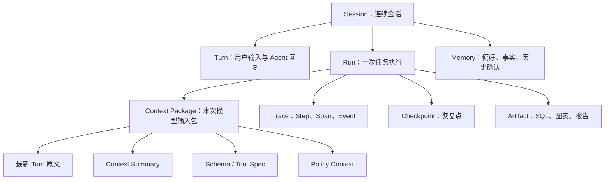

# 第38章 Agent 可观测性与运行诊断

---

Agent 的失败往往不在最终回答里显现，而是藏在上下文打包、Planner 决策、工具参数、权限策略、下游系统或产物生成的某一步。平台需要用 Trace、Span、事件、日志、指标和 artifact 引用把一次 Run 的证据链串起来。本章界定 Session、Run、Context Package、Trace、Checkpoint 和 Artifact 的边界，说明运行轨迹如何采集、失败如何诊断，以及线上 Trace 如何进入 AgentOps 的持续改进流程。一个 Agent 能给出答案，不代表它已经具备生产可用性。团队还要知道它为什么这么答，当时看到了哪些上下文，调用了哪些工具，SQL 用了什么口径，报告中的图表来自哪个 artifact，失败时停在哪一步。没有这些证据，排障只能靠猜。

以 DataAgent 为例。用户先问“本月经营性现金流为什么下降”，系统生成 SQL、执行查询、分析原因并出图。用户接着问“把华东区单独拆出来”，系统要记住上一轮的指标、时间和分析意图。用户再要求“生成一份给 CFO 的简报”，系统要复用前两轮结论、图表和口径。前端只看到三轮对话，后台却至少涉及多个 Run、多个 Tool Call、上下文摘要、Memory、图表 artifact 和报告审批。可观测性的目标是保存足够的证据链，而非把所有原文都落库。当结果出错、成本飙升、审批驳回或用户投诉时，平台要能回答：哪一步出了问题，为什么会这样，下一次如何避免。Agent 的失败常常藏在最终回答之前。用户看到一个结论，背后可能经过上下文检索、Planner 决策、工具调用、权限过滤、SQL 执行、图表生成和报告整理。任何一步出错，最终答案都可能看起来像模型问题。没有 Trace，团队只能从结果倒推原因，排障效率很低。

可观测性要把一次 Run 拆成可检查的证据。Session 说明用户交互，Run 说明任务，Trace 说明步骤，Artifact 说明中间产物，Checkpoint 说明恢复点。前端时间线和后台 Trace 指向同一组事件，用户看到的是进度，工程团队看到的是状态、参数、耗时和错误类型。DataAgent 尤其需要完整 Trace。SQL 选了哪个指标、用的是哪个数据版本、图表来自哪个查询、报告引用了哪个 artifact、用户追问时复用了哪些上下文，都要能还原。否则，数字错了时无法判断是语义层、NL2SQL、查询执行、解释生成还是上下文继承出了问题。

## 38.1 Session、Run、Trace 与 Artifact

Agent 运行会留下很多对象。最容易混淆的是 Session 和 Run。Session 是用户连续交互的会话，可以包含多轮 Turn，也可以触发多次 Run。Run 是一次具体任务执行，例如一次现金流分析、一次 SQL 查询、一次报告生成。Trace 描述 Run 里每一步怎么走；Checkpoint 用于中断恢复；Artifact 是图表、SQL、报告、Excel 等产物引用。

*表38-1：运行对象的职责边界。来源：本书整理。*

| 对象 | 主要职责 | 常见误用 |
|---|---|---|
| Session / Turn | 保存用户体验和多轮对话 | 用它替代执行轨迹 |
| Run | 表示一次可执行任务 | 把多轮会话都塞进一个 Run |
| Context Package | 记录模型当时实际看见什么 | 只保存完整聊天历史，不保存实际输入 |
| Trace | 还原 Step、Span、Event 的时间线 | 当成普通日志文本 |
| Checkpoint | 支持中断后恢复 | 当成长期记忆 |
| Artifact | 保存业务产物和证据引用 | 把大文件正文塞进 Trace |

这几个对象的边界要在存储模型中分开。Session 服务前端回看和用户体验；Run 服务执行和状态管理；Trace 服务回放和诊断；Checkpoint 服务恢复；Artifact 服务交付、下载和审计。把它们混成一张“大日志表”，早期实现简单，后期会在权限、生命周期和排障上付出代价。Context Package 尤其关键。模型没有“看到整个会话”，它看到的是 Runtime 当时组装出来的一包上下文。它可能包含最新用户原文、最近几轮对话、早期摘要、Memory、Schema、Tool Spec 和权限上下文。排查多轮错误时，必须看 Context Package，完整 Session 只能作为背景材料。

这些对象还对应不同的生命周期。Session 可能按用户体验和合规要求保留一段时间；Trace 可能进入观测系统，按调试和审计策略保留；Checkpoint 只在任务可恢复窗口内有效；Artifact 可能因报告归档长期保存，也可能因包含敏感数据很快过期。生命周期不分开，会让清理、导出和权限变得混乱。多租户平台还要给每类对象绑定租户和权限。一个运维人员可以看 Trace 的结构和错误类型，不一定能看工具原始输出；业务用户可以看自己的报告 artifact，不一定能看模型输入摘要；审计人员可以按流程查看脱敏后的证据链。可观测性要让正确的人在正确权限下看到足够证据，而非让所有人查看全部日志。

---

## 38.2 一次 Run 的必要记录项

一次可诊断的 Run，至少要记录身份、上下文、步骤、模型调用、工具调用、状态迁移、产物和成本。记录粒度不需要无限细，但要足够回答几个问题：任务从哪里来，模型看到了什么，选择了什么工具，工具拿到了什么参数，下游返回了什么，最终产物从哪里来。

*图38-1：Agent 运行轨迹采集示意图。来源：本书自绘。Alt text：一次 Run 沿执行流在创建、规划、工具调用、状态迁移等点埋下采集探针，数据汇入 trace 后端，箭头表示观测数据从执行各环节统一收集。*

*表38-2：Run 采集点与最小证据。来源：本书整理。*

| 采集点 | 最小证据 | 用途 |
|---|---|---|
| Run 启动 | `run_id`、`session_id`、任务类型、触发 Turn | 知道这次任务从哪里来 |
| Context 组装 | 来源、摘要版本、是否进入模型、token 估算 | 判断模型当时看见什么 |
| Model Call | 模型、Prompt 版本、输入输出摘要、token、延迟 | 分析模型质量和成本 |
| Tool Call | 工具名、参数摘要、权限上下文、返回摘要、错误 | 定位工具和参数问题 |
| State Event | 状态迁移、重试、等待人工、失败原因 | 还原运行时行为 |
| Artifact 写入 | 产物 ID、类型、hash、权限、存储位置 | 支持报告和审计 |

采集时要遵守一个原则：默认保存摘要、hash、版本和引用，按权限查看原文。Prompt、工具返回、数据库结果和文件内容都可能包含敏感信息。Trace 不应成为敏感数据的第二份副本。需要查看原文时，再通过对象存储、日志系统或业务系统按权限读取。一次失败 Run 不应只记录 `failed`。至少要记录失败步骤、错误类型、责任域、是否可重试和建议动作。例如 SQL 超时属于下游或查询成本问题；Policy 拒绝属于权限边界；Context Summary 漏掉约束属于上下文打包问题。这些分类决定修复方向。

采集还要控制字段稳定性。`run_id`、`trace_id`、`span_id`、`step_id`、`artifact_id` 和 `tenant_id` 是跨系统关联键，不应频繁改名。日志、指标、Trace 和报告 EvidenceRef 都依赖这些键跳转。字段命名稳定，比单次记录更详细更重要。OpenTelemetry 可以作为 Trace 的通用骨架。Agent 平台可以把模型调用、工具调用、检索、SQL 执行、报告生成分别映射为 Span，把状态变化、重试、审批和错误映射为 Event。对于模型输入输出、工具结果和 artifact，建议只保存摘要、hash 和引用，避免把 OpenTelemetry 后端变成大对象存储。采集点也不应只在成功路径。重试、拒答、人工接管、Policy 拒绝、上下文压缩、缓存命中、降级到小模型、切换异步任务，这些事件都影响诊断。很多线上问题并非工具失败，而是系统选择了某条降级路径却没有记录原因。

---

## 38.3 前端时间线与后台 Trace

用户看到的时间线应该少而稳定，例如“理解需求”“查询数据”“生成图表”“等待审批”。后台 Trace 会更细：一次“查询数据”可能包含 Schema Linking、SQL 生成、AST 校验、Policy 校验、OLAP 执行、结果截断和 artifact 写入。前端时间线服务用户体验，后台 Trace 服务诊断。两者不能互相替代。前端不应暴露每个内部事件，否则用户会被实现细节淹没；后台也不能只保存前端卡片，否则排障时无法定位具体失败点。Trace 不是模型内部推理原文。平台应保存可审计的决策摘要、工具调用、输入输出摘要、错误和产物引用，不应长期保存不适合展示或不应持久化的模型隐式推理。复盘需要足够证据，合规风险也要被控制住。

前端投影也要保持一致。用户看到的“查询数据”卡片，应能在后台 Trace 中找到对应的一组 Step；用户看到的“生成报告”卡片，应能跳到报告 artifact 和 EvidenceRef。前端不需要展示内部 Span，但每个前端状态都应有后台依据。否则用户反馈某一步“卡住”时，工程师无法定位对应 Trace 片段。后台 Trace 还要支持时间分析。一次 Run 变慢，可能是模型延迟、SQL 执行、Python 沙箱冷启动、图表渲染或等待人工造成的。Span 的开始和结束时间能拆出耗时组成，指标看板只能告诉我们总体变慢，Trace 才能说明慢在哪里。

---

## 38.4 多轮上下文的回放方式

多轮对话不会原封不动进入下一次模型调用。Runtime 会保留最新用户请求，保留最近几轮原文，把更早历史压缩成 Context Summary，大对象只放引用，再注入 Memory、Schema 和 Policy Context。回放时，要看这次 Run 的 Context Package。一个 Context Package 至少要记录：每个 item 的来源、是否进入模型、进入方式、摘要版本、引用对象和 token 估算。这样才能回答“模型是否看到了上一轮图表参数”“摘要是否漏掉华东约束”“Memory 是否错误注入了用户偏好”。

上下文压缩失败是 Agent 的常见问题。比如摘要漏掉了“只看华东区”，后续 SQL 可能查全公司；图表 artifact 只保留了图片，没有保留生成参数，后续“把刚才那张图重画”就会失败。Trace 中必须保存 `context_summary_id`、来源 Turn 和压缩策略，否则这类问题很难定位。Memory 也要与 Context Summary 分开。Summary 来自当前 Session 历史，Memory 可能跨会话复用；Summary 可以被重新生成，Memory 需要删除、过期和权限控制。把二者混在一起，会让删除和审计都变复杂。回放页面最好按证据链组织，不要按日志时间倒序堆叠。先展示用户问题和任务目标，再展示 Context Package，然后是 Planner 决策、工具调用、状态迁移、artifact 和最终回答。这样业务、工程和审计都能沿同一条链路查看，只是可见字段不同。

回放还要支持“当时版本”。Prompt 版本、模型版本、ToolSpec 版本、语义层版本、Policy 版本和报告模板版本都可能变化。历史 Run 应按当时版本解释，不能用当前配置重新理解。否则回放会变成“现在系统觉得当时发生了什么”，偏离原始运行事实。如果需要重跑某个 Run，应把它标记为新的调试执行。重跑用于验证修复，不能覆盖原 Trace。原 Trace 是事实记录，重跑 Trace 是实验记录。两者都应保留关联，避免把问题复盘和修复验证混在一起。

---

## 38.5 诊断路径

诊断通常从指标开始。成功率下降、P95 延迟升高、工具错误率升高、成本异常或用户点踩增加，都会把工程师带到一批异常 Run。然后沿 Trace 下钻：先看失败步骤，再看 Context Package、模型调用、工具参数、Policy 结果、下游日志和 artifact。

*表38-3：失败类别与修复方向。来源：本书整理。*

| 失败类别 | Trace 中的典型信号 | 修复方向 |
|---|---|---|
| 上下文错误 | Summary 漏约束、Memory 注入错误、artifact 参数缺失 | 调整上下文打包和摘要策略 |
| 意图理解失败 | Planner 选错任务类型，多轮澄清仍偏离 | 增加澄清和意图样本 |
| Schema Linking 失败 | 选错表、字段或 Metric 版本 | 改语义层、Glossary 和 Linker |
| 工具选择失败 | 调错工具或漏掉必要工具 | 改工具描述和 Planner 约束 |
| 参数失败 | schema 校验失败、SQL 报错、API 参数缺失 | 增加参数校验和错误回灌 |
| 下游失败 | 超时、5xx、熔断、资源不足 | 重试、降级或异步化 |
| 权限失败 | Policy 拒绝、字段脱敏、租户越界 | 改权限提示或审批路径 |
| 成本失控 | token 激增、循环重试、宽查询 | 加预算、缓存和步数限制 |

诊断时要避免一句“模型幻觉”盖住所有问题。很多看似模型胡说的结果，根因其实是语义层缺字段、工具描述不清、上下文摘要漏约束或权限反馈过于含糊。Trace 的价值就是把责任边界拆开。回放不等于重新跑模型。LLM 输出有随机性，回放的目标是还原当时的证据链：输入、Prompt 版本、工具结果、状态迁移、artifact 和最终回答。必要时可以重放某一步工具调用，但这属于调试动作，不是回放本身。根因分析要有 owner。上下文打包问题归 Runtime 或 Memory 策略，语义层问题归数据平台，工具参数问题归 Tool 和 Planner，权限拒绝归 Policy，模型输出质量归 Prompt、模型路由或评测集。Trace 不只描述错误，还要帮助团队判断谁该修。

诊断结果也要沉淀。一次事故复盘后，应把失败 Run 标记为样本，写入错误类别、修复动作和回归状态。下次同类问题出现时，团队不应重新从日志开始猜，而应能搜索历史同类 Trace 和修复记录。对于用户可见故障，诊断信息还要转化为可理解反馈。内部错误是 `SCHEMA_LINKING_AMBIGUOUS`，用户看到的可以是“销售额有多个口径，请选择运营 GMV 或财务 GMV”。观测系统记录技术细节，产品界面给出可行动说明，两者要共享错误码。

---

## 38.6 AgentOps 持续改进

可观测性如果只用于事故排查，价值还不够。Agent 平台需要把线上轨迹变成质量改进资产。失败 Run、超时 Run、高成本 Run、用户点踩、人工接管和审批驳回，都应该进入样本池，经过清洗后进入第39章的离线评测和第40章的在线评测。AgentOps 可以按一条简单链路运行：采集 Run 轨迹，筛选高价值样本，按失败类别聚类，沉淀成 benchmark，修复 Prompt、工具、语义层或策略，跑回归，灰度上线，再继续观察线上指标。这样 Trace 才会从“日志”变成“工程资产”。例如某批现金流分析的用户点踩上升。指标先发现质量退化；Trace 显示多个失败样本都在 Schema Linking 阶段选错现金流口径；团队把这些样本加入离线评测，补充字段描述和样例 SQL；回归通过后灰度上线；上线后继续观察同类任务成功率、Judge 分数、用户反馈和 token 成本。整个过程都依赖可追溯的 Run 证据。

样本治理要避免只收失败。成功但成本异常的 Run、用户手动大改报告的 Run、HITL 驳回后修正成功的 Run，也很有价值。它们能暴露隐性质量问题：回答没错但太慢，报告可用但需要大量人工修改，建议方向对但证据不足。AgentOps 需要这些中间状态，不能只记录成功和失败。评测样本还要脱敏和最小化。线上 Trace 不能直接原样进入 benchmark，尤其是包含客户数据、PII、商业敏感字段时。样本沉淀应保留任务结构、错误类别、必要输入摘要、工具结果摘要和期望行为；能用合成数据替代的，就不要带真实明细。AgentOps 最终要回到发布治理。模型、Prompt、工具描述、语义层和 Policy 的任何变更，都应能关联到修复了哪些样本、回归了哪些场景、灰度期间哪些指标没有退化。没有这条链路，团队只能凭感觉判断一次改动是否安全。

样本进入评测集之前，还要经过一次“证据最小化”。Trace 中常有用户原文、业务字段、工具参数和下游返回摘要，并非每个字段都适合长期保留。平台可以把样本拆成三层：第一层是可公开复用的任务结构和期望行为，第二层是仅内部可见的脱敏工具结果，第三层是需按审批临时查看的原始证据。评测集默认只保留前两层，第三层通过 EvidenceRef 回查。问题仍可复现，线上日志也不会被无控制地复制到评测系统。

采样策略也要写清楚。全量保存所有 Trace 往往成本高、风险大；只保存失败样本又会让团队看不到正常路径。比较稳妥的做法是：成功 Run 低比例采样，高风险任务和新版本灰度阶段提高采样比例，失败、超时、人工接管和用户点踩全量保留。采样规则本身应版本化，因为一次发布前后的采样比例不同，会影响团队对质量趋势的判断。AgentOps 还需要固定的复盘入口。每次质量问题关闭时，复盘记录至少应包含关联 Trace、失败类别、修复 PR、回归样本、上线版本和观察窗口。没有这些字段，修复很容易停留在“改了一下 Prompt”的层面。平台要把一次临时排障转成可追踪的质量资产，下一次同类问题出现时，工程师可以沿历史样本和修复记录继续分析，不必重新翻日志。

Trace 的产品化也很重要。工程师需要看到 Span、错误码和参数摘要；业务负责人需要看到任务阶段、报告版本和审批记录；审计人员需要看到证据链和权限决策。三类视图可以来自同一条 Trace，但可见字段不同。若只做工程日志，业务和审计仍然无法自助复盘；若只做产品时间线，工程排障又缺少足够细节。采样策略要和发布节奏联动。新模型、新 Prompt、新工具版本和新语义层发布时，应提高相关任务的 Trace 采样比例；版本稳定后再降低成功样本采样，保留失败、超时、人工接管、用户点踩和高成本 Run。这样既控制存储和隐私风险，也能在最容易退化的窗口保留足够证据。

---

## 38.7 Trace 进入事故定位的使用方式

Trace 的价值不在于记录更多日志，而在于把用户看到的结果和后台实际执行链路接起来。一次 DataAgent 事故通常会跨越前端、Runtime、Planner、工具、模型网关、数据仓库和报告产物。若每一层都有自己的日志，但没有共同的 `run_id`、`trace_id` 和 artifact 引用，团队仍然无法快速定位问题。前端事件要进入同一条诊断链。用户点击停止、展开工具卡、修改筛选条件、提交差评、批准报告，这些动作会改变任务状态或质量判断。只记录后端 span，看不到用户实际看到的界面；只记录前端埋点，又看不到工具和模型调用。Conversation API 应把前端事件和后台 Run 关联，至少保留事件类型、时间、用户、页面状态摘要和 trace 关联。

采样策略要按风险分级。普通低风险问答可以只保留摘要和关键错误，高风险工具调用、审批、导出、报告发布应保留更完整的结构化证据。采样不能破坏审计要求：即使不保存完整 prompt，也要保存足够判断责任边界的字段，如工具版本、策略命中、数据域、错误码和产物引用。事故复盘时，Trace 应回答四个问题。用户问了什么，系统看到了哪些上下文，实际调用了哪些工具和模型，最终产物依据哪些证据生成。若 Trace 不能回答这四个问题，它就只是性能监控；能回答这些问题，才是 AgentOps 的基础。

## 38.8 前后端 Trace 的关联方式

Agent 可观测性不能只停留在后端日志。用户看到的是前端时间线：输入问题、等待、流式输出、工具卡片、审批按钮、错误提示和最终产物。后端看到的是 Run、Step、模型调用、工具调用、队列任务和数据库访问。两套视图如果没有统一标识，事故排查会在“用户说页面卡住”和“后端看起来正常”之间来回转。前后端关联至少需要保存 session_id、run_id、step_id、message_id 和 artifact_id。前端每次展示状态变化时，应当带上对应的后端事件标识；后端每次发送 SSE 或 WebSocket 事件时，也应记录前端可见状态。这样用户截图、客服反馈或产品埋点才能回到具体 Run。对于流式输出，还要区分模型 token、工具进度、系统提示和最终消息，避免把所有增量内容混成一条文本日志。

关联方式还要考虑隐私字段。前端可能展示脱敏后的文本，后端 Trace 保存的是原始字段或加密字段。平台需要在 Trace 中标记字段可见范围，诊断人员不应因为排查问题而获得超出职责的数据。可观测性要在必要的人、必要的时间、必要的范围内提供足够证据，而不是把所有内容都记录下来给所有人看。

## 38.9 采样、保留与事故复盘

全量 Trace 的成本很高，尤其是包含长上下文、文档片段、图表产物和工具返回时。平台需要设计采样和保留策略。普通成功请求可以保留摘要和关键事件，高风险任务、失败任务、人工介入任务和用户投诉任务应当保留完整证据包。采样策略不能只按流量比例，还要按业务风险、模型版本、工具类型和灰度状态调整。保留周期也要分层。运行诊断需要短期完整数据，质量评测需要中期样本，合规审计可能需要长期不可变记录。三类用途对字段粒度和访问权限不同，不能简单把 Trace 永久保存。对于包含敏感数据的 Trace，应当支持脱敏视图和受控解密；对于被纳入评测集的失败样本，应当记录脱敏版本和原始版本的对应关系。

事故复盘时，Trace 应当帮助团队重建因果链，而非只提供日志搜索。一次复盘至少要回答：用户意图是什么，系统选择了哪条计划，调用了哪些工具，证据来自哪里，在哪一步发生偏差，偏差有没有被校验器发现，用户最终看到了什么。复盘结论要能回写到语义层、工具治理、Prompt、评测样本或产品交互中。否则可观测性只是事后查看，不会推动系统变好。

## 38.10 Run 回放的工程边界

Run 回放不等于重新执行。很多工具调用有副作用，很多外部系统状态已经变化，很多模型输出也无法完全复现。生产系统中的回放应当优先复现决策过程，而非强行复现外部世界。平台可以使用原始事件、模型输出、工具响应和 Artifact 展示当时发生了什么；只有在安全沙箱或只读环境中，才考虑重新执行部分步骤。回放界面应当面向不同角色。开发者需要看 Prompt、模型响应、错误堆栈和工具参数；业务审核人需要看用户问题、证据、审批记录和最终产物；安全团队需要看权限、脱敏、外部调用和异常访问。把所有信息堆在一个日志页面里，会让每个角色都难以使用。Trace 数据可以统一存储，但视图应按责任划分。第38章是前面许多章节的交汇点。第22章的 Runtime 事件、第23章的工具调用、第33章的语义层版本、第34章的 SQL、第35章的 Python 产物、第36章的报告 EvidenceRef，都应该能在 Trace 中找到位置。读者可以把 Trace 理解为 Agent 平台的运行账本。没有这本账，系统即使能回答问题，也很难被企业长期信任。

## 38.11 Trace 与评测样本的互相转化

Trace 还涉及排障材料，也应该成为评测样本的来源。线上失败、人工拒绝、用户追问、工具超时、策略拦截和报告修订，都可以从 Trace 中抽取为样本。抽取时要保留任务意图、上下文、关键证据、失败阶段和期望行为。这样评测集才能跟随真实使用演进，而非长期停留在上线前手工编写的题目。评测结果也要回写到 Trace 视图。开发者查看一次失败 Run 时，应当看到它是否已经进入评测集、修复版本是否通过、同类问题是否仍在发生。否则评测和可观测会变成两套系统：一个负责离线分数，一个负责线上排障，彼此无法闭环。Agent 平台需要把这两套证据连起来。样本转化还要处理隐私。线上 Trace 可能包含用户数据、内部文档和敏感工具结果，不能直接复制进评测集。平台应支持脱敏、摘要、证据替换和访问控制。可复现性和合规性要同时考虑，这也是企业 Agent 评测比普通模型评测更复杂的地方。

## 38.12 可观测性的组织使用方式

Trace 系统如果只给工程师使用，价值会被限制。业务负责人需要看任务是否达成，客服需要定位用户反馈，安全团队需要检查越权和注入，数据团队需要排查指标口径，平台团队需要观察模型、工具和队列。不同角色看到的字段、粒度和操作入口应当不同，但都来自同一套运行事实。组织使用方式决定了 Trace 的产品形态。工程视图可以展示 Prompt、请求体、错误栈和耗时；业务视图应展示用户目标、关键证据、审批记录和最终产物；安全视图应突出权限、脱敏、外部调用和策略命中。若只提供原始日志，非工程角色很难参与复盘；若只提供业务摘要，工程团队又无法定位问题。可观测性最终要进入运营机制。每周质量复盘、每月场景评审和重大事故复盘都应使用 Trace 作为事实来源。组织真正使用这套证据后，Trace 才会成为平台治理的基础设施，而不再只是昂贵的日志系统。

## 38.13 Trace 字段的稳定性治理

Trace 字段本身也需要治理。Run、Step、Tool Call、Artifact、EvidenceRef、Policy Decision 这些字段一旦被评测、审计、客服和运营系统使用，就不能随意改名或改变含义。很多平台早期把 Trace 当成调试日志，字段随着代码迭代不断变化，等到需要做质量分析和合规审计时，历史数据已经难以比较。稳定性治理可以从字段字典开始。每个字段说明来源、含义、可见范围、保留周期和是否包含敏感信息。字段新增时，说明下游是否需要适配；字段废弃时，保留迁移期和兼容映射。对于关键字段，例如 `run_id`、`step_id`、`tool_name`、`policy_version`、`semantic_version`、`artifact_id`，应当作为平台契约维护，而非普通日志字段。字段稳定还关系到跨章节能力。第34章的 SQL 回放、第35章的代码审计、第36章的报告证据、第51章的 Guardrails 策略，都依赖 Trace 字段把证据串起来。若字段语义不稳定，后续看板和评测会出现口径漂移。可观测性的工程质量，首先体现在这些基础字段能否长期可信。

## 38.14 事故分级与响应流程

Agent 事故需要分级响应。一次普通回答错误、一次高风险工具误调用、一次敏感数据泄露和一次大面积服务不可用，不应使用同一套处理流程。分级依据可以包括用户影响、数据敏感度、是否发生外部副作用、是否可恢复、是否涉及合规义务和是否持续发生。分级越清楚，团队越容易在事故发生时采取合适动作。Trace 在事故响应中承担事实记录。值班人员应能快速看到事故涉及的 Run、用户、租户、模型版本、工具、策略、数据域和时间范围。对于高风险事故，还要冻结相关 Trace，避免后续清理或采样策略删除关键证据。事故处理后，复盘结论要回写到样本库、策略配置、工具治理或文档中。事故响应流程也要避免只追求技术修复。用户是否需要被通知，报告是否需要撤回，工具是否需要临时下线，数据是否需要重新脱敏，业务流程是否需要补偿，都是平台需要支持的动作。Trace 提供事实，但组织流程决定事实如何被处理。第38章因此连接了工程可观测和第53章的组织运营。

Trace 设计不能只为日志系统服务。它要能支撑事故定位、评测样本构造、成本归因和用户解释。字段太少，后续无法分析；字段太多但没有结构，排障时仍然难用。关键是把 Run、Step、Tool Call、Artifact 和审批事件串成一条可查询链路。前端也要利用 Trace。长任务暂停、等待审批、工具失败或结果生成中，用户需要看到明确状态。若前端只显示加载动画，用户会重复提交或误以为系统故障。把后台状态翻译成用户可理解的时间线，是 Agent 产品体验的一部分。AgentOps 的持续改进也依赖 Trace。高频失败工具、常见澄清问题、成本异常步骤、人工驳回原因，都来自运行记录。没有这些数据，团队只能凭感觉优化 Prompt 或模型。

Trace 字段要有稳定命名。不同 Agent 如果把工具名、错误码、模型版本和 artifact 引用写成各自格式，后续分析会很困难。平台应提供统一事件 schema，让业务应用只补充领域字段。统一 schema 是 AgentOps 的基础设施。采样策略也要谨慎。高频低风险任务可以采样保存详细 Trace，高风险任务和失败任务应完整保存。若为了节省存储随机丢掉关键失败链路，事故发生时就会缺证据。存储成本和审计价值需要按风险分级平衡。Trace 中的敏感信息要脱敏或引用化。SQL 结果、客户明细、合同条款、用户输入都可能包含敏感数据。平台可以保存 artifact 引用、hash、摘要和权限标签，而非把所有原文直接写入日志。可观测性不能变成新的数据副本泄露点。

诊断路径应从症状回到步骤。用户说“答案错了”，平台要能依次查看上下文、检索、规划、工具、权限、生成和展示。每一步都有证据，排障就能从争论变成定位。没有证据，团队会反复猜测模型、数据和业务口径。Trace 也能帮助产品改进。用户在哪些状态等待最久，哪些错误最难理解，哪些任务最常被取消，哪些 artifact 最常被下载，都能说明体验问题。可观测性不是只给工程团队看的后台能力。Trace 与日志、指标、事件要各司其职。日志记录细节，指标观察趋势，事件描述状态变化，Trace 串起一次任务。把所有内容都写进日志，排障时要靠搜索；只做指标，又看不到单次失败路径。Agent 平台需要这几类信号互相引用，而非互相替代。

Artifact 引用是 Trace 中很重要的一环。SQL 结果、图表、报告草稿、上传文件解析结果和审批快照，通常体积较大，也可能包含敏感信息。Trace 保存 artifact_id、hash、版本和权限标签，详细内容放在受控存储中。这样既能回放任务，又不会把所有数据复制进可观测系统。前后端关联要从请求开始。用户点击按钮、前端生成 client_event_id，后端创建 run_id，之后每个 SSE 事件和用户操作都带着关联标识。用户反馈“页面卡住”时，团队可以从前端事件跳到后端 Run，再看到工具和模型调用。没有这种关联，前端和后端会各自排障。Trace 还要支持对比。两个模型版本、两个 Planner 策略、两次相同问题的执行路径，可以并排查看。对比能帮助团队发现新版本少查了一个指标、多调用了一个工具，或在同一错误上重试次数增加。单条 Trace 说明发生了什么，对比 Trace 说明变化来自哪里。

隐私要求会影响 Trace 保留期限。高风险任务需要较长审计期，低风险临时问答可以较短保存；包含个人信息的字段需要脱敏或加密。保留策略应写入平台规则，并和法务、安全、业务一起确认。可观测性越完整，数据治理越要跟上。Trace 的价值最终体现在闭环。一次事故定位后，团队应把对应 Trace 转成评测样本、告警规则或产品改进。若 Trace 只用于查一次问题，价值有限；能持续进入改进流程，才是 AgentOps。Trace 查询体验也要设计。工程师需要按 run_id、用户、工具、模型版本、错误类型和时间范围检索；业务运营需要看任务状态和失败原因；安全团队需要查敏感数据访问和高风险工具调用。不同角色看到的 Trace 视图应不同，避免把敏感细节暴露给不需要的人。

异常聚合能帮助团队从单次事故走向系统改进。平台可以按错误码、工具、模型、租户和章节任务聚合失败，识别高频问题。若一类错误每天出现，只是每次被单独处理，平台质量不会提升。聚合结果应进入 backlog 和评测集。Trace 与告警要相互连接。告警告诉团队某个指标异常，Trace 告诉团队具体 Run 发生了什么。告警中带上示例 run_id、最近变更和影响范围，排障会快很多。没有示例，团队只能从海量日志里重新搜索。在数据敏感场景中，Trace 访问本身也要审计。谁查看了某次 Run，是否导出了 artifact，是否访问了原始工具结果，都应有记录。可观测系统越强，访问控制越不能松。

## 38.15 Trace 采样、隐私字段与事故复盘

Trace 不能无限制保存所有内容。企业 Agent 的运行记录可能包含用户问题、检索结果、工具参数、SQL、数据摘要、审批意见和生成产物，其中不少字段具有隐私或商业敏感性。平台要同时满足两件事：事故发生时能重建关键路径，日常运行时不把敏感内容复制到过多系统。采样策略、字段分级和脱敏规则因此是 Trace 设计的一部分。

采样不能只按比例。高风险工具调用、写操作、审批等待、权限拒绝、评测失败、用户点踩和安全拦截，应进入高保真记录；普通低风险问答可以只保留摘要和指标。字段也要分级：`run_id`、工具名、状态、错误码、耗时可以长期保存；用户输入、SQL、文档片段、数据结果应按敏感级别脱敏或缩短保留；高敏字段可以只保存指纹和引用。这样 Trace 既能支撑排障，也不会成为新的数据泄露面。

事故复盘需要一条可读链路。复盘材料应能回答：用户提出了什么任务，系统选了哪些工具，在哪一步失败，失败前看到哪些证据，是否有人审批，是否触发降级或回滚，哪些产物需要撤回或标记。若 Trace 只能展示技术 span，业务 owner 和安全团队很难参与复盘；若 Trace 只展示业务摘要，SRE 无法定位系统故障。第38章的目标是把两种视角连接起来，让运行证据既能服务工程排障，也能服务责任判断。

## 38.16 Trace 质量的验收样本

Trace 本身也需要验收样本。很多平台只在功能验收时检查 Agent 是否回答正确，却没有检查回答背后的运行记录是否完整。一次 DataAgent 查询应能看到用户问题、Question Frame、语义层版本、SQL 计划、执行引擎、权限裁剪、结果 artifact、报告段落和人工复核。一次工具写操作应能看到意图识别、参数校验、审批状态、执行结果、补偿动作和用户反馈。若 Trace 缺少这些字段，事故发生后很难补回。

验收样本应覆盖成功、失败和降级三类路径。成功路径证明 Trace 能支持复盘；失败路径证明错误类型和恢复动作被记录；降级路径证明系统不是静默改变行为。比如一个查询因扫描量过大被拦截，Trace 应记录预估扫描量、阈值、拦截策略和用户看到的提示。一个报告因证据不足进入人工复核，Trace 应记录缺失证据、复核人和最终处理。这样 Trace 才能服务工程排障、合规审计和产品改进。

Trace 质量还要进入发布门禁。新工具、新模型路由、新前端组件和新报告模板都可能改变运行记录。每次发布时，平台应跑一组 Trace 验收样本，确认关键字段没有丢失、隐私字段没有误暴露、前后端事件仍能对齐。可观测性不是上线后的附加项，它是企业 Agent 能否被运营和问责的前提。

## 38.17 Trace 访问控制与复盘授权

Trace 越完整，访问控制越重要。一次 Run 可能包含用户原文、检索片段、SQL、工具参数、审批意见、图表数据和报告草稿。工程师排障需要足够上下文，业务 owner 需要看到任务结果和责任链，安全团队需要查看策略命中和敏感访问，合规人员需要审计证据。不同角色的需求不同，不应共享同一份无差别日志视图。

平台应把 Trace 字段按敏感度和用途分层。基础运行字段，如 `run_id`、状态、耗时、工具名、错误码，可以给更广泛的运营角色查看；用户输入、SQL、数据摘要和工具返回应按租户、数据域和审批状态控制；原始明细、未脱敏文档和高风险审批意见，只能通过临时授权查看。这样排障不会变成扩大数据访问的理由。

复盘授权也要可审计。谁查看了某次 Trace，查看了哪些字段，是否导出了 artifact，是否打开了原始工具结果，都应进入访问日志。高风险事故中，Trace 可能成为证据材料；证据材料本身的访问同样需要留痕。否则可观测系统会成为新的敏感数据入口，反而削弱平台治理。

早期可以实现两级视图：运营摘要和受控详情。运营摘要展示任务阶段、错误类型、证据引用和用户可见结果；受控详情展示 Prompt、SQL、工具参数、原始返回和调试信息。用户从摘要进入详情时，需要说明原因并记录访问。这个机制不会妨碍排障，反而能让安全、合规和业务团队更愿意把 Trace 作为共同事实来源。

## 38.18 Trace 字段变更的兼容验收

Trace 一旦被评测、审计、成本、支持和安全复盘共同使用，字段变更就不能只按普通日志调整处理。新增字段、重命名字段、改变枚举值、压缩原始内容、调整脱敏规则，都会影响下游系统和历史记录解释。比如 `tool_status` 的含义从“工具返回成功”改成“业务动作成功”，事故统计和补偿逻辑都会被影响。若没有兼容验收，Trace 会随着代码版本漂移，最后失去跨时间比较能力。

字段变更前，应先列出消费者。Eval 可能使用失败阶段，FinOps 可能使用 token 和租户字段，安全团队可能使用策略命中，业务支持可能使用用户可见状态，合规团队可能使用 EvidenceRef 和审批记录。每个消费者都要知道字段含义是否变化、历史数据如何映射、新旧字段并存多久、查询和看板何时切换。Trace 字段不是工程团队内部日志，它已经是平台契约。

兼容验收要包含历史 Run。发布新字段后，平台应抽取旧 Run、新 Run、失败 Run、降级 Run 和高风险 Run，确认它们在同一视图中仍能被解释。若新字段只在新 Run 中存在，视图要明确展示缺失原因，而不是把历史记录误判为未发生。若脱敏规则变化，受控详情视图要确认授权流程仍然有效。这样 Trace 才能既支持演进，又保留审计可信度。

早期可以给 Trace 字段建立简单的变更流程：字段字典记录含义、来源、敏感度、保留期和消费者；字段变更必须带迁移说明和验收样本；废弃字段保留兼容窗口；重大变更写入发布记录。这个流程看起来像数据治理，实际是 Agent 平台可观测性的工程底座。没有稳定字段，后续的评测、事故复盘和组织运营都会变成临时查询。

## 38.19 Trace 数据质量的运营复核

Trace 本身也需要质量复核。很多团队上线可观测性后，会默认 Trace 可信，但实际运行中常见问题很多：字段缺失、时间戳不一致、前端事件和后端 Run 对不上、错误码没有分类、敏感字段脱敏不完整、采样规则导致关键失败样本丢失。若 Trace 数据质量不足，事故复盘和评测样本都会被误导。

运营复核要检查 Trace 是否能回答真实问题。一次用户投诉能否定位到具体 Run；一次工具失败能否看到参数、返回和重试；一次审批超时能否看到通知和回执；一次 DataAgent 报告争议能否看到 SQL、EvidenceRef 和发布状态；一次成本异常能否看到模型路由和 token 消耗。若 Trace 只能展示技术调用树，却无法解释业务任务，说明字段设计还没有服务平台治理。

Trace 质量还要有抽样机制。平台可以每周抽取成功任务、失败任务、人工接管任务、降级任务和高成本任务，检查字段完整性、时间线顺序、隐私脱敏、证据引用和回放可用性。抽样结果应反馈给 Runtime、Gateway、Tool Registry、DataAgent 和前端团队。字段缺失不是观测团队自己的问题，它通常说明某个生产链路没有把责任和证据写出来。

早期可以建立 Trace 质量评分。评分不追求复杂，可以先看五项：是否能关联用户任务，是否能还原状态变化，是否能定位失败原因，是否能复核证据，是否满足隐私要求。低分样本进入修复队列。这样 Trace 不会只是事故发生后的查询工具，而会成为持续校准平台运行事实的数据资产。

## 38.20 Trace 数据质量与字段治理

Trace 本身也需要数据质量治理。很多平台上线可观测后，会发现 Trace 缺字段、字段含义不一致、不同 SDK 命名不同、敏感内容没有脱敏、事件时间戳不可靠。若 Trace 数据质量不稳定，事故复盘和评测样本都会失真。可观测系统不能只负责采集，还要管理字段口径。

字段治理要从最小必填集开始。每个 Run 至少要有 `run_id`、`tenant_id`、用户角色、模型版本、Prompt 版本、工具版本、语义层版本、权限策略版本、输入证据、输出 artifact 和错误状态。高风险动作还要记录审批、策略命中和导出状态。字段缺失时，平台应能在发布门禁中发现，而不是等事故复盘才发现 Trace 无法使用。

早期可以建立 Trace 字段字典和采样校验。字段字典说明来源、类型、脱敏规则、保存时间和下游用途；采样校验定期检查真实 Run 是否满足要求。这样 Trace 会从排障日志扩展为评测、合规、安全和成本治理共用的数据基础。

## 38.21 Trace 证据的产品化消费

Trace进入生产后，新增能力不能只看功能是否可用，还要看运行证据能否被不同角色复用。平台需要把前端事件、后端 Step、工具回执、评测样本、隐私字段和复盘结论记录成稳定字段，并和发布单、Trace、评测样本以及事故记录关联起来。这样一次线上问题发生后，团队可以沿着同一组事实判断影响范围、责任归属和修复顺序，而不是在模型日志、业务日志和人工说明之间来回拼接。

这类证据还要服务相邻章节的能力。它和第39章 Eval、第50章安全和第52章合规相连：上游能力提供输入假设，下游能力使用执行结果，治理能力负责保存证据和复审结论。若这些材料没有统一编号和版本，章节里讨论的工程能力在生产中会被拆散。业务 owner 只能看到用户投诉，平台 owner 只能看到系统错误，安全或合规团队只能看到事后说明，最后很难判断问题到底来自数据、模型、工具、流程还是组织责任。

生产环境中常见的风险包括Trace 只给工程师使用、业务 owner 看不到用户影响、安全团队拿不到例外记录。这些问题在演示阶段不明显，因为演示通常只覆盖成功路径；上线后，用户会带来边界问题、重复请求、权限变化和长时间运行状态。平台团队应把失败样本纳入发布节奏，记录哪些样本需要阻断发布，哪些样本可以通过降级处理，哪些样本需要业务 owner 接受剩余风险。

Trace 应提供面向角色的证据视图，让排障、评测、合规和运营使用同一组事实。这份记录不需要复杂，但要包含时间、版本、owner、样本、处置动作和下次复查条件。没有这些字段，复盘会停留在口头经验；有了这些字段，平台才能把一次问题转成后续发布、评测和培训材料。

早期平台可以从少量高风险场景开始。先选择调用量高、业务影响大或涉及敏感数据的路径，要求每次变更都留下证据包，再逐步推广到普通场景。这样章节里的能力不会停留在概念层，而会成为可运行、可解释、可退回的工程系统。

## 本章小结

Agent 可观测性记录的是一次任务的证据链，不是单次 API 请求日志。Session、Run、Context Package、Trace、Checkpoint 和 Artifact 的边界要分开，否则后续诊断会混淆用户会话、任务执行、上下文输入和业务产物。Trace 要能回答模型当时看到了什么、调用了什么工具、产物从哪里来。失败诊断也要能归因到上下文、规划、工具、数据、权限、下游或成本中的具体环节。AgentOps 的价值，在于把线上失败变成可评测、可修复、可回归的工程资产。

## 参考文献

OpenTelemetry. (n.d.). *Documentation*. [https://opentelemetry.io/docs/](https://opentelemetry.io/docs/)

OpenTelemetry. (n.d.). *Semantic conventions for generative AI systems*. [https://opentelemetry.io/docs/specs/semconv/gen-ai/](https://opentelemetry.io/docs/specs/semconv/gen-ai/)

Langfuse. (n.d.). *Documentation*. [https://langfuse.com/docs](https://langfuse.com/docs)

Arize Phoenix. (n.d.). *Documentation*. [https://docs.arize.com/phoenix](https://docs.arize.com/phoenix)
