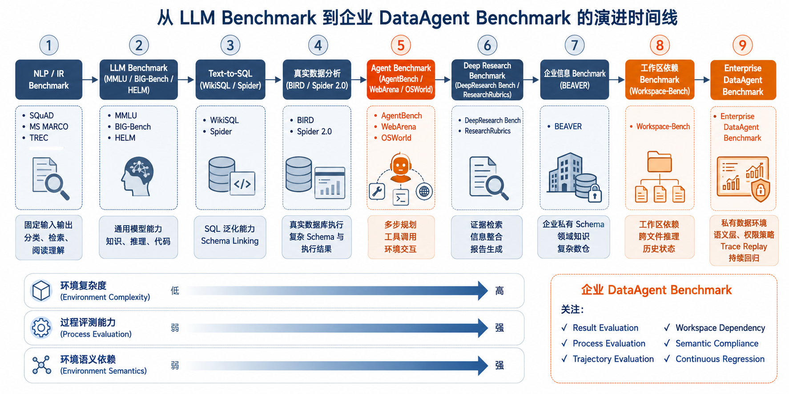
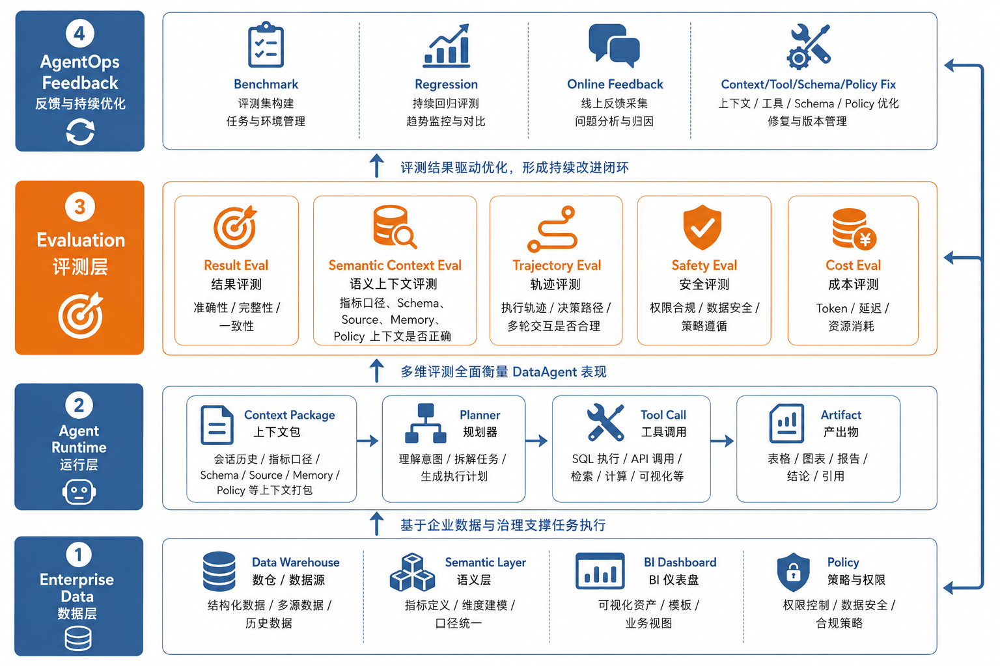
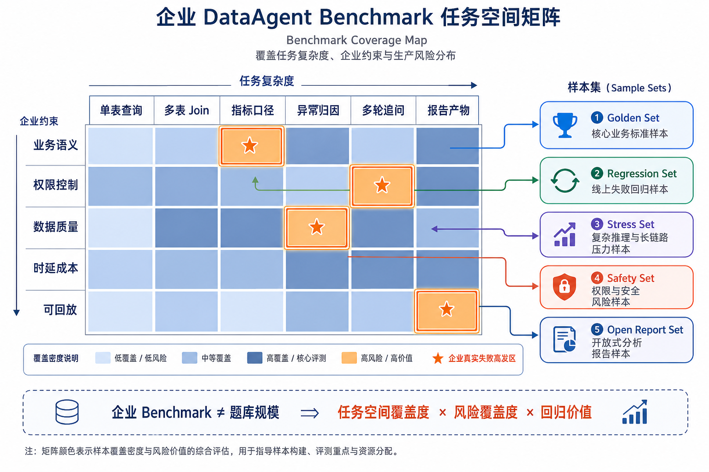
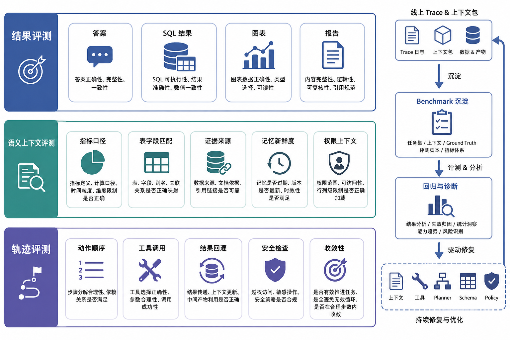

# 第39章 企业级 DataAgent 评测体系设计与 Benchmark 构建

---

企业级 DataAgent 评测要同时看答案、上下文和执行轨迹。SQL 可能蒙对了口径，解释可能错了归因，过程可能绕了远路，数字却恰好正确。任务集、黄金答案、SQL 正确性、业务可用性和 benchmark 运维共同构成长期质量基线。评测集应按任务空间设计，并随着业务、模型、工具和权限策略一起演进。某个 DataAgent 在演示里回答了 100 道经营分析题，人工看下来大多“像是对的”。上线评审时，数据负责人追问三件事：SQL 是否真的按统一口径执行；答案引用的数据版本是否可复现；一旦答错，能不能定位到模型、语义层、工具还是权限策略。Benchmark 要把这些问题变成可重复执行的质量基线。它的评估范围包括最终答案、上下文准备、执行轨迹、权限约束和发布门禁。否则，评测只能证明系统会说话，不能证明系统值得上线。

DataAgent 评测比普通问答评测更复杂，因为它需要同时看最终答案，也要看生成答案的路径。SQL 可能碰巧返回正确数字，但使用了错误口径；解释可能语言顺畅，却把相关性说成因果；轨迹可能绕开权限控制，结果仍然看起来正确。只用人工阅读最终回答，很难发现这些问题。企业评测集应来自真实任务空间，而非临时凑题。经营分析、指标解释、异常归因、数据导出、图表生成和报告撰写，每类任务都有不同风险。问题、黄金答案、允许的 SQL 模式、指标口径、权限限制和可接受解释，都要一起定义。这样 benchmark 才能成为发布门禁，而不会退化成演示材料。一个可靠的评测体系还要接受变化。业务口径会更新，语义层会调整，模型版本会替换，工具权限会收紧。评测集如果长期不维护，会逐渐偏离生产环境。DataAgent 的 benchmark 应当像数据产品一样运营，有版本、负责人、覆盖率和失效处理流程。

## 39.1 Benchmark 及其向企业 DataAgent 的演进

Benchmark 可译为“基准测试”。在 AI 系统里，它不是题库的同义词。一个合格的 benchmark 至少包含四件事：明确的任务定义、可复现的数据集、统一的评测流程和可解释的指标。它要回答“测什么、用什么测、怎么测、分数怎么解释”。如果只有一批问题和答案，却没有任务边界、数据版本、评测脚本和指标口径，那更像练习题，不能用于工程回归和上线决策。

在传统机器学习和早期 NLP（Natural Language Processing，自然语言处理）阶段，benchmark 多用于单点能力评测。例如分类任务看准确率，机器翻译看 BLEU（Bilingual Evaluation Understudy，一种用词语重合度衡量译文接近参考译文的指标），阅读理解看 EM（Exact Match，答案完全匹配率）和 F1（同时考虑答案词语命中率和覆盖率的指标），检索任务看 Recall（召回率，相关内容被找回的比例）、MRR（Mean Reciprocal Rank，正确结果排得越靠前分数越高）和 NDCG（Normalized Discounted Cumulative Gain，衡量排序结果质量的指标）。这些 benchmark 的共同特点是输入输出相对固定，评测流程容易复现。它们适合比较模型基础能力，但很难回答“模型能不能完成一个真实业务任务”。LLM 出现后，benchmark 开始覆盖更广的通用能力。MMLU (Hendrycks et al. 2021)、BIG-Bench (Srivastava et al. 2023)、HELM (Liang et al. 2023)、C-Eval (Huang et al. 2023) 和 CMMLU (Li et al. 2023) 等评测，把知识、推理、数学、代码和安全放进统一框架。它们让同一个模型可以在多类任务上横向比较，但评测对象仍然主要是“模型本身”，没有覆盖带工具、带数据、带权限和运行轨迹的 Agent 系统。

评测随后向 Agent benchmark 延伸。SWE-bench (Jimenez et al. 2024) 从真实 GitHub issue 出发，要求系统理解代码仓库、定位缺陷、修改文件并通过测试，因此比“写一道算法题”更接近开发者 Agent 的真实工作流。它的影响不只在代码领域，也在于把评测对象从“回答是否正确”推进到“能否在可执行环境中完成一个多步任务”。AgentBench (Liu et al. 2024)、WebArena (Zhou et al. 2024) 和 OSWorld (Xie et al. 2024) 也把评测对象推向环境交互、工具调用、状态管理和结果验证。当 LLM 被用于数据分析，评测进一步演化到 Text-to-SQL。WikiSQL (Zhong et al. 2017)、Spider (Yu et al. 2018) 等 benchmark 把自然语言问题、数据库 schema 和 SQL 生成连接起来。Spider (Yu et al. 2018) 的重要意义在于跨数据库泛化：模型不能记住一套表结构就结束，还要理解新的 schema。BIRD (Li et al. 2023)、Spider 2.0 (Lei et al. 2024) 又把任务推向更真实的数据分析环境：数据库更大，schema 更复杂，执行结果更重要，模型要面对更接近生产的数据连接和查询难度。

企业 DataAgent 比 Text-to-SQL 模型复杂得多。它面对的是私有数仓、语义层、BI 资产、权限策略、历史对话、工具调用和产物交付。用户问“本月经营性现金流为什么下降”，评测对象不只包括 SQL 是否生成正确，还包括指标口径是否理解、数据源是否选对、工具执行是否成功、分析结论是否可复核、图表和报告是否合规，以及整个过程是否能通过 trace 回放。Deep Research benchmark 进一步把评测推向开放式产出。DeepResearch Bench (Du et al. 2025)、ResearchRubrics (Sharma et al. 2025) 等强调多轮检索、证据整合、报告质量和引用可信度，补上了开放式研究任务的评测维度。这些工作共同说明：复杂 Agent 的质量不只藏在文本里，也藏在研究路径、证据使用、上下文整合和工具调用里。企业 DataAgent 可以重点关注两类方向：BEAVER (Chen et al. 2024) 把 Text-to-SQL 拉回企业环境，关注私有企业数据仓库、真实查询日志、复杂 schema、领域知识和可诊断子任务；Workspace-Bench 1.0 (Tang et al. 2026) 关注真实工作区中的文件依赖、跨文件检索、上下文推理和多步执行。后者并非 DataAgent benchmark，却能提醒团队：企业 Agent 面对的往往是带历史版本、隐式依赖和执行轨迹的工作空间。本书所说的“企业级 DataAgent benchmark”是一套生产质量系统，不能按公开排行榜的总分理解。它吸收 LLM benchmark 的标准化思想，继承 Text-to-SQL benchmark 的执行评测，借鉴 Agent benchmark 的工具和环境交互评测，再结合第38章的 trace 回放，把结果、语义、轨迹、安全和持续回归放在同一框架里。



*图39-1：从 LLM Benchmark 到企业 DataAgent Benchmark 的演进时间线。来源：本书自绘。Alt text：时间轴从早期通用 NLP benchmark、Text-to-SQL（Spider）、多步 workflow（Spider 2.0）到企业内部任务集，标注评测对象逐步从单句 SQL 扩展到全链路任务。*

这条时间线给出的结论很直接：企业 DataAgent benchmark 可以吸收公开 benchmark 的方法，但上线判断要回到自己的生产问题。它更像一张能力地图，不能只显示总分。这张地图要告诉团队系统在哪些任务上可靠、在哪些约束下会失真、哪些路径虽然能答对但无法审计。

## 39.2 DataAgent 评测结果、语义和轨迹的必要性

DataAgent 的输出看起来是一句话、一个 SQL、一张图表或一份报告，但能力发生在整条链路中。一次企业数据分析任务通常要经历：理解业务问题、识别指标口径、定位表和字段、生成查询、执行与纠错、分析结果、选择图表、组织解释、处理权限和不确定性。答案正确，只能说明这条链路在这一次样本上走通；答案错误，也不一定说明模型本身不行，问题可能出在上下文包、语义层字段说明、工具超时或权限策略上。

企业评测要同时关注“结果”“语义上下文”和“轨迹路径”。结果评测回答交付物是否正确；语义上下文评测回答模型拿到的指标口径、schema、source、Memory 和 policy 是否正确；轨迹评测回答系统是否通过可接受、可审计、可复现的动作链路得到结果。只看结果，会放过碰巧答对、越权取数、过度依赖旧记忆的风险；只看轨迹，又可能把合理的多解任务误判成失败。DataAgent 评测还要承认“一题多解”：不同 Agent 可以采用搜索整合、代码验证、SQL 执行、图表复核等不同路线，前提是结果成立，关键证据、权限和路径能够被审计。

给任务执行情况打分时，应先用确定性评测方法处理可以确定给分的维度，再进入模型裁判或专家评审。SQL 是否执行、数值是否一致、文件 diff 是否符合预期、API 状态是否正确，都应由确定性程序判断；报告完整性、解释质量、引用可信度这类开放指标，可以使用 LLM-as-a-Judge；高风险样本、争议样本和发布验收样本，则需要人工抽检或专家复核。可以用一个简化公式概括企业 DataAgent 的综合评测思想：$$
Score_{\text{agent}} = Score_{\text{quality}} - w_{\text{cost}} \cdot CostPenalty
$$其中质量分由结果、语义上下文、轨迹和安全四部分组成：$$
Score_{\text{quality}} =
w_{\text{result}} \cdot Score_{\text{result}}
+ w_{\text{semantic}} \cdot Score_{\text{semantic}}
+ w_{\text{trajectory}} \cdot Score_{\text{trajectory}}
+ w_{\text{safety}} \cdot Score_{\text{safety}}
$$

这里的权重不是固定常数，应由任务类型决定。财务报表生成更重视安全、口径和可复核；临时探索分析可以适当容忍格式不完美；权限敏感任务则应把“安全分”设为准入项，只要越权就直接失败。



*图39-2：DataAgent 评测对象分层图。来源：本书自绘。Alt text：自上而下分层，最终答案、解释与口径、SQL/代码正确性、执行轨迹，每层标注对应评测方式，体现评测须覆盖结果与过程多层而非只看答案。*

## 39.3 DataAgent 的能力边界与指标设计

设计 benchmark 前要先定义能力边界。否则题库很容易变成“SQL 考试”：模型只要把自然语言翻译成 SQL 就算完成，实际却漏掉企业分析最难的部分。企业 DataAgent 的能力边界，取决于系统能否把任务所需的上下文、工具和反馈通道提供给模型。大模型只是决策内核，它不天然知道企业指标口径、数据版本、API 参数、权限边界和历史会话状态。Agent Runtime 先把这些信息整理成足够清晰的 Context Package，再让模型做规划；模型也要把自己的下一步意图、需要的证据、工具选择、不确定性和校验结论反馈给 Agent。评测看的正是这条任务链路有没有成立。

用户说“本月现金流为什么下降”，系统不能把这句话原样交给模型。它至少要提供可用的指标字典、语义层版本、相关表和字段、时间口径、权限策略、历史对话摘要、数据新鲜度和可能的对比基线。如果问题里的“现金流”存在多个口径，正确行为是先读取口径定义或向用户澄清，而非猜一个口径去算。这里评测的是上下文准备是否充分，不能用模型碰巧猜中答案来替代。工具和 API 挂在系统里还不够。模型需要知道有哪些工具、每个工具适合什么场景、参数 schema 是什么、权限要求是什么、返回结构是什么、常见错误如何处理。计算类任务尤其不能依赖模型心算或凭文本推理完成。比如现金流归因应调用 SQL、Python、OLAP 或指标服务计算；汇率、库存、支付状态这类动态数据应走对应 API；图表和报表应由产物工具生成并保存引用。大模型可以负责选择工具、解释结果和组织报告，但关键计算应交给可复核的执行器。

上下文和工具准备好之后，还要看 Agent 是否沿着可审计的动作链路执行。这里的“链路”不要求暴露模型内部隐式思维，但 trace 中要看到外显动作：确认任务目标，确认指标口径，选择权威数据源，生成或调用计算方案，执行工具，校验返回结果，再生成解释和产物。反过来，如果系统每次都沿用上一轮 SQL、默认使用某张老报表，或者在缺少口径时直接输出结论，即使这次碰巧答对，也说明它形成了路径依赖，不具备可靠的企业分析能力。

反馈回路同样重要。模型向 Agent 返回的内容不应只有答案，还应包括结构化的下一步动作、工具参数、需要补充的证据、错误解释和是否需要澄清。Agent 执行工具后，也要把工具结果、错误码、空结果、权限拒绝和产物引用反馈给模型，让模型基于真实 observation 继续判断。评测时要检查这条回路是否闭合：模型是否提出合理动作，Agent 是否执行，工具结果是否回灌，模型是否基于结果修正，避免继续沿着旧假设输出。

能力边界还要被翻译成可修复信号。Benchmark 不应只告诉团队“这个 case 错了”，还要指出下次应该怎么做才对。例如失败标签如果是 `metric_definition_missing`，修复方向可能是补指标字典、改 Context Builder 或要求先查口径；如果是 `tool_affordance_missing`，修复方向可能是补工具描述、参数示例和返回契约；如果是 `llm_ignored_observation`，修复方向可能是改 Planner prompt、增加状态机约束，或把失败样本转成训练数据。评测结果能反哺 Agent 设计、工具注册、语义层建设和 LLM 训练，才有工程价值。有了这条链路，评分设计才有落点。结果维度可以用执行结果、数值容差和断言命中衡量；语义上下文维度可以检查指标口径、schema、source、Memory 和 policy 是否被正确提供；轨迹维度则依赖半结构化 trace、动作序列检查和 source graph。这样的指标不会停留在抽象名词上，而能直接落到评测脚本、Judge prompt、trace adapter 和失败标签。

## 39.4 Benchmark 的任务空间设计

企业 benchmark 要覆盖真实任务分布和关键风险，题目数量排在后面。一个 500 条高质量、可回放、可归因、版本冻结的企业 benchmark，通常比 5 万条自动生成但无业务约束的题库更有用。原因很简单：上线风险不是均匀分布的。低风险单表查询可以很多，但它们无法代表“多源冲突、指标改版、用户中途纠正、权限收敛、旧记忆失效”这些会让 DataAgent 失控的场景。

任务空间设计要先定义坐标系，再填样本。横向看任务意图：查询、对比、归因、预测、解释、报告。纵向看执行复杂度：单表、多表 Join、多事实表、跨域数据、历史快照、长上下文。第三个维度是企业约束：业务语义是否明确、权限是否敏感、数据源是否冲突、产物是否需要审计、用户是否可能追问或纠正。只有把这些维度交叉起来，benchmark 才能像能力地图一样展示系统边界。

从产品视角看，任务空间既是难度分级，也是需求澄清工具。PM 关心的是哪些用户任务能稳定上线，哪些任务只能灰度，哪些任务需要人工复核；开发关心的是错误能否定位到工具、语义层、模型还是权限策略；AI 研究人员关心的是模型到底缺哪类能力。一个好的 benchmark 需要同时服务这三类问题，因此它应该把样本切成不同集合：核心业务稳定集、线上失败回归集、压力集、安全集和开放式报告评审集。集合之间可以重叠，但更新节奏不应相同。可以用覆盖率公式约束任务空间，不只统计样本数量：$$
Coverage =
\frac{\sum_{d \in D} I(count(d) \ge min(d)) \cdot weight(d)}
{\sum_{d \in D} weight(d)}
$$

其中 `D` 是任务空间中的维度或分桶，比如财务归因、销售对比、多轮追问、安全拒答、报告生成。`min(d)` 表示这个分桶至少要有多少可用样本。这样可以避免 benchmark 被大量简单查询刷高数量。Agent 任务还要承认路径多样性。对同一个现金流下降问题，一个 Agent 可能先检索指标字典再写 SQL，另一个可能先读取财务看板再回查明细。只要二者都使用了合规数据源，解释了指标口径，执行结果可复核，结论被证据支持，就不应因为路径不同而判负。评测不应强迫所有系统按同一条脚本行动，而应判断路径是否合理、必要证据是否覆盖、危险动作是否被拦截。

企业 benchmark 中的“参考路径”更适合写成约束，而非完整脚本。例如“输出前检查权限”“读取最新指标定义”“遇到缺槽位先澄清”“不得引用未进入上下文的产物”。这些约束能保留多解空间，又能阻断不可接受的捷径。资金支付审批或监管报送可以把路径约束收紧；探索分析和报告草拟则更适合使用 source graph、证据覆盖和语义断言。



*图39-3：企业 DataAgent Benchmark 任务空间矩阵。来源：本书自绘。Alt text：矩阵以"任务类型（查询/归因/预测）"和"难度（单表/多表/多步）"为轴，每格放一类代表任务，体现 benchmark 按任务空间均衡覆盖而非随意堆题。*

一个可落地的设计流程是从真实业务资产出发，先抽取任务意图和约束，再决定样本落在哪个分桶。以“解释本月经营性现金流下降，并按区域拆解主要贡献因素”为例，它不是单纯的自然语言问答。样本至少要记录：指标口径、时间范围、对比基线、可用数据源、可查询字段、不可暴露字段、期望产物、可接受解释、需要引用的证据以及允许的工具。只有把这些信息结构化保存，后续才能自动运行、自动判分、失败归因和版本回放。

## 39.5 结果评测、语义评测与轨迹评测

DataAgent 评测可以分成三层。第一层是结果评测，它回答“最终交付物对不对”。对于 SQL 查询，可以看执行成功率、结果准确率、SQL 等价率；对于图表，可以看图表类型、轴字段、筛选条件和数据一致性；对于报告，可以看关键事实是否覆盖、结论是否被证据支持。第二层是语义评测，也可以叫上下文评测。它回答“Agent 检索并交给模型的上下文是否正确、充分、权威”。比如是否取到了正确指标口径，是否选对 schema、表、字段和 Join 路径，是否带上了必要的历史 Memory，是否识别了过期定义，是否把权限策略和可用 API 信息放进 Context Package。语义评测关心的是模型做决策前看到的材料是否对，不评价后续动作顺序是否漂亮。

第三层是轨迹评测，它回答“Agent 后续动作链路是否适合生产”。它看的是可观察的动作序列和状态流转：是否先确认口径再计算，是否调用了合理工具不能让模型心算，是否把工具 observation 回灌给模型，是否在权限敏感任务里先查策略再输出，是否重复检索、无界重试或形成路径依赖。轨迹评测尤其适合发现“答案碰巧正确但路径不可接受”的样本。具体评分应先看评测对象，再决定是否需要总分。结果、语义上下文、开放式报告和轨迹的 Ground Truth 形态不同，适合的评分方法也不同。简单查询优先用确定性程序；开放式报告再进入 LLM Judge；语义上下文可以检查证据来源、表字段、口径和权限上下文是否命中；轨迹类能力则把原始 trace 改造成半结构化动作链路，再评估依赖关系和执行顺序。SQL 类任务至少要分开看“能不能执行”和“结果是否一致”。前者只判断 SQL 是否成功执行，不代表答案正确；后者再比较结果表。对于顺序无关的查询，比较前要先做归一化：列名映射、类型转换、行排序、空值处理和浮点格式统一。严格结果比对可以写成：$$
表结果命中 =
\mathbf{1}\left[
Normalize(R_{pred}) = Normalize(R_{ref})
\right]
$$数值类答案不能简单用字符串完全匹配。收入、比例、增长率、汇率换算和聚合指标都需要容差。一个常用写法是同时设置绝对容差和相对容差：

$$
NumHit(x, x^*) =
\mathbf{1}\left[
|x - x^*| \leq \max(\epsilon_{abs}, \epsilon_{rel}\cdot |x^*|)
\right]
$$如果一个 case 有多个关键数值，可以对每个数值断言求加权平均：$$
数值结果分 =
\frac{\sum_i w_i \cdot NumHit(x_i, x_i^*)}{\sum_i w_i}
$$开放式分析和报告更适合用断言加 rubric。断言用于检查不可缺少的事实，例如“说明下降主要来自应收账款回款延迟”“按区域给出贡献度”“不得暴露客户明细名称”。Rubric 用于评价表达质量和分析质量，但不应让 Judge 随意给 0 到 100 的连续分，而应使用离散档位，给每一档写清楚锚点。比如每个维度取 `0/1/2/3/4` 分：0 表示缺失或错误，2 表示部分满足，4 表示充分满足。一个多维 Judge 分可以写成：$$
Judge 分 =
\frac{\sum_i w_i \cdot (d_i / 4)}{\sum_i w_i},
\quad d_i \in \{0,1,2,3,4\}
$$

这里的维度可以包括：关键事实是否覆盖、是否有合理归因而非堆数、是否遵循用户任务、结论是否绑定查询结果或文档证据、引用是否可信且可追溯，以及表达是否适合目标读者。DataAgent 还要额外设置门禁项：如果执行结果不一致、指标口径错误、引用了未读取证据，或者出现越权泄漏，即使文字表达很好，也不能给高分。语义评测要看上下文是否取对。可以把 benchmark 标注成一组必需材料：指标定义、表结构片段、权威文档、历史记忆、权限策略或 API 说明。评测时检查 Agent 实际放入上下文包的材料是否覆盖这些必需项，同时惩罚明显无关或过期的材料。一个简单的覆盖口径是：$$
上下文召回率 =
\frac{|S_{pred} \cap S_{ref}|}{|S_{ref}|},
\quad
上下文准确率 =
\frac{|S_{pred} \cap S_{ref}|}{|S_{pred}|}
$$

其中 `S_ref` 是完成任务需要看到的上下文集合，`S_pred` 是本次运行实际提供给模型的上下文集合。对 DataAgent 来说，语义评测还可以继续拆成几个中文口径：指标口径是否命中，表和字段是否选对，证据来源是否权威，权限上下文是否齐全，历史记忆是否新鲜。这些指标回答的是“模型有没有拿到正确材料”，不评价后续动作顺序。轨迹评测要看动作是否发生在正确位置，不能只看文本有没有提到。它可以由规则检查表达，例如“读取指标口径早于计算指标”“检查权限早于输出”“工具返回结果回灌给模型”。这类规则的输出最好带失败标签，例如“缺少指标定义”“工具说明不足”“模型忽略工具返回”“跳过权限检查”。这样评测报告既能说明哪里错，也能提示下一步应该补上下文、补工具描述、改 Planner 约束，还是加入训练样本。轨迹评测还要把第38章 中的原始 trace 进一步改造成 `eval_trace`：把不同 Agent 框架里的节点、消息、工具调用和产物写入统一的 `step_type`、`inputs`、`outputs`、`status`、`source_refs`。在此基础上，可以借鉴 Workspace-Bench (Tang et al. 2026) 的依赖图思想抽取 source graph：节点是 Turn、Memory、Schema、指标字典、SQL Result、BI Dashboard、Artifact；边表示 reads、generates、references、derives。这样就能判断 Agent 是否读取了必要 source，是否引用了未进入上下文的 source，是否因为路径依赖复用了旧 memory。

这些分数不能被一个总分掩盖风险：安全、权限和数据泄漏通常是门禁项；SQL 执行失败会让结果分归零；报告 Judge 分只有在关键事实和证据断言通过后才有意义。更适合生产看板的做法，是同时展示 SQL 执行是否成功、结果表是否一致、关键数值是否命中、报告断言是否覆盖、Judge 多维分、上下文召回与准确率、轨迹规则通过率、source graph 分、安全通过率和成本延迟指标。



*图39-4：结果评测、语义上下文评测与轨迹评测。来源：本书自绘。Alt text：三种评测并列，结果评测比对最终答案、语义上下文评测检查口径与解释、轨迹评测核对执行步骤，箭头表示三者结合才能定位失败发生在哪一层。*

轨迹评测是企业 Agent benchmark 相比传统 DataAgent benchmark 最需要补上的部分。一个答案可能数值正确，但如果它通过越权字段、错误口径或不可复现的中间步骤得到，就不能算生产可接受。反过来，一个开放式报告和参考答案表达不同，只要核心断言命中、证据充分、路径合理，也应该被认可。

## 39.6 不同 Agent 轨迹的半标准化评测

在轨迹评测上，不同 Agent 框架的轨迹格式通常不一样：LangGraph 可能记录节点状态和边转移，AutoGen 可能记录多角色消息，OpenAI Agents SDK 可能记录 tool call 和 handoff，企业自研 Runtime 可能记录 Step、Span、Event、Artifact。即使都叫 trace，字段、粒度、命名和父子关系也可能不同。如果评测平台直接依赖某一种原始格式，benchmark 很快就会被框架锁死。企业内部做定制化评测时，可以直接关注自家 Agent 的组件，以便准确定位问题；通用轨迹评测则适合采用“半标准化”。所谓半标准化，不要求所有 Agent 都产生完全相同的 trace，而是在评测入口把不同轨迹归一到一组最小可比较对象：
```json
{
  "run_id": "run_fin_042",
  "trace_id": "trace_fin_042",
  "steps": [
    {
      "step_id": "s1",
      "type": "context_pack",
      "inputs": ["turn_001", "summary_003", "schema_finance_v12"],
      "outputs": ["ctxpkg_042"]
    },
    {
      "step_id": "s2",
      "type": "tool_call",
      "tool": "sql_executor",
      "inputs": ["ctxpkg_042", "schema_finance_v12"],
      "outputs": ["sql_result_042"],
      "status": "succeeded"
    },
    {
      "step_id": "s3",
      "type": "artifact_write",
      "inputs": ["sql_result_042"],
      "outputs": ["chart_042", "summary_042"]
    }
  ],
  "sources": [
    {"source_id": "schema_finance_v12", "kind": "schema"},
    {"source_id": "sql_result_042", "kind": "tool_result"},
    {"source_id": "chart_042", "kind": "artifact"}
  ]
}
```

这个格式只保留评测需要的公共骨架：步骤、类型、输入、输出、状态、工具、产物和 source 引用。原始 trace 仍然可以保留在第38章的观测存储里；评测平台读取的是归一化后的 `eval_trace`。半标准化以后，可以从轨迹中抽取一个 source graph，也就是“这次答案到底依赖了哪些来源”。这点可以借鉴 Workspace-Bench (Tang et al. 2026) 的思路。Workspace-Bench (Tang et al. 2026) 关注工作区中文件之间的依赖关系：任务答案往往来自多个文件、目录、历史版本和跨文件线索，而非单个文件。DataAgent 里也有类似结构，只是 source 不一定是文件，而可能是原始 Turn、Context Summary、Memory、Schema、SQL、查询结果、BI 看板、指标字典、Artifact 和权限策略。可以把一次 Run 抽象成有向图：$$
G_{trace} = (V, E)
$$

其中 `V` 是轨迹中的 source 和 step，`E` 表示“读取、生成、引用、派生”的关系。比如 `schema_finance_v12 -> sql_generation` 表示 SQL 生成读取了财务 schema，`sql_result_042 -> chart_042` 表示图表由查询结果生成，`turn_001 -> ctxpkg_042` 表示用户原始问题进入了本次上下文包。如果 benchmark 有参考轨迹图 `G_ref`，可以用一个简化的图覆盖率评估 source 依赖是否合理：$$
SourceGraphScore =
\eta_v \cdot \frac{|V_{pred} \cap V_{ref}|}{|V_{ref}|}
+ \eta_e \cdot \frac{|E_{pred} \cap E_{ref}|}{|E_{ref}|}
- \eta_n \cdot Noise(G_{pred})
$$

这里 `V_pred` 和 `E_pred` 来自 Agent 的实际轨迹，`V_ref` 和 `E_ref` 来自标注或参考执行。`Noise(G_pred)` 用来惩罚明显无关的 source，例如为回答现金流问题读取了无关的人事表、重复检索无关文件、把未进入上下文的 Artifact 当作证据引用。这种评测比“答案对不对”更有诊断价值。假设两个 Agent 都答对了现金流下降原因，但 A 的轨迹引用了正确指标字典、财务 schema 和 SQL 结果，B 的轨迹没有读取指标口径，只是根据字段名猜测。结果分可能相同，source graph 分应该不同。反过来，如果答案错了，source graph 能帮助定位是缺少了关键 source，还是读了 source 但没有正确使用。半标准化轨迹还可以支持跨 Agent 对比。不同 Agent 的原始日志可能完全不同，但只要都能映射到 `context_pack`、`model_call`、`tool_call`、`artifact_write`、`policy_check`、`memory_read`、`memory_write` 等公共 step 类型，就可以比较关键 source 覆盖率、无关 source 比例、工具调用冗余、失败恢复路径、权限检查是否发生、产物是否可追溯。企业内部通常没有能力为每个样本标注完整参考轨迹图。更现实的做法是分三档：核心 Golden Set 标注完整 `G_ref`；普通 Regression Set 只标注关键 source 和禁止 source；线上失败样本先自动抽图，再由专家在复盘时补充关键边。这种做法保留了 Workspace-Bench (Tang et al. 2026) 的依赖图思想，也把标注成本控制在团队能执行的范围内。

## 39.7 公开 Benchmark 的价值与边界

公开 benchmark 可以提供横向比较和方法论参考，但企业不能直接把公开分数当作上线依据。表 39-7 对比的是可借鉴的评测思想，而非给企业 DataAgent 选择一个外部分数作为准入门槛。

*表39-1：各类公开 Benchmark 能评什么与对应的企业缺口。来源：本书整理。*

| Benchmark 类型   | 代表                                 | 能评什么                        | 企业缺口                                |
| -------------- | ---------------------------------- | --------------------------- | ----------------------------------- |
| 经典 Text-to-SQL | WikiSQL (Zhong et al. 2017)、Spider (Yu et al. 2018)                     | 基础 SQL 生成、跨 schema 泛化       | 企业表结构、隐式口径、权限、日志来源不足。               |
| 大规模数据分析 SQL    | BIRD (Li et al. 2023)、Spider 2.0 (Lei et al. 2024)                    | 更复杂 schema、执行准确率、真实数据库连接    | 仍难覆盖私有数据仓库和企业语义层。                   |
| 企业 Text-to-SQL | BEAVER (Chen et al. 2024)                             | 私有企业数仓、复杂 schema、领域知识、子任务诊断 | 对多轮分析、产物生成和完整 Agent 轨迹覆盖有限。         |
| Deep Research  | DeepResearch Bench (Du et al. 2025)、ResearchRubrics (Sharma et al. 2025) | 多步检索、证据整合、报告质量、引用可信度        | 偏开放研究任务，不等同于企业数据分析。                 |
| 工作区任务          | Workspace-Bench 1.0 (Tang et al. 2026)                | 大规模文件依赖、跨文件检索、上下文推理、多步任务    | 更偏文件工作区，不直接评 SQL 和语义层，但适合借鉴轨迹与依赖评测。 |
| 通用 Agent       | AgentBench (Liu et al. 2024)、WebArena (Zhou et al. 2024)、OSWorld (Xie et al. 2024)        | 工具使用、环境交互、长链路执行             | 企业数据、权限、指标口径和产物审计不足。                |

BEAVER (Chen et al. 2024) 特别值得企业 DataAgent 团队关注。相比 Spider (Yu et al. 2018) 这类公开数据库 benchmark，它的启发不在于用 BEAVER 分数替代内部评测，而在于暴露企业 SQL 的真实难点：复杂 schema、隐式领域知识和多子任务组合。Workspace-Bench 1.0 (Tang et al. 2026) 也值得关注。它评测 Agent 在真实工作区中处理大规模文件依赖的能力，包含多种工作者画像、大量文件类型、文件依赖图和多步任务。它与 DataAgent 的任务形态不同，但方法论相近：企业 Agent 处理的是带历史版本、隐式依赖、跨文件证据和多步执行的工作环境。对 DataAgent 来说，这对应 BI 看板、历史报表、SQL 文件、指标字典、数据血缘和用户对话之间的依赖关系。

Deep Research benchmark 的启发在于评测开放式产出。RACE、FACT、多维 rubric 等方法来自 DeepResearch Bench (Du et al. 2025) 这类研究报告评测设计，可以迁移到 DataAgent 的报告评测：除了看报告是否“写得好”，还要看覆盖范围、指令遵循、可读性、事实密度和引用可信度。DataAgent 还要额外绑定数据执行结果、指标口径和权限边界。公开 benchmark 适合校准方法，内部 benchmark 才能决定上线。企业要评的是自己的表、自己的指标、自己的权限、自己的用户任务和自己的运行轨迹。

## 39.8 企业级持续评测平台建设

Benchmark 应作为持续运行的平台能力维护。每次模型、Prompt、工具、语义层、权限策略、数据版本变化，都可能让 DataAgent 的行为发生变化。持续评测平台要把这些变化纳入回归。可以先看长期维护的公开 leaderboard。Spider (Yu et al. 2018) 的公开页长期保留数据切分、评测脚本、提交记录和榜单，并在后续把注意力引向更真实的 Spider 2.0 (Lei et al. 2024)；BIRD (Li et al. 2023) 以执行准确率、数据规模、专业领域和持续更新的提交记录，展示了 Text-to-SQL 榜单如何跟随研究范式演进；HELM (Liang et al. 2023) 和 MTEB (Muennighoff et al. 2023) 的价值在于把多任务、多指标和模型元数据放在同一套评测协议下；SWE-bench (Jimenez et al. 2024) 则说明，真实工程任务需要同时维护数据集、执行环境、提交入口、verified/lite/full 等不同轨道和可追溯排行榜。这些例子不能等同于企业 DataAgent 评测，但都指向同一条经验：榜单能长期有效，靠的是稳定协议、可复现提交、清楚的数据版本和可追溯结果，不是单一总分。

公开榜单也有边界。Spider (Yu et al. 2018) 和 BIRD (Li et al. 2023) 适合比较 Text-to-SQL 能力，却不知道企业内部的语义层版本、权限策略、BI 看板、历史 trace 和用户反馈。企业持续评测平台可以借鉴它们的“固定协议 + 统一执行 + 可追溯榜单”，但评测对象要换成自己的生产系统。企业内部也应该有一个私有 leaderboard：每个模型版本、Prompt 版本、工具版本、语义层版本都要在同一批 Golden Set、Regression Set、Safety Set 上留下可追溯结果。

企业级产品的做法更接近“评测控制塔”。它不只提供一个离线分数，还会把数据集管理、实验运行、Judge、线上监控、回归准入、风险告警和审计记录连在一起。放到 DataAgent 平台里，对应的能力是：从线上 trace 和用户反馈自动沉淀样本；在私有数据快照上重放 Agent；同时记录模型、Prompt、工具、语义层和权限版本；把结果分、语义上下文分、轨迹分、安全分和成本指标放进同一个看板；当核心指标退化或安全样本失败时，阻断发布。持续评测平台还可以把失败轨迹转成可复用资产。比如一次现金流分析失败，记录内容不应停在“答案错了”，还要保存当时的 Context Package、source graph、错误 SQL、修复后的 SQL、专家解释和修正后的报告。下一次类似任务回归时，这个 Case 既是评测样本，也是改进 Planner、工具描述和语义层的训练材料。

平台需要有样本库、执行器、Judge、Trace 采集、指标看板、回归门禁和样本沉淀。样本库管理 benchmark 版本、难度、任务类型、来源和标签；执行器调用 Agent Runtime，并固定模型、Prompt、工具、数据和权限版本；Judge 运行规则评测、执行评测、LLM-as-a-Judge 和人工评审；Trace 采集保存每次评测 Run 的 Context Package、Step、Tool Call、Artifact 和成本；指标看板展示准确率、语义上下文指标、安全指标、成本和延迟；回归门禁在 CI/CD、Prompt 发布、模型路由、语义层发布前阻断明显退化；样本沉淀则把线上失败、用户反馈和事故复盘转成新的回归样本。持续评测需要绑定版本：
```text
eval_run_id
  benchmark_version
  model_version
  prompt_version
  tool_version
  semantic_layer_version
  policy_version
  data_snapshot_version
  runtime_version
  trace_id
```

没有这些版本，回归分数无法解释。比如准确率下降，到底是模型变了、Prompt 变了、语义层字段描述变了，还是数据快照变了？持续评测平台要能回答。推荐流程是：线上 DataAgent 每次运行都写入 Trace 和用户反馈；失败、点踩、高成本、人工接管样本进入候选池；评测团队按任务类型和失败类型聚类；高价值样本补充 Ground Truth、语义上下文标签和轨迹标签；样本进入 Regression Set 或 Safety Set；团队修复 Context、工具描述、语义层、模型路由或权限策略；回归通过后灰度上线；第40章的在线评测继续观察真实用户分布。

例如，团队同时维护 `gpt-4.1 + prompt:v12`、`gpt-5-mini + prompt:v3` 和一个本地模型路由方案。每晚评测平台在同一份 `benchmark:v2026_06` 上运行三套配置，生成一张私有榜单：结果准确率、表字段匹配分、source graph 分、安全通过率、P95 延迟、平均 token 成本。如果新方案结果分高 2%，但 Safety Set 有越权失败，发布验收应直接失败；如果结果分持平但成本下降 40%，可以进入灰度；如果 Regression Set 中现金流场景下降，就把失败 trace 加入复盘队列，不能只看总分。评测平台也要控制成本。并非所有样本都要每天全量跑。小改动先跑 Smoke Eval，模型或语义层发布跑 Regression Eval，权限策略变更跑 Safety Eval，每天固定跑 Nightly Eval，重大版本发布前再跑全量 Release Eval。这样安排，是为了让每次系统变化都有可解释、可回放、可修复的质量信号，而非维护一个表面好看的总分。

---

结果评测、语义评测和轨迹评测需要分开看。结果评测回答数字是否正确，语义评测回答口径和解释是否合理，轨迹评测回答过程是否合规、是否高效、是否可恢复。三个维度都通过，系统才值得进入高风险场景。公开 benchmark 可以帮助团队理解基础能力，但企业上线仍要依赖自己的样本。公开数据很少覆盖内部指标、权限结构、业务规则和组织流程。把公开分数直接当作采购依据，会高估系统进入生产后的表现。评测平台还要服务回归。每次模型、Prompt、语义层、工具或权限策略变化，都应触发相关任务集重跑。回归结果要能解释质量变化来自哪里，帮助团队决定发布、灰度还是回滚。

评测样本的来源也很重要。线上失败、人工驳回、用户追问、审计问题和业务复盘都应该进入候选样本池。样本进入正式集前要脱敏、去重、标注口径和风险等级。这样 benchmark 才会随着业务真实问题成长，而非停留在最初设计时的想象。评测结论要能被业务方读懂。只给准确率、执行成功率和 BLEU 之类指标，很难支撑上线决策。平台应把关键失败案例、风险分布、成本变化和人工复核建议一起呈现，让业务负责人知道系统适合进入哪些流程，还不适合进入哪些流程。评测样本要覆盖权限和拒答。很多企业 DataAgent 事故来自系统回答了不该回答的问题，答案不准只是另一类风险。样本中应包含无权限用户、敏感字段、跨租户数据、过期指标和数据质量失败，让系统学会拒绝、降级或请求审批。

SQL 正确性也要分层判断。语法能执行只是最低要求；表选对、字段选对、过滤条件正确、聚合粒度正确、时间窗口正确，才说明语义正确。某些问题还要看结果解释是否承认不确定性，而非把数字变化直接解释成业务原因。轨迹评测需要半标准化。不同 Agent 可能采用不同步骤，但关键控制点应可比较：是否查了指标定义，是否通过权限检查，是否记录 SQL，是否引用 artifact，是否在证据不足时请求澄清。这样评测既允许实现差异，又能守住平台底线。评测平台还要支持人工仲裁。业务问题往往存在多种合理解释，评测不能只靠字符串匹配。人工标注要记录判断依据和争议点，后续模型或评测器升级时，可以复用这些裁决材料。

持续评测的结果应进入发布流程。低风险改动可以抽样回归，高风险改动必须跑完整任务集。若评测只是离线报告，不影响发布和回滚，团队迟早会在赶进度时绕过它。Benchmark 的题目设计要覆盖任务链路。简单事实查询、指标解释、异常归因、对比分析、预测建议、报告生成和权限拒答，都应有样本。每类样本的评分标准不同：事实查询看数值，归因看证据，报告生成看结构和引用，权限样本看是否拒绝。把不同任务混成一个总分，会掩盖关键风险。黄金答案要保存构造依据。一个指标答案来自哪张表、哪个快照、哪个过滤条件、哪个业务规则，都要记录。否则数据更新后，评测维护者无法判断是系统退化，还是黄金答案过期。企业评测比公开 benchmark 更依赖这种可维护性。

SQL 评测还应允许等价表达。不同 SQL 可以得到同一正确结果，字符串完全一致不是合理要求。评测器可以执行 SQL 比较结果，也可以检查关键表、字段、过滤条件和聚合粒度。对高风险问题，人工再复核解释和口径。这样既不过度限制模型，也能守住业务正确性。业务可用性评分需要人参与。答案数字正确，但解释没有指出数据口径限制，业务可能仍然不能用；回答给出建议，但没有区分事实和推测，管理层也难以采纳。评测表应让业务专家记录可用、需补充、不可用及原因，这些原因会成为后续优化方向。Benchmark 还要评估恢复路径。SQL 失败后是否会改写，权限不足时是否请求授权或拒答，数据质量失败时是否停止，证据不足时是否澄清，这些行为比一次成功回答更接近生产。恢复能力差的 Agent 在演示中可能表现很好，上线后会放大运维负担。

评测运行本身要有成本和时长控制。全量回归适合重大版本发布，日常开发可以跑风险相关子集，线上监控可以抽样回放。不同门禁层级清楚后，团队不会因为评测太慢而绕过它。评测结果要能定位责任。失败归因到语义层、NL2SQL、权限、执行、生成或展示，后续处理团队不同。若报告只给总分，模型团队会被迫背所有问题；若归因清楚，平台改进会更快。Benchmark 还可以服务采购。把同一组企业样本跑在多个产品或模型上，比较的还涉及准确率，还有权限处理、失败恢复、证据展示和日志导出。这样的对标比看供应商演示更接近真实上线。

长期运营中，评测集要防止污染。开发者如果只针对固定题目调 Prompt，分数会提高，泛化未必改善。平台可以保留一部分隐藏样本，并定期从线上失败中补充新样本。这样 benchmark 才能持续推动真实质量，而非变成考试题库。评测数据集还要有分层抽样。高频简单问题决定日常体验，低频高风险问题决定上线边界，新业务问题决定泛化能力。每次回归都跑全量可能太慢，只跑高频又会漏掉风险。平台可以按发布类型选择样本层级，让评测既可持续又有覆盖。评测器本身也要版本化。SQL 比较逻辑、业务可用性评分、LLM-as-Judge Prompt 和人工标注指南都会变化。评测器变了，历史分数不能直接比较。平台应记录评测器版本，并在必要时重跑关键基线。否则团队可能误把评分规则变化当作模型质量变化。

人工标注需要一致性控制。同一道题，不同业务专家可能给出不同判断。标注指南要说明口径、证据要求、可接受误差和风险等级；高争议样本需要仲裁。标注质量决定 benchmark 质量，不能把人工标注当作简单外包任务。Benchmark 还应记录不可评测样本。某些问题缺少数据、口径未定、权限无法模拟或业务规则仍在变化，暂时不适合进入正式集。把它们放进候选池并标记原因，比强行给出黄金答案更稳。候选池能提醒团队哪些基础能力还没准备好。评测结果应支持 drill-down。总分下降后，团队需要按任务类型、模型版本、工具、数据域和错误类型拆分。只有定位到具体维度，修复才不会变成盲目调 Prompt。评测平台若只能输出一张总表，对工程改进帮助有限。

线上抽样回放要注意用户隐私。真实 Run 转成评测样本前，需要脱敏、权限检查和业务确认。部分高敏样本可以只保存摘要和结构化标签，不保存原文。评测体系越贴近生产，隐私治理越要严格。Benchmark 也可以帮助管理层理解进展。把质量、覆盖率、风险场景通过率和典型失败案例放在一起，能说明平台是否适合扩大使用。比起单一准确率，这种报告更接近上线决策。评测体系成熟后，团队会更敢于升级模型和策略。每次变更都有基线、有回归、有失败归因，风险就可管理。没有 benchmark，平台只能在保守停滞和冒险上线之间摇摆。

评测覆盖率也要可视化。平台应知道当前 benchmark 覆盖了哪些业务域、哪些指标、哪些工具、哪些权限场景和哪些失败类型。覆盖率低的区域不能因为总分高就认为安全。覆盖率视图能帮助团队决定下一批样本该补在哪里。Benchmark 维护还需要退役机制。某些题目对应的业务流程废止、数据表下线、指标口径改变后，旧样本不能继续参与总分。退役的动作是标记样本不再用于当前发布门禁，历史记录仍应保留用于回溯。评测报告应同时服务工程和管理。工程视图需要失败详情、SQL、Trace 和归因；管理视图需要风险结论、趋势和是否建议发布。若只有工程细节，管理者难以决策；若只有汇总图，工程师难以修复。一个成熟评测平台要能从总览钻到样本。

Benchmark 运营还需要样本准入会议。新样本进入正式集前，业务、数据和平台至少要确认三个问题：问题是否代表真实场景，黄金答案是否可复现，评分规则是否明确。未经准入的样本可以先留在观察池，用来探索新风险，但不要立即影响发布门禁。这样既能快速吸收线上问题，又能保护正式分数的稳定性。评测集还要保留失败修复历史。某个样本第一次失败时，根因是什么；哪次改动修复了它；后来是否再次回归失败。这些历史能帮助团队判断平台是在系统性进步，还是反复修同一类问题。长期看，失败历史比单次分数更能反映工程成熟度。评测任务还要覆盖多轮上下文。许多 DataAgent 在单轮问题上表现稳定，到了追问、改口径、换地区、生成报告时才出错。Benchmark 应保存对话序列和中间 artifact，让系统在同一 Run 中完成连续任务。这样评测才接近真实用户使用方式。

评测环境也要尽量接近生产。模型版本、语义层、权限策略、工具返回和数据快照如果与生产差异太大，评测通过的结论就没有意义。平台可以为 benchmark 准备固定快照和模拟工具，同时记录和生产的差异。差异越清楚，评测结论越容易解释。样本生命周期清楚后，评测体系才不会在业务变化中失真。这也让评测维护从临时补题，转成可持续运营。评测运营稳定后，发布决策会更依赖证据，而非依赖演示印象。这能防止评测集在长期维护中失去生产参照。这能让评测结论在审计和发布会上都站得住。

## 39.9 Benchmark 样本的生命周期

Benchmark 样本不是一次性资产。业务口径变化、工具升级、模型能力变化、用户反馈和安全策略调整，都会改变样本的适用性。一个去年正确的期望答案，今年可能因为指标口径调整而失效；一个曾经用于拒答的样本，后续可能因为知识库补齐而可以回答。评测体系需要管理样本生命周期，而不是长期累积不复审的题库。

样本状态可以分为候选、已确认、生产门禁、观察中、需更新和退役。候选样本来自线上失败和人工反馈；已确认样本经过 owner 裁定；生产门禁样本阻断发布；观察中样本用于跟踪不稳定问题；需更新样本等待口径或证据修正；退役样本保留历史原因但不再参与 gate。每个状态都要有 owner 和下一次复审时间。

早期可以为 Benchmark 样本建立版本字段：样本来源、业务域、适用版本、证据引用、裁定人、最近通过版本和退役原因。这样评测分数变化时，团队能区分是系统退化、样本口径变化，还是评测集更新导致的分布变化。Benchmark 会成为运行资产，而不是静态题库。

## 39.10 评测样本的生产来源

DataAgent 评测进入生产后，平台需要把真实问题、业务判定、失败 Run、人工修订、指标口径、报告反馈和回归结果放进统一证据口径。证据口径会减少事后解释成本，让业务、平台、数据、安全和运营团队能够围绕同一组事实讨论问题。没有这些材料，故障发生后只能凭经验判断；有了这些材料，团队可以知道哪些输入有效、哪些动作已经执行、哪些产物可以继续使用、哪些结果需要撤回。

这类证据应和第33章语义层、第34章查询执行和第36章报告连起来。上游章节提供能力基础，下游章节使用运行结果，本章则负责说明中间环节如何被验证。若某个能力只在本章看起来完整，却无法进入 Trace、Eval、发布记录或合规证据包，生产系统仍然会出现断点。读者在实现时应把章节之间的接口看成工程契约，而不是阅读顺序上的相邻关系。

常见风险包括样本只来自人工编写、业务变化后样本失效、模型通过评测但用户仍然退回报告。这些问题通常不会在一次成功演示中暴露，因为演示样本往往干净、短小、路径明确。真实业务会带来旧数据、异常输入、权限变化、用户撤回、预算限制和长时间运行状态。平台如果没有把这些情况纳入样本和台账，后续扩展场景时就会重复遇到同类问题。

评测样本应来自生产问题和业务修订，形成持续更新的质量资产。执行记录至少要说明 owner、版本、样本、影响范围、处置动作和复查时间。记录不需要写成流程报告，但要足够让后来者理解当时的判断。对于高风险能力，还应说明哪些条件满足后才能扩大使用，哪些条件失败时必须降级或撤回。

落地时可以先选择少量代表场景建立这种习惯。实践上，应先把高频、高风险、外部可见的路径做扎实，再把样本、台账和复盘方式复制到其他能力中。这样做能让能力说明落到接入、验证、运营和退出，而不是停留在概念描述。

## 本章小结

DataAgent 评测不能只看最终答案。答案是第一层证据，指标口径、上下文 source、工具调用、权限检查、状态更新和产物引用同样要进入评分。可执行校验和规则校验应优先使用，LLM-as-a-Judge 和人工专家更适合处理开放式报告与复杂解释。企业 benchmark 要刻画能力边界。任务空间应覆盖指标口径、跨源冲突、定义改版、旧记忆失效、用户纠正、权限限制和多产物交付。好的 benchmark 不强迫所有 Agent 走同一条脚本，而是判断路径是否合理、证据是否覆盖、危险动作是否被拦截。持续评测平台把 benchmark 变成日常质量基础设施。它绑定模型、Prompt、工具、语义层、权限策略、数据快照、Runtime 和 trace 版本，把线上失败转成回归样本，把每次发布放到私有 leaderboard 上比较。公开 leaderboard 可以提供协议设计参照，企业上线判断仍要回到自己的数据、权限、用户任务和运行轨迹。

## 参考文献

相关章节：[第33章 语义层工程](../../part06-dataagent/ch/ch33.md)、[第34章 NL2SQL 工程化](../../part06-dataagent/ch/ch34-nl2sql.md)、[第38章 Agent 可观测性与运行诊断](ch38-trace.md)、[第40章 在线评测、LLM-as-Judge 与持续优化](ch40-llm-as-judge.md)。本章公开 benchmark 的参考文献按正文首次出现顺序排列。Hendrycks, D. et al. (2021). [*Measuring Massive Multitask Language Understanding*](https://arxiv.org/abs/2009.03300). ICLR.Srivastava, A. et al. (2023). [*Beyond the Imitation Game: Quantifying and Extrapolating the Capabilities of Language Models*](https://arxiv.org/abs/2206.04615). TMLR.Liang, P. et al. (2023). [*Holistic Evaluation of Language Models*](https://arxiv.org/abs/2211.09110). TMLR.Huang, Y. et al. (2023). [*C-Eval: A Multi-Level Multi-Discipline Chinese Evaluation Suite for Foundation Models*](https://arxiv.org/abs/2305.08322). arXiv.Li, H. et al. (2023). [*CMMLU: Measuring Massive Multitask Language Understanding in Chinese*](https://arxiv.org/abs/2306.09212). arXiv.

Jimenez, C. E. et al. (2024). [*SWE-bench: Can Language Models Resolve Real-World GitHub Issues?*](https://arxiv.org/abs/2310.06770). ICLR.Liu, X. et al. (2024). [*AgentBench: Evaluating LLMs as Agents*](https://arxiv.org/abs/2308.03688). ICLR.Zhou, S. et al. (2024). [*WebArena: A Realistic Web Environment for Building Autonomous Agents*](https://arxiv.org/abs/2307.13854). ICLR.Xie, T. et al. (2024). [*OSWorld: Benchmarking Multimodal Agents for Open-Ended Tasks in Real Computer Environments*](https://arxiv.org/abs/2404.07972). arXiv.Zhong, V., Xiong, C., & Socher, R. (2017). [*Seq2SQL: Generating Structured Queries from Natural Language using Reinforcement Learning*](https://arxiv.org/abs/1709.00103). arXiv.Yu, T. et al. (2018). [*Spider: A Large-Scale Human-Labeled Dataset for Complex and Cross-Domain Semantic Parsing and Text-to-SQL Task*](https://arxiv.org/abs/1809.08887). EMNLP.

Li, J. et al. (2023). [*Can LLM Already Serve as A Database Interface? A BIg Bench for Large-Scale Database Grounded Text-to-SQLs*](https://arxiv.org/abs/2305.03111). NeurIPS Datasets and Benchmarks.Lei, F. et al. (2024). [*Spider 2.0: Evaluating Language Models on Real-World Enterprise Text-to-SQL Workflows*](https://arxiv.org/abs/2411.07763). arXiv.Du, M. et al. (2025). [*DeepResearch Bench: A Comprehensive Benchmark for Deep Research Agents*](https://arxiv.org/abs/2506.11763). arXiv.Sharma, T. et al. (2025). [*ResearchRubrics: A Benchmark of Prompts and Rubrics For Evaluating Deep Research Agents*](https://arxiv.org/abs/2511.07685). arXiv.Chen, P. B. et al. (2024). [*BEAVER: An Enterprise Benchmark for Text-to-SQL*](https://arxiv.org/abs/2409.02038). arXiv.Tang, Z. et al. (2026). [*Workspace-Bench 1.0: Benchmarking AI Agents on Workspace Tasks with Large-Scale File Dependencies*](https://arxiv.org/abs/2605.03596). arXiv.Muennighoff, N. et al. (2023). [*MTEB: Massive Text Embedding Benchmark*](https://arxiv.org/abs/2210.07316). EACL.

长期维护的 leaderboard 可参考：[Spider](https://yale-lily.github.io/spider) (Yu et al. 2018)、[BIRD](https://bird-bench.github.io/) (Li et al. 2023)、[BEAVER](https://beaverbench.github.io/) (Chen et al. 2024)、[HELM](https://crfm.stanford.edu/helm/) (Liang et al. 2023)、[MTEB](https://huggingface.co/spaces/mteb/leaderboard) (Muennighoff et al. 2023)、[SWE-bench](https://www.swebench.com/) (Jimenez et al. 2024)。评测工具可参考 Ragas、TruLens、DeepEval、Promptfoo、OpenTelemetry、Langfuse 和 Phoenix。
