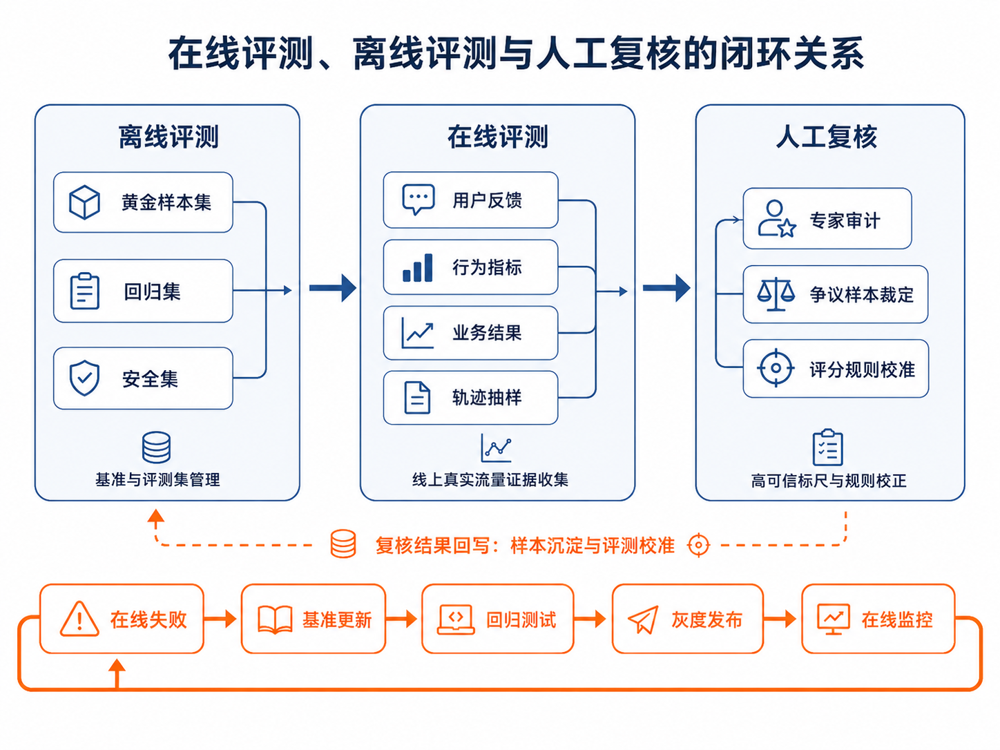

# 第40章 在线评测、模型裁判与持续优化

---

离线评测通过后，财务 DataAgent 仍在真实流量里暴露出新问题：用户追问方式更随意，权限组合更复杂，数据也会在一天内多次刷新。人工全部复核不现实，只看点赞点踩又太粗。团队需要一套在线评测流程，把真实样本、模型裁判、人工抽检和灰度发布接起来。

LLM-as-Judge 的价值在于扩大初筛覆盖面，不在于替代专家判断。裁判本身也要被校准：评分标准要明确，黄金样本要稳定，高风险样本要回到人工复核，线上问题还要沉淀回离线回归集。

上线后的质量问题往往带着现场噪声。财务用户点踩一份报告，可能是数字错了，也可能是图表太长、等待太久、权限拒绝没有解释清楚，或者业务方不认可系统选择的分析路径。只看点踩率，团队只能知道“有人不满意”；只看模型裁判分，团队又可能忽略真实用户的工作方式。在线评测要把用户反馈、Trace、工具调用、数据版本、模型裁判和人工复核串在一起，才能把抱怨转成可修复问题。

模型裁判适合做第一轮分流。它可以快速判断回答是否引用证据、是否回答了问题、是否存在明显自相矛盾、表达是否过度武断。它不适合单独判断指标口径、权限边界和高风险业务结论。比如一份 DataAgent 报告写得条理清楚，裁判可能给高分；但如果报告把 `gmv_paid` 和 `gmv_ops` 混用，只有懂业务指标或能读取语义层证据的流程才能识别。模型裁判要进入证据系统，而不是代替证据系统。

因此，本章讨论 LLM-as-Judge 时，会把它放在持续优化链路里看。先用离线 benchmark 固定基本回归，再用线上样本发现长尾问题，用模型裁判扩大覆盖，用人工抽检校准裁判，用灰度发布验证修复。每一环都要留下版本：rubric 版本、Judge 模型版本、样本来源、专家标注和上线策略。没有版本，分数变化无法解释；没有人工校准，裁判会把自己的偏差包装成质量结论。

在线评测的最终目标也不是追一个全局高分。更有用的是让团队知道下一步该修哪里：prompt 太宽、工具失败、语义层缺字段、报告模板过度发挥、前端交互让用户误解，还是某个租户的数据质量本身不足。模型裁判只有能帮助定位这些工程动作，才值得进入生产质量治理。

模型裁判的设计要从 rubric 开始。一个模糊标准，比如“回答是否好”，会让裁判按照语言流畅度、格式完整度和自己偏好的写法打分；一个可操作 rubric 会拆成事实正确、证据引用、任务完成、表达清晰、安全合规、下一步动作是否合理。每个维度都要说明输入证据和失败样例。裁判越接近评审表，越容易被人工校准；裁判越像自由评论，越难进入门禁。

人工抽检不是形式化环节。平台应按风险和异常信号抽样：高风险行业问题、低分样本、裁判分歧样本、用户点踩样本、新模型灰度样本、数据源变更后的样本，都应进入人工池。专家不需要看所有线上流量，但要看最能校准系统的部分。人工结果再回写到黄金样本和 rubric，裁判才会越来越贴近企业标准。

线上灰度也要和裁判结果分开看。一个新 prompt 可能让 Judge 分数提高，但用户追问率上升；一个新模型可能让答案更完整，但延迟和成本翻倍；一个新报告模板可能让语言更顺，但把证据引用藏得更深。在线评测要把质量、体验、成本和安全放在同一张发布视图里。模型裁判是其中一列，不是唯一判决。

对于 DataAgent，裁判还要读取结构化证据。只读最终报告，很难判断数字是否来自正确 SQL；只看 SQL 是否执行成功，又无法判断报告是否回答了业务问题。比较稳的做法是把报告正文、SQL 结果、Python artifact、EvidenceRef、用户问题和任务类型一起交给裁判，并让裁判按 rubric 输出结构化评分和理由。后续人工复核才能判断裁判错在哪里。

---

## 40.1 在线评测：从真实流量到可用证据

在线评测是一套解释真实流量的证据系统。第39章 讨论的是离线 benchmark：固定样本、固定数据版本、固定工具版本和固定评测脚本，再比较不同模型、提示词、工具策略或语义层版本。在线评测面对的环境更松动：用户问题每天变化，数据状态持续更新，权限策略可能因组织调整而变化，模型网关也会受限流、重试和成本路由影响。此时只问“固定测试集得了多少分”并不够，还要问真实用户是否完成了任务、线上质量退化是否被及时发现、修复上线后是否引入新的副作用。

证据系统的关键是关联键。没有 `run_id`、`trace_id`、模型版本、工具版本、数据快照和用户反馈之间的关联，线上评测只能做运营统计。有了这些关联，团队才能把“本周点踩上升”拆成具体原因：某个数据域的 schema 变了，某个模型版本在长上下文任务上退化，某个报告模板让用户看不到证据，或者某个租户的权限策略导致高频拒答。

Judge 的输出也要结构化。一个分数和一段评论不够，平台需要知道每个维度是否通过、失败证据在哪里、是否需要人工复核、是否应进入回归集。比如 `groundedness=false` 应带上未被证据支持的句子；`citation_correctness=false` 应带上打不开或不匹配的引用；`safety_risk=true` 应带上触发的策略类型。结构化输出让评测结果能驱动修复队列，而不是停留在报告里。

裁判偏差需要持续监控。某些 Judge 偏好更长答案，某些 Judge 对格式整齐的报告给高分，某些 Judge 对内部术语理解不足。平台可以用黄金样本和双裁判机制发现这些偏差：同一批样本由模型裁判、规则校验和人工专家分别给出结果，差异过大时进入评审。裁判本身也要像模型服务一样有版本、灰度和回滚。

在线评测还要关注采样策略。只采样成功回答，会看不到失败任务；只采样点踩，会高估问题严重程度；只采样高价值用户，会忽略普通员工的使用障碍。比较稳的做法是混合采样：固定比例随机样本、所有安全命中样本、低分样本、灰度样本和用户显式反馈样本。这样既能看总体趋势，也能及时发现高风险问题。

当线上问题被确认后，它要回到离线资产。一次错误回答应沉淀为 query、上下文包、期望答案、错误类型和修复说明；一次评估误判应沉淀为裁判失败样本；一次人工复核争议应更新 rubric。持续优化要把生产失败转化成可重复验证的资产，不能退化成不断调 prompt。

持续优化还要防止“为评测器优化”。团队看到某个 Judge 分数低，很容易让 prompt 更迎合裁判：增加固定段落、使用更标准的措辞、把证据列表写得更长。短期分数会上升，用户体验未必改善。平台应把 Judge 分数和真实行为放在一起看：用户是否少追问，报告是否更常被采纳，人工退回率是否下降，安全命中是否减少。评测器服务产品质量，产品质量不能被评测器替代。

模型裁判的成本也要纳入治理。线上每个 Run 都让大模型打分，成本和延迟会迅速上升；只对极少样本打分，又看不到趋势。常见做法是分层评测：规则校验覆盖全部样本，轻量 Judge 覆盖较大比例，高能力 Judge 和人工复核只覆盖高风险或异常样本。这样既保留覆盖面，也控制成本。

在多租户平台中，评测结果还要分租户和业务域查看。一个模型版本在制度问答上表现稳定，不代表在财务 DataAgent 上稳定；一个业务线点踩多，可能是用户预期更高，也可能是数据质量差。若平台只给全局平均分，真正需要修复的场景会被平均值掩盖。在线评测应让团队看到具体业务、具体版本、具体失败类型。

最终，LLM-as-Judge 应成为质量治理里的一个角色。它做初筛，规则做硬校验，人工专家做校准，线上行为做现实反馈。四者互相制衡，平台才会既有规模化评测能力，又不把质量判断交给另一个黑箱。

### 40.1.1 在线评测与离线评测的边界

在线评测不能替代离线评测。离线 benchmark 像回归测试，适合防止已知问题反复出现；在线评测像生产观测，适合发现未知问题，尤其是 benchmark 没覆盖到的新问法、新业务、新数据状态和新用户预期。企业 Agent 平台需要把两者接起来：线上问题沉淀为离线样本，离线修复通过后再用在线灰度验证真实效果。人工复核则位于二者之间，负责处理高风险、争议样本和自动评测无法稳定判断的任务。



*图40-1：在线评测、离线评测与人工复核的闭环关系。来源：本书自绘。Alt text：环形关系图，离线 benchmark 设基线、在线评测覆盖真实流量、人工复核校准裁判，三者结果互相回流，箭头表示构成持续校准的质量闭环。*

图 40-1 表达的是一套质量校准流程。离线评测提供稳定尺子，在线评测提供真实分布，人工复核提供高可信标尺。三者的连接点是第38章 讲过的 `trace_id`、`run_id`、上下文包、工具调用和产物引用。没有这些观测数据，线上点踩只能说明“有人不满意”；有了这些关联键，团队才能继续追问：是指标口径错了，还是工具失败了；是答案事实不成立，还是表达方式不适合管理层；是新模型退化，还是语义层版本变化导致字段解释改变。

在线评测很容易被误解成“收集用户反馈”。反馈当然重要，但它只是证据的一部分。用户点踩可能来自数值错误，也可能来自等待太久、回答太啰嗦、权限被拒、图表不符合习惯，甚至用户本身提出了无法回答的问题。在线评测要回答四个问题：任务是否完成，完成路径是否可接受，线上信号是否异常，异常能否转化为可修复的工程动作。按这个口径建设后，满意度按钮才会进入生产质量分析，不会停留在运营看板上。

### 40.1.2 反馈信号到证据的转换

线上反馈可以先分成显式反馈、隐式行为和业务结果。显式反馈是用户主动给出的信号，比如点赞、点踩、评分、文本评论、问题标签和人工举报。它最直观，但覆盖率低，而且带有强烈情境色彩。一个财务用户写“数字不对”，通常比单纯点踩更有价值；但即使如此，也还需要通过 Trace 回放确认是计算错误、口径错误、数据新鲜度问题，还是用户期望没有被系统理解。

隐式行为覆盖更广。用户复制答案、下载报表、保存 SQL、继续追问、点击重新生成、放弃会话、请求人工接管、短时间内重问同一问题，这些动作都能反映系统是否有用。但隐式行为的解释更困难。继续追问可能说明用户被答案启发，也可能说明答案没有说清楚；下载报告通常是正向信号，但也可能只是为了拿去人工修改。因此隐式行为不能直接当作标签，而应当和任务类型、对话轮次、产物状态、延迟和用户角色一起解释。

业务结果更接近真实价值。例如销售分析报告是否进入周会，生成的 SQL 是否被保存为看板，客服回复是否降低工单升级率，采购分析是否触发审批动作。它的缺点也很明显：滞后、噪声大、归因困难。一个报告被采纳，可能因为 Agent 做得好，也可能因为这次业务本来简单；一个报告未被采纳，也可能是外部决策变化，不一定是 Agent 质量差。

因此，反馈记录不能停在一个 `thumb_down` 字段。它要把用户信号和执行证据绑在一起：

```json
{
  "feedback_id": "fb_20260609_001",
  "session_id": "ses_fin_042",
  "run_id": "run_fin_042",
  "trace_id": "trace_fin_042",
  "task_type": "cashflow_root_cause",
  "feedback_type": "thumb_down",
  "user_comment": "数字不对，华东区口径有问题",
  "artifact_refs": ["chart_cashflow_042"],
  "latency_ms": 84200,
  "model_version": "gpt-5-mini-2026-06",
  "prompt_version": "finance_agent:v12",
  "semantic_layer_version": "finance_semantic:v18",
  "policy_version": "finance_policy:v7"
}
```

这条记录的价值不在“点踩”二字，而在它把一次主观反馈连接到模型版本、提示词版本、语义层版本、权限策略和产物。后续复盘时，工程师可以从 `trace_id` 下钻到上下文包和工具调用，产品经理可以统计同类任务的用户行为变化，AI 研究人员可以把失败样本转成模型或提示词改进素材。

为了筛选样本，可以定义一个反馈强度分，但这个分数只能作为“排查优先级”，不能作为“质量真相”：

$$
FeedbackSignal =
w_e \cdot Explicit
+ w_b \cdot Behavior
+ w_o \cdot Outcome
- w_r \cdot Risk
$$

其中 `Explicit` 表示显式反馈，`Behavior` 表示隐式行为，`Outcome` 表示业务结果，`Risk` 表示安全、越权、超时、高成本等风险惩罚。这个公式把不同信号放到同一条样本筛选管道里，避免让单个用户行为决定系统质量。质量判断还要进入规则评测、模型裁判或人工复核。

### 40.1.3 指标看板到 Trace 的下钻

在线评测需要指标，但指标不是越多越好。一个企业 Agent 看板至少覆盖质量、效率、安全和业务价值四类信号。质量指标看用户是否拿到可用结果，例如任务完成率、首次可用答案率、点踩率、重新生成率、人工接管率、同问题重问率。DataAgent 还可以看 SQL 保存率、图表下载率、报告采纳率和结果引用率。效率指标看完成任务付出了多少系统和用户成本，例如平均交互轮数、P50/P95 延迟、平均工具调用次数、平均 token 成本和失败重试次数。安全指标看系统是否做了不该做的事，例如越权查询拦截、敏感字段暴露、拒答正确性、脱敏正确性和审计完整性。业务指标观察长期价值，例如报告是否进入管理流程、看板是否被持续使用、工单升级是否减少。

这些指标还要区分领先指标和滞后指标。领先指标能较早发现问题，例如点踩率、重新生成率、延迟和工具错误率；滞后指标更接近业务价值，例如报告采纳率、决策动作转化率和工单升级率。灰度阶段更依赖领先指标，因为它们反应快；长期运营再看滞后指标，因为它们更接近业务真实收益。一个新版本可能让报告采纳率在后续提升，但如果上线当天 P95 延迟翻倍、人工接管率明显上升，就不应继续放量等待滞后指标“慢慢变好”。

指标看板的关键能力是下钻。比如“经营性现金流归因任务点踩率从 6% 升到 13%”，这个数字本身不能指导修复。看板需要继续回答：问题集中在哪些租户，是否只发生在某个模型版本，是否与提示词版本或语义层版本同步变化，失败 Trace 是否集中在 Schema Linking、工具执行、上下文压缩、报告生成或权限拦截。下钻到这些对象之后，指标才会从运营现象变成工程证据。

归因时还要谨慎处理混杂因素。月末财务关账期间，用户任务更复杂，点踩率上升不一定代表模型退化；新权限策略上线后，拒答增加可能是系统更安全，不一定是体验变差；某个租户导入新数据源后，SQL 错误率上升可能来自表结构变化。在线评测要把任务类型、用户群体、租户、数据快照、模型版本、工具版本和策略版本一起切片，否则容易把环境变化误判为模型能力变化。

## 40.2 模型裁判：开放式质量的可控评审

模型裁判解决的是另一类问题：当答案是一份解释、一段报告、一个引用链或一条轨迹，而非确定数值或可直接执行的 SQL 时，系统如何稳定判断质量。它适合补足规则脚本难以覆盖的语义判断，但不能替代确定性校验，更不能成为没有校准的唯一裁判。

这里要先把边界说清楚。确定性脚本擅长判断“能否执行”“数值是否一致”“字段是否越权”“格式是否符合 schema”。它不擅长判断“这份报告是否抓住了主要业务矛盾”“这个归因是否足够有证据”“多个可行路径里哪条更贴近用户目标”“图表和文字是否互相支撑”“行动建议是否能被业务团队执行”。这些判断并非完全不能写成脚本，但硬写规则会迅速膨胀，也很难覆盖开放式答案的一题多解。模型裁判的工程价值就在这里：把确定性脚本无法稳定表达的语义质量、论证质量和表达质量，转成一套可审计、可校准的评审流程。

### 40.2.1 模型裁判的适用评审对象

模型裁判，也就是 LLM-as-Judge，是用一个大语言模型充当评审器，对候选答案、报告、解释、引用或执行轨迹进行评分、比较和打标签。它用于补足规则脚本难以覆盖的语义判断。例如一份现金流归因报告是否解释充分，结论是否被证据支持，表达是否适合 CFO，行动建议是否可执行，这些问题很难只靠字符串比对或 SQL 结果比对完成。

模型裁判不能直接当作事实来源。企业评测应先使用确定性方法判断能确定的部分：SQL 是否能执行、结果表是否一致、关键数值是否在容差内、权限是否通过、敏感字段是否暴露、必需产物是否生成。这些基础事实明确之后，再让模型裁判判断开放式质量。否则，裁判可能被一段流畅但错误的解释说服，给出看似合理的高分。

常见的裁判模式可以归纳为三类。单答案打分适合批量筛查，让裁判根据问题、上下文、候选答案和评分标准给出分数。成对比较适合比较两个模型或两个提示词版本，因为判断 A 是否优于 B 通常比分别给 A、B 打绝对分更稳定。多维评分适合企业 DataAgent：它把“报告质量”拆成正确性、证据支撑、完整性、可执行性、表达适配和安全合规，每个维度都有清楚锚点，输出也更便于诊断。

一个实际例子是“经营性现金流下降原因”报告。脚本可以检查 SQL 是否运行成功、关键数值是否与参考结果一致、是否包含 `region` 维度、是否没有输出客户明细字段。但脚本很难判断报告是否真的解释了“为什么下降”：它可能列出一堆区域变化，却没有说明华东区贡献最大；也可能给出“加强回款管理”这种泛化建议，却没有把建议绑定到应收账款账龄、客户分层和责任部门。模型裁判适合评这类开放式质量，但输入里要提供证据摘要、引用和 rubric，让裁判沿证据评价，而不是自由发挥。

### 40.2.2 裁判输入、输出与多维评分

一个 DataAgent 裁判输入可以这样组织：

```json
{
  "question": "本月经营性现金流为什么下降？",
  "task_type": "root_cause_analysis",
  "context_summary": "用户要求按区域分析本月经营性现金流下降原因。",
  "candidate_answer": "...",
  "evidence": {
    "sql_result_summary": "华东区贡献下降 62%，主要来自应收账款回款延迟。",
    "artifact_refs": ["chart_cashflow_042"],
    "source_graph_summary": "使用 finance_semantic:v18, cashflow_fact, org_dim"
  },
  "rubric": {
    "correctness": "结论与 SQL 结果一致。",
    "grounding": "关键结论能被证据支持。",
    "actionability": "说明可采取的下一步分析或业务动作。",
    "safety": "不得暴露客户明细和无权限字段。"
  }
}
```

裁判输出应结构化，不宜只返回一段评语：

```json
{
  "overall_score": 0.82,
  "dimension_scores": {
    "correctness": 0.90,
    "grounding": 0.85,
    "actionability": 0.70,
    "safety": 1.00
  },
  "confidence": 0.76,
  "failure_tags": ["missing_next_step"],
  "rationale": "结论与 SQL 摘要一致，但行动建议较弱。"
}
```

对 PM 来说，裁判输出最重要的部分不在“总分 0.82”，而在它能否转化为产品动作。`correctness` 低，优先查数据口径、SQL 和工具；`grounding` 低，优先查引用、source graph 和报告模板；`actionability` 低，优先改输出结构和产品交互；`safety` 失败，则不应进入普通优化讨论，而应触发发布阻断或人工复核。

多维裁判分可以写成：

$$
JudgeScore =
\sum_{d \in D} w_d \cdot score_d
$$

其中 `D` 是评分维度集合，`w_d` 是维度权重。权重由任务类型决定。财务分析要提高正确性、证据和安全权重；研究报告要提高覆盖度、深度和引用权重；客服回复要提高指令遵循、语气一致性和安全边界。一个通用总分如果不区分任务，很容易把不同质量标准压成一个无意义数字。

DACOMP (Lei et al. 2025) 的 DA（Data Analysis，数据分析）任务可以作为 rubric 打分的工程参照。它要求 Agent 完成一份可复算、可审计、可用于业务决策的数据分析报告，而非回答一个单点问题。以一个企业授信定价与组合优化任务为例，用户目标不是“算一个风险分”；Agent 要建立一整条分析链路，从客户风险评分、违约概率、违约损失率、监管参数，延伸到单客户定价、额度测算、组合分配和流失约束优化。这类任务无法只靠答案判断好坏，因为合格报告要同时满足定义一致、计算可复现、路径可追踪、结论可执行。

这个任务的 rubric 不能停在“报告是否好”这种泛化要求上，而要把评分拆成两大需求、多个标准和可替代路径。风险量化链路关注字段映射是否清楚，指标 S 的维度、权重和方向性是否正确，S 到 PD 的映射是否单调，LGD 分层是否覆盖抵押、担保和未知情况，监管参数和 RAROC 是否能被复算。定价与组合优化关注单客户定价公式是否和风险参数一致，额度链条是否有边界测试，组合 EAD 是否能迭代收敛，流失干预和 RAROC 底线是否落实到执行记录。每个子标准再标注完备性、精确性、结论性三类维度。Judge 由此不再凭感觉说“报告不错”，而是逐项检查“有没有字段映射”“有没有边界测试”“有没有执行证据”“结论是否能指导定价和额度动作”。

DACOMP 的评测也不是单一 Judge 分。它先用基于 rubric 的 Judge 解析总分和三个维度分，再做 GSB（Good/Same/Bad）式参考报告对比，把候选报告和基准报告在可读性、专业深度、可视化上比较。DA Score 的权重是：rubric 百分比 60%，可读性 10%，专业深度 10%，可视化 20%。这给企业评测一个可操作拆分：任务满足度用细粒度 rubric 检查关键业务要求，报告呈现质量用参考报告对比判断表达、深度和视觉呈现。工程实现中还需要格式校验、无效输出重试、视觉评测失败兜底、无图时可视化计 0 分等处理，这些都属于模型裁判工程化细节。

### 40.2.3 偏差、一致性与人工复核

模型裁判能扩展语义评测，也会把自身偏差带进评测系统。常见问题包括位置偏差、长度偏差、风格偏差、自偏好、参考泄漏和领域盲区。成对比较时，裁判可能偏好第一个答案；报告评审时，裁判可能把更长、更流畅的回答误判为更好；如果参考答案写法过强，裁判可能奖励“长得像参考答案”的文本，不一定是语义正确的答案。企业场景还多一层风险：裁判可能不理解内部指标口径和权限边界，因此无法识别一个看似专业但口径混用的回答。

控制偏差要靠工程机制，不能相信裁判会自然稳定。成对比较要随机化答案顺序，并记录 `order_seed`；同一对答案换顺序后如果判断反转，就应降低置信度或进入复核。评分标准要版本化，每次修改 rubric 都产生 `rubric_version`，旧分数不能和新分数直接混用。裁判模型和裁判提示词也要绑定版本，否则一次分数变化可能来自被评系统，也可能来自裁判系统本身。

打分尺度也要控制。开放式连续分，例如 0 到 100 分，表面上细腻，实际上容易放大模型的主观噪声。更可靠的做法是离散打分：二元通过/不通过，或 0/1/2/3/4 档。每一档要有锚点，例如 0 表示缺失或错误，2 表示部分覆盖但证据不足，4 表示完整覆盖且证据可追溯。对风险和权限类维度，最好直接使用门禁型二元判断：越权、泄露、引用未读取证据，一旦发生就不能靠其他维度拉高总分。

实际使用时还需要几条硬约束。裁判输入应隐藏候选模型身份，避免模型名带来的先验偏好。成对比较要做顺序互换；如果 A/B 与 B/A 结果不一致，样本应降置信或进入人工复核。长短差异要显式控制，rubric 中要写清楚“更长不等于更好”，并要求裁判惩罚无证据的堆砌。裁判应只基于给定证据、上下文和引用判断，不允许凭世界知识补齐缺失证据。关键发布决策不要只看一个裁判模型，可以使用不同模型家族交叉评审，记录均值、方差和分歧样本。

黄金样本是校准裁判的基础。它来自专家标注，应该覆盖正确、部分正确、事实错误、引用不足、越权泄漏、表达冗长、行动建议缺失等典型情况。每次更换裁判模型、裁判提示词或评分标准，都先跑黄金样本。如果裁判在黄金样本上和专家判断偏离，就不能用它来评线上大规模样本。

高风险样本不能完全交给自动裁判。财务、合规、人事、客户数据和权限敏感任务，至少需要抽样人工复核；出现安全失败、越权、敏感信息泄漏或监管相关输出时，应直接进入人工队列。多裁判交叉也有价值：规则引擎评权限，确定性脚本评数值，模型裁判评报告质量，专家抽检高风险样本。这样做的目的，是避免单个裁判成为不可解释的唯一裁判。

裁判稳定性可以用一致性指标监控：

$$
JudgeAgreement =
\frac{\text{裁判与专家一致的样本数}}
{\text{抽检样本总数}}
$$

如果 `JudgeAgreement` 持续下降，应先排查评测系统：任务分布是否变了，裁判提示词是否变了，rubric 是否不再覆盖新任务，专家标注是否存在分歧。裁判本身漂移时，继续根据裁判分数优化 Agent，会把系统推向一把错误尺子。

不同大模型之间的 variance 也要单独记录。一个常见做法是用同一批黄金样本同时跑多个 Judge，例如一个强闭源模型、一个可本地部署模型、一个专门偏安全或事实性的模型。若三个 Judge 对总分排序一致，但在某些维度上分歧大，说明这些维度的 rubric 可能不够可验证；若只有某个 Judge 认为新版本明显变好，而专家偏好和其他 Judge 不支持，就不能把它当作上线证据。企业评测报告最好同时展示 `mean_score`、`std_score`、`judge_agreement` 和人工抽检通过率，而不是只展示一个漂亮总分。

相关论文也在强调同一件事：不要把“一个大模型的一次判断”当成评测真相。ResearchRubrics (Sharma et al. 2025) 使用大量专家写成的细粒度 rubrics，并同时设计人工和模型评测协议，用专家标准约束模型裁判。DeepResearch Bench II (Li et al. 2026) 更进一步，用专家调查文章派生原子化二元 rubrics，并经过 LLM+人工四阶段流程和超过 400 小时专家复核，减少“模型自己出题、自己判分”的偏差。RubricEval (Pan et al. 2026) 的结论也有工程价值：rubric-level judging 仍然很难，但明确的 rubric-level 评估、显式推理和结构化判断比粗粒度 checklist 更能降低 judge 之间的方差。LLM-Rubric (Hashemi et al. 2025) 则提供了另一种校准思路：把多个 LLM 判断分布组合起来，去拟合不同人工评审者的标注，不假设某个 LLM Judge 天然等同于人类偏好。

落到企业平台，可以把这几类方法合成一个操作流程。专家先定义或审核 rubric，优先使用二元或少档离散分；多个 Judge 独立打分，记录均值、方差和顺序互换一致性；高方差、低置信或安全相关样本进入人工复核；人工复核结果再回写到黄金样本，用来校准下一版 Judge prompt 和 rubric。这个流程不承诺 LLM 裁判“完全客观”，只要求偏差可见、可度量，并能被人工标准校正。

### 40.2.4 从 LLM-as-Judge 到 Agent-as-Judge 与动态 Judge

普通 LLM-as-Judge 只读取输入文本、候选答案和 rubric。Agent-as-Judge 更进一步：裁判本身可以读取文件、查询环境、执行工具、检查中间状态。这个差异对企业 Agent 很重要，因为很多错误不在答案文字里，而在它依赖了错误文件、漏读了关键表、引用了未进入上下文的产物，或者没有执行应该执行的工具。

Workspace-Bench 1.0 (Tang et al. 2026) 是一个适合说明 Agent-as-Judge 思路的例子。它构造了包含 5 类工作者画像、74 种文件类型、20,476 个文件和 388 个任务的真实工作区，并为任务建立文件依赖图和 7,399 条 rubrics。这里的评测既要看答案像不像参考答案，也要判断 Agent 是否识别、使用并更新了正确的文件依赖。迁移到企业 DataAgent，Judge 不能只读报告，还要沿着 `source_graph` 检查：报告引用的指标字典是否真实读取过，SQL 结果是否来自正确数据快照，产物是否从对应工具结果派生，是否存在“没读证据却写结论”的路径问题。


*图40-2：Workspace-Bench 中的工作区依赖图与评分标准集示例。来源：本书自绘。Alt text：左侧是任务涉及的表、字段、工具构成的依赖图，右侧是对应的分项评分标准（口径、正确性、解释），示意复杂任务如何拆成可逐项打分的标准集。*

图 40-2 展示了这类评测为什么不能退化成“读报告、给一个分”。左侧是角色化工作区，文件分布在业务、区域数据、分析工具、物流分析、主数据和管理资料等目录下；中间是任务指令和依赖图，说明正确产物要跨市场订单、商品信息、物流成本、客户分群和优先级规则形成计算链；右侧的评分标准集则把检查点拆成基础检查、结果检查和过程检查。基础检查确认产物是否生成、是否覆盖全部市场和订单；结果检查确认销售额、利润率、品类贡献、客户分群等关键数字是否正确；过程检查确认结论是否综合市场、产品、物流和客户维度，建议是否直接对应数据发现。

Agent-as-Judge 和普通 LLM-as-Judge 的分界也在这里。普通文本裁判可以判断报告语言是否通顺，却很难知道 Agent 是否漏读了某个区域订单文件、是否把物流成本文件当成商品主数据、是否在没有读取优先级规则的情况下写出策略建议。Agent-as-Judge 的裁判对象包括 `final_answer`、文件读取记录、工具调用结果、生成产物、依赖图和 rubric 检查点。对企业平台来说，这种设计可以直接迁移到 BI 报表、授信分析、采购风控和现金流预测：Judge 要检查报告背后的证据路径，报告表面是否像一份专业材料只能作为次要信号。

动态 Judge 处理另一类问题：不是所有任务都适合套一份固定 rubric。开放式研究、复杂经营分析和跨部门报告，往往需要根据任务本身生成或选择评审标准。Deep Research 方向的 benchmark 提供了可借鉴的做法。ResearchRubrics (Sharma et al. 2025) 用专家写成的细粒度 rubrics 评估开放式研究报告；DeepResearch Bench II (Li et al. 2026) 则从专家调查文章派生 9,430 条细粒度二元 rubrics，覆盖信息召回、分析和表达，并通过 LLM+人工流程进行专家复核。它们的启发是：动态 Judge 不应让模型临场随便定标准，而应让模型先生成候选标准，再由专家或规则流程筛掉不可验证、过粗、重复或偏离任务的标准，形成原子化、可判定、可复核的 rubric。

在企业 DataAgent 里，这套思路可以落成三层。核心任务使用固定 rubric，保证版本间可比；新型开放任务先由动态 Judge 生成候选 rubric，再进入人工审核；线上高价值失败样本沉淀后，把动态 rubric 固化到 Regression Set。未知问题因此有入口，评测标准也不会在每次运行时漂移。

## 40.3 持续优化：从线上验证到回归资产

在线评测和模型裁判最终都要进入质量迭代。迭代目标不能停在提高分数上，还要让每一次改动都有证据、有边界、有回归保护。这里有三件事：用线上实验确认新方案是否真的有用，把线上失败沉淀为可复用样本，再把样本、Trace 和专家判断接回离线回归。

### 40.3.1 A/B 实验与线上能力验证

离线 benchmark 通过，模型裁判分提升，只能说明新方案在样本和评测器上更好，不能直接证明真实用户会受益。线上能力变化需要 A/B 实验验证。A/B 实验把真实流量按规则分成两组或多组，一组使用旧方案，一组使用新方案，然后比较主指标和护栏指标。Agent 场景下，实验对象可以是模型、提示词、工具策略、语义层版本、检索策略、缓存策略、模型路由或安全策略。

主指标是实验要改善的目标，例如首次可用答案率、任务完成率、报告采纳率。护栏指标是不允许明显变差的指标，例如安全失败率、P95 延迟、平均成本、人工接管率和越权拦截。一个新提示词如果让报告采纳率提升，但同时让敏感字段暴露率上升，就不能上线；一个新模型如果让正确性小幅提升，却让 P95 延迟和成本翻倍，也需要重新评估产品收益是否值得。

多轮 Agent 会让实验归因更复杂。一次用户会话可能跨多个 Run，第三轮满意度可能受第一轮答案影响。如果按单次请求随机分桶，同一个用户在同一段会话里可能同时遇到 A 方案和 B 方案，体验和数据都会被污染。因此，应按用户、租户或会话分桶，并记录进入上下文包的实验版本。长任务也要考虑滞后反馈：报告生成可能几分钟后完成，用户下载或采纳报告可能更晚发生，实验窗口不能只覆盖请求完成瞬间。

一个简化的上线判定可以写成：

$$
Launch =
\begin{cases}
1, & \Delta Primary > \tau_p \ \text{且所有 Guardrail 通过} \\
0, & \text{否则继续灰度、修复或回滚}
\end{cases}
$$

其中 `Primary` 是主指标，`Guardrail` 是护栏指标，`\tau_p` 是最小改善阈值。上线要看改善幅度是否足够大，同时不能破坏安全、成本和稳定性。对于高风险任务，还应把人工复核通过率和安全样本通过率作为准入条件，不能放到上线后再观察。

除了传统 A/B，还可以在受控环境中使用交错比较。交错比较把两个候选摘要、候选图表或候选解释混合展示，让用户行为更直接地反映偏好。它不适合所有 DataAgent 任务，因为许多企业输出需要完整上下文和审计链路；但在候选图表选择、摘要措辞、报告结构等局部体验上，它可以补充 A/B 实验。

### 40.3.2 从线上问题到回归资产

一条完整质量链路应从线上运行开始：每次 Run 生成 Trace、反馈、行为指标、业务结果和成本指标；系统自动筛选点踩、高成本、超时、人工接管、安全拦截等异常场景；低风险样本进入模型裁判或规则评测，高风险样本进入人工复核；失败样本按根因聚类，沉淀到第39章的 Regression Set 或 Safety Set；团队修复提示词、工具描述、语义层、模型路由、权限策略或产品交互；离线回归通过后进入小流量灰度；在线指标稳定后再扩大流量。

这条链路里有一个关键边界：裁判负责发现和分类问题，不负责自动决定所有修复。比如裁判发现报告缺少引用，根因可能是提示词没有要求绑定 source，也可能是工具返回缺少 source，也可能是前端没有展示引用，还可能是上下文包遗漏了产物引用。修复责任域需要结合 Trace 判断。没有 Trace 的裁判分数容易变成“质量情绪”；有 Trace 的裁判结果才能变成“修复线索”。

失败样本还要保存答案之外的运行证据。一个可回归样本至少要保留用户原始问题、上下文包摘要、数据快照或工具结果引用、模型和提示词版本、语义层版本、权限策略版本、输出内容、专家判断、失败标签和期望行为。这样样本才能在后续版本中重放和比较。否则团队只知道“某次现金流报告被点踩”，却无法复现当时模型看到了什么，也无法判断修复是否真的覆盖了原问题。

从组织协作看，这套样本机制也让三类角色看到同一件事的不同切面。产品经理看到的是任务完成率、用户体验和功能边界；开发团队看到的是 Trace、工具错误、版本差异和发布验收；AI 研究人员看到的是失败分布、裁判校准和模型改进方向。在线评测平台的价值，就是让这些讨论都落在同一批可追溯样本上。

### 40.3.3 企业落地示例：DataAgent 报告质量优化

假设财务 DataAgent 上线后，经营性现金流归因报告的点踩率从 6% 上升到 13%。如果只看点踩，团队很容易陷入争论：是模型变差了，还是用户更挑剔了；是报告格式不合适，还是数据口径错误。更可靠的做法是把在线反馈、指标看板和 Trace 放在一起看。

先看分布。点踩集中在“经营性现金流归因”任务，主要出现在 `prompt:v14` 发布后；P95 延迟没有明显变化，工具错误率也没有明显上升。这说明问题不太像基础设施故障，也不像数据库不稳定，更可能与新提示词引导下的报告组织方式有关。

接着抽样回放 Trace。新提示词让 Agent 更积极生成管理层摘要，但没有约束每个归因结论绑定 SQL 结果中的区域贡献度。报告篇幅更完整，语气也更像管理层材料，却经常漏掉“华东区贡献最大”这个关键结论。用户点踩的原因在于关键证据被弱化，不是文风问题。

然后使用模型裁判做批量评测。Rubric 拆成正确性、证据支撑、行动建议和安全四项。裁判显示正确性下降不明显，证据支撑分明显下降；人工抽检确认这个判断成立。团队把 30 个典型失败 Trace 加入 Regression Set，标注关键断言：按区域说明贡献度，引用 SQL 结果摘要，不给泛化建议。

修复动作也就清楚了。提示词和报告模板被改成“每个归因结论绑定 source”，工具返回增加区域贡献度摘要，前端报告产物展示引用来源。离线回归通过后，新方案进入 5% 灰度。灰度组点踩率下降到 7%，报告下载率上升，P95 延迟和 token 成本小幅增加但仍在护栏范围内，于是继续扩大流量。

这个例子说明，在线评测的价值不在于多一个分数，而在于把“用户觉得不好”拆成可定位、可修复、可回归的工程问题。对于企业 Agent，质量优化的基本单位是一条带有版本、证据、轨迹和业务反馈的运行样本。

---

在线评测还要有关闭问题的机制。一个线上失败样本进入修复队列后，要记录修复方式、关联代码或配置版本、回归结果和灰度观察结果。否则失败样本会越积越多，团队只知道问题存在，却不知道哪些已经修复、哪些仍在等待。质量治理需要从发现问题走到关闭问题。

对于管理层，在线评测报告应避免只展示分数趋势。更有用的是说明本周发现了哪些失败类型、修复了哪些、哪些风险仍在观察、下一次发布会受哪些门禁影响。这样 LLM-as-Judge 才不会变成另一张漂亮看板，而会进入真实发布决策。

评测平台还应给修复动作分优先级。安全失败、越权、事实错误和证据断链应优先处理；表达冗长、格式偏好和低风险措辞问题可以进入后续优化。所有问题都进入同一个待办池，会让团队疲于处理低价值改写，反而延迟真正影响上线安全和业务信任的问题。

评测结果还要能解释给非技术团队。业务 owner 不需要看到所有裁判 prompt，但需要知道哪些问题影响业务采纳，哪些问题只是表达偏好，哪些风险会阻断发布。把评测语言翻译成业务语言，质量治理才会进入路线图和资源决策。

在这个意义上，Judge 是质量团队的放大镜，但不能成为裁判席上的唯一声音。它帮助团队更快看到问题，但最终仍要回到证据、专家判断和发布后反馈。

## 本章小结

在线评测补充离线 benchmark，用来发现真实流量中的未知问题和分布漂移。线上反馈不能直接当标签，要和 Trace、任务类型、业务上下文、版本信息和权限结果一起解释。模型裁判适合补充开放式语义评测，但它要被 rubric、黄金样本、版本管理、顺序随机化、一致性监控和人工抽检约束。A/B 实验负责回答新方案是否改善真实用户体验，以及是否破坏安全、成本和稳定性。

在线评测不应追一个线上总分，而应建立一条质量链路：真实失败进入离线回归，裁判判断转成工程修复，小流量灰度再回到线上监控。这条链路依赖 第38章的可观测数据，也要回到第39章的 benchmark 资产。

## 参考文献

相关章节：[第38章 Agent 可观测性与运行诊断](ch38-trace.md)、[第39章 企业级 DataAgent 评测体系设计与 Benchmark 构建](ch39-dataagent-eval-benchmark.md)、[第41章 成本治理与缓存优化](ch41-cost-governance-cache.md)、[第42章 SLO 管理、限流与系统韧性](ch42-slo.md)。

本章公开 benchmark 与模型裁判相关参考文献按正文首次出现顺序排列。

Lei, F. et al. (2025). [*DAComp: Benchmarking Data Agents across the Full Data Intelligence Lifecycle*](https://arxiv.org/abs/2512.04324). arXiv.

Tang, Z. et al. (2026). [*Workspace-Bench 1.0: Benchmarking AI Agents on Workspace Tasks with Large-Scale File Dependencies*](https://arxiv.org/abs/2605.03596). arXiv.

Sharma, M. et al. (2025). [*ResearchRubrics: A Benchmark of Prompts and Rubrics For Evaluating Deep Research Agents*](https://arxiv.org/abs/2511.07685). arXiv.

Li, R. et al. (2026). [*DeepResearch Bench II: Diagnosing Deep Research Agents via Rubrics from Expert Report*](https://arxiv.org/abs/2601.08536). arXiv.

Pan, T. et al. (2026). [*RubricEval: A Rubric-Level Meta-Evaluation Benchmark for LLM Judges in Instruction Following*](https://arxiv.org/abs/2603.25133). arXiv.

Hashemi, H. et al. (2025). [*LLM-Rubric: A Multidimensional, Calibrated Approach to Automated Evaluation of Natural Language Texts*](https://arxiv.org/abs/2501.00274). arXiv.

方法与工具：A/B Testing、Interleaving、LLM-as-Judge、Ragas、DeepEval、Promptfoo、Langfuse、Phoenix。相关研究与实践可继续参考 MT-Bench / Chatbot Arena、G-Eval，以及围绕模型裁判偏差与一致性的评测研究。
