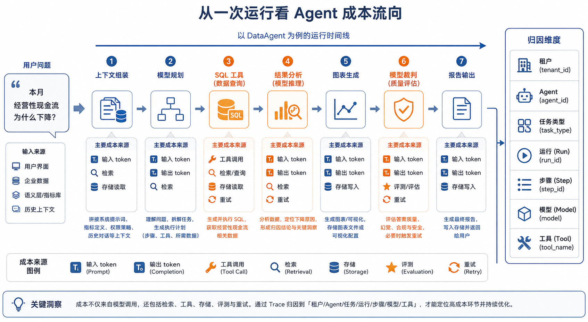
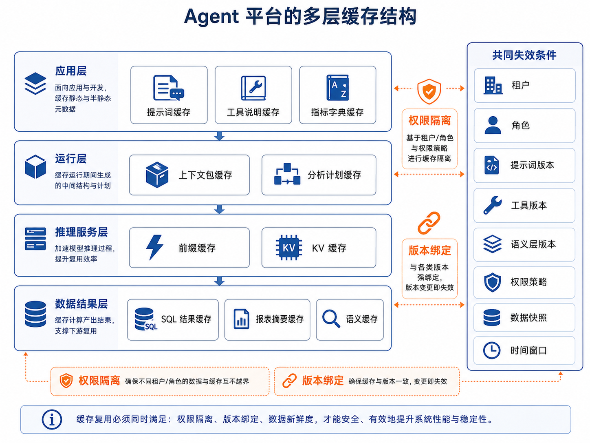

# 第41章 成本治理与缓存优化

---

账单异常时，只盯模型单价往往会找错方向：成本可能来自过长上下文、失控重试，也可能来自本可命中的缓存被绕过。成本治理要先把费用归因到任务和环节，再讨论模型路由、语义缓存、预算控制和发布验收。这些机制的目标，是约束规模化运行，避免降本动作反过来伤害质量和安全边界。月底账单会上，平台团队发现模型费用比上月翻了一倍。业务侧的使用量确实增长了，但增长幅度解释不了全部费用。进一步拆 Trace 才发现，部分任务在 SQL 失败后反复重试，长上下文没有命中缓存，模型裁判也在低风险样本上跑得过多。成本治理不能只看模型单价。平台要把费用贴回每一次 Run、每一个 Step 和每一种租户策略，先看清楚钱花在哪里，再决定是改路由、加缓存、收紧预算，还是调整评测和重试策略。

Agent 成本失控时，团队往往先看模型单价。实际账单通常由任务链路放大：上下文过长、工具失败后反复重试、低风险样本调用强模型评测、缓存没有命中、用户重复提交、日志和 artifact 保存策略过宽。若只换便宜模型，质量可能下降，成本根因仍然存在。成本治理要从归因开始。一次 Run 花了多少钱，哪些 Step 消耗最多，哪些租户增长最快，哪些模型调用来自重试，哪些上下文本可以复用，这些信息要和 Trace 关联。只有把费用贴回任务、用户、模型、工具和策略，团队才能决定该改路由、加缓存、限制预算还是重构流程。缓存优化也不能简单理解为“能缓存就缓存”。语义缓存命中错误会把旧答案发给新问题，Prompt 缓存和上下文缓存也会受权限、数据版本和模型版本影响。成本优化必须保留质量验证和安全约束，否则省下的费用会变成错误答案或数据泄露。

## 41.1 异常账单先看任务链路

很多团队第一次认真讨论 Agent 成本，往往已经到了月底账单会。一个财务 DataAgent 上线时看起来很成功：用户可以问“本月经营性现金流为什么下降”，系统会识别指标、查询数据、生成 SQL、解释差异、绘制图表并输出报告。两个月后，平台账单明显上涨，业务侧却没有感到能力也同步提升。最直接的反应通常是换模型：把强模型换成小模型，把输出长度限制得更短，把模型裁判少跑几次。这些动作确实可能让账单下降，但也可能让现金流归因变浅、SQL 错误变多、人工复核压力上升。Agent 成本治理的难点正在这里：一次用户请求背后是一条任务链，包含上下文组装、模型推理、工具调用、检索、产物生成、评测和重试。第38章 讨论 Trace 时提到，平台要用 `session_id`、`run_id`、`step_id` 和 `trace_id` 把一次任务串起来。到了成本治理里，这些字段不再只是排障字段，也变成成本归因字段。没有它们，平台只能知道“模型账单变高了”；有了它们，平台才知道是哪个租户、哪个 Agent、哪个任务类型、哪个步骤把成本打上去了。可以先把一次运行成本写成一个粗粒度公式：

$$
Cost_{run} =
\sum_i Cost_{model_i}
+ \sum_j Cost_{tool_j}
+ Cost_{retrieval}
+ Cost_{storage}
+ Cost_{eval}
+ Cost_{retry}
$$这里的模型调用不只包括回答，还包括意图识别、计划生成、SQL 生成、错误修复、报告摘要和模型裁判。工具调用也不只包括数据库，还可能包括文件解析器、代码执行器、浏览器、BI 系统和外部业务 API。重试成本常常被低估：失败 SQL 的自动修复、模型超时后的重跑、用户短时间内重复点击，都会把一次任务的真实成本放大。模型调用本身还可以拆得更细：$$
Cost_{model} =
P_{in} \cdot T_{in}
+ P_{out} \cdot T_{out}
- Discount_{cache}
$$

`P_in` 和 `P_out` 是输入、输出 token 单价，`T_in` 和 `T_out` 是对应 token 数量，`Discount_cache` 是缓存命中带来的折扣或计算节省。对于自建推理服务，这个公式会换成 GPU 时间、吞吐、显存占用、利用率和运维成本，但治理逻辑不变：先解释每一次运行为什么花钱，再讨论怎样省钱。



*图41-1：从一次 Run 看 Agent 成本流向。来源：本书自绘。Alt text：一次 Run 的成本被拆解到模型调用、上下文 token、重试、工具执行等环节，每段标注占比，箭头汇向总成本，体现成本可归因到具体环节。*

图 41-1 的重点在归因。成本如果不能贴回任务链路，后续所有优化都缺少比较基准。便宜模型导致失败重试增加，表面上单次调用便宜，整条链路未必便宜；强模型减少了重试和人工复核，单价高，单位成功任务成本反而可能更低。

## 41.2 成本治理从归因开始

回到那张异常账单。第一步是把账单和 Trace 对齐，而非立刻调整模型。团队除了要知道“哪个模型最贵”，还要回答：哪些租户成本最高，哪些 Agent 成本增长最快，一个成功任务平均花多少钱，失败任务消耗了多少预算，成本主要落在模型、SQL、检索、工具、评测还是重试上。

### 41.2.1 成本事件要贴到步骤上

这些问题看起来像财务问题，实际是工程问题。平台要在关键步骤记录成本事件，并把它和 Trace、提示词版本、模型版本、工具版本、语义层版本和权限策略版本关联起来。一个成本事件可以写成这样：
```json
{
  "cost_event_id": "cost_20260609_001",
  "tenant_id": "tenant_finance",
  "agent_id": "dataagent_finance",
  "run_id": "run_cashflow_042",
  "step_id": "step_sql_generate",
  "trace_id": "trace_cashflow_042",
  "cost_type": "model_call",
  "model": "gpt-5-mini",
  "input_tokens": 8420,
  "output_tokens": 620,
  "cache_hit_tokens": 5100,
  "estimated_cost_usd": 0.018,
  "prompt_version": "finance_agent:v12",
  "semantic_layer_version": "finance_semantic:v18",
  "policy_version": "finance_policy:v7"
}
```

这条记录服务账单核对，也让第38章的回放、第39章的 benchmark、第40章的在线评测都能看到成本。比如某个提示词版本让现金流归因准确率提升了 1%，但平均输入 token 增加了 80%；又比如某个 SQL 工具版本让重试率下降了 30%，但单次查询变慢。没有归因，团队只能凭感觉争论；有了归因，团队才能比较质量收益、延迟代价和成本变化。

### 41.2.2 单位任务成本比总金额更有用

成本看板不宜只展示总金额。总金额适合财务结算，却不适合工程决策。更有诊断价值的是单位任务成本，例如每个成功 Run 的平均成本、每个被采纳报告的平均成本、失败 Run 占成本比例、缓存命中节省金额和同类任务的 P95 成本。如果 30% 的账单花在失败重试上，优化方向通常是修复工具错误、超时策略和重试策略，而非先换便宜模型。成本看板可以并排呈现几个关键指标，但不应把它们压成一个总分：

*表41-1：单位任务成本各指标回答的问题与修复方向。来源：本书整理。*

| 指标 | 回答的问题 | 典型修复方向 |
| --- | --- | --- |
| 单位成功任务成本 | 完成一个可用任务平均花多少钱。 | 模型路由、缓存、工具稳定性、减少无效重试。 |
| 失败成本占比 | 预算有多少花在失败、超时和回滚上。 | Trace 回放、错误分类、重试上限、工具契约。 |
| 缓存节省金额 | 稳定上下文和结果复用节省了多少成本。 | 缓存键设计、版本绑定、权限隔离。 |
| 高成本步骤分布 | 成本集中在哪些 Step。 | 上下文压缩、工具拆分、异步化、模型分层。 |
| 质量成本比 | 成本上升是否换来了质量提升。 | 结合 Regression Set、Safety Set 和线上反馈决策。 |

降价是后续动作，归因是前置条件。否则平台很容易把显性账单压下去，却把隐性风险转移给用户、运营和人工复核团队。

## 41.3 模型路由：强模型要用在值得用的地方

成本归因清楚以后，团队通常会发现一个事实：任务不需要共用同一个模型。指标定义解释、字段说明、固定 FAQ 这类任务，答案稳定、上下文短、风险较低，使用小模型或本地模型通常足够。现金流下降归因、预算异常解释、客户或人事数据分析这类任务，涉及更长上下文、更强推理、更高风险和更严格审计，就需要强模型、完整 Trace 和更严密评测。模型路由的出发点，是把合适的模型放到合适的任务上，而非永远选择最便宜的模型。路由器需要综合任务类型、风险等级、上下文长度、延迟目标、预算状态和历史效果。它可以先用低成本模型做意图识别和风险判断，再决定后续使用小模型、强模型、本地模型，还是进入人工审批。一个简化规则可以这样表达：
```yaml
routes:
  - name: low_risk_metric_explain
    when:
      task_type: metric_explanation
      risk_level: low
      max_context_tokens: 4000
    use_model: small_reasoning_model
    fallback_model: general_strong_model

  - name: finance_root_cause
    when:
      task_type: root_cause_analysis
      domain: finance
      risk_level: high
    use_model: general_strong_model
    require_judge: true
    require_trace: true

  - name: batch_summary
    when:
      task_type: report_summary
      latency_class: batch
    use_model: local_32b_model
    fallback_model: small_reasoning_model
```

更抽象地说，路由器是在估计一个任务收益函数：$$
Utility(model, task) =
\alpha \cdot Quality
- \beta \cdot Cost
- \gamma \cdot Latency
- \delta \cdot Risk
$$

这个公式不要求每个系统都机械打分。它提醒团队，模型选择同时受质量、成本、延迟和风险约束。涉及越权、合规、人事薪酬、客户隐私时，风险是门禁条件；便宜模型即使在公式里看起来“效用高”，也不能绕过安全策略。模型路由要接入评测系统。每次调整路由规则，都要跑 第39章的 Regression Set 和 Safety Set，再通过 第40章的在线灰度观察真实反馈。否则路由很容易在局部省钱，却造成质量退化。一个常见陷阱是：把低风险任务路由到小模型后，平均成本下降了；但其中一小部分原本需要澄清的边界样本被小模型直接回答，导致错误被缓存并传播。路由策略如果没有失败标签和回归保护，就会把省钱变成质量债。

## 41.4 缓存复用的对象

成本治理里常被误解的词是“缓存”。很多人会问：“能不能加个缓存，把成本降下来？”这个问法太宽。Agent 平台里至少有五类缓存，它们复用的对象、失效条件和风险都不同。

### 41.4.1 不同缓存复用不同对象

提示词缓存偏应用层。系统提示词、工具说明、稳定 schema、指标字典、租户配置和权限策略说明，如果长期不变，可以作为可复用上下文片段。它解决的是“这些稳定材料是否需要每次重新拼装、传输和计费”的问题。前缀缓存和 KV 缓存偏推理服务层。Transformer 模型生成时会保存前文计算结果，也就是 Key-Value 缓存；如果多个请求共享相同 token 前缀，推理服务可以复用前缀计算，降低首 token 延迟和计算成本。vLLM、SGLang 等推理系统围绕这类机制提升吞吐，核心思路是让相同前缀少算几遍。结果缓存复用的是确定结果。例如同一个 SQL 查询、同一个低风险指标解释、同一份固定报表说明，在版本、权限和数据快照都相同的情况下，可以直接复用。语义缓存再进一步，它判断两个问题语义是否足够接近，从而复用已有答案、SQL 模板或分析路径。这些缓存不能混成一个开关。它们的边界可以这样理解：

*表41-2：各类缓存的主要复用对象、适合场景与风险。来源：本书整理。*

| 缓存类型 | 主要复用对象 | 适合场景 | 主要风险 |
| --- | --- | --- | --- |
| 提示词缓存 | 稳定系统提示词、工具说明、schema、指标字典。 | 同一租户、同一版本下的高频任务。 | 版本变化后继续使用旧上下文。 |
| 前缀 / KV 缓存 | 推理过程中的相同前缀计算结果。 | 多请求共享稳定前缀，或批量任务有相同系统上下文。 | 前缀不稳定导致命中率低，服务端缓存管理复杂。 |
| 结果缓存 | 确定查询、固定解释、可复用产物摘要。 | 低风险、数据快照稳定、权限一致的请求。 | 返回过期结果或跨权限复用。 |
| 语义缓存 | 相似问题的答案、SQL 模板、分析计划。 | 指标解释、常见问法、可重新执行的分析路径。 | 相似度命中但业务语境不同。 |

### 41.4.2 缓存键的第一层是权限边界

企业 DataAgent 的缓存失效条件比普通 Web 缓存复杂得多。提示词版本变化、工具版本变化、schema 变化、指标口径变化、租户和角色变化、数据快照变化、安全策略变化，都可能让缓存不能复用。因此缓存键除了问题文本或提示词哈希，还必须绑定版本和权限上下文：
```json
{
  "cache_key": "sha256(...)",
  "tenant_id": "tenant_finance",
  "prompt_version": "finance_agent:v12",
  "tool_version": "sql_tools:v5",
  "semantic_layer_version": "finance_semantic:v18",
  "policy_version": "finance_policy:v7",
  "role": "finance_manager",
  "data_snapshot": "warehouse:2026-06-09"
}
```

如果缓存没有权限隔离，就可能把高权限用户的上下文或结果复用给低权限用户。这会从性能优化变成安全事故。企业平台不能只追求命中率，还要保证权限、版本、时间窗口和数据新鲜度都正确。

### 41.4.3 自建模型和外部 API 的 token 策略不同

不同企业的 token 策略差异很大，不能用同一套成本口径解释。第一类企业会部署本地或私有云小模型，有些模型还经过领域微调、蒸馏或指令训练，专门服务客服问答、指标解释、合同条款抽取、设备巡检等固定任务。这类场景里，token 不一定直接对应外部账单，更多对应算力占用、显存占用、吞吐和部署成本。成本治理关注的是模型规格、并发、批处理、量化、前缀复用、KV 缓存容量、GPU/NPU 利用率，以及是否值得为某类任务单独维护一个小模型。

第二类企业主要调用外部大模型 API。此时 token 既是延迟变量，也是明确的计费变量；缓存命中策略还会受到供应商接口设计影响。有的 API 偏自动前缀缓存，要求请求拥有稳定的长前缀；有的 API 提供显式缓存标记或缓存断点，让调用方声明哪些内容应该进入缓存。企业 Agent 如果把所有供应商简单封装成同一个“文本输入框”，很容易损失缓存收益：动态时间戳、用户 ID、临时工具结果、随机排序的工具定义，只要出现在可缓存前缀里，就可能让命中率下降。这两类策略的差异可以先这样理解：

*表41-3：自建模型与外部 API 的 token 含义与缓存优化重点。来源：本书整理。*

| 部署形态 | token 的主要含义 | 缓存优化重点 | 容易忽略的问题 |
| --- | --- | --- | --- |
| 本地或私有云定制小模型 | 算力、显存、吞吐、部署容量。 | 批处理、前缀复用、KV 缓存管理、模型量化、领域提示词缩短。 | 小模型维护成本、模型漂移、领域外任务误用。 |
| 外部大模型 API | 直接费用、延迟、供应商限额。 | 稳定前缀、供应商缓存参数、缓存命中监控、提示词结构适配。 | 供应商规则差异、动态字段破坏前缀、缓存指标没有进入 Trace。 |

对自建小模型来说，定制化训练本身就是一种“减少 token 依赖”的方式。模型已经学会企业术语、流程和输出格式，就不需要每次把大段规则、示例和字段解释塞进上下文。这样节省 token，也能降低首 token 延迟和上下文组装复杂度。代价也很明确：业务规则变化后，模型需要重新评估、继续微调或回退到提示词控制；如果路由器把领域外问题交给这个小模型，省下的算力可能会换来质量风险。

对外部 API 来说，企业 Agent 需要做“供应商适配层”。适配层至少管理三件事：稳定提示词结构、确定序列化顺序、把指标回写 Trace。系统指令、工具说明、固定示例、schema 摘要和指标字典放在前面，用户问题、时间窗口、临时工具结果放在后面。工具列表、字段说明和权限策略不能每次随机排序，也不要把请求 ID、当前时间这类高变化字段放在缓存边界之前。每次调用都要记录输入 token、输出 token、缓存命中 token、缓存写入成本、供应商缓存参数和命中失败原因。

业务团队不需要记住某个供应商当前的缓存规则，差异应隔离在模型网关里。OpenAI、Claude 或其他模型服务的缓存机制会演进，企业平台不应让业务 Agent 直接依赖这些细节。更可靠的做法是让 Runtime 生成一份逻辑上下文包，再由模型网关按供应商转换成有利于缓存命中的请求格式。这样模型路由切换时，业务逻辑不用改；缓存策略变化时，也只需要调整网关适配器和回归评测。



*图41-2：Agent 平台的多层缓存结构。来源：本书自绘。Alt text：自上而下多层缓存，结果缓存、语义缓存、Prefix Cache、模型 KV Cache，每层标注复用对象与命中条件，箭头表示请求逐层尝试命中以降本。*

图 41-2 按复用对象拆分缓存层。提示词缓存主要由应用和网关管理；前缀和 KV 缓存主要由推理服务管理；结果缓存和语义缓存则要理解业务版本、权限和数据新鲜度。把它们统一叫缓存便于沟通，落地时仍需拆开治理。

## 41.5 语义缓存的保守策略

语义缓存可以理解为“按语义相似度复用”。它不要求两个问题字面完全相同，而是判断它们在业务意图上是否足够接近。比如“经营性现金流的定义是什么”和“什么叫经营性现金流”，大概率可以复用同一条指标解释。又比如“本月现金流为什么下降”和“这个月现金流减少的原因”，语义上也相似，但能不能复用就要谨慎得多，因为时间窗口、租户、权限、数据快照和前序对话都可能不同。语义缓存通常要同时满足三个条件：$$
CacheHit =
Similarity(q, q') > \tau_s
\land Fresh(data) = true
\land PolicyAllowed(user, result) = true
$$

`Similarity` 是语义相似度，`\tau_s` 是阈值，`Fresh` 表示数据仍然新鲜，`PolicyAllowed` 表示当前用户有权看到缓存结果。后两个条件比相似度更重要。很多缓存事故并非向量相似度算错，而是数据新鲜度和权限边界被忽略。在 DataAgent 里，通常应分层复用，而非直接复用最终答案。低风险的指标定义、固定说明、公开 FAQ 可以直接复用；SQL 模板可以复用，但查询需要重新执行；分析计划可以复用，但数据要重新读取；高风险场景下，缓存结果最好只作为候选提示，不直接返回给用户。复用策略应按风险从低到高分层：

*表41-4：不同复用对象的语义缓存风险水平与推荐做法。来源：本书整理。*

| 复用对象 | 风险水平 | 推荐做法 |
| --- | --- | --- |
| 指标定义、字段说明、公开 FAQ | 低 | 在版本和权限一致时可直接复用。 |
| SQL 模板、筛选条件、图表配置 | 中 | 可以复用模板，但重新执行查询并校验结果。 |
| 分析计划、归因路径 | 中高 | 可以作为候选路径，重新读取证据。 |
| 最终结论、管理层报告 | 高 | 默认不直接复用，除非数据快照、权限、上下文完全一致。 |

这种策略看起来保守，却符合企业场景。最终答案最容易受时间、数据快照和权限影响；SQL 模板和分析计划相对稳定，更适合作为复用对象。语义缓存的目标是复用已经验证过的中间能力，不是尽可能返回旧答案。语义缓存还需要失败反馈。如果某条缓存命中后被用户点踩、被模型裁判判为证据不足，或在 Safety Set 中暴露权限问题，缓存系统除了删除这一条结果，还要把相似问题、相同模板和相同路由规则纳入复盘。缓存会参与质量治理，不应被当作静态加速器。

## 41.6 预算控制：让系统在花钱前做决定

Token 是大模型成本和延迟的核心变量。输入 token 越多，模型需要处理的上下文越长；输出 token 越多，生成时间和费用越高。Agent 场景里 token 增长尤其快，因为系统提示词、工具说明、schema、历史对话、记忆、检索文档和工具结果都可能进入上下文。预算控制不能等账单出来以后再做。更合理的方式是在 Run 执行前和关键 Step 执行前估算成本：生成长报告前估算 token，执行大 SQL 前估算扫描量，调用模型裁判前判断是否需要全量评测。预算可以按租户、用户、Agent、场景、项目和时间窗口设置，例如某租户每月最多 5000 美元，某低优先级 Agent 每天最多 50 万 token，某交互式请求最多 30 秒和 20K token。预算控制也不应该只有“允许”和“拒绝”。接近预算时可以提示管理员；上下文过长时可以压缩摘要、减少检索文档数；高峰期可以切小模型、关闭非关键工具、转为异步任务；高成本任务可以要求人工审批；超过硬限制或违反策略时才拒绝执行。一个预算策略可以这样表达：
```yaml
budget_policy:
  tenant_id: tenant_finance
  monthly_usd_limit: 5000
  per_run_token_limit: 50000
  warning_threshold: 0.8
  actions:
    - when: monthly_usage_ratio > 0.8
      action: notify_admin
    - when: per_run_estimated_tokens > 30000
      action: summarize_context
    - when: per_run_estimated_cost_usd > 2.0
      action: require_approval
    - when: monthly_usage_ratio > 1.0
      action: block_low_priority_tasks
```

预算还要和第42章的 SLO 联动。高优先级任务可以保留更多预算和更强模型，低优先级任务在高峰期可以排队、降级或转异步。预算既是稳定性控制，也是财务控制。一个没有预算感知的 Agent 很容易在异常循环、重复检索和无界重试中拖垮系统；只会硬拒绝的预算系统，会把可恢复的体验问题变成产品失败。好的预算控制更接近调度器，而非月底报销单。

## 41.7 成本优化对质量影响的证明

成本优化最危险的做法，是只看省了多少钱。更便宜的模型可能降低任务成功率，更短的上下文可能丢失关键证据，更激进的缓存可能返回过期答案，更少的重试可能降低可用性。省下来的账单，可能会以用户点踩、人工接管、错误决策和合规风险的方式还回来。

### 41.7.1 成本优化发布前先证明质量没有下降

工程上可以采用一个简单顺序：先守住安全和正确性，再守住可用性和延迟，然后优化成本。越权、泄漏、关键口径错误不能用成本节省来交换；交互式任务至少要让用户尽快看到进度或可用结果；只有在质量和稳定性护栏内，才应该压降模型、上下文、工具和评测成本。优化上线条件可以写成下面的约束：$$
AllowedOptimization =
Quality \ge Q_{min}
\land Safety = pass
\land Latency \le L_{max}
\land CostReduction > \epsilon
$$

这个公式表达的是门禁逻辑：质量、安全和延迟都满足底线时，成本优化才成立。否则所谓优化只是风险转移。对低风险高频任务，例如指标解释、字段说明和固定 FAQ，可以更积极地使用缓存和小模型；对高风险低频任务，例如财务归因、人事数据和合规报告，应优先使用强模型、完整 Trace 和人工复核。成本治理要连接第39章 和第40章。离线 benchmark 负责证明新策略没有伤害已知任务，在线灰度负责观察真实流量下的未知副作用。一个缓存策略如果让成本下降 35%，但 Safety Set 出现越权命中，发布验收应失败；一个模型路由如果让平均成本下降 20%，但经营性现金流归因的 Regression Set 退化，就应该回滚或只在低风险场景灰度。

对产品经理来说，成本优化决定哪些能力可以规模化、哪些能力需要收费或审批、哪些能力应该异步完成。对开发人员来说，成本优化是 Trace、缓存键、重试策略、限流和网关策略的协同问题。对 AI 研究人员来说，它则是质量、上下文、模型能力和推理预算之间的实验问题。三类视角落到同一套版本化评测和成本事件上，讨论才不会分裂。

## 41.8 案例回放：财务 DataAgent 的成本下降

现在回到开头那张异常账单。团队把成本事件和 Trace 对齐后发现，现金流归因任务占总成本的 42%。进一步下钻后，成本主要来自两类问题：稳定 schema 和工具说明每次都被完整塞进上下文；SQL 生成失败后，Agent 会重复生成类似错误 SQL，导致多次重试。第一轮优化没有换模型，而是先做上下文复用。团队把稳定系统提示词、工具说明、财务 schema 和指标字典拆成可复用片段，为同一租户、同一语义层版本建立提示词缓存和前缀复用。这样做以后，输入 token 明显下降，但任务逻辑没有改变，也没有减少必要证据。

第二轮优化处理 SQL 重试。Trace 显示很多失败来自 Join Key 错误，模型在缺少明确工具反馈时会反复猜测。团队把第39章 中的 Join Key 过程标签加入回归集，优化工具错误反馈，并让 Agent 在第二次重试时优先读取语义层推荐 Join，而非继续自由生成。这样减少了失败重试，也让错误更容易归因。第三轮优化调整模型裁判策略。原来所有报告都跑完整裁判，现在改成分层评测：低风险、缓存命中的指标解释只做规则检查；高风险财务归因保留完整模型裁判；灰度版本提高抽样比例。质量护栏保留下来，不必要的评测成本被降掉。灰度上线后，单位成功任务成本下降 35%，P95 延迟下降 22%，Regression Set 和 Safety Set 没有退化，线上点踩率保持稳定。这个结果说明，成本治理不能简化成“换便宜模型”。有效路径是先归因，再路由，再缓存，再预算控制，并通过离线评测和在线灰度证明质量没有退化。

---

预算控制应发生在花钱之前。任务进入 Runtime 时，平台可以根据租户、场景、风险等级和历史成本估算预算；超过阈值时，系统可以降级模型、要求确认、拆分任务或拒绝执行。事后报表只能解释问题，事前控制才能减少问题。成本看板要服务工程决策。模型调用成本、工具执行成本、缓存命中率、重试成本、评测成本和人工复核成本应分开呈现。业务增长带来的正常成本和系统缺陷带来的异常成本也要分开，否则团队容易把优化目标定错。降本动作要经过回归。换模型、缩短上下文、提高缓存命中、减少重试，都可能影响答案质量和安全边界。平台应在发布前用评测集证明质量没有不可接受的退化，并在发布后继续观察人工驳回和用户追问。

语义缓存的键不能只看用户问题文本。时间范围、用户权限、数据版本、模型版本、Prompt 版本和语义层版本都可能影响答案。两个问题字面相同，但用户权限不同或数据快照不同，缓存结果就不能复用。缓存策略越激进，越需要清楚失效条件。Prompt 和上下文缓存也要配合权限。系统 Prompt、工具说明和公共上下文可以复用；包含用户数据、查询结果或敏感证据的上下文应按租户和权限隔离。缓存命中率不能以牺牲数据隔离为代价。成本异常常常来自重试。工具错误被模型误解后，Planner 可能反复生成类似调用；结构化输出校验失败后，系统可能多次请求强模型修复。平台应把重试成本单独展示，并限制同类失败的重复次数。

评测成本也要纳入预算。LLM-as-Judge、批量回归和人工复核都会产生费用。高风险发布值得完整评测，低风险文案调整可能只需要抽样。把评测成本看清楚，团队才能设计可持续的质量门禁。成本治理最终要与业务价值相连。一个高价值合同审阅任务使用强模型是合理的，一个低价值标签分类任务长期使用强模型就需要调整。平台不应只追求总费用下降，而应让每一类任务使用与价值相称的资源。成本归因还要把上下文成本拆开。系统提示词、工具说明、历史消息、检索证据、SQL 结果和用户上传文件都可能占用 token。团队如果只看输出 token 或模型单价，会忽略上下文膨胀。Trace 中记录各类上下文长度后，平台才能判断该压缩历史、减少工具说明，还是改进检索。

模型路由是成本治理的主要抓手。低风险分类、格式整理和简单摘要可以走小模型或本地模型；复杂推理、高风险解释和发布前评审再走强模型。路由策略要经过评测，不能只按成本排序。便宜模型若导致更多重试和人工复核，总成本可能更高。缓存失效要和数据变化绑定。数据产品补数、指标口径调整、知识库文档更新、模型版本升级，都可能让旧缓存失效。平台可以通过版本号和事件触发清理，而非等待 TTL 自然过期。对经营数据来说，错误缓存比没有缓存更危险。预算策略还要考虑用户体验。直接拒绝请求会让用户困惑，系统可以先提示任务预计成本较高，提供缩小范围、降低精度、改为异步报告或申请预算的选项。成本控制应帮助用户选择更合适的分析方式，而不是只设置简单限额。

成本复盘要和质量复盘一起看。某次优化让费用下降 30%，但人工驳回和追问上升，就不算成功；某次增加评测成本，却减少生产事故，也可能值得。平台需要把成本、质量和风险放在同一张报表里。成本治理还要处理共享成本分摊。模型服务、网关、评测平台和缓存基础设施往往由多个业务共享，不能简单按请求数分摊。高峰占用、长上下文、强模型调用和存储保留都应进入分摊规则。规则透明后，业务团队才会理解自己的使用行为如何影响账单。缓存命中后的质量也要监控。命中率升高不一定是好事，如果用户追问增加、人工驳回增加或答案投诉增加，说明缓存策略可能过宽。平台应把缓存命中和后续用户行为关联起来，判断缓存是否真正改善体验。

预算用完后的降级路径要提前设计。系统可以切小模型、减少上下文、改为异步、要求用户确认，或把任务转入人工流程。没有降级路径，预算控制只会变成突然失败。用户能理解可选择的降级，比看到错误码更容易接受。成本优化还应保留解释权。用户看到系统降级到较小模型、改为异步或要求缩小范围时，需要知道这是预算或资源策略触发，而非系统随意拒绝。解释清楚后，用户可以选择等待、申请预算或降低要求。透明的成本控制比静默降级更容易被接受。

## 41.9 成本异常台账与缓存失效复盘

成本治理要有一份可以回放的异常台账。台账要记录的远多于“花了多少钱”：异常发生时的租户、Agent、任务类型、模型路由、缓存键、预算策略、重试次数、评测策略和用户可见结果都应进入记录。一次成本异常如果只在财务报表里出现，工程团队很难判断它来自业务增长、上下文膨胀、工具循环、缓存失效，还是评测抽样比例变化。更好的做法是把异常账单还原成若干条可检查的 Run：每条 Run 展示调用顺序、每个 Step 的输入长度、工具返回大小、重试原因、缓存命中情况和最终质量反馈。这样复盘会落在具体链路上，而不会停留在“模型太贵”的笼统判断。

缓存失效也要进入台账。企业数据的变化往往来自补数、口径调整、权限变更、知识库重建、模型升级和 Prompt 发布。每类变化都应能触发对应的缓存处理：补数触发数据快照相关缓存清理，口径调整触发语义层版本相关缓存清理，权限变更触发用户和角色范围内的缓存清理，Prompt 与模型升级触发输出风格和结构化对象相关缓存复核。若平台只依赖固定 TTL，旧答案可能在高风险任务里停留太久；若每次都全量清理，缓存收益又会被抹掉。台账能帮助团队看清哪类失效事件最常见，哪些缓存键设计过宽，哪些任务应只复用中间产物。

预算 SLO 也应在台账里保留。低优先级任务被降级后，系统要记录用户看到的解释、可选替代方案和后续是否完成；高优先级任务突破预算时，要记录审批人、审批原因和实际质量结果。这样团队可以在月度复盘中区分两类问题：一类是预算规则过紧，导致合理任务被频繁压制；另一类是任务设计过重，消耗了与业务价值不匹配的资源。成本治理只有连接异常台账、缓存失效、质量反馈和业务价值，才会成为可以持续调整的运行机制。

## 41.10 成本异常复盘与预算动作

Agent 成本异常通常不是单一模型价格造成的。一次月度账单上升，可能来自长上下文增加、缓存命中率下降、RAG 文档重建、评测批跑、GPU 常驻副本、工具重试、报告导出或多租户隔离。成本治理要能把账单拆回任务链路，而不是只按模型供应商汇总。否则业务团队看到的是总额，平台团队看到的是资源使用，双方都难以判断该优化哪一段。

成本复盘要记录触发任务、模型版本、输入输出 token、缓存命中、工具调用次数、GPU 小时、向量重建、人工复核和失败重试。若某个业务域成本上升，要看是否有真实采纳增长；若成本来自失败重试，就应优先修复工具和 Planner；若成本来自评测批跑，就要确认评测窗口、样本规模和并发上限；若成本来自低使用率常驻服务，就要回到第44章模型服务目录做清理。

预算动作要和用户体验绑定。简单粗暴限流会让高价值任务失败，完全放开预算又会让低价值任务吞掉资源。平台可以按任务等级设计动作：低风险问答降级到小模型，长报告转异步，批量评测进入夜间队列，高风险业务保留预算保护，超过预算的实验任务要求 owner 确认。成本治理的目标，是让每一笔支出能解释到任务价值和运行证据，而不是只在月底追账。

## 41.11 成本治理与用户体验的共同验收

成本治理不能只看账单下降。若系统通过降低模型档位、缩短上下文、扩大缓存命中或延迟执行来省钱，就必须同时观察回答质量、用户等待、人工接管和业务退回。一个成本策略若让高价值任务频繁降级，账单会下降，业务却会把工作转回人工或外部工具。验收时应把成本、质量和体验放在同一张运行材料里看。

用户体验层也要表达成本策略。异步报告、低优先级队列、缓存结果、近似回答和高成本审批，都应有清晰提示。用户不一定需要知道 token 单价，但需要知道结果是否来自缓存、数据时间是否最新、任务为何排队、是否可以申请更高优先级。透明的成本策略能减少误解，也能帮助业务 owner 判断哪些任务值得花更多资源。

成本复盘还要回到产品边界。若某类问题长期消耗很高，可能说明任务设计过宽、语义层缺少预聚合、提示词要求过多无用解释，或者工具返回了过大的结果集。继续压模型成本只能缓解表面问题。平台应把成本异常转成产品和数据工程问题：是否需要新指标表、是否需要异步模式、是否需要限制导出、是否需要重写任务模板。这样成本治理才会推动平台结构改进。

## 41.12 成本策略变更的复核窗口

成本策略本身也要经过复核。模型路由规则、缓存失效策略、预算阈值、评测抽样比例、重试次数和异步队列优先级发生变化后，用户感受到的是回答速度、结果完整性、等待时间和人工接管概率的变化。发布前应准备一组成本策略回放样本，覆盖低风险高频问答、高风险经营分析、长报告、批量评测、权限边界查询和缓存命中场景。每个样本都要比较策略变化前后的成本、延迟、质量信号和用户可见状态。

复核窗口要特别关注缓存和预算的相互影响。预算收紧后，系统可能更频繁命中缓存或切换小模型；缓存策略放宽后，预算看起来下降，但过期答案、权限错配和用户追问可能增加。若只看单位任务成本，平台会误以为策略有效。复核材料应把后续追问、人工驳回、报告退回和重新执行也计入成本。一次缓存命中省下的 token，如果导致用户重新发起任务或人工复核，真实成本未必下降。

策略变更还要有灰度和回退。低风险 FAQ 可以先扩大缓存，高风险财务任务应保持更长观察期；内部测试租户可以尝试更激进模型路由，正式经营报告则要保留强模型和完整 Trace。若灰度期间用户等待上升、人工接管增加或 Safety Set 出现异常，平台应能按租户、任务类型或数据域回退策略。成本治理成熟后，降本不再是一次配置优化，而是一套持续观察的运行纪律。

## 41.13 成本策略的审计与异常解释

成本治理进入生产后，业务方和财务方会问两个问题：钱花在哪里，省下来的钱是否改变了任务质量。平台不能只给出总账单，也不能只展示 token 数。一次 Run 的成本可能来自模型调用、检索、SQL、图表渲染、对象存储、评测抽样、人工复核和重试。审计视图要能按租户、Agent、任务类型、模型、工具、Run 和 Step 聚合，并保留策略版本、缓存命中、预算动作和降级原因。这样成本变化才能被解释，而不是在月底账单里才被发现。

异常解释要把成本和行为连起来。某个租户成本上升，可能是用户增加，也可能是重试风暴、缓存失效、语义层缺少预聚合、工具返回过大结果、评测抽样比例变化，或新模型路由过于保守。若平台只报告“成本上升 30%”，业务 owner 很难采取行动。更有用的解释是指出成本增加来自哪些任务、哪些步骤、哪些失败恢复和哪些用户行为。比如报告生成成本上升，可能源于每份报告多跑了三次 SQL；客服知识问答成本上升，可能源于缓存因为文档版本变化大面积失效。

成本审计还要覆盖降本动作。切换小模型、缩短上下文、扩大缓存、降低评测抽样和延迟执行，都应记录为策略动作，并关联质量、等待、人工接管和用户反馈。若某次降本让账单下降，却让业务复核退回增加，审计报告应能看到真实代价。这样 FinOps、平台团队和业务 owner 才能讨论任务价值，而不是围绕单价争论。

早期可以先建立月度成本解释材料。材料不需要很复杂，但要包含 top 成本任务、top 异常增长、缓存失效原因、重试成本、人工接管成本、降级次数和质量回归结果。每个异常都要有 owner 和下一步动作：优化提示词、增加预聚合、调整缓存、限制导出、改异步队列或暂停低价值任务。成本治理最终要推动平台结构变好，而不是只把费用压低。

## 41.14 成本策略的用户可见反馈

成本治理不能完全藏在后台。用户在高峰期看到任务排队、模型变慢、报告转异步或系统要求缩小问题范围时，需要知道这是成本和容量策略在发挥作用。若平台只返回技术错误或简单限流提示，用户会不断换问法，制造更多请求，也会觉得系统不稳定。成本策略需要被翻译成用户可见反馈。

用户反馈要具体到任务。对于长报告，系统可以提示当前进入异步队列，并说明预计完成时间；对于高成本查询，系统可以建议缩小时间范围或切换到已发布指标；对于重复问题，系统可以说明正在复用缓存结果，并标明数据时间；对于低优先级批任务，系统可以说明会在资源空闲后执行。用户不需要看到 token 单价或缓存命中算法，但需要知道怎样调整请求能更快得到可靠结果。

成本反馈还要保护质量。平台不能为了省钱让用户误以为低成本路径等价于完整结果。若系统使用缓存、摘要、抽样或弱模型，应在合适的位置说明限制。对于正式报告和高风险决策，成本降级必须进入 EvidenceRef 和发布记录。这样用户能理解结果的适用范围，平台也能在复盘时证明成本策略没有牺牲业务可信度。

早期可以为常见成本动作准备标准反馈：排队、异步、缓存复用、范围收窄、模型降级、人工接管。每类反馈都连接 Trace、预算策略和用户操作建议。成本治理因此会成为产品体验的一部分，而不是只在财务报表里出现的后台指标。

## 41.15 成本策略的用户反馈

成本策略会影响用户体验。缓存命中、模型降级、上下文压缩、异步执行和配额限制，都可能让用户觉得系统变快、变慢、变短或变保守。若平台只从成本看板判断策略成功，可能压低了成本，却降低了高价值任务的可用性。成本治理需要收集用户反馈，并把反馈和策略版本关联。

反馈要按策略类型分析。缓存命中后用户继续追问，可能说明回答过期或缺少上下文；模型降级后报告被退回，可能说明低成本模型不适合该任务；上下文压缩后引用减少，可能说明证据被裁剪；异步执行后用户取消，可能说明等待提示不清楚。每类反馈都指向不同修复，而不是简单地提高预算。

早期可以在成本策略台账中记录用户影响：策略版本、影响任务、成本变化、延迟变化、采纳率、退回率和用户反馈标签。成本优化通过后，还要观察一段真实流量。这样成本治理会服务业务价值，而不是把所有任务都推向最低成本路径。

## 41.16 成本异常的任务归因

成本治理进入生产后，平台需要把租户、任务类型、模型路由、缓存命中、重试次数、工具调用和业务 owner 放进统一证据口径。证据口径会减少事后解释成本，让业务、平台、数据、安全和运营团队能够围绕同一组事实讨论问题。没有这些材料，故障发生后只能凭经验判断；有了这些材料，团队可以知道哪些输入有效、哪些动作已经执行、哪些产物可以继续使用、哪些结果需要撤回。

这类证据应和第38章 Trace、第45章网关和第53章运营复盘连起来。上游章节提供能力基础，下游章节使用运行结果，本章则负责说明中间环节如何被验证。若某个能力只在本章看起来完整，却无法进入 Trace、Eval、发布记录或合规证据包，生产系统仍然会出现断点。读者在实现时应把章节之间的接口看成工程契约，而不是阅读顺序上的相邻关系。

常见风险包括成本只归到平台团队、重试放大无人发现、缓存命中率提升但质量下降。这些问题通常不会在一次成功演示中暴露，因为演示样本往往干净、短小、路径明确。真实业务会带来旧数据、异常输入、权限变化、用户撤回、预算限制和长时间运行状态。平台如果没有把这些情况纳入样本和台账，后续扩展场景时就会重复遇到同类问题。

成本异常应回到具体任务和 owner，避免治理只停留在模型单价层面。执行记录至少要说明 owner、版本、样本、影响范围、处置动作和复查时间。记录不需要写成流程报告，但要足够让后来者理解当时的判断。对于高风险能力，还应说明哪些条件满足后才能扩大使用，哪些条件失败时必须降级或撤回。

落地时可以先选择少量代表场景建立这种习惯。实践上，应先把高频、高风险、外部可见的路径做扎实，再把样本、台账和复盘方式复制到其他能力中。这样做能让能力说明落到接入、验证、运营和退出，而不是停留在概念描述。

## 本章小结

Agent 成本治理要从任务链路出发，而非只看单次模型调用。一次运行的成本来自模型、工具、检索、存储、评测和重试。把这些成本贴回 `run_id`、`step_id` 和 `trace_id` 后，团队才能判断钱花在了哪里，质量收益是否值得，优化是否只是转移了风险。模型路由、缓存和预算控制都不是孤立策略。模型路由要受任务风险和评测结果约束；缓存要绑定租户、角色、版本、数据快照和权限策略；预算要在任务执行前介入，并和 SLO、限流、降级和人工审批联动。成本优化能否上线，要由质量、安全、延迟和成本共同决定。相关机制可与第7章的推理优化、第8章的结构化输出、第22章的 Runtime、第38章的 Trace 和第42章的 SLO 一起阅读。

## 参考文献

LiteLLM. (n.d.). [Documentation](https://docs.litellm.ai/).

GPTCache. (n.d.). [Documentation](https://gptcache.readthedocs.io/).

FinOps Foundation. (n.d.). [Framework](https://www.finops.org/framework/).

OpenTelemetry. (n.d.). [Metrics documentation](https://opentelemetry.io/docs/concepts/signals/metrics/).
