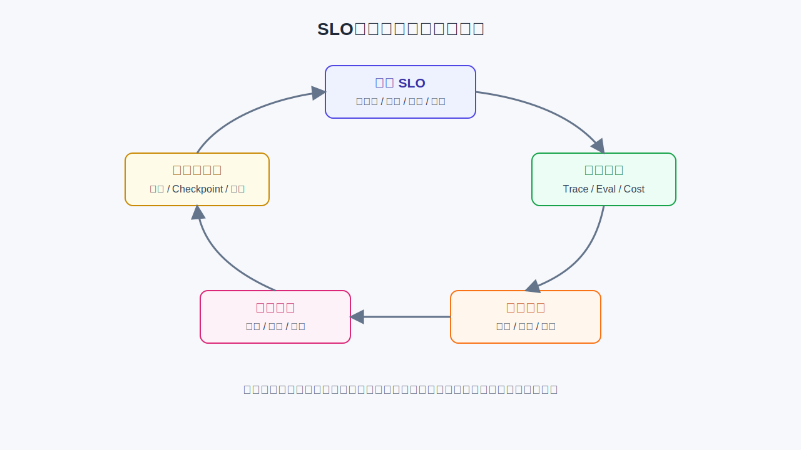

# 第42章 SLO 管理、限流与系统韧性

---

周一早高峰，销售经理批量生成经营周报。入口 API 仍在返回 `200`，监控也没有显示服务完全不可用，但用户拿不到报告，只能反复点击重新生成。系统从接口指标看是“活着”的，从业务结果看已经不可用。Agent 平台的 SLO 不能只写 HTTP 成功率。它要回答用户到底在等什么：首响应、任务完成、产物可恢复、权限不让步，还是成本不失控。限流、熔断、降级和错误预算都应围绕任务链路定义。

传统服务的稳定性通常围绕接口：请求是否成功、延迟是否超标、错误率是否上升。Agent 任务的稳定性更接近一条业务流水线。用户提交经营周报任务后，系统要理解问题、查数据、调用模型、生成图表、写报告、保存产物、必要时等待审批。任何一个步骤失败，入口 API 都可能已经返回成功；任何一个步骤变慢，用户看到的也可能只是“处理中”。所以 SLO 的对象必须从接口移到 Run，从单次请求移到任务结果。

高峰期会暴露这种差异。平台可以选择快速拒绝、排队、降级为摘要、转后台任务、要求用户缩小范围，也可以在低风险场景切换小模型。但有些边界不能被牺牲：权限过滤不能跳过，审批不能省略，数据质量警告不能被隐藏，成本不能靠无限重试硬撑。SLO 管理的本质，是把这些取舍写成可执行规则，让系统在压力下仍然做出一致选择。这也意味着 SLO 不是 SRE 单独定义的指标。业务 owner 要说明用户可接受的等待方式，平台团队要定义 Run 状态和恢复路径，数据团队要说明哪些查询可降级，安全团队要给出不能让步的控制项，FinOps 要给出成本预算。没有这些输入，SLO 会退化成“接口 99.9% 可用”，看起来标准，实际无法指导 Agent 事故处理。

---

## 42.1 周一早高峰暴露的是目标失配

周一上午 9 点，销售团队开始生成经营周报。每个销售经理都希望 DataAgent 读取销售数据、解释异常、生成图表，再输出一份可以发给区域负责人的简报。上线早期，平台把这个流程当作普通同步请求：前端发起一次请求，后端启动模型、查询数据库、渲染图表、生成文档，然后把结果一次性返回。平时这套链路看起来没有问题。故障出现在高峰期：模型服务排队，数据库查询超时，图表渲染进程积压，用户看不到进度，于是反复点击“重新生成”。入口请求被放大成更多任务，下游又因为重试被继续压垮。平台没有完全宕机，接口甚至可能还在返回 `200`，但用户拿不到报告，业务上已经不可用。

这类事故不能简单归因于“流量太大”。更具体的问题是，平台没有把用户预期翻译成工程目标。用户未必要求 10 秒内拿到完整 PPT，但至少希望 10 秒内看到任务已受理、当前进度和预计完成方式。用户可以接受完整报告排队，但不能接受刷新页面后任务丢失；可以接受高峰期先拿摘要、稍后拿精装版，但不能接受系统为了提速绕过权限检查。



*图42-1：SLO、错误预算与降级闭环。来源：本书自绘。Alt text：图中展示任务 SLO、观测指标、错误预算、保护动作和长任务恢复之间的闭环，说明稳定性治理如何从线上信号进入发布规则和运行时保护。*

### 42.1.1 SLO 要写成可度量目标

SLO 是 Service Level Objective，中文可称为服务等级目标。有效的 SLO 要可度量、可告警、可复盘，并能影响发布节奏。例如：

*表42-1：各 SLO 目标面向的用户预期与可观测口径。来源：本书整理。*

| 目标 | 面向的用户预期 | 可观测口径 |
| --- | --- | --- |
| 首响应及时 | 用户知道任务已经开始，不会面对空白页面。 | 95% 的交互式任务在 5 秒内返回进度或澄清问题。 |
| 最终可交付 | 用户最终拿到可用结果，不会只看到“处理中”。 | 财务分析任务成功率不低于 98%。 |
| 质量可接受 | 输出不能为了速度牺牲正确性。 | 核心回归集通过率不低于阈值，线上抽样质量不退化。 |
| 安全不让步 | 高峰和降级时仍遵守权限、脱敏与审批。 | 高风险任务越权率为 0。 |
| 成本可控 | 系统不会靠无限重试维持表面成功率。 | 单个成功任务平均成本不超过预算。 |

传统 Web 服务的 SLO 通常围绕可用性、延迟和错误率。Agent 平台要复杂得多：接口成功不代表 Run 成功，Run 成功不代表答案质量合格，答案生成很快也可能只是省略了关键证据。企业 Agent 的稳定性，应该被定义为：用户在可接受时间和成本内，安全地完成有质量的任务。SLO 应贯穿网关、运行时、模型、工具、产物和观测系统，而非只盯着入口服务。否则平台会在“技术上可用”和“业务上不可用”之间留下很大盲区。

把 SLO 绑定到 `run_id` 后，系统才能解释任务失败的位置。是模型排队、SQL 超时、图表渲染失败、文档写入失败，还是人工审批超时；不同失败会触发不同动作。模型排队可以降级或排队，SQL 超时可以缩小范围或转离线，审批超时可以提醒或升级，安全拦截则要终止并留证。统一按 HTTP 500 处理，只会让用户和工程师都失去线索。错误预算也要跟任务风险绑定。低风险知识问答可以用更多降级换取可用性，高风险 DataAgent 报告则宁愿延迟或转人工，也不能牺牲权限和证据。错误预算被耗尽后，团队要暂停高风险发布、收紧流量或增加人工复核，而非继续叠加新功能。这样 SLO 才会影响工程节奏，而非只在看板上显示红黄绿。

限流策略要尽量保护已经开始的任务。高峰期如果简单按入口请求限流，用户可能反复重试，制造更多重复 Run。更好的做法是识别任务指纹：同一用户、同一时间范围、同一报告类型的重复请求，优先返回已有 `run_id` 和进度；新请求进入队列或被降级。这样用户看到的是可恢复任务，而非一串失败请求。降级也要有用户语言。系统可以说“完整报告预计 12 分钟后完成，先返回关键指标摘要”，也可以说“当前数据源延迟，已保存任务并将在数据新鲜度达标后继续”。这些表达比“服务繁忙”更有用，因为它告诉用户任务没有丢、系统做了什么取舍、后续在哪里查看结果。稳定性体验还涉及后端指标，也包括用户是否理解系统状态。容量治理最后要落到计划。SRE 要知道哪些高峰可预测，平台要知道哪些任务可转离线，业务 owner 要知道哪些报告能提前生成，FinOps 要知道扩容是否换来了业务价值。没有这套计划，限流和熔断会被当成事故时的临时按钮，而非常态运营工具。

系统韧性还包括恢复后的清理。高峰期创建的后台任务、临时 artifact、排队中的低优先级请求和降级缓存，都需要在压力解除后处理。否则用户可能收到过期报告，缓存可能继续返回低精度结果，后台队列可能在业务低峰时仍然消耗成本。事故恢复也涉及服务变绿，还要确认任务状态、产物状态和用户通知都回到一致。SLO 复盘应避免只写“容量不足”。容量不足背后可能是模型路由错误、重试放大、任务无法去重、缓存命中率低、SQL 查询没有限流、GPU 扩容太慢，或者用户看不到进度反复提交。复盘要沿 `run_id` 拆解真实路径，把每一步的等待、失败和重试数量列出来。只有这样，下次改进才会落到具体组件，而非简单加机器。

错误预算还要影响发布节奏。预算充足时，可以扩大新模型、新工具或新报告模板的灰度；预算接近耗尽时，应暂停高风险变更，优先修复稳定性和质量问题。这个机制能防止平台在已经不稳定时继续叠加新能力。对业务团队来说，错误预算也提供了透明预期：为什么某个新功能要延后，为什么某个降级策略要先上线。韧性设计还要覆盖依赖方。Agent 任务依赖模型服务、向量库、OLAP 引擎、对象存储、文档生成、审批系统和消息系统。任一依赖变慢，Run 都可能卡住。平台应为关键依赖定义超时、重试、熔断和替代路径：模型服务拥堵时切换较小模型或排队，OLAP 超时时缩小查询范围，文档生成失败时保留 Markdown 草稿，审批系统不可用时生成待办重放任务。每条替代路径都要保留证据。

用户沟通也是韧性的一部分。系统发生降级时，要告诉用户当前拿到的是摘要版、草稿版、延迟版还是需要人工确认的版本；恢复后，要能通知用户完整产物已经生成。没有清楚状态，用户会用刷新、重试和人工催办来弥补不确定性，反而把系统压力放大。SLO 管理还要覆盖下线和清理。一个长期低使用率、高成本、高失败率的 Agent，如果没有业务 owner 继续承担价值，就应进入整改或下线流程。稳定性管理要把平台资源留给真正产生价值、并且有明确责任人的任务，而不是让所有服务永远运行。

### 42.1.2 服务等级目标应绑定任务

Agent 运行里常被误判的是粒度。一次用户点击可能触发一个 Run，一个 Run 可能包含多个 Step，一个 Step 又可能包含模型调用、工具调用、人工审批、产物写入和评测回写。若只按 HTTP 请求统计可用性，会把很多真实失败漏掉。例如一个经营周报任务，入口请求成功只说明平台受理了任务；SQL 查询成功只说明数据取到了；PPT 生成成功只说明产物写出来了。只有这些步骤在正确权限、正确口径、可接受成本下串起来，才算任务完成。因此，Agent SLO 的主对象应该是 `run_id`，不是入口请求 ID。第38章 中的 Trace、Step、Checkpoint 和 Artifact，正是 SLO 计算的底座。

## 42.2 从用户承诺推导 SLO：先分场景，再定指标

不同 Agent 不应套同一套 SLO。交互式问答、长任务分析、后台批处理、审批流和报表生成的等待方式不同，风险也不同。如果平台把它们都当成“用户请求”，指标会过于宽泛，最后无法指导治理。

### 42.2.1 不同场景有不同的等待语义

交互式问答强调首响应。用户可以接受系统先检索资料、再补充答案，但不能接受几秒钟没有任何反馈。这里的目标应拆成首响应和最终答案：首响应让用户知道系统正在工作，最终答案才衡量任务是否完成。长任务分析强调可恢复。生成 CFO 报告、批量分析合同、跑多轮财务归因，可能需要几分钟甚至更久。用户不一定盯着页面等，但需要随时查询进度，失败时看到原因，恢复时不重复执行已经完成的副作用步骤。后台批处理强调截止时间和成本。夜间生成 500 份门店摘要，不需要秒级响应，但要在早上 8 点前完成，并且不能因为模型重试把预算打穿。审批流则强调权限、审计和人工确认。只要涉及退款、发信、写库、变更客户状态，安全目标应高于延迟目标。

*表42-2：不同场景的等待语义与 SLO 应约束的对象。来源：本书整理。*

| 场景 | 用户关心的问题 | SLO 更应该约束什么 |
| --- | --- | --- |
| 交互式分析 | 快速看到进度，最终答案可用。 | 首响应、最终完成时长、任务成功率、质量抽样。 |
| 长任务报告 | 页面断开不丢，失败可解释。 | 进度可查、检查点恢复、产物可追溯、通知可靠性。 |
| 后台批处理 | 在截止时间前低成本完成。 | 吞吐、截止时间达成率、平均成本、失败重试成本。 |
| 高风险审批 | 不越权，不绕过人工确认。 | 权限命中率、审批完整性、审计完整率、安全违规为 0。 |

表 42-2 给出的是 SLO 设计顺序：先判断用户如何等待，再决定系统如何承诺。否则平台很容易为长任务设置不必要的秒级延迟目标，或者为高风险动作设置危险的自动重试策略。

### 42.2.2 目标与护栏要分开写

一个可执行的 SLO 通常需要同时包含目标和护栏。目标表达平台希望优化什么，护栏表达哪些边界不能被优化动作破坏。例如降低延迟可以通过切换小模型实现，但如果质量抽样明显下降，不能算稳定性改善。降低成本可以通过减少上下文实现，但如果指标口径漏掉，任务成功率会变成虚假的。下面是一个交互式财务分析 Agent 的示例：
```yaml
slo:
  name: finance_dataagent_interactive
  scope:
    agent_id: dataagent_finance
    task_type: interactive_analysis
  objectives:
    monthly_availability: ">= 99.9%"
    first_response_p95_ms: 5000
    final_answer_p95_ms: 60000
    run_success_rate: ">= 98%"
    average_cost_per_successful_run_usd: "<= 0.20"
  guardrails:
    safety_violation_rate: "0"
    regression_set_pass_rate: ">= 97%"
    judge_score_p50: ">= 0.80"
    human_handoff_rate: "<= 5%"
```

这里的关键在结构，不在字段名。`objectives` 是要达成的服务承诺，`guardrails` 是不能被牺牲的边界。对平台负责人来说，这种写法让 SLO 能进入产品承诺和发布治理；对工程师来说，它能直接落到指标采集、告警和网关策略；对 AI 研究人员来说，它说明模型优化要同时看任务质量、安全和成本，不能围绕单项分数独立推进。

### 42.2.3 SLI、SLO 与 SLA 的边界

服务等级指标（SLI）是实际测量值，例如“过去 7 天财务分析任务成功率为 98.6%”。服务等级目标（SLO）是内部承诺，例如“任务成功率不低于 98%”。服务等级协议（SLA）通常是对客户或业务方的正式承诺，可能涉及补偿、合规或合同条款。三者的关系可以理解为：SLI 告诉我们现在发生了什么，SLO 告诉我们是否达标，SLA 决定对外如何承诺。企业内部建设 Agent 平台时，通常先把 SLI 采准，再用 SLO 驱动治理，能力稳定后再包装进 SLA。反过来，如果还不能解释 Run 为什么失败，就过早承诺 SLA，后续事故只会变成组织问题。

## 42.3 指标要沿着任务链路展开

设计 SLO 后，下一步是把目标变成可观测指标。Agent 平台如果只看入口请求量和 HTTP 错误码，会漏掉藏在 Run 和 Step 里的问题。周一早高峰事故中，入口服务可能一直存活，但模型队列、SQL 工具、图表渲染和文档生成已经积压。

### 42.3.1 延迟要拆到链路阶段

Agent 延迟至少要拆成四段：入口受理到首响应，决定用户是否觉得系统有反应；首响应到最终答案，决定交互式任务是否可用；各个下游调用的内部耗时，决定问题慢在模型、数据库、检索、代码执行还是产物生成；排队等待，决定容量和优先级策略是否合理。只看总延迟会掩盖根因。一个 60 秒完成的任务，可能是模型生成花了 50 秒，也可能是排队 45 秒、实际执行只花 15 秒。前者需要模型路由或缓存优化，后者需要容量和队列策略。SLO 看板要允许从任务延迟下钻到 Step 延迟，再下钻到模型、工具、审批和产物写入。

### 42.3.2 成功率要分层计算

入口请求成功不等于任务成功。一个 Run 可能最终成功，但中间 SQL 重试 5 次，成本和延迟都被放大。平台应该同时观察任务成功率、关键步骤成功率、工具成功率、重试率、超时率、降级率和人工接管率。下面的层级可以作为最小指标地图：

*表42-3：成功率各分层指标的例子与主要用途。来源：本书整理。*

| 层级 | 指标例子 | 主要用途 |
| --- | --- | --- |
| 入口层 | 受理成功率、限流拒绝率、租户并发占用。 | 判断网关是否保护住系统。 |
| 运行层 | Run 成功率、取消率、可重试失败率、不可重试失败率。 | 判断任务是否完整完成。 |
| 步骤层 | 模型调用成功率、工具成功率、产物写入成功率。 | 定位瓶颈和责任域。 |
| 质量层 | 回归集通过率、线上抽样分、用户反馈、人工接管率。 | 防止快速但低质量的输出。 |
| 风险层 | 越权拦截、脱敏命中、审批完整、审计完整。 | 保证降级和重试不越过安全边界。 |
| 成本层 | 单成功任务成本、失败成本占比、缓存节省、租户成本。 | 防止用高成本换表面成功。 |

表 42-3 只是起点。进入工程实现后，每个指标都要绑定 `tenant_id`、`agent_id`、`run_id`、`trace_id`、模型版本、提示词版本、工具版本和语义层版本。否则指标只能告诉团队“变差了”，却不能告诉团队“因为什么变差”。

### 42.3.3 看板汇总与门禁项分开处理

管理层看板可以提供一个整体状态，例如“健康、关注、危险”。但工程治理不能依赖总分，因为不同指标的风险性质不同。延迟、成本、缓存命中率这类指标适合看趋势；权限泄漏、未审批写操作、跨租户访问这类指标则是门禁项，一旦发生就应该阻断发布或升级处理。可以用一个简单例子说明。某个版本把 P95 延迟从 60 秒降到 35 秒，单任务成本也下降了 20%，但 Safety Set 中出现 1 个越权样本。这个版本不能因为“总体更快、更便宜”而进入生产扩量。相反，如果延迟略有上升，但质量回归、权限检查和成本都稳定，团队可以根据业务场景决定是否接受。成熟看板应先展示分层指标，再给出聚合视图。聚合状态用于发现趋势，Trace 用于定位根因，门禁项用于决定能不能发布。

## 42.4 错误预算决定发布节奏

错误预算来自站点可靠性工程。简单说，如果某个服务的月度 SLO 是 99.9%，那么剩下的 0.1% 就是这个周期内允许消耗的失败空间。它把快速迭代和稳定可靠之间的取舍变成可计算的边界。

### 42.4.1 Agent 的错误预算也约束质量、成本和风险

Agent 平台的错误预算可以有多种对象：可用性预算、延迟预算、任务失败预算、质量退化预算、成本超支预算。安全预算通常应为 0，也就是不允许越权访问、敏感泄漏和未审批高风险动作。假设某财务 DataAgent 每周有 10 万次交互式任务，任务成功率 SLO 是 98%。那么一周最多允许 2000 次任务失败。如果周三已经消耗 1800 次失败预算，后续发布就应该收紧。此时再上线一个新的 Planner 提示词，即使离线评测看起来略有提升，也要谨慎，因为剩余预算已经无法承受灰度波动。任务失败预算可以写成：$$
Budget_{failure} =
N_{runs} \times (1 - SLO_{success})
$$

如果考虑严重程度，还可以让不同失败消耗不同预算。做法不必复杂：普通模型超时记为 1 次失败，生成报告格式错误记为 2 次失败，重复发客户邮件、错误写库、权限泄漏直接记为高严重度失败，甚至作为安全门禁单独处理。这样做的意义是让平台不会把所有失败都当成同一种“失败数”。在企业场景里，100 次普通超时和 1 次越权泄漏不应该被同一套平均值掩盖。

### 42.4.2 预算把发布治理从感觉变成规则

错误预算充足时，团队可以正常发布、灰度实验和尝试新模型。预算消耗过快时，暂停非必要变更，优先修复失败原因。预算耗尽时，进入变更冻结，只允许稳定性修复。这个机制比“最近感觉不稳定，先别发”更可执行，也比“为了稳定停止所有创新”更健康。

*表42-4：错误预算各状态对应的平台动作与发布策略。来源：本书整理。*

| 预算状态 | 平台动作 | 发布策略 |
| --- | --- | --- |
| 预算充足 | 保持正常监控，允许实验。 | 小流量灰度、普通功能发布。 |
| 消耗过快 | 下钻失败 Trace，聚类根因。 | 暂停高风险变更，优先修复稳定性。 |
| 预算耗尽 | 触发复盘，收紧限流与降级。 | 只允许修复性发布。 |

把错误预算和第39章的回归评测结合起来，发布验收会更清楚：新版本要同时满足离线质量不退化、线上预算可承受、关键安全样本不失败。只通过 benchmark 但耗尽错误预算的版本不应继续扩量；预算充足但回归集失败的版本也不应上线。到这里，SLO 已经回答了“承诺什么”，指标回答了“如何发现偏离”，错误预算回答了“什么时候收紧”。下一步才是运行时策略：当偏离正在发生时，平台如何阻止问题继续放大。

## 42.5 限流、熔断与降级是三道防线

回到周一早高峰。事故之所以扩散，是因为入口请求被下游步骤放大，失败又被重试继续放大。系统韧性不要求所有下游永远健康；它要求下游变慢、变错或不可用时，平台仍能以可控方式继续服务。三道防线分别对应三类放大机制。限流处理入口放大，防止请求和长任务无限进入系统；熔断处理下游放大，防止不健康工具被持续打满；降级处理能力缺口，在完整能力不可用时给出可接受替代。三者顺序不同，但目标一致：把局部问题限制在局部。

### 42.5.1 限流先保护入口，也保护公平性

限流控制进入系统的请求量。常见策略包括用户并发上限、租户请求上限、Agent 类型上限、长任务排队上限和重复请求去重。对 Agent 平台来说，限流既防止宕机，也在多租户环境里保护公平性。重复点击是典型放大源。用户在页面上连续点击“重新生成”，平台不应创建多个相同任务，而应根据任务指纹返回已有 `run_id`。下游不会被重复任务打爆，用户看到的也是同一个任务的进度，而非一串互相竞争的任务。

### 42.5.2 熔断隔离不健康下游

熔断用于隔离已经明显不健康的下游。如果 SQL 工具连续超时，继续把请求打过去只会增加排队和超时；如果某个模型服务延迟飙升，网关应该暂时停止路由到它，等冷却窗口结束后再小流量探测。熔断是保护系统的中间状态，不是失败的终点。它应该同时触发可解释反馈和替代路径。例如 SQL 工具熔断时，交互式任务可以返回“数据查询服务繁忙，已转为异步处理”；报告任务可以先输出已缓存摘要；高风险写操作则应停止执行并等待人工处理。

### 42.5.3 降级能力的安全底线

降级是在完整能力不可用时，提供可接受的替代方案。高峰期可以先返回文字摘要和核心图表，详细 PPT 稍后生成；可以减少上下文，只保留最近对话和关键摘要；可以关闭非关键工具；可以把同步任务改成异步任务；也可以把高风险动作转成人工审批。降级有一个底线：不能绕过安全。主 SQL 连接超时，不能自动切到一个没有权限策略的备用连接；大模型不可用，也不能让小模型执行本来需要人工审批的动作。稳定性机制如果突破权限、脱敏和审批，本身就会变成事故来源。一个网关保护策略可以这样写：
```yaml
protection_policy:
  rate_limit:
    per_user_concurrent_runs: 3
    per_tenant_qpm: 500
    duplicate_task_window_seconds: 300
  circuit_breaker:
    sql_executor:
      open_when_error_rate_gt: 0.30
      window: 2m
      cool_down: 5m
    model_primary:
      open_when_p95_latency_gt_ms: 30000
      window: 5m
      cool_down: 3m
  degradation:
    high_load:
      disable_optional_tools: ["chart_beautify", "ppt_theme_render"]
      max_context_tokens: 12000
      prefer_async: true
    policy_sensitive:
      mode: read_only
      require_human_approval: true
```

策略配置只是表层，背后的优先级更重要：先保护安全，再保护系统容量，再在可解释范围内牺牲非关键体验。这个顺序不能反过来。

## 42.6 长任务与单个 HTTP 请求生命周期的解耦

很多 Agent 任务不是几秒钟完成的。生成报告、分析一批工单、跑多轮数据查询、等待人工审批，都可能持续几分钟到数小时。如果这些任务绑定在单个 HTTP 连接上，浏览器刷新、网络断开、服务重启都会导致状态混乱。这也是上一节降级策略能够成立的前提。平台说“转为异步任务”“稍后生成完整 PPT”“等待人工审批”，要有独立于页面连接的任务模型承接这些状态。否则所谓降级只是前端文案，后台仍然可能丢任务、重复执行或无法解释失败。

### 42.6.1 状态边界承担恢复语义

长任务应该有独立的 `run_id`、状态机、检查点和进度查询接口。用户提交任务后，前端拿到 `run_id`，后续通过轮询或消息推送查询进度。Runtime 在关键 Step 后写入 Checkpoint，失败后可以从最近安全点恢复。一个长任务状态机可以这样表达：
```text
submitted -> queued -> running -> waiting_approval -> running -> succeeded
                              \-> failed_retryable -> queued
                              \-> failed_terminal
                              \-> cancelled
```

这里要特别区分 `failed_retryable` 和 `failed_terminal`。前者表示可重试失败，例如模型超时、临时网络错误、下游服务短暂不可用；后者表示不可重试失败，例如权限拒绝、参数不合法、数据不存在。Agent 如果混淆这两类，就会出现无效重试，甚至重复副作用。

### 42.6.2 检查点记录“恢复所需事实”

Checkpoint 不应把所有中间内容都塞进数据库，而应保存恢复任务所需的事实：已经完成哪些步骤，哪些工具调用产生了副作用，哪些产物已经写入，下一步从哪里继续，恢复时需要重新校验哪些权限和数据版本。发送邮件、写数据库、创建工单都不是天然幂等的操作。幂等的意思是同一个操作重复执行，不会造成重复副作用。对这类步骤，平台需要使用 `idempotency_key`，让恢复逻辑能够判断“这一步是否已经执行过”。
```json
{
  "run_id": "run_report_042",
  "step_id": "step_send_report",
  "tool": "email.send",
  "idempotency_key": "run_report_042:step_send_report:v1",
  "status": "succeeded",
  "artifact_refs": ["ppt_report_042"],
  "checkpoint_id": "ckpt_042_006",
  "resume_from": "step_notify_user"
}
```

长任务可靠性来自多个机制共同作用：队列负责缓冲，心跳负责判断执行器是否存活，Checkpoint 负责恢复，幂等 key 防止重复副作用，超时策略防止任务无限挂起，人工审批状态防止高风险动作自动继续。它们共同把“页面等着结果”改造成“任务可排队、可恢复、可解释”。

### 42.6.3 进度反馈也是稳定性的一部分

用户看到“处理中”三个字，并不能判断系统是否健康。更好的反馈应说明任务处于哪个阶段、是否需要用户动作、是否已经降级、预计如何交付。例如“正在查询最新财务数据”“等待财务负责人审批”“图表已生成，PPT 正在排队”“SQL 服务繁忙，已转为异步任务”。这些状态既改善前端体验，也能减少重复提交。用户知道任务仍在推进，就不会反复点击；用户知道失败不可重试，就不会制造无效请求。稳定性的一部分，来自让用户理解系统状态。

## 42.7 容量规划中的步骤放大效应

Agent 平台的容量规划要从入口 QPS 继续展开。一次入口请求会放大成多次模型调用、工具调用、检索调用、产物写入和观测写入。周一早高峰事故里，入口只是“一批用户生成周报”，但每份周报背后都有数据查询、图表、文档生成、质量抽样和 Trace 写入，下游压力远高于入口流量。前面讨论的是事故发生时如何保护系统，容量规划解决的是另一半问题：如何减少保护机制被频繁触发。限流、熔断和降级不能替代容量建设。如果系统长期依赖降级维持可用，说明 SLO、任务分级或资源供给本身需要重新设计。

### 42.7.1 从入口流量推算真实工作量

可以用一个粗略公式估算工作量：$$
Workload =
QPS_{entry}
\times AvgStepsPerRun
\times AvgCallsPerStep
\times RetryFactor
$$

如果入口是 10 QPS，每个 Run 平均 6 个 Step，每个 Step 平均 1.5 次下游调用，重试放大系数是 1.2，那么下游调用可能达到 108 QPS。这里还没有计算 token 长度、查询复杂度、产物大小和评测抽样。真实容量规划要把这些放大因素展开，否则线上压力总会比压测结果更大。

### 42.7.2 不同资源有不同瓶颈

模型服务关注 token 吞吐、并发、显存、缓存命中和排队长度。工具执行器关注 SQL、代码执行、浏览器任务和外部 API 的隔离。队列系统关注积压量、优先级和超时。存储系统关注 Trace、日志、产物和评测结果的写入量。评测系统还要避免线上 Judge 抢占用户任务资源。

*表42-5：各资源域的主要瓶颈与 SLO 相关信号。来源：本书整理。*

| 资源域 | 主要瓶颈 | SLO 相关信号 |
| --- | --- | --- |
| 模型服务 | token 吞吐、并发、排队、缓存命中。 | 模型调用延迟、超时率、每任务 token 成本。 |
| 工具执行器 | SQL 查询、代码沙箱、外部接口限额。 | 工具成功率、重试率、下游熔断次数。 |
| 队列系统 | 积压、优先级反转、执行器心跳。 | 排队时长、截止时间达成率、取消率。 |
| 存储系统 | Trace、日志、产物、评测结果写入。 | 写入延迟、对象读取失败、审计完整率。 |
| 评测系统 | 在线抽样与离线回归抢资源。 | 抽样延迟、评测成本、发布验收耗时。 |

缓存命中率也会影响容量。提示词前缀缓存、语义缓存、产物缓存命中率下降，可能导致模型吞吐突然不足或工具调用激增。因此缓存既是第41章的成本手段，也是容量和 SLO 的一部分。

### 42.7.3 瓶颈资源的弹性伸缩范围

很多团队在高峰期会先扩模型实例，但 Agent 的瓶颈常常在工具、队列或存储。模型扩容后，如果 SQL 池、图表渲染、对象存储或 Trace 写入没有跟上，反而会把下游打得更满。更可靠的弹性伸缩策略应按任务类型拆分：交互式任务优先保障首响应和澄清；长任务按队列积压扩执行器；报告生成按产物渲染池扩容；离线评测和批处理在高峰期降优先级。容量规划不能把所有资源同时加大，而要在 SLO 约束下把稀缺资源分配给最有业务价值的任务。

## 42.8 稳定性建设的运营链路

企业级稳定性不等于“服务不宕机”。对 Agent 平台来说，稳定性包括服务可用、延迟可控、任务完成、质量不退化、成本不失控、风险可拦截、事故可复盘。

### 42.8.1 观测、评测、成本和 SLO 要连在一起

第38章的可观测性告诉我们一次任务到底怎么跑；第39章的离线评测告诉我们系统在固定任务空间上的质量边界；第40章的在线评测观察真实用户分布下的质量变化；第41章的成本治理解释 token、缓存和重试的经济性；本章的 SLO 把这些信号变成服务承诺和发布规则。缺少 Trace，事故无法复盘；缺少 benchmark，修复无法回归；缺少在线抽样，真实退化无法发现；缺少成本治理，高峰期系统可能靠重试自我放大；缺少 SLO，团队不知道什么时候该发布、什么时候该冻结。这几个系统合在一起，形成平台运营链路：线上 Trace 支撑事故复盘和失败样本沉淀，失败样本进入离线回归评测，评测结果和 SLO 指标共同影响发布验收，错误预算和成本看板决定是否继续灰度或收紧变更。这属于平台能力，不是文档流程。每次线上失败都应能进入样本候选池，每次修复都应能回归验证，每次发布都应能和错误预算关联。

### 42.8.2 指向可行动对象的告警

告警不应只看 CPU 或 HTTP 500，还要看任务成功率、P95 延迟、质量抽样、失败成本、安全违规和错误预算消耗。告警还要指向可行动对象：哪个租户、哪个 Agent、哪个版本、哪个 Step、哪个下游、哪个策略。一次稳定性复盘也不应只写“模型不稳定”。更有价值的复盘要回答：失败集中在哪类任务，是否发生在特定语义层版本，是否由某个工具超时引起，是否触发了熔断，降级是否可解释，错误预算消耗多少，哪些样本需要加入 Regression Set 或 Stress Set。

*表42-6：事故复盘各字段及其必要性。来源：本书整理。*

| 复盘字段 | 为什么需要 |
| --- | --- |
| `tenant_id`、`agent_id`、`run_id` | 确认影响范围，避免泛化成“全平台问题”。 |
| 模型、提示词、工具、语义层、策略版本 | 判断是否由版本变更引起。 |
| 失败 Step 与错误类型 | 定位责任域，而非笼统归因给模型。 |
| SLO 影响与错误预算消耗 | 决定是否冻结发布或扩展降级。 |
| 回归样本编号 | 确保同类问题不会只修一次、忘一次。 |

### 42.8.3 贴近 Agent 任务的压测和故障注入

传统压测常常只打入口接口，而 Agent 压测应模拟真实任务链路：高峰流量、上下文变长、下游超时、缓存失效、工具返回空结果、人工审批积压、产物存储变慢。否则压测通过，只能说明入口服务能接住请求，不能说明任务能完成。故障注入的价值也在这里。主动让 SQL 工具超时、让模型延迟变高、让缓存命中率下降，可以验证限流、熔断、降级、检查点和错误预算是否真的生效。韧性来自平时演练和校准，不能等事故发生后再补。

## 42.9 案例回放：高峰期报表生成保护

回到周一早高峰的周报事故。改造后的平台先重新定义场景 SLO：交互式预览在 10 秒内返回进度和摘要，完整 PPT 可以异步完成，并在 30 分钟内通知用户；安全违规率为 0；单份报告平均成本不得超过预算。入口层增加限流和去重。每个用户最多同时运行 2 个报告任务，每个租户有并发上限，重复点击同一任务返回已有 `run_id`，不创建新任务。用户焦虑点击不会继续放大下游压力。执行层把报告生成改成长任务。任务进入队列，执行器异步处理，前端展示阶段性进度，每个关键步骤写入 Checkpoint。高峰期先生成文字摘要和核心图表，PPT 美化步骤稍后执行；常用周报数据提前物化；指标解释和 schema 说明进入缓存；低优先级批处理让路给交互式任务。

下游层增加熔断和可解释降级。如果 SQL 工具超时率超过阈值，平台暂停新报表查询，返回“数据查询服务繁忙，已转为异步处理”的状态，禁止 Agent 无限重试。失败 Trace 会进入 Regression Set 和 Stress Set，下次发布前要通过压力测试。运营层把这次事故纳入错误预算治理。如果一周内报告任务失败预算被快速消耗，平台应暂停非必要的报表模板变更和模型路由实验，只允许稳定性修复继续发布。等压力测试和回归样本通过后，再逐步恢复灰度。这一步让事故处理从“当场救火”变成“约束后续变化”。改造后，用户不一定更快拿到完整 PPT，但平台从“同步阻塞、重复请求、级联超时”转为“可排队、可恢复、可降级、可解释”。系统韧性不要求每个下游永远健康，它要求下游变慢或失败时，业务仍能以可控方式继续运行。

---

韧性演练也应成为常态。团队可以定期模拟模型服务超时、向量库不可用、OLAP 查询变慢、审批系统断开和对象存储写入失败，观察 Run 是否能进入正确状态、用户是否看到合理提示、后台任务是否能恢复。演练暴露的问题比生产事故便宜得多，也能校准 SLO 是否写得过于理想。SLO 的最终价值，是让平台在压力下仍然保持一致行为。用户知道任务在哪里，业务 owner 知道哪些承诺会被保护，SRE 知道应该先恢复哪条链路，平台团队知道哪些发布需要暂停。做到这一点，稳定性就会进入 Agent 平台的产品能力，而不只停留在基础设施指标。SLO 文档还要写给业务方看。业务方不需要理解所有指标实现，但需要知道高峰期系统会怎样取舍：哪些任务会排队，哪些会先给摘要，哪些会转人工，哪些会被拒绝。把这些预期提前写清，事故时就不会把每一次降级都理解成平台失败。

## 42.10 SLO 变更的业务复核

SLO 调整会改变用户能得到的承诺，也会改变平台在高峰期的取舍。把报告任务的完成时限从 10 分钟放宽到 30 分钟，技术上可能只是队列参数变化；对业务方来说，这意味着会议前能否拿到完整材料。把低优先级问数任务转入异步执行，技术上可能降低成本；对一线运营来说，这可能影响当天决策节奏。因此 SLO 变更不能只由平台团队根据监控指标决定，还要让业务 owner 参与复核。复核的重点是场景承诺：哪些任务仍保证首响应，哪些任务允许排队，哪些任务可以给摘要，哪些任务必须失败得清楚，哪些任务在任何降级路径下都不能绕过审批和审计。

业务复核应基于样本任务，而不是抽象指标。平台可以选取高频对话、长报告生成、数据查询、审批等待、外部系统写入和批量评测等样本，分别说明 SLO 调整后的用户体验、后台状态、成本变化和风险边界。若错误预算被快速消耗，业务方需要知道后果：暂停模板发布、限制高成本查询、延后模型路由实验，或把部分任务转入人工处理。若 SLO 放宽后仍无法保护高价值任务，说明问题可能在容量、缓存、任务拆分或下游契约上，不能只靠改指标解决。

SLO 变更还要有回滚条件。某些调整看起来能降低失败率，却可能把延迟转嫁给用户；某些限流策略看起来能保护系统，却可能让关键岗位在高峰期无法完成任务。平台发布 SLO 变更时，应预先写清观测窗口、影响人群、允许的投诉阈值、回放样本和恢复路径。业务复核通过后，Trace、Eval、成本治理和告警规则也要同步更新。这样 SLO 才会成为真实的运行承诺，而不是一组停留在监控系统里的数字。

## 42.11 SLO 与发布冻结

SLO 不只影响故障处理，也应影响发布节奏。当错误预算消耗过快、长任务排队持续上升、人工接管率异常或关键任务降级频繁时，平台应冻结部分发布。冻结对象不一定是全平台变更，可以按风险分层：暂停模型路由实验、暂停高成本 Prompt 模板、暂停新工具进入默认候选集、暂停低优先级批量评测，或者限制高风险租户的自动写操作。发布冻结的目的，是把系统从不稳定状态拉回可解释范围。

冻结规则要提前写清。平台不能等事故发生后再临时决定哪些团队可以发版、哪些需求要等。每类 SLO 应对应具体门槛和动作：首响应超标影响交互体验，先冻结前端流式策略和网关路由；最终完成超标影响报告和长任务，先限制异步队列和批量生成；质量退化影响用户信任，先暂停 Prompt 和模型实验；成本预算异常影响平台运营，先限制高成本任务和评测抽样。这样发布节奏会由运行证据驱动，而不是由会议判断驱动。

发布冻结还要给业务方解释。业务团队需要知道冻结会影响哪些需求、持续多久、解除条件是什么，以及是否有替代路径。若冻结只是平台团队内部状态，业务方会继续推动上线，反而制造更多例外。更好的做法是把冻结状态写入发布看板，说明当前受保护的任务、已消耗错误预算、暂停的变更类型和下一次复核时间。这样 SLO 会变成跨团队共享的运行承诺。

早期可以先对核心链路设置冻结策略：模型网关、Runtime、DataAgent、HITL 和报告发布。每次冻结和解冻都留下 Trace、告警、错误预算和业务影响记录。长期看，这些记录能帮助团队判断哪些能力经常把系统推到不稳定边缘，也能反向指导容量规划和产品承诺。SLO 的价值在于让平台知道何时继续变化，何时先稳住运行。

## 42.12 SLO 违约后的发布冻结

SLO 违约不应只触发告警。对于企业 Agent，连续超时、错误率上升、人工接管过高、成本异常或安全拦截激增，都可能说明当前版本不适合继续扩流。平台需要把 SLO 违约和发布节奏连接起来：某些违约会暂停新版本发布，某些会停止灰度扩大，某些会要求回滚或进入人工复核。

发布冻结要有明确条件。比如 P95 延迟连续两小时超阈值、关键任务成功率低于门槛、安全样本失败、某租户成本超过预算、人工接管率异常，都可以触发冻结。冻结期间，团队仍可修复和验证，但不能扩大流量或发布相关能力。解除冻结需要看到复测样本、线上观察和 owner 签字，而不是告警短暂恢复。

早期可以在发布系统中加入 SLO gate。每个 gate 绑定指标、阈值、影响范围、冻结动作和解除条件。Trace、Eval、成本和安全台账共同提供证据。这样 SLO 从看板指标进入平台发布控制，可靠性也会成为产品节奏的一部分。

## 42.13 SLO 违约后的业务处置

SLO进入生产后，新增能力不能只看功能是否可用，还要看运行证据能否被不同角色复用。平台需要把违约时间、受影响用户、降级策略、补偿动作、事故样本和复审时间记录成稳定字段，并和发布单、Trace、评测样本以及事故记录关联起来。这样一次线上问题发生后，团队可以沿着同一组事实判断影响范围、责任归属和修复顺序，而不是在模型日志、业务日志和人工说明之间来回拼接。

这类证据还要服务相邻章节的能力。它和第38章 Trace、第41章成本治理和第53章运营节奏相连：上游能力提供输入假设，下游能力使用执行结果，治理能力负责保存证据和复审结论。若这些材料没有统一编号和版本，章节里讨论的工程能力在生产中会被拆散。业务 owner 只能看到用户投诉，平台 owner 只能看到系统错误，安全或合规团队只能看到事后说明，最后很难判断问题到底来自数据、模型、工具、流程还是组织责任。

生产环境中常见的风险包括只记录技术告警、业务 owner 不知道影响范围、降级后没有用户解释。这些问题在演示阶段不明显，因为演示通常只覆盖成功路径；上线后，用户会带来边界问题、重复请求、权限变化和长时间运行状态。平台团队应把失败样本纳入发布节奏，记录哪些样本需要阻断发布，哪些样本可以通过降级处理，哪些样本需要业务 owner 接受剩余风险。

SLO 应连接用户承诺和平台运行，违约后要有业务可读的处置记录。这份记录不需要复杂，但要包含时间、版本、owner、样本、处置动作和下次复查条件。没有这些字段，复盘会停留在口头经验；有了这些字段，平台才能把一次问题转成后续发布、评测和培训材料。

早期平台可以从少量高风险场景开始。先选择调用量高、业务影响大或涉及敏感数据的路径，要求每次变更都留下证据包，再逐步推广到普通场景。这样章节里的能力不会停留在概念层，而会成为可运行、可解释、可退回的工程系统。

## 42.14 SLO 复盘中的用户沟通

SLO 复盘要包含用户沟通。平台内部知道一次延迟、降级或取消的原因，并不代表用户理解发生了什么。对于影响范围明确的事故，产品侧应说明受影响任务、恢复状态、是否需要用户重试、已有 artifact 是否可信、后续是否会补发结果。沟通材料要来自 Trace 和事故记录，避免运营人员临时猜测。

用户沟通也会反向校准 SLO。若用户最关心报告是否可信，单纯优化响应时间价值有限；若用户愿意等待但不能接受无解释失败，降级策略就要优先改提示和恢复路径。早期可以把用户沟通模板纳入 SLO 复盘，让可用性指标和用户体验保持同一口径。

## 本章小结

Agent SLO 的对象是任务，而非单次接口调用。企业平台要承诺用户能在可接受时间和成本内完成有质量的任务，这个承诺需要拆到首响应、最终完成、任务成功、质量、安全、成本和恢复能力上。限流、熔断和降级保护的是同一条任务链路。限流控制进入量，熔断隔离不健康下游，降级提供替代路径。任何降级路径都不能绕过权限、脱敏、审批和审计，否则稳定性会以安全风险为代价。长任务需要状态机、检查点、幂等 key 和进度查询；容量规划需要看到步骤放大、重试放大、缓存命中和评测抽样。本章与第22章、第30章、第38章至第41章相互衔接：Runtime 负责状态，HITL 负责等待与恢复，Trace 和评测负责发现退化，成本治理负责约束放大效应。

## 参考文献

Beyer, B. et al. (2016). [*Site Reliability Engineering*](https://sre.google/sre-book/table-of-contents/). O'Reilly.Beyer, B. et al. (2018). [*The Site Reliability Workbook*](https://sre.google/workbook/table-of-contents/). O'Reilly.Envoy Proxy. (n.d.). [Rate limit filter documentation](https://www.envoyproxy.io/docs/envoy/latest/configuration/http/http_filters/rate_limit_filter).Kubernetes. (n.d.). [Horizontal Pod Autoscaling documentation](https://kubernetes.io/docs/tasks/run-application/horizontal-pod-autoscale/).
