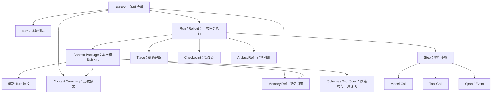
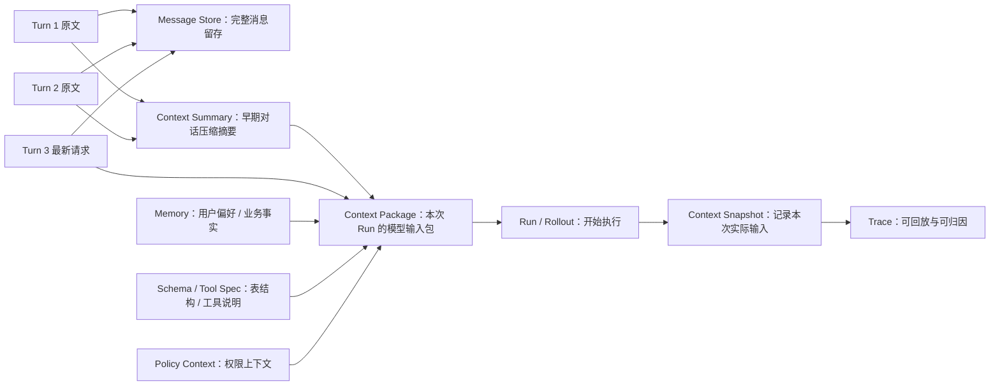
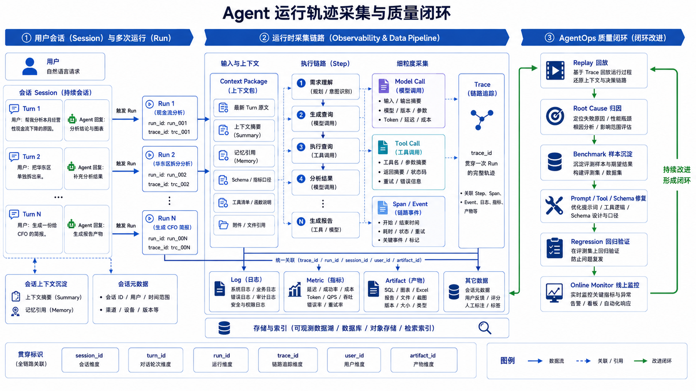

# Ch.38 Agent 可观测性与运行诊断

> **本章目标**：读者学完能说清一次 Agent 运行会沉淀哪些数据，能区分会话、运行、Trace、Memory、Checkpoint、Artifact、日志与指标的边界，并能基于这些观测数据还原执行过程、定位失败原因、推动 AgentOps 质量闭环。
> **关键议题**：Agent 运行数据地图；Session、Run、Trace、Memory、Checkpoint、Artifact 的边界；运行轨迹采集；日志、指标、Trace 与产物的关联；会话回放与失败诊断；AgentOps 质量闭环实践
> **前置阅读**：[Ch.01 Agent 的本质](../part01-overview/ch01-agent.md)、[Ch.22 Agent Runtime](../part05-agent-capabilities/ch22-agent-runtime.md)、[Ch.23 Tool Registry & Function Calling](../part05-agent-capabilities/ch23-tool-registry-function-calling.md)、[Ch.30 Human-in-the-loop 与长任务](../part05-agent-capabilities/ch30-human-in-the-loop.md)
> **估计阅读**：L1 15 min / L1+L2 45 min / 全章 90 min
> **mini-platform 关联**：本章节暂不体现
> **实战项目**：本章节暂不体现
> **按角色推荐阅读**：平台负责人 ⇒ 1、6、7 ｜ 架构师 ⇒ 全章 ｜ 工程师 ⇒ 全章 + 实战项目
> **本章阅读层级**：L1 概念侧重 Agent 运行数据地图与核心边界，主要对应第 1 节；L2 架构侧重轨迹采集、关联键与诊断链路，主要对应第 2-3 节；L3 工程侧重 AgentOps 闭环、上线检查清单与实战项目，主要对应第 4 节和本章小结。

---

## 1. Agent 运行会留下什么

在 Ch.01 中，Agent（智能体）被定义为“以 LLM（Large Language Model，大语言模型）为决策内核、能够调用工具完成多步任务的程序实体”。到了生产环境，问题会变成：一次 Agent 跑完之后，平台到底应该把什么存下来？

先看一个多轮对话：


| 轮次    | 用户看到的对话               | 后台实际发生的事                             |
| ----- | --------------------- | ------------------------------------ |
| 第 1 轮 | “帮我看一下本月经营性现金流为什么下降。” | Agent 生成 SQL、执行查询、分析原因、生成图表。         |
| 第 2 轮 | “把华东区单独拆出来。”          | Agent 需要理解“华东区”是在上一轮现金流分析的基础上追加过滤条件。 |
| 第 3 轮 | “生成一份给 CFO 的简报。”      | Agent 需要复用前两轮结论、图表和数据口径，生成报告产物。      |


从这个例子出发，运行数据可以先分成四类：


| 类别     | 先回答的问题                 | 主要对象                                                    |
| ------ | ---------------------- | ------------------------------------------------------- |
| 会话层    | 用户聊了什么？前端要展示什么？        | Session（会话）、Turn（对话轮次）                                  |
| 执行层    | 这次任务具体怎么跑的？哪一步失败？      | Run（运行）、Rollout（展开轨迹）、Step（执行步骤）、Trace（链路追踪）            |
| 上下文层   | 下一轮对话如何接上上一轮？哪些内容进入模型？ | Context Package（上下文包）、Context Summary（上下文摘要）、Memory（记忆） |
| 产物与运营层 | 生成了什么？能否恢复？成本和稳定性如何？   | Artifact（产物）、Checkpoint（检查点）、Metric（指标）                 |


这里先定几个口径：**Session** 是一段连续用户会话；**Turn** 是会话中的一轮用户输入或 Agent 回复；**Run** 是 Agent 为完成某个任务启动的一次执行；**Rollout** 强调这次 Run 从开始到结束展开出来的完整轨迹；**Trace** 是把轨迹中的 Step、Span（有开始和结束的操作）和 Event（瞬时事件）串起来的链路追踪结构。

### 1.1 对象之间是什么关系

先看包含关系。这个图只表达“谁包含谁、谁引用谁”，不表达执行先后。最容易混淆的是 Session 和 Run：**一次 Session 是一段持续会话，可以包含多轮 Turn，也可以触发多次 Run；Run 只是其中某一次任务执行**。例如用户先问一次分析，再要求改口径、生成报告，这通常仍在同一个 Session 里，但会产生多次 Run。



图里的对象可以按“会话、执行、上下文、产物与诊断”四类理解：

| 对象 | 含义 | 主要用途 |
| --- | --- | --- |
| Session | 一段连续用户会话，通常包含多轮用户输入和 Agent 回复，也可能包含多次任务执行。 | 保持对话连续性，支持前端回看、会话恢复和用户体验分析。 |
| Turn | 会话中的一轮消息，可以是用户请求、Agent 回复，也可以带附件或产物引用。 | 记录用户真正说了什么、Agent 当时回复了什么。 |
| Run / Rollout | Agent 为完成某个任务启动的一次执行；Rollout 强调整个执行轨迹。 | 记录一次任务从开始到结束的状态、步骤、耗时和结果。 |
| Context Package | 某次模型调用前实际组装出来的上下文输入包。 | 回答“模型当时到底看到了什么”。 |
| Context Summary | 对早期多轮对话压缩后的摘要。 | 节省 token，同时保留对后续任务有用的关键事实。 |
| Memory Ref | 长期记忆或跨会话事实的引用，不一定直接保存全文。 | 让 Agent 复用用户偏好、业务事实或历史结论。 |
| Schema / Tool Spec | 表结构、指标口径、工具说明、函数参数等可调用能力描述。 | 帮助模型选择正确工具、生成正确参数。 |
| Step | Run 里的一个可观察执行步骤。 | 定位任务卡在哪一步、哪一步失败或变慢。 |
| Model Call | 一次模型调用。 | 记录模型输入输出摘要、模型版本、token 和延迟。 |
| Tool Call | 一次工具调用，例如查数据库、读文件、调业务 API。 | 记录工具名、参数摘要、返回摘要、错误和重试。 |
| Span / Event | Span 表示有开始和结束的操作，Event 表示瞬时事件。 | 还原时间线，分析耗时、失败、重试和状态切换。 |
| Trace | 串联 Step、Span、Event、日志和指标的链路追踪结构。 | 支持回放、排障、根因分析和评测样本沉淀。 |
| Checkpoint | 任务执行过程中的恢复点。 | 长任务中断后从已知状态继续执行，避免重复副作用。 |
| Artifact Ref | 生成产物的引用，例如 SQL、图表、Excel、报告或 PPT。 | 支持交付、审计、下载、版本管理和权限控制。 |

箭头表示“包含或引用”，不是时间顺序：

| 关系 | 怎么理解 |
| --- | --- |
| Session → Turn | 一个会话包含多轮消息。Turn 是用户体验和会话回看的基本单位。 |
| Session → Run / Rollout | 一个会话可以触发多次任务执行。每当用户提出一个需要 Agent 实际规划、调用模型或调用工具的任务时，平台通常会创建一次 Run；后续追问、改口径、生成报告，往往是在同一个 Session 下继续产生新的 Run。 |
| Session → Context Summary / Memory Ref | 会话可以产生摘要，也可以引用长期记忆；摘要来自会话历史，记忆可能跨会话复用。 |
| Run → Context Package | 每次执行前要先确定本次模型实际使用的输入包。排查问题时要看这个包，而不能只看完整会话历史。 |
| Run → Step | 一次执行由多个步骤组成，例如规划、模型调用、工具调用、审批、产物生成。 |
| Run → Trace / Checkpoint / Artifact Ref | Trace 用来复盘执行过程，Checkpoint 用来恢复任务，Artifact Ref 指向最终或中间产物。三者目标不同，不能混在一张日志表里。 |
| Context Package → Turn / Summary / Memory / Schema | 上下文包会从最新原文、历史摘要、记忆和工具说明中挑选内容。进入包里的内容才是模型当时真正能看到的内容。 |
| Step → Model Call / Tool Call / Span / Event | Step 是业务上可读的执行步骤；Span 和 Event 是更细的观测结构，用来记录耗时、状态变化、重试和错误。 |
| Trace → 日志 / 指标 / 产物引用 | 图中没有单独展开日志和指标，但 Trace 通常会通过 `trace_id`、`run_id`、`artifact_id` 把这些信号关联起来。 |


读这张图只需要抓住三句话。

第一，Session 管会话连续性，Run / Rollout 管一次任务执行。第二，Context Package 是下一次模型调用真正使用的输入包，它会从 Turn、Summary、Memory、Schema 中挑内容。第三，Trace、Checkpoint、Artifact 不是同一类东西：Trace 用来复盘，Checkpoint 用来恢复，Artifact 用来交付和审计。

### 1.2 用户看到的，不等于后台真实轨迹

Codex、Claude Code 这类开发者 Agent 前端，通常只显示“正在理解需求、正在读取文件、正在修改代码、正在运行测试”。这是给用户看的体验层。后台真实轨迹会细得多：一次“查看文件”可能包含搜索、读取多个文件片段、过滤上下文、记录 token、写入 trace 等多个 Step。

下面用一个最小例子表示这种“前端投影”和“后台轨迹”的差异。

字段读法：


| 字段                 | 怎么理解                                  |
| ------------------ | ------------------------------------- |
| `visible_timeline` | 用户看到的简化时间线，适合表达进度，不适合排障。              |
| `visible_as`       | 后台 Step 映射到哪个前端卡片。多个 Step 可以映射到同一个卡片。 |
| `args_summary`     | 工具参数摘要。够排障即可，不要把敏感参数全量展示给前端。          |
| `output_ref`       | 工具原始输出引用。需要权限才能查看。                    |


```json
{
  "run_id": "run_dev_042",
  "trace_id": "trc_dev_042",
  "visible_timeline": ["理解需求", "查看文件", "修改文件", "检查格式", "完成"],
  "steps": [
    {
      "step_id": "step_001",
      "type": "model_call",
      "visible_as": "理解需求",
      "output_summary": "决定先读取相关代码文件"
    },
    {
      "step_id": "step_002",
      "type": "tool_call",
      "name": "repo.read_file",
      "visible_as": "查看文件",
      "args_summary": {"path": "services/billing/handler.py"},
      "output_ref": "obj_read_handler_001"
    },
    {
      "step_id": "step_003",
      "type": "tool_call",
      "name": "repo.apply_diff",
      "visible_as": "修改文件",
      "artifact_refs": ["art_diff_billing_001"]
    }
  ]
}
```

设计原则很简单：**前端少而稳，后台细而全**。前端不应该暴露每个内部事件；后台必须保留足够细的 Step、参数摘要、输出引用和错误类型，方便后续回放和排障。

还要注意：真实执行轨迹不等于保存模型的全部隐式推理。企业平台应该保存可审计的决策摘要、工具调用、输入输出摘要和产物引用，而不是把不适合展示或不应持久化的模型内部推理原文当作日志长期保存。

### 1.3 多轮对话怎么打包进下一次 Run

如果 Session 有几十轮对话，下一次 Run 不会把整个 Session 原封不动塞给模型。Runtime 通常会组装一个 Context Package：最新用户请求保留原文，最近几轮尽量保留原文，更早内容压缩成 Context Summary，大对象只保留引用，再补充必要的 Memory、Schema 和工具说明。

下面的流程图展示多轮对话如何被打包进下一次 Run：




这里要区分三件事：


| 对象                 | 存储内容                    | 是否进入下一次模型上下文 | 作用              |
| ------------------ | ----------------------- | ------------ | --------------- |
| 原始 Turn            | 用户消息、Agent 回复、附件引用、产物引用 | 不一定全部进入      | 完整审计、前端回看、会话恢复  |
| Context Snapshot   | 某次 Run 真正送入模型的上下文快照     | 是            | 复盘当时模型看到了什么     |
| Context Summary    | 对早期多轮对话压缩后的摘要           | 通常会进入        | 节省 token，保留关键事实 |
| Omitted References | 被压缩或省略内容的引用列表           | 否，只保留引用      | 需要回放或审计时追溯原文    |


换句话说，**压缩上下文不应该覆盖原始会话**。原始 Turn 仍然保留在 Session Store 或消息存储里；压缩摘要是派生数据，要记录它由哪些原始 Turn 生成、由哪个模型或规则生成、什么时候生成、适用于哪次 Run。

更具体地说，一次新的 Run 启动前，Context Package 通常遵循下面的打包策略：

1. **最新用户请求必须保留原文**：这是当前任务目标，不能只靠摘要。
2. **最近若干轮对话优先保留原文**：它们往往包含指代、省略和刚刚确认过的约束。
3. **更早历史压缩成 Context Summary**：摘要要标明来源 Turn，不能覆盖原始消息。
4. **大对象只放引用**：图表、SQL 结果、文件正文不直接塞进上下文，除非本次任务确实需要。
5. **Memory 和权限上下文单独注入**：不要把长期记忆混进会话摘要，否则难以删除、审计和纠错。

下面给一个最小的 Context Package 示例。它表达的是：下一次模型调用到底看到了什么，哪些只是保留引用。

字段读法：


| 字段                   | 怎么理解                              |
| -------------------- | --------------------------------- |
| `context_package_id` | 本次 Run 的上下文包 ID。回放时用它确认模型当时看到了什么。 |
| `source_turn_ids`    | 摘要来自哪些原始 Turn。摘要错了，可以追溯来源。        |
| `included`           | 是否进入本次模型上下文。                      |
| `include_mode`       | 进入方式：原文、摘要、还是只保留引用。               |
| `token_estimate`     | 本次上下文包的 token 估算，用于压缩策略和成本治理。     |


```json
{
  "context_package_id": "ctxpkg_run_20260418_002",
  "run_id": "run_20260418_002",
  "session_id": "ses_cashflow_009",
  "assembly_strategy": "keep_latest_turns_summarize_older_turns",
  "items": [
    {
      "order": 1,
      "type": "system_prompt",
      "ref": "prompt_dataagent_system:v5",
      "included": true
    },
    {
      "order": 2,
      "type": "context_summary",
      "ref": "ctxsum_001",
      "included": true,
      "include_mode": "summary",
      "source_turn_ids": ["turn_001", "turn_002"]
    },
    {
      "order": 3,
      "type": "turn",
      "ref": "turn_003",
      "included": true,
      "include_mode": "raw_text",
      "reason": "latest_user_request"
    },
    {
      "order": 4,
      "type": "memory",
      "ref": "mem_user_pref_1024_monthly_view",
      "included": true,
      "reason": "user_preference"
    },
    {
      "order": 5,
      "type": "schema",
      "ref": "schema_finance_cashflow:v12",
      "included": true,
      "reason": "selected_by_schema_linking"
    },
    {
      "order": 6,
      "type": "artifact",
      "ref": "art_cashflow_chart_001",
      "included": false,
      "include_mode": "reference_only",
      "reason": "large_object"
    }
  ],
  "token_estimate": {
    "system_prompt": 1300,
    "context_summary": 420,
    "latest_turns": 180,
    "memory": 90,
    "schema": 8800,
    "total": 10790
  }
}
```

这个结构的关键字段是 `included` 和 `include_mode`。它们告诉回放系统：哪些内容真的进入了模型上下文，哪些只是保留引用。排查多轮对话错误时，这个差别非常重要。比如用户说“刚才那张图按华东区重画一下”，如果上一轮图表只在 Artifact Store 里有引用，而 Context Package 没有包含图表生成参数，模型就可能不知道“刚才那张图”具体指什么。

这个设计解决三个问题。第一，回放时能回答“模型当时到底看到了什么”。第二，审计时能追溯“摘要来自哪些原始 Turn”。第三，成本治理时能知道 token 是花在哪里的：系统提示词、Schema、Memory，还是历史摘要。

上下文压缩失败也是一种真实失败模式。比如摘要漏掉了“只看华东区”这个约束，后续 SQL 就可能查全公司数据。Trace 里应该把 `context_summary_id`、`source_turn_ids` 和 `compression_strategy` 记录下来，否则很难定位这种“不是工具错、不是模型错，而是压缩上下文错”的问题。

### 1.4 一次 Run 的最小可观测记录

当任务真的开始执行后，Run 需要记录最小可观测轨迹：它属于哪个 Session，使用了哪个 Context Package，执行了哪些 Step，失败时停在哪一步。

字段读法：


| 字段                   | 怎么理解                          |
| -------------------- | ----------------------------- |
| `run_id`             | 一次任务执行的主键。                    |
| `context_package_id` | 本次 Run 使用的上下文包。               |
| `trace_id`           | 串联 Step、Span、Event、日志和指标的关联键。 |
| `steps`              | 按执行顺序记录关键动作。                  |
| `failure`            | 失败归因对象。成功时为 `null`。           |


```json
{
  "run_id": "run_20260418_002",
  "session_id": "ses_cashflow_009",
  "context_package_id": "ctxpkg_run_20260418_002",
  "trace_id": "trc_20260418_002",
  "status": "succeeded",
  "steps": [
    {
      "step_id": "step_001",
      "type": "model_call",
      "name": "planner.generate_sql",
      "span_id": "spn_001",
      "status": "succeeded",
      "output_summary": "生成华东区现金流归因 SQL"
    },
    {
      "step_id": "step_002",
      "type": "tool_call",
      "name": "sql_executor.query",
      "span_id": "spn_002",
      "status": "succeeded",
      "result_ref": "obj_sql_result_20260418_002"
    },
    {
      "step_id": "step_003",
      "type": "artifact_write",
      "name": "chart.create_waterfall",
      "span_id": "spn_003",
      "status": "succeeded",
      "artifact_refs": ["art_cashflow_east_waterfall_001"]
    }
  ],
  "metrics": {
    "latency_ms": 145321,
    "model_calls": 1,
    "tool_calls": 1,
    "total_tokens": 2154
  },
  "failure": null
}
```

如果失败，不要只写 `failed`。至少要记录失败步骤、错误类型、责任域和下一步动作：

```json
{
  "run_id": "run_20260418_004",
  "trace_id": "trc_20260418_004",
  "status": "failed",
  "failed_step_id": "step_002",
  "failure": {
    "error_type": "TOOL_TIMEOUT",
    "error_owner": "downstream_system",
    "retryable": true,
    "next_action": "retry_with_async_job"
  }
}
```

Trace 是这份 Run 记录的骨架。它把 Step 进一步拆成 Span 和 Event，便于还原时间线。

```text
trace: run_20260418_001
  span: planner.generate_sql
    event: selected_tables = ["cashflow_fact", "org_dim"]
  span: tool.sql_executor
    event: query_started
    event: query_succeeded
  span: planner.analyze_result
  span: artifact.create_report
```

Trace 不等于日志。日志可以是零散文本，而 Trace 必须能回答“上一件事和下一件事是什么关系”。这正是回放和根因分析所需要的结构。

### 1.5 Memory、Checkpoint 与 Artifact 怎么分工

Memory（记忆）、Checkpoint（检查点）和 Artifact（产物）都可能很大，但它们服务的目标不同。

Memory 是后续决策会读取的内容。例如用户偏好“财务分析默认按月展示”、企业内部指标口径“经营性现金流不含融资性现金流”、上一轮分析总结“下降主要来自应收账款回款延迟”。Memory 要考虑更新、检索、遗忘、权限和跨会话复用。

Checkpoint 是为了恢复任务。长任务执行到第 5 步时，如果模型服务超时或进程重启，Runtime 需要知道已经完成哪些工具调用、哪些副作用已经发生、下一步应该从哪里继续。Checkpoint 通常不追求长期语义价值，而追求恢复时的完整性和一致性。

Artifact 是业务产物。例如生成的 SQL 文件、图表 PNG、Excel、Markdown 报告、PPT 草稿。Trace 中通常只保存 Artifact 的标识、摘要、版本和存储位置，不直接塞入大文件正文。这样既能控制 Trace 体积，也能让 Artifact 走独立的权限、生命周期和归档策略。

### 1.6 日志、指标与 Trace 的区别

日志、指标和 Trace 是三类互补信号。

Log（日志）回答“具体发生了什么”。例如工具返回了什么错误，某个参数校验为什么失败。日志适合保留细节，但如果只有日志，很难看清一次多步任务的整体结构。

Metric（指标）回答“整体状态是否健康”。例如 P95 延迟、任务成功率、工具错误率、token 成本。指标适合告警和趋势分析，但它会丢失单次任务的上下文。

Trace 回答“一次任务是如何一步步走到这里的”。它连接日志和指标：当任务成功率下降时，指标告诉我们“出问题了”；Trace 帮我们找到“问题集中在哪些步骤”；日志提供“这个步骤里具体发生了什么”。

## 2. 运行轨迹如何采集

前面已经说明了 Agent 运行会留下哪些对象。接下来要回答的是：这些对象在哪里产生、采集到什么粒度、哪些内容只保存摘要或引用。



Agent 轨迹采集不是在任务结束后补一条日志，而是在运行时关键节点持续写入结构化事件。最低限度要覆盖七个采集点：

| 采集点 | 需要记录什么 | 为什么重要 |
| --- | --- | --- |
| Session 创建与更新 | `session_id`、用户、租户、入口渠道、关联 Turn | 知道这次交互属于哪段会话，后续才能做多轮回看和体验分析。 |
| Run 启动 | `run_id`、`session_id`、任务类型、触发 Turn、状态 | 把“一次要执行的任务”从会话中单独切出来。 |
| Context Package 组装 | 上下文来源、是否进入模型、摘要版本、引用列表、token 估算 | 回答模型当时看到了什么，也能定位上下文压缩或遗漏问题。 |
| Step 执行 | `step_id`、步骤类型、开始结束时间、状态、父子关系 | 还原执行路径，定位卡住或失败的具体步骤。 |
| Model Call | 模型名、Prompt 版本、输入输出摘要、token、延迟、错误 | 分析模型质量、成本、性能和版本变更影响。 |
| Tool Call | 工具名、参数摘要、权限上下文、返回摘要、错误、重试 | 区分工具选择错、参数错、权限错和下游系统错。 |
| Artifact 写入 | 产物 ID、类型、版本、摘要、存储位置、权限 | 让报告、图表、SQL、文件等产物能被交付、审计和复查。 |

采集策略要遵循一个原则：**保存能回放和归因的证据链，不默认保存所有原文**。企业场景下，Prompt、工具返回、数据库结果、文件内容都可能包含敏感信息。Trace 里通常保存摘要、哈希、版本、引用和权限信息；需要查看原文时，再通过对象存储、日志系统或业务系统按权限读取。

一条生产可用的 Trace 至少要有三类字段：

| 信息类型 | 示例字段 | 说明 |
| --- | --- | --- |
| 身份与上下文 | `tenant_id`、`user_id`、`agent_id`、`session_id`、`run_id` | 用于权限隔离、审计、多租户查询和用户体验分析。 |
| 结构与时间线 | `trace_id`、`span_id`、`parent_span_id`、`step_id`、`started_at`、`ended_at` | 用于重建执行树、分析耗时、还原步骤先后关系。 |
| 结果与诊断 | `status`、`error_type`、`input_summary`、`output_summary`、`artifact_refs`、`cost` | 用于排障、回放、评测样本沉淀和成本核算。 |

这里要避免两个极端。第一，什么都不存，出了问题只能看最终答案猜原因。第二，把所有输入输出原样落库，短期看方便排障，长期会制造隐私、合规、成本和权限治理问题。更稳妥的方式是“默认摘要和引用，按需受控查看原文”。

## 3. 观测数据如何串联与诊断

采集到 Trace、Log（日志）、Metric（指标）、Artifact（产物）之后，关键不是把它们分别放进四个系统，而是让它们能相互跳转。一次典型排障路径应该是：指标发现成功率下降，工程师下钻到失败 Run，展开 Trace 找到失败 Step，再查看这个 Step 的模型输入摘要、工具参数、日志和产物引用。

三类信号的分工不同：

| 信号 | 回答的问题 | 典型用途 |
| --- | --- | --- |
| Metric | 系统整体是否健康。 | 告警、趋势分析、SLO、成本看板。 |
| Trace | 一次任务如何一步步走到这里。 | 回放、根因分析、耗时分析、评测样本沉淀。 |
| Log | 某个步骤内部具体发生了什么。 | 查看错误详情、参数校验失败原因、下游返回信息。 |

它们要通过统一关联键打通：

| 关联键 | 连接对象 | 用途 |
| --- | --- | --- |
| `session_id` | 一个会话下的 Turn、Run、Memory、用户反馈 | 分析多轮体验和上下文延续问题。 |
| `run_id` | 一次任务执行的 Context Package、Trace、Checkpoint、Artifact | 定位一次任务到底怎么跑的。 |
| `trace_id` | 一个 Run 内的 span、event、log、metric | 回放和根因分析。 |
| `step_id` | 单个模型调用、工具调用、日志和错误 | 精确定位失败步骤。 |
| `artifact_id` | Trace 与产物存储 | 审计、复查、下载和版本管理。 |
| `tenant_id` | 租户内所有运行数据 | 权限隔离、成本归集和运营分析。 |

Replay（回放）是串联后的第一个核心能力。它不是重新调用模型，也不是让 Agent 再跑一遍，而是用当时保存下来的上下文快照、Trace、日志摘要、工具结果和 Artifact 引用，还原“当时发生了什么”。回放页面至少要能看到用户原始问题、Context Package、模型版本、工具调用、权限上下文、Memory 读取、Checkpoint、Artifact 和最终答案。

回放的目标是定位根因，而不是追求逐 token 复刻模型输出。LLM 存在随机性，真正有诊断价值的是当时的输入、证据、工具结果和决策路径。

根因分析要把“失败”拆到可行动的层级：

| 失败类别 | 典型观测信号 | 可能修复方向 |
| --- | --- | --- |
| 上下文错误 | 摘要遗漏约束、Memory 读取不当、Context Package 没包含关键产物参数 | 调整上下文打包策略、摘要策略、Memory 检索与权限规则。 |
| 意图理解失败 | 用户多次改写问题、Planner 选择方向明显偏离 | 增加澄清问题、优化系统提示词、补充意图分类样本。 |
| Schema Linking 失败 | 选错表、选错字段、指标口径不匹配 | 改进语义层、字段描述、指标口径和样例 SQL。 |
| 工具选择失败 | 调用了不适合的工具或漏掉关键工具 | 优化工具描述、工具分组、Planner 约束。 |
| 工具参数失败 | schema 校验失败、SQL 报错、API 参数缺失 | 增加参数校验、错误回灌、工具示例和自动修复逻辑。 |
| 下游系统失败 | 工具超时、数据库 5xx、网关熔断 | 重试、熔断、降级、异步任务化。 |
| 权限策略失败 | Policy 拒绝、字段脱敏、租户越界 | 补充权限提示、转人工审批、优化策略说明。 |
| 质量退化 | Judge 分数下降、用户点踩上升、回归集失败 | 回滚模型或 Prompt，补充评测样本。 |
| 成本失控 | token 激增、重复调用、循环不收敛 | 设置步数上限、缓存、模型路由和预算告警。 |

企业平台要避免一句“模型幻觉”盖住所有问题。很多看似模型问题，根因其实是上下文压缩、工具描述、语义层、权限反馈或下游服务的问题。Trace 的价值就在于把责任边界拆清楚。

## 4. 从可观测性到 AgentOps 闭环

可观测性如果只服务于事故排查，价值是不完整的。Agent 平台更需要把线上运行轨迹变成质量改进资产：失败样本能进入评测集，修复动作能回归验证，线上灰度能持续观察。

AgentOps（Agent Operations，围绕 Agent 运行质量的持续运营机制）可以按下面的闭环落地：

1. **采集**：每次 Run 生成 Trace、日志、指标、成本和用户反馈。
2. **筛选**：从失败、超时、高成本、用户点踩、人工接管中识别高价值样本。
3. **聚类**：按任务类型、失败类别、工具、模型版本、租户和场景聚合问题。
4. **沉淀**：把高价值样本整理成 Ch.39 的离线评测集，保留输入、期望行为、工具结果和判分依据。
5. **修复**：调整 Prompt、工具描述、Schema、模型路由、权限策略、上下文策略或下游系统。
6. **回归**：用固定 benchmark 验证修复没有引入新退化。
7. **灰度**：小流量上线，接入 Ch.40 的在线评测和用户反馈。
8. **运营**：持续观察 Ch.41 的成本和 Ch.42 的 SLO。

这里不需要把 Benchmark 和 Judge 展开到细节，后续章节会专门讨论。Ch.38 只需要建立一条主线：**线上轨迹不是静态日志，而是评测、修复、回归和运营的原始材料**。

一个实用的闭环例子是这样的：某批现金流分析任务的用户点踩上升，指标先发现质量退化；工程师下钻到失败 Run，发现 Trace 中多个样本都在 Schema Linking 阶段选错了现金流口径；这些样本被沉淀到离线 benchmark；团队补充字段描述和样例 SQL，回归通过后灰度上线；上线后继续观察同类任务的成功率、Judge 分数、用户反馈和 token 成本。

这套闭环让可观测性从“出事故时查问题”变成“持续提升 Agent 质量”的基础设施。

---

## 本章小结

### 关键结论

1. Agent 可观测性要记录的是一次任务的完整决策链，而不是单次 API 请求。
2. Session、Run、Rollout、Trace、Memory、Checkpoint 和 Artifact 服务的目标不同，不能混成一张大日志表。
3. Trace 是会话回放、失败归因、评测样本沉淀和审计追溯的共同数据底座。
4. 日志、指标和 Trace 必须通过统一关联键打通，否则无法定位多步任务中的真实根因。
5. 会话回放的目标是还原决策证据链，不是追求模型输出的逐 token 复刻。
6. AgentOps 的核心是把线上失败变成可评测、可修复、可回归的工程资产。

### 上线检查清单

- 每次 Agent 运行是否有唯一 `trace_id` 并贯穿模型、工具、权限和产物？
- 是否区分了 Session、Run、Memory、Checkpoint、Artifact 的存储边界和生命周期？
- 失败是否能归因到模型、提示词、工具、数据、权限或基础设施中的具体一类？
- 线上失败样本是否能沉淀到 Ch.39/Ch.40 的评测与优化流程？

### 延伸阅读

- 相关章节：[Ch.22 Agent Runtime](../part05-agent-capabilities/ch22-agent-runtime.md)、[Ch.30 HITL 与长任务](../part05-agent-capabilities/ch30-human-in-the-loop.md)、[Ch.39 企业级 DataAgent 评测体系设计与 Benchmark 构建](ch39-dataagent-eval-benchmark.md)、[Ch.42 SLO 管理、限流与系统韧性](ch42-slo.md)
- 标准与工具：OpenTelemetry、OpenLLMetry、Langfuse、Phoenix、Helicone
