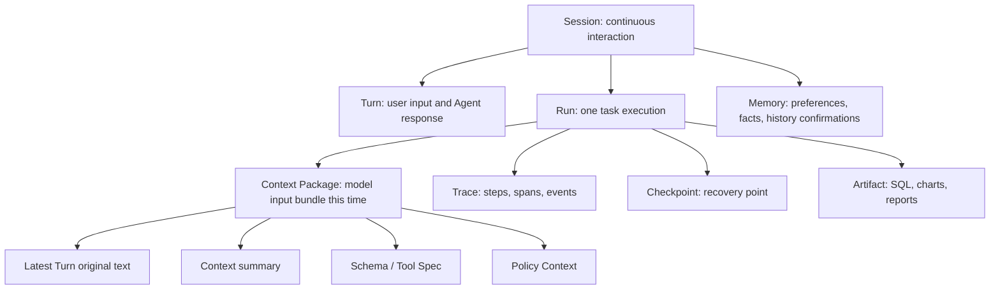

# Chapter 38 Agent Observability and Operational Diagnostics

---

Agent failures often do not appear directly in the final answer. They hide in context packaging, Planner decisions, tool parameters, permission policies, downstream systems, or artifact generation. The platform needs Trace, Span, events, logs, metrics, and artifact references to connect the evidence chain of a single Run. This chapter defines the boundaries of Session, Run, Context Package, Trace, Checkpoint, and Artifact, then explains how runtime traces are collected, how failures are diagnosed, and how online Trace evidence enters the AgentOps improvement loop.

An Agent being able to provide an answer does not mean it is ready for production use. The team also needs to know why it responded that way, what context it saw at the time, which tools it invoked, what SQL criteria were used, which artifact the charts in the report came from, and at which step it failed. Without this evidence, troubleshooting is guesswork.

Take DataAgent as an example. The user first asks, "Why did the operating cash flow decline this month?" The system generates SQL, executes the query, analyzes the reasons, and produces charts. Then the user asks, "Break out the East China region separately." The system must remember the previous round's metrics, time frame, and analysis intent. Finally, the user requests, "Generate a briefing for the CFO." The system must reuse conclusions, charts, and criteria from the previous two rounds. The frontend only shows three dialogue rounds, but the backend involves multiple Runs, multiple Tool Calls, context summaries, Memory, chart artifacts, and report approvals.

The goal of observability is not to store every raw text string, but to save a sufficient evidence chain. When results are wrong, costs spike, approvals reject, or users complain, the platform should be able to answer which step went wrong, why it happened, and how to avoid it next time. In DataAgent especially, a wrong number may come from the semantic layer, NL2SQL, query execution, interpretation, report generation, or context inheritance. Trace turns that chain into inspectable evidence.

---

## 38.1 Session, Run, Trace, and Artifact

Agent runtime generates many types of objects. The most easily confused are Session and Run. A Session represents a continuous interaction with the user, which can include multiple Turns and trigger multiple Runs. A Run is a single specific task execution, such as one cash flow analysis, one SQL query, or one report generation. Trace describes the detailed steps within a Run; Checkpoint enables interrupt and resume; Artifact references outputs like charts, SQL queries, reports, Excel files, etc.

*Table 38-1: Responsibilities and boundaries of runtime objects. Source: compiled by this book.*

| Object | Main Responsibility | Common Misuse |
|---|---|---|
| Session / Turn | Preserve user experience and multi-turn conversation | Use as a substitute for the execution trace |
| Run | Represents one executable task | Pack multiple multi-turn sessions into one Run |
| Context Package | Records what the model actually saw at the time | Only saves full chat history without actual input content |
| Trace | Restores timeline of Steps, Spans, Events | Treated as ordinary log text |
| Checkpoint | Supports recovery after interruptions | Treated as long-term memory |
| Artifact | Stores business outputs and evidence references | Embed large file contents directly into Trace |

These object boundaries should be separated in the storage model. Session serves frontend review and user experience; Run serves execution and state management; Trace serves playback and diagnostics; Checkpoint serves recovery; Artifact serves delivery, download, and audit. Mixing them into one "big log table" may simplify early implementations but will incur costs later on permissions, lifecycle management, and troubleshooting.

The Context Package is especially high-risk. The model sees the context package assembled by the Runtime at that moment, instead of the entire Session. It may include the latest user utterance, recent turns, early summaries, Memory, Schema, Tool Specs, and policy context. When diagnosing multi-turn errors, the Context Package is the primary evidence and the full Session is background material.

These objects also correspond to different lifecycles. Sessions might be retained for a period based on user experience and compliance; Traces may enter observability systems and be retained according to debugging and auditing policies; Checkpoints only remain valid within the task recovery window; Artifacts may be archived long-term or expire quickly due to sensitive data. Without distinct lifecycles, cleanup, export, and permission handling become chaotic.

Multi-tenant platforms must also bind tenants and permissions per object type. An operations staff member may view Trace structure and error types but not raw tool outputs; a business user may see their own report artifacts but not model input summaries; an auditor may view desensitized evidence chains according to process. Observability means the right people see sufficient evidence under the right permissions.

---

## 38.2 What Should a Single Run Record

A diagnosable run should at minimum record identity, context, steps, model calls, tool calls, state transitions, artifacts, and costs. The recording granularity doesn't need to be infinitely fine but must be sufficient to answer questions such as: Where did the task come from? What did the model see? Which tools were chosen? What parameters did the tools receive? What did downstream returns contain? Where did the final artifact originate?

*Figure 38-1: Diagram of Agent run trace collection. Source: drawn by the author. Alt text: During a run, probes are embedded along the execution flow at points such as creation, planning, tool calls, and state transitions. Data are imported into the trace backend, with arrows indicating that observation data are uniformly collected from all execution stages.*

*Table 38-2: Run Collection Points and Minimum Evidence. Source: compiled by the author.*

| Collection Point  | Minimum Evidence                                    | Purpose                          |
|-------------------|----------------------------------------------------|---------------------------------|
| Run start         | `run_id`, `session_id`, task type, trigger turn    | Know where this task originated |
| Context assembly  | source, summary version, whether input to model, token estimate | Determine what the model saw at that moment |
| Model call        | model, prompt version, input/output summary, tokens, latency | Analyze model quality and cost  |
| Tool call         | tool name, parameter summary, permission context, return summary, errors | Locate issues with tools and parameters |
| State event       | state transitions, retries, human waits, failure reasons | Reconstruct runtime behavior    |
| Artifact write    | artifact ID, type, hash, permissions, storage location | Support reporting and auditing  |

A guiding principle for collection is: by default save summaries, hashes, versions, and references, and access original content only with permission. Prompts, tool returns, database results, and file contents may contain sensitive information. Trace should not become a second copy of sensitive data. If original content is needed, it should be fetched on demand via object storage, log systems, or business systems according to permissions.

A failed run should not be recorded simply as `failed`. It must at least log the failed step, error type, responsibility domain, retry possibility, and recommended action. For example, an SQL timeout is a downstream or query cost issue; a Policy denial indicates a permissions boundary; a missing constraint in Context Summary signals a context packaging problem. Such classifications determine the repair direction.

Collection should also control field stability. `run_id`, `trace_id`, `span_id`, `step_id`, `artifact_id`, and `tenant_id` are cross-system correlation keys and should not be frequently renamed. Logs, metrics, Traces, and Report EvidenceRefs all rely on these keys for navigation. Consistent field naming is more important than overly detailed one-off records.

OpenTelemetry can serve as a general skeleton for tracing. The agent platform can map model calls, tool calls, retrievals, SQL executions, and report generation as Spans, while state changes, retries, approvals, and errors map to Events. For model inputs/outputs, tool results, and artifacts, it's recommended to only save summaries, hashes, and references, avoiding turning the OpenTelemetry backend into a large object store.

Collection points should cover unsuccessful and degraded paths as well. Retries, refusals, human takeovers, Policy denials, context compression, cache hits, demotion to smaller models, and switching to async tasks all affect diagnosis. Many online issues are system choices to downgrade without recording reasons, not ordinary tool failures.
## 38.3 Frontend Timeline and Backend Trace

The timeline presented to users should be simple and stable, for example: "Understanding Requirements," "Querying Data," "Generating Chart," and "Waiting for Approval." The backend trace, however, is more detailed: a single "Querying Data" step may include Schema Linking, SQL Generation, AST Validation, Policy Validation, OLAP Execution, Result Truncation, and Artifact Writing.

The frontend timeline serves the user experience, while the backend trace serves diagnostics. The two cannot substitute for each other. The frontend should not expose every internal event, or users will be overwhelmed by implementation details; the backend must store more than frontend cards so engineers can locate the real failure point during troubleshooting.

A trace is not the raw internal output of the model's reasoning. The platform should store auditable decision summaries, tool calls, input and output summaries, errors, and artifact references, instead of long-term preservation of implicit model reasoning that is unsuitable for display or persistence. This enables review while controlling compliance risks.

The frontend projection must remain consistent. The "Querying Data" card shown to the user should map to a corresponding set of backend steps in the trace; the "Generating Report" card should link to the report artifact and EvidenceRef. The frontend does not need to show internal spans, but every frontend state must have backend support. Otherwise, when users report a "stuck" step, engineers cannot pinpoint the matching trace segment.

The backend trace must also support time analysis. A slowdown in a Run may be caused by model latency, SQL execution, cold start of the Python sandbox, chart rendering, or waiting on manual intervention. The start and end times of spans decompose the time consumption, while metrics dashboards can only tell us the overall slowdown; traces reveal exactly where the bottleneck lies.
## 38.4 How to Replay Multi-Turn Context

Multi-turn conversations are not passed into the next model call verbatim. The runtime retains the latest user request and keeps the full text of the most recent few turns, while compressing earlier history into a Context Summary. Large objects are only referenced by pointers. Memory, Schema, and Policy Context are then injected. When replaying, the Context Package for that particular run must be examined.

A Context Package must at minimum record: the source of each item, whether it entered the model, how it entered, the summary version, reference objects, and estimated token counts. Only then can questions such as "Did the model see the chart parameters from the last turn?" or "Did the summary omit the East China region filter?" or "Did Memory incorrectly inject user preferences?" be answered.

Context compression failures are a common issue for agents. For example, if the summary omits "Only look at East China," subsequent SQL may query the whole company. Or if the chart artifact only retains the image but not the generation parameters, a later command like "redraw that chart" will fail. The trace must preserve `context_summary_id`, source turn, and compression strategy, otherwise these issues are difficult to diagnose. Memory must also be separated from Context Summary. The summary comes from the current session's history; memory may be reused across sessions. Summaries can be regenerated, but memory requires deletion, expiration, and access controls. Mixing the two complicates deletion and auditing.

The replay page is best organized as an evidence chain instead of a reverse chronological log stack. Start by showing the user query and task goal, then display the Context Package, followed by Planner decisions, tool calls, state transitions, artifacts, and the final response. This lets business, engineering, and auditing all view the same chain but with different visible fields.

Replay must also support "the then version." Prompt versions, model versions, ToolSpec versions, semantic layer versions, Policy versions, and report template versions may all change. Historical runs must be interpreted using the versions active at that time, not with the current configuration. Otherwise replay becomes "what the current system thinks happened" instead of "what actually happened then."

If a run needs to be re-executed, it should be marked as a new debug execution. Re-running can help verify fixes but should not overwrite the original trace. The original trace is the factual record; the rerun trace is an experimental record. Both should be kept linked to avoid mixing problem review and fix validation.

---

## 38.5 Diagnosis Path

Diagnosis typically begins with metrics. A drop in success rate, an increase in P95 latency, elevated tool error rates, abnormal costs, or more user downgrades all lead engineers to investigate a batch of abnormal runs. Then the trace is drilled down: start with the failed step, then examine the context package, model calls, tool parameters, policy results, downstream logs, and artifacts.

*Table 38-3: Failure Categories and Directions for Fixing. Source: Compiled by this book.*

| Failure Category       | Typical Signals in Trace                     | Direction for Fixing                          |
|-----------------------|---------------------------------------------|----------------------------------------------|
| Context Errors         | Summary missing constraints, Memory injection errors, missing artifact parameters | Adjust context packaging and summary strategies |
| Intent Understanding Failures | Planner selects wrong task type, multi-turn clarifications still off-target | Add clarifications and intent samples          |
| Schema Linking Failures| Wrong table, field, or metric version       | Modify semantic layer, glossary, and linker  |
| Tool Selection Failures| Wrong tool chosen or missing necessary tools | Improve tool descriptions and planner constraints |
| Parameter Failures     | Schema validation errors, SQL errors, missing API parameters | Add parameter validation and error feedback   |
| Downstream Failures    | Timeout, 5xx errors, circuit breaking, resource shortage | Retry, degrade, or async processing            |
| Permission Failures    | Policy denial, field desensitization, tenant boundary crossing | Change permission prompts or approval paths    |
| Cost Out of Control    | Token explosion, retry loops, broad queries | Increase budget, add caching and step limits   |

When diagnosing, avoid letting a single phrase like "model hallucination" obscure all issues. Many results that look like model nonsense actually stem from missing semantic layer fields, unclear tool descriptions, missing constraints in context summaries, or ambiguous permission feedback. The value of a trace is to break down responsibility boundaries.

Playback is not rerunning the model. LLM output is stochastic, and playback aims to reconstruct the evidence chain at that time: input, Prompt version, tool outputs, state transitions, artifacts, and final answer. If needed, specific tool calls can be replayed, but that counts as debugging instead of pure playback.

Root cause analysis requires clear ownership. Context packaging problems belong to Runtime or Memory policy, semantic layer problems to the data platform, tool parameter issues to Tool and Planner, permission denials to Policy, and model quality issues to Prompt, model routing, or evaluation sets. A trace doesn't just describe errors; it helps teams know who should fix them.

Diagnosis results should be documented. After a post-incident review, failure runs should be marked as samples, recording failure categories, fix actions, and regression status. When the same problem recurs, the team should not start guessing from logs again but be able to search historical similar traces and fix records.

For user-facing faults, diagnostic info should be converted to understandable feedback. An internal error might be `SCHEMA_LINKING_AMBIGUOUS`, but the user sees "Sales volume has multiple definitions; please choose between operational GMV or financial GMV." Observability systems record technical details, product interfaces provide actionable guidance, and both must share error codes.

---

## 38.6 AgentOps Closed Loop

Observability is not valuable enough if it is used only for incident investigation. The Agent platform needs to turn online traces into quality improvement assets. Failed runs, timed-out runs, high-cost runs, user downvotes, manual interventions, and approval rejections should all enter the sample pool, be cleaned, and then feed into the offline evaluation of Chapter 39 and the online evaluation of Chapter 40.

AgentOps can operate along a simple chain: collect run traces, filter high-value samples, cluster by failure category, accumulate benchmarks, fix prompts, tools, semantic layers, or policies, run regression tests, perform staged rollouts, and continue monitoring online metrics. This closed loop transforms traces from mere "logs" into "engineering assets."

For example, if user downvotes increase for a batch of cash flow analysis tasks, metrics first detect quality degradation; traces reveal that multiple failed samples selected the wrong cash flow scope at the schema linking stage; the team adds these samples to offline evaluation, enriches field descriptions and sample SQL; after passing regression, the fix is staged online; then success rate, judge scores, user feedback, and token costs for similar tasks are continuously monitored. The entire process relies on traceable run evidence.

Sample governance should avoid collecting only failures. Successfully completed runs with abnormal costs, runs where users manually made large report edits, and runs that were rejected by HITL but then fixed successfully are also valuable. They expose hidden quality issues: answers may be correct but too slow, reports usable but requiring heavy manual edits, advice directionally right but with insufficient evidence. AgentOps needs these intermediate states in addition to clear successes and failures.

Evaluation samples must also be desensitized and minimized. Online traces cannot be directly used as benchmarks, especially when containing client data, PII, or business-sensitive fields. Sample retention should preserve task structure, error categories, essential input summaries, tool result summaries, and expected behavior; whenever synthetic data can substitute, real details should be removed.

AgentOps ultimately returns to release governance. Any change to the model, prompts, tool descriptions, semantic layers, or policies should be traceable to which samples were fixed, which scenarios regressed, and which metrics remained stable during staged rollouts. Without this chain, teams can only guess if a change is safe.

Before samples enter the evaluation set, they must undergo "evidence minimization." Traces often contain user original texts, business fields, tool parameters, and downstream response summaries, and the platform cannot keep all fields long-term. Samples can be split into three layers: the first layer is publicly reusable task structure and expected behavior, the second layer is internally visible, desensitized tool results, and the third layer is raw evidence accessible only via approval. The evaluation set by default retains only the first two layers, while the third layer can be back-referenced via EvidenceRef. This enables reproducibility without uncontrolled copying of production logs to the evaluation system.

Sampling strategy must also be explicitly documented. Storing all traces is costly and risky; storing only failed samples leaves teams blind to normal paths. A prudent approach is: low-rate sampling of successful runs, increased sampling for high-risk tasks and new version rollouts, keeping all failed, timed-out, manually taken over, and user downvoted samples. Sampling rules themselves should be versioned since differences in pre/post release sampling ratios affect quality trend interpretation.

Finally, AgentOps needs a fixed retrospective entry point. Whenever a quality issue is closed, the retrospective record should at minimum include related traces, failure categories, fix PRs, regression samples, release versions, and observation windows. Without these fields, fixes tend to remain superficial "prompt tweaks." The platform should convert a temporary firefight into a traceable quality asset so that next time a similar issue arises, engineers can build on historical samples and fix records instead of re-digging logs.

---

## 38.7 Using Trace for Incident Localization

Trace is valuable because it connects what the user saw with what the backend actually executed. A DataAgent incident often crosses frontend state, Runtime, Planner, tools, model gateway, data warehouse, and report artifacts. If each layer has its own logs but no shared `run_id`, `trace_id`, and artifact references, the team still cannot locate the problem quickly. Frontend events should enter the same diagnostic chain. User actions such as stop, tool-card expansion, filter modification, negative feedback, report approval, and report rejection all change task state or quality judgment. Backend spans alone cannot show what the user saw; frontend telemetry alone cannot show tool and model calls.

The Conversation API should associate frontend events with backend Runs. At minimum, it should preserve event type, timestamp, user identity, page-state summary, and Trace link. Sampling should follow risk. Ordinary low-risk Q&A may keep summaries and key errors, while high-risk tool calls, approvals, exports, and report publication should keep richer structured evidence. Sampling must not break audit requirements. Even when the full prompt is not retained, the platform still needs enough fields to determine responsibility boundaries: tool version, policy hit, data domain, error code, and artifact reference.

During an incident review, Trace should answer four questions: what the user asked, what context the system saw, which tools and models were called, and which evidence produced the final artifact. If Trace cannot answer these questions, it is only performance monitoring. If it can answer them, it becomes the foundation for AgentOps.

## 38.8 Correlating Frontend Events with Backend Trace

Agent observability cannot stop at backend logs. Users see the frontend timeline: question input, waiting, streaming output, tool cards, approval buttons, error messages, and final artifacts. The backend sees Run, Step, model calls, tool calls, queued jobs, and database access. Without shared identifiers, incident response bounces between "the page is stuck" and "the backend looks normal."

Frontend and backend correlation needs at least `session_id`, `run_id`, `step_id`, `message_id`, and `artifact_id`. Every frontend state transition should carry the corresponding backend event identifier, and every SSE or WebSocket event from the backend should record the frontend-visible state. Then a user screenshot, support ticket, or product event can be traced back to a concrete Run. For streaming output, the platform should distinguish model tokens, tool progress, system notices, and final messages instead of merging all incremental content into one text log.

Correlation also has to respect privacy fields. The frontend may show desensitized text while the backend Trace stores original or encrypted fields. Trace should mark field visibility scope, and diagnostic access should not grant data outside the user's role. Observability should provide enough evidence to the right people at the right time, not expose every recorded value to everyone.

## 38.9 Sampling, Retention, and Incident Review

Full Trace retention is expensive, especially when traces include long context, document snippets, chart artifacts, and tool returns. The platform needs a sampling and retention policy. Ordinary successful requests can keep summaries and key events. High-risk tasks, failed tasks, manually intervened tasks, and user-complaint tasks should retain a complete evidence package. Sampling should consider business risk, model version, tool type, and rollout state instead of simple traffic percentage.

Retention should also be layered. Runtime diagnosis needs short-term complete data. Quality evaluation needs medium-term samples. Compliance audit may need long-term immutable records. These use cases require different field granularity and access controls. Trace that contains sensitive data should support desensitized views and controlled decryption; failed samples promoted into the evaluation set should preserve the relationship between the desensitized version and the original evidence.

During incident review, Trace should help reconstruct causality instead of merely support log search. A review should identify the user's intent, the chosen plan, tools invoked, evidence source, the step where deviation occurred, whether validators caught it, and what the user ultimately saw. The conclusion should feed back into the semantic layer, tool governance, Prompt, evaluation sample set, or product interaction. Otherwise observability remains a postmortem viewer and does not improve the system.

## 38.10 Engineering Boundaries of Run Replay

Run replay is not re-execution. Many tool calls have side effects, external system state may have changed, and model outputs may not be fully reproducible. Production replay should prioritize reconstructing the decision process instead of trying to recreate the outside world. The platform can display original events, model outputs, tool responses, and artifacts to show what happened at the time. Re-executing steps should be limited to safe sandboxes or read-only environments.

Replay views should serve different roles. Developers need Prompt text, model responses, error stacks, and tool parameters. Business reviewers need user questions, evidence, approval records, and final artifacts. Security teams need permissions, desensitization, external calls, and abnormal access. Putting every field into one log page makes the view hard for every role. Trace data can share one storage model, but the views should follow responsibility boundaries.

This chapter is where many earlier chapters meet. Chapter 22 Runtime events, Chapter 23 tool calls, Chapter 33 semantic-layer versions, Chapter 34 SQL, Chapter 35 Python artifacts, and Chapter 36 report EvidenceRefs should all appear in Trace. Readers can treat Trace as the runtime ledger of the Agent platform. Without that ledger, the system may answer questions but will not earn long-term enterprise trust.

## 38.11 Converting Between Trace and Evaluation Samples

Trace should become a source of evaluation samples as well as troubleshooting material. Online failures, human rejections, user follow-ups, tool timeouts, policy blocks, and report revisions can all be extracted from Trace. Extraction should preserve task intent, context, key evidence, failure stage, and expected behavior. The evaluation set then evolves with real usage instead of staying limited to pre-launch handwritten cases.

Evaluation results should also return to the Trace view. When developers inspect a failed Run, they should see whether it has entered the evaluation set, whether the fix version passed, and whether similar failures are still happening. Otherwise evaluation and observability become two disconnected systems: one produces offline scores, the other supports online debugging. The platform needs to connect the evidence.

Sample conversion must handle privacy. Online Trace may contain user data, internal documents, and sensitive tool results, so it cannot be copied directly into benchmarks. The platform should support desensitization, summarization, evidence replacement, and access control. Reproducibility and compliance have to be handled together; this is one reason enterprise Agent evaluation is harder than ordinary model evaluation.

## 38.12 Organizational Use of Observability

If Trace is used only by engineers, much of its value is lost. Business owners need to know whether tasks were completed. Support teams need to locate user feedback. Security teams need to inspect privilege escalation and injection. Data teams need to debug metric definitions. Platform teams need to observe models, tools, and queues. These roles need different fields, granularity, and actions, but they should all derive from the same runtime facts.

The organizational use case determines the Trace product shape. Engineering views can show Prompt, request body, error stack, and latency. Business views should show user goal, key evidence, approval records, and final artifacts. Security views should emphasize permissions, desensitization, external calls, and policy hits. Raw logs alone are hard for non-engineers to use, while business summaries alone do not give engineers enough detail. Observability should become part of operations. Weekly quality reviews, monthly scenario reviews, and major incident reviews should use Trace as the factual source. Only when the organization actually uses this evidence does Trace become platform governance infrastructure instead of an expensive logging system.

## 38.13 Stability Governance for Trace Fields

Trace fields need governance. Run, Step, Tool Call, Artifact, EvidenceRef, and Policy Decision fields cannot be renamed or redefined freely once evaluation, audit, support, and operations systems depend on them. Many platforms initially treat Trace as debug logs and let fields change with code iterations. Later, when they need quality analysis and compliance audit, historical data is no longer comparable.

Field governance starts with a dictionary. Each field should state its source, meaning, visibility scope, retention period, and sensitivity. When a field is added, the change should identify downstream consumers. When a field is deprecated, there should be a migration window and compatibility mapping. Key fields such as `run_id`, `step_id`, `tool_name`, `policy_version`, `semantic_version`, and `artifact_id` are platform contracts, not ordinary log attributes.

Field stability also supports cross-chapter capabilities. Chapter 34 SQL replay, Chapter 35 code audit, Chapter 36 report evidence, and Chapter 51 Guardrails policies all depend on Trace fields to connect evidence. If field semantics drift, dashboards and evaluations drift with them. The engineering quality of observability starts with whether these basic fields remain trustworthy over time.

## 38.14 Incident Severity and Response Process

Agent incidents need severity levels. An ordinary wrong answer, a high-risk tool miscall, a sensitive-data leak, and broad service unavailability should not follow the same process. Severity can be based on user impact, data sensitivity, external side effects, recoverability, compliance obligations, and whether the issue is ongoing. Clear severity levels make it easier to choose the right response under pressure.

Trace is the factual record during incident response. On-call staff should quickly see affected Runs, users, tenants, model versions, tools, policies, data domains, and time range. For high-risk incidents, related Trace should be frozen so cleanup or sampling rules do not delete key evidence. After the incident, conclusions should be written back to the sample library, policy configuration, tool governance, or documentation.

Incident response must cover more than technical repair. The platform may need to notify users, withdraw reports, temporarily disable tools, re-run desensitization, or compensate a business workflow. Trace provides facts; organizational process decides how those facts are handled. This is why Chapter 38 connects engineering observability with the organizational operating model in Chapter 53.

Trace design should support incident localization, evaluation sample construction, cost attribution, and user explanation. Too few fields make later analysis impossible; too many unstructured fields remain hard to use. The key is to connect Run, Step, Tool Call, Artifact, and approval events into a queryable chain. With that chain, diagnosis moves from debate to localization.

---

## 38.15 Trace Sampling, Private Fields, And Incident Review

Trace cannot save every piece of content without limits. Enterprise Agent runs may contain user questions, retrieval results, tool parameters, SQL, data summaries, approval comments, and generated artifacts. Many of these fields are private or commercially sensitive. The platform must satisfy two needs at once: reconstruct key paths during incidents and avoid copying sensitive content into too many systems during normal operation. Sampling policy, field classification, and masking rules are part of Trace design.

Sampling should not be based only on percentage. High-risk tool calls, write operations, approval waits, permission denials, evaluation failures, user downvotes, and security blocks should enter high-fidelity records. Ordinary low-risk Q&A can keep summaries and metrics. Fields should also be classified. `run_id`, tool name, state, error code, and duration can be retained for longer periods. User input, SQL, document fragments, and data results should be masked or shortened according to sensitivity. Highly sensitive fields can keep only fingerprints and references. Trace can then support diagnosis without becoming another leakage surface.

Incident review needs a readable chain. Review material should answer what task the user asked for, which tools the system selected, where failure happened, what evidence was visible before failure, whether a person approved, whether degradation or rollback triggered, and which artifacts need withdrawal or marking. If Trace only shows technical spans, business owners and security teams struggle to participate. If Trace only shows business summaries, SRE cannot locate system faults. Chapter 38 connects both views so operating evidence supports engineering diagnosis and responsibility judgment.

## 38.16 Acceptance samples for Trace quality

Trace itself needs acceptance samples. Many platforms verify whether the Agent answered correctly but do not verify whether the runtime record behind the answer is complete. A DataAgent query should show the user question, Question Frame, semantic-layer version, SQL plan, execution engine, permission trimming, result artifact, report paragraph, and human review. A tool write operation should show intent recognition, parameter validation, approval state, execution result, compensation action, and user feedback. If Trace lacks these fields, incident review cannot recover them later.

Acceptance samples should cover success, failure, and degradation paths. Success paths prove that Trace supports replay. Failure paths prove that error type and recovery action were recorded. Degradation paths prove that the system did not silently change behavior. If a query is blocked because estimated scan size is too high, Trace should record the estimate, threshold, blocking policy, and user-visible message. If a report enters human review because evidence is missing, Trace should record the missing evidence, reviewer, and final disposition. Trace then serves engineering debugging, compliance review, and product improvement.

Trace quality should become part of release gates. New tools, model routes, frontend components, and report templates can all change runtime records. Each release should replay a small set of Trace acceptance samples to confirm that key fields remain present, private fields are not exposed, and frontend and backend events still align. Observability is not a post-launch add-on. It is the basis for operating and assigning responsibility for enterprise Agents.

## 38.17 Trace access control and review authorization

The more complete Trace becomes, the more access control matters. One Run may contain user text, retrieved snippets, SQL, tool parameters, approval comments, chart data, and report drafts. Engineers need enough context to debug. Business owners need task outcome and responsibility chain. Security teams need policy hits and sensitive access. Compliance teams need audit evidence. These roles should not all receive the same raw log view.

The platform should classify Trace fields by sensitivity and purpose. Basic runtime fields such as `run_id`, status, duration, tool name, and error code can be visible to broader operating roles. User input, SQL, data summaries, and tool returns should follow tenant, data-domain, and approval controls. Raw detail, unmasked documents, and high-risk approval comments should require temporary authorization. Debugging should not become a reason to widen data access.

Review authorization should itself be auditable. The platform should record who opened a Trace, which fields were viewed, whether an artifact was exported, and whether raw tool output was accessed. During a high-risk incident, Trace may become evidence material. Access to that evidence also needs records. Otherwise the observability system becomes another sensitive data entry point.

A first version can provide two views: operating summary and controlled detail. The operating summary shows task phase, error type, evidence references, and user-visible result. Controlled detail shows Prompt, SQL, tool parameters, raw returns, and debugging information. Moving from summary to detail should require a reason and leave an access record. This does not slow down serious debugging; it makes security, compliance, and business teams more willing to treat Trace as a shared factual source.

## 38.18 Compatibility acceptance for Trace field changes

Once Trace is used by evaluation, audit, cost governance, support, and security review, field changes cannot be handled like ordinary log adjustments. Adding a field, renaming a field, changing enum values, compressing raw content, or adjusting masking rules can affect downstream systems and historical interpretation. If `tool_status` changes from "tool returned successfully" to "business action succeeded," incident statistics and compensation logic both change. Without compatibility acceptance, Trace drifts with code versions and eventually loses comparability across time.

Before changing a field, the platform should list its consumers. Eval may use failure stage. FinOps may use token and tenant fields. Security teams may use policy hits. Support teams may use user-visible status. Compliance teams may use EvidenceRef and approval records. Each consumer needs to know whether meaning changes, how historical data maps forward, how long old and new fields coexist, and when dashboards or queries switch. Trace fields are platform contracts, not private engineering logs.

Compatibility acceptance should include historical Runs. After a new field is released, the platform should sample old Runs, new Runs, failed Runs, degraded Runs, and high-risk Runs, then confirm that they still make sense in one view. If a new field exists only for new Runs, the view should state that clearly instead of treating historical records as if the event did not happen. If masking rules change, the controlled-detail view should confirm that authorization still works. Trace can then evolve without weakening audit trust.

A first version can define a simple field-change process. The field dictionary records meaning, source, sensitivity, retention period, and consumers. A field change requires migration notes and acceptance samples. Deprecated fields keep a compatibility window. Major changes enter release records. This may look like data governance, but it is the engineering base of Agent observability. Without stable fields, evaluation, incident review, and operating governance all turn into ad hoc queries.

## 38.19 Operating review for Trace data quality

Trace itself needs quality review. After observability goes live, teams often assume Trace is trustworthy, but real systems show many issues: missing fields, inconsistent timestamps, frontend events that do not match backend Runs, unclassified error codes, incomplete masking of private fields, and sampling rules that drop key failure samples. If Trace data quality is weak, incident review and evaluation samples become misleading.

Operating review should check whether Trace can answer real questions. Can a user complaint be located to a specific Run. Can a tool failure show parameters, return value, and retry. Can an approval timeout show notification and receipt. Can a DataAgent report dispute show SQL, EvidenceRef, and publication state. Can a cost anomaly show model route and token usage. If Trace only displays a technical call tree and cannot explain the business task, field design has not yet served platform governance.

Trace quality also needs sampling. Each week, the platform can sample successful tasks, failed tasks, human-takeover tasks, degraded tasks, and high-cost tasks, then inspect field completeness, timeline order, privacy masking, evidence references, and replay usability. Results should feed Runtime, Gateway, Tool Registry, DataAgent, and frontend teams. Missing fields are rarely only an observability-team problem. They usually mean one production path did not write responsibility and evidence into the run record.

A first version can create a Trace quality score. It can start with five checks: whether the Trace links to a user task, whether it reconstructs state changes, whether it locates failure reason, whether it reviews evidence, and whether it meets privacy requirements. Low-score samples enter a repair queue. Trace then becomes a data asset for continuously calibrating platform facts and remains useful during incident queries.

## 38.20 Trace data quality and field governance

Trace itself needs data quality governance. After observability goes live, many platforms find missing fields, inconsistent meanings, different SDK names, unmasked sensitive content, or unreliable timestamps. If Trace data quality is unstable, incident review and evaluation samples become distorted. An observability system should manage field definitions along with collection.

Field governance can start with a minimal required set. Each Run should at least include `run_id`, `tenant_id`, user role, model version, prompt version, tool version, semantic-layer version, permission-policy version, input evidence, output artifact, and error state. High-risk actions also need approval, policy hits, and export state. Missing fields should be caught in release gates instead of being discovered during an incident review.

A first version can maintain a Trace field dictionary and sampling validation. The dictionary states source, type, masking rule, retention time, and downstream usage. Sampling validation periodically checks real Runs against the requirement. Trace then becomes shared data infrastructure for evaluation, compliance, security, and cost governance, with debugging as one major use case.

## 38.21 Product consumption of Trace evidence

After Trace reaches production, a successful demo is not enough evidence. The platform needs stable fields for frontend event, backend Step, tool receipt, evaluation sample, private field, and review conclusion, and those fields should connect to release records, Trace, evaluation samples, and incident notes. When a production issue appears, teams can follow one set of facts to understand scope, ownership, and repair order instead of stitching together model logs, business logs, and verbal explanations.

This evidence also connects the surrounding chapters. It links to Chapter 39 on Eval, Chapter 50 on security, and Chapter 52 on compliance: upstream capabilities provide assumptions, downstream capabilities consume the result, and governance capabilities preserve evidence and review decisions. If these materials do not share identifiers and versions, the production system splits apart. Business owners see user complaints, platform owners see system errors, and security or compliance teams see explanations written after the fact. That separation makes it hard to decide whether the issue came from data, model behavior, tool contracts, workflow state, or organizational ownership.

Common production risks include Trace being useful only to engineers, business owners not seeing user impact, and security teams lacking exception records. These risks are less visible during demos because demos usually exercise the successful path. Production users bring boundary cases, repeated requests, permission changes, and long-running state. The platform team should turn such failures into release samples. Some samples should block launch, some can be handled by degradation, and some require the business owner to accept the remaining risk with a review date.

Trace should provide role-oriented evidence views so debugging, evaluation, compliance, and operations work from the same facts. The record can stay compact, but it should include time, version, owner, sample, action, and the next review condition. Without those fields, review remains informal experience. With them, one production issue can become material for later releases, evaluation suites, and training.

A first platform version can start with a small set of high-risk paths. Choose flows with high traffic, high business impact, or sensitive data, require an evidence package for each change, and then expand the practice to ordinary scenarios. This keeps the capability at the engineering level: runnable, explainable, and recoverable.
## Chapter Recap

1. Agent observability records the evidence chain of a single task, not the log of individual API requests.
2. The boundaries between Session, Run, Context Package, Trace, Checkpoint, and Artifact must be clearly separated.
3. Trace should be able to answer what the model saw at that time, which tools were invoked, and where the artifacts originated.
4. Failure diagnosis must attribute issues to specific links such as context, planning, tools, data, permissions, downstream processes, or cost.
5. The core of AgentOps is turning online failures into engineering assets that are measurable, fixable, and regression-testable.

## References

OpenTelemetry. (n.d.). *Documentation*. [https://opentelemetry.io/docs/](https://opentelemetry.io/docs/)

OpenTelemetry. (n.d.). *Semantic conventions for generative AI systems*. [https://opentelemetry.io/docs/specs/semconv/gen-ai/](https://opentelemetry.io/docs/specs/semconv/gen-ai/)

Langfuse. (n.d.). *Documentation*. [https://langfuse.com/docs](https://langfuse.com/docs)

Arize Phoenix. (n.d.). *Documentation*. [https://docs.arize.com/phoenix](https://docs.arize.com/phoenix)
