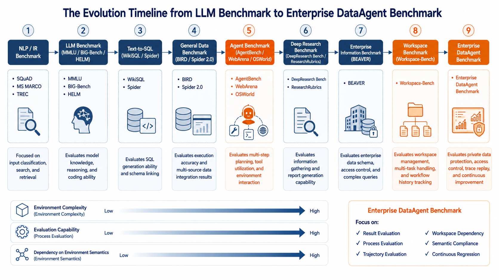
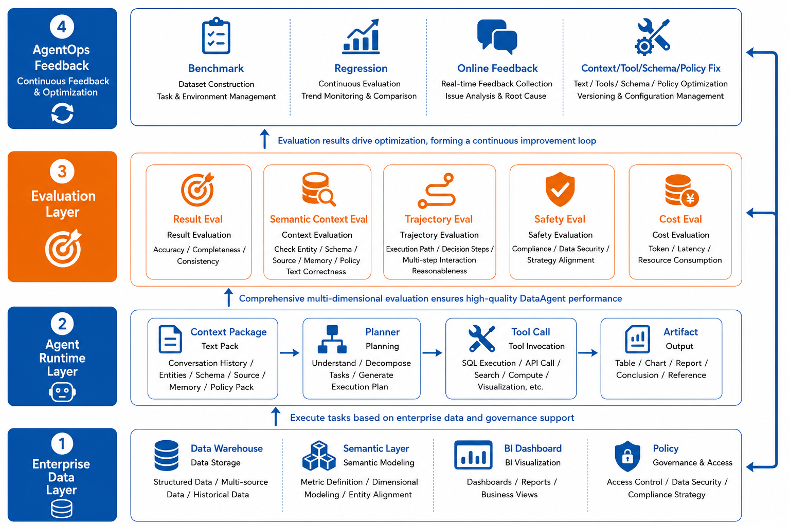
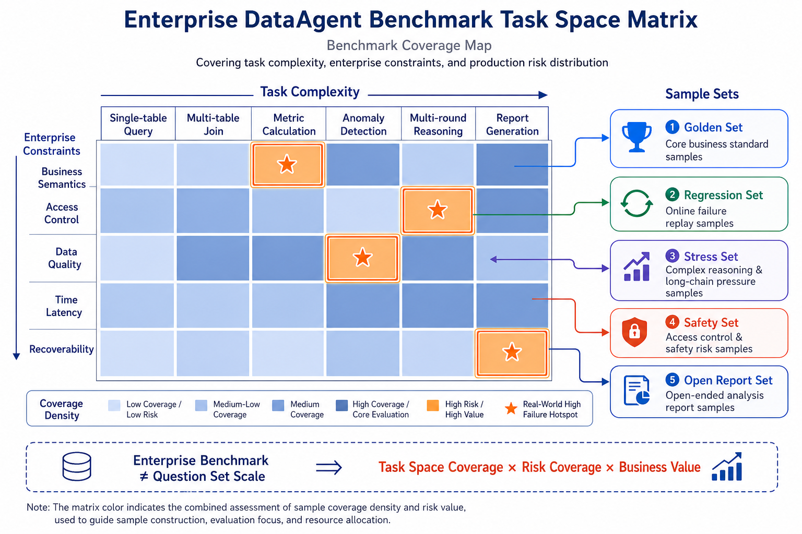
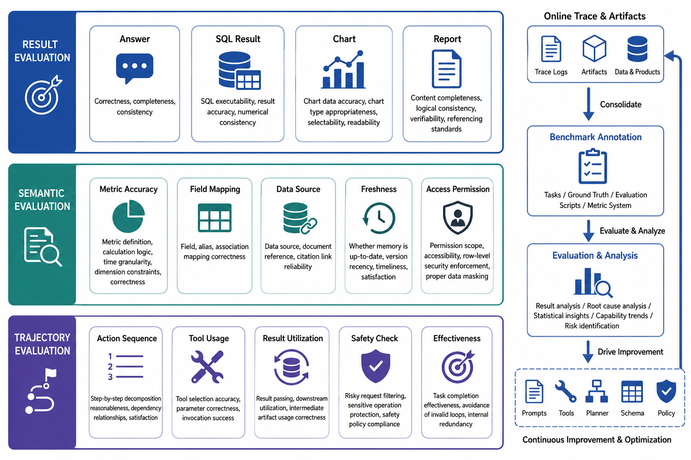

# Chapter 39 Enterprise-Level DataAgent Evaluation System Design and Benchmark Construction

---

This chapter discusses the enterprise-level DataAgent evaluation system, explaining how task sets, golden answers, SQL correctness, business usability, and benchmark operations establish long-term quality baselines. Measuring only the "final answer correctness" misses many issues: SQL might accidentally match the scope, explanations may be incorrect, the process may take a roundabout path, yet the final number happens to be correct. This chapter explains why DataAgent requires layered evaluation of both process and outcome, how to construct benchmarks by designing a task space rather than merely accumulating question banks, and how to continuously operate evaluation sets alongside evolving business needs.

An agent being able to answer does not mean it is ready for deployment. Teams also need to know whether evaluation targets are well-defined, if execution traces beyond the final answers can be reproduced, whether capability boundaries justify release, rate limiting, downgrade, or optimization decisions.

## 39.1 What Is a Benchmark, and How It Evolved into Enterprise DataAgent

The literal meaning of benchmark is "baseline test," but for AI systems, it is more than just a question bank. A qualified benchmark includes at least four components: clear task definitions, reproducible datasets, standardized evaluation procedures, and interpretable metrics. It must answer "what is being measured, what data is used, how is it measured, and how to interpret scores." A mere collection of questions and answers absent task boundaries, data versions, evaluation scripts, and metric definitions resembles practice exercises rather than a production-grade benchmark suitable for regression and deployment decisions.

In traditional machine learning and early NLP (Natural Language Processing) phases, benchmarks mainly measured discrete capabilities. For example, classification tasks used accuracy; machine translation used BLEU (Bilingual Evaluation Understudy) measuring word overlap between translations; reading comprehension used EM (Exact Match) and F1 (measuring both precision and recall in answer words); retrieval tasks used Recall, MRR (Mean Reciprocal Rank), and NDCG (Normalized Discounted Cumulative Gain). These benchmarks shared fixed input-output pairs and reproducible evaluation, serving well for comparing foundational model capabilities but failing to answer "can the model complete a real business task".

With LLM emergence, benchmarks began covering broader general capabilities. Representative evaluations like MMLU (Hendrycks et al. 2021), BIG-Bench (Srivastava et al. 2023), HELM (Liang et al. 2023), C-Eval (Huang et al. 2023), and CMMLU (Li et al. 2023) brought knowledge, reasoning, math, coding, commonsense, and safety evaluation into unified frameworks. This phase solved a key problem: models should not appear strong on just one task but be compared horizontally across many competencies. Yet these still mainly assess the "model itself," not an Agent system embedded with tools, data, permissions, and execution traces.

Soon, evaluation extended into Agent benchmarks. SWE-bench (Jimenez et al. 2024) exemplifies this: it uses real GitHub issues requiring codebase understanding, bug localization, file modifications, and test passing, making it closer to developers' Agent workflows than just solving algorithm problems. Its impact spanned beyond coding by shifting evaluation from mere "answer correctness" to "can the system perform multi-step tasks in an executable environment." Similar efforts include AgentBench (Liu et al. 2024) assessing multi-tool usage, WebArena (Zhou et al. 2024) for browser and web tasks, and OSWorld (Xie et al. 2024) for desktop OS tasks. Together, these benchmarks push evaluation from static model skills toward environment interaction, tool invocation, state management, and verifiable outputs.

When LLMs were applied to data analysis, evaluation evolved into Text-to-SQL benchmarks. WikiSQL (Zhong et al. 2017) and Spider (Yu et al. 2018) connected natural language questions, database schemas, and SQL generation. Spider's key contribution lies in cross-database generalization: models must understand new schemas, more than memorize one. Later BIRD (Li et al. 2023) and Spider 2.0 (Lei et al. 2024) pushed towards more realistic data analysis with larger databases, complex schemas, and production-like query challenges.

However, enterprise DataAgents are more than just Text-to-SQL models. They face private data warehouses, semantic layers, BI assets, permission policies, historical conversations, tool calls, and deliverables. When a user asks "why did operating cash flow decrease this month," the evaluation must consider SQL correctness and if metric definitions were understood, if data sources were correctly selected, if tools executed successfully, if analytic conclusions are auditable, if charts and reports comply, and if the entire process can be traced and replayed.

This explains the emergence of Deep Research benchmarks. DeepResearch Bench (Du et al. 2025) and ResearchRubrics (Sharma et al. 2025) emphasize multi-turn retrieval, evidence synthesis, report quality, and citation reliability, filling gaps in open research task evaluation. Together, these efforts show that complex Agent quality is hidden in final text and in research paths, evidence usage, context integration, and tool calls.

Two benchmark families deserve special enterprise attention recently: BEAVER (Chen et al. 2024) and Workspace-Bench (Tang et al. 2026). BEAVER re-centers Text-to-SQL onto enterprise environments focusing on private data warehouses, real query logs, complex schemas, domain knowledge, and diagnostic subtasks. Workspace-Bench 1.0 focuses on Agent file dependencies, cross-file retrieval, contextual reasoning, and multi-step execution in real workspaces-not a DataAgent benchmark strictly, but a reminder that enterprise Agents often face historic versions, implicit dependencies, and execution traces in their workspace.

Thus, the "enterprise DataAgent benchmark" discussed here is not a public leaderboard score contest but a production-grade quality system. It absorbs LLM benchmark standardization, inherits Text-to-SQL execution evaluation, borrows Agent tool/environment interaction evaluation, and combines trace replay from Chapter 38 into a unified framework covering results, semantics, trajectories, safety, and continuous regression.



*Figure 39-1: Timeline of evolution from LLM Benchmark to Enterprise DataAgent Benchmark. Source: Author. Alt text: Timeline from early general NLP benchmarks, Text-to-SQL (Spider), multi-step workflows (Spider 2.0) to internal enterprise task sets, showing evaluation scope expanding from single-sentence SQL to full-chain task.*

The takeaway is straightforward: enterprise DataAgent benchmarks should adopt public benchmarking methods but ultimately return to their production problems. They should serve as capability maps rather than thermometers showing only overall scores. Such maps must guide teams on which tasks the system is reliable, under what constraints it fails, and which paths yield correct but unauditable answers.

## 39.2 Why DataAgent Cannot Evaluate Only Final Answers

DataAgent outputs may appear as a sentence, SQL, chart, or report, but true capability extends beyond the final step. A typical enterprise data analysis task involves: understanding business questions, identifying metric definitions, locating tables/fields, generating queries, executing and debugging, analyzing results, selecting charts, organizing explanations, handling permissions and uncertainties. A correct final answer indicates the entire chain succeeded for that sample; an incorrect answer does not necessarily mean the model is bad-it could result from missing context constraints, semantic layer lacking fields, tool timeouts, or opaque permission denials.

Enterprise evaluation must focus simultaneously on "results," "semantic context," and "execution trajectory." Result evaluation answers if the final deliverable is correct; semantic context evaluation verifies if the model received correct metric definitions, schema, source, memory, and policy; trajectory evaluation verifies whether the system obtained results via acceptable, auditable, reproducible action chains. All three are essential: focusing only on results risks ignoring lucky correct answers, data scope violations, or overreliance on stale memory; focusing only on trajectory risks mistaking reasonable multi-solution tasks as failures. Mature DataAgent evaluation accepts "one question, multiple answers," allowing different Agents to apply search integration, code verification, SQL execution, chart cross-checking, etc., as long as final answers hold and key evidence, permissions, and reasoning paths can be audited.

When scoring task executions, deterministic methods (script execution, etc.) should handle straightforward measurable dimensions first, then move on to model judging or expert review. SQL execution success, numerical consistency, file diffs matching expectations, API statuses should be evaluated by deterministic programs; report depth, explanation completeness, citation reliability can be evaluated by LLM-as-a-Judge; high-risk, controversial, or gating samples require manual or expert scrutiny.

A simplified formula encapsulating enterprise DataAgent comprehensive evaluation thinking is:

$
Score_{\text{agent}} = Score_{\text{quality}} - w_{\text{cost}} \cdot CostPenalty
$

where quality score comprises results, semantic context, trajectory, and safety components:

$
Score_{\text{quality}} =
w_{\text{result}} \cdot Score_{\text{result}}
+ w_{\text{semantic}} \cdot Score_{\text{semantic}}
+ w_{\text{trajectory}} \cdot Score_{\text{trajectory}}
+ w_{\text{safety}} \cdot Score_{\text{safety}}
$

Weights are task-dependent, not fixed constants. Financial report generation, for example, emphasizes safety, scope, and auditability; exploratory analytics may tolerate imperfect formatting; permission-sensitive tasks set "safety score" as gating, with any overreach causing automatic failure.



*Figure 39-2: Layered evaluation targets for DataAgent. Source: Author. Alt text: Layers from top to bottom-final answers, explanations and scopes, SQL/code correctness, execution trajectory; annotations show respective evaluation methods emphasizing multi-layer coverage over answer-only.*

## 39.3 DataAgent Capability Boundaries and Metric Design

Before designing benchmarks, one must define capability boundaries. Without this, question banks easily degrade into "SQL exams": the model only needs to translate natural language to SQL, ignoring the hardest parts of enterprise analytics.

The capability boundary of enterprise DataAgent lies not in "model intelligence" per se but in whether the system can provide required context, tools, and feedback channels to the model. The large model is just the decision core; it inherently does not know enterprise metric definitions, data versions, API parameters, permission boundaries, or historical session states. The Agent Runtime must organize these into a clear Context Package before model planning; the model must also communicate its next intentions, needed evidence, tool choices, uncertainties, and validation results back to the Agent. Evaluation focuses on whether this closed loop is established.

When a user asks "why did cash flow decrease this month," the system cannot simply pass this sentence to the model. It must provide usable metric dictionaries, semantic layer versions, relevant tables/fields, time scopes, permission policies, conversation summaries, data freshness, and possible comparative baselines. If "cash flow" has multiple definitions, the correct behavior is not guessing one but first querying definitions or clarifying with the user. The evaluation is on whether the Agent sufficiently prepared necessary context, not whether the model guessed the answer correctly.

Tools and APIs are not available simply by plugging them into the system. The model must know which tools exist, their appropriate scenarios, parameter schemas, permission requirements, return structures, and common error handling. Computation tasks especially cannot rely on the model to mentally calculate or reason textually. For example, cash flow attribution should invoke SQL, Python, OLAP, or metric services; dynamic data like exchange rates, inventory, payment statuses should use dedicated APIs; charts and reports should be generated and referenced by output tools. The large model may select tools, explain results, and organize reports, but core calculations must be carried out by auditable executors.

After context and tools are ready, it must be verified that the Agent executes along auditable action chains. This "chain" does not mean exposing internal implicit model thoughts but requires explicit observable steps in tracing: task goal confirmation, metric scope confirmation, selecting authoritative data sources, generating or invoking calculation plans, tool execution, return value validation, then explanation and artifact generation. Conversely, if the system repeatedly reuses previous SQL, defaults to stale reports, or outputs conclusions without resolving missing scopes, even if correct this time, it shows path dependency and lacks reliable enterprise analytic capability.

Feedback loops are equally high-risk. The model's output to the Agent should include structured next actions, tool parameters, needed evidence, error explanations, and clarification requests-also final answers. After tool executions, the Agent feeds back tool results, error codes, empty results, permission denials, and artifact references for the model to continue reasoning based on these observations rather than blindly following old assumptions. Evaluation examines whether this loop is closed: does the model propose reasonable actions, does the Agent actually execute, are results fed back to the model, and does the model adjust accordingly?

Capability boundaries must be translated into fixable signals. Benchmarks should mark "this case failed" and indicate how to fix it. For example, a failure tag `metric_definition_missing` suggests improving metric dictionary, Context Builder, or querying scope first; `tool_affordance_missing` suggests augmenting tool descriptions, parameter examples, and return contracts; `llm_ignored_observation` suggests improving Planner prompts, adding state machine constraints, or converting failure cases into training data. Evaluation results only have engineering value if they feed back into Agent design, tool registration, semantic layer construction, and LLM training.

With this closed loop, scoring designs gain clarity. Result dimensions use execution outcomes, numerical tolerance, and assertion hits; semantic context checks metric scopes, schema, sources, memory, and policies; trajectory uses semi-structured traces, action sequence checks, and source graphs. Metrics become actionable-implementable as evaluation scripts, Judge prompts, trace adapters, and failure labels-more than abstract terms.

## 39.4 Benchmarks Are Task Space Designs, more than Question Banks

The value of enterprise benchmarks lies not in sheer question counts but in coverage of real task distributions and key risks. A high-quality 500-sample enterprise benchmark with replayability, traceability, and version freezing is often more valuable than 50,000 automatically generated but unconstrained questions. This is because release risks are unevenly distributed. Low-risk single-table queries abound but do not represent failure modes involving multi-source conflicts, metric revisions, user corrections, permission consolidation, or stale memories-that truly risk DataAgent going off the rails.

Task space design begins by defining coordinate axes before filling samples. Horizontally spanning task intents: querying, comparison, attribution, prediction, explanation, reporting. Vertically spanning execution complexity: single table, multi-table join, multi-fact table, cross-domain data, historical snapshots, long context. A third axis is enterprise constraints: clear business semantics, sensitive permissions, conflicting data sources, artifacts requiring audits, users likely to ask follow-ups or corrections. Only intersecting these dimensions can a benchmark become a capability map illustrating system boundaries.

From a product perspective, task space is more than difficulty grading-it clarifies requirements. PMs care about which user tasks can achieve stable launch, which only gray releases, and which require manual review. Developers want errors localized to tool, semantic layer, model, or permission. AI researchers want to know which capability categories models lack. A good benchmark serves all three by splitting samples into core stable business sets, online failure regression sets, stress test sets, safety sets, and open report review sets. Overlaps are allowed but update frequencies vary.

Coverage can be controlled by formulas rather than raw counts, e.g.:

$
Coverage =
\frac{\sum_{d \in D} I(count(d) \ge min(d)) \cdot weight(d)}
{\sum_{d \in D} weight(d)}
$

where `D` represents task space dimensions or buckets, e.g., financial attribution, sales comparison, multi-turn questioning, safe refusals, report generation. The indicator `min(d)` is the minimum required samples in that bucket. This prevents benchmarks from inflating counts with many trivial queries.

Further, Agent tasks must accept path diversity. For the same cash flow decline question, one Agent may first retrieve metric dictionaries then write SQL; another may check finance dashboards then verify details. As long as both use compliant data sources, explain metric scopes, produce verifiable results, and have evidence-supported conclusions, they should not be faulted for different paths. Evaluation aims not to force a unique scripted path but to judge if paths are reasonable, necessary evidence is covered, and risky actions are blocked.

Therefore, in enterprise benchmarks, "reference paths" are better expressed as constraints rather than full scripts. For example, "permissions must be checked before output," "latest metric definitions must be queried," "missing slots must trigger clarification," "artifacts not in context must not be cited." Such constraints preserve multiple correct answer spaces while blocking unacceptable shortcuts. For tasks requiring strict procedures, e.g., fund payment approvals or regulatory reporting, path constraints can tighten; exploratory analysis and drafting reports benefit more from source graphs, evidence coverage, and semantic assertions.



*Figure 39-3: Enterprise DataAgent benchmark task space matrix. Source: Author. Alt text: Matrix using "Task Type (Query/Attribution/Prediction)" and "Difficulty (Single Table/Multi-table/Multi-step)" axes, each cell holding representative tasks, showing benchmark balanced coverage by task space rather than random stacking.*

A practical design starts from real business assets by extracting intents and constraints, then assigning samples to buckets. For instance, "Explain this month's operating cash flow decline and break down major contributors by region" is not mere natural language QA. The sample should record metric definitions, time ranges, comparison baselines, available data sources, queryable fields, fields not to expose, expected deliverables, acceptable explanations, must-cite evidence, and allowable tools. Only structurally saving this information enables automated run, scoring, failure attribution, and version replay.

## 39.5 Result, Semantic, and Trajectory Evaluations

DataAgent evaluation divides into three layers. The first is result evaluation answering "Is the final deliverable correct?" For SQL queries, measure execution success, result accuracy, SQL equivalence; for charts, assess chart types, axes, filters, and data consistency; for reports, check if key facts are covered and conclusions supported by evidence.

The second is semantic evaluation (also called context evaluation). It asks "Did the Agent retrieve and provide the model with correct, sufficient, authoritative context?" Did it access the right metric scopes, schema, tables, fields, join paths, include necessary history memory, detect expired definitions, incorporate permission policies and available API info in the Context Package? Semantic evaluation cares about the materials the model saw before deciding, not the beauty of subsequent action order.

The third is trajectory evaluation, answering "Is the Agent's subsequent action chain fit for production?" It inspects observable action sequences and state flows: did it confirm scope before computation, call reasonable tools rather than rely on mental calculation, feed tool observations back to the model, check policies before output in sensitive tasks, avoid repeated retrievals, unbounded retries, or path dependencies. Trajectory evaluation especially reveals cases where correct answers were produced by unacceptable paths.

Scoring should not start from an overly broad total formula but focus on evaluation targets. Result, semantic context, open reports, and trajectory ground truths differ in form, requiring different scoring methods. Simple queries use deterministic programs; open reports add LLM judges; semantic context checks match evidence sources, table fields, scopes, and permissions; trajectory uses raw traces recomposed into semi-structured action chains to assess dependencies and order.

For SQL tasks, execution success and result accuracy should be separately evaluated. Execution success judges if SQL ran without error but does not guarantee accuracy. Result accuracy compares output tables after normalization (column names, types, row order, null handling, float format) for order-invariant queries.

Formalizing strict result matching:

$
TableMatch =
\mathbf{1}\left[
Normalize(R_{pred}) = Normalize(R_{ref})
\right]
$

Numerical values require tolerance beyond exact string matches. Revenue, ratios, growth rates, exchange rate conversions, aggregates require absolute and relative tolerances:

$
NumHit(x, x^*) =
\mathbf{1}\left[
|x - x^*| \leq \max(\epsilon_{abs}, \epsilon_{rel} \cdot |x^*|)
\right]
$

For cases with multiple key values, weighted average of assertions:

$
NumScore =
\frac{\sum_i w_i \cdot NumHit(x_i, x_i^*)}{\sum_i w_i}
$

Open-ended analyses and reports suit assertion plus rubric frameworks. Assertions check essential facts, e.g., "must explain decline mainly caused by delayed accounts receivable," "must break down by region," "must not disclose customer names." Rubrics assess quality of expression and analysis without continuous scores but discrete levels with clear anchors, e.g., each dimension scored 0/1/2/3/4: 0 means missing or wrong, 2 partial, 4 full. A multi-dimensional Judge score:

$
JudgeScore =
\frac{\sum_i w_i \cdot (d_i / 4)}{\sum_i w_i},
\quad d_i \in \{0,1,2,3,4\}
$

Dimensions can include: key fact coverage, reasonable attribution (not number-stacking), alignment with user tasks, conclusions tied to queries or document evidence, citations' credibility and traceability, and expression suitability for target readers. DataAgent sets gating conditions: inconsistent execution results, wrong metric scopes, citing unread evidence, or permission leaks prevent high scores even with good writing.

Semantic evaluation assesses if the context retrieved was correct. Benchmarks annotate a set of required materials: metric definitions, table schema fragments, authoritative docs, history memory, permission policies, or API descriptions. Evaluation measures if Agent-provided context packages cover these necessities and penalizes irrelevant or outdated context. A simple metric for scope coverage:

$
ContextRecall =
\frac{|S_{pred} \cap S_{ref}|}{|S_{ref}|},
\quad
ContextPrecision =
\frac{|S_{pred} \cap S_{ref}|}{|S_{pred}|}
$

where `S_ref` is the ground truth context set required, `S_pred` the actual context provided. For DataAgent, semantic evaluation can further dissect into metric scope hits, correct table and field selection, authoritative evidences, permission completeness, and freshness of historical memory-answering "Did the model get correct materials?" rather than "Did the Agent act properly afterwards?"

Trajectory evaluation verifies actions occur in correct order, more than if final output mentions them. Rule-based checks include "metric definition retrieval must precede metric computation," "permission check must occur before output," "tool return results must be fed back to the model." Outputs ideally include failure tags like "missing metric definition," "insufficient tool description," "model ignored tool return," "permission check skipped." Such feedback also locates errors but guides next steps-improve context, tool description, planner constraints, or add training samples.

Trajectory evaluation also refines raw traces from Chapter 38 into `eval_trace`-standardizing nodes, messages, tool calls, artifacts into unified step types, inputs, outputs, statuses, and source references. On top of this, borrowing from Workspace-Bench (Tang et al. 2026), source graphs can be extracted: nodes are turns, memories, schemas, metric dictionaries, SQL results, BI dashboards, artifacts; edges represent reads, generates, references, or derives. This enables judging if Agents accessed necessary sources, cited only contextualized sources, or reused stale memories due to bad paths.

Finally, various metrics combine. The composite score should not mask risks: safety, permission, and data leaks act as gating items; failed SQL execution zeroes result score; report Judge scores matter only with key fact and evidence assertions passing. A safer dashboard presents metrics side-by-side: SQL execution success, table consistency, key numerical hits, report assertion coverage, Judge multidimensional scores, context recall and precision, trajectory rule pass rates, source graph scores, safety pass rates, and cost-latency indicators.



*Figure 39-4: Result, semantic context, and trajectory evaluations. Source: Author. Alt text: Three evaluation types aligned-result evaluation compares final answers, semantic context checks scope and explanations, trajectory evaluates execution steps; arrows indicate combining all three locates where failures occur.*

Trajectory evaluation is especially important in enterprise Agent benchmarks compared to traditional DataAgent benchmarks. A numerically correct answer produced through permission-violating fields, incorrect scopes, or irreproducible intermediate steps should not be accepted for production. Conversely, open-ended reports differing from references but with core assertions hit, sufficient evidence, and reasonable paths should be accepted.

## 39.6 How to Semi-Standardize Different Agent Trajectories for Evaluation

Different Agent frameworks log trajectories differently: LangGraph may record node states and edge transitions; AutoGen may log multi-agent messages; OpenAI Agents SDK logs tool calls and handoffs; enterprise custom Runtimes log steps, spans, events, artifacts. Though all called "traces," formats, granularity, naming, and hierarchies differ. If the evaluation platform depends on one raw format, benchmarks quickly lock into specific frameworks.

For enterprise internal customized evaluation, focusing only on the company's Agent components allows precise issue localization; but for general trajectory evaluation, a safer approach is "semi-standardization." This means not forcing all Agents to generate identical traces, but mapping diverse raw traces into a minimal comparable structure at the evaluation entry:

```json
{
  "run_id": "run_fin_042",
  "trace_id": "trace_fin_042",
  "steps": [
    {
      "step_id": "s1",
      "type": "context_pack",
      "inputs": ["turn_001", "summary_003", "schema_finance_v12"],
      "outputs": ["ctxpkg_042"]
    },
    {
      "step_id": "s2",
      "type": "tool_call",
      "tool": "sql_executor",
      "inputs": ["ctxpkg_042", "schema_finance_v12"],
      "outputs": ["sql_result_042"],
      "status": "succeeded"
    },
    {
      "step_id": "s3",
      "type": "artifact_write",
      "inputs": ["sql_result_042"],
      "outputs": ["chart_042", "summary_042"]
    }
  ],
  "sources": [
    {"source_id": "schema_finance_v12", "kind": "schema"},
    {"source_id": "sql_result_042", "kind": "tool_result"},
    {"source_id": "chart_042", "kind": "artifact"}
  ]
}
```

This format preserves only common skeleton needed: steps, types, inputs, outputs, statuses, tools, artifacts, and source references. Raw traces remain stored in Chapter 38's observation store, while evaluation platforms consume the normalized `eval_trace`.

With this semi-standardization, source graphs can be extracted from trajectories to answer "which sources supported this answer." Inspiration comes from Workspace-Bench (Tang et al. 2026), which models file dependencies in workspaces where answers draw from multiple files, directories, historic versions, and cross-file clues. In DataAgent, sources are not files but original turns, context summaries, memories, schemas, SQL queries, query results, BI dashboards, metric dictionaries, artifacts, and permission policies.

A run can be abstracted as a directed graph:

$
G_{trace} = (V, E)
$

where `V` are sources and steps, and `E` are "reads, generates, references, derives" relations. For example, `schema_finance_v12 \to sql_generation` means SQL generation read the finance schema; `sql_result_042 \to chart_042` means charts generated from query results; `turn_001 \to ctxpkg_042` means the original user question entered the context package.

If the benchmark has a reference trace graph \( G_{ref} \), a simplified graph coverage metric evaluates source dependencies:

$
SourceGraphScore =
\eta_v \cdot \frac{|V_{pred} \cap V_{ref}|}{|V_{ref}|}
+ \eta_e \cdot \frac{|E_{pred} \cap E_{ref}|}{|E_{ref}|}
- \eta_n \cdot Noise(G_{pred})
$

where \( V_{pred}, E_{pred} \) are predicted nodes and edges from the Agent's actual trace, \( V_{ref}, E_{ref} \) come from annotations or reference executions. \( Noise(G_{pred}) \) penalizes obviously irrelevant sources, e.g. reading unrelated HR tables for a cash flow question, repeated retrievals on irrelevant files, or citing artifacts not in context.

This evaluation offers more diagnostic insight than "final answer correctness." Suppose two Agents both correctly answered the cash flow decline cause, but Agent A's trace cites proper metric dictionaries, finance schema, and SQL results, while B's trace never accessed metric definitions, guessing fields by name only. Result scores might match but source graph scores differ. Conversely, if answers are wrong, source graphs help locate missing key sources versus misusing accessed sources.

Semi-standardized traces also support cross-Agent comparison. Although raw logs differ greatly, mapping them into shared step types such as `context_pack`, `model_call`, `tool_call`, `artifact_write`, `policy_check`, `memory_read`, `memory_write` allows comparing key source coverage, irrelevant source ratio, redundant tool calls, failure recovery paths, permission checks, and artifact traceability.

Note that enterprise operations may not fully annotate reference trace graphs for every sample. A three-tier approach is practical: core Golden Set with complete \( G_{ref} \) annotations; usual Regression Set with key sources and prohibited sources annotated; online failure samples with automatic graph extraction supplemented by expert review during retrospectives. This balances borrowing Workspace-Bench's dependency graph ideas without unsustainable annotation costs.

## 39.7 What Public Benchmarks Can and Cannot Tell Us

Public benchmarks offer horizontal comparison and methodology references, but enterprises cannot rely on public scores for release decisions.

*Table 39-1: What Various Public Benchmarks Assess and Corresponding Enterprise Gaps. Source: Author.*

| Benchmark Type          | Representative Examples                              | What It Evaluates                          | Enterprise Gaps                                  |
|------------------------|-----------------------------------------------------|-------------------------------------------|--------------------------------------------------|
| Classic Text-to-SQL     | WikiSQL (Zhong et al. 2017), Spider (Yu et al. 2018) | Basic SQL generation, cross-schema generalization | Enterprise table structures, implicit metric scopes, permissions, and log sources lacking |
| Large-Scale Data Analysis SQL | BIRD (Li et al. 2023), Spider 2.0 (Lei et al. 2024)  | More complex schemas, execution accuracy, real database connections | Still insufficient coverage of private data warehouses and semantic layers           |
| Enterprise Text-to-SQL  | BEAVER (Chen et al. 2024)                           | Private enterprise warehouses, complex schemas, domain knowledge, subtask diagnosis | Limited multi-turn analyses, artifact generation, and complete Agent trajectory coverage |
| Deep Research           | DeepResearch Bench (Du et al. 2025), ResearchRubrics (Sharma et al. 2025) | Multi-step retrieval, evidence integration, report quality, citation trustworthiness | Focus on open research tasks, distinct from enterprise data analysis                |
| Workspace Tasks        | Workspace-Bench 1.0 (Tang et al. 2026)              | Large-scale file dependencies, cross-file retrieval, context reasoning, multi-step tasks | File-focused, not directly evaluating SQL or semantic layers but useful for trajectory and dependency evaluation |
| General Agent          | AgentBench (Liu et al. 2024), WebArena (Zhou et al. 2024), OSWorld (Xie et al. 2024) | Tool use, environment interaction, long-link execution | Enterprise data, permissions, metric scopes, and artifact auditing incomplete        |

BEAVER (Chen et al. 2024) is especially noteworthy for enterprise DataAgent teams. Compared to public DB benchmarks like Spider, its takeaway is not "substitute internal evaluations with BEAVER scores" but rather highlighting enterprise SQL challenges beyond model SQL generation, including complex schemas, implicit domain knowledge, and subtask composition.

Workspace-Bench 1.0 (Tang et al. 2026) deserves attention as it evaluates Agent ability to handle large file dependencies in real workspaces, involving varied worker profiles, many file types, file dependency graphs, and multi-step tasks. Although its task surface differs from DataAgent's, its methodology is similar: enterprise Agents face inputs with historical versions, implicit dependencies, cross-file evidence, and multi-step execution. For DataAgent, this corresponds to interdependencies among BI dashboards, historical reports, SQL files, metric dictionaries, data lineage, and user dialogues.

The Deep Research benchmark inspires open-form output evaluation. Methods like RACE, FACT, and multi-dimensional rubrics from DeepResearch Bench can adapt to DataAgent report evaluation: assessing if reports are "well-written" and comprehensiveness, depth, prompt compliance, readability, factual richness, and citation trustworthiness. The difference is DataAgent must bind reports to data execution outcomes, metric scopes, and permissions.

The conclusion: public benchmarks calibrate methods; internal benchmarks drive release decisions. Enterprises ultimately evaluate their own tables, metrics, permissions, user tasks, and execution traces.

## 39.8 Enterprise-Grade Continuous Evaluation Platform Construction

Benchmarks are not one-off projects but continuous operation platforms. Every change in model, prompt, tool, semantic layer, permission policies, or data version may affect DataAgent behavior. Continuous evaluation platforms integrate these changes into regressions.

Consider established public leaderboards. Spider's public site maintains data splits, evaluation scripts, submission history, and leaderboards long-term, later shifting attention to more realistic Spider 2.0. BIRD showcases execution accuracy, data scale, domain specialties, and ongoing submissions indicating Text-to-SQL ranking evolution. HELM and MTEB unify multi-task, multi-metric, and model metadata under consistent evaluation protocols. SWE-bench maintains dataset, execution environments, submission portals, verified/lite/full tracks, and traceable rankings, reflecting true engineering tasks. These examples don't equate enterprise DataAgent evaluation but prove that leaderboard longevity relies on stable protocols, reproducibility, clear data versions, and result traceability-not a magical total score.

However, public leaderboards have limitations. Spider and BIRD excel in Text-to-SQL comparisons but don't capture enterprise semantic layer versions, permission policies, BI dashboards, historic traces, or user feedback. Enterprise continuous platforms must borrow their "fixed protocols + unified execution + traceable leaderboards" but swap in their production systems. This means enterprises should maintain private leaderboards capturing every model version, prompt version, tool version, semantic layer version on the same Golden Set, Regression Set, and Safety Set with traceable results.

Enterprise products approach evaluation as a "control tower." They provide an offline score and integrate dataset management, experiment runs, judging, online monitoring, regression gating, risk alerts, and audit logging. Within a DataAgent platform, this means automatically collecting samples from online traces and user feedback, replaying Agents on private data snapshots, version-locking model, prompt, tool, semantic layer, and permission versions, co-displaying result, semantic context, trajectory, safety, and cost scores on dashboards, and gating releases if core metrics degrade or safety tests fail.

Continuous evaluation can go further: saving failure samples and transforming failed trajectories into reusable assets. For example, a failed cash flow analysis records "incorrect answer" and involved Context Package, source graph, erroneous SQL, corrected SQL, expert explanation, and final correct report. Future regressions become both evaluation samples and training data for Planner, tool descriptions, and semantic layers.

A platform should include sample libraries, executors, judges, trace collectors, metric dashboards, regression gates, and sample sedimentation. Sample libraries manage benchmark versions, difficulties, task types, sources, and tags; executors call Agent Runtimes fixed to certain model, prompt, tool, data, and permission versions; judges run rule-based evaluations, execution assessments, LLM-as-Judge, and human reviews; trace collectors save context packages, steps, tool calls, artifacts, and costs per run; dashboards show accuracy, semantic context, safety, costs, and latency; regression gates block obvious regressions during CI/CD, prompt releases, model routing, or semantic layer releases; sample sedimentation converts online failures, user flags, and incident retrospectives into new regression samples.

Version binding is high-risk:

```text
eval_run_id
  benchmark_version
  model_version
  prompt_version
  tool_version
  semantic_layer_version
  policy_version
  data_snapshot_version
  runtime_version
  trace_id
```

Without this, regression results cannot be interpreted. For example, accuracy drops might stem from model, prompt, semantic field descriptions, or data snapshot changes. Continuous platforms must elucidate causes.

A recommended loop: every online DataAgent run writes Trace and user feedback; failure, downvotes, high cost, or manual take-over samples enter candidate pools; evaluation teams cluster by task and failure type; high-value samples get Ground Truth, semantic labels, and trajectory annotations; samples enter Regression or Safety Sets; teams fix Context, tool descriptions, semantic layers, models, or policies; passing regressions allow gray deployment; Chapter 40's online evaluation monitors real user distributions.

Example internal leaderboard: a team maintains configurations `gpt-4.1 + prompt:v12`, `gpt-5-mini + prompt:v3`, and a local model routing solution. Each night, the eval platform runs all three on the same `benchmark:v2026_06` producing a private leaderboard with result accuracy, table field match scores, source graph scores, safety pass rates, P95 latency, average token cost. If a new config's result accuracy improves by 2% but safety fails on overreach samples, release gate fails immediately; if accuracy remains flat but cost drops 40%, proceed to gray release; if cash flow cases regress on the Regression Set, failure traces enter post-mortem queue, more than aggregate score.

Evaluation platforms must also control costs. Not all samples run daily at full scale. Small changes run smoke eval; model or semantic layer releases run regression eval; permission policy changes run safety eval; nightly evals run daily; full release evals run before major launches. The goal is not perfect total scores but explainable, replayable, and fixable quality signals for every system change.

---

## Chapter Recap

DataAgent evaluation has evolved from static result checking to balanced emphasis on results, semantic context, trajectory, safety, and continuous regression. Final answers remain important but only as the first layer of evidence; true production readiness hinges on metric definitions, contextual sources, tool calls, permission checks, state updates, and artifact traceability behind answers. Enterprise systems should prioritize executable checks and rule-based evaluations before applying LLM-as-Judge or expert review for open reports and complex explanations.

Enterprise benchmarks characterize capability boundaries rather than maximize question quantity. Task spaces cover real-world constraints: metric scopes, multi-source conflicts, definition changes, stale memories, user corrections, permissions, and multi-artifact delivery. Good benchmarks accept multiple solution paths, verify reasonable paths, necessary evidence coverage, and block risky shortcuts.

Continuous evaluation platforms turn benchmarks into daily quality infrastructure. They version-lock models, prompts, tools, semantic layers, policies, data snapshots, runtimes, and traces; transform online failures into regression samples; compare releases on private leaderboards. Public leaderboards guide protocol designs, but enterprise release criteria must always return to proprietary data, permissions, user tasks, and execution traces.

- Are capability boundaries and layered evaluation metrics defined for DataAgent?
- Is there a benchmark covering core business scenarios, difficulty gradings, and version control?
- Are result, semantic context, and trajectory evaluations reported separately?
- Are diverse Agent raw traces unified into comparable `eval_trace`?
- Can source graphs be extracted from traces to check key source coverage and irrelevant source noise?
- Are different ground truths designed for SQL, charts, reports, and safe refusals?
- Does each model, prompt, tool, or semantic layer change trigger regression evaluation?
- Are online failure samples sedimented from traces into Regression Sets?
- Can evaluation results pinpoint prompt, model, tool, semantic layer, permission, or data version impacts?

## References

Relevant chapters: [Chapter 33 Semantic Layer Engineering](../../part06-dataagent/en/ch33.md), [Chapter 34 NL2SQL Engineering](../../part06-dataagent/en/ch34-nl2sql.md), [Chapter 38 Agent Observability and Run-time Diagnostics](ch38-trace.md), [Chapter 40 Online Evaluation, LLM-as-Judge, and Continuous Optimization](ch40-llm-as-judge.md).

Listed public benchmarks citation order follows first mentions.

Hendrycks, D. et al. (2021). [*Measuring Massive Multitask Language Understanding*](https://arxiv.org/abs/2009.03300). ICLR.

Srivastava, A. et al. (2023). [*Beyond the Imitation Game: Quantifying and Extrapolating the Capabilities of Language Models*](https://arxiv.org/abs/2206.04615). TMLR.

Liang, P. et al. (2023). [*end-to-end Evaluation of Language Models*](https://arxiv.org/abs/2211.09110). TMLR.

Huang, Y. et al. (2023). [*C-Eval: A Multi-Level Multi-Discipline Chinese Evaluation Suite for Foundation Models*](https://arxiv.org/abs/2305.08322). arXiv.

Li, H. et al. (2023). [*CMMLU: Measuring Massive Multitask Language Understanding in Chinese*](https://arxiv.org/abs/2306.09212). arXiv.

Jimenez, C. E. et al. (2024). [*SWE-bench: Can Language Models Resolve Real-World GitHub Issues?*](https://arxiv.org/abs/2310.06770). ICLR.

Liu, X. et al. (2024). [*AgentBench: Evaluating LLMs as Agents*](https://arxiv.org/abs/2308.03688). ICLR.

Zhou, S. et al. (2024). [*WebArena: A Realistic Web Environment for Building Autonomous Agents*](https://arxiv.org/abs/2307.13854). ICLR.

Xie, T. et al. (2024). [*OSWorld: Benchmarking Multimodal Agents for Open-Ended Tasks in Real Computer Environments*](https://arxiv.org/abs/2404.07972). arXiv.

Zhong, V., Xiong, C., & Socher, R. (2017). [*Seq2SQL: Generating Structured Queries from Natural Language using Reinforcement Learning*](https://arxiv.org/abs/1709.00103). arXiv.

Yu, T. et al. (2018). [*Spider: A Large-Scale Human-Labeled Dataset for Complex and Cross-Domain Semantic Parsing and Text-to-SQL Task*](https://arxiv.org/abs/1809.08887). EMNLP.

Li, J. et al. (2023). [*Can LLM Already Serve as A Database Interface? A BIg Bench for Large-Scale Database Grounded Text-to-SQLs*](https://arxiv.org/abs/2305.03111). NeurIPS Datasets and Benchmarks.

Lei, F. et al. (2024). [*Spider 2.0: Evaluating Language Models on Real-World Enterprise Text-to-SQL Workflows*](https://arxiv.org/abs/2411.07763). arXiv.

Du, M. et al. (2025). [*DeepResearch Bench: A Comprehensive Benchmark for Deep Research Agents*](https://arxiv.org/abs/2506.11763). arXiv.

Sharma, T. et al. (2025). [*ResearchRubrics: A Benchmark of Prompts and Rubrics For Evaluating Deep Research Agents*](https://arxiv.org/abs/2511.07685). arXiv.

Chen, P. B. et al. (2024). [*BEAVER: An Enterprise Benchmark for Text-to-SQL*](https://arxiv.org/abs/2409.02038). arXiv.

Tang, Z. et al. (2026). [*Workspace-Bench 1.0: Benchmarking AI Agents on Workspace Tasks with Large-Scale File Dependencies*](https://arxiv.org/abs/2605.03596). arXiv.

Muennighoff, N. et al. (2023). [*MTEB: Massive Text Embedding Benchmark*](https://arxiv.org/abs/2210.07316). EACL.

Long-term maintained leaderboards include: [Spider](https://yale-lily.github.io/spider) (Yu et al. 2018), [BIRD](https://bird-bench.github.io/) (Li et al. 2023), [BEAVER](https://beaverbench.github.io/) (Chen et al. 2024), [HELM](https://crfm.stanford.edu/helm/) (Liang et al. 2023), [MTEB](https://huggingface.co/spaces/mteb/leaderboard) (Muennighoff et al. 2023), [SWE-bench](https://www.swebench.com/) (Jimenez et al. 2024). Evaluation tools include Ragas, TruLens, DeepEval, Promptfoo, OpenTelemetry, Langfuse, and Phoenix.
