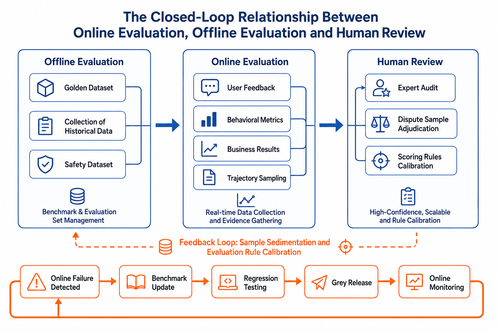
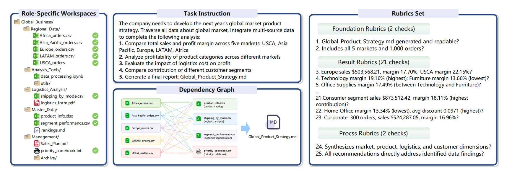

# Chapter 40 Online Evaluation, Model Judges, and Continuous Optimization

---

This chapter discusses online evaluation and model adjudication, explaining how LLM-as-Judge, manual spot checks, online canary testing, and continuous optimization collectively assess the quality of Agent outputs. Offline benchmarks cannot cover the long tail of real traffic, so ongoing evaluation is essential after deployment; however, manual inspection of every instance is infeasible. Therefore, models are used as judges to score outputs at scale. This chapter clarifies the reliable boundaries and bias correction for LLM-as-Judge, how to coordinate sampling with manual spot checks, and how to integrate online evaluation results back into the canary release and continuous optimization feedback loop.

An agent being able to answer does not necessarily mean it is ready for deployment. The team also needs to know whether online evaluation has supporting evidence, whether the model judge is reproducible, and whether continuous optimization can lead to release, traffic limiting, degradation, and improvement decisions.

## 40.1 Online Evaluation: From Real Traffic to Actionable Evidence

Online evaluation is primarily not a scoring tool, but rather a system to explain and interpret real traffic as evidence. Chapter 39 discussed offline benchmarks: fixed samples, fixed data versions, fixed tool versions, and fixed evaluation scripts, used to compare different models, prompts, tool strategies, or semantic layer versions. Online evaluation faces a more dynamic environment: user questions change daily, data status constantly updates, access policies may shift due to organizational adjustments, and model gateways are affected by rate limiting, retries, and cost routing. At this point, simply asking "how well did the model score on a fixed test set?" is not enough; one must also ask if real users actually completed their tasks, whether degradation in online quality was detected promptly, and whether fixes deployed introduced new side effects.

### 40.1.1 The Boundary Between Online Evaluation and Offline Evaluation

Online evaluation is not a substitute for offline evaluation. Offline benchmarks act like regression tests to prevent known issues from recurring; online evaluation is like production monitoring, suited to discovering unknown issues-especially new questions, new business scenarios, new data states, and new user expectations that benchmarks have not covered. Enterprise agent platforms need to connect the two: online issues are distilled into offline samples, and offline fixes, once approved, are validated online through gradual rollouts. Manual review sits between these two, responsible for handling high-risk or contentious samples and tasks that automated evaluation cannot reliably judge.



*Figure 40-1: The closed-loop relationship between online evaluation, offline evaluation, and manual review. Source: Original figure. Alt text: Circular diagram-the offline benchmark sets baselines, online evaluation covers real traffic, manual review calibrates judges; arrows indicate continuous calibration of quality among the three.*

*Figure 40-1 shows the closed-loop relationship between online evaluation, offline evaluation, and manual review.*

This diagram illustrates a quality closed loop rather than three isolated processes. Offline evaluation provides a stable measuring stick, online evaluation provides real distribution, and manual review provides a high-trust ruler. The connecting points are the `trace_id`, `run_id`, context packages, tool invocations, and artifact references discussed in Chapter 38. Without these observations, an online thumbs down only means "someone is unhappy"; with these linkage keys, the team can drill down further: is it a problem of metric definitions or tool failure? Is the answer factually incorrect or the expression unsuitable for executives? Is a new model degraded, or is field interpretation changed due to semantic layer version updates?

Online evaluation is most often misunderstood as "collecting user feedback." Feedback is certainly important, but it is only part of the evidence. A thumbs down may arise from numerical errors, or from excessive latency, overly verbose responses, denied permissions, unfamiliar charts, or even the user asking an unanswerable question in the first place. What online evaluation really needs to assess are four things: whether the task was completed, whether the completion path was acceptable, whether online signals changed abnormally, and whether abnormalities can be turned into actionable engineering fixes. Defined this way, online evaluation is no longer a mere satisfaction button but a production quality reasoning system.

### 40.1.2 How Feedback Signals Become Evidence

Online feedback can be divided into explicit feedback, implicit behaviors, and business outcomes. Explicit feedback is signals proactively given by users, such as likes, dislikes, ratings, text comments, question tags, and manual reports. It is the most direct but has low coverage and strong contextual bias. A financial user writing "the numbers are incorrect" is usually more valuable than just a thumbs down; yet even then, trace playback is needed to confirm whether it is a calculation error, definition mismatch, data freshness issue, or misunderstanding of expectations.

Implicit behaviors have broader coverage. Copying answers, downloading reports, saving SQL, asking follow-up questions, clicking regenerate, abandoning conversations, requesting human takeover, quickly repeating the same question-these actions all reflect whether the system is useful. However, interpreting implicit behaviors is more difficult. A follow-up question may mean the user was inspired by the answer or that the answer was unclear; downloading a report usually signals positive intent but may be just to manually fix it. Therefore, implicit behaviors cannot be used as direct labels but should be interpreted together with task type, dialogue turns, artifact states, latency, and user roles.

Business outcomes are closest to real value. For example, whether a sales analysis report was included in weekly meetings, whether generated SQL is saved as a dashboard, whether customer service responses reduce ticket escalation, or whether procurement analysis triggered approval workflows. Their drawbacks are obvious: delay, noise, and attribution difficulty. A report adopted may be due to the agent's success or just because the business was simple; a report not adopted might be due to outside decision changes and not a quality problem of the agent.

Hence, feedback records must also save a `thumb_down` field. They must link user signals with execution evidence:

```json
{
  "feedback_id": "fb_20260609_001",
  "session_id": "ses_fin_042",
  "run_id": "run_fin_042",
  "trace_id": "trace_fin_042",
  "task_type": "cashflow_root_cause",
  "feedback_type": "thumb_down",
  "user_comment": "The numbers are incorrect, East China region definitions are wrong",
  "artifact_refs": ["chart_cashflow_042"],
  "latency_ms": 84200,
  "model_version": "gpt-5-mini-2026-06",
  "prompt_version": "finance_agent:v12",
  "semantic_layer_version": "finance_semantic:v18",
  "policy_version": "finance_policy:v7"
}
```

The value of this record is not the "thumb down," but that it connects a subjective feedback to model version, prompt version, semantic layer version, permission policies, and artifacts. During later reviews, engineers can drill down from the `trace_id` to context packages and tool calls; product managers can analyze user behavior trends by task type; AI researchers can convert failed samples into model or prompt improvement data.

To prioritize samples, one can define a feedback intensity score, but this score should only act as a "triage priority," not the "true quality measure":

$$
FeedbackSignal =
w_e \cdot Explicit
+ w_b \cdot Behavior
+ w_o \cdot Outcome
- w_r \cdot Risk
$$

Where `Explicit` is explicit feedback, `Behavior` is implicit behavior, `Outcome` is business results, and `Risk` is penalties for safety, privilege violations, timeouts, excessive cost, etc. The formula's purpose is to funnel diverse signals into one sample triage pipeline, not to let a single user action define system quality. Genuine quality judgments must enter rule evaluation, model adjudication, or manual review.

### 40.1.3 How Metrics Dashboards Drill Down into Traces

Online evaluation requires metrics, but more metrics are not necessarily better. An enterprise agent dashboard must at minimum cover four signal categories: quality, efficiency, safety, and business value. Quality metrics answer whether users received usable results, such as task completion rate, first usable answer rate, thumbs down rate, regeneration rate, human takeover rate, and repeat question rate. Data agents can also look at SQL save rate, chart download rate, report adoption rate, and result citation rate. Efficiency metrics answer the cost to complete tasks, such as average interaction turns, P50/P95 latency, average tool calls, average token cost, and retry count. Safety metrics answer if the system did anything it shouldn't, such as privilege query blocks, sensitive field exposures, refusal correctness, desensitization correctness, and audit completeness. Business metrics observe long-term value, like whether reports enter management workflows, dashboards remain in use, or ticket escalations decrease.

These metrics should also distinguish leading and lagging indicators. Leading indicators detect problems earlier, e.g., thumbs down rate, regeneration rate, latency, and tool error rates; lagging indicators reflect business value more closely, e.g., report adoption rate, decision conversion rate, and ticket escalation rate. During rollout and gradual deployment, focus on leading metrics because they react sooner; during long-term operations, focus on lagging metrics because they represent real business gains. The two cannot replace each other. A new version might eventually raise report adoption, but if on release day P95 latency doubles and human takeover rate spikes, waiting for lagging metrics to "slowly improve" is unsafe.

The key capability of metric dashboards is drill-down. For example, "task thumbs down rate for operating cash flow attribution rose from 6% to 13%" alone does not guide fixes. The dashboard needs to answer: which tenants concentrate the issues? Did it occur in only one model version? Did it change with prompt or semantic layer versions? Are failing traces concentrated in schema linking, tool execution, context compression, report generation, or access control blocks? Only by drilling down into these objects does the metric transform from an operational symptom into engineering evidence.

Attribution must also handle confounding factors carefully. During month-end financial close, user tasks grow complex and increased thumbs downs do not necessarily indicate model regression; after a new permission policy rollout, increased refusals may mean increased safety, not worse experience; after a tenant imports new data sources, rising SQL errors may come from schema changes. Online evaluation must slice by task type, user population, tenant, data snapshot, model version, tool version, and policy version, or risk misattributing environment shifts as model capability changes.
## 40.2 Model Judge: Controlled Evaluation of Open-Ended Quality

Model judges address a different category of problems: when the answer is not a fixed numeric value or a directly executable SQL, but rather an explanation, a report, a citation chain, or a trace, how can the system consistently assess quality? This approach complements semantic judgments that are difficult to cover with rule-based scripts but cannot replace deterministic validation, nor should it serve as the sole arbitrator without calibration.

It's important to clarify the boundaries first. Deterministic scripts excel at checking "whether execution is possible," "whether numeric values are consistent," "whether fields are accessed without authorization," or "whether formats conform to schema." But they struggle to judge "whether a report truly captures the core business issue," "whether an attribution is sufficiently evidence-backed," "which of multiple feasible paths aligns better with user goals," "whether charts and text mutually support each other," or "whether action recommendations are actionable by business teams." These judgments are not impossible to script, but hard-coded rules quickly grow complex and struggle to handle open-ended questions with multiple valid answers. The value of a model judge lies in transforming semantic, reasoning, and presentation qualities that scripts cannot reliably express into an auditable, calibratable evaluation workflow.

### 40.2.1 What Model Judges are Suitable to Evaluate

A model judge-also called LLM-as-Judge-uses a large language model as an evaluator to score, compare, and tag candidate answers, reports, explanations, citations, or execution traces. Its value lies in covering semantic evaluations that are difficult to address by rule-based scripts. For example, whether a cash flow attribution report sufficiently explains the cause, whether conclusions are evidence-supported, whether the expression suits the CFO, and whether action recommendations are feasible cannot be reliably verified only by string matching or comparing SQL result tables.

But model judges are not the ultimate truth. Enterprise evaluations should first apply deterministic methods to verify the definitive parts: whether SQL runs successfully, whether result tables are consistent, whether key metrics fall within tolerance, whether permissions are correct, whether sensitive fields are exposed, and whether required artifacts are generated. Only after these base facts are confirmed should a model judge assess open-ended quality. Without this, judges might be fooled by fluent but incorrect explanations and give seemingly reasonable high scores.

There are three common judging patterns. Single-answer scoring is suitable for bulk screening, where the judge scores answers based on the question, context, candidate answer, and rubric. Paired comparison is better for comparing two models or prompt versions since judging A vs. B is usually more reliable than giving separate absolute scores to A and B. Multi-dimensional scoring is best for enterprise DataAgents: it breaks "report quality" down into correctness, evidence grounding, completeness, actionability, expression adaptation, and safety compliance, each with clear anchors and easier-to-diagnose outputs.

A practical example is a report on the "Cause of Operating Cash Flow Decline." Scripts can check SQL execution success, consistency of key metrics with reference results, presence of `region` dimension, and absence of customer detail fields. But scripts cannot reliably judge whether the report truly explains "why the decline happened": it may just list many region changes without clarifying East China's leading contribution, or it might give vague suggestions like "strengthen receivables management" without linking recommendations to receivables aging, customer segmentation, or responsibility departments. Model judges suit assessing this open-ended quality-but only if the input includes evidence summaries, citations, and rubrics, more than a free-form final report.

### 40.2.2 Judge Inputs, Outputs, and Multi-Dimensional Scoring

A DataAgent judge input can be organized like this:

```json
{
  "question": "Why did operating cash flow decline this month?",
  "task_type": "root_cause_analysis",
  "context_summary": "User requested regional analysis of this month's operating cash flow decline.",
  "candidate_answer": "...",
  "evidence": {
    "sql_result_summary": "East China contribution declined 62%, mainly due to delayed accounts receivable collection.",
    "artifact_refs": ["chart_cashflow_042"],
    "source_graph_summary": "Using finance_semantic:v18, cashflow_fact, org_dim"
  },
  "rubric": {
    "correctness": "Conclusions must align with SQL results.",
    "grounding": "Key conclusions must be evidence-supported.",
    "actionability": "Next-step analyses or business actions must be specified.",
    "safety": "No exposure of customer details or unauthorized fields."
  }
}
```

Judge output should be structured rather than only a textual comment:

```json
{
  "overall_score": 0.82,
  "dimension_scores": {
    "correctness": 0.90,
    "grounding": 0.85,
    "actionability": 0.70,
    "safety": 1.00
  },
  "confidence": 0.76,
  "failure_tags": ["missing_next_step"],
  "rationale": "Conclusions align with SQL summary but action recommendation is weak."
}
```

For product managers, the key is not the overall score (0.82) itself, but whether it can translate into product actions. If `correctness` is low, first check data sources, SQL, and tooling; if `grounding` is low, check citations, source graph, and report templates; if `actionability` is low, improve output structure and product interaction; if `safety` fails, it should trigger release blocking or manual review rather than routine optimization.

Multi-dimensional judging scores can be written as:

$$
JudgeScore =
\sum_{d \in D} w_d \cdot score_d
$$

where `D` is the set of scoring dimensions and `w_d` are dimension weights determined by task type. Financial analyses emphasize correctness, evidence, and safety; research reports emphasize coverage, depth, and citations; customer service replies emphasize instruction-following, tone consistency, and safety boundaries. Using a single universal total score risks compressing different quality criteria into a meaningless number.

DACOMP (Lei et al. 2025) offers a rubric scoring engineering reference in the DA (Data Analysis) task. Its goal is not to answer a single-point question but to complete a reproducible, auditable data analysis report usable for business decisions. For example, a corporate credit pricing and portfolio optimization task requires building an entire analytic pipeline from customer risk scores, default probabilities, loss given default, regulatory parameters to individual pricing, quota estimation, portfolio allocation, and churn constraints. Such tasks cannot be judged by a single final answer alone because a correct report must consistently satisfy definitions, reproducibility, traceability, and executability.

Its rubric breaks scoring into two sets of demands with multiple standards and alternative paths. The first focuses on the risk quantification chain: clear field mappings; correct dimensions, weights, and directionalities for metric S; monotonic mapping from S to PD; LGD stratification covering collateral, guarantees, and unknowns; replicable regulatory parameters and RAROC. The second focuses on pricing and portfolio optimization: individual pricing formulas matching risk parameters; boundary testing for quota chain; iterative convergence of portfolio EAD; closed loops for churn intervention and RAROC bottom line. Each substandard includes completeness, precision, and conclusiveness. The judge inspects each item explicitly rather than vaguely stating "report is good."

DACOMP evaluation is not a single judge score. It first uses rubric-based judges for total and three dimension scores, then conducts GSB (Good/Same/Bad) style reference report comparisons on readability, professional depth, and visualization. Final DA Score weights: rubric contribution 60%, readability 10%, depth 10%, visualization 20%. This shows enterprise evaluation can separate "task satisfaction" and "report presentation quality": the former uses fine-grained rubrics to verify business completion; the latter uses reference report comparison to judge expression, depth, and visual presentation. Engineering implementation also needs format validation, retry on invalid outputs, fallback for visual evaluation failures, zero score for missing visuals, and other details for industrializing model judges.

### 40.2.3 Bias, Consistency, and Human Review

Model judges are useful because they extend semantic evaluation; they are risky because they propagate bias into evaluation. Common issues include positional bias, length bias, style bias, self-preference, reference leakage, and domain blind spots. In paired comparisons, judges may favor the first answer; in report reviews, they may mistake longer, more fluent responses as better; if references are strongly written, judges may reward texts "similar to reference" rather than semantically correct answers. Enterprise usage also risks: judges might not understand internal metric definitions or permission boundaries, hence cannot detect seemingly professional but mixed-caliber answers.

Bias control requires engineering mechanisms, not blind trust that judges will be stable naturally. Paired comparisons must randomize answer order and record an `order_seed`; reversals after switching order should lower confidence or trigger review. Rubrics must be versioned; every update creates a new `rubric_version`; old and new scores cannot be mixed. Judge models and prompts must be version-tied; score changes may stem from either evaluated system or judge changes.

Score scales must also be controlled. Open-ended continuous scores (e.g., 0-100) appear fine-grained but amplify subjective noise. Safer is discrete scoring: binary pass/fail or 0/1/2/3/4 levels, each with anchor descriptions (e.g., 0 = missing/error, 2 = partial coverage but insufficient evidence, 4 = complete and traceable evidence). For risk and permission-related dimensions, gatekeeping binary judgments are better: any authorization breach, leakage, or unverifiable citation should not be compensated by other dimension scores.

Several hard constraints are needed in practice. First, judge inputs should hide candidate model identity to avoid bias from known model names. Second, paired comparisons must swap orders; inconsistent A/B vs. B/A results downgrade confidence or trigger manual review. Third, length differences must be explicitly controlled; rubrics should clarify "longer is not necessarily better" and penalize evidence-free padding. Fourth, judges should only base judgments on given evidence, context, and citations, not on world knowledge to fill missing facts. Fifth, high-risk release decisions should not rely on a single judge model but use cross-family reviews recording means, standard deviations, and disagreement samples.

Golden samples are the foundation for calibrating judges. These come from expert annotations covering typical cases: correct, partially correct, factually incorrect, insufficient citation, authorization breach/leakage, verbose expression, missing action recommendations, etc. Every change in judge model, prompt, or rubric requires running golden samples again. If judge scores diverge significantly from expert labels on golden sets, the judge is unfit for large-scale online use.

High-risk samples cannot be fully delegated to automatic judges. Financial, compliance, HR, customer data, and permission-sensitive tasks require sampling for manual review; safety failures, authorization breaches, sensitive leaks, or regulated outputs should directly enter a human review queue. Multiple judges cross-review are valuable: rule engines verify permissions, deterministic scripts check values, model judges score report quality, experts sample high-risk cases for spot checks. This complexity is not needless but prevents a single judge becoming an unexplainable single point of failure.

Judge stability can be monitored by a consistency metric:

$$
JudgeAgreement =
\frac{\text{Number of samples where judge agrees with experts}}
{\text{Total number of reviewed samples}}
$$

If `JudgeAgreement` declines steadily, first suspect the evaluation system: Has task distribution shifted? Have judge prompts changed? Does the rubric no longer cover new tasks? Are expert labels inconsistent? Judging model drift should not drive agent optimization; otherwise, the system optimizes toward a faulty yardstick.

Variance between different LLM judges should be tracked separately. A common practice runs the same golden samples through multiple judges-a strong closed-source model, a locally deployable model, a safety- or factuality-biased model. If total score rankings align but some dimension scores vary widely, that dimension's rubric may lack verifiability. If only one judge prefers a new version while experts and other judges disagree, it cannot be considered reliable evidence for release. Enterprise evaluation reports are best presented with `mean_score`, `std_score`, `judge_agreement`, and human spot check pass rates instead of just a single attractive total score.

Academic research echoes these principles: never treat "a single large model judgement" as the evaluation truth. ResearchRubrics (Sharma et al. 2025) uses many expert-written fine-grained rubrics combined with human and model evaluation protocols to constrain model judges to expert standards. DeepResearch Bench II (Li et al. 2026) further derives 9,430 fine-grained binary rubrics from expert surveys, covering retrieval, analysis, and expression-all reviewed by LLM + human four-stage pipelines and over 400 hours of expert review to reduce "model self-questioning and self-scoring" bias. RubricEval (Pan et al. 2026) finds rubric-level judging is hard but explicit rubric evaluation, reasoning chains, and structured judgments reduce inter-judge variance better than coarse checklists. LLM-Rubric (Hashemi et al. 2025) offers a calibration approach combining multiple LLM judgment distributions to mimic different human raters rather than assuming a single LLM judge equals human preference.

In enterprise platforms, these methods can be combined into an operational process. Experts first define or review rubrics, preferably binary or low-level discrete scores; multiple judges score independently, recording mean, variance, and consistency on order swaps; high-variance, low-confidence, or safety-relevant samples enter manual review; manual review results feed back into golden samples to calibrate the next judge prompt and rubric round. The goal is not "perfect objectivity" but making bias visible, measurable, and controllable by human standards.

### 40.2.4 From LLM-as-Judge to Agent-as-Judge and Dynamic Judges

Ordinary LLM-as-Judge reads only input text, candidate answers, and rubrics. Agent-as-Judge goes further: the judge itself can read files, query the environment, run tools, and inspect intermediate states. This difference is important for enterprise agents because many errors lie not in the final answer text but in relying on wrong files, missing key tables, citing outputs not included in context, or failing to run required tools.

Workspace-Bench 1.0 (Tang et al. 2026) illustrates the Agent-as-Judge idea well. It builds a real workspace with 5 worker profiles, 74 file types, 20,476 files, and 388 tasks, plus file dependency graphs and 7,399 rubrics per task. Evaluation must judge whether the final answer looks like a reference report and whether the agent identified, used, and updated the correct file dependencies. Migrating to enterprise DataAgent means judges check along the `source_graph`: is the metric dictionary cited in the report truly accessed? Are SQL results from the correct data snapshots? Do artifacts derive from the appropriate tool outputs? Are there any "no-evidence yet drawing conclusions" paths?



*Figure 40-2: Example of Workspace Dependency Graph and Rubric Set in Workspace-Bench. Source: Created by the authors. Alt text: Left shows a dependency graph of task-related tables, fields, and tools; right shows corresponding sub-score rubrics (definitions, correctness, explanations), illustrating how a complex task is decomposed into a detailed, scorable rubric set.*

*Figure 40-2 Workspace-Bench example of workspace dependency graph and rubric set. Source: Workspace-Bench 1.0 (Tang et al. 2026).*

Figure 40-2 demonstrates why such assessment cannot degrade to "read final report, give a single score." On the left is a role-based workspace with files distributed across business, regional data, analytics tools, logistics, master data, and management dossiers; the middle shows task instructions and dependency graphs, indicating correct artifacts must form calculation chains spanning market orders, product info, logistics costs, customer segmentation, and priority rules; the right rubric set decomposes checkpoints into basic checks, result validation, and process audits. Basic checks confirm artifact generation and full market/order coverage; result validation verifies sales, margin, category contribution, and customer segmentation figures; process checks assure conclusions integrate market, product, logistics, and customer dimensions, and recommendations directly map to discovered data.

This marks the distinction between Agent-as-Judge and regular LLM-as-Judge. Ordinary text judges can rate the report's fluency but struggle to know if the agent overlooked a regional order file, confused logistics costs as product master data, or wrote policy suggestions without reading priority rules. Agent-as-Judge judges the `final_answer` and file read logs, tool call results, generated artifacts, dependency graphs, and rubric checkpoints. For enterprise platforms, this design translates directly to BI reports, credit analyses, procurement risk control, and cash flow forecasting: the judge must verify evidence paths behind reports, more than assess whether the report superficially looks professional.

Dynamic judges address a different challenge: not all tasks suit a fixed rubric. Open-ended research, complex operational analyses, and cross-department reports often require rubrics generated or selected based on the task itself. Benchmarks in deep research provide instructive cases. ResearchRubrics (Sharma et al. 2025) uses expert-written fine-grained rubrics to evaluate open research reports; DeepResearch Bench II (Li et al. 2026) derives 9,430 fine-grained binary rubrics from expert survey articles covering retrieval, analysis, and expression, combined with LLM+human review workflows. The insight: dynamic judges should not let the model generate arbitrary evaluation standards ad hoc but rather generate candidate standards, which experts or rule-based workflows then filter to remove unverifiable, overly coarse, redundant, or off-task criteria, producing atomic, verifiable, and auditable rubrics.

In enterprise DataAgent systems, this can be implemented in three layers. Core tasks use fixed rubrics to ensure comparability across versions; novel open tasks first generate candidate rubrics via dynamic judges followed by manual review; high-value failed samples online accumulate and result in dynamic rubrics being formalized into a regression set. This covers unknown problems while preventing rubric drift every evaluation run.
## 40.3 Continuous Optimization: From Online Validation to Regression Assets

Online evaluation and model scoring ultimately feed into continuous optimization. Continuous optimization is not about pushing metrics higher blindly but about ensuring every change is evidence-backed, bounded, and regression-protected. It involves three key activities: confirming the effectiveness of new approaches through online experiments, turning online failures into reusable samples, and then feeding samples, traces, and expert judgments back into offline regression.

### 40.3.1 A/B Testing and Online Capability Verification

Passing offline benchmarks and improving model scores only show that the new solution performs better on samples and evaluators; this does not directly prove real users benefit. Changes in online capabilities require validation through A/B testing. A/B testing segments real traffic into two or more groups by rule-one using the old solution and the other the new-then compares primary and guardrail metrics. In an Agent scenario, test subjects can be models, prompts, tool strategies, semantic layer versions, retrieval strategies, caching policies, model routing, or security policies.

Primary metrics represent the real improvement targets of the experiment, such as first answer availability rate, task completion rate, or report adoption rate. Guardrail metrics are those that must not degrade significantly, such as safety failure rate, P95 latency, average cost, manual takeover rate, and privilege interception rate. For example, a new prompt that raises report adoption but also increases sensitive data exposure should not be launched; a new model that slightly improves correctness but doubles P95 latency and cost requires re-evaluation of product benefits.

Multi-turn Agent interactions complicate experiment attribution. One user session may span multiple runs, and satisfaction at the third turn may depend on the first turn's answer. If bucketing is done at each request randomly, the same user in one session may experience both group A and B, polluting both experience and data. Therefore, a safer approach is bucketing by user, tenant, or session, and recording the experiment version in context packages. Long tasks also require handling delayed feedback: report generation may take minutes, and downloads or report adoption can happen even later. The experiment window should also cover the request completion instant.

A simplified launch decision can be expressed as:

$$
Launch =
\begin{cases}
1, & \Delta Primary > \tau_p \ \text{and all Guardrails pass} \\
0, & \text{otherwise continue gradual rollout, fix, or rollback}
\end{cases}
$$

where `Primary` is the primary metric, `Guardrail` represents the guardrail metrics, and `\tau_p` is the minimum effective improvement threshold. This formula emphasizes one thing: launch is not about any improvement but whether the improvement is large enough without breaking safety, cost, or stability. For high-risk tasks, manual review pass rates and safe sample pass rates should be gating criteria rather than post-hoc observations.

Beyond traditional A/B, interleaved comparisons can be used in controlled environments. Interleaving mixes two candidate summaries, charts, or explanations for users to directly reveal preferences through behavior. It is unsuitable for most DataAgent tasks since many enterprise outputs require a complete context and audit trail; but in selection of candidate charts, summary phrasing, or report structure, it can supplement A/B testing.

### 40.3.2 From Online Issues to Regression Assets

A complete closed loop should start with online operation: each Run generates traces, feedback, behavior metrics, business metrics, and cost metrics; the system automatically filters out negative feedback, high-cost, timeouts, manual takeovers, or safety blocks as anomalous samples; low-risk samples enter model scoring or rule evaluation, and high-risk samples go to human review; failed samples are clustered by root cause and stored in the Regression Set or Safety Set described in Chapter 39; the team fixes prompts, tool descriptions, semantic layers, model routing, permission policies, or product interaction; after offline regression passes, the new version enters small-scale canary deployment; after online metrics stabilize, traffic is expanded.

There is a high-risk boundary in this loop: scorers are responsible for discovering and classifying issues but not for deciding all fixes automatically. For example, if a scorer finds a report missing citations, the root cause might be the prompt not requiring source binding, the tool not returning source, the frontend not displaying citations, or the context package missing product references. True repair responsibility must combine trace analysis. Without trace, scores easily become "quality sentiment"; with trace, scores become actionable "repair clues."

Failed sample storage must preserve more than final answers. A regressive sample must at least preserve the user's original question, the context package summary, data snapshot or tool result references, model and prompt versions, semantic layer version, permission policy version, final output, expert judgment, failure labels, and expected behaviors. Only then can samples be replayed and compared across versions. Otherwise, teams only know "a certain cash flow report was negatively rated" but cannot reproduce what the model saw or determine if a fix really covered the original issue.

From an organizational perspective, this loop lets three roles see different facets of the same issue. Product managers see task completion rates, user experience, and functional boundaries; developers see traces, tool errors, version differences, and release gates; AI researchers see failure distributions, scorer calibration, and model improvement directions. The online evaluation platform's value is to anchor all these discussions on the same traceable set of samples.

### 40.3.3 Enterprise Implementation Example: DataAgent Report Quality Improvement

Suppose after launching a financial DataAgent, the negative feedback rate on the operating cash flow attribution report rises from 6% to 13%. Focusing only on the negative feedback easily leads to disputes: did the model degrade, or did users become more high-risk? Was it a report format issue or a data discrepancy? A safer approach is to consider online feedback, dashboards, and traces together.

First, examine distributions. Negative feedback clusters on the "operating cash flow attribution" task, mainly appearing after `prompt:v14` release. P95 latency did not change significantly, nor did tool error rates. This suggests the issue is unlikely infrastructure failure or DB instability, more likely related to how the new prompt guided report organization.

Next, sample replay of traces. The new prompt made the Agent more proactive at generating management summaries but did not require each attribution conclusion to bind regional contribution from SQL results. Reports seem more complete and have management-tone wording but often omitted the key conclusion "East China region contributed the most." In other words, users disliked reports not because they looked bad, but because they weakened key evidence.

Then use model scoring for batch evaluation. The rubric is divided into correctness, evidence support, action recommendations, and safety. Scorer shows little correctness drop but a significant drop in evidence support score; manual spot checks confirm this. The team adds 30 typical failure traces to the Regression Set, marking key assertions: must explain contribution by region, must cite SQL summary, no generic advice only.

Fixes are clear. The prompt and report template are changed to "each attribution conclusion must bind to a source," the tool output adds regional contribution summaries, and the frontend report displays source citations. After passing offline regression, the new solution enters a 5% canary. Negative feedback rate drops to 7% in the canary group, report download rates increase, and P95 latency and token cost rise slightly but stay within guardrails, so traffic is further expanded.

This example shows the value of online evaluation is not having another score but turning "users don't like it" into engineering problems that are locatable, fixable, and regressable. For enterprise Agents, the true unit of quality optimization is not a single answer sentence but a run sample with version, evidence, traces, and business feedback.

---
## Chapter Recap

Online evaluation supplements offline benchmarks to identify unknown issues and distribution shifts in real traffic. Online feedback is not a natural label; it must be interpreted alongside traces, task types, business context, version information, and permission results. Model judges are suitable to augment open-domain semantic evaluation, but must be constrained by rubrics, gold samples, version control, randomization of sequence, consistency monitoring, and manual spot-checking. A/B experiments are responsible for answering whether new solutions truly improve real user experience without compromising safety, cost, or stability.

The key conclusion of this chapter is: online evaluation is not about chasing an overall online score, but about establishing a closed loop from real failures to offline regression, from judge judgments to engineering fixes, and from low-traffic canary tests to continuous monitoring. This closed loop relies on observable data from Chapter 38 and also links back to benchmark assets in Chapter 39.

- Are explicit feedback, implicit behavior, and business outcomes distinguished and used for sample selection rather than treated directly as ground-truth quality?
- Is each piece of feedback associated with `session_id`, `run_id`, `trace_id`, model version, prompt version, semantic layer version, and permission policy version?
- Does the model judge have fixed rubrics, version control, gold sample calibration, sequence randomization, and manual inspection?
- Does the judge output dimension scores, confidence, failure labels, and explanations rather than only a total score?
- Does the online experiment set main metrics, guardrail metrics, rollback conditions, traffic exposure ranges, and bucketing strategies?
- Can online failure samples be consolidated into the Regression Set or Safety Set described in Chapter 39?
## References

Related chapters: [Chapter 38 Agent Observability and Operational Diagnostics](ch38-trace.md), [Chapter 39 Enterprise-Level DataAgent Evaluation System Design and Benchmark Construction](ch39-dataagent-eval-benchmark.md), [Chapter 41 Cost Governance and Cache Optimization](ch41-cost-governance-cache.md), [Chapter 42 SLO Management, Rate Limiting, and System Resilience](ch42-slo.md).

References related to public benchmarks and model adjudication referenced in this chapter are listed in order of first appearance in the main text.

Lei, F. et al. (2025). [*DAComp: Benchmarking Data Agents across the Full Data Intelligence Lifecycle*](https://arxiv.org/abs/2512.04324). arXiv.

Tang, Z. et al. (2026). [*Workspace-Bench 1.0: Benchmarking AI Agents on Workspace Tasks with Large-Scale File Dependencies*](https://arxiv.org/abs/2605.03596). arXiv.

Sharma, M. et al. (2025). [*ResearchRubrics: A Benchmark of Prompts and Rubrics For Evaluating Deep Research Agents*](https://arxiv.org/abs/2511.07685). arXiv.

Li, R. et al. (2026). [*DeepResearch Bench II: Diagnosing Deep Research Agents via Rubrics from Expert Report*](https://arxiv.org/abs/2601.08536). arXiv.

Pan, T. et al. (2026). [*RubricEval: A Rubric-Level Meta-Evaluation Benchmark for LLM Judges in Instruction Following*](https://arxiv.org/abs/2603.25133). arXiv.

Hashemi, H. et al. (2025). [*LLM-Rubric: A Multidimensional, Calibrated Approach to Automated Evaluation of Natural Language Texts*](https://arxiv.org/abs/2501.00274). arXiv.

Methods and tools: A/B Testing, Interleaving, LLM-as-Judge, Ragas, DeepEval, Promptfoo, Langfuse, Phoenix. Related research and practice can also refer to MT-Bench / Chatbot Arena, G-Eval, and studies on evaluation bias and consistency around model adjudicators.
