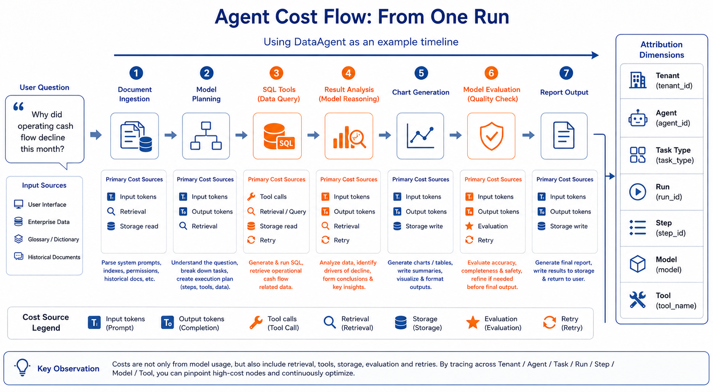
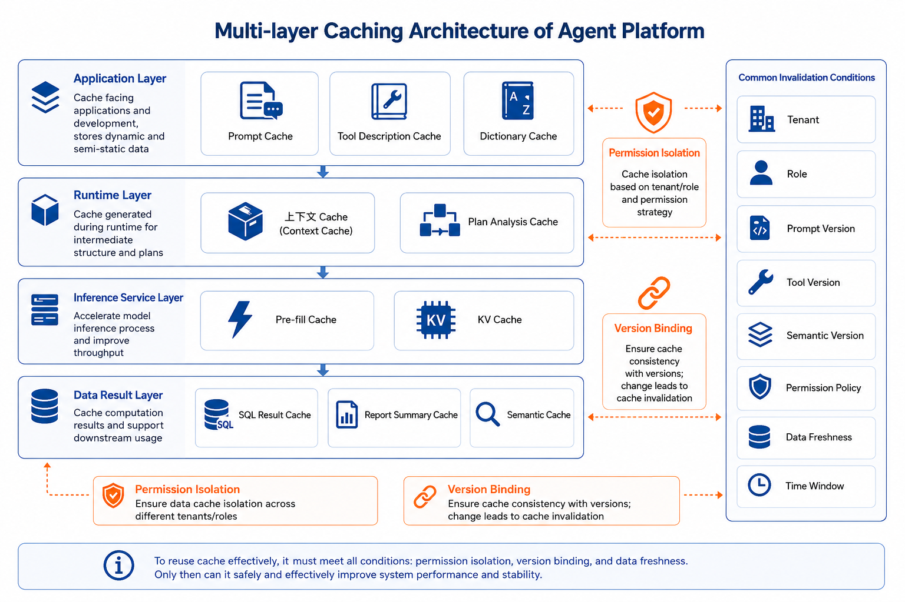

# Chapter 41 Cost Governance and Cache Optimization

---

This chapter discusses cost governance and cache optimization, explaining how task cost attribution, model routing, semantic caching, budget control, and deployment gating work together to constrain large-scale operations. When there is a billing anomaly, focusing solely on model unit price often misdirects investigation: the real cost drivers may be excessively long task contexts, uncontrolled retries, or cache misses that could have been hit. This chapter emphasizes that the first step in cost governance is attribution, not price cutting. It illustrates how to break down costs by task and step, reduce costs using model routing and semantic caching, and prevent cost overruns through budgets and release gating.

Just because an Agent can answer a question doesn't mean it's worth deploying in production. Teams also need to understand why anomalous bills cannot be explained simply by looking at model unit prices. The first step in cost governance is attribution, more than whether lowering prices reproduces results or whether model routing can be released, throttled, downgraded, or optimized.

## 41.1 Why Billing Anomalies Can't Be Explained by Model Unit Price Alone

Many teams seriously discuss Agent cost for the first time not in architecture reviews, but during month-end billing meetings. A financial DataAgent launch may seem successful: users can ask "Why did operational cash flow decline this month?" and the system identifies metrics, queries data, generates SQL, explains differences, draws charts, and outputs reports. Two months later, the platform bill has clearly increased, but business-side capabilities don't seem to have improved accordingly.

The most direct response is usually to switch models: replace strong models with smaller ones, limit output length, reduce running model judges. These actions may reduce bills but can also oversimplify cash flow attribution, increase SQL errors, and raise manual review pressures. The challenge of Agent cost governance is that one user request is a single model call, and a task chain composed of context assembly, model inference, tool calls, retrieval, product generation, evaluation, and retries.

Chapter 38 on Trace mentioned using `session_id`, `run_id`, `step_id`, and `trace_id` to link a single task. In cost governance, these fields are no longer just debugging aids but become cost attribution keys. Without them, the platform only knows "model bill rose"; with them, it reveals which tenant, which Agent, which task type, and which step drove costs up. One can roughly express run cost as: $
Cost_{run} =
\sum_i Cost_{model_i}
+ \sum_j Cost_{tool_j}
+ Cost_{retrieval}
+ Cost_{storage}
+ Cost_{eval}
+ Cost_{retry}
$

Here, model calls include the final answer and intent detection, plan generation, SQL generation, error fixing, report summarization, and model judging. Tool calls include databases and file parsers, code executors, browsers, BI systems, and external APIs. Retry costs are often underestimated: auto-fixing failed SQL, reruns after model timeouts, repeated user clicks in short time all inflate true task cost. Model call cost can be further broken down: $
Cost_{model} =
P_{in} \cdot T_{in}
+ P_{out} \cdot T_{out}
- Discount_{cache}
$

Where `P_in` and `P_out` are unit prices per input/output token, `T_in` and `T_out` are token counts, and `Discount_cache` is cost saved by cache hits. For self-built inference services, this formula is replaced by GPU time, throughput, memory usage, utilization, and operational costs, but governance logic remains: first explain why each run costs money, then discuss how to reduce costs.



*Figure 41-1: Cost flow of a single run in an Agent. Source: Authors. Alt text: Breakdown of a single run's cost into model calls, context tokens, retries, tool execution, etc., with proportional labels and arrows aggregated into total cost, illustrating cost attribution to specific components.*

The point of this figure is not "cost comes from many sources" but a deeper judgment: if costs cannot be attributed back to the task chain, all subsequent optimizations lack a meaningful baseline. Cheaper models that increase retry rates may look cheap per call but cost more per successful task; stronger models that reduce retries and manual reviews may have higher unit costs but lower per-success cost.

## 41.2 Cost Governance's First Step Is Attribution, Not Price Cutting

Returning to that anomalous bill, the correct first step is not immediately adjusting models but aligning billing with Trace. The team needs to answer more complex questions than "which model is most expensive?": which tenants incur highest cost, which Agents' costs grew fastest, how much does a successful task cost on average, how much budget failed tasks consume, and where costs predominantly lie-models, SQL, retrieval, tools, evaluation, or retries.

### 41.2.1 Cost Events Must Attach to Steps

These questions seem like financial issues but are engineering problems in reality. The platform must record cost events at key steps, associating them with Trace, prompt version, model version, tool version, semantic layer version, and permission policy version. A cost event record may look like:

```json
{
  "cost_event_id": "cost_20260609_001",
  "tenant_id": "tenant_finance",
  "agent_id": "dataagent_finance",
  "run_id": "run_cashflow_042",
  "step_id": "step_sql_generate",
  "trace_id": "trace_cashflow_042",
  "cost_type": "model_call",
  "model": "gpt-5-mini",
  "input_tokens": 8420,
  "output_tokens": 620,
  "cache_hit_tokens": 5100,
  "estimated_cost_usd": 0.018,
  "prompt_version": "finance_agent:v12",
  "semantic_layer_version": "finance_semantic:v18",
  "policy_version": "finance_policy:v7"
}
```

The value of this record is adding billing granularity and enabling Chapters 38's replay, 39's benchmark, and 40's online evaluation to see costing. For example, a prompt version improved cash flow attribution accuracy by 1% but increased average input tokens by 80%; a SQL tool version reduced retry rate by 30% but made single queries slower. Without attribution, teams argue on gut feeling; with attribution, they can compare quality gains, latency trade-offs, and cost changes.

### 41.2.2 Unit Task Cost Is More Useful Than Total Amount

Cost dashboards should not show only totals. Totals suit financial settlements but not engineering decisions. More diagnostic insight lies in unit task costs: average cost per successful run, average cost per accepted report, proportion of cost in failed runs, cache savings, P95 cost of similar tasks. If 30% of billing is spent on failed retries, optimization should focus on fixing tool errors, timeout policies, and retry limits-not cheaper models. Several key metrics can be displayed on the same dashboard but should not be obscured by an aggregate score:

*Table 41-1: Key Unit Task Cost Metrics, Questions Answered, and Typical Fix Directions. Source: Authors.*

| Metric                | Questions Answered                              | Typical Fix Direction                         |
|-----------------------|------------------------------------------------|----------------------------------------------|
| Cost per successful task | How much does one usable completed task cost on average? | Model routing, caching, tool stability, reducing invalid retries. |
| Failed cost proportion | What budget is spent on failed, timed-out, or rolled-back runs? | Trace replay, error classification, retry limits, tool contracts. |
| Cache savings amount  | How much cost is saved by stable context and result reuse? | Cache key design, version binding, permission isolation. |
| High-cost step distribution | Which steps concentrate cost?                | Context compression, tool splitting, async, model tiering. |
| Quality to cost ratio | Does cost increase bring quality improvement? | Combine Regression Set, Safety Set, and online feedback for decisions. |

The core logic here: price cutting is a downstream action; attribution is a prerequisite. Otherwise platforms may easily suppress visible billing but shift hidden risks onto users, operations, and manual review teams.

## 41.3 Model Routing: Use Strong Models Where They're Worthwhile

Once cost attribution is clear, the team often finds this fact: not all tasks need the same model. Tasks like metric definition, field explanation, fixed FAQs have stable answers, short contexts, and low risk; small or local models usually suffice. Tasks like cash flow decline attribution, budget anomaly explanation, customer or HR data analysis involve longer context, stronger reasoning, higher risk, and stricter auditing-requiring strong models, full Trace, and rigorous evaluation.

This is the premise of model routing. Model routing is not "always choose the cheapest model" but "place the right model on the right task." The router factors in task type, risk level, context length, latency goals, budget status, and historical effectiveness. It can use low-cost models first for intent detection and risk assessment, then decide to employ small model, strong model, local model, or escalate to manual approval. A simplified rule example:

```yaml
routes:
  - name: low_risk_metric_explain
    when:
      task_type: metric_explanation
      risk_level: low
      max_context_tokens: 4000
    use_model: small_reasoning_model
    fallback_model: general_strong_model

  - name: finance_root_cause
    when:
      task_type: root_cause_analysis
      domain: finance
      risk_level: high
    use_model: general_strong_model
    require_judge: true
    require_trace: true

  - name: batch_summary
    when:
      task_type: report_summary
      latency_class: batch
    use_model: local_32b_model
    fallback_model: small_reasoning_model
```

More abstractly, the router estimates a task utility function: $
Utility(model, task) =
\alpha \cdot Quality
- \beta \cdot Cost
- \gamma \cdot Latency
- \delta \cdot Risk
$

This formula is not to be mechanically applied in every system but a reminder: model selection is constrained by quality, cost, latency, and risk. Especially risk cannot be just a penalty in average score. When tasks involve authorization, compliance, HR/payroll, customer privacy, risk is an access gate-no cheap model should bypass safety policies even if formula utility is high.

Model routing must integrate with evaluation systems. Every routing adjustment needs to run the Chapter 39 Regression Set and Safety Set, then observe real-world feedback through the Chapter 40 online grayscale. Otherwise, routing may save money locally but degrade quality overall. A common pitfall: routing low-risk tasks to small models lowers average cost, but a small subset of borderline cases get wrong answers cached and spread. Without failure labels and regression protection, cost savings become quality debt.

## 41.4 What Does Cache Actually Reuse

"Cache" is one of the most misunderstood terms in cost governance. Many ask "Can we add a cache to reduce cost?" without clarifying which cache. Agent platforms have at least five cache types, each reusing different objects, with different invalidation conditions and risks.

### 41.4.1 Different Caches Reuse Different Objects

Prompt caches are application-layer. System prompts, tool instructions, stable schemas, metrics dictionaries, tenant configs, and permission policies that rarely change can be reusable context fragments. This solves whether these stable materials must be reconstructed, transmitted, and charged on every request. Prefix caches and KV caches are inference service layer. Transformer models cache key-value pairs of computed tokens during generation (KV cache). If multiple requests share the same token prefix, the inference server can reuse prefix calculation to reduce first-token latency and computational cost. Systems like vLLM and SGLang improve throughput by minimizing prefix recomputation.

Result caches reuse deterministic outcomes. The same SQL query, the same low-risk metric explanation, the same static report description-when version, permissions, and data snapshots match-can be reused directly. Semantic cache goes further: it judges whether two questions are semantically close enough to reuse an existing answer, SQL template, or analytic plan. These should not be treated as a single on/off switch. Their boundaries can be understood as:

*Table 41-2: Main Reuse Targets, Suitable Scenarios, and Major Risks of Cache Types. Source: Authors.*

| Cache Type        | Main Reuse Target                                         | Suitable Scenario                        | Major Risk                                |
|-------------------|----------------------------------------------------------|-----------------------------------------|-------------------------------------------|
| Prompt Cache      | Stable system prompts, tool instructions, schema, metrics dictionary. | High-frequency tasks within same tenant and version. | Using outdated contexts after version changes. |
| Prefix / KV Cache | Computed results of identical prefix tokens during inference. | Multiple requests sharing stable prefix or batch tasks with same system context. | Low hit rate due to unstable prefix; complex server cache management. |
| Result Cache      | Deterministic queries, fixed explanations, reusable summaries. | Low-risk requests with stable data snapshots and consistent permissions. | Returning expired results or crossing permission boundaries. |
| Semantic Cache    | Semantically similar answers, SQL templates, analytic plans. | Metric explanations, common questions, re-executable analytic paths. | Semantic misses due to different business contexts despite similarity. |

### 41.4.2 Cache Keys Are Primarily Permission Boundaries

Enterprise DataAgent cache invalidation conditions are far more complex than ordinary web caches. Prompt version changes, tool version updates, schema changes, metric definitions revisions, tenant and role changes, data snapshot updates, and security policy adjustments all may invalidate cache reuse. Cache keys therefore need version and permission context instead of only question text or prompt hash:

```json
{
  "cache_key": "sha256(...)",
  "tenant_id": "tenant_finance",
  "prompt_version": "finance_agent:v12",
  "tool_version": "sql_tools:v5",
  "semantic_layer_version": "finance_semantic:v18",
  "policy_version": "finance_policy:v7",
  "role": "finance_manager",
  "data_snapshot": "warehouse:2026-06-09"
}
```

Without permission isolation, high-privilege user context or results may be reused for lower-privilege users. This is a performance issue and a security incident. Thus, enterprises must not treat "higher hit rate is always better" as the sole goal. The true objective is cache hits with correct permissions, versions, time windows, and data freshness.

### 41.4.3 Different Token Strategies for Self-Hosted Models and External APIs

Enterprises differ widely in token strategies and cannot apply uniform cost metrics. One class deploys local or private cloud small models, often domain fine-tuned, distilled, or instruction-tuned for fixed tasks like customer service Q&A, metric explanation, contract extraction, or equipment inspection. Here, tokens may not directly map to external billing but represent compute usage, memory pressure, throughput, and deployment costs. Cost governance focuses on model specs, concurrency, batching, quantization, prefix reuse, KV cache capacity, GPU/NPU utilization, and whether maintaining a dedicated small model per task is worthwhile.

The other class mainly calls external large model APIs, where tokens are explicit billing and latency variables. Cache hit strategies are constrained by vendor API designs. Some APIs auto-cache common prefixes requiring stable long prefixes; others provide explicit cache annotations or checkpoints allowing callers to specify cache boundaries. If an enterprise Agent wraps all vendors as a simple "text input box," cache gains may be lost due to dynamic timestamps, user IDs, temporary tool results, and randomly ordered tool definitions appearing in cache prefixes, reducing hit rates. These differences can be summarized as:

*Table 41-3: Token Meaning and Cache Optimization Focus for Self-Hosted Models vs. External APIs. Source: Authors.*

| Deployment Type            | Token Main Meaning                     | Cache Optimization Focus                            | Easily Overlooked Issues                        |
|---------------------------|--------------------------------------|---------------------------------------------------|------------------------------------------------|
| Local or private cloud small models | Compute, memory, throughput, deployment capacity. | Batching, prefix reuse, KV cache management, model quantization, domain prompt shortening. | Small model maintenance costs, model drift, misuse for out-of-domain tasks. |
| External large model APIs | Direct cost, latency, vendor quotas. | Stable prefixes, vendor cache parameters, cache hit monitoring, prompt structure adaptation. | Vendor rule differences, dynamic fields breaking prefixes, cache metrics not integrated into Trace. |

For self-built small models, domain fine-tuning itself reduces token dependency. The model learns company-specific terms, processes, and output formats, so large rules, examples, and field explanations need not be stuffed into context on every request. This saves tokens and first-token latency and context assembly complexity. But it is not free: when business rules change, the model must be re-evaluated, further fine-tuned, or fallback to prompt control; routing out-of-domain questions to the small model risks quality.

For external APIs, the enterprise Agent must build a "vendor adaptation layer," more than a unified interface. The adapter must handle three things at minimum. First, prompt structure must be stable: system instructions, tool descriptions, fixed examples, schema summaries, and metric dictionaries go first; user questions, time windows, temp tool results go last. Second, serialization must be deterministic: tool lists, field descriptions, and permission policies cannot be randomly ordered each time; request IDs or current time must not appear before cache boundaries. Third, metrics must be written back to Trace: each call records input tokens, output tokens, cached tokens, cache write costs, vendor cache params, and miss reasons.

The key is not remembering a vendor's current cache rules but isolating differences inside the model gateway. OpenAI, Claude, or other model services' cache mechanisms will evolve; business Agents should not directly depend on these details. A safer approach is for Runtime to generate a logical context bundle, and for the model gateway to translate it into the vendor's best cache-friendly request format. This way, switching routing does not alter business logic; cache policy changes only require tweaking the gateway adapter and regression evaluation.



*Figure 41-2: Multi-layer cache structure in Agent platform. Source: Authors. Alt text: Multi-layer cache from top down-result cache, semantic cache, prefix cache, model KV cache, each labeled with reuse target and hit conditions; arrows indicate sequential hit attempts for cost reduction.*

This figure's point is "different cache targets require different governance." Prompt caches are mainly managed by application and gateway layers; prefix and KV caches by inference services; result and semantic caches must consider business versions, permissions, and data freshness. Calling them all simply "cache" aids communication but implementations must govern them separately.

## 41.5 Why Semantic Cache Must Be Conservative

Semantic cache means reuse "based on semantic similarity." It does not require two questions be lexically identical but judges if their business intents are close enough. For example, "What is the definition of operating cash flow?" and "What does operating cash flow mean?" very likely share one metric explanation. "Why did cash flow decline this month?" and "Reasons for decreased cash flow this month?" are semantically similar but reuse is more cautious because time windows, tenants, permissions, data snapshots, and conversation history may differ. Semantic cache usually requires three simultaneous conditions: $
CacheHit =
Similarity(q, q') > \tau_s
\land Fresh(data) = true
\land PolicyAllowed(user, result) = true
$

`Similarity` is semantic similarity, `\tau_s` is threshold, `Fresh` means data still fresh, and `PolicyAllowed` means the user has right to see cached result. The formula's focus is not on similarity but on data freshness and access policy. Many cache incidents are not vector similarity errors but ignoring freshness and permission boundaries.

In DataAgent, a prudent approach is layered reuse instead of directly reusing final answers. Low-risk metric definitions, fixed explanations, and public FAQs can be directly reused; SQL templates can be reused but queries must be re-executed; analytic plans can be reused but data must be newly read; in high-risk scenarios, cache results should serve only as candidate prompts, not direct user responses. Reuse strategies form a spectrum from conservative to aggressive:

*Table 41-4: Semantic Cache Risk Levels and Recommended Practices by Reuse Target. Source: Authors.*

| Reuse Target               | Risk Level   | Recommended Practice                                  |
|---------------------------|--------------|------------------------------------------------------|
| Metric definitions, field explanations, public FAQs | Low          | Direct reuse if version and permissions match.      |
| SQL templates, filters, chart configs              | Medium       | Reuse template but re-run queries and verify results. |
| Analytic plans, attribution paths                  | Medium-high  | Use as candidate paths, must re-read evidence.       |
| Final conclusions, management reports              | High         | Default no direct reuse unless snapshot, permissions, and context fully match. |

This conservative approach fits enterprise needs. Final answers are most sensitive to time, snapshots, and permissions; SQL templates and analytic plans are relatively stable and better reuse candidates. Semantic cache's goal is not "return old answers as much as possible" but "reuse already verified intermediate capabilities."

Semantic cache also needs fail feedback. If a cached hit is downvoted by users, judged insufficient by model judges, or exposes permission issues in Safety Set, the cache system must delete that result and review similar questions, templates, and routing rules. Cache is not a static accelerator; it participates in quality feedback loops.

## 41.6 Budget Control: Let the System Decide Before Spending

Tokens are the core variable for large model cost and latency. More input tokens mean longer context to process; more output tokens mean longer generation and higher fees. In Agent scenarios, token growth is especially rapid because system prompts, tool instructions, schemas, historical dialogue, memory, retrieval documents, and tool results all enter the context.

Budget control can't wait until bills arrive. A better approach is estimating cost before a Run or key Steps: estimate tokens before generating a long report; estimate scan size before big SQL; judge if full evaluation is needed before model judging. Budgets can be set by tenant, user, Agent, scenario, project, and time window-e.g., tenant limits $5,000 per month, low-priority Agent limits 500,000 tokens per day, interactive request limited to 30 seconds and 20K tokens.

Budget control should not be just "allow or deny." Approaching budget limits can notify admins; overly long context can trigger compression or fewer retrieval documents; peak times can force smaller models, disable non-high-risk tools, shift to async tasks; expensive tasks can require manual approval; denial occurs only when hard limits or policies are breached. A budget policy example:

```yaml
budget_policy:
  tenant_id: tenant_finance
  monthly_usd_limit: 5000
  per_run_token_limit: 50000
  warning_threshold: 0.8
  actions:
    - when: monthly_usage_ratio > 0.8
      action: notify_admin
    - when: per_run_estimated_tokens > 30000
      action: summarize_context
    - when: per_run_estimated_cost_usd > 2.0
      action: require_approval
    - when: monthly_usage_ratio > 1.0
      action: block_low_priority_tasks
```

Budgeting must link to Chapter 42's SLO management. High-priority tasks retain more budget and stronger models; low-priority tasks queue, downgrade, or go async during peaks. Budget is not purely financial control but part of stability control. An Agent unaware of budgets can drag systems into error loops, repeated retrievals, and unbounded retries; a budget system that only hard rejects will turn recoverable user experiences into product failures. Good budget control acts like a scheduler, not an end-of-month expense report.

## 41.7 How to Prove Cost Optimization Doesn't Hurt Quality

The riskiest cost optimization approach is to only look at how much money is saved. Cheaper models may reduce task success rate; shorter context may lose key evidence; aggressive caching may return stale answers; fewer retries may reduce availability. Saved bills may be paid back via user downvotes, manual takeovers, erroneous decisions, or compliance risks.

### 41.7.1 Optimizations Must Pass Deployment Gates

Engineering can follow this sequence: first guard safety and correctness; then guard availability and latency; finally optimize cost. Unauthorized access, data leakage, or high-risk metric errors must never be traded for cost savings; interactive tasks must show users progress or usable results promptly; only within protected quality and stability can model, context, tool, and evaluation costs be cut. An optimization deployment condition can be formulated: $
AllowedOptimization =
Quality \ge Q_{min}
\land Safety = pass
\land Latency \le L_{max}
\land CostReduction > \epsilon
$

This formula expresses gating logic: only when quality, safety, and latency meet baseline does cost optimization count. Otherwise, it is risk shifting. Low-risk, high-frequency tasks like metric explanation, field descriptions, and fixed FAQs can more aggressively use cache and small models; high-risk, low-frequency tasks like financial attribution, HR data, and compliance reports should prioritize strong models, full Trace, and manual review.

Cost governance must connect Chapters 39 and 40. Offline benchmarks prove new strategies don't harm known tasks; online grayscales observe unknown side effects in real traffic. If a cache strategy cuts cost 35% but Safety Set exposes access violations, deployment gates must block release; if model routing reduces average cost 20% but Regression Set for operating cash flow attribution degrades, rollback or limited grayscale is required.

For PMs, cost optimization is not simply "spend less" but deciding which capabilities scale, which must incur fees or approvals, and which should be asynchronous. For developers, it's a synergy of Trace, cache keys, retry policy, throttling, and gateway strategy. For AI researchers, it's an experiment balancing quality, context, model capability, and inference budget. Only by uniting these with a versioned evaluation and cost event system do discussions avoid fragmentation.

## 41.8 Case Replay: Cost Reduction in Financial DataAgent

Returning to the initial anomalous bill, once the team aligned cost events with Trace, they found cash flow attribution tasks accounted for 42% of total cost. Digging deeper, costs mainly arose from two problems: stable schema and tool instructions were embedded in full context every time, and after SQL generation failure, the Agent repeatedly produced similar erroneous SQL, causing multiple retries.

The first optimization did not switch models but reused context. The team split stable system prompts, tool instructions, financial schema, and metrics dictionaries into reusable fragments, establishing prompt cache and prefix reuse for the same tenant and semantic layer version. This decreased input tokens noticeably without changing task logic or reducing necessary evidence.

The second optimization addressed SQL retry. Trace revealed many failures due to Join Key errors; the model guessed repeatedly in absence of clear tool feedback. The team included Join Key process tags from Chapter 39 in the regression suite, improved tool error feedback, and directed the Agent to prioritize semantic layer recommended joins on the second retry instead of blind generation. This reduced failed retries and improved error attribution.

The third optimization adjusted model judge strategy. Previously, all reports underwent full judging. The team switched to layered evaluation: low-risk, cache-hit metric explanations got rule checks only; high-risk financial attributions retained full model judging; grayscale deployments increased sampling rates. This preserved quality gates while reducing unnecessary evaluation costs.

After grayscale release, unit successful task cost dropped 35%, P95 latency dropped 22%, Regression and Safety Sets showed no regressions, and online downvote rates stayed stable. This demonstrates cost governance is not "just replace with cheap models." The effective path is attribution first, then routing, then caching, then budget control, followed by offline benchmarks and online grayscale validation to confirm no quality loss.

---

## 41.9 Cost-Anomaly Review And Budget Actions

Agent cost anomalies rarely come from model unit price alone. A monthly bill increase may come from longer context, lower cache hit rate, RAG document rebuild, evaluation batches, resident GPU replicas, tool retries, report export, or multi-tenant isolation. Cost governance should map the bill back to task chains instead of summarizing only by model provider. Otherwise business teams see a total amount, platform teams see resource usage, and neither side knows which link to optimize.

Cost review should record triggering task, model version, input and output tokens, cache hit, tool-call count, GPU hours, vector rebuild, human review, and failed retries. If cost rises in a business domain, the team should check whether adoption also increased. If cost comes from failed retries, tool and Planner repair should come first. If it comes from evaluation batches, the team should review evaluation windows, sample size, and concurrency. If it comes from low-use resident services, the model-service catalog in Chapter 44 should drive cleanup.

Budget actions should remain tied to user experience. Blunt throttling can break high-value tasks, while unlimited budget lets low-value tasks consume shared capacity. The platform can define actions by task tier: low-risk Q&A degrades to smaller models, long reports move to async execution, batch evaluation enters night queues, high-risk business tasks receive protected budget, and experimental tasks above budget require owner confirmation. Cost governance should make each spend traceable to task value and operating evidence.

## 41.10 Cost anomaly ledger and cache invalidation review

Cost governance needs a replayable anomaly ledger. The ledger should record more than the amount spent. It should include the tenant, Agent, task type, model route, cache key, budget policy, retry count, evaluation policy, and user-visible result at the time of the anomaly. If a cost anomaly appears only in a finance report, engineers have little evidence for deciding whether it came from business growth, context expansion, tool loops, cache misses, or a change in evaluation sampling. A better review starts by reducing the anomalous bill to inspectable Runs. Each Run should show the call order, input length for each Step, tool-output size, retry reason, cache hit status, and final quality feedback. The discussion then stays on the execution path instead of turning into a generic complaint about model price.

Cache invalidation should be part of the same ledger. Enterprise data changes through backfills, metric-definition edits, permission changes, knowledge-base rebuilds, model upgrades, and prompt releases. Each change should trigger a scoped cache action: backfills clear caches tied to the affected data snapshot, metric-definition edits clear caches tied to the semantic-layer version, permission changes clear caches within the affected user and role scope, and prompt or model releases trigger review of cached answer style and structured objects. Fixed TTL alone leaves stale answers in high-risk paths for too long. Full invalidation after every change erases most cache value. The ledger helps teams identify which invalidation events occur most often, which cache keys are too broad, and which tasks should reuse only intermediate artifacts.

Budget SLOs also belong in the ledger. When a low-priority task is downgraded, the system should record the explanation shown to the user, the alternatives offered, and whether the task eventually completed. When a high-priority task exceeds budget, the ledger should record the approver, approval reason, and final quality result. Monthly review can then separate two problems: policies that are too tight and suppress legitimate work, and tasks whose design consumes resources out of proportion to business value. Cost governance becomes adjustable only when anomaly records, cache invalidation, quality feedback, and business value are reviewed together.

## 41.11 Joint acceptance for cost governance and user experience

Cost governance should not be accepted only by a lower bill. If the platform saves money by using weaker models, shortening context, increasing cache hits, or delaying execution, it must also observe answer quality, user waiting time, human takeover, and business rejection. A cost rule that repeatedly degrades high-value tasks may reduce invoices while pushing work back to manual processes or outside tools. Acceptance material should show cost, quality, and experience together.

The user interface should also express cost strategy. Asynchronous reports, low-priority queues, cached results, approximate answers, and high-cost approval should be visible. Users do not need token prices, but they need to know whether a result came from cache, whether data time is current, why a task is queued, and whether a higher priority path exists. Clear cost signals reduce misunderstanding and help business owners decide which tasks deserve more resources.

Cost review should return to product boundaries. If a class of questions remains expensive, the task may be too broad, the semantic layer may lack pre-aggregations, the prompt may request unnecessary explanation, or the tool may return oversized results. Lower model cost treats only the surface. The platform should turn cost anomalies into product and data-engineering questions: whether a new metric table is needed, whether the task should run asynchronously, whether export should be limited, or whether the task template should be rewritten. Cost governance then improves platform structure instead of only reducing spend.

## 41.12 Review window for cost-policy changes

Cost policy changes need review as well. When model-routing rules, cache invalidation, budget thresholds, evaluation sampling, retry limits, or async queue priorities change, users do not experience a configuration edit. They experience different response speed, answer completeness, waiting time, and human takeover probability. Before release, the platform should prepare a replay set for cost policies: low-risk frequent Q&A, high-risk business analysis, long reports, batch evaluation, permission-boundary queries, and cache-hit scenarios. Each sample should compare cost, latency, quality signal, and user-visible state before and after the change.

The review window should pay special attention to the interaction between cache and budget. Tighter budgets may drive more cache hits or smaller model routes. Broader cache policy may lower visible cost while increasing stale answers, permission mismatches, or user follow-up. If the platform looks only at unit task cost, the strategy may look successful. Review material should count later follow-up, manual rejection, report return, and rerun cost. A cache hit that saves tokens but causes the user to rerun or escalate the work has not necessarily reduced real cost.

Policy changes need canary and rollback. Low-risk FAQ can expand cache coverage first, while high-risk finance tasks should keep a longer observation period. Internal test tenants may use more aggressive model routing, while formal operating reports keep stronger models and full Trace. If canary shows longer waits, more human takeover, or Safety Set anomalies, the platform should roll back by tenant, task type, or data domain. Mature cost governance treats cost reduction as an observed operating discipline, not a one-time configuration change.

## 41.13 Audit and anomaly explanation for cost policy

After cost governance enters production, business and finance teams will ask two questions: where the money went, and whether savings changed task quality. The platform should provide more than a monthly invoice or token count. One Run may spend money on model calls, retrieval, SQL, chart rendering, object storage, evaluation sampling, human review, and retries. The audit view should aggregate by tenant, Agent, task type, model, tool, Run, and Step, while keeping policy version, cache hit, budget action, and degradation reason. Cost changes then become explainable before the month-end bill arrives.

Anomaly explanation should connect cost with behavior. A tenant's cost may rise because usage grew, but it may also rise because of retry storms, cache invalidation, missing pre-aggregations in the semantic layer, oversized tool results, changed evaluation sampling, or conservative model routing. A report that says "cost increased by 30 percent" gives the business owner little to act on. A useful explanation identifies the tasks, steps, recovery paths, and user behavior behind the increase. Report-generation cost may rise because each report now runs three extra SQL queries. Knowledge-Q&A cost may rise because document-version changes invalidated a large cache segment.

Cost audit should also inspect savings actions. Switching to smaller models, shortening context, broadening cache, reducing evaluation sampling, and delaying execution should all be recorded as policy actions. They should be linked to quality, waiting time, human takeover, and user feedback. If a savings action lowers the invoice but increases business-review rejection, the audit report should show the real trade. This lets FinOps, platform teams, and business owners discuss task value using shared evidence instead of arguing over unit price.

A first version can produce a monthly cost explanation pack. It does not need to be complex, but it should include top cost tasks, largest anomalies, cache invalidation causes, retry cost, human-review cost, degradation counts, and quality regression results. Each anomaly should have an owner and a next action: tune a prompt, add pre-aggregation, adjust cache policy, limit export, change async queueing, or pause a low-value task. Cost governance should improve platform structure over time while reducing waste.

## 41.14 User-visible feedback for cost policy

Cost governance should not stay entirely in the background. When users see queued tasks, slower models, asynchronous report generation, or requests to narrow scope during peaks, they need to know that cost and capacity policy is active. If the platform returns only technical errors or simple rate-limit messages, users will rephrase repeatedly, create more requests, and read the system as unstable. Cost policy needs user-visible feedback.

Feedback should be task-specific. For long reports, the system can say that the task entered an asynchronous queue and give an expected completion window. For expensive queries, it can suggest a narrower time range or a published metric. For repeated questions, it can explain that a cached result is being reused and show the data time. For low-priority batch tasks, it can say that execution will happen after resources free up. Users do not need token prices or cache algorithms, but they need to know how to adjust requests to get reliable results faster.

Cost feedback also has to protect quality. The platform should not make users believe a low-cost path is equivalent to a full result. If the system uses cache, summary, sampling, or a weaker model, it should state the limits in the right place. For formal reports and high-risk decisions, cost degradation must enter EvidenceRef and publication records. Users can then understand where the result applies, and the platform can prove during review that cost policy did not sacrifice business trust.

A first version can prepare standard feedback for common cost actions: queueing, asynchronous execution, cache reuse, scope narrowing, model downgrade, and human takeover. Each feedback type connects to Trace, budget policy, and user action guidance. Cost governance then becomes part of product experience and backend financial reporting at the same time.

## 41.15 User feedback for cost policies

Cost policies affect user experience. Cache hits, model degradation, context compression, async execution, and quota limits can make the system feel faster, slower, shorter, or more conservative. If the platform judges policy success only through cost dashboards, it may reduce spend while weakening high-value tasks. Cost governance needs user feedback linked to policy versions.

Feedback should be analyzed by policy type. If users keep asking follow-up questions after a cache hit, the answer may be stale or missing context. If reports are rejected after model degradation, the cheaper model may not fit the task. If citations decrease after context compression, evidence may have been trimmed. If users cancel after async execution, waiting messages may be unclear. Each feedback type points to a different repair path, not simply a larger budget.

A first version can record user impact in the cost policy ledger: policy version, affected task, cost change, latency change, adoption rate, rejection rate, and feedback label. After a cost optimization passes release, the platform should still observe real traffic for a period. Cost governance then serves business value instead of pushing every task toward the lowest-cost path.

## 41.16 Task attribution for cost anomalies

When task attribution for cost anomalies reaches production, the platform needs a shared evidence standard for tenant, task type, model route, cache hit, retry count, tool call, and business owner. This standard is not paperwork for its own sake. It lets business, platform, data, security, and operations teams discuss the same facts. Without this material, incident review depends on memory and personal judgment. With it, the team can see which inputs were valid, which actions executed, which artifacts can still be used, and which results need correction or withdrawal.

This evidence should connect to Chapter 38 on Trace, Chapter 45 on the gateway, and Chapter 53 on operating review. The upstream chapters provide the capability base, downstream chapters consume the runtime result, and this chapter explains how the middle layer is verified. If a capability looks complete inside one chapter but cannot enter Trace, Eval, release records, or the compliance evidence package, the production system still has a break in the chain. Readers should treat cross-chapter interfaces as engineering contracts, not as a reading order.

Common risks include cost being attributed only to the platform team, retry amplification going unnoticed, and cache hit rate improving while quality declines. A successful demo rarely exposes these problems because demo samples are usually clean, short, and direct. Real business traffic brings stale data, abnormal input, permission changes, user withdrawal, budget limits, and long-running state. If the platform does not turn those situations into samples and ledgers, later scenarios will hit the same class of issues again.

Cost being attributed only to the platform team should be turned into a tracked review item when it appears repeatedly. The operating record should at least state owner, version, sample, affected scope, action, and review time. It does not need to become a long process report, but it must be clear enough for a later maintainer to understand the decision. For high-risk capability, the record should also state which conditions allow wider use and which failures require degradation or withdrawal.

A first version can build this habit in a few representative scenarios. It is better to make high-traffic, high-risk, externally visible paths solid first, then copy the sample, ledger, and review method to related capabilities in other chapters. This makes the chapter read like engineering guidance: it explains how the capability is integrated, validated, operated, and retired.

## Chapter Recap

Agent cost governance must start from the task chain, not from single model calls. Run cost comes from models, tools, retrieval, storage, evaluation, and retries. Only by attributing costs to `run_id`, `step_id`, and `trace_id` can teams determine where money is spent, if quality gains justify cost, and whether optimizations just shift risk elsewhere.

Model routing, caching, and budgets are not isolated strategies. Routing must respect task risk and evaluation; caches must bind tenant, role, version, snapshot, and policy; budgets must intervene before task execution and integrate with SLO, throttling, downgrades, and manual approval. Whether cost optimizations deploy depends on combined quality, safety, latency, and cost criteria.

- [ ] Can costs be aggregated by tenant, Agent, model, tool, Run, and Step?
- [ ] Can cost events associate with `trace_id`, `prompt_version`, `model_version`, `semantic_layer_version`, and `policy_version`?
- [ ] Has model routing passed Regression Set, Safety Set, and online grayscale validation?
- [ ] Do cache hits verify permissions, versions, time windows, and data freshness?
- [ ] Are graded controls (notifications, compression, degradation, approvals, denials) implemented on budget overruns?
- [ ] Has cost optimization deployment been confirmed with no regressions in quality, safety, or latency gates?

Related chapters: [Chapter 7 Inference Optimization](../../part02-model-inference/en/ch07.md), [Chapter 8 Structured Output and Prompt Engineering](../../part02-model-inference/en/ch08.md), [Chapter 38 Agent Observability and Runtime Diagnostics](ch38-trace.md), [Chapter 39 Enterprise DataAgent Evaluation and Benchmarking](ch39-dataagent-eval-benchmark.md), [Chapter 40 Online Evaluation, Model Judges, and Continuous Optimization](ch40-llm-as-judge.md), [Chapter 42 SLO Management, Throttling and System Resilience](ch42-slo.md), [Chapter 45 LLM Gateway and Multi-tenancy](../../part08-deployment/en/ch45-llm.md). Engineering topics to follow: model gateway, inference service caching, semantic caching, token budgeting, cost dashboards, tenant-level throttling, grayscale release, and evaluation gating.

## References

LiteLLM. (n.d.). [Documentation](https://docs.litellm.ai/).

GPTCache. (n.d.). [Documentation](https://gptcache.readthedocs.io/).

FinOps Foundation. (n.d.). [Framework](https://www.finops.org/framework/).

OpenTelemetry. (n.d.). [Metrics documentation](https://opentelemetry.io/docs/concepts/signals/metrics/).
