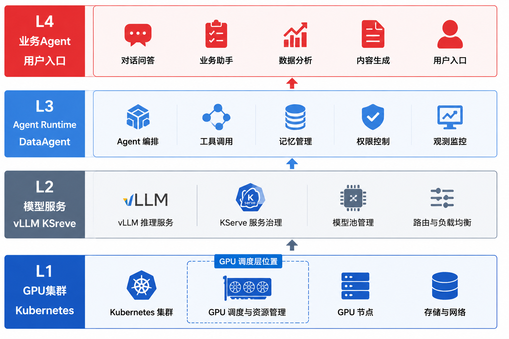
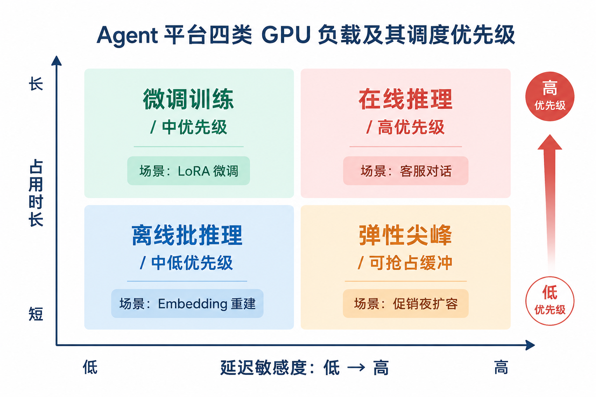
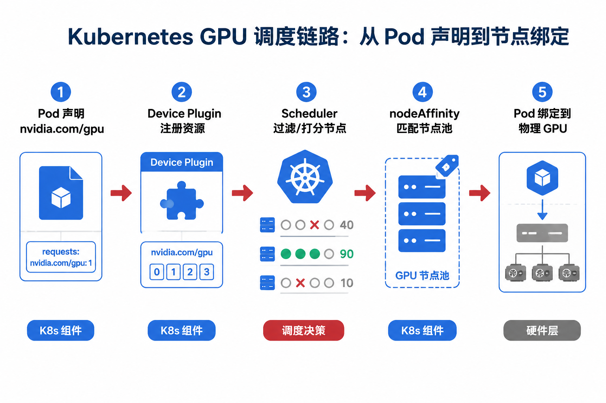
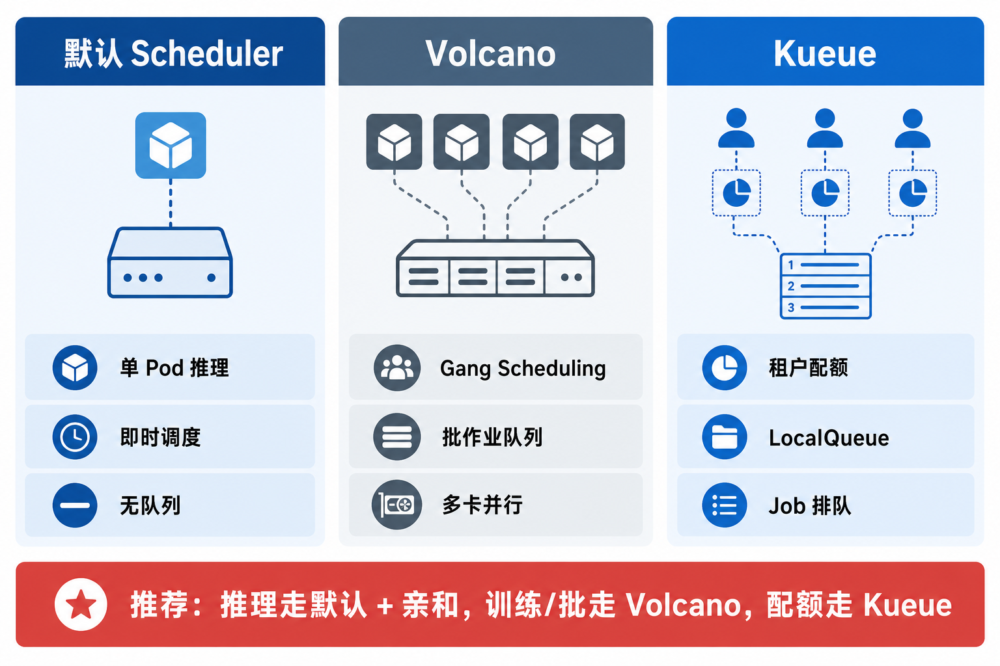
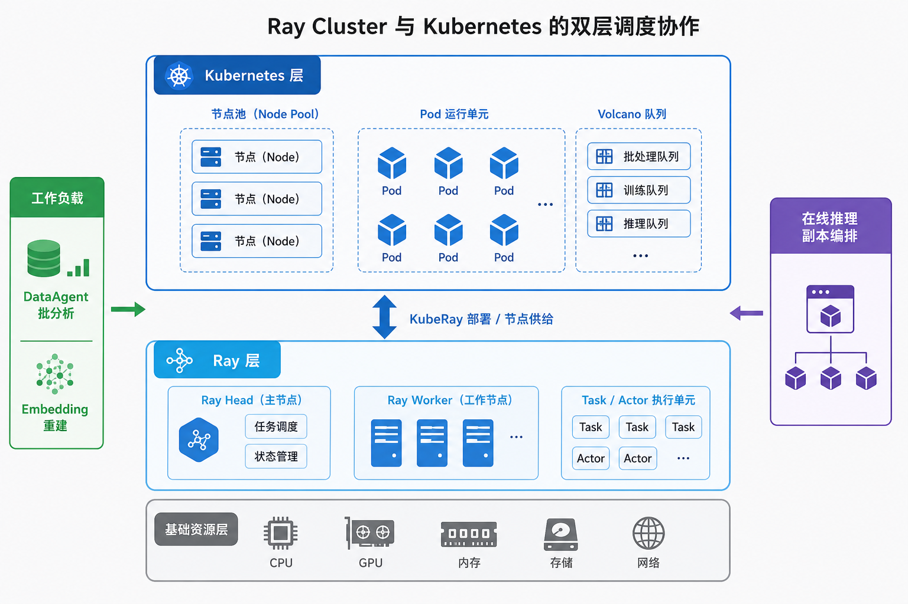
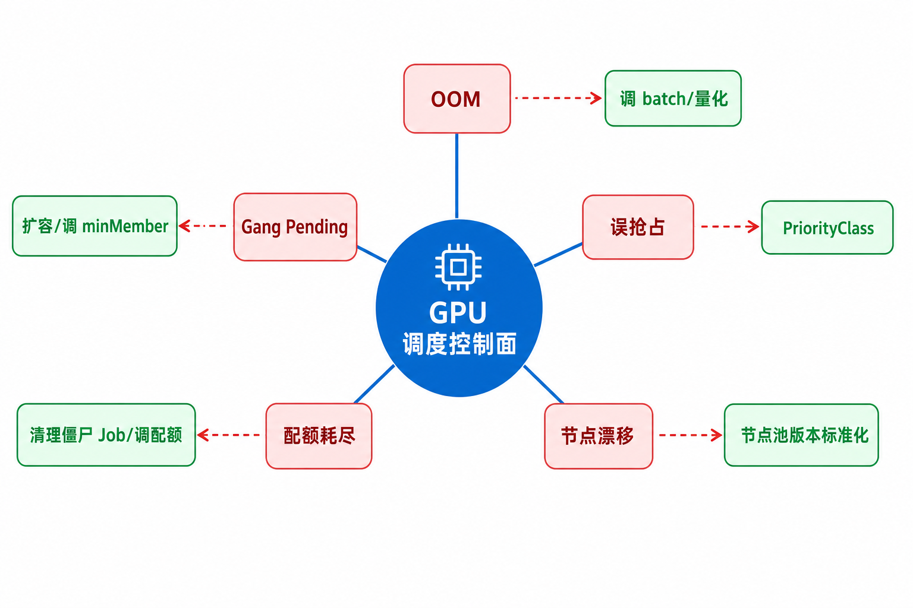

# 第43章 GPU 调度与 Kubernetes

---

一次促销活动前，客服 Agent 的在线推理 Pod 开始排队等待 GPU。监控面板上 GPU 平均利用率并不高，因为部分卡被长时间批处理任务占住，另一些卡又因为模型副本和节点标签配置不当处于空闲。业务看到的是首 token 变慢，平台看到的却是“集群还有余量”。

GPU 调度要把稀缺算力变成可承诺的资源池。Kubernetes 只是基础，平台还需要队列、优先级、节点隔离、配额和弹性策略，才能在多租户、多模型和多类负载之间稳定分配算力。

GPU 昂贵且稀缺。多个模型、多个租户抢同一批卡时，调度不当会同时出现排队和闲置。在线推理请求等不到 GPU，夜间批处理占着整卡，训练 Job 半启动，某个模型副本因为节点亲和写错无法落位，Autoscaler 在高峰过后才扩出新节点。业务看到的是 Agent 变慢、超时和降级，运维看到的却是一堆看似分散的 Pending Pod、空闲卡和队列积压。

GPU 调度层要回答一个具体承诺：哪类业务、在什么优先级和配额下，可以在多长时间内拿到哪类 GPU。客服 Agent、DataAgent 在线问答、批量 embedding 重建、LoRA 微调、视觉推理和评测批跑，对延迟、运行时长、抢占和隔离的要求完全不同。把它们放在同一个默认节点池里，短期利用率可能看起来更高，长期会把 SLO、成本和事故责任混在一起。

本章讨论 GPU 调度、Kubernetes、资源池、队列优先级、节点隔离和弹性伸缩。Kubernetes 上的关键设计，是把 GPU 组织成可调度、可隔离、可审计的资源池，用队列和优先级保证关键推理服务拿到资源，并在节点隔离与弹性伸缩之间平衡利用率和稳定性。读者需要把 GPU 调度看成模型服务的底座，而不是一组 YAML 资源请求。

这个承诺还会影响平台成本。GPU 账单通常按节点、卡型和时长出现，业务方看到的是“为什么这么贵”，SRE 看到的是“平均利用率不高”，平台团队看到的是“高峰时仍然排队”。三者并不矛盾：在线推理为了 P99 延迟必须留余量，批处理为了吞吐会吃满整卡，训练为了 Gang Scheduling 需要同时拿到多张卡。调度层要把这些差异写成节点池、队列和配额，而不是靠每周会议临时协调。

因此，GPU 调度是模型服务能否承诺 SLO 的前提，不能当作部署章节里的附属配置。一个推理服务在单机上跑通，只证明模型和引擎可用；它在共享 GPU 集群里稳定服务，还要证明节点池隔离、队列准入、优先级、扩容和故障恢复都成立。后续第44章讨论模型服务时，所有 InferenceService 都会依赖本章建立的算力边界；第45章讨论网关时，也需要知道底层 GPU 队列是否还能接收新请求。

---

## 43.1 GPU 调度要解决的算力承诺

当多事业部共用 GPU 集群时，算力争抢往往先于模型能力成为生产瓶颈。典型现象是：在线推理 Pod 排队等待 GPU，而训练或批处理 Job 仍占用大量卡资源；监控面板显示 GPU 平均利用率处于中等水平，但首 token 延迟（TTFT）已超出 SLO。这类问题通常不来自模型算法，而来自算力没有按业务优先级与 SLA 调度。企业 Agent 平台在算力层的事故，常先表现为调度异常，随后才传导为体验下降或任务失败。

企业 Agent 平台从试点走向规模化后，多事业部的算力诉求往往彼此冲突。以四个典型事业部为例：

- 零售：促销高峰需支撑高并发推理，P99 首 token 需控制在毫秒至秒级，不能接受长时间排队；
- 制造：设备诊断 Agent 需 7×24 占用 GPU 做视觉推理，要求节点亲和与故障域隔离；
- 金融：月末批分析需长时间占用队列，但数据不出域，且不能影响日间在线查询；
- 物流：存在可预测的短时弹性峰值，其余时段 GPU 应释放给其他队列。

多套业务、多种 SLA、单一 GPU 采购预算。若缺少统一的 GPU 调度层，最终往往退化为非正式的算力协调：运维人员手工 cordon 节点、驱逐 Pod，既不可审计，也不可复现。

非正式协调在试点期看起来灵活，生产期会变成事故来源。某个团队临时借用推理池跑夜间评测，活动当天忘记停掉；某个训练任务被手工提高优先级，后续没有记录；某个节点被运维临时打标签，三周后没人知道为什么批处理 Pod 能进入在线池。GPU 调度一旦依赖口头约定，事故复盘时就很难判断责任：是业务申请不清楚，平台模板有漏洞，还是 SRE 临时操作没有回滚。

GPU 调度层回答一个精确问题：哪张物理卡、在哪个节点、以什么隔离粒度、在什么时限内，跑哪个工作负载。它向上为第44章 模型部署提供“可预测的算力契约”。模型服务声明需要 1 张 A100-80G，调度层应保证在约定时间内绑定到满足 `nodepool=gpu-inference` 的节点，而非依赖“集群里总共有若干张卡、各团队自行协调”。它向侧面为第46章 GitOps 交付提供可被声明式管理的节点池。Terraform 创建节点池，K8s 标签表达调度策略，ArgoCD 同步 DaemonSet 与 Queue 配置。

调度层不负责的事项须明确，以免与相邻章节重复：

- 不负责模型权重如何加载、Canary 如何切换。属于 第44章；
- 不负责请求走哪个模型、租户配额多少 Token。属于 第45章；
- 不负责 vLLM 的 KV Cache 如何优化。属于 Part II 第7章。



*图43-1：GPU 调度层位于 Agent 平台算力底座，向上支撑模型服务与业务 Agent。来源：本书自绘。Alt text：分层图最下层是 GPU 资源池与调度器，中层是模型服务，上层是业务 Agent，箭头自下而上表示算力逐层支撑应用。*

图 43-1 展示企业 Agent 平台的算力供给路径。GPU 调度属于平台基础设施，不能简化为 vLLM 启动参数里的 `--gpu-memory-utilization`。没有这一层，第44章的 InferenceService 只是在 YAML 里写 `nvidia.com/gpu: 1`，却无法保证高峰时不被训练 Job 挤占。

算力供给路径还要能被审计。一次高峰事故后，平台需要回答哪些模型副本拿到了 GPU、哪些 Pod 在队列里等待、哪些 Job 因配额被拒绝、哪些节点不可用、扩容用了多久。若这些信息散落在 `kubectl describe`、Prometheus、云厂商控制台和人工聊天记录里，复盘就会停留在经验判断。比较稳的做法是把调度事件、队列状态、节点池标签和网关路由都写入同一条观测链路。

*表43-1：GPU 调度相关核心概念的定义与区别。来源：本书整理。*

| 概念 | 定义 | 与相邻概念的区别 |
|---|---|---|
| GPU 调度 | 在集群内按优先级、配额和拓扑，把 GPU 分配给 Pod/Job | 不同于 第44章的模型版本管理与 Canary 流量 |
| Kubernetes（K8s） | 容器编排平台，提供 Pod、节点、命名空间等抽象 | 不同于 Slurm 的 HPC 批作业语义与 `sbatch` 文化 |
| 队列调度器 | 在 K8s 之上管理 AI 作业排队、优先级与 Gang Scheduling | 不同于默认 kube-scheduler 的“来一个 Pod 调度一个” |
| GPU 共享 | 多工作负载复用同一张物理卡（MIG、时间片等） | 不同于 HPA 增加 Pod 副本（那是水平扩展） |

### 43.1.1 Agent 平台 GPU 负载分类：推理、微调、批处理与弹性扩缩

Part II 第6章 解决“用什么引擎跑模型”。vLLM 还是 SGLang；调度层解决“跑多少、跑多久、能不能被插队、失败后谁让路”。不先分类负载，就无法设计节点池。架构师在设计 GPU 资源池时，若将 SLA 差异显著的负载混在同一调度域，常见后果包括：在线推理 OOM、微调 Job 饿死、FinOps 无法按业务线归因。问题往往不在卡数不足，而在调度域划分不当。

#### 在线推理

Agent Runtime、DataAgent 对话、客服流式回复属于在线推理。特征是：延迟敏感、可流式、占用时长不确定但单次会话较短、不可被随意抢占。促销或业务高峰期间，并发可从平日水平骤升数倍；若推理 Pod 与微调 Job 混池，用户会感到响应“卡住”。实质是 Pod 在等 GPU，而非模型在推理。

在线推理应绑定 `gpu-inference` 专用节点池，并配合 第44章的 `minReplicas` 预热，避免 HPA 冷启动叠加 GPU 节点扩容延迟。

#### 微调与对齐

Part II 第9章的 LoRA 微调属于间歇性高占用：例如每季度用 8 卡跑 36-48 小时，业务通常可接受非实时排队。这类负载的主要风险不在排队，而在 Gang 半启动。8 个 Pod 只起了 6 个，训练 silently 错误。应进入 Volcano 管理的 `gpu-train` 队列，优先级低于在线推理，并设置 `minMember` 与队列上限。

#### 离线批推理

Embedding 重建、RAG 索引刷新、第39章 评测集批跑，属于高吞吐、延迟不敏感、可断点续跑。若 nightly 批 Job 与在线推理混部，可能在业务高峰仍占用带宽和 GPU DMA。应进 `gpu-batch` 队列，并限制并发 Job 数（例如同时最多 2 个批 Job）。

#### 弹性扩缩

促销、月末关账、大促复盘带来可预测但不可精确预估的尖峰。Kubernetes HPA 扩 Pod、Cluster Autoscaler 扩节点的链路，对 CPU 服务往往够用；对 GPU 节点，从 Pending 到新节点可调度常需 8-25 分钟（镜像预热、驱动初始化、模型拉取）。规模化部署中，常见做法是在可预测尖峰前提前预热 `gpu-burst` 缓冲池，而非完全依赖 Autoscaler 的滞后响应。Autoscaler 往往在尖峰结束后才回收节点，成本与体验均非最优。

*表43-2：四类 GPU 负载的延迟要求、调度优先级与推荐节点池。来源：本书整理。*

| 负载类型 | 典型场景 | 延迟要求 | 调度优先级 | 推荐节点池 |
|---|---|---|---|---|
| 在线推理 | 客服 Agent、DataAgent 对话 | 毫秒-秒级 | 高 | `gpu-inference` |
| 微调训练 | LoRA 领域适配 | 小时-天级 | 中 | `gpu-train` |
| 离线批推理 | Embedding 重建、评测批跑 | 分钟-小时级 | 中低 | `gpu-batch` |
| 弹性尖峰 | 促销夜、月末分析 | 突发 | 可抢占缓冲 | `gpu-burst` |



*图43-2：四类 GPU 负载的延迟、时长与优先级差异决定节点池划分。来源：本书自绘。Alt text：在线推理、批量推理、训练、实验四类负载按延迟要求和运行时长落在坐标系不同区域，各自映射到独立节点池，体现按负载特征隔离资源。*

图 43-2 的核心读法是：先问负载属于哪个象限，再问进哪个池；反过来“统一 GPU 池、各团队共用”是在用运维复杂度换取采购时的决策便利，规模化后几乎必然出现 OOM 或排队失控。

负载分类还应进入接入流程。业务团队提交一个新模型服务时，要说明它是在线推理、批推理、训练、评测还是弹性尖峰，并给出预期并发、上下文长度、运行窗口和是否可抢占。平台团队据此选择节点池和队列，SRE 据此配置容量和告警，FinOps 据此归因成本。若接入表单里只有“需要几张 GPU”，平台只能按资源数量调度，无法按业务影响调度。

### 43.1.2 GPU 调度设计前要校准的三个判断

#### 把 Kubernetes 等同于 GPU 调度能力

Kubernetes 默认调度器理解 `cpu` 和 `memory`，通过 Device Plugin 也能看见 `nvidia.com/gpu`，但它不理解 AI 作业的三类特殊需求：Gang Scheduling（N 卡必须同时就绪）、队列优先级（微调可以等但不能永远饿死）、拓扑感知（NVLink 多卡推理希望 Pod 在同一 NUMA 域）。某次 70B 四卡张量并行上线时，曾出现 4 个 Pod 里 3 个 Running、1 个 Pending 的“半启动”。vLLM 进程 hang 住，网关超时，而监控显示“GPU 还有空闲”，因为那 1 张卡散落在另一节点上，无法满足 TP=4。

#### 把 GPU 共享当成免费翻倍

FinOps 视角下，推理平均利用率偏低时，启用 MIG 或 Time-Slicing 看似可提升卡利用率。试点中常见失败模式是：P99 延迟显著上升，用户感知“AI 变慢”，GPU 利用率图表却“达标”。根因是延迟敏感负载与批处理共享时间片；共享提高的是平均值，恶化的往往是尾延迟。MIG 适合同规格、同 SLA 的多租户推理；Time-Slicing 适合 dev/test；在线推理默认独占整卡仍是多数规模化企业的书面策略。

#### 把 Slurm 与 Kubernetes 设成二选一

制造或仿真团队长期使用 Slurm 管理 HPC 集群，工程师熟悉 `sbatch --gres=gpu:4`；AI 平台建在 K8s，两边若各自独立采购 GPU，预算与利用率均难统一。共存模型依赖统一台账：CMDB 记录物理 GPU 总量，Slurm 分区与 K8s 节点池分别占配，季度内不允许单方面超配；Slurm 管重训练与科学计算，K8s 管推理与 Agent Runtime，只有容器化成熟且需与 GitOps 同生命周期的 Job 才迁移。

---

## 43.2 Kubernetes GPU 调度基础：Device Plugin、资源请求、节点亲和与拓扑感知

Kubernetes 调度 GPU 至少要完成三步：“让调度器看见卡 → 让调度器懂规则 → 让调度器放对位置”。许多团队只做了第一步，就在生产高峰遇到莫名 Pending。

#### Device Plugin：让 K8s“看见”GPU

NVIDIA Device Plugin（或云厂商等价物）以 DaemonSet 跑在每个 GPU 节点，向 kubelet 注册 `nvidia.com/gpu` 资源。没有它，Pod 里写再多 `limits.gpu` 也不会被调度。调度器认为节点没有 GPU。运维人员在排查某次驱动升级后的 Pending 问题时发现，全集群 `nvidia.com/gpu` 容量归零，根因是 Plugin 版本与驱动不匹配；规范做法要求先在 `gpu-staging` 池滚动验证，再动生产推理池。

Pod 声明示例：

```yaml
# 示例：推理 Pod 的 GPU 资源声明
resources:
  limits:
    nvidia.com/gpu: "1"
  requests:
    nvidia.com/gpu: "1"
```

`requests` 与 `limits` 对 GPU 通常一致。不像 CPU 可以 burst，GPU 独占时两者应相同，避免调度器 overcommit。

#### Affinity 与 Taints：让 Pod“放对”节点池

仅有 Device Plugin，批训练 Pod 仍可能落到推理节点。调度器只数卡，不懂业务。平台团队通常用 污点（Taint）+ 容忍（Toleration） 隔离节点池：推理节点打 `workload=online-infer:NoSchedule`，只有带对应 toleration 的推理 Pod 能进入；批处理节点打 `workload=batch:NoSchedule`。

此外：

- nodeAffinity：限制 `nodepool=gpu-inference`、`gpu.model=a100-80g`；
- podAntiAffinity：同一 InferenceService 的副本尽量不共节点，避免单节点宕机灭多副本；
- topologySpreadConstraints：跨可用区均匀分布，避免 AZ 故障灭半数算力。

*表43-3：节点池调度常用标签键、示例值与含义。来源：本书整理。*

| 标签键 | 示例值 | 含义 |
|---|---|---|
| `nodepool` | `gpu-inference` | 节点池归属 |
| `gpu.model` | `a100-80g` | 物理卡型号 |
| `gpu.topology` | `nvlink-2` | 多卡 NVLink 拓扑 |
| `workload` | `online-infer` | 允许的工作负载类型 |



*图43-3：Pod 从资源声明到物理 GPU 绑定的五步调度链路。来源：本书自绘。Alt text：横向五步。资源请求、调度器筛选、节点打分、绑定、设备插件分配 GPU，箭头展示一个 Pod 从声明算力到拿到物理卡的完整过程。*

图 43-3 的第 ③ 步只是“数卡”；第 ④ 步才是平台纪律。读者在设计集群时应问：如果去掉 Affinity，批 Job 会不会溜进推理池？ 若会，则调度设计尚未完成。

### 43.2.1 队列调度器对比：Volcano、Kueue 与默认 Scheduler 的适用条件

默认 kube-scheduler 适合“一个 Pod 一颗糖”的无状态服务。AI 负载常是“一把糖必须同时发到 N 个小朋友手里，少一个都别开始吃”。这就是 Gang Scheduling。

#### 典型场景：四卡 TP 推理半启动

`llm-general-70b` 需要 TP=4。没有 Volcano PodGroup 时，scheduler 可能先绑定 3 个 Pod，第 4 个 Pending。前 3 个占着卡空转，第 4 个永远等不到连续 4 卡。Volcano 的 `PodGroup.minMember: 4` 保证：要么 4 个一起绑定，要么 4 个一起等。

#### Kueue：跨事业部的“GPU 预算科”

合规要求某事业部“最多占用集群 30% GPU 时间”；另一事业部促销需要临时提额。Kueue 的 `ClusterQueue` 像财务预算科目，`LocalQueue` 像各部门报销窗口。超出预算的 Job 排队，而不是抢占在线推理 Pod（抢占应靠 PriorityClass 显式设计，不应靠运气）。

*表43-4：Kueue：跨事业部的“GPU 预算科”的方案取舍。来源：本书整理。*

| 方案 | 优势 | 代价 | 适用场景 | 本书建议 |
|---|---|---|---|---|
| 默认 kube-scheduler | 零额外组件、与 K8s 原生集成 | 无队列、无 Gang、无 AI 优先级 | 单卡推理 Pod | 在线推理 + Affinity |
| Volcano | Gang、队列、批作业原生 | CRD 与运维学习成本 | 微调、批推理、多卡并行 | `gpu-train` / `gpu-batch` |
| Kueue | 轻量、多租户配额 | Gang 弱于 Volcano | 跨事业部 GPU 预算 | 配额治理 |



*图43-4：三类调度器按工作负载特征分工，而非互相替代。来源：本书自绘。Alt text：默认调度器、批调度器（如 Volcano）、框架调度器（如 Ray）三者并列，各标注擅长的负载类型，箭头表示它们分管不同负载而非竞争同一职责。*

图 43-4 对比三类调度器的职责边界：默认 scheduler 管单 Pod 即时绑定，Volcano 管 Gang 与批队列，Kueue 管跨租户 GPU 预算。三者不是互斥关系。本书推荐的目标架构是：推理 Pod 仍由默认 scheduler 绑定到推理池；训练/批 Job 进 Volcano Queue；所有 Job 类负载受 Kueue 配额约束。

### 43.2.2 HPC 集群路径：Slurm 与 Kubernetes 的共存、迁移与分工

HPC 用户往往更熟悉 `sbatch` 而非 YAML。强行迁移往往得到双输。HPC 用户效率下降，K8s 团队承担额外支持成本。

典型的共存实践如下：

- Slurm 保留：CFD、长时预训练、科学计算；独立 GPU 分区；
- K8s 主导：推理、Agent、KServe、GitOps（第46章）；独立 GPU 节点池；
- 迁移判据：Job 已容器化、需与 InferenceService 同版本节奏、需 ArgoCD 管理。才进 K8s + Volcano。

统一台账可避免“Slurm 有空闲卡、K8s 推理在排队”的资源割裂。平台周会 review 两域利用率，FinOps 按事业部分摊。

### 43.2.3 分布式计算框架：Ray Cluster 在 Agent 推理与数据处理中的角色

DataAgent 月末批分析常触发典型需求：对大量 parquet 分区并行跑 Python 统计，单机内存放不下。Ray 把任务拆成数百个 Task，在 K8s 提供的 Worker Pod 上跑。对外是一个 K8s Job，对内是 Ray 的 Task 调度。

Ray 在企业 Agent 平台中的典型用法包括：

1. DataAgent 批分析：Ray Data + Python，配合 Kueue 配额；
2. RAG Embedding 离线：Ray 并行调 Triton Embedding API；
3. 与 KServe 协作的多副本编排（可选）：复杂 pre/post 链。

混淆 Volcano 与 Ray 是常见架构错误：Volcano 决定“4 个 GPU Pod 能否同时启动”；Ray 决定“Pod 启动后内部 200 个 Task 怎么分配 CPU/GPU”。排查 Pending 看 Volcano；排查 Task 慢看 Ray Dashboard。



*图43-5：K8s 供给节点与 Pod 边界，Ray 在集群内调度 Task。来源：本书自绘。Alt text：外层 Kubernetes 负责节点和 Pod 的生命周期，内层 Ray 在 Pod 构成的集群里调度细粒度 Task，箭头表示两层调度各管一层、嵌套协作。*

图 43-5 把 K8s 与 Ray 的分工画成双层：上层节点池与 Volcano 队列决定 Pod 何时获得 GPU，下层 Ray Head 在 Pod 内调度 Task/Actor。Pending 查 Volcano，Task 慢查 Ray Dashboard；把两层混在一起排查，通常会延长定位时间。

### 43.2.4 GPU 共享与切分：MIG、Time-Slicing、vGPU 与多租户算力隔离

GPU 的低平均利用率需要结合负载类型解释。在线推理保留 20% KV Cache 余量，是为了给长上下文和突发流量留空间；但如果监控长期显示 28% 平均利用率，FinOps 仍会追问是否可以共享资源，平台团队就需要说明哪些空闲属于安全余量，哪些空闲可以通过 MIG、Time-Slicing 或独立批处理池回收。

*表43-5：MIG、Time-Slicing、vGPU 等 GPU 共享方案的隔离强度与风险。来源：本书整理。*

| 方案 | 隔离强度 | 适用场景 | 主要风险 |
|---|---|---|---|
| MIG | 高（硬件切分） | 同 SLA 多推理服务 | 规格固定，切分后不可动态合并 |
| Time-Slicing | 低（时间片） | dev/test、低优先级批 | 尾延迟抖动 |
| vGPU | 中 | 虚拟桌面式多租户 | 许可与厂商锁定 |
| 独占整卡 | 最高 | 延迟敏感在线推理 | 利用率数字“不好看” |

本书建议的书面策略：在线推理默认独占；dev 环境 Time-Slicing；非核心批处理在独立 A100 上用 MIG 7g，不得与在线推理混节点。

### 43.2.5 GPU 调度故障的责任域

GPU 调度故障通常不会只停留在一个组件里。Device Plugin 失联时，Kubernetes 仍可能显示节点 Ready；Volcano 队列阻塞时，模型服务层看到的是 Pod Pending；Kueue 配额耗尽时，业务侧感受到的是“服务没有扩起来”。因此排障时要先把责任域拆开，再决定是修节点、改队列、调配额，还是降低模型并行度。

*表43-6：GPU 调度组件的责任边界与故障信号。来源：本书整理。*

| 组件 | 职责 | 输入 | 输出 | 失败模式 |
|---|---|---|---|---|
| Device Plugin | 注册 GPU | 物理 GPU 状态 | 可分配量 | 驱动升级失联 |
| kube-scheduler | 单 Pod 调度 | Pod spec | Binding | 碎片化 Pending |
| Volcano | Gang + 队列 | PodGroup | 批量 Binding | minMember 永久等待 |
| Kueue | 租户配额 | ClusterQueue | 准入/排队 | 配额饿死 |
| Cluster Autoscaler | 节点扩缩 | Pending Pod | 新节点 | GPU 扩容滞后 |

接口契约（Volcano PodGroup）：

```yaml
apiVersion: scheduling.volcano.sh/v1beta1
kind: PodGroup
metadata:
  name: llm-70b-tp4
spec:
  minMember: 4
  queue: gpu-inference
  priorityClassName: online-infer-high
```

*表43-7：OOM、抢占、配额耗尽等调度失败的检测与恢复策略。来源：本书整理。*

| 失败模式 | 触发条件 | 影响 | 检测方式 | 恢复策略 |
|---|---|---|---|---|
| GPU OOM | KV Cache + 权重超出显存 | Pod 重启、503 | DCGM、OOMKilled | 降 batch、量化（第7章）、限 max_model_len |
| Gang 永久 Pending | 空闲 GPU < minMember | 服务永不 Ready | PodGroup Unschedulable | 扩容、降 minMember、调整 TP |
| 抢占误伤 | 批 Job 抢占推理 Pod | 对话中断 | SLO 告警、Event | PriorityClass 禁止抢占在线 |
| 配额耗尽 | Kueue 达上限 | Job 无限排队 | Workload Pending | 提配额、清僵尸 Job |
| 节点漂移 | 驱动/CUDA 不一致 | 部分节点不可用 | 标签对账 | 节点池标准化滚动升级 |



*图43-6：五类调度失败的可检测信号与恢复动作应写入 Runbook。来源：本书自绘。Alt text：OOM、抢占、Gang 调度失败、配额耗尽、节点故障五类失败各自连到检测信号与恢复动作，汇入一份 Runbook，体现失败处理可预案化。*

图 43-6 归纳 OOM、Gang Pending、误抢占、配额耗尽、节点漂移五类失败的检测信号与恢复动作。On-call 应能按图对号入座写入 Runbook，而非默认逐卡重启。

Runbook 里还应写清楚“先停谁”。当在线推理和批处理同时抢卡时，默认保护用户对话；当训练半启动占住卡时，优先释放未满足 Gang 的 Pod；当某个租户配额被打满时，先拒绝低优先级任务，而不是让所有租户一起变慢。GPU 调度故障的难点不只是定位技术原因，还包括在资源不足时做出可解释的取舍。这个取舍最好在上线前写成策略，而不是在故障群里临时争论。

专用节点池与统一 GPU 池的取舍，不能按平均利用率单独判断。统一池在试点期省事，采购、标签和权限都简单；进入多事业部共用以后，它会把延迟敏感推理、批处理、训练和实验混在同一故障域里。专用节点池的利用率数字可能没有统一池漂亮，但它让 SLO、成本归因和事故定界变得可解释。对生产平台来说，可解释通常比短期利用率更重要。

*表43-8：专用节点池与统一 GPU 池的取舍。来源：本书整理。*

| 方案 | 优势 | 代价 | 适用场景 | 本书建议 |
|---|---|---|---|---|
| 专用节点池 | SLO 可预测、故障域清晰 | 利用率可能偏低 | SLA 差异大的多事业部 | 规模化企业推荐 |
| 统一 GPU 池 | 采购决策简单 | 争抢、OOM | 单团队试点 | 仅试点 |

Volcano 与 Kueue 也不应被理解成互斥选择。Volcano 更像作业启动秩序，关心一组 Pod 能不能同时拿到资源；Kueue 更像预算准入，关心一个租户是否还有资源额度。训练和批推理依赖 Gang Scheduling，适合先进入 Volcano；跨事业部资源上限和临时提额，则应由 Kueue 表达。两者并存的代价是运维复杂度，但它换来的是更清楚的责任分层。

*表43-9：Volcano 与 Kueue 的分工取舍。来源：本书整理。*

| 方案 | 优势 | 代价 | 适用场景 | 本书建议 |
|---|---|---|---|---|
| Volcano 为主 | Gang、AI 批作业 | 组件重 | 多卡训练/推理 | 训练/批队列 |
| Kueue 为主 | 配额清晰 | Gang 弱 | 多租户 Job | 配额 |
| 两者并存 | 各取所长 | 运维成本 | 规模化 | 推荐 |

---

## 43.3 调度策略配置、资源配额与扩缩容联动

以下配置均为生产工程示例，部署前需按实际集群参数调整。推荐的落地顺序是：先定节点池标签与污点，再定推理 Pod 亲和，然后挂 Volcano/Kueue 队列，再接告警与扩缩联动。跳过前两步直接上队列，会出现“队列里 Job 永远 Pending，但难以判断是 Affinity 写错还是真没卡”。

这套顺序背后的逻辑是先把资源边界变成事实，再把调度策略写成规则。节点池标签和污点解决的是“哪些 Pod 可以进入哪些节点”；亲和和容忍解决的是“某个服务是否遵守池纪律”；队列和配额解决的是“多个团队同时要卡时谁先拿”；监控和告警解决的是“规则失效时谁能发现”。如果顺序反过来，团队会在队列层调很久参数，却忽略批处理 Pod 已经落进推理节点这种基础错误。

落地时还要把 SRE、平台、业务 owner 的职责分开。SRE 负责节点池、驱动、Device Plugin 和调度器健康；平台团队负责 InferenceService、队列模板和默认优先级；业务 owner 负责说明自己的负载属于在线、批处理、训练还是实验。很多 GPU 集群事故并非技术组件不成熟，而是业务负载没有被正确声明。一个评测批跑任务如果被标成在线推理，它会抢走本该留给用户对话的显卡；一个真实在线服务如果被标成低优先级批处理，高峰时就会被排队拖垮。

因此，GPU 调度配置应进入架构评审清单，但正文还要说明配置背后的判断。评审要看的是每个节点池为什么存在、每类负载为什么进入这个池、队列上限是否与预算一致、扩容速度是否满足业务尖峰。只有这些问题被回答清楚，下面的 YAML 才有意义。

#### 步骤 1：定义节点池与污点

推理节点必须“拒绝”批处理 Pod 误入。污点相当于节点上的“此路不通，除非你有通行证”：

```yaml
# 示例：推理专用节点污点
apiVersion: v1
kind: Node
metadata:
  name: gpu-infer-node-01
  labels:
    nodepool: gpu-inference
    gpu.model: a100-80g
    workload: online-infer
spec:
  taints:
    - key: workload
      value: online-infer
      effect: NoSchedule
```

`gpu-batch` 池使用 `workload=batch:NoSchedule`，与推理池物理隔离。FinOps 按 `nodepool` 标签分摊 GPU 小时，避免 OOM 时查不到是哪条业务线占用的卡。

#### 步骤 2：推理 Pod 容忍污点并声明亲和

第44章的 vLLM InferenceService Pod 必须带 toleration 与 nodeAffinity，否则无法进入推理池：

```yaml
# 示例：vLLM 推理 Pod 调度片段
affinity:
  nodeAffinity:
    requiredDuringSchedulingIgnoredDuringExecution:
      nodeSelectorTerms:
        - matchExpressions:
            - key: nodepool
              operator: In
              values: ["gpu-inference"]
tolerations:
  - key: workload
    operator: Equal
    value: online-infer
    effect: NoSchedule
resources:
  limits:
    nvidia.com/gpu: "1"
```

视觉诊断类 Agent 额外要求 `gpu.model=a100-80g`，避免 40G 卡加载 32B 量化模型时 KV Cache 余量不足。这是 Affinity 表达业务约束 的典型用法，而非过度设计。

#### 步骤 3：Kueue 租户配额

金融事业部的 ClusterQueue 限制“并发占用的 GPU 份额”，与 Volcano 队列正交：Volcano 决定 Job 启动顺序，Kueue 决定 Job 能否进入集群：

```yaml
# 示例：金融事业部 GPU 配额
apiVersion: kueue.x-k8s.io/v1beta1
kind: ClusterQueue
metadata:
  name: finance-gpu
spec:
  resourceGroups:
    - coveredResources: ["nvidia.com/gpu"]
      flavors:
        - name: default
          resources:
            - name: "nvidia.com/gpu"
              nominalQuota: 12    # 示意：并发 GPU 份额上限
```

零售促销可申请临时提额，但必须走变更单并设过期时间。否则“临时 48 小时”常变成永久配额，挤压其他事业部队列。

#### 步骤 4：监控指标、告警与扩缩容联动

*表43-10：GPU 监控指标的来源、告警阈值与扩缩容联动动作。来源：本书整理。*

| 指标 | 来源 | 告警阈值（示意） | 联动动作 |
|---|---|---|---|
| `DCGM_FI_DEV_GPU_UTIL` | DCGM Exporter | 连续 15min < 10% | FinOps 审查是否过度独占 |
| `kube_pod_status_phase{phase="Pending"}` | Prometheus | Pending > 5min | 查 Gang/配额/节点池 |
| `volcano_queue_allocated` | Volcano Metrics | 队列满 | 扩容或调优先级 |
| GPU 节点 NotReady 比例 | Node Exporter | > 10% | 节点池滚动修复 |

扩缩容联动需特别注意：HPA 扩 Pod 副本不等于一定有卡。Pod 数从 4 变 8，若集群只剩 2 张空闲 GPU，新增 4 个 Pod 会 Pending。第44章的 `minReplicas` 与第43章的节点池 `max_size` 必须联合容量规划。Cluster Autoscaler 对 GPU 节点冷启动慢（8-25 分钟），可预测尖峰前 SRE 可手动把 `gpu-burst` 从 0 预热到若干节点，并在活动开始后延迟缩回，避免“尖峰刚过就缩节点、二次尖峰再来”的抖动。

监控指标也要按使用者分层。业务 owner 关心的是首 token 延迟、请求排队时间和降级次数；平台团队关心的是 Pod Pending、队列堆积、Kueue 准入失败和模型副本数；SRE 关心的是节点 NotReady、GPU 显存错误纠正码错误、驱动漂移和 Device Plugin 重启。把所有指标放在同一个大看板里，往往没有人知道自己该看哪一块。更实用的做法是把告警路由与责任域绑定：PodGroup Pending 超过 10 分钟先找平台团队，GPU capacity 归零先找 SRE，某租户配额被打满先找业务 owner 和 FinOps。

容量规划也不应只看 GPU 张数。对推理服务来说，显存、上下文长度、KV Cache、tokenizer CPU、模型权重拉取速度都会影响可用容量。一个 32B 模型在短上下文下可以稳定服务，但遇到长报告生成任务时显存余量会迅速被 KV Cache 吃掉。调度层只知道 Pod 要 1 张卡，不知道这 1 张卡是否还能承受特定请求画像。因此第43章的容量规划必须和第44章的模型资源画像、第45章的网关配额联动，不能各自独立估算。

“临时扩容”也要有退出机制。业务高峰前预热 `gpu-burst` 是合理做法，但活动结束后应按计划回收，并记录本次峰值、排队时间和实际 GPU 小时。否则临时池会变成常驻池，FinOps 看到账单上升，SRE 却找不到对应的业务窗口。GPU 调度治理既要保证服务跑起来，也要让算力恢复到可解释的日常状态。

验证命令（示例）：

```bash
kubectl describe node gpu-infer-node-01 | grep -A5 Taints
kubectl get podgroup -n model-serving
kubectl get clusterqueue finance-gpu -o yaml
```

### 43.3.1 从 Pending、OOM 到尾延迟的排查路径

#### Device Plugin 升级导致全集群 GPU 不可见

- 现象：某次 NVIDIA 驱动升级后，所有推理 Pod Pending，`kubectl describe node` 显示 `nvidia.com/gpu: 0`。
- 根因：Device Plugin DaemonSet 版本与节点驱动不匹配，Plugin 启动失败但节点仍 Ready。
- 修复：节点池滚动升级。cordon → 驱逐 Pod → 升级驱动与 Plugin → `nvidia-smi` 与 Plugin 日志验证 → uncordon；必须先在 `gpu-staging` 池完整走一遍，再动生产推理池。
- 教训：GPU 集群的“节点 Ready”不等于“GPU 可调度”；告警应覆盖 Plugin Pod 重启次数与 `gpu_capacity` 指标。

#### Volcano PodGroup minMember 大于集群可用 GPU

- 现象：70B 四卡推理服务上线后永久 Unschedulable，3 个 Pod Running、1 个 Pending，网关部分 503。
- 根因：生产池仅 3 张连续空闲卡，`minMember=4` 的 Gang 永远无法满足。
- 修复：短期启用三卡 TP + 量化（Part II 第7章）；长期扩容 `gpu-inference`；告警规则“PodGroup Pending > 10min”直连 On-call。
- 教训：Gang 配置必须与容量规划联审；“模型能跑”在单机验证通过，不等于集群里能同时凑齐 N 卡。

#### Time-Slicing 与在线推理混部导致 P99 延迟恶化

- 现象：某生产环境促销高峰期间，客服 Agent 首 token P99 从 600ms 升至 1.8s，GPU 利用率 KPI 却“达标”。
- 根因：推理节点为节省成本启用 GPU Time-Slicing，Embedding 批 Job 与在线推理共享时间片，尾延迟被批处理拉高。
- 处置：在线推理改回独占整卡；批处理迁入 `gpu-batch`；FinOps KPI 改为分池利用率，禁止用集群平均利用率考核推理 SLO。
- 复盘结论：利用率是成本指标，不是体验指标。延迟敏感负载与批处理共享物理卡时，平均利用率可能变好，用户体验会变差。

进入生产后，GPU 调度策略要进入平台治理，不能停留在 YAML 示例。Queue、PriorityClass 和 Kueue ClusterQueue 应由平台 SRE 维护，业务团队通过配额申请和变更单调整资源，不直接修改集群级调度对象。Volcano/Kueue 的事件要进入审计系统，GPU 分配记录要带上 tenant、事业部和节点池标签，否则 FinOps 只能看到“集群花了多少钱”，看不到钱花在谁身上。

在线推理独占策略也要写成正式规则。Time-Slicing 可以用于开发和低优先级批处理，但不能混入 `gpu-inference` 节点池。DCGM、kube-state-metrics、Volcano/Kueue exporter 和节点健康指标应接入第38章的观测链路，至少覆盖 PodGroup Pending、GPU NotReady、OOMKilled 和节点池扩容失败。关键模型最好能在两个可用区或两个 nodepool 中调度，避免一次驱动升级或节点池故障让所有推理副本同时消失。

---

### 43.3.2 GPU 调度与网关配额的联动

GPU 调度只控制底层算力，不能单独保证用户体验。第45章的 LLM 网关负责限流、路由和租户配额，如果网关不知道 GPU 队列状态，就可能继续把请求打到已经排队严重的 backend；如果调度层不知道网关配额，就可能为低优先级租户预留过多资源。生产系统需要把两层信号连接起来。

联动至少包含三类信息。第一是容量信号：每个模型 backend 的可用副本、排队长度、显存余量和扩容预计时间。第二是租户信号：当前租户的预算、优先级、SLO 和是否允许降级。第三是请求信号：上下文长度、期望延迟、是否流式、是否允许 fallback。网关根据这些信号决定等待、降级、拒绝或切换模型，调度层则根据真实流量调整队列和节点池。

没有这层联动时，平台会出现两类假象。SRE 看 GPU 利用率很高，以为资源使用充分；业务用户看到首 token 延迟变差，以为模型能力下降。实际上问题可能是低优先级批处理占据了在线推理队列，或者网关把所有长上下文请求都路由到同一个 backend。GPU 调度章节需要把算力、路由和成本放在同一条链路里看。

这条链路还应进入容量例会。平台团队带上模型副本、队列等待和请求画像，SRE 带上节点池健康、扩容时间和驱动风险，FinOps 带上 GPU 小时和空闲成本，业务 owner 带上高峰计划和任务优先级。只有这些信息放在一起，团队才能决定是买卡、改路由、压缩上下文、迁移批处理，还是调整业务 SLA。

容量例会要把算力承诺变成可管理的计划，而不是争论谁占了更多 GPU。促销、月末关账、评测批跑、模型升级和训练窗口都应提前进入日历；临时需求要说明优先级和可抢占性；活动结束后要复盘实际排队、降级、空闲和成本。这样 GPU 调度才从被动救火变成平台运营。

对管理层来说，GPU 调度报告也应避免只报平均利用率。更有用的指标是在线推理 SLO 是否达成、批处理是否按窗口完成、训练任务是否等待过久、临时扩容是否按时回收、各事业部成本是否可归因。平均利用率可以解释采购效率，却不能单独证明 Agent 体验稳定。

调度策略还要跟发布节奏绑定。新模型上线前，平台要知道它需要几张卡、是否要求 NVLink、冷启动多久、是否能接受抢占；模型下线后，对应的节点池和队列配额也要回收。很多集群成本上涨，来自旧模型副本、实验队列和临时节点池没有及时清理，并不一定是业务增长。

GPU 调度的最终交付物是一份可执行的算力契约，YAML 只是落地形式。它告诉业务方什么场景会被优先保护，告诉 SRE 哪些节点池可以动，告诉 FinOps 成本怎样归因，告诉平台团队网关该如何降级。契约越清楚，故障时越少依赖临时判断。

这份契约还应覆盖模型生命周期。新模型发布前，需要确认目标节点池、镜像预热、权重拉取、最小副本和回滚容量；模型升级时，需要确认旧副本是否保留、队列是否有足够余量、灰度流量能否随时切回；模型下线后，需要回收节点标签、Kueue 配额和监控面板。很多 GPU 成本来自历史实验和临时扩容没有被关闭，并非当前业务增长。

调度治理做得越早，后面模型平台越容易扩展。否则每增加一个模型、一个事业部或一个评测任务，团队都要重新讨论谁让路、谁付钱、谁承担 SLO。把这些问题写成队列、配额、节点池和 Runbook，GPU 集群才真正成为企业 Agent 平台的公共底座。

这也是本章反复强调“算力承诺”的原因：GPU 申请到手只是开始，后续还要按任务优先级持续兑现。

否则，平台只是在共享一批昂贵机器。

## 本章小结

GPU 调度层是算力底座，与第44章的模型服务和第45章的网关入口相互独立。相关事故常先表现为 Pending、排队和尾延迟，而不是模型质量下降。推理独占、训练/批处理、配额型任务应分池管理；尖峰流量不能完全依赖 GPU Autoscaler，必要时要预热容量。

Slurm 与 Kubernetes 可以共存，统一台账比分仓采购更有价值。Gang 半启动、OOM、误抢占和配额耗尽都需要 Runbook 与可检测信号。Affinity、Taint 和配额规则是集群纪律，只有 Device Plugin 还不足以支撑企业级模型平台。


## 参考文献

Kubernetes. (n.d.). [Device Plugins documentation](https://kubernetes.io/docs/concepts/extend-kubernetes/compute-storage-net/device-plugins/).

NVIDIA. (n.d.). [GPU Operator documentation](https://docs.nvidia.com/datacenter/cloud-native/gpu-operator/latest/).

Kubernetes. (n.d.). [Kueue documentation](https://kueue.sigs.k8s.io/docs/).

Volcano. (n.d.). [Documentation](https://volcano.sh/en/docs/).
