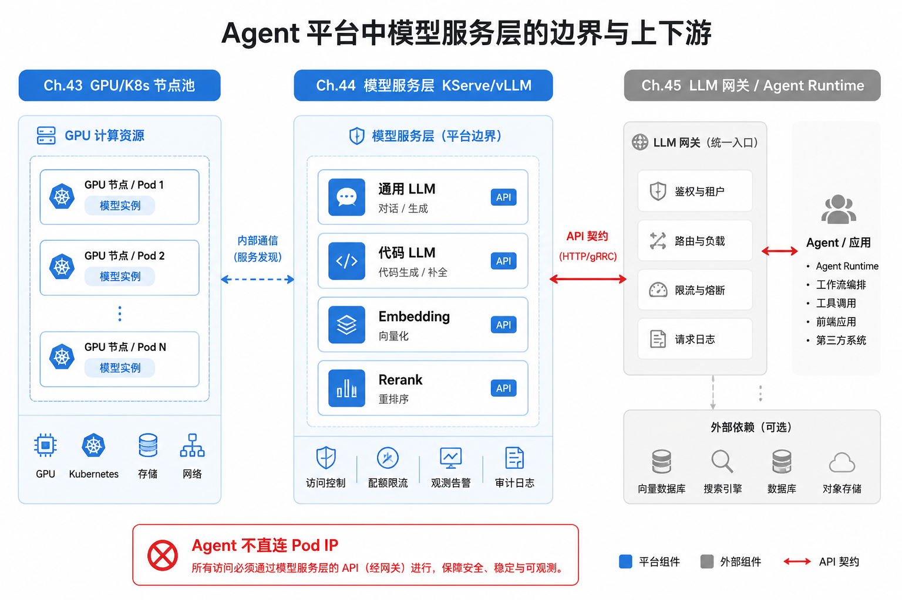
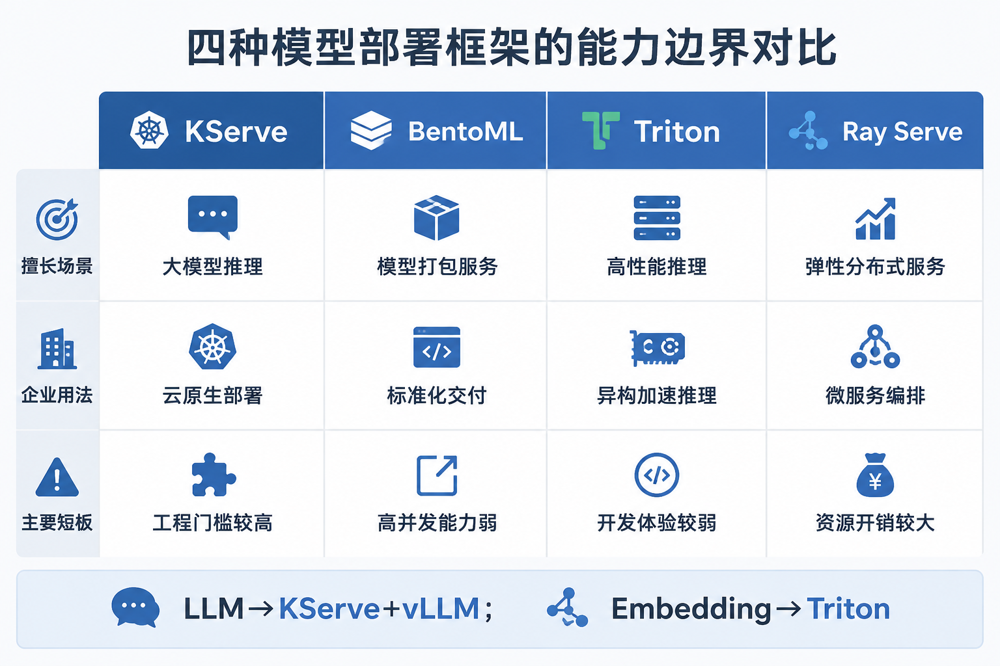
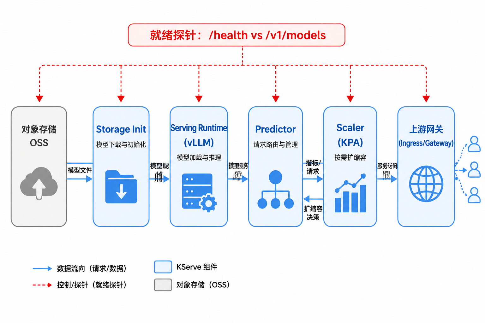
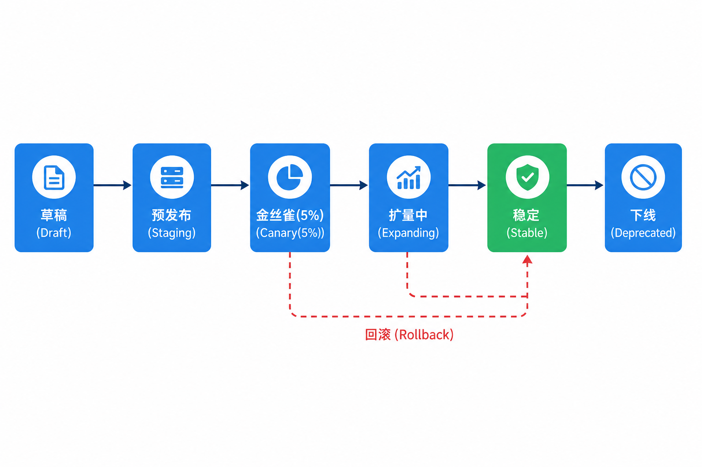

# 第44章 模型部署

---

模型服务层需要独立于业务 Agent，因为模型升级、权重切换、灰度回滚有自己的节奏，不能和应用发布耦合在一起。模型部署链路要覆盖镜像、权重、服务配置、滚动升级、灰度、回滚和多环境发布。模型从打包到发布，需要先选清部署框架，再用滚动升级、灰度和回滚避免中断正在运行的任务。某次 NL2SQL 批量任务突然失败。排查发现，Agent Runtime 直连了 vLLM Pod 的内网 IP；HPA 缩容后重建 Pod，IP 变化，Runtime 配置却没有更新。模型能力没有退化，GPU 也没有故障，问题出在业务代码越过了模型服务边界。模型服务层要把权重、镜像、GPU 节点、就绪探针、灰度和回滚收敛成稳定 API。Runtime 不应知道推理进程在哪个节点，也不应关心底层权重路径和容器 digest。

模型部署要把模型服务变成稳定、可升级、可回滚的生产接口，单机把权重跑起来只是能力验证。进入企业平台后，还要处理镜像、权重、GPU 节点、就绪探针、流式连接、灰度切流和多环境晋升。业务 Agent 不应该感知这些细节。模型服务层一旦缺失，故障会表现得很混乱。Runtime 直连 Pod IP，HPA 重建后地址变化；模型版本升级改变输出格式，所有 Agent 同时受影响；Embedding 服务和长上下文 LLM 混在同一 GPU 上，P99 延迟突然升高。模型本身可能没有问题，问题出在部署单元没有成为稳定 API。企业模型发布要把权重、Runtime 镜像和关键参数当作不可变版本。一次发布应产生可识别的 Revision，并经过探针、评测、灰度和回滚门禁；改一行 YAML 只是配置变更，不等于模型发布。这样第45章的网关才能按服务名路由，而非把底层推理进程暴露给业务应用。

## 44.1 Agent 平台的独立模型服务层

第6章 讲如何在单机上把 vLLM、SGLang 跑起来；第43章 讲如何分配 GPU、划分 `gpu-inference` 节点池。但“有卡能跑”与“生产可调、可发、可回滚”之间，还缺一层 模型服务层（Model Serving Layer）。这一层把推理引擎包装成稳定、可观测、可发布的 API 端点：向上为第45章 LLM 网关提供上游 target，向下消费 第43章 分配的 GPU 配额；Agent 平台只应知道“模型服务名 + 版本 + 契约”，不应知道权重文件在 OSS 的哪条路径、Runtime 容器用的是哪个 digest。运维人员在排查某次 NL2SQL 批量报错时发现，根因并非模型能力退化，而是 Agent Runtime 直连了 vLLM Pod 的内网 IP。第43章的 HPA 在缩容后重建 Pod，IP 变更，而 Runtime 配置未更新。此类故障说明一条硬规则：Agent Runtime 永远不应知道 Pod 在哪个节点、推理进程监听哪个 IP。从多事业部 Agent 平台的视角看，模型服务层的价值各不相同，但边界一致：

- 零售：促销高峰客服 Agent 依赖 `llm-general-32b`，需要金丝雀升级时不打断高并发流式会话；
- 制造：DataAgent 的 SQL 生成走 `llm-code-7b`，要求代码模型与通用模型独立发布，避免一次升级拖垮两条链路；
- 金融：合规要求敏感对话只走本地 `llm-general-32b`，服务层要能证明“某时段流量 100% 命中本地 Revision”；
- 物流：运单解析 Agent 在凌晨批跑 Embedding 重建，RAG 索引与 LLM 分服务扩缩，避免互相拖尾延迟。

企业 Agent 平台的模型服务清单（示意，与第43章 节点池、第45章 路由规则保持一致）：

*表44-1：mini-platform 各模型服务的引擎、用途与默认副本。来源：本书整理。*

| 服务名 | 引擎 | 用途 | 默认副本 |
|---|---|---|---|
| `llm-general-32b` | vLLM | 通用对话、Agent 规划 | 4 |
| `llm-code-7b` | SGLang | SQL/Python 生成 | 2 |
| `embed-bge-m3` | Triton | RAG Embedding | 2 |
| `rerank-bge-v2` | Triton | 检索重排 | 1 |

表 44-1 列的是发布单元，不是模型目录。每个服务名对应独立的 InferenceService、独立的 Canary 策略、独立的 SLO 与 FinOps 分摊标签。第45章网关里的 `model` 字段最终映射到这些服务名，不能直接指向某个 vLLM 进程的 URL。



*图44-1：模型服务层是 GPU 算力与 Agent 调用之间的稳定 API 边界。来源：本书自绘。Alt text：中间模型服务层向下对接 GPU 资源、向上为 Agent 提供稳定 API，箭头表示底层算力或模型变化被服务层屏蔽、不影响上层调用。*

图 44-1 的边界要点：第44章 管“模型怎么跑、怎么发版”，不管“请求怎么路由、怎么限流”（第45章），也不管“卡怎么分”（第43章）。读者应把中间层理解为 算力之上的第一个稳定 API：第43章 保证“1 张 A100 在 60 秒内绑定到推理 Pod”，第44章 保证“该 Pod 就绪后对外只暴露 `/v1/chat/completions` 与明确的 `/ready` 语义”，第45章 再在此之上叠加租户、配额与合规路由。

### 44.1.1 模型服务形态：在线推理、批推理、Embedding 服务与多模型并存

多模型并存是 Agent 平台的常态。若将通用对话、SQL 生成、Embedding 混在同一推理进程，常见后果是：Embedding 的高 QPS 小 batch 与 LLM 的长上下文生成争抢同一块 KV Cache 与 CUDA Stream，P99 延迟上升明显。问题往往不在 GPU 总量不足，而在服务形态未分离。

*表44-2：在线、批、Embedding 等模型服务形态的特征与发布策略。来源：本书整理。*

| 形态 | 特征 | 典型场景 | 发布策略 |
|---|---|---|---|
| 在线推理 | 低延迟、流式、长连接 | 客服 Agent、DataAgent 对话 | 金丝雀 + 快速回滚 |
| 批推理 | 高吞吐、异步、可排队 | 评测集批跑、离线报告 | 蓝绿或滚动 |
| Embedding | 固定输入维度、高 QPS | RAG 索引重建 | 双版本并行后切流 |
| 多模型路由前置 | 网关层选模型（第45章） | 成本/合规路由 | 服务端独立发布 |

在线推理承载 Agent Runtime 的实时对话。流式连接常维持数分钟，发布时要考虑 `terminationGracePeriodSeconds` 与第45章 网关的超时对齐。否则 Canary 切流时用户会看到半句截断。批推理走 Volcano 队列（第43章 `gpu-batch`），月末评测集批跑允许排队，但不应与在线推理混池 OOM。Embedding 输出维度固定，一旦权重版本与索引不一致，检索会“静默失败”，比 503 更危险。多模型路由发生在第45章，但每个 backend 仍应是第44章 里独立可发布的 InferenceService；金融事业部要求敏感数据只走本地 `llm-general-32b`，零售促销可走云端备用。这是网关路由策略，不是把云端 URL 写进同一个 Deployment。这里先统一几个概念。模型服务是对外暴露稳定 API 的推理部署单元，不等同于裸 vLLM 进程；Serving Runtime 是执行推理的容器镜像和启动参数，不等同于训练 Job；Predictor 是 KServe 中接收流量并调用 Runtime 的组件，不应和 Kubernetes Deployment 名字混用；模型版本则是权重、Runtime 镜像和关键启动参数的可发布组合，不等同于 Git 代码版本。Serving Runtime 定义模型怎么跑：vLLM OpenAI Server 模式、tensor parallel 大小、量化格式。Predictor 定义模型怎么接流量：HTTP/gRPC、就绪探针、与 KServe 流量分割的集成。模型版本则是不可变发布物：`qwen2.5-32b-awq` 权重 digest + Runtime 镜像 tag + `max_model_len` 等参数的组合。Git 里改一行 YAML 不等于新版本，直到 InferenceService 产生新 Revision 并通过 Canary 门禁。

### 44.1.2 模型服务化前的三个架构判断

#### Docker Compose 只适合本地开发

本地开发用 Compose 正确。工程师在笔记本上单卡起 vLLM，迭代 prompt 与 Agent 逻辑，这与生产并不矛盾。但生产需要就绪探针、滚动升级、自动扩缩、流量分割、指标采集，Compose 不提供这些。常见失败模式是：Compose 与 K8s 配置漂移，导致“本地能跑、上线 OOM”。本地 `--gpu-memory-utilization 0.9` 在 K8s 里未声明 memory limit，Sidecar 与 tokenizer 线程把节点打满；本地单用户无并发，生产 32B 长上下文叠加 KV Cache 在高峰 OOM。Compose 是开发加速器，不是发布系统；第46章 GitOps 交付的对象应是 KServe InferenceService，而非 docker-compose.yml。

#### A/B 测试需要请求级一致性

模型 A/B 需要 请求级一致性（同一用户/session 应命中同一版本，否则对话风格跳变）、指标对齐（延迟、错误率、业务 KPI 如同一批查询集）和 安全回滚（5% Canary 异常时一键回到旧 Revision）。简单随机 50% 会在评测时混淆版本效果：同一 session 内混版本，用户感知“时好时坏”。正确做法：网关或 Serving 层按 `session_id` 粘性路由，且离线 gate（第39章）通过后再进 Canary。

#### Embedding 与 LLM 应独立服务化

Embedding 与生成式 LLM 的资源画像、批大小、延迟分布不同。Embedding 偏固定长度、高 QPS、小 batch；LLM 偏变长输出、流式、KV Cache 敏感。混部会导致 LLM 尾延迟恶化。GPU 利用率图表可能仍“好看”，但 P99 TTFT（Time To First Token，首 token 时间）失控。生产实践中，Embedding 与 LLM 应拆成独立 InferenceService（如 `embed-bge-m3` 与 `llm-general-32b`），独立 HPA 与独立 OSS 版本目录。

---

## 44.2 部署框架对比：KServe、BentoML、Triton Inference Server 与 Ray Serve

模型部署框架选型回答的是：谁负责 K8s 集成、谁负责多模型同进程、谁负责 Python 原生编排。没有“唯一正确答案”，只有与负载类型、团队运维能力的匹配。

*表44-3：KServe、BentoML、Triton 等部署框架的适用与不适用场景。来源：本书整理。*

| 类型 | 代表 | 为什么用 | 不适合什么 | 替代 |
|---|---|---|---|---|
| K8s 原生 Serving | KServe | InferenceService CRD、流量分割、自动扩缩、OpenAI 兼容 | 非 K8s 环境 | BentoML + 自建网关 |
| 模型打包 | BentoML | 多框架打包、本地到生产一致 | 复杂多模型流量治理 | KServe、Seldon |
| 高性能推理 | Triton | Embedding、多模型同进程、动态批处理 | 快速原型 | vLLM 直连 |
| 分布式编排 | Ray Serve | Python 原生、与 Ray 生态集成 | 运维团队无 Ray 经验 | KServe + 独立 Deployment |

KServe 的价值在于与第43章的 K8s 体系一体：InferenceService 声明 `canaryTrafficPercent`，与 GPU 节点亲和、HPA/KPA 同域运维。BentoML 适合“一个数据科学家打包、一处运行”的实验到生产路径，但 LLM 流量治理、多 Revision 回滚仍希望留在 KServe CRD 层。Triton 在 Embedding/Rerank 上动态 batch 成熟，同一进程加载多个小模型比起 N 个 vLLM Pod 更省显存。Ray Serve 保留为 DataAgent 重批分析可选路径。与 Ray 训练 Job 共享集群时减少数据搬运，但平台 SRE 默认 Runbook 仍以 KServe 为主。



*图44-2：部署框架按负载类型选型，而非单一框架包打天下。来源：本书自绘。Alt text：在线推理、批推理、多模型并存等负载分别连向更合适的框架（KServe、BentoML、Triton），体现按负载选型而非一刀切。*

图 44-2 的读法：横向对比的是“能力边界”，不是 benchmark 排名。LLM 主路径选 KServe，是因为第44章 与第46章 需要 Canary、Revision 保留、GitOps 声明式发布在同一套 CRD 上完成；Embedding 选 Triton，是因为负载特征与 LLM 不同，强行统一框架只会增加运维复杂度。

本书推荐选型：LLM 在线推理用 KServe + vLLM/SGLang Runtime；Embedding/Rerank 用 Triton；DataAgent 重批分析保留 Ray Serve 可选路径。第45章 LiteLLM 网关的 `api_base` 统一指向 KServe Service 名，而非框架特定的端口。

#### 框架选型与事业部负载的映射

把框架决策落到四条典型业务线，可以避免“全集团统一框架 KPI”的形式主义：

- 零售：`llm-general-32b` 流式 QPS 高，KServe + vLLM 的 KPA 与 Canary 是高峰运维手册的核心；Triton 不参与对话链路。
- 制造：`llm-code-7b` 对 TTFT 更敏感，SGLang Runtime 独立 InferenceService，与通用模型分开发版；DataAgent 重批分析可选 Ray Serve，与第43章 `gpu-batch` 队列共用节点池。
- 金融：本地 `llm-general-32b` 的 Revision 审计要可追溯；KServe 的 `status.traffic` 字段是合规证明“无云端 backend”的证据链之一（与第45章 路由互补）。
- 物流：`embed-bge-m3` nightly 重建索引，Triton 动态 batch 提升吞吐；Rerank 单副本即可，但 OSS 版本要与索引任务同 PR 晋升（第46章）。

框架迁移成本也应纳入选型：从裸 Deployment 迁到 KServe，主要工作是把流量分割、探针、OSS URI 写进 InferenceService，不是更换推理引擎本身。Part II 已统一 vLLM/SGLang，第44章处理的是服务化封装。

### 44.2.1 模型服务架构：Serving Runtime、Predictor、Scaler 与存储卷协作

一次 `llm-general-32b` 的 Pod 启动，在 KServe 语义下是条流水线：对象存储上的权重 → Init 或 Runtime 拉取 → CUDA 加载 → Predictor 接流量 → Scaler 读指标扩缩。任何一步的“假就绪”都会在第45章 网关层放大为 502/503 风暴。KServe InferenceService 的核心组件：

*表44-4：Serving Runtime、Predictor 等组件的职责、输入输出与失败模式。来源：本书整理。*

| 组件 | 职责 | 输入 | 输出 | 失败模式 |
|---|---|---|---|---|
| Serving Runtime | 加载模型、执行推理 | 模型 URI、启动参数 | 推理 API | 模型下载失败、CUDA 不匹配 |
| Predictor | 接收 HTTP/gRPC 请求 | 请求体、Header | 响应流 | Runtime 未就绪仍接流量 |
| Transformer（可选） | 前后处理 | 原始输入 | Runtime 输入格式 | 预处理超时 |
| Scaler | 按 QPS/并发扩缩副本 | Metrics | HPA/KPA 动作 | 冷启动期间误扩容 |
| Storage Init | 从对象存储拉取权重 | S3/OSS URI | 本地卷 | 网络中断、权限拒绝 |

模型权重通常挂载自对象存储（如 OSS 内网桶 `models/` 前缀），Pod 启动时 Init Container 或 Runtime 自身拉取。32B AWQ 权重约 18GB，内网拉取常需 3-6 分钟；70B+ 冷启动可能 5-15 分钟。就绪探针要区分“进程活着”与“能接推理”。`/health` 只说明 Python 进程在监听端口；`/ready`（或 vLLM 的 `/v1/models` 返回目标 model id）才说明权重已加载、KV Cache allocator 已初始化。Scaler 与第43章的节点池容量要联调：KPA 在 TTFT 飙升时扩 Pod，若 `gpu-inference` 池无空闲节点，新 Pod 长期 Pending，Canary 会误判“新版本错误率低”，因为它根本没接到流量。Runbook 中应要求：Canary 前检查 Cluster Autoscaler 余量，且 `minReplicas` 在业务高峰窗口禁止缩到 0。



*图44-3：权重加载、Runtime 就绪与流量接入是三个不同控制点。来源：本书自绘。Alt text：部署流程上标出三个独立门控。权重加载完成、Runtime 健康就绪、流量正式接入，箭头表示前一步通过才进入下一步，避免未就绪即接流量。*

图 44-3 强调三个控制点彼此独立：拉取完成、加载完成、应接流量是三个不同状态。某次上线中，readiness 探针配置在 `/health`，导致 OSS 断连重试期间 Pod 已进 Service Endpoints，DataAgent 批量请求打到半加载实例，错误率上升明显，而 GPU 监控仍显示“利用率正常”。因为失败发生在加载阶段，尚未进入推理。

### 44.2.2 版本管理与发布策略：A/B 测试、金丝雀、蓝绿与回滚契约

模型发布不同于应用发布：镜像变了但权重 URI 不变、或权重变了但 Runtime 参数不变，都可能改变 token 分布与延迟画像。发布策略应与 状态机 绑定，避免“工程师 kubectl patch 一下就算上线”。

*表44-5：A/B、金丝雀、蓝绿等发布策略的机制、优势与代价。来源：本书整理。*

| 策略 | 机制 | 优势 | 代价 | 适用 |
|---|---|---|---|---|
| 滚动发布 | 逐 Pod 替换 | 简单 | 短暂混合版本 | Embedding、低-risk 模型 |
| 金丝雀 | 5%→20%→100% 流量 | 风险可控 | 需要流量分割与指标 | LLM 主模型 |
| 蓝绿 | 两套完整栈切换 | 回滚快 | 双倍 GPU 成本 | 大版本升级窗口 |
| A/B | 长期两版本并行 | 业务 KPI 对比 | 治理复杂 | 模型效果实验 |

`llm-general-32b` 主模型走金丝雀；`embed-bge-m3` 走双版本并行。新版本与旧版本各 50% 跑 24 小时，索引重建任务验证维度一致后再 100% 切流。金融事业部禁止未过 Staging 离线评测（第39章）的 Revision 进入 Canary。发布状态机：

*表44-6：版本管理与发布策略：A/B 测试、金丝雀、蓝绿与回滚契约的状态说明。来源：本书整理。*

| 状态 | 进入条件 | 下一状态 | 失败处理 |
|---|---|---|---|
| Draft | 镜像构建完成 | Staging | 测试不通过则废弃 |
| Staging | 通过离线评测（第39章） | Canary | 指标不达标则阻断 |
| Canary | 5% 流量 | Expanding / Rollback | 错误率↑则自动 Rollback |
| Expanding | 20%→50%→100% | Stable | 人工审批门禁 |
| Stable | 全量且无告警 | Deprecated | 保留 N 版供回滚 |
| Rollback | 触发条件满足 | Stable（旧版） | 记录事故复盘 |

Rollback 应是 Revision 级一键操作：KServe 保留上一 Stable Revision 7 天，`canaryTrafficPercent: 0` 且 pin 旧 `storageUri` / 镜像 digest，而非重新 helm install。某次 Canary 20% 阶段触发 TTFT SLO 告警，平台在数分钟内回滚，因为 ArgoCD Application（第46章）与 InferenceService 的 Revision History 已对齐审计字段。发布评审会上，架构师常问三个问题。谁批准、离线 gate 证据、回滚耗时。状态机把答案结构化，避免“会上说能回滚、现场找不到旧 Revision”。图 44-4 将发布绑定为状态机：Draft→Staging→Canary→Expanding→Stable→Deprecated；Rollback 从 Canary/Expanding 一键回到旧 Stable Revision，避免跳过离线 gate 直接全量切换。



*图44-4：金丝雀发布把“全量切换”拆成可观测、可回滚的多个门禁。来源：本书自绘。Alt text：流量从 1%、5%、25% 到 100% 分阶段放量，每阶段设观测与回滚门禁，箭头表示指标达标才进入下一档，异常即回滚。*

#### KServe 原生 Canary 与服务网格

默认采用 KServe 内置流量分割即可。它把流量百分比与 Revision 放在同一类 InferenceService 配置中，GitOps diff 可读，回滚路径也更直接。Istio/Envoy 权重路由适合已经全站 Mesh 的团队，用来做跨 Namespace、跨集群或更复杂的灰度策略；但多数 LLM Serving 场景只需要 5/20/50/100 四档放量。为模型服务额外引入 Mesh，会带来 sidecar 延迟、mTLS 调试和网关排障成本，只有在组织已经具备相关运维能力时才值得采用。

#### 权重随镜像发布还是启动时拉取

大模型权重通常不应 baked-in 到镜像里。32B 权重一旦进入镜像，镜像体积很容易超过 20GB，节点拉取镜像的时间会抵消“启动更快”的优势，也会让镜像构建、漏洞扫描和回滚变慢。LLM 主路径更适合“启动拉取 + 不可变 OSS 版本目录”：镜像表达 Runtime，权重 URI 表达模型版本，二者在发布记录中同时留痕。7B 以下的小模型或 Embedding 服务可以在 dev 环境选择 baked-in，以换取更快迭代；生产环境仍要看镜像仓库、节点缓存和回滚窗口是否承受得住。高峰前可配合第43章节点预暖，提前 scale `minReplicas`，让拉取与加载在流量高峰前完成。

### 44.2.3 推理服务接口：OpenAI 兼容、就绪探针与优雅下线

Agent 平台与 Runtime 团队之间的契约应稳定为 OpenAI 兼容子集。第45章 网关据此做 backend 抽象，Runtime 据此写死解析逻辑，Observability（第38章）据此统一 token 计量。契约变更应走版本化评审，而非某个 vLLM 小版本 silently 改字段。
```text
GET  /v1/models
GET  /health          # 进程存活
GET  /ready           # 模型已加载，可接推理（建议自定义）
POST /v1/chat/completions
  Request:  { model, messages, stream, max_tokens, ... }
  Response: { id, choices, usage, ... } 或 SSE 流
  Errors:   { error: { code, message, type }, retryable: bool }
```

`/v1/models` 返回的 `id` 要与第45章 路由表中的 `model_name` 一致（如 `llm-general-32b`），否则网关会报 `502 BACKEND_UNAVAILABLE` 而 Runtime 侧难以定位。`retryable` 区分可退避错误（上游过载）与不可重试错误（context length exceeded）。探针配置示例：
```yaml
# 示例：区分 liveness 与 readiness
livenessProbe:
  httpGet:
    path: /health
    port: 8000
  initialDelaySeconds: 30
readinessProbe:
  httpGet:
    path: /ready      # vLLM 加载完成后才返回 200
    port: 8000
  initialDelaySeconds: 120
  periodSeconds: 10
```

优雅下线：收到 SIGTERM 后停止接受新连接、等待 in-flight 请求完成（`terminationGracePeriodSeconds` 建议 LLM ≥ 120s），再卸载模型。流式连接若在 grace 内未结束，K8s 会 SIGKILL。某生产环境中曾出现大量 499，根因 grace 60s 而 P99 流式时长 90s。PreStop Hook 可配合从 Service Endpoints 摘流，再 sleep 30s，给 第45章 网关连接池时间更新。

### 44.2.4 与推理引擎的衔接：vLLM、SGLang、TGI 的容器化与资源画像

第6章介绍引擎特性；第44章关心容器化后资源声明是否与真实画像一致。CPU 和内存请求低估、GPU 余量高估，都可能让模型服务在高峰期失稳。

*表44-7：vLLM、SGLang、TGI 容器化的 GPU 声明与典型环境变量。来源：本书整理。*

| 引擎 | 容器化要点 | GPU 声明 | 典型 env |
|---|---|---|---|
| vLLM | OpenAI server 模式 | 1-8 卡（TP/PP） | `VLLM_TENSOR_PARALLEL_SIZE` |
| SGLang | 低延迟、RadixAttention | 1-4 卡 | `SGLANG_MEM_FRACTION_STATIC` |
| TGI | HuggingFace 生态 | 1-2 卡 | `MODEL_ID`, `NUM_SHARD` |

`llm-general-32b` 用 vLLM，AWQ 量化约需 24GB 显存 + 20% KV Cache 余量；未留余量会在长上下文场景 OOM。32k context 评测曾触发此类问题。`llm-code-7b` 用 SGLang，SQL 生成延迟敏感，RadixAttention 对重复 schema prefix 友好，但 `SGLANG_MEM_FRACTION_STATIC` 过高会与同节点 DaemonSet 争显存。CPU 与 memory 请求常被低估：tokenizer、调度线程、OpenAI API 解析各需 headroom；32B 服务通常声明 `cpu: 8, memory: 32Gi` requests，limits 略高于 requests 以避免 OOMKill 误杀。容器化还需对齐 第43章 节点标签：`nodepool=gpu-inference`、`nvidia.com/gpu.product` 与驱动版本。CUDA 12.x 镜像跑在 11.x 节点池会 CrashLoop，且错误信息埋在 Runtime 日志深处。

#### 资源画像写入 Runbook 的示例

`llm-general-32b`（vLLM + AWQ + TP=1）Runbook 摘要：

*表44-8：写入 Runbook 的资源画像各维度请求值、限制值与说明示例。来源：本书整理。*

| 维度 | 请求值 | 限制值 | 说明 |
|---|---|---|---|
| `nvidia.com/gpu` | 1 | 1 | 绑定 `gpu-inference` 整卡 |
| CPU | 8 | 12 | tokenizer 与调度线程 |
| Memory | 32Gi | 48Gi | 避免 host OOM 连带 GPU 重置 |
| 显存预算 | 按模型测算 | ~24GB 权重 + 20% KV | 超长 context 单独服务 |
| 冷启动 | 不适用 | 8-12 min | readiness initialDelay ≥ 120s |

`llm-code-7b`（SGLang）在 NL2SQL 尖峰时 CPU 占用高于通用对话。schema prefix 长、RadixAttention 树重组频繁，Runbook 单独列出 P99 < 400ms 的压测 gate。Embedding Triton 实例 CPU 请求可更低，但 host  memory 需容纳 batch padding 与多模型并存。

#### 与第45章 网关的 upstream 对齐

第44章 交付完成后，第45章 LiteLLM 的 `api_base` 应只填 KServe 集群 DNS 名（如 `http://llm-general-32b.model-serving.svc:8000/v1`），不在网关层写 Pod IP 或 NodePort。InferenceService 的 `status.url` 与 `status.components` 是运维验收字段；网关 health check 应探测 `/ready` 聚合状态，而非单个 Pod。避免 Canary 期间旧 Pod 已摘流、新 Pod 未 Ready 时的误报。

### 44.2.5 跨章节事故定位速查

模型部署故障要按发布链路定位，不能先重启 Runtime。冷启动超时、模型 URI 404、CUDA/驱动不匹配、Canary 样本不足和流式连接截断，表面上都可能表现为 502 或 503，但修复动作完全不同。第38章的 Trace 能说明请求在哪一层失败，第44章的发布记录和 Revision 才能说明当时跑的是哪个权重、哪个镜像、哪个探针配置。

*表44-9：冷启动、加载失败、版本不一致等部署失败的检测与恢复。来源：本书整理。*

| 失败模式 | 触发条件 | 影响 | 检测方式 | 恢复策略 |
|---|---|---|---|---|
| 冷启动超时 | 大模型拉取 + 加载 > readiness 阈值 | 新版本永远不进流量 | Pod Ready=False 时长 | 调大 initialDelay、预拉镜像/权重 |
| 模型 URI 404 | OSS 路径错误或权限 | Pod CrashLoop | Init 日志 | 固定 URI 规范 + IAM 对账 |
| CUDA/驱动不匹配 | 节点池版本漂移（第43章） | Runtime 启动失败 | 节点标签 audit | 节点池标准化 |
| 金丝雀指标误判 | 5% 流量样本不足 | 错误全量 | 最小样本量门禁 | 延长 Canary 窗口、强制离线 gate |
| 流式连接被截断 | grace period 过短 | 用户体验中断 | 499/502 spike | 增大 terminationGracePeriod |

失败模式应写入 On-call Runbook，并与第38章 告警规则一一对应。冷启动超时在日志里像“部署慢”，在业务侧像“新版本永远不上线”。Canary 20% 阶段若只观察 error rate 而不看 Ready 时长，会错过“新版本根本没 Ready”的假象（流量 100% 仍在旧 Revision）。

#### 跨章节事故定位速查

*表44-10：按用户现象跨网关、部署、调度三层定位问题。来源：本书整理。*

| 用户现象 | 先查 第45章 | 再查 第44章 | 再查 第43章 |
|---|---|---|---|
| 全 tenant 502 | 网关/backend 健康 | InferenceService Ready | GPU 节点 Pending |
| 仅 finance 403 | 白名单/合规路由 | 不涉及 | 不涉及 |
| 仅 mfg SQL 慢 | `llm-code-7b` 路由 | SGLang TTFT | 代码池 GPU 排队 |
| 促销夜 retail 429 | 配额/限流 | 32B 队列 | inference 池容量 |
| Embedding 检索空 | 不涉及 | embed 版本/维度 | batch 池占用 |

定界顺序避免“一上来就重启 vLLM”。502 可能是网关 fallback 死循环（第45章），而非 GPU 故障。

---

## 44.3 从本地验证到 KServe 发布

工程路径分三阶：本地 Compose 验证契约，staging InferenceService 对齐探针与 OSS，prod Canary 与 GitOps（第46章）。跳过 staging 直接 prod，最容易复现“本地能 curl、上线 503”。这三阶解决的问题并不相同。本地 Compose 只证明 Runtime 参数、模型名、OpenAI 兼容字段和 Agent SDK 可以对上；它不证明 K8s 探针正确，也不证明权重拉取、节点亲和、Canary 或回滚能工作。staging 要尽量使用与 prod 相同的权重、镜像和启动参数，只缩小副本数和流量规模。prod 则关注发布节奏、流量比例和线上指标，不应该第一次发现冷启动、OSS 权限或 CUDA 兼容性问题。

模型部署的一个常见坏味道，是把“模型能启动”当成“服务可发布”。大模型启动成功以后，还要经过权重加载、KV Cache 初始化、tokenizer 就绪、`/v1/models` 返回正确名称、网关健康检查命中聚合 `/ready` 等步骤。只要其中一步与网关或监控契约不一致，业务侧看到的就是 502、503 或流式中断。发布流程应把这些条件拆成可观察的门禁，而非依赖工程师在命令行里看日志。

另一个容易被忽略的点是回滚演练。模型服务回滚不是把 Git revert 合进去就结束，因为旧模型权重、旧镜像、旧 Secret 和旧 Revision 都要还能访问。如果对象存储生命周期策略已经清掉旧权重，或者 ArgoCD 只保留了当前 tag，回滚按钮在事故时就没有意义。季度演练不只测 KServe patch，也要测旧权重是否可拉取、旧 Revision 是否 Ready、网关是否能重新发现旧 backend。

#### 本地开发（Docker Compose 示例）

工程师在笔记本或 dev GPU 工作站上用 Compose 验证 `served-model-name`、OpenAI 字段与 Agent SDK 兼容性。不涉及 KServe CRD，但 `curl /v1/models` 的响应格式必须与生产一致。
```yaml
# 示例：本地 vLLM 单卡服务
services:
  vllm-general:
    image: vllm/vllm-openai:latest
    command: >
      --model /models/qwen2.5-32b-awq
      --served-model-name llm-general-32b
      --tensor-parallel-size 1
    ports:
      - "8000:8000"
    deploy:
      resources:
        reservations:
          devices:
            - driver: nvidia
              count: 1
              capabilities: [gpu]
    volumes:
      - ./models:/models:ro
```

本地验证通过后，不应把 compose 文件直接“翻译”成 Deployment。缺少 readiness 语义、Canary、与 OSS 拉取。应进入 KServe 清单。

#### 生产 KServe InferenceService 示例

下面这份清单特意和第43章的 `gpu-inference` 节点池、第45章 LiteLLM 的 `api_base` 命名保持一致。这里的 `metadata.name` 也是网关侧做 backend 服务发现时直接使用的名字。
```yaml
# 示例：KServe + vLLM 推理服务
apiVersion: serving.kserve.io/v1beta1
kind: InferenceService
metadata:
  name: llm-general-32b
  namespace: model-serving
spec:
  predictor:
    minReplicas: 2
    maxReplicas: 8
    scaleTarget: 30          # 并发目标（示意）
    model:
      modelFormat:
        name: vllm
      storageUri: oss://agent-platform-models/llm/qwen2.5-32b-awq/
      resources:
        limits:
          nvidia.com/gpu: "1"
    affinity:
      nodeAffinity:
        requiredDuringSchedulingIgnoredDuringExecution:
          nodeSelectorTerms:
            - matchExpressions:
                - key: nodepool
                  operator: In
                  values: ["gpu-inference"]
  canaryTrafficPercent: 5    # 金丝雀 5%
```

`storageUri` 要指向含版本号的路径（如 `.../v20260301/`），而非 `latest/`。见失败模式 3。`canaryTrafficPercent: 5` 仅在新 Revision Ready 后生效；工程师应 habit `kubectl get isvc -w` 观察 Conditions。

#### 金丝雀升级流程（示意命令）
```bash
# 1. 更新 storageUri 或 Runtime 镜像到新版本
kubectl apply -f inference-service-v2.yaml

# 2. 观察 Canary 指标（错误率、P99 延迟、Token 吞吐）
kubectl get inferenceservice llm-general-32b -n model-serving

# 3. 逐步调高 canaryTrafficPercent：5 → 20 → 50 → 100
# 4. 异常则 kubectl patch 回滚 canaryTrafficPercent: 0 并固定旧 Revision
```

验证清单：本地 `curl http://localhost:8000/v1/models` 返回 `llm-general-32b`；staging `kubectl wait --for=condition=Ready inferenceservice/llm-general-32b -n model-serving --timeout=900s`（大模型需长超时）；prod 在调高 Canary 前确认 第38章 面板上旧 Revision 的 TTFT P99 基线。金融 tenant 的 Canary 应单独观察合规审计日志，确认无流量误打到未审批 Revision。Canary 的观察窗口要覆盖真实请求分布。5% 流量如果只打到短问题，无法暴露长上下文 OOM；如果只打到低峰时段，也无法暴露高并发下的 KV Cache 压力。发布前应把离线评测集、压测样本和线上 Canary 组合起来：离线评测看质量，压测看资源画像，线上 Canary 看真实路由、真实租户和真实流式连接。三者缺一项，发布结论都容易偏。

模型版本和索引版本也要同步管理。Embedding 服务升级后，如果 RAG 索引仍由旧 embedding 生成，检索质量可能静默下降；代码模型升级后，如果 NL2SQL 的评测样本没有重新跑，SQL 生成错误会在业务查询中暴露。模型部署不能只看推理容器，它还牵涉到依赖它的索引、评测、网关路由和业务配置。第46章的 GitOps 应把这些关联放进同一轮 Promotion，避免各团队凭记忆同步。

#### Staging 与 Prod 的环境差异（与第46章 对齐）

Staging 与 Prod 的差异还涉及副本数。Staging 可以缩副本，但权重 digest、Runtime 参数、readiness 探针、网关路径和节点规格应尽量贴近生产；Prod 则必须使用不可变权重目录、完整 Canary 阶段、`gpu-inference` 全量节点池和第45章网关。工程师常犯的错误，是在 staging 用 7B 权重验证通过，prod 切 32B 后才第一次暴露冷启动、显存和探针 timeout 问题。更稳的方式是在 staging 使用同权重、缩副本验证发布流水线，把“大模型特有问题”提前暴露，而非在 prod 做第一次大模型 Canary。

#### `llm-code-7b` 并行走通（制造 DataAgent）

制造 NL2SQL 链路建议单独 InferenceService，与通用模型并行发布：
```yaml
# 示例：SGLang 代码模型（片段）
apiVersion: serving.kserve.io/v1beta1
kind: InferenceService
metadata:
  name: llm-code-7b
  namespace: model-serving
spec:
  predictor:
    minReplicas: 2
    maxReplicas: 4
    model:
      modelFormat:
        name: sglang
      storageUri: oss://agent-platform-models/llm/qwen2.5-coder-7b/v20260301/
      resources:
        limits:
          nvidia.com/gpu: "1"
```

第45章 通过 `X-Task-Type: nl2sql` 路由到此服务；Canary 策略可与 `llm-general-32b` 不同步。代码模型升级频率高，但离线 SQL 准确率 gate（第39章）要先过。

### 44.3.1 半启动、OOM 与版本串扰先查哪里

#### readiness 探针过短导致“半启动”接流量

- 现象：32B 模型加载需 8 分钟，Pod 在 2 分钟被标记 Ready，网关转发请求返回 503。
- 根因：`readinessProbe.initialDelaySeconds: 30` 且 `/health` 不反映模型加载状态；vLLM 进程已监听但权重未加载完。
- 修复：改用 `/ready` 或 `/v1/models` 端点；initialDelay 120s+；KServe `minReplicas` 预热期间禁止缩到 0；Staging 环境用与 prod 相同探针配置，避免“staging 探针松、prod 探针紧”的配置漂移。

#### Canary 5% 流量通过但全量后 OOM

- 现象：Canary 阶段指标正常，扩到 50% 后多节点同时 OOM。
- 根因：Canary 只命中部分节点，未暴露 KV Cache 长上下文压力；5% 流量中长 context 样本不足。
- 修复：Canary 前强制离线长上下文压测（第39章）；生产限制 `max_model_len`；分池部署长/短上下文模型（或独立 `llm-general-32b-long` 服务）；FinOps 在 Canary 阶段预算双倍 GPU 成本，避免为省成本跳过 50% 门禁。

#### Embedding 与 LLM 共用 OSS 桶前缀且没有版本目录

- 现象：Embedding 服务重启后向量维度变化，RAG 检索静默失败；运单问答“能答但引用文档全错”。
- 根因：`storageUri` 指向 `embed/latest/`，被覆盖上传新模型；索引仍是旧维度。
- 修复：URI 含不可变版本号 `embed/bge-m3/v20260301/`；发布清单记录模型版本与索引重建任务联动；第45章 路由不变，但 RAG pipeline 要感知 embed 版本标签。

生产模型服务要把权限、审计、成本和回滚写进发布流程。模型桶 IAM 应默认只读，InferenceService 变更需要代码评审或变更审批；每次发布记录 Revision、权重 URI、镜像 digest、流量比例和操作人。Canary 期间会短暂保留两套模型副本，GPU 成本上升是正常代价，不应为了省一段窗口期的成本跳过灰度门禁。性能门禁要覆盖离线压测和线上观测。P99、TTFT、错误率、GPU 利用率、Ready 时长和流式连接中断都应进入第38章的可观测面板。`terminationGracePeriodSeconds` 不能随意沿用普通 Web 服务的默认值；LLM 流式会话更长，优雅下线时间应按实际 P99 流式时长设置。上一 Stable Revision 至少保留 7 天，回滚动作应明确把流量切回已验证 Revision，而非重新部署旧 YAML。

#### 季度 Rollback 演练（建议脚本）
```bash
# 示例：演练回滚到上一 KServe Revision（staging）
kubectl patch inferenceservice llm-general-32b -n model-serving \
  --type merge -p '{"spec":{"canaryTrafficPercent":0}}'
# 确认 traffic 100% 至 previous revision 后记录耗时，目标 < 5 min
```

一轮像样的演练，至少要覆盖三件事：第45章里的网关是否仍能解析 `/v1/models`，第38章的告警是否误报，以及 FinOps 是否把 Canary 期间的 GPU 小时重复计费。把这三类检查串起来，才能说明发布链路没有在“可用性之外”的位置悄悄失真。

---

## 44.4 模型服务上线后的运行证据

模型部署完成并不等于服务可用。上线后，平台要持续证明模型服务满足三个条件：请求能稳定进入正确 Revision，流式响应在用户可接受时间内返回，失败时能快速切回旧版本或备用服务。KServe、BentoML、Triton、vLLM 等工具提供部署能力，但运行证据仍要由平台自己组织。模型版本记录要足够细。权重 digest、Runtime 镜像、启动参数、量化方式、tensor parallel 配置、上下文长度、显存预算和网关路由都可能影响结果。若只记录模型名，后续无法解释同一 prompt 为什么在两个时间点行为不同。第45章的网关日志和本章的 Revision 信息应能对齐，证明某次 Run 实际命中了哪个后端。

发布策略要和业务风险匹配。Embedding 版本切换更关注索引兼容，LLM 主模型切换更关注答案质量和流式稳定性，代码模型切换还要关注 SQL/Python 的可执行率。把所有模型都按同一种滚动发布处理，会掩盖风险差异。生产门禁应包含离线评测、金丝雀指标、错误预算和人工确认。运行证据还要进入事故复盘。一次 502、流式截断或回答质量下降，可能来自 GPU 节点、模型 Runtime、网关路由、Prompt 变更或下游工具。只有把这些证据接入同一条 Trace，平台才能在分钟级判断该回滚模型、扩容节点，还是修复网关策略。模型服务上线后的证据包括镜像 digest、权重版本、启动参数、探针结果、灰度比例、流量命中和回滚记录。事故发生时，团队要能回答某个时段请求到底命中了哪个 Revision，而非只知道“模型升级过”。

不同服务形态要分开发布。在线对话、批推理、Embedding 和 rerank 的负载模式不同，混在一起会让资源管理和故障定位复杂化。服务拆分后，每个服务可以有自己的 SLO、扩缩容策略和灰度窗口。部署框架只是实现手段。KServe、BentoML、Triton 和 Ray Serve 适合的场景不同，选型要看团队已有 Kubernetes 能力、推理服务形态、模型数量和运维责任。最终目标是让上层 Agent 只依赖稳定契约。灰度发布要保护正在运行的流式会话。模型服务滚动升级时，已有连接可能持续数分钟，如果 Pod 过早终止，用户会看到半截回答。服务层需要设置优雅退出、就绪探针和连接排空，并与网关超时策略对齐。模型升级不是普通无状态服务升级。

权重存储和加载也会影响恢复。大模型权重体积大，冷启动时间长，节点重建后可能长时间不可用。平台应记录权重来源、校验和、预热状态和加载耗时，并为关键服务准备容量冗余。否则一次节点故障会变成长时间模型不可用。Embedding 和 rerank 服务的版本要与索引绑定。Embedding 模型升级后，旧索引向量空间可能不兼容；如果只升级服务不重建索引，检索质量会静默下降。部署流程应把模型版本、索引版本和切流顺序一起管理。模型服务还要提供可诊断错误。OOM、上下文超限、队列满、权重加载失败、tokenizer 不匹配，应返回不同错误码并进入指标。上层网关和 Runtime 才能判断是重试、降级、切换模型还是提示用户缩短输入。

多环境发布需要保持配置差异可见。开发、预发和生产的 GPU 型号、并发限制、模型参数和安全策略可能不同。若只在开发环境验证成功，生产仍可能因为资源和流量差异失败。发布材料要说明这些差异，而非默认环境完全一致。模型服务的容量规划要基于真实请求形态。平均 QPS 没有太大意义，长上下文、流式会话、批量评测和短问答对 GPU 的占用差异很大。平台应按 token 输入、token 输出、并发连接、KV Cache 占用和批处理队列观察容量。只有这样，扩容才不会只看请求数。服务预热是发布质量的一部分。新 Revision 通过就绪探针后，第一次请求仍可能因为权重加载、CUDA graph 初始化或缓存未命中而变慢。灰度前可以发送预热请求，确认延迟稳定，再切真实流量。预热结果也应进入发布记录。

回滚要考虑状态和缓存。在线 LLM 服务通常可以快速切回旧 Revision，但 Embedding、rerank 和批推理可能涉及索引、队列和中间结果。回滚计划要写明哪些服务能立即回滚，哪些需要重新构建数据，哪些任务要重新执行。没有计划，事故时会高估回滚速度。部署框架的运维责任也不同。KServe 与 Kubernetes 生态结合紧密，适合统一集群治理；BentoML 更强调模型服务打包和开发体验；Triton 适合多后端高性能推理；Ray Serve 适合复杂 Python 服务和分布式推理。选择框架时，要看团队能长期维护哪套运行方式。模型服务层还要给安全团队留接口。镜像扫描、权重来源校验、访问日志、网络策略和供应链签名，都属于发布材料。模型权重也是生产依赖，不能只因为它不是代码就跳过供应链检查。

多模型并存时，服务命名要稳定。业务应用和网关引用服务名，服务名背后可以切换 Revision、权重和引擎。若上层直接引用权重路径或 Pod 地址，模型部署层就失去了抽象价值。命名稳定，是后续灰度和回滚的前提。模型服务还要记录运行参数。temperature、max tokens、上下文长度、并发批处理、量化格式和 tensor parallel 配置都会影响质量和性能。模型权重相同，参数不同，行为也会不同。发布记录只写模型名称是不够的，必须把关键参数纳入版本。批推理服务需要单独的队列和重试策略。评测、离线报告和索引构建不应占用在线推理资源；失败后可以按任务重跑，而非像在线请求一样立即返回。批推理的吞吐优化和在线推理的低延迟优化不同，部署层要分开设计。

模型服务的观测要覆盖 GPU 和应用两层。GPU 利用率高不代表服务健康，可能是排队严重；GPU 利用率低也不代表资源浪费，可能是被上下文长度或网络瓶颈限制。TTFT、TPOT、排队时间、OOM、重启次数和请求分布要一起看。生产服务还要处理模型兼容窗口。新旧模型并行时，网关和评测系统要知道哪些请求命中新版本，哪些仍在旧版本。并行窗口结束后，旧版本何时下线、是否保留回滚能力，也要有明确时间。长期保留太多旧版本会增加成本和安全风险。部署自动化不能替代人工验收。高风险模型升级前，业务和平台仍要抽查典型任务，确认回答、结构化输出和工具调用没有明显退化。自动门禁负责覆盖常见问题，人工验收负责判断业务可接受性。

模型服务的安全隔离也要考虑租户。多个业务共享同一推理服务时，请求日志、缓存、批处理队列和错误信息都可能混杂。服务层需要按租户记录和隔离关键元数据，必要时为高敏租户提供独立服务实例。隔离设计会增加成本，但能降低合规风险。发布窗口要结合业务节奏。月末财务结算、促销高峰、客服高峰和监管报送期间，不适合做高风险模型升级。模型服务团队应和业务 Owner 约定冻结窗口和紧急变更流程。模型部署不是纯技术排期，它直接影响业务连续性。模型服务还要有容量压测。上线前用真实上下文长度、流式输出和并发模式压测，才能发现排队、OOM 和延迟尾部问题。只用短 prompt 做健康检查，会高估服务能力。压测结果应成为发布材料的一部分。

模型部署团队还要维护运行手册。手册应说明常见告警含义、扩容步骤、回滚步骤、权重损坏处理、GPU 节点故障和供应商依赖异常。模型服务一旦进入多个业务流程，值班人员不能只依赖少数专家口头经验。运行手册配合发布记录，能把模型部署从专家操作变成可交接流程。模型部署还要考虑成本回收。低使用率模型长期占用 GPU，会挤压高价值服务；频繁冷启动又会影响延迟。平台可以按使用量、业务优先级和启动成本决定常驻、弹性或下线。模型服务目录不应只增加，也要定期清理。这些记录也能帮助后续容量和成本复盘。服务目录定期清理后，平台容量才会保持健康。清理动作本身也要经过评审，避免误下线仍被业务依赖的模型。容量复盘也要进入下一次模型发布评审。

## 44.5 模型服务目录复审

模型服务目录是部署层的运行账本。它不能只记录模型名称，还要记录 Revision、权重 URI、镜像 digest、Runtime 参数、tensor parallel 配置、上下文长度、网关路由、租户使用情况、错误率、P95/P99、GPU 小时、回滚状态和服务 owner。目录缺失时，平台会在事故里反复追问同一批问题：这次请求命中了哪个版本，旧版本是否还能切回，哪些租户仍在使用，权重是否来自可信来源，GPU 成本是否还能归因。目录复审的目的，是让这些问题在平时就有答案。

复审时，平台要区分“仍在服务”“可停机保留”“应下线清理”三类状态。仍在服务的模型要有明确 SLO、租户列表、发布记录和事故联系人；可停机保留的模型要说明恢复时间、保留期限和触发条件；应下线清理的模型要完成依赖确认、流量归零、权重归档、路由删除、监控下线和 GPU 释放。高风险模型还要记录允许服务的任务类型，例如只能用于内部摘要、不能用于外部客户回复，或者只能在人工审批后生成报告。若目录只写“通用模型”，网关和应用团队很容易把它用于未验证的任务。

模型服务目录还要和证据系统连接。一次灰度发布、一次回滚、一次权重替换、一次参数调整，都应能在目录里找到对应记录，并能跳到 Trace、Eval、网关日志和变更单。目录复审发现的问题要进入下一轮部署改进：缺少 owner 的服务不能继续扩容，缺少回滚记录的服务不能进入高风险场景，缺少任务边界的服务不能开放给更多租户。这样模型服务层才会从“能把模型跑起来”转向“能长期解释模型如何运行”。

## 44.6 模型服务的容量校准与退役复盘

模型服务上线一段时间后，容量配置需要重新校准。首版发布时的并发、上下文长度、batch 参数和副本数，通常来自压测样本和早期业务预估；进入生产后，真实请求会暴露不同的形态。客服问答可能短输入、长输出，DataAgent 可能长上下文、短输出，评测任务可能批量占用 GPU，报告生成可能在工作日下午形成集中峰值。若平台继续按平均 QPS 管理容量，就会看不到 KV Cache、流式连接和批任务对资源的不同压力。

容量校准要把模型服务记录和业务事件放在一起看。一次 GPU 使用率升高，可能来自真实业务增长，也可能来自重试风暴、评测任务误入在线池、长上下文请求比例上升或某个租户绕过缓存。平台应按服务名、模型版本、租户、任务类型、输入 token、输出 token、排队时间、TTFT、TPOT 和 fallback 状态拆分观察。这样团队才能判断该扩容、限流、拆分服务，还是调整网关路由。只看节点利用率，很容易把策略问题误判成硬件不足。

模型退役也要有复盘。旧模型下线前，平台应确认网关路由归零、业务 Agent 不再引用、评测样本已迁移、历史 Trace 仍能解释、回滚窗口已经过期、权重存储和镜像保留策略符合要求。若模型曾经服务过高风险场景，还要保存当时的发布证据和任务边界。退役代表一段生产承诺结束，范围远超过删除服务实例。缺少复盘的退役会留下两类风险：业务在未知路径上仍依赖旧模型，或者事故复盘时找不到历史运行证据。

早期平台可以把容量校准和退役复盘做成月度动作。每月挑选 GPU 小时最高、错误率最高、低利用率最明显和长期无人维护的模型服务，分别给出处理结论。高使用服务要说明是否需要独立池、预热策略或更严格限流；低使用服务要说明是否下线、转为按需启动或保留为恢复能力；高错误服务要进入事故样本和回滚演练。这个节奏能防止模型服务目录只增不减，也能让第43章的 GPU 调度、第45章的网关路由、第41章的成本治理共用一套运行事实。

## 44.7 模型服务故障的降级路由

模型服务上线后，平台要为故障准备降级路由。服务副本异常、显存碎片、冷启动过慢、模型镜像回滚、依赖库冲突、队列堆积，都可能让单一模型服务不可用。若上层 Agent 只知道“调用模型失败”，用户会看到统一错误，Runtime 也无法选择替代路线。模型服务层应暴露故障类型、可重试性、可替代模型、降级质量和预计恢复时间。

降级路由要按任务风险设计。普通摘要可以切到低成本模型并提示质量可能变化；高风险报告可以转异步或进入人工复核；需要特定工具调用格式的任务，不能随意切到不兼容模型；涉及合规或外部发送的任务，应优先暂停自动输出。模型服务层和 LLM Gateway 要共享模型能力、上下文长度、工具支持、租户权限和安全策略，降级才不会破坏上层契约。

早期可以为每个生产模型定义 fallback 计划：可替代模型、不可替代任务、触发阈值、用户提示、回滚条件和复测样本。故障发生时，平台不必临场决定是否切换，而是按预先验证的路线执行。这样模型服务会从“部署成功”走向“故障时仍能维护业务承诺”。

## 44.8 模型服务目录的能力声明

模型服务目录需要记录能力声明，服务地址只是其中一项。上层网关和 Runtime 需要知道模型支持的上下文长度、工具调用、JSON 输出、流式输出、批处理、Embedding、rerank、并发限制、冷启动时间和降级模型。若目录只保存 endpoint，调用方会在运行时才发现模型不支持某个能力，或者把不合适的任务路由到错误服务。

能力声明要和发布验证绑定。模型服务声称支持 JSON 输出，就要有结构化样本；声称支持长上下文，就要有长文档样本；声称可用于 NL2SQL，就要通过 SQL 评测；声称可替代另一个模型，就要通过替代场景样本。服务目录中的每一项能力都应能追到验证证据，而不是由运维人员手工填写。

早期可以让模型服务目录输出机器可读能力描述。网关根据能力做路由，Runtime 根据能力决定是否允许某类任务，评测系统根据能力选择样本。这样模型服务层会成为平台契约的一部分，而不是一组孤立部署对象。

## 44.9 模型服务的退役条件

模型服务进入生产后，新增能力不能只看功能是否可用，还要看运行证据能否被不同角色复用。平台需要把调用量、成本、质量样本、依赖业务、替代模型、支持窗口和审计保留记录成稳定字段，并和发布单、Trace、评测样本以及事故记录关联起来。这样一次线上问题发生后，团队可以沿着同一组事实判断影响范围、责任归属和修复顺序，而不是在模型日志、业务日志和人工说明之间来回拼接。

这类证据还要服务相邻章节的能力。它和第41章成本治理、第45章网关和第53章平台运营相连：上游能力提供输入假设，下游能力使用执行结果，治理能力负责保存证据和复审结论。若这些材料没有统一编号和版本，章节里讨论的工程能力在生产中会被拆散。业务 owner 只能看到用户投诉，平台 owner 只能看到系统错误，安全或合规团队只能看到事后说明，最后很难判断问题到底来自数据、模型、工具、流程还是组织责任。

生产环境中常见的风险包括旧模型无人使用但仍占资源、替代模型缺少回归样本、下线后历史 artifact 无法解释。这些问题在演示阶段不明显，因为演示通常只覆盖成功路径；上线后，用户会带来边界问题、重复请求、权限变化和长时间运行状态。平台团队应把失败样本纳入发布节奏，记录哪些样本需要阻断发布，哪些样本可以通过降级处理，哪些样本需要业务 owner 接受剩余风险。

模型服务目录应同时管理上线和退役，避免平台资源被长期低价值服务占用。这份记录不需要复杂，但要包含时间、版本、owner、样本、处置动作和下次复查条件。没有这些字段，复盘会停留在口头经验；有了这些字段，平台才能把一次问题转成后续发布、评测和培训材料。

早期平台可以从少量高风险场景开始。先选择调用量高、业务影响大或涉及敏感数据的路径，要求每次变更都留下证据包，再逐步推广到普通场景。这样章节里的能力不会停留在概念层，而会成为可运行、可解释、可退回的工程系统。

## 本章小结

模型服务层是 Agent 与推理引擎之间的稳定 API 边界。Agent 只应知道服务名与契约，不应直连 Pod。本书推荐用 KServe 加 vLLM/SGLang 承载 LLM，用 Triton 承载 Embedding 和 Rerank；Compose 只适合本地开发。金丝雀发布要区分 liveness 与 readiness，大模型冷启动要有单独门禁，Rollback 应是一键操作而非重新部署。模型权重 URI 要版本不可变，Embedding 与 LLM 也应独立服务、独立发布。Part VIII 的前半段到这里闭合：第43章供卡，第44章供模型 API，第45章供统一入口。本章交付的是可发布、可证明、可回滚的模型服务，而非一次 `curl` 成功的演示。

## 参考文献

KServe. (n.d.). [Documentation](https://kserve.github.io/website/latest/).

BentoML. (n.d.). [Documentation](https://docs.bentoml.com/).

NVIDIA Triton Inference Server. (n.d.). [Documentation](https://docs.nvidia.com/deeplearning/triton-inference-server/user-guide/docs/).

Ray Serve. (n.d.). [Documentation](https://docs.ray.io/en/latest/serve/).
