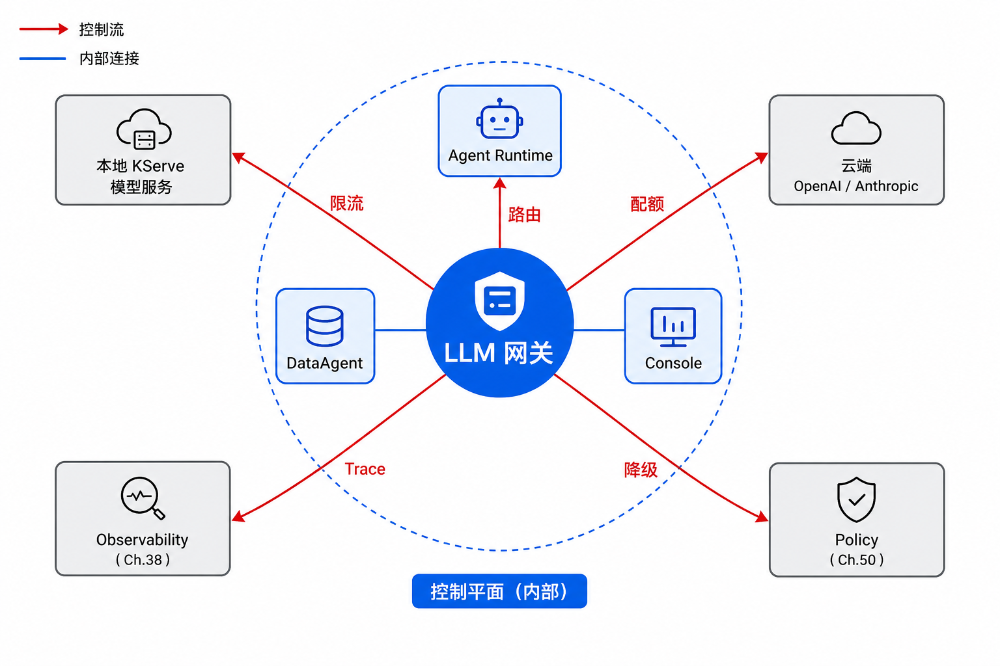
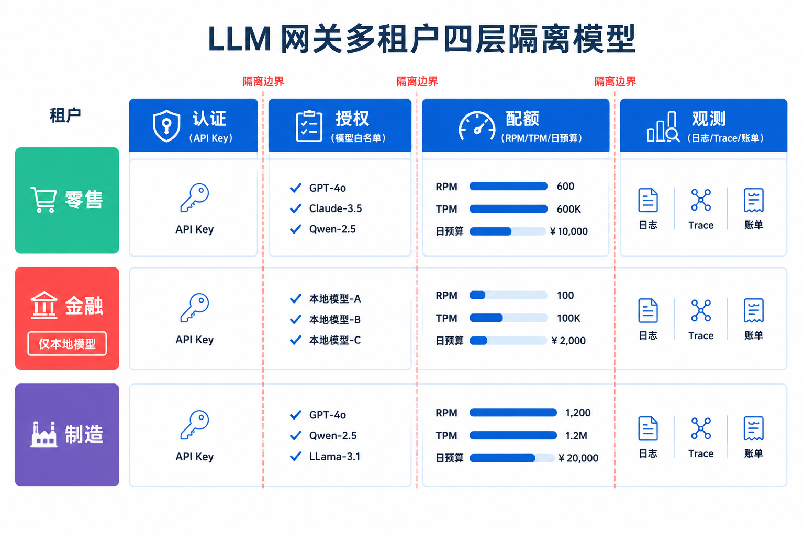
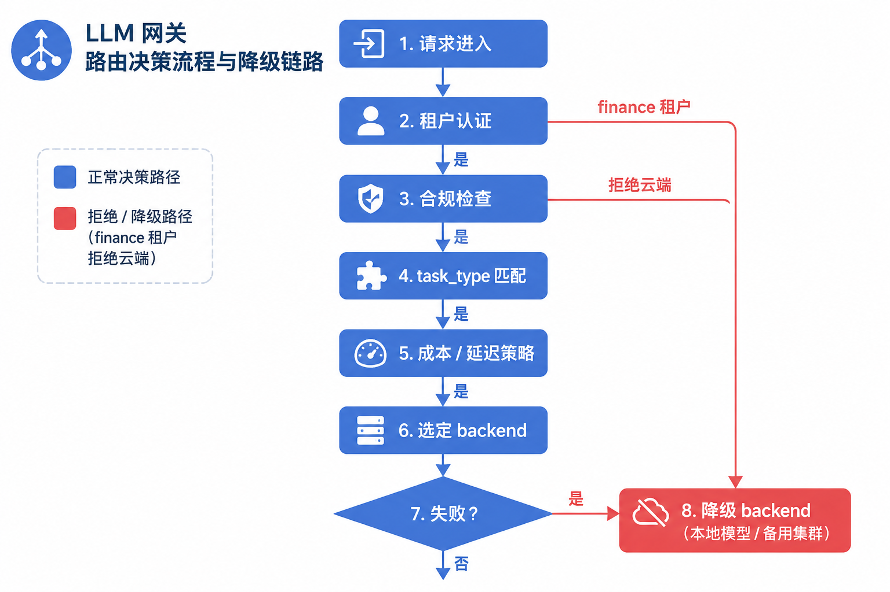
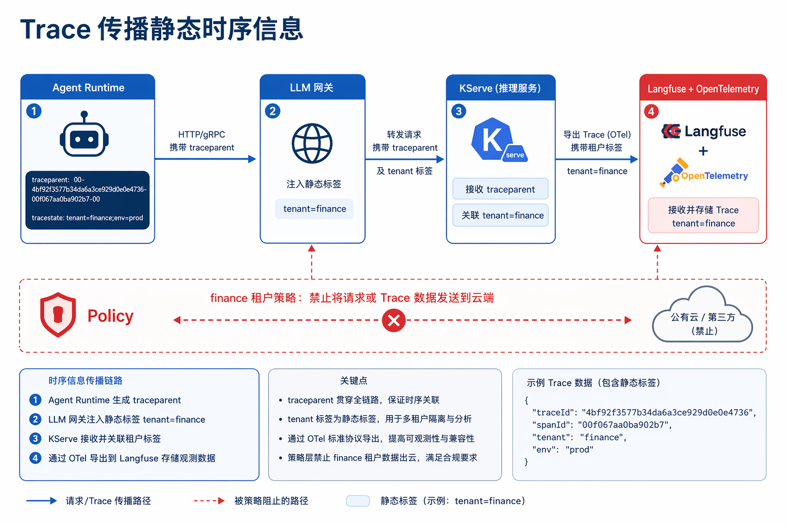

# 第45章 LLM 网关与多租户

---

没有统一网关时，每个 Agent 各自接模型 API，成本不透明、限流无法统一、审计也不可查。LLM 网关把模型路由、配额、鉴权、审计、缓存和供应商适配统一到平台入口。它在控制平面中负责多租户配额与鉴权，并承接模型路由、响应缓存和供应商适配，使上层 Agent 对底层模型变更无感知。月度账单异常时，平台监控显示自建推理 QPS 平稳，但外部模型 API 费用突然上升。继续查下去，才发现两个业务 Agent 为了“临时赶进度”绕过统一网关，直接使用了各自保存的 API Key；重试、限流、审计和成本归因都没有进入平台。LLM 网关必须成为模型调用的唯一入口。它还涉及转发层，还负责租户身份、模型路由、配额、审计、缓存和供应商适配。没有这个控制面，模型服务越多，治理盲区越多。

LLM 网关是企业模型调用的控制入口。没有网关时，每个 Agent 会直接保存 API Key、直接调用供应商或自建模型，短期上线很快，长期会丢掉成本归因、限流、审计、路由和数据出域控制。等账单或安全事件出现，再回收这些入口会很困难。网关的价值还涉及转发请求。它要识别租户和用户，选择模型后端，执行配额和预算，记录审计，应用缓存，适配不同供应商接口，并把调用结果写回 Trace。上层 Agent 看到的是统一模型接口，底层模型可以按合规、成本和能力持续调整。多租户场景尤其需要网关。不同业务线的数据敏感度、预算、模型偏好和地域要求不同；同一个用户在不同组织角色下也可能拥有不同调用权限。若这些规则散落在各 Agent 代码里，平台无法统一审计，也无法在供应商故障时集中切换。

## 45.1 LLM 网关在企业 Agent 平台控制平面中的位置

缺少统一入口时，多 Agent 团队各自维护 API Key、重试逻辑、模型列表和限流规则，规模化后几乎必然出现：密钥泄漏、成本失控、故障无法统一定界、合规审计无法回答“谁调用了哪个模型、走了哪条 backend”。FinOps 在月度账单中若发现云端 API 费用异常，而平台监控显示推理 QPS 平稳，常见根因是部分 Agent 绕过平台直连外部 API，或重试风暴放大 Token 消耗。

LLM 网关（LLM Gateway）是 Agent 平台控制平面的统一入口：所有 Runtime、DataAgent、Console 只对接网关；网关负责路由到第44章 模型服务或外部 SaaS，并叠加限流、配额、缓存、Trace 传播与降级。第41章 讲 Token 成本核算策略，第42章 讲 SLO 与熔断。网关是这些策略的执行点，不是替代者。第43章 保证 GPU 到位，第44章 保证模型服务 Ready，第45章 保证“这条请求以哪个 tenant 身份、走哪条 backend、失败时退到哪”。Runtime 只需学会一种 OpenAI 兼容调用方式。企业 Agent 平台通常有四个事业部、十余个 Agent 应用、若干模型服务（第44章的 `llm-general-32b`、`llm-code-7b` 等），以及部分云端 API 备用。网关将上述异构 backend 收敛为单一调用面。



*图45-1：网关是模型调用的唯一入口，也是治理策略的执行面。来源：本书自绘。Alt text：所有 Agent 调用集中经过 LLM 网关再抵达模型后端，网关上标注路由、限流、配额、审计四类治理策略，体现统一入口即统一治理。*

图 45-1 与第44章的边界：第44章 管模型副本与版本、Canary 与 Revision；第45章 管“哪条请求去哪个模型、以什么配额、失败时去哪”。读者不应在网关里做模型权重加载，也不应在 InferenceService 里做 tenant 配额。职责混淆会导致双份限流或双份盲区。

### 45.1.1 网关核心能力：统一 API、模型路由、缓存、限流、配额与成本归因

网关能力可以按“对 Agent 透明”与“对 FinOps/合规可见”两类理解。对 Agent 透明的是 OpenAI 兼容 API、流式 SSE、统一错误体；对 FinOps 可见的是 tenant 标签、Token 计量、backend 选择审计。

*表45-1：网关各核心能力的作用及与相邻章节的关系。来源：本书整理。*

| 能力 | 作用 | 与第41章/第42章 关系 |
|---|---|---|
| 统一 API | OpenAI 兼容，屏蔽后端差异 | 降低 Agent 集成成本 |
| 模型路由 | 按任务/租户/合规选 backend | 执行成本路由策略 |
| Prompt Cache | 相同前缀复用 KV（若后端支持） | 与第41章 semantic cache 互补 |
| 限流 | RPM/TPM/并发连接 | 执行 第42章 限流 SLO |
| 配额 | 租户日/月 Token 上限 | FinOps 硬门禁 |
| 成本归因 | 请求级 model + tenant 标签 | 账单分摊 |
| Trace 传播 | 注入 trace_id 到第38章 | 可观测性关联 |

网关租户划分（与第46章 GitOps `values-prod.yaml`、第50章 安全策略一致）：

*表45-2：各租户的事业部归属、默认模型与日 token 配额示意。来源：本书整理。*

| 租户 ID | 事业部 | 默认模型 | 日 Token 配额（示意） |
|---|---|---|---|
| `retail` | 零售 | `llm-general-32b` | 50M |
| `mfg` | 制造 | `llm-code-7b` + 本地 32B | 20M |
| `finance` | 金融 | 仅本地 `llm-general-32b` | 10M |
| `logistics` | 物流 | `llm-general-32b` + 云端备用 | 30M |

零售 tenant 允许在业务高峰通过路由规则切云端备用以吸收尖峰；finance tenant 的 allowed_models 白名单只有 `llm-general-32b`，任何 `gpt-4o` 请求在网关层直接 403，而非到云端才拒绝。制造 DataAgent 的 NL2SQL 默认走 `llm-code-7b`，复杂规划仍回 `llm-general-32b`。路由由 `X-Task-Type` 与规则表决定，Agent 代码不必硬编码两套 URL。

*表45-3：多租户相关核心概念的定义与区别。来源：本书整理。*

| 概念 | 定义 | 与相邻概念的区别 |
|---|---|---|
| LLM 网关 | 统一 LLM API 入口与治理执行点 | 不同于 API Gateway 全站入口 |
| 租户 | 资源与配额隔离单元 | 不同于 K8s Namespace 本身 |
| 路由规则 | 决定 backend 的匹配逻辑 | 不同于模型服务发布（第44章） |
| 降级 | 主 backend 失败时的备用路径 | 不同于模型 Canary（第44章） |

第44章的 Canary 是“同一服务名的新旧 Revision 切流”；网关降级是“主 backend 不可用时的 fallback_chain”。二者都可能改变用户看到的回答质量，但触发条件与回滚方式不同，On-call 要分册记录。

#### 四事业部在网关层的典型流量模式

把抽象能力映射到典型业务流量，有助于设计路由与配额：

- 零售（`retail`）：日间客服 Agent 占 TPM 主体；业务高峰配额触达 80% 预警时，路由允许切 `gpt-4o-fallback` 吸收部分溢出，但 FinOps 通常要求限时回切本地 32B。
- 制造（`mfg`）：DataAgent NL2SQL 尖峰走 `llm-code-7b`；设备知识库问答回 `llm-general-32b`；两模型独立限流，避免 SQL 尖峰饿死对话。
- 金融（`finance`）：全天仅本地 32B，日配额 10M 硬门禁；任何 403 以外异常都不得 fallback 到云端。降级只能是“排队”或“缓存 FAQ”，不能换模型到外部 API。
- 物流（`logistics`）：Embedding 重建 Job 不经网关（直连 第44章 Triton）；运单问答经网关，弱网时 fallback 本地 3B 边缘（第46章）而非无限重试中心 32B。

### 45.1.2 网关治理需要拆开的四类责任

#### 网关需要理解 LLM 调用语义

反向代理（如 Nginx）转发流量，不理解 `model` 字段、Token 用量、流式 SSE 分块、Retry-After 语义。LLM 网关需要解析 JSON body、统计 completion tokens、在 429 时返回可机器读的 `retryable`，也就是具备 LLM 语义层。某次试点中，通用 Ingress 做路径路由，无法按 tenant 做 TPM 限流，也无法在 backend 503 时自动 fallback 到 `llm-code-7b`。

#### 限流要和 Runtime 重试预算配合

Agent Runtime 侧仍可能循环重试放大流量：收到 429 后指数退避写错，变成固定 100ms 重试，QPS 反而翻倍。网关限流需配合 第42章 熔断与 Runtime 重试预算（每 session 最多 N 次、总 backoff 上限），否则 429 会被重试风暴抵消。弱网 handheld Agent 场景中，网关 429 + Runtime 无限重试 = 中心网关被打满。

#### 多租户隔离需要配额、路由、日志和缓存分区

Key 只是认证手段；租户隔离还需要配额、路由白名单、日志分区、缓存命名空间隔离。否则 Key 泄漏即租户边界失效。finance 与 retail 各一把 Key 不够，还要保证 finance Key 在注册表里 `allowed_models` 不可见云端 backend，且 Langfuse 项目按 tenant 分区，避免审计串扰。

#### 模型版本仍由 Serving 层管理

有人在 LiteLLM 里维护两套 `api_base` 表示 v1/v2 模型，却不用 KServe Revision。Canary 与回滚逻辑分裂在两层，故障时无法判断流量落在哪条 Revision。网关只做路由与治理，版本与流量百分比属于 第44章 InferenceService；网关 `model_name` 保持稳定，后端 Revision 由 KServe 的 `canaryTrafficPercent` 切换。

---

## 45.2 多租户模型：租户隔离、API Key 管理、命名空间与资源配额

多租户网关至少要把隔离拆成四层来看。少掉任何一层，问题都不会立刻出现，但规模一上来就会暴露；下面这四层最好从一开始就分别建账，而非等故障发生后再补。

1. 认证层：API Key / OAuth / mTLS，映射到 `tenant_id`；
2. 授权层：租户可调用的 `model` 白名单；
3. 配额层：RPM（Requests Per Minute，每分钟请求数）、TPM（Tokens Per Minute，每分钟 Token 数）、日预算；
4. 观测层：日志、Trace、账单按 `tenant_id` 分区。

K8s Namespace 可与租户对齐（`tenant-retail`），但 Namespace 管容器隔离、NetworkPolicy 与 ResourceQuota 的 CPU/内存/GPU。管不了 Token 配额。Token 是业务语义资源，要在网关或专用策略服务（如 LiteLLM DB + 自定义 middleware）实现。`finance` Namespace 里的 Pod 若持有错误 Key，仍可能访问 retail 配额。Namespace 不能替代网关授权。租户模型还要处理“人、应用、成本中心”三者的关系。一个 API Key 往往由某个 Agent 应用持有，但费用要归到事业部，审计要追到具体用户或服务账号。网关不应只保存 `api_key_id`，还应保存 `tenant_id`、`agent_id`、`owner_team` 和 `cost_center`。当某个租户成本异常时，FinOps 才能区分是正常业务增长、某个 Agent 重试失控，还是外部 Key 被误用。

配额需要拆成不同资源维度。RPM 控制请求频率，TPM 控制 token 消耗，并发连接控制流式会话占用，日/月预算控制成本上限。客服 Agent 的请求数可能很高但每次回答短，财务分析请求数低但上下文很长；只用 RPM 限流会误伤前者，也放过后者。网关策略应把这些资源分开记录，再按租户和模型组合成预算。多租户缓存是另一个容易出错的地方。即使 prompt 文本完全相同，不同 tenant 的答案也可能不同，因为政策版本、数据权限、地域和合规要求不同。cache key 需要包含 tenant、model、prompt hash、工具版本和必要的 policy version。缓存命中还应写入 Trace，让用户或审计人员知道这次回答来自缓存，而非重新调用模型。



*图45-2：租户隔离是认证、授权、配额、观测四层叠加，而非单一 API Key。来源：本书自绘。Alt text：四层由外到内。认证（谁在调）、授权（允许调什么）、配额（能调多少）、观测（调了什么），每层标注治理对象，体现多层隔离比单一 Key 更健壮。*

图 45-2 中金融租户“仅本地模型”在授权层生效：即使有人持有有效 API Key，请求 `gpt-4o` 也会在网关返回 `403 MODEL_NOT_ALLOWED_FOR_TENANT`，不会泄漏到第50章 才拦截。观测层的 tenant 标签由网关注入，不信任客户端 Header。见失败模式 2。

### 45.2.1 路由策略：按任务类型、按成本、按延迟、按合规域与降级链路

路由不能退化成“if-else 选 URL”。它应是一条带优先级的决策链：合规约束硬截断，业务偏好软选择，失败路径显式 fallback。输入字段应在第45章与 Runtime 之间文档化，避免各 Agent 自定义 Header 名。路由决策输入：
```text
tenant_id, model（请求声明）, task_type（Header/metadata）,
latency_slo, compliance_zone, fallback_chain
```

路由规则（示意，与第44章 服务名一致）：

*表45-4：按条件触发的模型路由优先级与目标 backend。来源：本书整理。*

| 优先级 | 条件 | 目标 backend |
|---|---|---|
| 1 | `compliance_zone=finance` | 仅 `llm-general-32b` 本地 |
| 2 | `task_type=code/sql` | `llm-code-7b` |
| 3 | `model=gpt-4o` 且 tenant 允许云端 | 外部 API |
| 4 | 默认 | `llm-general-32b` |
| fallback | 主 backend 5xx/超时 | 备用本地小模型或缓存响应 |

优先级 1 不可被客户端 `model` 字段覆盖。金融合规是硬规则。优先级 2 服务制造 DataAgent：同一 tenant `mfg` 下，NL2SQL 走 SGLang 代码模型，设备问答走 32B。优先级 4 的 fallback 要指向与主 backend 不同的 Revision 或不同模型。见失败模式 1。物流 tenant 在 `llm-general-32b` 超时 30s 后可降级到更小本地模型或返回缓存的运单 FAQ，但降级质量需在 Console 明示“简答模式”。图 45-3 展示路由决策链顺序：租户认证→合规硬截断→task_type→成本/延迟→backend 选择→显式 fallback；finance“拒绝云端”要在合规层生效，不能留到模型层才拦截。



*图45-3：路由是带优先级的决策链，降级是显式配置的 fallback_chain。来源：本书自绘。Alt text：决策链按优先级检查条件，匹配则路由到目标 backend，不匹配则下移；fallback_chain 在主 backend 不可用时按序切换，体现降级路径显式预配。*

#### LiteLLM 代理模式与自研网关

*表45-5：LiteLLM、API 网关插件与自研网关的方案取舍。来源：本书整理。*

| 方案 | 优势 | 代价 | 适用场景 | 本书建议 |
|---|---|---|---|---|
| LiteLLM | 100+ 后端、OpenAI 兼容、社区活跃 | 深度企业特性需扩展 | 快速统一 API | 初版推荐 |
| Portkey | 可观测、路由、缓存成熟 | SaaS/许可 | 偏 SaaS 治理 | 对标参考 |
| Higress/Kong AI | 与 API 网关生态集成 | LLM 语义需插件 | 已有 Kong/Higress | 混合架构 |
| 自研 | 完全定制 | 工程量大 | 超大厂 | 长期选项 |

初版阶段选 LiteLLM，因 第44章 已统一 OpenAI 兼容 backend，LiteLLM 的 `model_list` 可快速映射 KServe Service。这里的前提是企业愿意把复杂 RBAC、合规路由和 tenant 白名单放在 LiteLLM 之外加固，而非指望开源默认配置直接满足生产治理。若现有 API 网关团队已经有 Higress 或 Kong 经验，可以让它承担 TLS、WAF、IP 白名单和接入层审计，LLM 语义、Token 计量和模型路由仍留在 LiteLLM 或专用网关中。

#### 网关缓存与模型层 Prompt Cache

*表45-6：网关 semantic cache 与模型层 prefix cache 的适用边界。来源：本书整理。*

| 方案 | 优势 | 代价 | 适用场景 | 本书建议 |
|---|---|---|---|---|
| 网关 semantic cache（第41章） | 跨 backend、可租户隔离 | 一致性难 | 重复问答多 | 与 LiteLLM cache 配合 |
| 后端 prefix cache | 延迟最低 | 绑定单引擎 | vLLM 长系统 prompt | Part II 第7章 |

零售客服重复“退换货政策”问答适合网关 semantic cache；制造 DataAgent 长 system prompt 重复利用 vLLM prefix cache 更省延迟。两层 cache 并存时，cache key 要包含 `tenant_id`，且 finance 租户应禁用跨 session 缓存或加密隔离。这里不要把缓存命中率当作唯一指标。对于 DataAgent，缓存回答如果没有绑定指标版本、数据时间和权限上下文，命中越高，越可能把过期口径扩大到更多用户。见失败模式 3。

### 45.2.2 网关产品对比：LiteLLM、Portkey、Higress AI Gateway 与 Kong AI

*表45-7：LiteLLM、Portkey、Higress AI 等网关产品的适用与不适用场景。来源：本书整理。*

| 产品 | 为什么用 | 不适合什么 | 替代 |
|---|---|---|---|
| LiteLLM | 开源、多 backend、易部署 | 复杂 RBAC 需二次开发 | Portkey、自研 |
| Portkey | 路由、缓存、观测一体 | 强私有化定制 | LiteLLM + Langfuse |
| Higress AI | 云原生、Wasm 插件 | 团队无 K8s 网关经验 | Kong、Envoy |
| Kong AI | 企业 API 网关存量 | LLM 原生特性需配置 | Higress |

产品选型应服务于架构取舍，不是品牌选择。推荐路径：LiteLLM 作 LLM 语义层，必要时前挂 Higress 作 TLS/WAF（第46章 Helm 分 Chart 部署），Observability 接 Langfuse（第38章）。Kong AI 适合已全站 Kong 的企业，但 LLM 流式与 Token 计量插件需逐项验证，不能假设“上了 Kong 就等于上了 LLM 网关”。

#### LiteLLM + Higress 组合拓扑（简述）

请求路径：`Internet/内网 Agent` → Higress（TLS 终止、WAF、IP allowlist）→ LiteLLM Pod（LLM 语义、tenant、配额）→ KServe Service（第44章）。Higress 不理解 TPM 配额，LiteLLM 不替代 WAF。两层各做擅长的事。金融 tenant 的 IP allowlist 在 Higress；模型白名单在 LiteLLM DB。缺一不可。Observability 在 LiteLLM 出口注入 traceparent，Higress access log 只记录 L4/L7 元数据，不记录 prompt 正文（第50章 日志合规）。

### 45.2.3 网关接口：请求格式、错误码、Trace 与审计字段

Runtime、Console 与网关之间的契约，是 Part VIII 面向上层系统的稳定 API。字段稳定比功能丰富更重要。以下契约与第44章 OpenAI 子集衔接，并扩展治理字段。
```text
POST /v1/chat/completions
Headers:
  Authorization: Bearer <api_key>
  X-Tenant-Id: retail              # 或由 Key 映射，见失败模式 2
  X-Task-Type: nl2sql               # 可选，供路由
  traceparent: 00-<trace_id>-...   # W3C Trace Context

Request:
{
  "model": "llm-general-32b",
  "messages": [...],
  "stream": true,
  "metadata": { "agent_id": "data_agent", "session_id": "s_001" }
}

Response: （OpenAI 兼容 + 扩展 Header）
  X-Route-Backend: kserve-llm-general-32b
  X-Token-Usage-Billed: 1523

Errors:
  401 AUTH_INVALID
  403 MODEL_NOT_ALLOWED_FOR_TENANT
  429 QUOTA_EXCEEDED | RATE_LIMITED  （Retry-After 秒）
  502 BACKEND_UNAVAILABLE
  503 DEGRADED_TO_FALLBACK
Body: { "error": { "code", "message", "retryable" } }
```

`X-Route-Backend` 用于 On-call 定界：用户报“回答变慢”时，先看是网关开销还是 KServe TTFT。`503 DEGRADED_TO_FALLBACK` 表示已降级，Runtime 可决定是否向用户提示。`retryable` 帮助 Runtime 区分“不应重试的 403”与“可退避的 429/502”。403 重试只会放大审计噪音。

### 45.2.4 与平台其他子系统的协作：Runtime、Observability、Policy 与 Cost 治理

网关并不单独完成治理。它要和 Runtime、Observability、Policy 和 Cost 系统一起形成反馈链路：Runtime 传入任务和 trace，网关注入 tenant 与 route 信息，Policy 判断合规边界，Cost 系统按 token 和 backend 结算，第38章把这些信号串成可复盘的链路。任何一个环节断开，网关都会退化成“会转发的代理”。

*表45-8：网关与 Runtime、Observability 等子系统的职责边界。来源：本书整理。*

| 组件 | 职责 | 输入 | 输出 | 失败模式 |
|---|---|---|---|---|
| 认证器 | Key → tenant | API Key | tenant_id, scopes | Key 泄漏 |
| 路由器 | 选 backend | 请求 + 规则 | upstream URL | 规则冲突循环 |
| 限流器 | RPM/TPM | tenant + model | allow/deny | Redis 单点 |
| 配额器 | 日预算 | tenant 用量 | allow/deny | 计数漂移 |
| Trace 注入 | 关联第38章 | traceparent | 后端 Header | Trace 断链 |
| 降级器 | fallback | backend 健康 | 备用 backend | 降级模型质量不足 |

Trace 应从 Runtime 经网关延续到第44章 KServe Pod，Langfuse span 含 `tenant_id`、`model`、`X-Route-Backend`。Policy（第50章）在网关执行“finance 禁止云端”类规则，细粒度 IAM 仍在平台身份层。网关只做 LLM 调用路径的策略 enforcement。



*图45-4：Trace 不断链，tenant 标签只在网关注入。来源：本书自绘。Alt text：Trace 从 Agent 发起贯穿网关到模型供应商，tenant 标签在网关统一注入而非每个 Agent 各自打标，箭头标出标签注入点，体现治理集中在网关一处。*

图 45-4 强调 Trace 不断链与 tenant 标签只在网关注入：KServe Pod 不应信任来自客户端的 `X-Tenant-Id`，否则 finance 合规在模型层被绕过。Observability 侧应能按 `tenant_id + model + backend` 三维下钻，与第41章 账单维度一致。

### 45.2.5 从 429、403 到 fallback 风暴的恢复路径

*表45-9：超时、路由死循环、缓存污染等网关失败模式的检测与恢复。来源：本书整理。*

| 失败模式 | 触发条件 | 影响 | 检测方式 | 恢复策略 |
|---|---|---|---|---|
| 上游超时 | vLLM 过载 | 用户长时间等待 | gateway_latency P99 | 超时切断 + fallback |
| 路由死循环 | fallback 指回自身 | 502 风暴 | 路由 DAG 校验 | 静态分析 fallback 链 |
| 配额误配 | finance 日限额过大 | 成本失控 | FinOps 日报 | 配额变更 CR + 双人复核 |
| 缓存污染 | 跨 tenant cache key 冲突 | A 租户看到 B 的回答片段 | 缓存 key 审计 | key 含 tenant_id+model |
| 租户串扰 | Header 伪造 tenant | 越权 | mTLS + Key 绑定 | 忽略客户端 tenant Header |

上游超时常与第43章/第44章 容量相关：网关 timeout 设 120s 而 vLLM 队列已满，用户只会看到 spinner。应在网关侧更短 timeout + fallback，并把排队指标告警接到第42章 SLO。配额误配在业务高峰尤其危险：retail 日配额未临时调高，合法流量被 429，业务方改用个人 Key 绕过网关，FinOps 失控。

#### 与第44章 Canary 的联调注意

第44章 对 `llm-general-32b` 做 5% Canary 时，第45章的 `model_list` 仍指向同一 KServe Service 名。KServe 在 Service 层分割流量，网关无需改 URL。但若工程师在 LiteLLM 新增 `llm-general-32b-canary` 作为独立 model_name 并配 fallback 回主模型，会与 KServe 内置 Canary 双重切流，指标无法解读。规范要求：网关 model_name 与 InferenceService 名 1:1，Canary 只在第44章 调 `canaryTrafficPercent`，网关只看聚合 `/ready` 与错误率。

#### Redis 限流单点与多副本网关

LiteLLM 多副本 + Redis 限流时，Redis 故障会导致“限流失效或全拒”。应 Redis Sentinel 或集群，且限流失败策略明确为 fail-closed（宁拒勿放）还是 fail-open（宁放勿拒）。finance 通常选 fail-closed；retail 业务高峰窗口可临时 fail-open 并强依赖 第41章 成本告警，但需变更单。

---

## 45.3 LLM 网关配置、路由规则与多租户隔离

落地顺序：staging 单 tenant 连接 KServe backend，四 tenant Key 与白名单入库，配置 fallback 与限流，再执行 prod 切流（第46章 Manual Sync）。禁止 Agent 直连 KServe 的验收标准：网络层除网关 ServiceAccount 外，InferenceService 无 ClusterIP 对外路由。这个顺序的重点，是先证明一条最短路径可靠，再逐步加治理能力。单 tenant 连接 KServe backend，可以验证模型名、OpenAI 兼容接口、流式响应和 `/ready` 聚合是否一致；四 tenant 入库以后，才能验证 Key 到 tenant 的映射、模型白名单和审计字段；fallback 与限流放在主路径稳定以后测试，因为它们会改变故障时的行为。很多网关项目失败，并非工具选错，而是第一天就把路由、缓存、降级、限流、审计全部打开，出了问题无法判断是哪一层导致。

切流阶段也要控制范围。所有 Agent 一次性从直连 KServe 改到网关，短期看省时间，实际会放大未知问题。较稳的路径是按 tenant 或应用分批：先切低 QPS、低风险应用，确认 trace、成本和错误码闭合；再切制造和物流这类业务链路较长的 Agent；零售高并发场景放在后面。finance 是否先切，取决于组织合规压力。如果 finance 的核心问题是禁止云端绕行，先切 finance 可以尽快关闭直连风险；如果 finance 对可用性要求更高，则应在 staging 完成更多拒绝路径和合规探测后再切。网关上线后，直连通道要逐步收敛。只改 Runtime 的 `OPENAI_BASE_URL` 不够，还要通过 NetworkPolicy、ServiceAccount 和审计规则限制直连 KServe。否则业务团队在故障时会临时改回直连，短期绕过问题，长期破坏成本、审计和合规边界。紧急直连可以保留为 break-glass 路径，但要有时间限制、审批记录和事后 Git 修复。

#### LiteLLM `config.yaml` 示例

`api_base` 指向 第44章 KServe 集群内 Service；`model_name` 与 Runtime `served-model-name`、第44章 契约一致。读这个配置时，应先检查三个关系：`model_name` 是否与 Runtime 请求模型名一致，`api_base` 是否只指向集群内模型服务，fallback 是否会绕过合规边界。示例中的 `gpt-4o-fallback` 只允许被白名单租户使用，不能作为所有 backend 的默认兜底。
```yaml
# 示例：LiteLLM 网关配置（生产工程示例）
model_list:
  - model_name: llm-general-32b
    litellm_params:
      model: openai/llm-general-32b
      api_base: http://llm-general-32b.model-serving.svc:8000/v1
      api_key: os.environ/INTERNAL_API_KEY
  - model_name: llm-code-7b
    litellm_params:
      model: openai/llm-code-7b
      api_base: http://llm-code-7b.model-serving.svc:8000/v1
  - model_name: gpt-4o-fallback
    litellm_params:
      model: gpt-4o
      api_key: os.environ/OPENAI_API_KEY

router_settings:
  routing_strategy: simple-shuffle   # 生产建议自定义 callback
  fallbacks:
    - llm-general-32b: [llm-code-7b]

litellm_settings:
  drop_params: true
  set_verbose: false

general_settings:
  master_key: os.environ/LITELLM_MASTER_KEY
  database_url: os.environ/DATABASE_URL   # 用量与 Key 管理
```

`fallbacks` 生产环境要人工审查 DAG 无环；`simple-shuffle` 在多副本 KServe 间负载均衡，不能替代 tenant 路由。tenant 路由应在 DB 策略或 custom callback 实现。这段配置只表达模型入口和基础 fallback，不表达完整租户策略。生产环境还需要把 API Key 到 `tenant_id` 的映射、`allowed_models` 白名单、日配额和审计字段放入数据库或策略仓库，并由第46章的 GitOps 流程发布。若这些策略只在 LiteLLM 管理界面手工修改，网关会形成新的配置黑盒，事故时很难解释某次请求为什么能访问云端模型。

#### 租户 Key 与模型白名单（示意 SQL 逻辑）
```sql
-- 伪代码：租户模型授权表
-- tenant_id | allowed_models              | daily_token_quota
-- finance   | {llm-general-32b}           | 10000000
-- retail    | {llm-general-32b,gpt-4o-*}  | 50000000
```

Key 创建时就要绑定 `tenant_id`，请求处理路径只读 DB 映射，不直接相信 `X-Tenant-Id` Header。这样才能避免客户端伪造租户信息，把隔离边界推给不可信输入。

#### 限流配置示例
```yaml
# 示例：LiteLLM 路由级 RPM 限制
router_settings:
  model_group_alias:
    retail-fast: llm-general-32b
  rpm: 600          # 全局示意
  tenant_rpm:
    retail: 300
    finance: 100
```

业务高峰前若要临时上调 retail 的 `tenant_rpm`，应走变更单，并在第41章的成本面板上标记“高峰窗口”。否则事后看到配额突变和成本抬升时，很难区分这是业务计划内波动还是配置失控。

#### 部署与验证
```bash
# 启动（示例）
litellm --config /etc/litellm/config.yaml --port 4000

# 验证路由
curl http://localhost:4000/v1/chat/completions \
  -H "Authorization: Bearer $RETAIL_KEY" \
  -H "Content-Type: application/json" \
  -d '{"model":"llm-general-32b","messages":[{"role":"user","content":"ping"}]}'
```

验收时至少要核对三件事：finance 租户的 Key 请求 `gpt-4o` 会返回 403，`mfg` 租户带 `X-Task-Type: nl2sql` 时 `X-Route-Backend` 指向 code 服务，Trace 在 Langfuse 中能串起三段 span。只有这三件事同时成立，才说明授权、路由和可观测链路都接通了。

#### Helm 部署与第46章 GitOps 衔接

生产网关不手工 `litellm --config` 起进程，而由 `helm/llm-gateway` Chart 挂载 ConfigMap + External Secret：
```yaml
# 示例：Helm values-prod 片段（伪代码结构）
replicaCount: 4
config:
  model_list: []   # 由 chart 模板渲染，backend 来自 model-serving release
externalSecrets:
  openaiKey: vault/agent-platform/openai
  masterKey: vault/agent-platform/litellm-master
tenantPolicy:
  finance:
    allowed_models: [llm-general-32b]
    deny_cloud: true
  retail:
    allowed_models: [llm-general-32b, gpt-4o-fallback]
```

ArgoCD Application `llm-gateway-prod` 的 `targetRevision` 与 `model-serving-prod` 同 tag 晋升。避免网关先 sync、模型未 Ready 的窗口。staging 可允许 `replicaCount: 1` 节省成本，但 tenant 白名单要与 prod 同逻辑，否则“staging 测通过、prod 403 策略不同”。

#### 切流 Runbook：从直连 KServe 到经网关

1. 冻结新 Agent 直连 KServe 的 NetworkPolicy（第50章 配合）；
2. Runtime 配置改 `OPENAI_BASE_URL=https://llm-gateway.internal/v1`；
3. 按 tenant 分批切流：finance → mfg → logistics → retail（零售 QPS 最高，放在末批）；
4. 每批观察 24h：网关 P99 开销、backend 错误率、FinOps tenant 账单是否闭合；
5. 回滚：Runtime 指回 KServe 仅作紧急路径，须 4h 内补 Git revert。

切流以后，网关不应成为新的黑盒。业务侧报慢时，SRE 要能看出延迟花在 pre-backend、backend 还是 streaming；FinOps 要能看出某个 tenant 的 token 消耗是正常增长、重试放大，还是 fallback 到外部 API；合规团队要能抽查 finance 的请求是否只经过本地 backend。这些问题都依赖统一字段：`tenant_id`、`model`、`backend`、`trace_id`、`route_rule_id` 和 `fallback_reason`。字段不统一，后续每个团队都会建自己的报表，网关的统一治理价值会被削弱。缓存策略也要在切流期保守启用。对于 FAQ 和政策问答，semantic cache 可以明显降低成本；对于 DataAgent、财务分析和合规问答，缓存命中可能掩盖数据版本和权限变化。早期网关可以只对低风险、只读、跨用户一致的问答启用缓存，并把 cache key 的 tenant、model、prompt hash、版本号写入 Trace。等第41章的缓存治理跑稳后，再扩大到更多场景。

回滚路径也要在切流阶段演练。网关故障时，是否允许 Runtime 暂时直连 KServe，要由风险等级决定。finance 这类合规租户即使网关故障，也不能直接绕过模型白名单和审计；低风险内部工具可以保留短时 break-glass，但要写入审计并自动过期。没有这条规则，网关越重要，事故时越容易被人工绕开，最终又回到多入口失控的状态。网关规则本身也要版本化。路由规则、tenant 白名单、fallback 链、缓存策略和限流阈值都会改变模型调用结果。若这些规则只在数据库后台手工修改，第46章的 GitOps 链路就会断开；把规则纳入 Helm values 或策略仓库，才能在 PR 中审查 finance 是否仍禁止云端、retail 的临时配额何时过期、fallback 是否指向不同 backend。规则版本还要写入 Trace，方便事后判断一次请求命中了哪一版治理策略。

网关错误语义要给 Runtime 留出正确动作。`401` 和 `403` 通常不应重试，`429` 应按 `Retry-After` 退避，`502` 和 `503` 才可能触发 fallback 或短时重试。若 Runtime 把所有错误都当作可重试，网关越严格，重试风暴越大；若 Runtime 把所有错误都直接展示给用户，系统又会暴露过多内部细节。第45章的接口契约要和第22章 Runtime 的重试预算、第42章 SLO 策略一起设计。网关还要区分技术错误、策略拒绝和主动降级。finance 请求云端模型被 403 拒绝，说明合规规则生效；tenant 超过预算被 429 拒绝，说明成本门禁生效。观测报表如果把它们都算作普通错误，业务方会误以为平台不稳定，实际上平台可能只是第一次把原本失控的调用拦了下来。

网关发布以后，还要定期做策略演练。演练不需要等真实事故发生，可以用合成请求验证关键路径：finance 请求云端模型应返回 403，retail 超出预算应返回 429，主 backend 人为置为不可用时 fallback 只能触发一次，fallback 目标要出现在审计字段里。策略演练的结果应进入第46章的发布记录，和模型服务 smoke test 一起成为网关变更的验收条件。这些演练能暴露很多平时看不到的问题。比如白名单规则被某次数据库迁移清空，平时没有 finance 请求云端，所以无人发现；fallback DAG 在配置重构后形成环，只有主模型故障时才会爆发；某个 Agent 忽略 `Retry-After`，平时流量低看不出来，高峰期才变成重试风暴。网关是集中治理点，也会成为集中故障点。把治理规则当成代码一样测试，是降低这类风险的基本做法。

上线后还应保留一组固定的探测请求，由 CI 或定时任务每天执行。它们不追求业务覆盖面，而是验证最核心的治理契约仍然有效。探测请求还要覆盖成本和合规边界。一个低风险租户请求便宜模型应命中默认路径，高风险租户请求云端模型应被拒绝，预算耗尽的租户应收到稳定的 429，fallback 后的请求应记录 `fallback_reason`。这些探测不需要真实业务数据，却能提前发现路由规则、API Key 映射和缓存隔离的退化。

### 45.3.1 从策略配置错误定位到租户隔离缺口

#### fallback 链配置错误导致无限重试

- 现象：backend 故障时网关 QPS 翻倍，下游更快崩溃。
- 根因：`llm-general-32b` fallback 到 `llm-general-32b-canary`，Canary 仍指向同一 KServe Service；降级未换 Revision。
- 修复：fallback 指向不同 Revision 或不同模型；限制每请求最多 1 次 fallback；记录 `X-Route-Backend` 审计；CI 静态检查 fallback DAG。

#### finance 租户通过伪造 Header 访问云端

- 现象：合规扫描发现 finance Agent 请求出现在 OpenAI 账单。
- 根因：网关信任客户端 `X-Tenant-Id`，未从 API Key 映射；攻击者用 retail Key body 里伪造 finance。
- 修复：tenant 仅来自 Key 注册表；合规路由在服务端强制；云端 backend 对 finance Key 不可见；第50章 定期跑“应拒绝”探测用例。

#### semantic cache 未含 tenant_id 导致回答串扰

- 现象：零售客服 Agent 返回含金融术语的缓存片段。
- 根因：cache key = hash(prompt)，未含 tenant；finance 与 retail 共享 gateway cache Redis。
- 修复：cache key = hash(tenant_id + model + prompt)；finance 租户禁用跨会话 cache 或加密隔离；缓存 TTL 与第41章 semantic cache 策略对齐。

网关生产化要从三条线验收。权限线：Key 要有轮换策略，`master_key` 只允许 SRE 和自动化发布系统访问，tenant 只能由 Key 注册表映射，不能信任客户端 Header。审计线：每次请求至少记录 tenant、model、backend、token、trace_id、fallback 状态和错误码。稳定性线：fallback DAG 无环，429 带 `Retry-After`，网关自身 P99 开销单独统计，不混入模型推理耗时。成本治理同样要在网关侧落地。配额应同时支持硬门禁和 80% 预警，FinOps 日报按 tenant、model、backend 三维出账。对于允许云端 fallback 的租户，报表要单独列出 fallback 消耗，否则高峰期的外部 API 费用会被混在“正常模型调用”里。网关多副本部署时，限流 Redis、ConfigMap 热更新和 backend 健康检查都要有明确的失败策略；finance 这类合规租户通常宁可拒绝请求，也不能在限流器故障时放行到云端。网关上线评审还应先统一失败语义。`429` 表示用户或租户被限流，Runtime 应退避；`502` 表示上游不可用，网关可以按策略降级；`403` 表示策略拒绝，重试没有意义。若这些语义没有在 Runtime、Console 和告警里统一，前端会把所有错误都显示成“模型繁忙”，业务方无法判断是配额问题、合规拒绝还是模型服务故障。

#### 网关侧 Prometheus 指标（示意）

*表45-10：网关侧 Prometheus 监控指标的含义与告警建议。来源：本书整理。*

| 指标名 | 含义 | 告警建议 |
|---|---|---|
| `gateway_requests_total{tenant,model,backend}` | 请求计数 | 按 tenant 突增 |
| `gateway_latency_seconds{phase="pre_backend"}` | 网关自身开销 | P99 > 50ms |
| `gateway_quota_denied_total{tenant}` | 配额拒绝 | finance 非零即查 |
| `gateway_fallback_total{from,to}` | 降级次数 | 1h 内 > 100 |
| `gateway_backend_errors_total{backend}` | 上游 5xx | 与第44章 Ready 联查 |

指标标签要和第41章成本报表、第38章 Trace 里的 `tenant_id` 命名保持一致。否则 FinOps 和 SRE 各自维护一套 tenant 拼写，后面做成本归因和事故定位时就很难对齐。

### 45.3.2 网关策略的运营节奏

LLM 网关上线后，策略需要持续运营。模型价格会变，租户预算会变，外部 API 可用性会变，合规要求也会变。网关策略如果长期不复审，就会出现过期 fallback、长期临时配额、无人使用的模型别名和不再符合合规要求的路由。平台应定期审查 tenant 配额、模型白名单、fallback 链、缓存范围和错误码统计。运营节奏可以按周和按月拆开。每周看异常：429 激增、fallback 激增、云端调用异常、某租户 token 消耗突增、网关自身 P99 升高。每月看结构：哪些模型被长期闲置，哪些租户持续超预算，哪些 Agent 经常触发策略拒绝，哪些缓存命中带来成本下降但没有质量风险。审查结果应进入配置仓库，而非只改后台数据库。网关策略的 owner 也要清楚。SRE 负责可用性和路由健康，平台团队负责 API 契约和 Runtime 协作，安全合规负责模型白名单和数据边界，FinOps 负责预算和成本归因。策略变更如果没有 owner，很容易在事故时互相推诿。网关是集中入口，也必须有集中但分工明确的运营机制。

---

网关上线后，所有模型调用都应能归因到租户、任务、模型和版本。账单异常时，团队可以看到是哪类 Run 增长、哪个策略导致强模型调用增加、哪些请求没有命中缓存。没有归因，成本优化只能靠猜。网关还承担故障降级。某个供应商超时、某个自建服务过载、某个模型版本回滚时，网关可以按策略切换后端、降低并发或拒绝低优先级请求。业务 Agent 不需要知道底层故障细节，只需要收到明确错误或降级结果。安全上，网关是数据出域和审计的关键点。请求是否包含敏感字段、是否允许走外部模型、响应是否需要脱敏，都应在这里统一处理。直接绕过网关的调用，应被视为平台风险，而非个人开发习惯。

网关路由策略要可解释。一次请求为什么走本地模型、为什么走外部供应商、为什么降级到小模型、为什么被拒绝，都应能从路由日志中看到。没有解释，业务团队会把延迟、质量和拒答问题都归因到模型本身。多供应商适配要隐藏差异，但不能抹掉能力边界。不同模型对工具调用、结构化输出、流式响应、上下文长度和安全过滤的支持不同。网关可以提供统一 API，同时也要把能力矩阵暴露给路由策略和评测系统，避免把不支持某项能力的模型路由到错误任务。API Key 管理要从个人密钥转向租户和服务身份。业务应用不应保存供应商密钥，开发者也不应在配置文件里复制密钥。网关负责凭证托管、轮换和审计，Agent 只以平台身份发起请求。这样供应商密钥泄露或人员离职时，风险可控。

缓存、限流和预算策略要按租户隔离。一个业务线的高峰不应耗尽全平台预算，一个测试 Agent 不应影响生产 Agent 的限流。网关需要在租户、应用、任务类型和模型之间建立清楚的配额层级。网关还是模型变更的缓冲层。底层模型升级、供应商故障、价格变化或区域策略调整时，平台可以在网关层修改路由和 fallback，而不要求所有 Agent 改代码。这个能力能降低模型生态变化对业务应用的冲击。网关还要管理请求内容的标准化。不同供应商对 system message、tool call、JSON mode、stream chunk 和错误格式处理不同。网关适配这些差异后，应把标准化前后的关键信息写入调试日志。出现模型行为差异时，团队才能判断是供应商能力不同，还是适配层转换有问题。

路由策略需要分阶段生效。新策略可以先在影子模式下计算“如果按新规则会路由到哪里”，但真实请求仍走旧规则。对比一段时间后，再灰度切换。这样平台可以在不影响用户的情况下评估成本、延迟和质量变化。直接替换全量路由，很难区分策略问题和模型问题。网关的限流要给调用方明确反馈。429、预算耗尽、租户被暂停、模型后端过载和安全策略拒绝，恢复方式不同。Agent Runtime 拿到结构化错误后，可以排队、降级、请求用户确认或终止。若网关只返回通用失败，Runtime 会反复重试或给用户模糊提示。审计字段要覆盖请求生命周期。谁发起、代表哪个租户、使用哪个模型、经过哪些策略、是否命中缓存、是否降级、最终 token 和费用是多少，都应能查询。账单、合规和事故复盘都会用到这些字段。没有统一网关，这些信息会散落在各供应商控制台和应用日志里。

多租户网关还要支持租户级策略差异。金融租户只能走本地模型，零售租户允许外部模型但限制敏感字段，研发租户可以使用代码模型，测试租户有较低预算。策略差异写在网关中，业务 Agent 就能共享同一接口，同时满足不同组织要求。网关自身也要高可用。它是模型调用入口，故障会影响所有 Agent。部署上需要多副本、熔断、后端健康检查、配置灰度和回滚；配置错误时，应能快速恢复上一版本。治理能力集中到网关后，网关的工程可靠性就变成平台可靠性。网关配置也需要版本化。新增后端、调整权重、修改租户配额、开启缓存、改变外部模型策略，都会影响用户结果。配置版本进入 Trace 后，某次回答才能复现当时的路由环境。没有配置版本，只知道模型名仍然不够。

缓存层要和网关策略协同。网关决定是否可缓存、缓存键包含哪些字段、命中后是否重新做权限校验。应用层各自缓存模型回答，会绕过统一治理，也会让数据版本和权限失效变得不可控。模型回答只要可能被复用，就应进入网关统一管理。供应商故障演练也很必要。平台可以定期模拟某个外部模型超时、返回错误或质量异常，确认路由、降级、告警和用户提示是否按预期工作。没有演练，fallback 规则往往只存在配置里，真正故障时才发现缺少容量或权限。网关还要保护模型服务免受异常输入冲击。超长上下文、异常文件解析结果、重复请求和恶意高并发都可能压垮后端。输入大小限制、请求去重、租户限流和排队策略应在网关前置执行。模型服务越昂贵，入口保护越重要。

在组织上，网关策略需要变更评审。业务想提高配额，模型团队想切换后端，安全团队想限制外部模型，财务团队想压预算，这些需求会互相影响。网关配置是这些取舍的落点，不能由单个应用随意修改。网关还可以承载影子评测流量。真实请求走当前模型，同时复制脱敏后的请求到候选模型，记录候选结果但不返回用户。影子流量能帮助团队评估新模型、新路由和新供应商，而不直接影响生产。影子评测要严格控制数据出域和成本，不能变成隐形全量调用。响应后处理也应在网关层统一。某些供应商返回的安全拒答、工具调用格式或错误码需要归一化，才能被 Runtime 正确理解。若每个 Agent 自己适配响应，平台很难统一观测和降级。网关归一化要把供应商差异暴露为稳定字段，而不是试图隐藏所有差异。

网关策略还要支持紧急封禁。发现某个模型版本输出异常、某个租户密钥泄露、某类请求触发安全风险时，平台应能快速封禁后端、租户或策略组合。紧急封禁要有审计和恢复流程，避免长期停留在临时状态。网关还应支持策略模拟。业务团队提交一个新场景时，平台可以先用样例请求模拟会命中哪些模型、产生多少成本、是否触发安全限制和缓存策略。模拟结果能帮助业务在上线前调整任务设计。这样网关还涉及运行时入口，也成为模型使用方案的评审工具。网关日志还要避免保存过多原文。请求和响应可以保存摘要、token 统计、策略命中和 artifact 引用；高敏内容应脱敏或按权限存储。统一入口带来统一观测，也会集中敏感数据，日志治理必须同步设计。

网关策略的测试样本应覆盖正常请求、越权请求、敏感数据、长上下文、供应商故障和预算耗尽。每次策略变更前运行这些样本，可以发现路由和安全规则的明显回归。网关越集中，策略测试越重要。网关还要给业务提供用量解释。某个团队费用上升时，报表应能拆到任务、模型、缓存、重试和评测，而非只给一个总账单。费用能解释清楚，业务才愿意配合优化。这些解释能把用量讨论从情绪拉回证据。用量解释稳定后，预算治理才不会变成简单限额。网关运营看板应持续展示这些解释，帮助团队形成共同成本语言。成本语言统一后，跨团队优化才容易推进。

## 45.4 网关策略的影子评估与退出机制

LLM 网关的策略变更不宜直接全量生效。路由权重、模型白名单、fallback 顺序、缓存范围、租户配额和外部模型开关，都会影响答案质量、成本、合规边界和用户体验。一个看起来很小的规则调整，可能让 DataAgent 从本地模型切到外部模型，也可能让低风险 FAQ 命中缓存，却让高风险财务问答错误复用旧结果。因此，重要策略应先进入影子评估：真实请求仍走旧策略，新策略只计算会命中哪个后端、会产生多少成本、是否触发拒绝或 fallback。

影子评估要记录差异，而不是只记录新策略是否能运行。平台应比较旧策略和新策略在模型选择、延迟、成本、拒绝率、fallback 次数、缓存命中和合规路径上的差异。若新策略让成本下降，但把高风险租户更多路由到外部模型，就不能只按成本结果通过；若新策略降低延迟，但增加结构化输出失败率，也要回到任务级样本检查。影子阶段的价值，是让团队在不影响用户的情况下看清策略后果。

策略也需要退出机制。临时配额、紧急 fallback、人工放开的外部模型路径、事故期间新增的拒绝规则，都不应长期留在网关里。每条临时策略都应有 owner、原因、适用范围、过期时间和复审样本。到期后要么转为正式策略，要么删除，要么重新进入影子评估。没有退出机制，网关配置会积累越来越多历史例外，后续团队很难判断哪条规则仍有业务依据。

早期可以把影子评估和退出机制做成策略发布模板。模板要求填写变更目标、影响租户、候选后端、预期成本变化、合规边界、回滚方式和过期时间。发布前跑固定探测样本，发布后观察真实流量差异，过期前自动提醒 owner 复审。这样网关治理就不会停留在“能路由请求”，而会形成可评估、可撤回、可解释的策略管理方式。

## 45.5 租户配额争议与路由裁定

LLM 网关进入多租户生产后，配额争议会很快出现。一个业务团队认为自己的任务被错误限流，另一个团队认为高峰资源被抢占；平台看到的是 RPM、TPM、并发和成本，业务看到的是报告没生成、客服没回复、审批没完成。若网关只返回限流错误，争议会转成组织协调问题。网关需要把配额、路由和业务优先级变成可裁定材料。

裁定材料应包含租户、应用、任务类型、模型路由、请求时间、token 消耗、并发占用、限流原因、降级动作、重试结果和用户可见影响。若争议发生在高峰期，还要记录当时其他租户的资源占用和平台保护策略。这样团队能判断是配额过低、任务优先级设置错误、路由池容量不足，还是某个应用没有按规范退避重试。

路由裁定也要考虑任务价值。低风险批处理可以等待或转异步，高价值交互任务需要优先保护，高风险写操作不能因为抢占资源而绕过审批。网关策略应能按租户、任务类型、模型池和时间窗口调整，而不是只用统一阈值。若某个租户长期突破配额，平台要么调整商业和成本口径，要么要求业务拆分任务或降低调用频率。

早期可以为 LLM 网关建立配额争议台账。台账记录争议请求、裁定原因、临时策略、长期修正和复核时间。这样多租户治理会从“谁声音大谁优先”转向基于运行证据的裁定。网关因此承担控制面职责：转发模型请求，并把资源承诺、成本约束和业务优先级落到可执行规则上。

## 45.6 网关配额争议与租户申诉

LLM 网关上线后，配额争议会成为常见运营问题。业务团队可能认为限流影响关键任务，平台团队看到的却是租户预算超支、模型服务压力或异常重试。若网关只返回 `429`，用户不知道该缩小任务、等待重试、申请扩容，还是把任务转异步。配额治理需要申诉和裁定机制。

申诉材料要围绕任务价值，而不是只看调用量。租户申请提高配额时，应说明任务类型、业务影响、历史成功率、成本 owner、预期峰值、可接受延迟和降级方式。平台团队根据模型容量、SLO、成本和安全策略裁定。若任务属于高价值低频，可以给临时配额；若任务是低价值批量生成，应要求转异步或使用低成本模型；若异常重试导致消耗，应先修复调用方。

早期可以把配额申诉接入网关账本。每次调整记录租户、模型、时间窗口、原因、审批人、复测时间和回收条件。这样网关不会只是技术限流器，也会成为平台资源分配和业务优先级协商的入口。

## 45.7 网关策略变更的回放验证

LLM 网关进入生产后，平台需要把路由规则、租户配额、安全策略、缓存键、降级路径、成本归因和异常样本放进统一证据口径。证据口径会减少事后解释成本，让业务、平台、数据、安全和运营团队能够围绕同一组事实讨论问题。没有这些材料，故障发生后只能凭经验判断；有了这些材料，团队可以知道哪些输入有效、哪些动作已经执行、哪些产物可以继续使用、哪些结果需要撤回。

这类证据应和第44章模型服务、第41章成本治理和第50章安全连起来。上游章节提供能力基础，下游章节使用运行结果，本章则负责说明中间环节如何被验证。若某个能力只在本章看起来完整，却无法进入 Trace、Eval、发布记录或合规证据包，生产系统仍然会出现断点。读者在实现时应把章节之间的接口看成工程契约，而不是阅读顺序上的相邻关系。

常见风险包括策略改动影响所有租户、缓存键忽略数据等级、降级路由绕过安全策略。这些问题通常不会在一次成功演示中暴露，因为演示样本往往干净、短小、路径明确。真实业务会带来旧数据、异常输入、权限变化、用户撤回、预算限制和长时间运行状态。平台如果没有把这些情况纳入样本和台账，后续扩展场景时就会重复遇到同类问题。

网关变更应先回放典型租户样本，再扩大到全量流量。执行记录至少要说明 owner、版本、样本、影响范围、处置动作和复查时间。记录不需要写成流程报告，但要足够让后来者理解当时的判断。对于高风险能力，还应说明哪些条件满足后才能扩大使用，哪些条件失败时必须降级或撤回。

落地时可以先选择少量代表场景建立这种习惯。实践上，应先把高频、高风险、外部可见的路径做扎实，再把样本、台账和复盘方式复制到其他能力中。这样做能让能力说明落到接入、验证、运营和退出，而不是停留在概念描述。

## 本章小结

LLM 网关是 Agent 平台控制平面的统一入口，负责路由、限流、配额、Trace 和降级，并与第44章的模型服务解耦。多租户隔离需要认证、授权、配额和观测共同作用，tenant 应来自 Key 映射，不能信任客户端 Header。路由是一条带优先级的决策链，fallback 要无环，并指向不同 backend。LiteLLM 适合作为初版 LLM 语义网关，但 RBAC、合规路由、缓存隔离和审计字段仍需要二次加固。缓存 key 要包含 tenant_id，限流也要与 Runtime 重试预算和第42章的 SLO 约束协同。

## 参考文献

LiteLLM. (n.d.). [Documentation](https://docs.litellm.ai/).

Portkey. (n.d.). [AI Gateway documentation](https://portkey.ai/docs).

Kong. (n.d.). [AI Gateway documentation](https://docs.konghq.com/gateway/latest/ai-gateway/).

Envoy Proxy. (n.d.). [Documentation](https://www.envoyproxy.io/docs/envoy/latest/).
