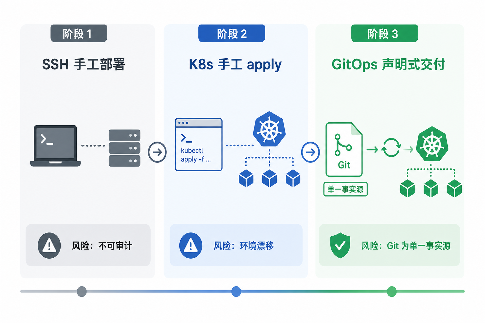
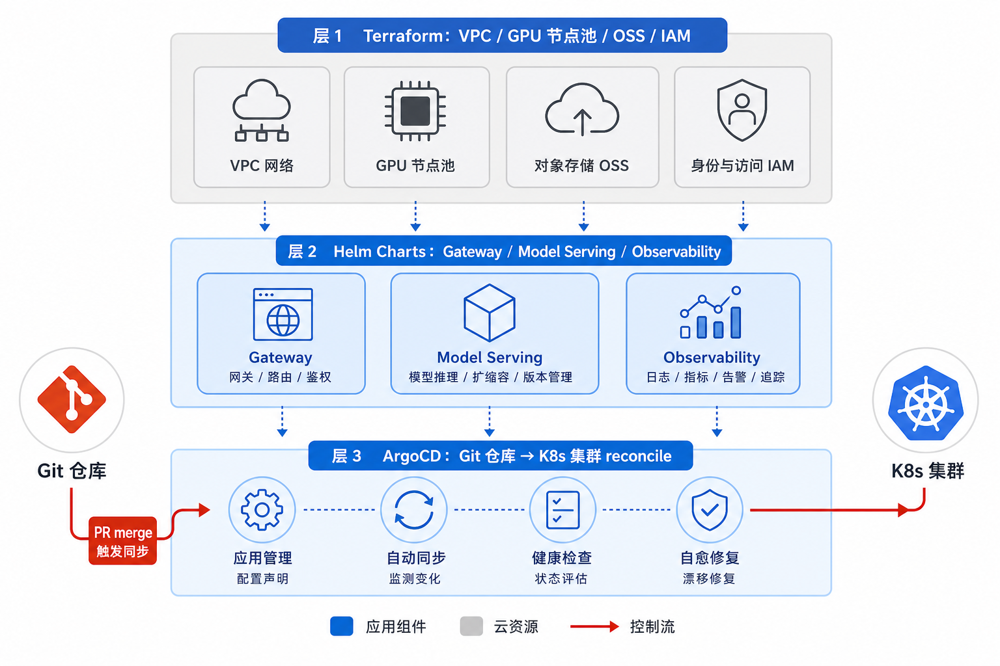
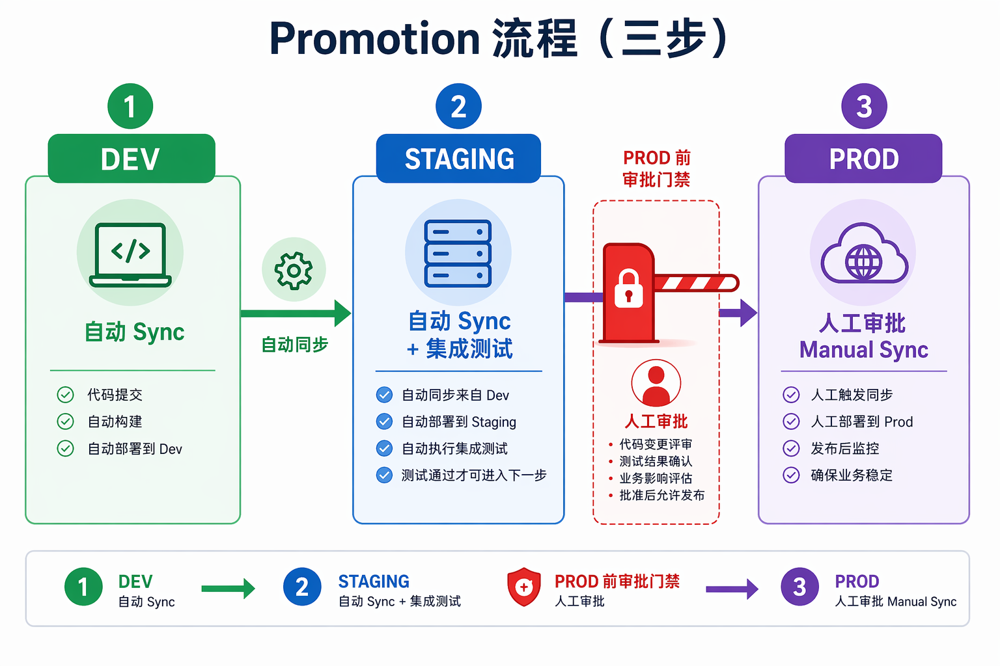
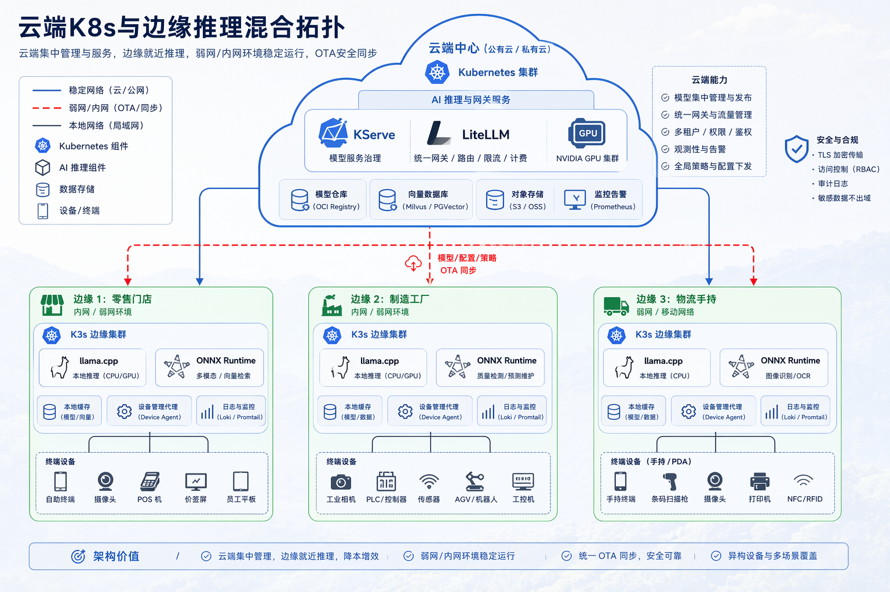

# 第46章 GitOps、IaC 与边缘推理

---

手工部署最大的问题不在速度，而在可重现性：谁改了什么、何时改的、现在与期望状态是否一致，往往说不清。GitOps 和 IaC 把基础设施、模型服务、网关配置和边缘推理节点放进声明式变更流程，让环境漂移、版本晋升和回滚都能被审计。Git 记录期望状态，ArgoCD、Terraform、Helm 等工具执行交付，门店、工厂等边缘节点也应纳入同一治理模型。

生产故障排查结束后，运维人员忘了撤回一次手工 `kubectl edit`。几天后，staging 和 prod 的网关配置已经不一致：灰度比例、租户白名单和模型后端都出现漂移。测试环境通过的发布，到了生产却表现不同，复盘时也找不到对应的 PR。

GitOps 和 IaC 要解决的是可重现性。基础设施、模型服务、网关配置和边缘节点都应进入声明式变更流程，让每一次晋升、回滚和漂移检测都有记录，而不是依赖谁记得自己改过什么。

手工部署的最大问题是状态不可复现。一个临时 `kubectl edit`、一次手工修改网关配置、一个没有记录的 Terraform 变更，都可能让生产环境和仓库中的期望状态分离。Agent 平台涉及模型服务、网关、权限、GPU 节点和边缘推理，这些状态一旦漂移，故障排查会非常困难。

GitOps 和 IaC 把基础设施交付变成可审计流程。Terraform 管云资源和集群基础设施，Helm 管应用和模型服务配置，ArgoCD 负责把 Git 中的期望状态同步到集群。每一次环境晋升、灰度调整和回滚都通过 PR 记录，团队可以知道谁改了什么、什么时候生效、现在是否偏离期望。

边缘推理让这个问题更明显。门店、工厂和私有网络里的节点不一定稳定在线，模型权重、缓存、配置和日志都要有同步策略。若边缘节点靠人工维护，版本差异会长期存在；用户在不同地点得到不同结果，平台却难以追溯。

## 46.1 从手工部署到声明式交付：Agent 平台基础设施演进路径

第43章至第45章分别交付算力、模型服务和网关；第46章回答这些组件如何作为整体交付到 dev、staging、prod，如何保持版本化和可晋升（Promotion），以及门店、工厂边缘如何纳入同一治理模型。没有 GitOps，第44章的 Canary 百分比、第45章的 tenant 白名单、第43章的节点池标签会在三个环境各自漂移。staging 测通过、prod 行为不一致，是最常见的“环境谎言”。

企业 Agent 平台通常经历三阶段演进。早期，工程师 SSH 到 GPU 机器启动 vLLM；随后，团队迁到 Kubernetes + Helm，但仍手工 `kubectl apply`；再往后，Git 仓库声明期望状态，Argo CD（ArgoCD）自动同步到集群。某次生产故障中，运维人员在 prod 集群手工 `kubectl edit` 了 LiteLLM 的 ConfigMap 以排查延迟，排查结束后未改回，导致模型过载与大面积 502。更麻烦的是，没有任何 PR、没有 ArgoCD Sync 记录、没有 Terraform state 变更，复盘无法回答“是谁在何时改了什么”。手工部署的问题不只在速度，更在于不可审计、不可回滚、不可复现。



*图46-1：GitOps 把部署从「操作机器」变成「合并 PR」。来源：本书自绘。Alt text：左侧"手工部署"直接 SSH 改配置无记录，右侧"GitOps"通过 PR 变更声明式配置、CI 校验后自动同步，对比凸显部署从操作变为代码审查。*

图 46-1 的第三阶段，“改生产”的唯一合法路径是 merge 到受保护分支并执行 prod Manual Sync。平台需要同时控制 kubectl 权限和生产变更记录，保证每次生产变更都能追溯到 Git 历史。

### 46.1.1 GitOps 核心机制：声明式配置、Git 为单一事实源、自动同步与漂移检测

GitOps 四原则：

1. 声明式：集群状态由 YAML/HCL 描述，而非脚本 imperative 命令。
2. Git 为 SSOT（Single Source of Truth，单一事实源）：改生产等于合并 PR。
3. 自动同步：ArgoCD/Flux reconcile 期望状态和实际状态。
4. 漂移检测：手工 `kubectl edit` 会被标记为 OutOfSync，并可选择自动修复。

Reconcile 循环是 GitOps 的心跳：ArgoCD 每 3 分钟（默认）对比 Git commit 与集群对象，diff 非空则 Sync 或告警。prod 对 `llm-gateway-prod` Application 关闭 automated sync，但仍持续 diff；OutOfSync 本身就是有人绕过 Git 的信号。

几个术语需要先分清。GitOps 用 Git 驱动部署与变更，关注集群期望状态和实际状态的持续对齐，不等同于只负责构建镜像的 CI。IaC（Infrastructure as Code，基础设施即代码）用代码描述基础设施，覆盖 Terraform、Helm、Kustomize 等不同层级。Promotion 指配置从 dev 晋升到 staging 再进入 prod，不只是镜像 tag 的复制。漂移指集群实际状态与 Git 声明不一致，它和 Canary 流量比例是两个问题：前者说明事实源被绕过，后者说明发布策略仍在执行。

Git 仓库结构（示意，与第44章/45 组件名一致）：

```text
agent-platform-gitops/
├── terraform/           # 云资源：VPC、GPU 节点池、OSS
├── helm/
│   ├── llm-gateway/     # 第45章 LiteLLM
│   ├── model-serving/   # 第44章 KServe InferenceService
│   └── observability/   # 第38章
├── kustomize/
│   ├── overlays/dev
│   ├── overlays/staging
│   └── overlays/prod
└── argocd/apps/         # Application 定义
```

`helm/model-serving` 的 `values-prod.yaml` 里写 `llm-general-32b` 的 `canaryTrafficPercent` 与 OSS URI；`helm/llm-gateway` 的 `values-prod.yaml` 写四个 tenant 的配额与 backend 列表。同一 PR 可以原子变更模型和路由，避免 第44章 已 Canary 20% 而 第45章 仍指向旧 Service 的窗口期。

### 46.1.2 GitOps 交付要守住的工程边界

#### 把 GitOps 简化成“把 YAML 放进 Git”

没有自动 reconcile、没有 PR 门禁、没有密钥分离，就只是把 YAML 当备份。GitOps 至少需要 ArgoCD、分支策略、Promotion 流程和 External Secrets。某次上线中，YAML 已提交 Git 但仍手工 `kubectl apply`，Git 与集群长期 OutOfSync，ArgoCD 上线后第一次 sync 误删了手工创建的 Ingress。这个事故说明，开启 self-heal 之前要先完成 baseline 对齐。

#### 把 Terraform 和 Helm 设成二选一

Terraform 擅长云资源（GPU 节点池、网络、IAM）；Helm 擅长 K8s 应用打包。两者并用：Terraform 产出 `gpu-inference` 节点池与模型 OSS 桶，Helm 部署 KServe 与 LiteLLM。用 Terraform 硬写 Deployment 模板可维护性不如 Helm；用 Helm 创建 VPC 则状态与模块复用差。判断标准应看管理对象，而不是团队偏好的工具。

#### 让边缘推理脱离 GitOps 独立运维

数百家门店各自手工升级 llama.cpp，版本碎片化不可避免。不同区域模型量化版本不一致，同一导购话术回答质量不一，总部也无法复现投诉。边缘同样可以建成 GitOps 的一个 `overlay`，只是同步策略不同：中心 Git 发布 manifest，门店 OTA Agent reconcile，与云端 ArgoCD 采用同一套治理思想。

#### 把 Promotion 简化成镜像 tag 从 staging 推到 prod

Agent 平台 Promotion 主要是 Helm values 与 Terraform 变量的 tag 晋升：`llm-general-32b` 的 OSS URI、`canaryTrafficPercent`、LiteLLM tenant 配额会同步变化。只晋升网关镜像 digest 却遗漏 model-serving values，会出现“新网关旧模型 URI”的隐性漂移；PR 模板应要求列出影响的 Application 列表。

---

## 46.2 IaC 工具链：Terraform 资源编排、Helm Chart 打包与 ArgoCD 持续交付

Part VIII 的交付栈是四层协作：Terraform 管云、Helm 管应用、Kustomize 管环境差异、ArgoCD 管同步。每层都有明确 SSOT 边界，避免用一个 mega-repo 脚本包办所有交付动作。

四层协作要靠接口连接，不能靠人记忆。Terraform 输出的节点池名称、标签、OSS bucket、IAM Role 应作为 Helm values 的输入；Helm 渲染出的 Service 名和 InferenceService 名应被网关 Chart 引用；Kustomize overlay 只表达环境差异，不重新定义业务含义；ArgoCD 只负责把指定 revision 同步到目标集群，不替代 CI 做语义检查。边界清楚以后，排障才能顺着链路走，避免每层都怀疑一遍。

IaC 还要处理“谁可以改什么”。GPU 节点池、模型桶和 IAM 是高风险资源，通常需要平台 owner 和安全团队评审；模型 URI、Canary 百分比和网关租户策略则需要平台与业务 owner 一起评审；观测和告警规则需要 SRE 参与。GitOps 并不会自动带来治理，PR Reviewer、CODEOWNERS、分支保护和 ArgoCD RBAC 才把治理落到日常流程里。

对 Agent 平台来说，声明式配置还承担文档作用。读者看到 `values-prod.yaml`，应能理解生产环境有哪些模型服务、哪些租户、哪些 fallback、哪些边缘 overlay。配置如果只靠变量名堆叠、没有命名规范和注释，GitOps 仓库会变成另一个黑盒。本章强调可审阅、可比较、可回滚的运行假设，而不是要求“所有东西都写 YAML”。

*表46-1：Terraform、Helm Chart 等 IaC 工具的职责与管理对象。来源：本书整理。*

| 工具 | 职责 | 管理对象 | 典型用法 |
|---|---|---|---|
| Terraform | 云资源 CRUD | VPC、节点池、OSS、IAM | GPU 节点池、模型桶 |
| Helm | K8s 应用模板 | Deployment、Service、CRD 值 | LiteLLM、KServe |
| Kustomize | 环境差异 patch | overlay 覆盖 | dev/staging/prod Replicas |
| ArgoCD | Git → Cluster 同步 | Application、AppProject | 分环境 Application |

Terraform state 记录 OSS 桶 ARN 与节点池 ID，Helm values 通过 External Secrets 引用 IAM Role。云与应用的分工清楚后，On-call 看到 InferenceService 拉取 OSS 403，应先查 Terraform IAM module，不要先重启 Pod。



*图46-2：Terraform 管云，Helm 管应用，ArgoCD 管 Git 到集群的 reconcile。来源：本书自绘。Alt text：三层分工，Terraform 管云基础设施资源、Helm Chart 管 Kubernetes 应用配置、ArgoCD 持续比对 Git 与集群实际状态并自动修正，三者协作覆盖从云到应用的全部声明式交付。*

图 46-2 描述四层交付协作：Terraform 声明云资源，Helm 打包 K8s 应用，Kustomize 表达环境差异，ArgoCD 把 Git commit reconcile 到集群。PR merge 是变更进入 prod 的合法触发源。

#### ArgoCD 与 Flux

多事业部、平台 SRE 与各业务运维需要查看 prod diff 与 Sync History，ArgoCD UI 能降低“配置变更”的沟通成本。Flux 适合已经深度使用 GitOps 且无需 UI 的团队。选型时不要只比较工具功能，还要看组织协作方式：如果发布评审需要业务 Owner、平台 Owner 和 SRE 同时查看差异，带 UI 的 ArgoCD 更容易让非平台工程师参与；如果团队全部使用 CLI 和自动化审批，Flux 的轻量模型更合适。

#### 单仓库与多仓库 GitOps

第44章 Canary 与第45章 路由在同一 PR 原子合并，是 monorepo 的核心收益。长期可按 `terraform/` 与 `helm/` 拆库，但 Promotion tag 需要跨库对齐，例如 `prod-v1.2.0` 同时 pin 模型与网关 chart version。仓库拆分不是成熟度本身。拆库以后如果没有统一 release manifest，模型服务、网关和观测配置会各自晋升，最终还是会在生产环境里漂移。

### 46.2.1 平台交付分层：网络、存储、GPU 节点池、模型服务、网关与应用栈

交付顺序应自底向上，与第43章至第45章一致。上层 Application 依赖下层资源 ID 与 Secret，跳层 PR 会在 ArgoCD 报 PreSync hook 失败，或者造成更难发现的静默错误配置。

*表46-2：网络、存储、GPU 节点池等平台各层的组件与交付方式。来源：本书整理。*

| 层 | 组件 | 交付方式 | 依赖 |
|---|---|---|---|
| L0 网络 | VPC、子网、安全组 | Terraform | 无 |
| L1 算力 | GPU 节点池、Device Plugin | Terraform + DaemonSet | L0 |
| L2 存储 | OSS 模型桶、PVC | Terraform | L0 |
| L3 模型服务 | KServe InferenceService | Helm | L1、L2 |
| L4 网关 | LiteLLM | Helm | L3 |
| L5 平台应用 | Agent Runtime、DataAgent | Helm/Kustomize | L4 |
| L6 观测 | OTel、Langfuse | Helm | L5 |

任何一层跳过 PR 直接改集群，都会破坏上层依赖假设。典型反例包括：手工扩大 GPU 节点池 max_size 却没有改 Terraform，导致 Cluster Autoscaler 与 FinOps 标签漂移；手工改 LiteLLM backend 却没有改 Helm，ArgoCD 下次 sync 覆盖回旧配置，On-call 会把它误判为难以解释的间歇故障。

L3 与 L4 的 Helm release 顺序由 ArgoCD Application 依赖或 sync wave 控制：先 `model-serving-prod`，Ready 后再 `llm-gateway-prod`，避免网关指向尚未创建的 InferenceService。

### 46.2.2 环境管理：开发、预发、生产的配置差异、密钥管理与 Promotion 流程

三环境差异远不止“副本数少一半”。模型权重、外部 API 策略、sync 准入都不同，需要在 `values-*.yaml` 与 Kustomize overlay 里显式列出，避免只靠工程师口头约定。

*表46-3：dev、staging、prod 三环境在配置差异与密钥管理上的对比。来源：本书整理。*

| 维度 | dev | staging | prod |
|---|---|---|---|
| GPU 节点 | 1-2 卡共享 | 与 prod 同规格小集群 | 全量节点池 |
| 模型 | 7B 量化 | 与 prod 同权重 | 32B+ 生产权重 |
| 副本数 | 1 | 2 | ≥4 |
| 外部 API | 允许 | 允许（限额） | finance 禁止 |
| 同步策略 | 自动 | 自动 | 手动审批 |

密钥管理的底线是 Git 中永不存明文 Key。平台使用 External Secrets Operator（ESO）从 Vault/KMS 注入，LiteLLM `master_key`、云端 API Key、OSS 凭证均走 Secret 引用。PR 里只有 `secretRef: vault/path/openai-key`，不出现明文。finance 租户的云端 Key 在 Vault 路径级就不存在，与第45章 白名单双重保险。

Promotion 流程为：dev 自动 sync，staging 自动 sync 并跑集成测试（含 第39章 离线 gate 触发），prod 由 Platform Owner Approve 后再执行 ArgoCD Manual Sync。配置 diff 要能复核：ArgoCD `app diff` 与 PR diff 一致。staging 通过后打 tag `prod-v1.2.0`，prod Application `targetRevision` 指向 tag 而非 floating `main`。prod 追固定 tag，避免追 moving head。



*图46-3：生产 Promotion 必须有人工门禁，不能依赖与 dev 相同的自动 sync。来源：本书自绘。Alt text：dev 和 staging 可自动同步，但 prod 入口处标有人工审批门禁，箭头表示只有通过审批才能触发生产 sync，体现生产与低环境差异化的发布节奏。*

图 46-3 强调 prod 与 dev/staging 的 sync 策略差异：前两环境可自动 sync，prod 经人工审批后再 Manual Sync。业务高峰前的 Promotion 窗口应提前安排，例如提前 72 小时把 `llm-general-32b` 的 `minReplicas` 在 staging 压测后随 tag 晋升；prod Manual Sync 安排在业务低峰时段，而非高峰前数小时，避免配置变更与流量尖峰叠加。

### 46.2.3 边缘推理场景：门店终端、工厂边缘节点、离线/弱网与混合云拓扑

某零售企业的平台团队需为数百门店提供离线导购助手；制造工厂内网隔离，质检 Agent 需毫秒级响应；物流 handheld 在移动网络下仍需运单查询。全走云端第45章网关 + 第44章 32B 不可行，弱网 RTT 与断连会打断使用体验。边缘推理是部署位置的延伸，不能变成另一套架构：控制平面仍在中心 GitOps，边缘是特殊 `overlay` + OTA reconcile。

边缘场景特征：

*表46-4：门店、工厂节点等边缘推理场景的约束、模型规模与同步策略。来源：本书整理。*

| 场景 | 约束 | 模型规模 | 同步策略 |
|---|---|---|---|
| 门店导购 | 弱网、隐私 | 3B-7B 量化 | 夜间批量 OTA |
| 工厂质检 | 内网、低延迟 | 7B 视觉语言 | 工单触发更新 |
| 物流手持 | 移动网络 | 3B 文本 | 按区域 CDN 下发 |

门店 llama.cpp 跑 7B Q4，处理“尺码、库存、退换货政策”类高频问答；复杂投诉或跨 SKU 推理回传中心 第45章 网关，走 `llm-general-32b`。回传路径需要断路器，弱网时宁可本地降级答“请稍后联系人工”，也不要无限 hang 中心链路。



*图46-4：边缘节点是 GitOps 的特殊 overlay，不是脱离治理的孤岛。来源：本书自绘。Alt text：云端 Git 仓库通过 overlay 覆盖边缘节点的特殊配置（低端模型、离线缓存），边缘节点仍在 GitOps 同步框架内而非手工维护的孤岛。*

图 46-4 展示中心 GitOps 与三类边缘节点（门店、工厂、物流）的混合拓扑：边缘跑 llama.cpp/ONNX/MLC 小模型，控制面仍由中心 manifest OTA 同步，不能脱离治理。工厂质检 ONNX 模型由中心训练 pipeline 导出，manifest 与云端 KServe 模型采用同一版本号 schema，便于投诉时对齐“边缘 7B 视觉 vs 云端 32B 复核”是否来自同一次发布 train。

#### 边缘与云端的请求分流决策（示意）

*表46-5：各类请求在边缘处理与回传中心的决策依据。来源：本书整理。*

| 请求类型 | 边缘处理 | 回传中心条件 |
|---|---|---|
| 门店 FAQ、尺码库存 | llama.cpp 7B | 置信度低 / 用户要求人工 |
| 工厂视觉缺陷初判 | ONNX 小模型 | 边界样本 / 需 32B 复核 |
| 物流 handheld 单号查询 | MLC 3B | 复杂理赔 / 多轮对话 |
| 全集团 DataAgent NL2SQL | 不回传边缘 | 始终经 第45章→`llm-code-7b` |

回传路径必须带 `edge_store_id` 与 `edge_model_version` Header，中心网关计入 Observability 时区分“边缘 origin”和“纯云端”。FinOps 分摊时，零售门店算力成本与中心 GPU 应分开科目。

### 46.2.4 边缘推理引擎对比：ONNX Runtime、llama.cpp、MLC 与云端模型的协同

*表46-6：ONNX Runtime、llama.cpp 等边缘推理引擎的优势、代价与适用。来源：本书整理。*

| 引擎 | 优势 | 代价 | 适用 | 与云端协同 |
|---|---|---|---|---|
| llama.cpp | CPU/GPU 轻量、量化成熟 | 大模型性能有限 | 门店 7B 以下 | 复杂问题回传网关 |
| ONNX Runtime | 跨框架、推理优化 | 转换链路 | 视觉质检小模型 | 中心训练→ONNX 下发 |
| MLC LLM | 移动端、NPU 加速 | 生态较新 | 手持设备 | 与云端模型分工 |
| 云端 KServe | 最强模型 | 网络依赖 | 非边缘场景 | 边缘 fallback 上游 |

混合策略可以让边缘处理 80% 高频简单请求；超时或低置信度场景回传 第45章 网关，走 32B 云端模型。网络层需要配置断路器，避免弱网拖垮中心。物流 handheld 用 MLC 在 NPU 上跑 3B，回传仅传结构化 JSON 而非整段对话，以节省带宽。

### 46.2.5 GitOps 漂移出现后怎样回到声明状态

GitOps 的失败往往来自组织绕开工具，也可能来自工具本身不可用。Terraform state 没有锁、ArgoCD OutOfSync 被当作噪音、External Secrets 轮换失败、边缘 OTA 半更新，都会让“Git 是事实源”变成一句口号。平台要把这些故障场景写进交付制度，不能让它们停留在某个 SRE 的个人经验里。

漂移最难处理的地方，是它常常以“临时修复”的名义出现。生产告警响起时，直接 `kubectl edit` 一个 ConfigMap 确实最快；问题在于临时修改如果没有回写 Git，就会在下一次 sync 时被覆盖，或者在下一次事故中没人知道集群实际状态已经偏离。GitOps 并不禁止应急操作，但它要求应急操作有编号、有时限、有回写路径。否则手工部署会换一个名字继续存在。

同步冲突也常见于跨 Chart 共享资源。一个 Chart 管 CRD，另一个 Chart 也试图升级同一 CRD；一个团队修改 `model-serving` values，另一个团队同时修改 `llm-gateway` backend；两个 PR 分别在 staging 通过，合到 prod tag 后才互相冲突。更好的处理方式是把依赖关系写进目录结构、sync wave 和 CI 检查里，减少对人工发布协调的依赖。能由机器检查的命名、依赖和版本，不应靠会议记忆维护。

边缘 OTA 的风险与云端不同。云端失败可以回滚到旧 Revision，边缘失败可能发生在弱网、断电和低规格磁盘上。下载不完整的模型文件如果被直接加载，可能表现为回答质量异常或进程随机崩溃，而不一定是启动失败。因此边缘更新必须采用 staging 目录、checksum 校验、原子切换和旧版本保留。中心 inventory 还要看到每个门店当前版本，否则版本碎片化会在投诉复盘时暴露出来。

*表46-7：GitOps 组件的职责边界与故障信号。来源：本书整理。*

| 组件 | 职责 | 输入 | 输出 | 失败模式 |
|---|---|---|---|---|
| Terraform | 云资源 desired state | HCL | 资源 ID | state 锁冲突 |
| ArgoCD | K8s sync | Git commit | Sync 状态 | OutOfSync 未处理 |
| External Secrets | 密钥注入 | Vault | K8s Secret | 轮换窗口失败 |
| Edge OTA Agent | 边缘模型更新 | 制品 manifest | 本地模型版本 | 断网半更新 |

*表46-8：配置漂移、同步冲突、边缘 OTA 中断等失败模式的检测与恢复。来源：本书整理。*

| 失败模式 | 触发条件 | 影响 | 检测方式 | 恢复策略 |
|---|---|---|---|---|
| 配置漂移 | 手工 kubectl edit | Git 与集群不一致 | ArgoCD OutOfSync | 自动 self-heal 或 PR 修复 |
| Helm 值冲突 | 两 Chart 争同一 CRD | 部署失败 | CI helm template | Chart 依赖版本锁定 |
| Git 回滚失败 | revert 合并不完整 | prod 混合版本 | ArgoCD History | 固定 tag 重新 sync |
| 边缘 OTA 中断 | 弱网下载断点 | 边缘模型损坏 | checksum 校验 | 原子切换：下载完再 rename |
| 版本碎片化 | 门店各自升级 | 体验不一致 | 边缘版本上报 | 强制最低版本 + 批量 OTA |

漂移是 GitOps 的异常信号。OutOfSync 说明有人绕过 PR，不能把它当成噪音。prod 是否开启 self-heal 需要谨慎判断。规模化企业的 prod 默认不自动 heal，先告警、人工确认再 sync，避免误 heal 掩盖正在进行的合法紧急操作。紧急操作仍应事后补 PR。

#### 第43章-45 组件在 Git 中的命名约定

*表46-9：第43-45章组件在 Git 中的命名约定与关键 values 字段。来源：本书整理。*

| Git 路径 | 对应章节 | 关键 values 字段 |
|---|---|---|
| `terraform/node-pools/gpu-inference.tf` | 第43章 | min/max_size, labels |
| `helm/model-serving/values-prod.yaml` | 第44章 | storageUri, canaryTrafficPercent |
| `helm/llm-gateway/values-prod.yaml` | 第45章 | model_list, tenantPolicy |
| `argocd/apps/prod/*.yaml` | 第46章 | targetRevision tag |

命名不一致（如网关写 `general-32b` 而 KServe 名 `llm-general-32b`）会在 Promotion 时产生“能 sync、不能调用”的隐性故障。PR 模板应要求 cross-check 服务名与第45章 契约。

---

## 46.3 Terraform、Helm 与 ArgoCD 的交付流水线

完整流水线包括 Terraform plan/apply 节点池与 OSS、Helm CI template 校验、ArgoCD Application 指向 tag、staging 集成测试和 prod Manual Sync。工程师本地禁止 `kubectl apply -f` 直连 prod；dev 集群可例外，但须同名 overlay 回写 Git。

这条流水线的重点是留下变更证据，而不是排列工具顺序。Terraform plan 说明云资源会怎样变化，Helm template 说明 K8s 对象会怎样渲染，ArgoCD diff 说明集群实际状态与目标 tag 差什么，staging smoke 说明关键路径能否跑通，prod Manual Sync 说明谁在什么时候把这次变更放进生产。少掉任何一段，事故复盘都会出现空白。

GitOps 交付还要避免“半自动化”。如果 Terraform 仍然由工程师本地 apply，Helm values 虽然在 Git 里但 prod 由手工 `kubectl apply`，ArgoCD 只做展示不做同步，那么团队只是把复杂性拆散了，并没有降低风险。边界应很清楚：dev 可以快，staging 自动同步并跑测试，prod 人工批准后由 ArgoCD 执行，任何紧急手工操作都要在固定时限内补 PR 并解释原因。

对于 Agent 平台，GitOps 还要解决跨组件原子性。第44章模型权重 URI、第45章网关 backend 列表、第43章节点池上限、第38章观测配置，经常需要在同一发布窗口变化。若它们分散在不同仓库和不同人员手里，平台会出现“模型已升级、网关未切换”“节点池已扩容、FinOps 标签缺失”“观测已改名、告警还查旧指标”等隐性不一致。单仓库或统一 tag 除了让目录更整洁，也给跨层变更提供共同的版本锚点。

变更说明也要按平台链路写。一个 PR 如果只写“更新模型版本”，审稿者很难判断风险；更好的说明应列出：模型权重 URI 变更、离线评测链接、Canary 计划、网关是否需要同步、GPU 节点池容量是否足够、回滚 tag 是什么。这样的 PR 描述本身就是发布记录，日后复盘时不必从聊天记录和临时表格里拼证据。

在 Agent 平台里，配置变更往往就是行为变更。调整 `canaryTrafficPercent` 会改变用户命中的模型版本，修改 `tenantPolicy` 会改变某个事业部能否访问云端模型，替换边缘 manifest 会改变门店离线回答质量。GitOps 评审要检查 YAML 能否渲染，也要检查这次配置变化会改变哪些调用路径、权限边界、成本归因和回滚条件。

#### Terraform GPU 节点池（片段）

与第43章 `gpu-inference` 标签、污点一致，供第44章 InferenceService nodeAffinity 引用。

```hcl
# 示例：GPU 推理节点池（生产工程示例）
resource "cloud_kubernetes_node_pool" "gpu_inference" {
  cluster_id   = cloud_k8s_cluster.agent_platform.id
  name         = "gpu-inference"
  min_size     = 4
  max_size     = 20
  instance_type = "gpu.a100.80g.8xlarge"   # 示意，按云厂商调整

  labels = {
    nodepool  = "gpu-inference"
    workload  = "online-infer"
  }

  taint {
    key    = "workload"
    value  = "online-infer"
    effect = "NoSchedule"
  }
}
```

Terraform Cloud 或 OSS backend 存 state；`terraform plan` 在 PR 评论 bot 展示 diff，merge 后 CI apply staging，prod apply 需双人 approve。

#### ArgoCD Application（片段）

```yaml
# 示例：生产 LiteLLM 网关 Application
apiVersion: argoproj.io/v1alpha1
kind: Application
metadata:
  name: llm-gateway-prod
  namespace: argocd
spec:
  project: agent-platform-prod
  source:
    repoURL: https://git.example.com/agent-platform-gitops.git
    targetRevision: prod-v1.2.0          # 固定 tag，不用 floating branch
    path: helm/llm-gateway
    helm:
      valueFiles:
        - values-prod.yaml
  destination:
    server: https://kubernetes.default.svc
    namespace: llm-gateway
  syncPolicy:
    automated: null                       # prod 禁止自动 sync
    syncOptions:
      - CreateNamespace=true
```

`model-serving-prod` Application 结构类似，`values-prod.yaml` 含 `llm-general-32b` 的 `canaryTrafficPercent` 与 OSS URI。两个 Application 应使用同一 tag 晋升。

#### Kustomize prod overlay（片段）

```yaml
# 示例：prod 环境提高网关副本
apiVersion: apps/v1
kind: Deployment
metadata:
  name: litellm
spec:
  replicas: 4
```

业务高峰窗口 overlay patch `replicas: 8` 与 HPA max，随单独 PR merge 后晋升 tag，而不是临时执行 `kubectl scale`。

#### 边缘 llama.cpp systemd 单元（示意）

```ini
# 示例：门店边缘推理服务
[Service]
ExecStart=/opt/llama-cpp/server -m /var/models/qwen2.5-7b-q4_k_m.gguf --port 8080
Restart=on-failure
Environment=UPSTREAM_GATEWAY=https://llm-gateway.prod.example.com
```

边缘 OTA 的基本流程是：中心 Git 发布 `manifest.json`（model_version、sha256、url）；门店 OTA Agent 夜间下载到 `.staging`，校验通过后 atomic rename 到 `/var/models/active`。这与 ArgoCD reconcile 的原则一致：先对齐期望状态，再切换流量。

#### 验证命令

下面三条命令分别覆盖云资源、Kubernetes 渲染和 GitOps diff。它们不是同一种检查的重复执行：`terraform plan` 看云资源是否变化，`helm template` 看应用对象能否渲染，`argocd app diff` 看目标集群与 Git 期望是否一致。

```bash
terraform plan -out=tfplan          # 云资源变更预览
helm template llm-gateway ./helm/llm-gateway -f values-prod.yaml | kubectl apply --dry-run=client -f -
argocd app diff llm-gateway-prod    # 同步前 diff
```

CI 门禁：`helm template` 失败则 PR 不可 merge；`argocd app diff` 非空则 prod sync 需二次确认。staging 在 merge 后自动 sync，跑 smoke：经网关 ping 四 tenant、`llm-code-7b` NL2SQL 样例、finance 拒绝云端探测。

CI 还应检查命名一致性。KServe InferenceService 名、LiteLLM `model_name`、网关 `api_base`、Trace 标签和文档中的服务名应保持一致。名称不一致往往不会导致 YAML 渲染失败，却会在运行时变成 502、403 或成本报表断裂。可以用轻量脚本检查 `values-prod.yaml` 中的 backend 是否都能在 `model-serving` values 里找到，对 finance 这类租户再检查是否没有外部 backend。

staging smoke 不能停在通用模型 ping。至少要覆盖四类路径：默认对话模型、NL2SQL 代码模型、finance 禁止云端的拒绝路径、fallback 或降级路径。边缘 overlay 也应有自己的 smoke：OTA manifest 可下载、sha256 校验通过、旧版本可回滚、中心 inventory 能看到新版本。这样 prod Manual Sync 前，团队验证的是平台链路，而非某个容器能否启动。

#### model-serving Helm 与 KServe 值文件（片段）

第44章 InferenceService 由 GitOps 管理，而非裸 kubectl。下面的片段只展示会影响模型服务行为的关键字段：模型权重 URI、副本上下限、Canary 百分比和节点池。发布评审时应逐项确认这些字段是否与第43章容量、第45章网关路由和第39章评测记录一致。

```yaml
# 示例：helm/model-serving/values-prod.yaml 片段
inferenceServices:
  llm-general-32b:
    storageUri: oss://agent-platform-models/llm/qwen2.5-32b-awq/v20260301/
    minReplicas: 4
    maxReplicas: 8
    canaryTrafficPercent: 0
    nodepool: gpu-inference
  llm-code-7b:
    storageUri: oss://agent-platform-models/llm/qwen2.5-coder-7b/v20260301/
    minReplicas: 2
    maxReplicas: 4
  embed-bge-m3:
    runtime: triton
    storageUri: oss://agent-platform-models/embed/bge-m3/v20260301/
```

Promotion 时若只改 `llm-general-32b.storageUri`，同一 PR 应更新 第39章 离线评测记录链接，ArgoCD sync 后按 第44章 Runbook 调 Canary。若只更新 URI 而没有评测链接，审稿者无法判断这是等价权重替换、质量升级，还是未经验证的热修。

#### 边缘 overlay 目录结构（示意）

```text
kustomize/overlays/edge-retail-store/
├── kustomization.yaml
├── llama-cpp-config.yaml
└── ota-manifest-ref.yaml   # 指向中心 manifest tag
```

边缘不跑 ArgoCD Server，但 OTA Agent 拉取的 manifest tag 与云端 `prod-v*` 同源。版本出现碎片化时，中心 inventory 可以定位门店落后几个 tag。

### 46.3.1 配置漂移与边缘半更新先查哪里

#### ArgoCD prod 开启 automated sync 导致未审批变更直接上线

- 现象：工程师 merge 到 main，prod 网关配置 5 分钟内变更，业务高峰期间误关 fallback。
- 根因：Application 复制 dev 的 `automated: {}` 到 prod；main 与 prod tag 混用。
- 修复：prod 必须 `automated: null` + Manual Sync；Branch 保护 + 必需 Reviewer；prod 只追 tag。

#### Terraform state 未锁，两人同时 apply 搞乱节点池

- 现象：GPU 节点池 max_size 被覆盖，Cluster Autoscaler 行为异常；第44章 HPA 扩 Pod 无节点。
- 根因：本地 state 文件，无 remote backend；两人 apply 不同 HCL。
- 修复：Terraform Cloud 或 OSS backend + 锁；禁止本地 apply prod；state 变更审计。

#### 边缘 OTA 断点续传未校验 sha256，门店模型文件损坏

- 现象：部分门店导购 Agent 输出异常，文件大小少 200MB。
- 根因：弱网中断后仍加载不完整文件；OTA Agent 未 atomic rename。
- 修复：下载到 `.staging`，sha256 校验通过后才 `mv` 到 active；启动前探针加载 tokenizer smoke test；中心 inventory 上报版本，低于 `min_version` 强制 OTA。

生产交付要把权限、审计和回滚绑定在一起。ArgoCD AppProject 应限制每个 Application 能写入的 Namespace 和资源类型，prod sync 只允许 Platform Owner 或发布机器人执行；Git PR、ArgoCD Sync、Terraform apply 三套记录要能互相对上。一次模型发布如果只在 Git 里看得到 PR，却在 ArgoCD 找不到对应 Sync，说明它还没有进入生产；如果 Terraform apply 没有 run_id，后续就无法解释节点池为什么在某个时间点变大。

成本和性能也要进入 GitOps 记录。Terraform 里的 GPU 节点池必须带环境、事业部和成本中心标签，autoscaling 上下限应随 PR 评审，不能临时改控制台。Helm CI 的 `template` 校验只能证明 YAML 能渲染，不能证明模型能加载；prod Promotion 前仍需在 staging 跑与生产同权重的冷启动、网关、tenant 和回滚 smoke。边缘节点还要上报 `edge_model_version`、manifest tag 和校验结果；中心库存里看不到的边缘版本，等同于不可治理。

灾难恢复的基础是固定版本。prod Application 不追 floating branch，而是追 `prod-v*` tag；回滚时同步到上一个 tag，并保留对应的 Terraform、Helm values 和模型 manifest。`argocd app sync --revision <tag>` 不是万能按钮，前提是旧 tag 里的模型 URI、Secret 引用和边缘 manifest 仍可访问。

漂移处理也要区分紧急变更和违规变更。生产事故中，SRE 可能需要临时 patch 某个副本数或摘掉一个故障 backend；这类操作可以存在，但必须有 incident ID、过期时间和补 PR 要求。没有 incident ID 的 OutOfSync，应按违规变更处理；有 incident ID 但超过时限未回写 Git，也应升级给平台 owner。应急能力可以保留，但不能让应急路径变成长期运维方式。

发布记录应能支撑跨层追溯。一次 finance 合规问题，可能要从网关审计追到 Git PR，再追到 ArgoCD Sync 和 Terraform apply；一次模型延迟问题，可能要从 Trace 追到 KServe Revision，再追到节点池扩容记录。三联审计的目标，是让这些追溯可以在分钟级完成，而非增加流程负担。没有统一字段，复盘会重新回到“谁记得当时改了什么”的状态。

三联审计还要服务日常运营。平台月度复盘可以按 PR 路径统计哪些组件变更最多，按 ArgoCD Sync 记录统计哪些环境最容易失败，按 Terraform apply 记录统计哪些资源经常被临时扩容。若这些信息只能靠人工整理，团队很难发现结构性问题。比如 `llm-gateway` 配额策略每周都在热修，说明配额模型可能不适合业务节奏；`gpu-inference` 节点池频繁临时扩容，说明容量规划或高峰预热流程需要重写。

GitOps 在本书中的作用，是把 Runtime、模型服务、网关、观测和安全这些能力放回可复制的交付流程。这里不展开任意应用部署到 Kubernetes 的通用流程，而关注企业 Agent 平台中特有的变更对象：模型权重、Prompt、ToolSpec、租户策略、GPU 节点池、边缘 manifest 和评测证据。它们共同决定一次 Agent 调用会走哪条路径、看到哪些能力、承担哪些风险。

凡是会改变 Agent 行为、成本、权限或可观测证据的对象，都应进入声明式变更流程。没有这层保障，模型、网关和调度都可能在几次手工修复后偏离原设计。这条原则也适用于后续新增案例和实战项目。

#### 三联审计字段对齐

*表46-10：Trace、审计日志、GitOps 变更记录三系统的必记字段对齐。来源：本书整理。*

| 系统 | 必记字段 | 用途 |
|---|---|---|
| Git PR | author, paths, tag | 谁改了什么配置 |
| ArgoCD Sync | revision, initiator, diff | 何时进集群 |
| Terraform apply | workspace, run_id, resource | 云资源变更 |

三系统 `tenant`/`environment` 标签命名与第45章 一致，便于从 finance 合规审计反查“哪次 PR 放开过云端 backend”。正常情况下不应查到这类记录；如果查到，说明流程已经破损。

---

## 46.7 GitOps 作为发布证据链

GitOps 的价值不只是自动同步配置，而是把生产变更变成可审计证据链。一次模型服务扩容、网关策略调整、密钥轮换或边缘模型下发，都应能从 Git PR 追到 ArgoCD Sync，再追到集群对象和运行指标。这样事故发生时，团队能知道谁改了什么、何时进入生产、影响哪些租户。

IaC 和应用配置要分层管理。节点池、网络、对象存储和 IAM 更适合 Terraform；KServe、LiteLLM、Runtime 和观测组件更适合 Helm 或 Kustomize；租户策略和模型路由可以进入受控 values。混在一个脚本里虽然快，但回滚和审计都会变得困难。分层不是为了目录好看，而是为了让变更责任和回滚粒度清楚。

边缘推理尤其需要 GitOps 纪律。门店、工厂和手持设备常常网络不稳定，模型版本可能分布在多个批次。OTA 过程必须有制品 manifest、checksum、灰度批次和失败回滚。否则中心平台显示已经发布，边缘现场却仍在运行旧模型或半更新模型，用户体验和审计记录都会不一致。

漂移处理要有规则。生产环境不可能完全避免手工修复，但手工修复后必须回写 Git 或通过 PR 恢复声明状态。长期 OutOfSync 会让 Git 失去事实源地位。第43章到第45章定义的算力、服务和网关能力，最终都要通过本章的发布证据链进入生产。

GitOps 的验收标准是漂移可见、回滚可执行、发布可复现。仓库里的配置应能重新构建目标环境，集群里的手工改动应被检测出来，失败发布应能回到上一个已知状态。做不到这些，Git 只是一份备份，而不是控制面。

IaC 也要管理敏感信息边界。API Key、模型凭证、租户密钥和供应商配置不能直接写入仓库，应通过密钥管理系统和环境绑定注入。声明式交付不代表把所有内容明文提交。

对 Agent 平台而言，GitOps 还提供发布证据。模型服务、网关路由、Guardrails 策略和评测门禁都可以通过 PR 串起来。上线后出现问题，团队能从 Git、ArgoCD 和 Trace 中还原变更链路。

GitOps 流程要和评测门禁连接。模型服务、网关路由和 Guardrails 策略的 PR 合并前，应触发对应评测；评测失败时，配置不能进入生产同步。这样 Git 不只是记录变更，也成为质量控制入口。

环境漂移检测要有处理流程。ArgoCD 标记 OutOfSync 后，是自动回滚、提醒责任人，还是允许短期例外，需要按资源类型决定。生产应急修改可以存在，但必须有过期时间和补 PR 流程。否则“临时例外”会变成长期未知状态。

Terraform 状态也要保护。多人同时修改资源、手工改云控制台、状态文件损坏，都会让 IaC 失去可信度。平台团队需要远程状态锁、审计日志和变更评审，避免基础设施层出现无法复现的差异。

边缘节点的 GitOps 要考虑离线。门店或工厂节点可能短时间断网，期望状态无法立即同步。平台要记录节点当前版本、最后同步时间、失败原因和本地回滚策略。用户在边缘环境使用 Agent 时，也应能知道本地模型或配置是否落后。

GitOps 的组织收益在于减少口头交接。新成员可以从仓库、PR 和同步状态理解平台当前形态；审计人员可以看到关键变更的审批和证据；事故复盘可以把运行异常和配置变更对应起来。这比单纯“自动部署”更重要。

声明式配置要覆盖模型和策略，不只覆盖基础设施。模型服务的 Revision、网关路由、租户配额、Guardrails 规则、评测门禁和告警阈值，都可以进入 Git 管理。这样一次业务能力发布对应一组可审查变更，而不是代码、配置和控制台操作分散发生。

PR 模板可以帮助团队提交完整信息。变更目的、影响租户、回滚方式、验证结果、关联评测、上线窗口和风险说明，都应在 PR 中写清。审批人看到这些信息，才有能力判断是否可以合并。没有模板，GitOps 很容易退化成“把 YAML 提上去”。

ArgoCD 同步策略要按环境区分。开发环境可以自动同步，预发环境可以自动同步但保留人工验证，生产环境可能需要手动批准或分批同步。不同策略反映的是风险差异，不是流程复杂度。Agent 平台牵涉数据和模型，生产同步尤其需要节制。

配置回滚还要配合数据回滚。某些变更只改路由，回滚很简单；某些变更重建索引、修改数据库 schema 或更新边缘模型，回滚就需要数据和产物一起处理。PR 中应说明回滚是否可逆，不能默认 `git revert` 就能恢复业务状态。

边缘推理的发布要管理带宽和窗口。模型权重大，门店网络不稳定，工作时段下载可能影响业务。平台可以按区域分批、夜间同步、断点续传，并在节点侧保留旧版本。边缘节点升级失败时，应继续使用上一个可用模型，而不是进入不可用状态。

GitOps 还可以帮助合规审计。审计人员关心的是谁批准了高风险策略、什么时候生效、影响哪些租户、是否通过评测。Git、CI、ArgoCD 和运行 Trace 串起来后，这些问题可以直接回答。手工控制台修改很难提供同样证据。

随着平台扩大，配置仓库也要治理。目录结构、命名、环境覆盖、密钥引用和模块复用需要规范。否则 YAML 数量上来后，团队会在配置仓库里重新制造混乱。GitOps 不是把所有东西放进 Git 就结束，配置本身也要工程化。

CI 检查应覆盖配置语义。YAML 能解析不代表配置正确，网关路由可能指向不存在的模型服务，租户配额可能超过集群容量，Guardrails 策略可能引用已删除字段。提交前的校验应读取平台目录和资源清单，检查这些语义错误。

发布批次要可控。一次 PR 同时修改模型、网关、权限和前端，会让问题定位困难。高风险变更应拆分提交，按顺序验证。GitOps 让变更更容易自动化，也要求团队更自觉地控制变更粒度。

边缘节点还要支持本地观测。中心平台需要知道每个节点的模型版本、配置版本、资源状态和最近错误；节点断网时，本地也要能查看基本状态。否则边缘问题会被误判为模型效果问题或网络问题。

IaC 模块要有版本策略。多个环境复用同一 Terraform 模块或 Helm Chart 时，模块升级会影响所有使用者。平台应记录哪些环境使用哪个模块版本，并通过灰度升级验证。模块复用可以减少重复，也会放大错误。

GitOps 的文化要求是所有人接受 Git 作为事实来源。应急手工修改可以存在，但必须回写；控制台上的临时配置不能长期游离在仓库之外。团队越大，这条规则越重要。否则自动同步和人工修改会互相覆盖，平台状态会失去可信度。

GitOps 还应覆盖灾备环境。主集群故障时，备用环境是否有同样模型服务、网关策略、密钥引用和评测门禁，不能临时确认。声明式配置可以帮助重建环境，但前提是依赖、镜像、权重和状态都可获得。灾备演练应验证这些假设。

配置仓库里的评审责任要清楚。基础设施变更由平台团队审批，模型路由变更需要模型和业务共同确认，安全策略变更需要安全团队参与。所有 YAML 看起来相似，但风险不同。CODEOWNERS 或目录级审批规则能把责任落到具体团队。

GitOps 与运行态之间要有反馈。ArgoCD 显示同步成功，不代表服务健康；Terraform apply 成功，也不代表业务可用。发布后还要看模型服务指标、网关错误率、评测结果和用户流量。期望状态和运行状态同时通过，才算交付完成。

GitOps 还要和变更日历结合。多个团队同时发布模型、网关和数据契约时，单个 PR 都可能正确，合在一起却造成事故。平台可以维护共享变更日历，把高风险窗口、冻结期和依赖顺序展示出来。这样发布冲突会在合并前暴露，而不是在生产环境里相互影响。

运行态漂移的例外要有生命周期。应急修改可以允许几个小时或一天，但到期后必须回到 Git 管理。例外记录应包含原因、批准人和恢复方式。没有生命周期，GitOps 的事实来源会被一点点削弱。

GitOps 仓库也要避免过度抽象。模板层级太多，审查人看不出最终配置；重复 YAML 太多，又难以维护。平台应在复用和可读之间取平衡，保证关键变更能在 PR 中直接看懂。

自动化回滚也要有边界。无状态配置可以快速回滚，涉及数据迁移、模型索引和边缘节点的变更则需要人工确认。把所有失败都自动回滚，可能造成更大不一致。回滚策略应按资源类型定义。

配置评审还要保留最终渲染结果，方便审批人看到真实生效内容，而不是只看到模板参数。

这种反馈能让 GitOps 从配置同步，进一步变成可复盘的交付机制。

交付机制可复盘后，平台团队才能稳定扩大自动化范围。

这种机制能减少发布后再补证据的情况。

配置治理还要定期清理废弃环境和过期模块，避免仓库规模增长后难以审查。清理本身也应通过 PR 完成，保留影响范围和回滚说明。

## 本章小结

GitOps 把 Agent 平台交付从手工操作改为 PR 驱动的声明式 reconcile。Git 是 SSOT，ArgoCD 是执行器；Terraform 管云资源，Helm 管应用包，Kustomize 管环境差异，ArgoCD 管同步过程，四层职责不能互相替代。对 Agent 平台来说，声明式交付的对象也不只是 Deployment 和 Service，还包括模型 URI、网关路由、租户策略、ToolSpec、GPU 节点池、边缘 manifest 和评测证据。

生产 Promotion 必须有人工门禁，密钥不能进入 Git，应通过 External Secrets 等机制注入。边缘推理是 GitOps 的特殊 overlay，需要 OTA、checksum 和版本 inventory，不能成为治理盲区。漂移、sync 策略误配、state 锁缺失和 OTA 半更新，应由 CI、审计和 Runbook 共同覆盖。发布流程可以更严格，但目标很具体：让“谁改了什么、何时进入哪个环境、出问题能否回到哪个版本”这些问题都有可查证据。


## 参考文献

HashiCorp. (n.d.). [Terraform documentation](https://developer.hashicorp.com/terraform/docs).

Helm. (n.d.). [Documentation](https://helm.sh/docs/).

Argo CD. (n.d.). [Documentation](https://argo-cd.readthedocs.io/).

ONNX Runtime. (n.d.). [Documentation](https://onnxruntime.ai/docs/).
