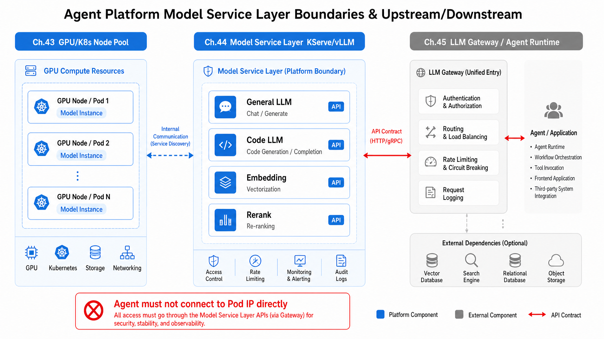
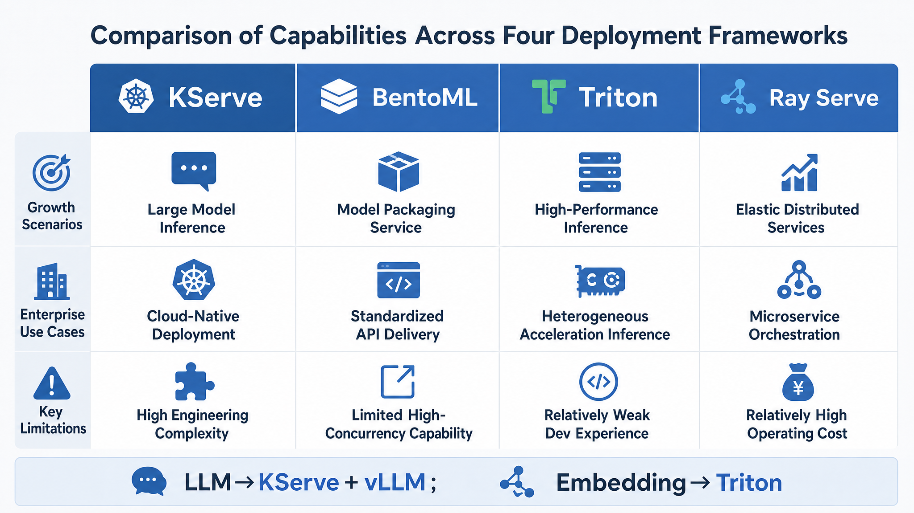
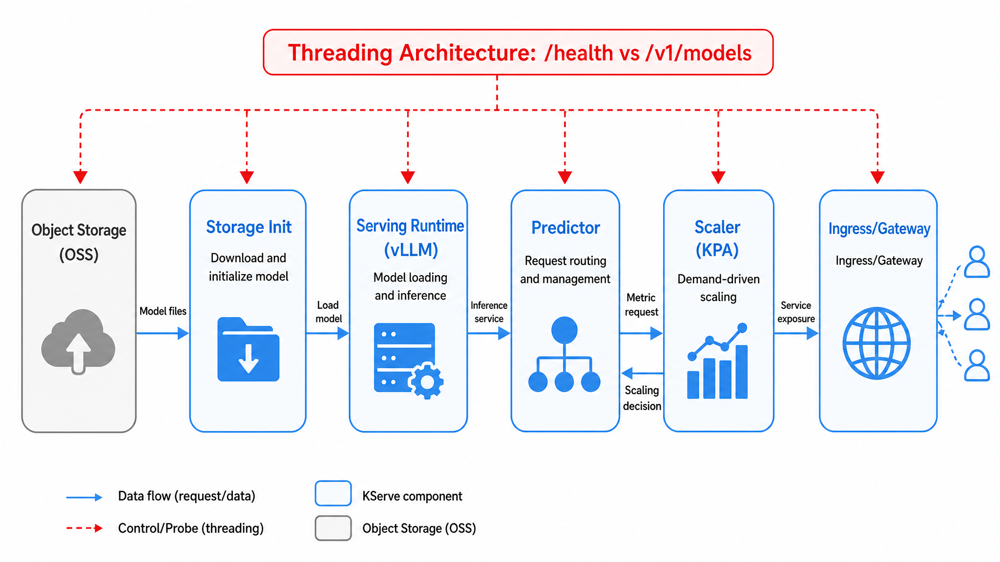
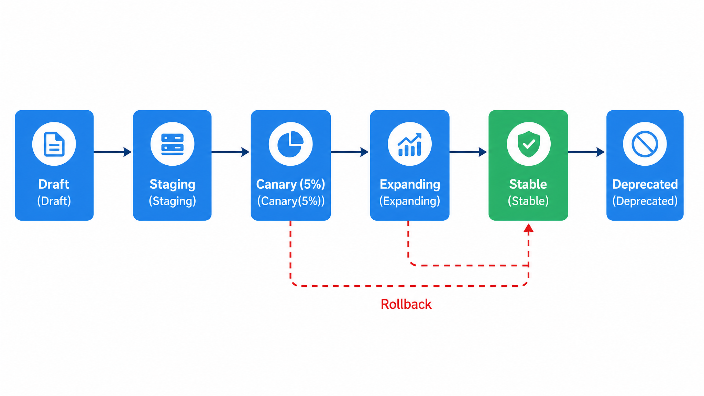

# Chapter 44 Model Deployment

---
The model serving layer must remain independent of business Agents. Model upgrades, weight switches, canary releases, and rollback follow their own cadence, and coupling them to application releases creates avoidable production risk. A model deployment pipeline has to cover images, weights, service configuration, rolling upgrades, canary release, rollback, and multi-environment promotion.

In one NL2SQL batch incident, the Agent Runtime connected directly to the internal IP of a vLLM Pod. After HPA scaled the Pod down and rebuilt it, the IP changed while the Runtime configuration stayed the same. The model had not degraded and the GPU was healthy. The failure came from business code bypassing the model serving boundary. The model serving layer should converge weights, images, GPU nodes, readiness probes, canary release, and rollback into a stable API. Runtime code should not know which node hosts the inference process, nor should it depend on weight paths or container digests.

Model deployment is therefore about turning a model into a stable, upgradeable, and rollbackable production interface. Running vLLM or SGLang on one machine verifies capability. Enterprise deployment also has to handle images, weights, GPU nodes, readiness probes, streaming connections, canary traffic, and multi-environment promotion. Business Agents should not see these details. Without a model serving layer, failures become hard to classify: Runtime connects to a Pod IP that changes after rebuild; a model version changes output format and affects every Agent at once; embedding and long-context LLM traffic share one GPU and suddenly raise P99 latency. The model may be fine. The deployment unit failed to provide a stable API.

Enterprise model releases should treat weights, runtime image, and key parameters as immutable versions. A release is not a YAML edit. It creates an identifiable Revision that passes probes, evaluation, canary gates, and rollback checks. Only then can the Chapter 45 gateway route by service name instead of exposing the underlying inference process to business applications.

---
## 44.1 Why the Agent Platform Needs a Separate Model Serving Layer

Chapter 6 explains how to run vLLM and SGLang on a single machine; Chapter 43 covers GPU allocation and the partitioning of `gpu-inference` node pools. However, the gap between "having GPUs to run models" and "production readiness with controllable deployment, rollout, and rollback" requires an additional layer: the **Model Serving Layer**. This layer wraps inference engines into stable, observable, and publishable API endpoints: upstream, it provides targets for the LLM Gateway covered in Chapter 45; downstream, it consumes the GPU quotas allocated per Chapter 43. The Agent platform should only know the "model service name + version + contract," without needing to know the path of the weight files in OSS or the runtime container digest.

For instance, when troubleshooting batch NL2SQL errors, operations found the root cause was not model degradation but that the Agent Runtime directly connected to the internal IP of the vLLM Pod. After the HPA in Chapter 43 scaled down and rebuilt the Pod, the IP changed but the Runtime configuration was not updated. This type of failure illustrates a hard rule: **Agent Runtime must never know which node a Pod runs on or which IP the inference process listens to.**

From the perspective of multiple business units using the Agent platform, the value of the model serving layer differs but the boundaries remain consistent:

- **Retail**: Customer service agents during peak promotions rely on `llm-general-32b`; canary releases must not interrupt high-concurrency streaming sessions.
- **Manufacturing**: DataAgent's SQL generation uses `llm-code-7b`; code models must be released independently from general models to avoid a single upgrade impacting both pipelines.
- **Finance**: Compliance requires sensitive conversations to only use the local `llm-general-32b`; the serving layer must prove that 100% of traffic within a certain timeframe hit the local revision.
- **Logistics**: Shipment parsing agents batch run embedding reconstruction at night; RAG indexes and LLM models must scale independently to prevent trailing latency.

A sample model service list for an enterprise Agent platform (illustrative; aligns with the node pools in Chapter 43 and routing rules in Chapter 45):

*Table 44-1: Engines, usage, and default replicas of model services on the mini-platform. Source: compiled in this book.*

| Service Name         | Engine  | Usage                  | Default Replicas |
|----------------------|---------|------------------------|------------------|
| `llm-general-32b`    | vLLM    | General dialogue, Agent planning | 4 |
| `llm-code-7b`        | SGLang  | SQL/Python generation  | 2                |
| `embed-bge-m3`       | Triton  | RAG Embedding          | 2                |
| `rerank-bge-v2`      | Triton  | Retrieval reranking    | 1                |

This table is not a "model catalog" but a **release unit list**: each service name maps to an independent InferenceService, independent Canary strategy, and independent SLO with FinOps billing tags. The `model` field in the gateway from Chapter 45 ultimately maps to these service names, not the URL of a specific vLLM process.



*Figure 44-1: The model serving layer is the stable API boundary between GPU compute and Agent calls. Source: drawn in this book. Alt text: the intermediate model serving layer interfaces downward with GPU resources and upward provides stable APIs to Agents, arrows indicate that underlying compute or model changes are abstracted by the service layer without affecting upper-level calls.*

Key boundary points from Figure 44-1: Chapter 44 manages "how models run and are released"; it does not handle "request routing and rate limiting" (Chapter 45) or "GPU allocation" (Chapter 43). Readers should understand this middleware layer as the **first stable API above compute resources**: Chapter 43 guarantees "an A100 GPU is bound to an inference Pod within 60 seconds"; Chapter 44 guarantees "the Pod exposes only `/v1/chat/completions` and a clear `/ready` semantic once ready"; Chapter 45 adds tenancy, quotas, and compliant routing on top.

### 44.1.1 Model Service Types: Online Inference, Batch Inference, Embedding Services, and Multi-Model Coexistence

Multi-model coexistence is the norm - not a transitional phase - on Agent platforms. Mixing general dialogue, SQL generation, and embedding in the same inference process commonly leads to: high QPS small-batch embedding workloads competing with the LLM's long-context generation over the same KV cache and CUDA streams, causing P99 latency spikes. The issue often is not insufficient total GPU but the **lack of service type segregation**.

*Table 44-2: Characteristics and deployment strategies of model service types including online, batch, and embedding. Source: compiled in this book.*

| Type              | Characteristics                 | Typical Scenarios                   | Deployment Strategy             |
|-------------------|--------------------------------|-----------------------------------|--------------------------------|
| Online Inference  | Low latency, streaming, long-lived connections | Customer service agents, DataAgent conversations | Canary + fast rollback          |
| Batch Inference   | High throughput, asynchronous, queuable | Benchmark batch runs, offline reports | Blue-green or rolling upgrades  |
| Embedding         | Fixed input dimension, high QPS | RAG index rebuilding              | Dual-version parallel, then switch |
| Multi-model routing pre-filter | Gateway selects model (Chapter 45) | Cost/compliance routing           | Independently deployed backend  |

**Online inference** supports real-time Agent Runtime conversations. Streaming connections often last several minutes; releases must consider `terminationGracePeriodSeconds` and align with Chapter 45 gateway timeouts - otherwise users will see truncated partial sentences during Canary shifts. **Batch inference** goes through Volcano queues (Chapter 43's `gpu-batch`); month-end benchmark runs permit queueing but must not share pools with online inference to avoid OOM. **Embedding** outputs fixed-length embeddings; if weight versions mismatch the index, retrieval silently fails, which is more dangerous than a 503 error. **Multi-model routing** happens in Chapter 45, but each backend remains an independently deployable InferenceService per Chapter 44; for example, Finance requires sensitive data only on local `llm-general-32b` while Retail promotions may use cloud fallbacks - this is a gateway routing policy, not a matter of embedding multiple URLs in one deployment.

*Table 44-3: Definitions and distinctions of core concepts related to model deployment. Source: compiled in this book.*

| Concept           | Definition                                         | Difference From Related Concepts          |
|-------------------|---------------------------------------------------|-------------------------------------------|
| Model Service     | Inference deployment unit exposing stable external API | Different from bare vLLM process          |
| Serving Runtime   | Container image and startup parameters for inference | Different from training job                |
| Predictor         | KServe component receiving traffic and calling runtime | Different from Kubernetes Deployment name |
| Model Version     | Immutable combination of weights + runtime parameters | Different from Git code version             |

Serving Runtime defines **how the model runs**: vLLM OpenAI Server mode, tensor parallel size, quantization format. Predictor defines **how traffic is received**: HTTP/gRPC, readiness probes, integration with KServe traffic splitting. Model version is an **immutable release artifact**: e.g., the combination of digest for `qwen2.5-32b-awq` weights + runtime image tag + parameters like `max_model_len`. Editing one line of YAML in Git does not constitute a new version until a new InferenceService Revision is created and passes Canary gates.

### 44.1.2 Three Architecture Judgments Before Model Serving

#### Docker Compose Is Suitable Only for Local Development

Compose is fine for local development - engineers run vLLM on a single GPU laptop to iterate prompts and Agent logic. This does not conflict with production needs. However, production requires readiness probes, rolling upgrades, autoscaling, traffic splitting, and metrics collection - features that Compose does not provide. A common failure pattern is config drift between Compose and Kubernetes, causing "runs fine locally but OOMs in production": local flags like `--gpu-memory-utilization 0.9` under Compose don't declare memory limits in Kubernetes, Sidecar and tokenizer threads saturate node resources; single-user no concurrency locally hides 32B long-context KV cache OOM under production peak. Compose is a **development accelerator**, not a **release system**; Chapter 46's GitOps delivery target should be KServe InferenceService, not docker-compose.yml.

#### A/B Testing Requires Request-Level Consistency

Model A/B requires **request-level consistency** (same user/session must hit the same version to avoid abrupt style changes), **metric alignment** (latency, error rate, business KPIs measured on the same query sets), and **safe rollback** (e.g., 5% Canary errors trigger one-click reversion to previous Revision). Simple random 50% split confuses evaluation: mixing versions within a session causes user perception of fluctuating quality. Correct practice: gateway or serving layer routes stickily by `session_id`, and offline gates (Chapter 39) must approve before Canary promotion.

#### Embedding and LLM Services Should Be Deployed Independently

Embedding and generative LLM workloads differ greatly in resource profiles, batch size, and latency distribution. Embedding involves fixed-length, high QPS, small batches; LLM involves variable-length output, streaming, and KV cache sensitivity. Co-location degrades tail latency for LLMs - GPU utilization charts may look good, but P99 TTFT (Time To First Token) will be out of control. In practice, embedding and LLM should be separated into independent InferenceServices (e.g., `embed-bge-m3` and `llm-general-32b`), each with independent HPAs and separate OSS version directories.

---
## 44.2 Deployment Framework Comparison: KServe, BentoML, Triton Inference Server, and Ray Serve

Choosing a model deployment framework essentially answers: **Who handles Kubernetes integration, who manages multi-model concurrency within the same process, and who handles native Python orchestration?** There is no "one true answer," only the best fit based on load characteristics and team operational capabilities.

*Table 44-4: Applicability and Non-Applicability Scenarios for Deployment Frameworks like KServe, BentoML, Triton. Source: Compiled by this book.*

| Type                 | Representative | Why Use It                                   | Not Suitable For              | Alternative                    |
|----------------------|----------------|----------------------------------------------|------------------------------|-------------------------------|
| K8s Native Serving   | KServe         | InferenceService CRD, traffic splitting, auto scaling, OpenAI compatibility | Non-K8s environments          | BentoML + custom gateway       |
| Model Packaging      | BentoML        | Multi-framework packaging, consistency from local to production | Complex multi-model traffic governance | KServe, Seldon                |
| High-Performance Inference | Triton          | Embeddings, multi-model same-process, dynamic batching | Rapid prototyping            | Direct vLLM connection         |
| Distributed Orchestration | Ray Serve      | Native Python, integrated with Ray ecosystem     | Operations teams without Ray experience | KServe + standalone Deployment |

KServe's value lies in its integration with the Kubernetes ecosystem described in Chapter 43: InferenceService declaratively sets `canaryTrafficPercent`, affinity to GPU nodes, and domain-specific operations with HPA/KPA. BentoML suits the experimental-to-production path of "one data scientist packaging, one place running," but LLM traffic governance and multi-Revision rollbacks are still best handled at the KServe CRD level. Triton is mature for embedding and reranking dynamic batching; loading multiple small models in a single process consumes less GPU memory compared to many vLLM pods. Ray Serve remains an optional path for DataAgent **large batch analysis**  -  sharing clusters with Ray training jobs to reduce data transfer, but platform SRE runbooks default to KServe operations.



*Figure 44-2: Deployment framework selection by workload type, rather than forcing one framework on every job. Source: Self-drawn by this book. Alt text: Online inference, batch inference, and multi-model coexistence workloads respectively connect to more suitable frameworks (KServe, BentoML, Triton), reflecting workload-based selection rather than one-size-fits-all.*

Reading Figure 44-2: the horizontal comparison shows "capability boundaries," not benchmark rankings. The primary LLM path uses KServe because Chapters 44 and 46 require Canary releases, Revision retention, and GitOps declarative publishing all implemented within the same CRD; Embeddings use Triton because their workload characteristics differ from LLMs, and forcing a single framework increases operational complexity.

Our recommended selection: **LLM online inference via KServe + vLLM/SGLang Runtime**; **Embedding/Rerank via Triton**; **DataAgent batch analysis keeps Ray Serve as optional path**. Chapter 45's LiteLLM gateway `api_base` uniformly points to the KServe service name, avoiding framework-specific ports.

#### Mapping Framework Choices to Business Unit Workloads

Applying framework decisions to four characteristic business lines avoids the formality of "company-wide uniform framework KPIs":

- **Retail**: `llm-general-32b` supports high-streaming QPS; KServe + vLLM with KPA and Canary form the core of peak-hour operations playbook; Triton is not involved in dialog pipelines.
- **Manufacturing**: `llm-code-7b` is more sensitive to TTFT; SGLang Runtime runs in independent InferenceServices, versioned separately from general models; DataAgent batch analysis optionally uses Ray Serve, sharing the node pool with Chapter 43's `gpu-batch` queue.
- **Finance**: Local `llm-general-32b` requires Revision audit and traceability; KServe's `status.traffic` field serves as part of compliance evidence for "no cloud backend" (complemented by routing in Chapter 45).
- **Logistics**: `embed-bge-m3` nightly index rebuild leverages Triton's dynamic batching to improve throughput; Rerank uses single replica, but the OSS version must be promoted in the same PR as the indexing task (Chapter 46).

Framework migration cost should also be included in selection: migrating from bare Deployment to KServe primarily involves converting traffic splitting, probes, and OSS URIs into InferenceService definitions, not changing the inference engine itself  -  Part II standardized vLLM/SGLang, and Chapter 44 focuses on **service encapsulation**.

### 44.2.1 Model Service Architecture: Collaboration among Serving Runtime, Predictor, Scaler, and Storage Volumes

Starting a single `llm-general-32b` pod in KServe semantics is a pipeline: weights on object storage -> pulled by Init Container or Runtime -> loaded into CUDA -> Predictor receives traffic -> Scaler reads metrics for scaling. Any step's "false readiness" can cause cascading 502/503 errors at the gateway layer in Chapter 45.

Core components of KServe InferenceService:

*Table 44-5: Responsibilities, Inputs/Outputs, and Failure Modes of Serving Runtime, Predictor, etc. Source: Compiled by this book.*

| Component       | Responsibility           | Input               | Output        | Failure Modes                    |
|-----------------|--------------------------|---------------------|---------------|---------------------------------|
| Serving Runtime | Load model, execute inference | Model URI, startup parameters | Inference API | Model download failure, CUDA mismatch |
| Predictor       | Receive HTTP/gRPC requests | Request body, headers | Response stream | Receiving traffic before Runtime ready |
| Transformer (optional) | Pre/post-processing    | Raw input            | Runtime input format | Preprocessing timeout           |
| Scaler          | Scale replicas by QPS/concurrency | Metrics           | HPA/KPA actions | Over-scaling during cold starts  |
| Storage Init    | Pull weights from object storage | S3/OSS URI         | Local volume  | Network interruptions, permission denial |

Model weights usually mount from object storage (e.g., internal OSS bucket `models/` prefix), pulled by Init Container or runtime. 32B AWQ weights ~18GB, internal network pulls take 3-6 minutes; 70B+ cold starts can take 5-15 minutes  -  **readiness probes must distinguish "process alive" from "able to serve inference."** `/health` only means Python process is listening; `/ready` (or vLLM's `/v1/models` returning the target model id) means weights loaded and KV cache allocator initialized.

Scaler must coordinate with node pool capacity from Chapter 43: If KPA scales pods on TTFT spikes but `gpu-inference` pool has no spare nodes, new pods remain Pending long-term, causing Canary to misjudge that "new version error rate is low" because it receives no traffic. Runbooks should require checking Cluster Autoscaler slack before Canary, and keep `minReplicas` above zero during peak business windows.



*Figure 44-3: Weight loading, runtime readiness, and traffic admission are three distinct control points. Source: Self-drawn by this book. Alt text: Three separate gates in deployment workflow - weight load complete, runtime healthy and ready, formal traffic admission - with arrows showing sequential dependency to avoid accepting traffic before readiness.*

Figure 44-3 separates these controls: **Pull complete != Load complete != Accept traffic.** In one deployment, readiness probe was configured at `/health`, causing pods to enter service endpoints during OSS disconnect retries; DataAgent batch requests hit half-loaded pods, increasing error rates though GPU metrics showed normal utilization because failure happened during loading before inference began.

### 44.2.2 Version Management and Release Strategies: A/B Testing, Canary, Blue-Green, and Rollback Contracts

Model releases differ from application releases: an image change without weight URI change, or a weight change without Runtime parameter change, may change token distributions and latency profiles. Release strategies should bind to **state machines** to avoid "engineers running `kubectl patch` to declare a release."

*Table 44-6: Mechanisms, Advantages, and Costs of A/B, Canary, Blue-Green Release Strategies. Source: Compiled by this book.*

| Strategy    | Mechanism               | Advantages          | Cost                      | Suitable For              |
|-------------|-------------------------|---------------------|---------------------------|---------------------------|
| Rolling Release | Replace pods one by one | Simple              | Short period of mixed versions | Embeddings, low-risk models |
| Canary      | 5% -> 20% -> 100% traffic | Risk controlled     | Requires traffic splitting and metrics | Main LLM models          |
| Blue-Green  | Switch between two full stacks | Fast rollback     | Double GPU cost           | Major version upgrades     |
| A/B         | Run two versions in parallel long-term | Business KPI comparison | Complex governance        | Model effect experiments   |

`llm-general-32b` main model uses Canary; `embed-bge-m3` uses parallel two-version runs  -  new and old each at 50% for 24 hours; after validating metrics with index rebuild job, traffic switches to 100%. Finance forbids revisions entering Canary without passing staged offline evaluation (Chapter 39).

Release state machine:

*Table 44-7: State Descriptions of Version Management and Release Strategies: A/B Testing, Canary, Blue-Green, and Rollback Contracts. Source: Compiled by this book.*

| State      | Entry Condition         | Next State           | Failure Handling            |
|------------|------------------------|----------------------|----------------------------|
| Draft      | Image build complete    | Staging              | Discard if tests fail      |
| Staging    | Pass offline evaluation (Chapter 39) | Canary                 | Block if metrics fail       |
| Canary     | 5% traffic              | Expanding / Rollback | Auto rollback on error rate ↑ |
| Expanding  | 20%->50%->100% traffic    | Stable               | Manual approval gate       |
| Stable     | Full traffic and no alerts | Deprecated          | Keep N versions for rollback |
| Rollback   | Trigger condition met   | Stable (old version) | Record incident postmortem |

Rollback must be a **one-click operation at Revision level**: KServe keeps the previous Stable Revision for 7 days, setting `canaryTrafficPercent: 0` and pinning the old `storageUri`/image digest, avoiding new Helm installs. In one Canary 20% stage, TTFT SLO alarms triggered platform rollback within minutes because ArgoCD Application (Chapter 46) and InferenceService revision history audit fields were aligned.

At release review meetings, architects often ask three questions  -  **Who approves, offline gating evidence, rollback duration**  -  the state machine structures these answers to prevent "we say rollback works but can't find old Revision onsite."



*Figure 44-4: Canary releases split "full switch" into multiple observable and rollbackable gates. Source: Self-drawn by this book. Alt text: Traffic increases staged from 1%, 5%, 25% to 100%, each step gated by observation and rollback, arrows indicate metric pass to next stage, otherwise rollback.*

Figure 44-4 models the release workflow as a state machine: Draft->Staging->Canary->Expanding->Stable->Deprecated; Rollback from Canary/Expanding clicks back to old Stable Revision, avoiding skipping offline gates for direct full switch.

#### KServe Native Canary and Service Mesh

*Table 44-8: Version Management and Release Strategy Trade-offs: A/B Testing, Canary, Blue-Green, Rollback Contracts. Source: Compiled by this book.*

| Option                | Advantages                     | Cost                    | Applicable Scenario          | This Book's Recommendation   |
|-----------------------|-------------------------------|-------------------------|-----------------------------|------------------------------|
| KServe built-in traffic split | Integrated with InferenceService, YAML declarative | Limited advanced traffic controls | Standard LLM serving          | Recommended for large-scale enterprises |
| Istio/Envoy weighted routing | Fine-grained, cross-service | Complex ops, additional layer | Teams with mature Mesh       | Optional for enhancement      |

Default to KServe built-in split because Chapter 44's traffic percentages and Revisions share the same CRD, making GitOps diffs readable. Istio suits full-Mesh environments doing cross-namespace or cross-cluster weighted routing, but LLM scenarios usually only need 5/20/50/100 stages  -  introducing sidecar latency and mTLS debugging costs must be carefully evaluated.

#### Baking Weights Into Images Versus Pulling on Startup

*Table 44-9: Version Management and Release Strategy Trade-offs: A/B Testing, Canary, Blue-Green, Rollback Contracts. Source: Compiled by this book.*

| Option                | Advantages                     | Cost                    | Applicable Scenario          | This Book's Recommendation   |
|-----------------------|-------------------------------|-------------------------|-----------------------------|------------------------------|
| Pull on startup       | Smaller images, update weights without image rebuild | Slow cold start           | 70B+ large models            | Recommended for main LLM path|
| Baked-in              | Fast startup                  | Huge images, slow build | Models under 7B              | Optional for Embedding         |

Baking 32B weights in leads to images >20GB, pulling offsetting startup speed gains. LLMs adopt "pull on startup + immutable OSS version directory"; 7B embedding models may bake-in weights in dev for iteration speed. Pre-peak scaling per Chapter 43 allows pulling/loading before traffic surge.

### 44.2.3 Inference Service Interface Contract: OpenAI Compatible API, Health Checks, Readiness Probes, and Graceful Shutdown

Contracts between agent platforms and runtime teams should stabilize as OpenAI compatible subsets  -  Chapter 45's gateway abstracts backend accordingly, runtime hard-codes parsing logic accordingly, and Observability (Chapter 38) standardizes token counting. Contract changes require versioned reviews rather than silent field changes in minor vLLM releases.

```text
GET  /v1/models
GET  /health          # process liveness
GET  /ready           # model loaded, ready to serve (recommended custom)
POST /v1/chat/completions
  Request:  { model, messages, stream, max_tokens, ... }
  Response: { id, choices, usage, ... } or SSE stream
  Errors:   { error: { code, message, type }, retryable: bool }
```

The `id` returned by `/v1/models` must match the `model_name` in Chapter 45's routing table (e.g., `llm-general-32b`), or the gateway will reject with `502 BACKEND_UNAVAILABLE` and runtime debugging is difficult. `retryable` differentiates transient errors (upstream overload) from unrecoverable ones (context length exceeded).

Probe config example:

```yaml
# Example distinguishing liveness and readiness
livenessProbe:
  httpGet:
    path: /health
    port: 8000
  initialDelaySeconds: 30
readinessProbe:
  httpGet:
    path: /ready      # returns 200 only after vLLM load complete
    port: 8000
  initialDelaySeconds: 120
  periodSeconds: 10
```

Graceful shutdown: on SIGTERM stop accepting new connections, wait for in-flight requests to finish (`terminationGracePeriodSeconds` recommended >=120s for LLM), then unload models. Stream connections not finishing within grace period will be SIGKILL'd by K8s  -  in one production environment a high volume of 499s appeared due to 60s grace and P99 stream durations of 90s. PreStop hooks can remove pods from service endpoints, then sleep 30s to allow Chapter 45 gateway connection pools to update.

### 44.2.4 Integration With Inference Engines: Containerization and Resource Profiles for vLLM, SGLang, and TGI

Chapter 6 introduces engine characteristics; Chapter 44 focuses on **whether resource declarations post-containerization match real resource usage**. Both underestimating CPU/memory and overestimating GPU are common.

*Table 44-10: GPU Declarations and Typical Environment Variables for Containerized vLLM, SGLang, TGI. Source: Compiled by this book.*

| Engine  | Containerization Notes          | GPU Declaration       | Typical env                      |
|---------|--------------------------------|----------------------|---------------------------------|
| vLLM    | OpenAI server mode              | 1-8 cards (TP/PP)    | `VLLM_TENSOR_PARALLEL_SIZE`     |
| SGLang  | Low latency, RadixAttention    | 1-4 cards            | `SGLANG_MEM_FRACTION_STATIC`    |
| TGI     | HuggingFace ecosystem           | 1-2 cards            | `MODEL_ID`, `NUM_SHARD`          |

`llm-general-32b` uses vLLM; AWQ quantization requires ~24GB GPU memory + 20% KV cache overhead; no margin causes OOMs during long contexts (32k token context benchmark revealed this). `llm-code-7b` uses SGLang; SQL generation latency-sensitive; RadixAttention optimized for repeated schema prefixes; but high `SGLANG_MEM_FRACTION_STATIC` may compete with node daemonsets for memory. CPU and memory requests are often underestimated: tokenizer, scheduling threads, OpenAI API parsing all require headroom; 32B services often request `cpu: 8, memory: 32Gi`, with limits above requests to avoid OOMKills.

Container resource profiles must align with Chapter 43 node labels: `nodepool=gpu-inference`, `nvidia.com/gpu.product`, and driver versions  -  CUDA 12.x images on 11.x node pools cause CrashLoop with errors buried in runtime logs.

#### Example of Resource Profile Entries in Runbook

`llm-general-32b` (vLLM + AWQ + TP=1) Runbook Summary:

*Table 44-11: Resource Profile Dimensions with Request, Limit, and Explanation Examples for Runbook. Source: Compiled by this book.*

| Dimension         | Request | Limit   | Explanation                          |
|-------------------|---------|---------|------------------------------------|
| `nvidia.com/gpu`  | 1       | 1       | Bind full card on `gpu-inference`  |
| CPU               | 8       | 12      | Tokenizer and scheduling threads   |
| Memory            | 32Gi    | 48Gi    | Avoid host OOM causing GPU reset   |
| GPU Memory Budget  |  -        | ~24GB weights + 20% KV cache | Dedicated long context services    |
| Cold Start Time   |  -        | 8-12 min | Readiness initialDelay >= 120s       |

`llm-code-7b` (SGLang) has higher CPU utilization during NL2SQL peaks than general dialog  -  long schema prefixes and frequent RadixAttention tree reorganizations. Runbook explicitly lists P99 < 400ms pressure test gate. Embedding Triton instances request lower CPU but host memory must accommodate batch padding and multi-model coexistence.

#### Aligning With Chapter 45 Gateway Upstream

After Chapter 44 deliveries, Chapter 45's LiteLLM `api_base` should specify only the KServe cluster DNS name (e.g., `http://llm-general-32b.model-serving.svc:8000/v1`), never gateway-layer Pod IPs or NodePorts. InferenceService's `status.url` and `status.components` are operational acceptance fields; gateway health checks should probe aggregated `/ready` status, not individual pods  -  avoiding false alarms during Canary when old pods are removed but new pods not yet ready.

### 44.2.5 Failure Modes: Cold Start Delays, Model Load Failures, Version Mismatches, Traffic Switch Anomalies

Model deployment failures should be diagnosed by release workflow stage, not by blindly restarting Runtime. Cold start timeouts, model URI 404s, CUDA/driver conflicts, insufficient Canary samples, and stream connection interruptions may all manifest as 502 or 503 errors but require distinct fixes. Chapter 38 tracing reveals request failure layer; Chapter 44 release records and revisions clarify which weights, images, and probe configs were running.

*Table 44-12: Detection and Recovery of Failure Modes Such as Cold Start Timeout, Load Failure, Version Inconsistency. Source: Compiled by this book.*

| Failure Mode       | Trigger Condition       | Impact                  | Detection Method          | Recovery Strategy             |
|--------------------|------------------------|-------------------------|---------------------------|------------------------------|
| Cold start timeout  | Large model pull + load > readiness timeout | New version never gets traffic | Pod Ready=False duration   | Increase initialDelay, pre-pull images/weights |
| Model URI 404      | OSS path misconfigured or permission denied | Pod CrashLoop            | Init logs                 | Fix URI conventions, IAM reconciliation          |
| CUDA/driver mismatch | Node pool version drift (Chapter 43) | Runtime fails to start    | Node label audit          | Standardize node pools                         |
| Canary metric misjudgment | Insufficient samples at 5% traffic | Full traffic errors     | Minimum sample gate       | Extend Canary window, enforce offline gates      |
| Stream connection cut | Grace period too short | User experience broken   | 499/502 spikes            | Increase terminationGracePeriod                    |

Failure modes must be documented in on-call runbooks and mapped one-to-one to Chapter 38 alert rules. Cold start timeout looks like "slow deployment" in logs and "new version never launches" in business terms  -  Canary 20% phase observing only error rate without checking Ready duration misses the "new version never Ready" illusion (100% traffic still on old revision).

#### Cross-Chapter Quick Fault Isolation

*Table 44-13: Quick Fault Isolation by User Symptoms Across Gateway, Deployment, Scheduling Layers. Source: Compiled by this book.*

| User Symptom       | Check Chapter 45 First           | Then Check Chapter 44          | Then Check Chapter 43          |
|--------------------|---------------------------------|-------------------------------|-------------------------------|
| All tenant 502     | Gateway/backend health           | InferenceService readiness    | GPU node Pending               |
| Only finance 403   | Whitelist/compliance routing    |  -                              |  -                              |
| Only mfg SQL slow | `llm-code-7b` routing            | SGLang TTFT                   | GPU queue on code pool         |
| Retail 429 at promo night | Quotas/rate limits          | 32B queue                     | Inference pool capacity        |
| Embedding retrieval empty |  -                            | embed version/dimension       | batch pool occupancy           |

Isolation order prevents "restart vLLM first"  -  502 may be gateway fallback loops (Chapter 45), not GPU failures.

---
## 44.3 Engineering Implementation: Docker Compose Local Deployment to Kubernetes + KServe Production Example

The engineering process is divided into three stages: **local Compose contract validation** -> **staging InferenceService aligning probes and OSS** -> **prod Canary and GitOps (Chapter 46)**. Skipping staging and going straight to prod often repeats the common scenario of "local curl works, but production returns 503".

These three stages solve different problems. Local Compose only proves that runtime parameters, model names, OpenAI-compatible fields, and the Agent SDK align; it does not verify Kubernetes probes, weight pulling, node affinity, Canary deployment, or rollback functionality. Staging tries to use the same weights, images, and startup parameters as prod but with fewer replicas and lower traffic scale. Prod focuses on release cadence, traffic percentage, and online metrics; issues like cold start, OSS permissions, or CUDA compatibility should not first appear at this stage.

A common anti-pattern in model deployment is equating "model can start" with "service can release." After a large model successfully launches, it still needs to load weights, initialize KV caches, prepare tokenizer, correctly return model names on `/v1/models`, and pass gateway health checks on aggregated `/ready` endpoints. If any step does not conform to gateway or monitoring contracts, users see 502, 503, or streaming interruptions. The release process should break these conditions into observable gates instead of relying on engineers checking logs manually.

Another often overlooked aspect is rollback drills. Rolling back a model service requires more than a git revert because old model weights, images, secrets, and revisions must still be accessible. If object storage lifecycle policies have deleted old weights or ArgoCD retains only the current tag, rollback becomes meaningless during incidents. Quarterly drills should test KServe patches, old weight availability, old Revision readiness, and the gateway's ability to rediscover old backends.

#### Local Development (Docker Compose Example)

Engineers validate `served-model-name`, OpenAI fields, and Agent SDK compatibility on a laptop or dev GPU workstation using Compose - without involving KServe CRDs - but the response format for `curl /v1/models` must match production.

```yaml
# Example: Local single-GPU vLLM service
services:
  vllm-general:
    image: vllm/vllm-openai:latest
    command: >
      --model /models/qwen2.5-32b-awq
      --served-model-name llm-general-32b
      --tensor-parallel-size 1
    ports:
      - "8000:8000"
    deploy:
      resources:
        reservations:
          devices:
            - driver: nvidia
              count: 1
              capabilities: [gpu]
    volumes:
      - ./models:/models:ro
```

After local validation passes, the compose file should not be directly "translated" into a Deployment - this would omit readiness semantics, Canary deployment, and OSS pulling. The next step is to create KServe manifests.

#### Production KServe InferenceService Example

The following manifest aligns with the Chapter 43 `gpu-inference` node pool and Chapter 45 LiteLLM `api_base` naming: `metadata.name` is the gateway backend service discovery name.

```yaml
# Example: KServe + vLLM inference service
apiVersion: serving.kserve.io/v1beta1
kind: InferenceService
metadata:
  name: llm-general-32b
  namespace: model-serving
spec:
  predictor:
    minReplicas: 2
    maxReplicas: 8
    scaleTarget: 30          # Concurrency target (illustrative)
    model:
      modelFormat:
        name: vllm
      storageUri: oss://agent-platform-models/llm/qwen2.5-32b-awq/
      resources:
        limits:
          nvidia.com/gpu: "1"
    affinity:
      nodeAffinity:
        requiredDuringSchedulingIgnoredDuringExecution:
          nodeSelectorTerms:
            - matchExpressions:
                - key: nodepool
                  operator: In
                  values: ["gpu-inference"]
  canaryTrafficPercent: 5    # 5% Canary
```

The `storageUri` must point to a **versioned** path (e.g., `.../v20260301/`), not `latest/` - see failure mode 3. `canaryTrafficPercent: 5` only takes effect after the new Revision is Ready; engineers should regularly `kubectl get isvc -w` to monitor Conditions.

#### Canary Upgrade Process (Illustrative Commands)

```bash
# 1. Update storageUri or runtime image to new version
kubectl apply -f inference-service-v2.yaml

# 2. Monitor Canary metrics (error rate, P99 latency, token throughput)
kubectl get inferenceservice llm-general-32b -n model-serving

# 3. Gradually increase canaryTrafficPercent: 5 -> 20 -> 50 -> 100

# 4. If issues arise, patch canaryTrafficPercent back to 0 and fix old Revision
```

Checklist for validation: locally, `curl http://localhost:8000/v1/models` returns `llm-general-32b`; staging `kubectl wait --for=condition=Ready inferenceservice/llm-general-32b -n model-serving --timeout=900s` (large models require long timeout); prod confirms the previous Revision's TTFT P99 baseline on dashboard from Chapter 38 before increasing Canary. Financial tenants should observe compliance audit logs separately for Canary to ensure no traffic hits unapproved Revisions.

The Canary observation window must cover realistic request distribution. 5% traffic hitting only short queries will not reveal long context OOM; only off-peak traffic misses pressure on KV Cache under high concurrency. A safer approach is to combine offline evaluation sets, stress test samples, and online Canary: offline evaluates quality, stress tests profile resources, online Canary monitors real routing, tenants, and streams. Missing any piece biases release conclusions.

Model versions and index versions must be synchronized. If embedding services upgrade but RAG indexes remain based on old embeddings, retrieval quality silently degrades; upgrading the code model but not rerunning NL2SQL evaluation samples exposes SQL generation errors in business queries. Deployment must consider inference containers plus dependent indexes, evals, gateway routing, and business configs. This is where GitOps in Chapter 46 adds value: tying related releases into the same promotion round instead of relying on team memory sync.

#### Staging and Prod Environment Differences (aligned with Chapter 46)

*Table 44-14: Differences between Staging and Prod environments. Source: compiled by this book.*

| Dimension     | staging                      | prod                        |
|---------------|-----------------------------|-----------------------------|
| Weight URI    | Can share prod digest        | Immutable versioned directory |
| Replica Count | 2                           | >=4 (Retail window >=8)        |
| Canary        | Can verify faster with 20%   | Forced 5->20->50->100           |
| Node Pool     | Small cluster, same specs    | Full `gpu-inference`         |
| Gateway       | Direct debug allowed         | Must go through Chapter 45 gateway |

Engineers often mistake verifying with 7B weights in staging as enough; then switch to 32B in prod without rerunning cold start and probe timeouts. Instead, staging should validate the release pipeline with **same weights, fewer replicas** before first large-model Canary in prod.

#### `llm-code-7b` Parallel Workflow (for building DataAgent)

It is recommended that the NL2SQL pipeline runs as a separate InferenceService, released in parallel with the general model:

```yaml
# Example snippet: SGLang code model
apiVersion: serving.kserve.io/v1beta1
kind: InferenceService
metadata:
  name: llm-code-7b
  namespace: model-serving
spec:
  predictor:
    minReplicas: 2
    maxReplicas: 4
    model:
      modelFormat:
        name: sglang
      storageUri: oss://agent-platform-models/llm/qwen2.5-coder-7b/v20260301/
      resources:
        limits:
          nvidia.com/gpu: "1"
```

Chapter 45 routes `X-Task-Type: nl2sql` to this service; Canary policies can differ from `llm-general-32b` because code models upgrade frequently but the offline SQL accuracy gate (Chapter 39) must pass first.

### 44.3.1 First Checks for Half-Ready Services, OOM, and Version Cross-Talk

#### Readiness Probe Too Short Sends Traffic to Half-Ready Pods

- Symptom: 32B model takes 8 minutes to load; Pod is marked Ready at 2 minutes; gateway returns 503 on forwarded requests.
- Root Cause: `readinessProbe.initialDelaySeconds: 30` and `/health` does not reflect model load state; vLLM process listens but weights not fully loaded.
- Fix: Use `/ready` or `/v1/models` endpoint; initialDelay > 120s; KServe `minReplicas` disables scaling to 0 during warm-up; staging uses prod-like probe configs to avoid config drift of "loose staging, strict prod" probes.

#### Canary Passes at Five Percent but Full Traffic Causes OOM

- Symptom: Canary metrics normal; at 50% traffic multiple nodes simultaneously OOM.
- Root Cause: Canary hits only partial nodes; insufficient long-context samples to expose KV Cache pressure; 5% traffic lacks enough long context workload.
- Fix: Enforce offline long-context stress tests before Canary (Chapter 39); production limits `max_model_len`; separate pools for long/short context models (or dedicated `llm-general-32b-long` service); FinOps budgets double GPU costs during Canary stage to avoid shortcutting 50% gate for cost savings.

#### Embedding and LLM Share an OSS Prefix Without Versioned Directories

- Symptom: Embedding service restart changes vector dimension; RAG retrieval silently fails; Q&A returns answers with wrong reference documents.
- Root Cause: `storageUri` points to `embed/latest/`, overwritten by new upload; old indexes still use old dimensions.
- Fix: URI must include immutable version tag like `embed/bge-m3/v20260301/`; release manifests record model version and index rebuild tasks linkage; routing unchanged in Chapter 45, but RAG pipeline must recognize embed version tags.

Production model services must embed permissions, auditing, cost control, and rollback into the release process. Model bucket IAM should be read-only by default; InferenceService changes require code review or change management; each release records Revision, weight URI, image digest, traffic percentage, and operator. During Canary, two sets of replicas temporarily coexist - GPU cost increase is expected and not a reason to skip Canary gates.

Performance gates must cover offline tests and online observation. P99 latency, TTFT, error rate, GPU utilization, Ready duration, and streaming connection breaks should feed into the observability dashboard in Chapter 38. `terminationGracePeriodSeconds` cannot default to ordinary web service values; LLM streaming sessions are longer so graceful shutdown must match actual P99 streaming duration. Keep previous Stable Revision running at least 7 days; rollback means switching traffic back explicitly to a verified Revision, not redeploying old YAML.

#### Quarterly Rollback Drill (Suggested Script)

```bash
# Example: drill rolling back to previous KServe Revision (staging)
kubectl patch inferenceservice llm-general-32b -n model-serving \
  --type merge -p '{"spec":{"canaryTrafficPercent":0}}'
# Confirm traffic 100% switched back to previous revision and record duration; target < 5 minutes
```

Drills should cover whether the Chapter 45 gateway still resolves `/v1/models`, if Chapter 38 alerting generates no false alarms, and whether FinOps properly double-counts GPU hours during Canary.

---
## 44.7 Runtime Evidence After Model Service Launch

Model deployment completion does not prove service availability. After launch, the platform must continuously prove three conditions: requests enter the intended Revision, streaming responses return within acceptable time, and failures can switch back to the previous version or a backup service quickly. KServe, BentoML, Triton, and vLLM provide deployment mechanisms, but the platform still has to organize the operating evidence.

Model version records need enough detail. Weight digest, runtime image, startup parameters, quantization method, tensor parallel configuration, context length, GPU memory budget, and gateway routing can all affect behavior. If the platform records only the model name, it cannot later explain why the same prompt behaved differently at two points in time. Gateway logs from Chapter 45 and Revision information from this chapter should align so a Run can prove which backend it actually hit.

Release strategy should match business risk. Embedding version switches care most about index compatibility. Main LLM switches care about answer quality and streaming stability. Code model switches also care about SQL/Python executability. Treating every model as the same rolling release hides these risk differences. Production gates should include offline evaluation, canary metrics, error budget, and human confirmation.

Runtime evidence also belongs in incident review. A 502, a cut streaming response, or a quality drop may come from a GPU node, model runtime, gateway route, prompt change, or downstream tool. When these signals enter the same Trace, the platform can decide within minutes whether to roll back the model, expand nodes, or repair gateway policy. Evidence after launch includes image digest, weight version, startup parameters, probe results, canary percentage, traffic hits, and rollback records. During incidents, the team should know which Revision served requests during the affected window, rather than merely knowing that "the model was upgraded."

Different service types should be released separately. Online conversation, batch inference, embedding, and rerank have different load patterns. Mixing them makes resource management and fault isolation harder. After services are separated, each can have its own SLO, scaling policy, and canary window. Deployment frameworks are implementation choices, not the goal. KServe, BentoML, Triton, and Ray Serve fit different scenarios. Selection should depend on the team's Kubernetes capability, inference service type, number of models, and operational ownership. The goal is for upper-layer Agents to depend only on a stable contract.

Canary releases must protect running streaming sessions. During rolling upgrades, existing connections may last several minutes. If Pods terminate too early, users see partial answers. The service layer needs graceful shutdown, readiness probes, connection draining, and timeout alignment with the gateway. Model upgrades are not ordinary stateless service upgrades.

Weight storage and loading also affect recovery. Large model weights take time to pull and load. After node rebuild, the service may remain unavailable for a long period. The platform should record weight source, checksum, warm-up status, and load duration, and should keep reserve capacity for key services. Otherwise, one node failure can become a long model outage.

Embedding and rerank versions must bind to index versions. After an embedding model upgrade, an old vector index may no longer be compatible. Upgrading the service without rebuilding the index can silently degrade retrieval quality. Deployment should manage model version, index version, and traffic switch order together. Model services should also provide diagnostic error codes. OOM, context limit exceeded, queue full, weight load failure, and tokenizer mismatch should produce different codes and metrics so the gateway and Runtime can decide whether to retry, degrade, switch model, or ask the user to shorten input.

Multi-environment release should keep configuration differences visible. Development, staging, and production may differ in GPU model, concurrency limit, model parameters, and security policy. Passing in development does not prove production readiness. Release material should state these differences explicitly. Capacity planning should be based on real request shape, not average QPS alone. Long context, streaming sessions, batch evaluation, and short questions use GPUs differently. The platform should observe input tokens, output tokens, concurrent streams, KV Cache usage, and batch queues.

Service warm-up is part of release quality. After a new Revision passes readiness, the first request may still be slow due to weight loading, CUDA graph initialization, or cold caches. Before canary traffic, warm-up requests can verify stable latency. Warm-up results should enter the release record.

Rollback plans need to account for state and caches. Online LLM services often switch back to the previous Revision quickly. Embedding, rerank, and batch inference may involve indexes, queues, and intermediate artifacts. A rollback plan should state which services can roll back immediately, which require data rebuild, and which tasks need rerun. Without that plan, teams overestimate rollback speed during incidents.

Model serving also needs security hooks. Image scanning, weight-source verification, access logs, network policy, and supply-chain signatures are part of release evidence. Model weights are production dependencies. They should not skip supply-chain checks simply because they are not source code.

Service names should remain stable when multiple models coexist. Business applications and gateways reference service names; behind those names, Revisions, weights, and engines can change. If upper layers reference weight paths or Pod addresses directly, the model deployment layer loses its abstraction value. Stable names are the basis for canary and rollback.

Model services must record runtime parameters. Temperature, max tokens, context length, batching, quantization format, and tensor parallel settings affect quality and performance. Identical weights with different parameters can behave differently. Release records should include key parameters alongside model names. Batch inference services also need separate queues and retry strategies. Evaluation, offline reports, and index builds should not consume online inference resources. When they fail, they can be rerun as jobs rather than returned immediately like online requests.

Observability should cover GPU and application layers together. High GPU utilization does not always mean service health; it may indicate queueing. Low GPU utilization does not always mean waste; it may be constrained by context length or network. TTFT, TPOT, queueing time, OOM, restart count, and request distribution should be viewed together. Production services also need a compatibility window. During parallel old/new model operation, the gateway and evaluation system need to know which requests hit the new version and which remain on the old version. At the end of the window, the team should decide when the old version is decommissioned and how long rollback remains available.

Deployment automation cannot replace human acceptance. Before high-risk model upgrades, business and platform owners should still sample representative tasks to confirm that answers, structured output, and tool calls have not regressed noticeably. Automated gates cover common problems. Human acceptance determines whether the business can live with the change.

Tenant isolation also applies to model serving. When multiple businesses share one inference service, request logs, cache, batch queues, and error messages can mix. The service layer should record and isolate key tenant metadata, and sensitive tenants may need independent service instances. Isolation costs more, but it reduces compliance risk.

Release windows should follow business cadence. Month-end finance close, promotion peaks, customer-service peaks, and regulatory submission windows are poor times for high-risk model upgrades. Model serving teams should agree on freeze windows and emergency change procedures with business owners. Model deployment directly affects business continuity.

Finally, the model serving team should maintain an operating handbook. It should explain common alerts, scaling steps, rollback steps, damaged weight handling, GPU node failures, and vendor dependency incidents. Once model services enter multiple business processes, on-call engineers cannot depend on a few experts' memory. Operating handbooks and release records turn model deployment from expert operation into a transferable process.

Service catalogs should also be cleaned regularly. Low-usage models that occupy GPUs for long periods squeeze higher-value services, while frequent cold starts can hurt latency. The platform can decide which services stay resident, elastic, or decommissioned based on usage, business priority, and startup cost. Cleanup also needs review so active business dependencies are not removed by mistake. Capacity review after cleanup should feed the next model release review.

---
## Chapter Recap

1. The model service layer serves as a stable API boundary between the Agent and the inference engine; the Agent should only be aware of the service name and contract, without directly connecting to Pods.
2. This book recommends using KServe + vLLM/SGLang to host LLMs, and Triton to host Embedding/Rerank models; Compose is only for local development.
3. Canary releases require distinguishing between liveness and readiness probes, with separate gating for large model cold starts; rollback should be a one-click operation rather than full redeployment.
4. Model weight URIs must be immutable by version; Embedding and LLM models must be independently served and released.
5. Failure modes mainly involve cold starts, probe misjudgments, insufficient Canary samples, and too short grace periods - these should be documented in Runbooks and validated with offline stress testing gates.

Part VIII's link closes here in this chapter's first half: Chapter 43 on quota supply, Chapter 44 on model API supply, and Chapter 45 on unified ingress supply. The deliverable of this chapter is a model service that is deployable, verifiable, and rollback-able, with evidence beyond a demo that can be curled once.
## References

KServe. (n.d.). [Documentation](https://kserve.github.io/website/latest/).

BentoML. (n.d.). [Documentation](https://docs.bentoml.com/).

NVIDIA Triton Inference Server. (n.d.). [Documentation](https://docs.nvidia.com/deeplearning/triton-inference-server/user-guide/docs/).

Ray Serve. (n.d.). [Documentation](https://docs.ray.io/en/latest/serve/).
