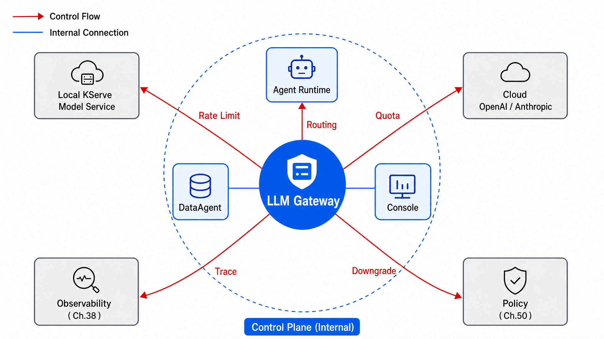
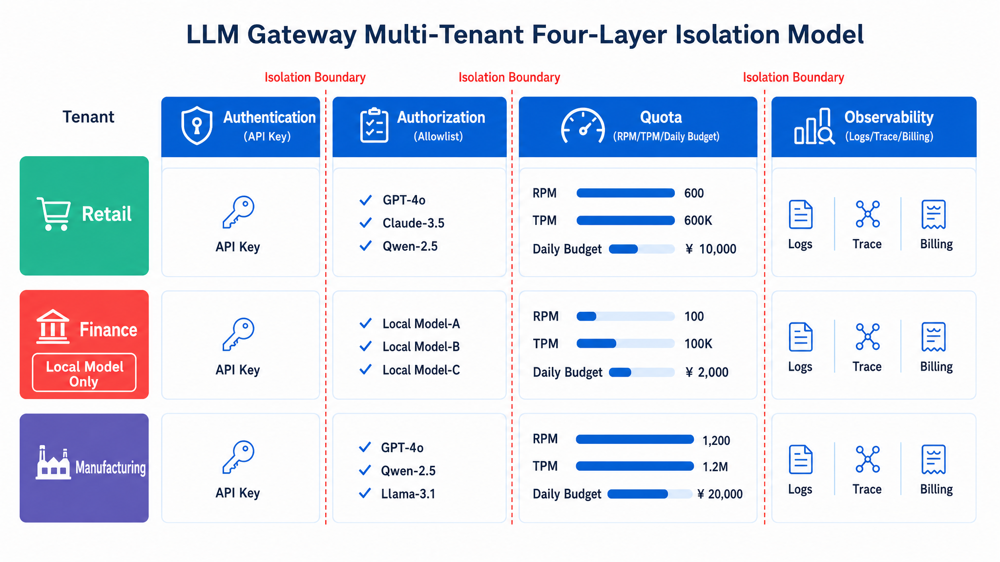
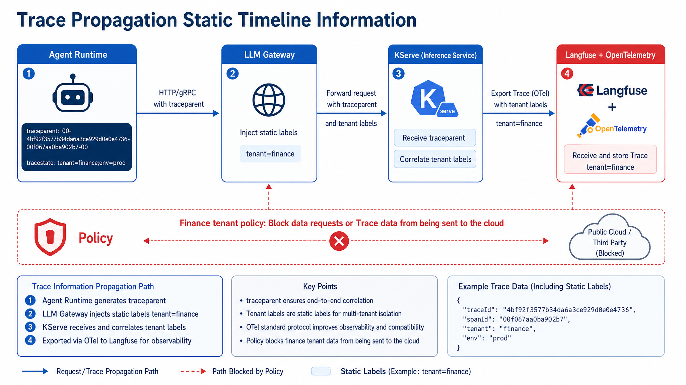

# Chapter 45 LLM Gateway and Multi-Tenancy

---

Without a unified gateway, every Agent connects to model APIs on its own. Cost becomes opaque, rate limiting cannot be enforced centrally, and audit trails are scattered across application logs and provider consoles. The LLM gateway brings model routing, quota, authentication, audit, cache, and provider adaptation into one platform entry point. It owns multi-tenant quotas and authorization in the control plane, then routes calls, adapts responses, and shields upper-layer Agents from backend model changes.

In one monthly cost review, the platform team saw normal self-hosted inference QPS while the external model API bill had suddenly increased. Further investigation found that two business Agents had bypassed the unified gateway to meet a short-term deadline and were using separately stored API keys. Their retries, rate limits, audit records, and cost attribution never entered the platform. This is why the LLM gateway must become the only entry point for model calls. It is not a forwarding layer. It carries tenant identity, model routing, quota, audit, cache, and provider adaptation. Without that control surface, every new model service expands the governance blind spot.

The LLM gateway is the control entry for enterprise model calls. Without it, each Agent saves API keys, calls providers or self-hosted models directly, and ships quickly in the short term. Over time, the platform loses cost attribution, rate limiting, audit, routing, and data-residency control. Once a billing or security incident appears, reclaiming these scattered entry points becomes difficult.

The gateway's value goes beyond request forwarding. It identifies tenant and user, selects model backends, enforces quotas and budgets, records audit evidence, applies cache policy, adapts provider interfaces, and writes the call back into Trace. Upper-layer Agents see one model interface. Underlying models can change according to compliance, cost, and capability. Multi-tenant environments especially need this control point because business lines differ in data sensitivity, budget, model preference, and region requirements. If these rules live in Agent code, the platform cannot audit them consistently or switch providers centrally during incidents.

---

## 45.1 The LLM Gateway's Position in the Enterprise Agent Platform Control Plane

Without a unified entry point, multiple Agent teams each maintain their own API keys, retry logic, model lists, and rate-limiting rules. At scale, this almost inevitably leads to: key leaks, runaway costs, inability to isolate failures centrally, and compliance audits that cannot answer "who called which model and via which backend." When FinOps finds anomalous cloud API costs in the monthly bill while platform monitoring shows stable inference QPS, the common root cause is that some Agents are bypassing the platform and calling external APIs directly, or that retry storms are amplifying token consumption.

The **LLM Gateway** is the unified entry point of the Agent platform control plane: all Runtimes, DataAgents, and Console instances interact only with the gateway; the gateway routes to the model services from Chapter 44 or external SaaS providers, and layers on rate limiting, quotas, caching, trace propagation, and degradation. Chapter 41 covers token cost accounting strategies; Chapter 42 covers SLOs and circuit breaking, with the gateway acting as the enforcement point for these strategies rather than their replacement. Chapter 43 ensures GPUs are provisioned; Chapter 44 ensures model services are ready; Chapter 45 ensures "which backend this request goes to, under which tenant identity, and where it falls back on failure." The Runtime only needs to learn one OpenAI-compatible calling convention.

A typical enterprise Agent platform has four business units, a dozen or more Agent applications, several model services (Chapter 44's `llm-general-32b`, `llm-code-7b`, etc.), and some cloud API backups. The gateway converges these heterogeneous backends into a single call surface.



*Figure 45-1: The gateway is the sole entry point for model calls and the enforcement surface for governance policies. Source: Original illustration. Alt text: All Agent calls pass centrally through the LLM gateway before reaching model backends; the gateway is annotated with four governance policies: routing, rate limiting, quota, and audit. A unified entry point gives the platform unified governance.*

Figure 45-1 also marks the boundary with Chapter 44: Chapter 44 manages model replicas and versions, Canary deployments, and Revisions; Chapter 45 manages "which request goes to which model, under what quota, and where it goes on failure." Readers should not perform model weight loading inside the gateway or implement tenant quotas inside an InferenceService. Mixing responsibilities leads to double rate limiting or double blind spots.

### 45.1.1 Core Gateway Capabilities: Unified API, Model Routing, Caching, Rate Limiting, Quota, and Cost Attribution

Gateway capabilities can be understood in two categories: those transparent to Agents, and those visible to FinOps and compliance. Transparent to Agents: OpenAI-compatible API, streaming SSE, and unified error bodies. Visible to FinOps: tenant labels, token metering, and backend selection audit.

*Table 45-1: The role of each core gateway capability and its relationship to adjacent chapters. Source: Compiled by the authors.*

| Capability | Role | Relationship to Chapter 41/42 |
|---|---|---|
| Unified API | OpenAI-compatible; abstracts backend differences | Reduces Agent integration overhead |
| Model routing | Selects backend by task, tenant, or compliance | Enforces cost routing policy |
| Prompt cache | Reuses KV for identical prefixes (if backend supports it) | Complements Chapter 41 semantic cache |
| Rate limiting | RPM / TPM / concurrent connections | Enforces Chapter 42 rate-limiting SLOs |
| Quota | Per-tenant daily/monthly token cap | FinOps hard gate |
| Cost attribution | Per-request model + tenant labels | Bill allocation |
| Trace propagation | Injects trace_id for Chapter 38 | Observability correlation |

Gateway tenant breakdown (consistent with Chapter 46 GitOps `values-prod.yaml` and Chapter 50 security policy):

*Table 45-2: Business unit, default model, and daily token quota for each tenant (illustrative). Source: Compiled by the authors.*

| Tenant ID | Business Unit | Default Model | Daily Token Quota (Illustrative) |
|---|---|---|---|
| `retail` | Retail | `llm-general-32b` | 50M |
| `mfg` | Manufacturing | `llm-code-7b` + local 32B | 20M |
| `finance` | Finance | Local `llm-general-32b` only | 10M |
| `logistics` | Logistics | `llm-general-32b` + cloud backup | 30M |

The retail tenant is allowed to route to a cloud backup during peak business periods to absorb traffic spikes; the finance tenant's `allowed_models` whitelist contains only `llm-general-32b`, so any request for `gpt-4o` receives a 403 at the gateway layer rather than being forwarded to the cloud for rejection. The manufacturing DataAgent's NL2SQL defaults to `llm-code-7b`, while complex planning falls back to `llm-general-32b`. Routing is decided by `X-Task-Type` and the rule table, so Agent code does not need to hard-code two sets of URLs.

*Table 45-3: Definitions and distinctions of core multi-tenancy concepts. Source: Compiled by the authors.*

| Concept | Definition | Distinction from Adjacent Concepts |
|---|---|---|
| LLM gateway | Unified LLM API entry point and governance enforcement point | Differs from a general-purpose API gateway serving the entire site |
| Tenant | Unit of resource and quota isolation | Differs from a K8s Namespace itself |
| Routing rule | Matching logic that determines the backend | Differs from model service releases (Chapter 44) |
| Degradation | Fallback path when the primary backend fails | Differs from model Canary (Chapter 44) |

Chapter 44's Canary involves shifting traffic between old and new Revisions of the same service name; gateway degradation is a `fallback_chain` activated when the primary backend is unavailable. Both can affect the quality of responses seen by users, but their trigger conditions and rollback procedures differ. On-call runbooks must document them separately.

#### Typical Traffic Patterns for the Four Business Units at the Gateway Layer

Mapping abstract capabilities to typical business traffic helps in designing routing and quotas:

- **Retail (`retail`)**: Daytime customer service Agents account for the bulk of TPM; when quota reaches 80% of the warning threshold during peak periods, routing can shift some overflow to `gpt-4o-fallback`, though FinOps typically requires a time-limited cutback to the local 32B model.
- **Manufacturing (`mfg`)**: DataAgent NL2SQL peaks route to `llm-code-7b`; equipment knowledge-base Q&A falls back to `llm-general-32b`; the two models have independent rate limits to prevent SQL spikes from starving conversational traffic.
- **Finance (`finance`)**: Only the local 32B is used around the clock, with a hard 10M daily quota cap; any anomaly other than a 403 must not fall back to a cloud provider. Degradation can only mean "queue" or "cached FAQ," not switching to an external API model.
- **Logistics (`logistics`)**: Embedding rebuild jobs bypass the gateway (connecting directly to Chapter 44's Triton); waybill Q&A goes through the gateway, and when connectivity is poor, falls back to a local 3B edge model (Chapter 46) rather than retrying the central 32B indefinitely.

### 45.1.2 Four Responsibilities in Gateway Governance

#### The Gateway Needs LLM Call Semantics

A reverse proxy (such as Nginx) forwards traffic without understanding the `model` field, token usage, streaming SSE chunking, or Retry-After semantics. An LLM gateway must parse the JSON body, count completion tokens, and return a machine-readable `retryable` field on a 429. That requires an **LLM semantic layer**. In one pilot, a general-purpose Ingress handled path-based routing but could not enforce per-tenant TPM limits or automatically fall back to `llm-code-7b` when a backend returned 503.

#### Rate Limiting Must Coordinate With Runtime Retry Budgets

The Agent Runtime can still loop and retry, amplifying traffic: if exponential backoff after a 429 is implemented incorrectly as a fixed 100 ms retry, QPS actually doubles. Gateway rate limiting must be paired with Chapter 42's circuit breaking and Runtime retry budgets (maximum N retries per session, overall backoff cap); otherwise, 429s are cancelled out by retry storms. In handheld-device Agent scenarios with poor connectivity, gateway 429 + unlimited Runtime retries = the central gateway getting flooded.

#### Multi-Tenant Isolation Requires Quota, Routing, Logs, and Cache Partitioning

Keys are only an authentication mechanism; tenant isolation also requires quota, routing whitelists, log partitioning, and cache namespace isolation. A key leak immediately invalidates the tenant boundary when these controls are missing. Having one key each for finance and retail is insufficient; you must also ensure that the finance key's `allowed_models` in the registry does not expose cloud backends, and that Langfuse projects are partitioned by tenant to prevent audit cross-contamination.

#### Model Versions Remain Managed by the Serving Layer

Some teams maintain two `api_base` entries in LiteLLM to represent v1/v2 models without using KServe Revisions. Canary and rollback logic then splits across two layers, making it impossible to determine which Revision a request landed on during an incident. The gateway handles only routing and governance; **versioning and traffic percentages belong in Chapter 44's InferenceService**. Keep the gateway `model_name` stable; backend Revision switching is done via KServe's `canaryTrafficPercent`.

---

## 45.2 Multi-Tenancy Model: Tenant Isolation, API Key Management, Namespaces, and Resource Quotas

Gateway multi-tenancy requires at least four layers of isolation. Missing any one of them will surface problems at scale:

1. **Authentication layer**: API key / OAuth / mTLS, mapped to `tenant_id`;
2. **Authorization layer**: Whitelist of `model` values the tenant may call;
3. **Quota layer**: RPM (Requests Per Minute), TPM (Tokens Per Minute), daily budget;
4. **Observability layer**: Logs, traces, and billing partitioned by `tenant_id`.

K8s Namespaces can be aligned with tenants (`tenant-retail`), but Namespaces handle container isolation, NetworkPolicy, and CPU/memory/GPU ResourceQuota. They do **not** manage token quotas. Tokens are a business-semantic resource; they must be managed at the gateway or in a dedicated policy service (e.g., LiteLLM DB + custom middleware). A Pod in the `finance` Namespace that holds the wrong key could still access the retail quota. Namespaces cannot substitute for gateway authorization.

The tenant model must also connect people, applications, and cost centers. An API key is often held by an Agent application, but the cost is charged to a business unit, and audit needs to identify a user or service account. The gateway should store `tenant_id`, `agent_id`, `owner_team`, and `cost_center` in addition to `api_key_id`. When a tenant's cost spikes, FinOps can then distinguish normal growth, runaway retries in one Agent, and external key misuse.

Quota should be split across resource dimensions. RPM controls request frequency, TPM controls token consumption, concurrent connections control streaming occupancy, and daily or monthly budgets control cost. A customer-service Agent may have many short requests. A finance analysis request may be rare but carry a long context. Limiting only RPM penalizes the former and misses the latter. Gateway policy should record these resources separately, then combine them by tenant and model.

Multi-tenant cache is another common failure point. Even when prompt text is identical, different tenants may receive different answers because policy version, data permission, region, or compliance context differs. The cache key should include tenant, model, prompt hash, tool version, and relevant policy version. Cache hits should also be written into Trace so users and auditors can tell whether an answer came from cache or a fresh model call.



*Figure 45-2: Tenant isolation is a four-layer stack of authentication, authorization, quota, and observability, rather than a single API key. Source: Original illustration. Alt text: Four layers from outermost to innermost: authentication (who is calling), authorization (what they are allowed to call), quota (how much they can call), and observability (what was called). Each layer is annotated with its governance object, showing why multi-layer isolation is stronger than a single key.*

In Figure 45-2, the finance tenant's "local models only" constraint takes effect at the authorization layer: even a holder of a valid API key will receive `403 MODEL_NOT_ALLOWED_FOR_TENANT` from the gateway if they request `gpt-4o`. The request never leaks through to Chapter 50 for interception. Tenant labels in the observability layer are injected by the gateway and are not trusted from client headers; see Failure Mode 2.

### 45.2.1 Routing Strategies: By Task Type, By Cost, By Latency, By Compliance Zone, and Fallback Chains

Routing is not an "if-else to pick a URL"; it is a prioritized decision chain: compliance constraints perform hard cutoffs, business preferences make soft selections, and failure paths use explicit fallbacks. Input fields should be documented between Chapter 45 and the Runtime to prevent each Agent from defining its own custom header names.

Routing decision inputs:

```text
tenant_id, model (declared in request), task_type (header/metadata),
latency_slo, compliance_zone, fallback_chain
```

Routing rules (illustrative; service names consistent with Chapter 44):

*Table 45-4: Model routing priorities and target backends triggered by condition. Source: Compiled by the authors.*

| Priority | Condition | Target Backend |
|---|---|---|
| 1 | `compliance_zone=finance` | Local `llm-general-32b` only |
| 2 | `task_type=code/sql` | `llm-code-7b` |
| 3 | `model=gpt-4o` and tenant allows cloud | External API |
| 4 | Default | `llm-general-32b` |
| fallback | Primary backend 5xx / timeout | Backup local small model or cached response |

Priority 1 cannot be overridden by the client's `model` field; finance compliance is a hard rule. Priority 2 serves the manufacturing DataAgent: within the same `mfg` tenant, NL2SQL goes to the SGLang code model, while equipment Q&A goes to the 32B model. The priority-4 fallback must point to **a genuinely different Revision or a different model** from the primary backend; see Failure Mode 1. The logistics tenant can fall back to a smaller local model or return cached waybill FAQ after `llm-general-32b` times out after 30 s, but the degraded quality must be clearly surfaced in the Console as "simplified response mode."


*Figure 45-3: Routing is a prioritized decision chain; degradation is an explicitly configured fallback_chain. Source: Original illustration. Alt text: The decision chain checks conditions in priority order and routes to the target backend on a match, or moves to the next priority on a miss; the fallback_chain switches through backends in sequence when the primary is unavailable, illustrating that fallback paths are explicitly pre-configured.*

Figure 45-3 shows the routing decision chain in order: tenant authentication -> compliance hard cutoff -> task_type -> cost/latency -> backend selection -> explicit fallback. Finance's "reject cloud" constraint must take effect at the compliance layer, not be deferred to the model layer for interception.

#### LiteLLM Proxy Mode and Custom Gateway

*Table 45-5: Trade-offs for routing strategies by task type, cost, latency, compliance zone, and fallback chain. Source: Compiled by the authors.*

| Option | Advantages | Cost | Applicable Scenario | This Book's Recommendation |
|---|---|---|---|---|
| LiteLLM | 100+ backends, OpenAI-compatible, active community | Deep enterprise features require extension | Rapid API unification | Recommended for MVP |
| Portkey | Mature observability, routing, caching | SaaS / license | SaaS-oriented governance | Reference benchmark |
| Higress / Kong AI | Integrates with API gateway ecosystem | LLM semantics require plugins | Existing Kong/Higress | Hybrid architecture |
| Custom-built | Fully customizable | High engineering effort | Very large enterprises | Long-term option |

At the MVP stage, choose LiteLLM, because Chapter 44 has already unified OpenAI-compatible backends, and LiteLLM's `model_list` can quickly map to KServe Services. Finance compliance routing and tenant whitelisting are added on top of LiteLLM as a middleware layer or DB policy, rather than writing an HTTP proxy from scratch.

#### Gateway Cache and Model-Layer Prompt Cache

*Table 45-6: Trade-offs for routing strategies by task type, cost, latency, compliance zone, and fallback chain. Source: Compiled by the authors.*

| Option | Advantages | Cost | Applicable Scenario | This Book's Recommendation |
|---|---|---|---|---|
| Gateway semantic cache (Chapter 41) | Cross-backend, can be tenant-isolated | Consistency is challenging | High proportion of repeated Q&A | Pair with LiteLLM cache |
| Backend prefix cache | Lowest latency | Tied to a single engine | vLLM with long system prompts | Part II, Chapter 7 |

Retail customer service with repetitive "return and exchange policy" queries is well-suited to gateway semantic caching; manufacturing DataAgent with long, repeated system prompts benefits more from vLLM prefix caching. When both cache layers coexist, the cache key must include `tenant_id`, and the finance tenant should have cross-session caching disabled or encrypted for isolation; see Failure Mode 3.

Cache hit rate should not be the only metric. For DataAgent, cached answers without metric version, data timestamp, and permission context may spread stale definitions to more users. The failure mode is worse when the cache appears efficient. The gateway needs to record why a cached answer was allowed, including the policy and evidence behind the cache hit.

### 45.2.2 Gateway Product Comparison: LiteLLM, Portkey, Higress AI Gateway, and Kong AI

*Table 45-7: Applicable and inapplicable scenarios for gateway products such as LiteLLM, Portkey, and Higress AI. Source: Compiled by the authors.*

| Product | Why Use It | Not Suitable For | Alternative |
|---|---|---|---|
| LiteLLM | Open-source, multi-backend, easy to deploy | Complex RBAC requires secondary development | Portkey, custom-built |
| Portkey | Unified routing, caching, and observability | Deep private deployment customization | LiteLLM + Langfuse |
| Higress AI | Cloud-native, Wasm plugins | Teams without K8s gateway experience | Kong, Envoy |
| Kong AI | Existing enterprise API gateway | LLM-native features require configuration | Higress |

Product selection should serve architectural trade-offs, not brand preference. Recommended path: **LiteLLM as the LLM semantic layer**, optionally fronted by Higress for TLS/WAF (Chapter 46 deploys separate Helm Charts), with observability connected to Langfuse (Chapter 38). Kong AI suits enterprises already running Kong platform-wide, but streaming LLM and token-metering plugins must be verified item by item. Do not assume "running Kong means running an LLM gateway."

#### LiteLLM + Higress Combined Topology (Overview)

Request path: `Internet / internal Agent` -> Higress (TLS termination, WAF, IP allowlist) -> LiteLLM Pod (LLM semantics, tenant, quota) -> KServe Service (Chapter 44). Higress **does not understand** TPM quotas; LiteLLM **does not replace** WAF. Each layer does what it does best. The finance tenant's IP allowlist lives in Higress; the model whitelist lives in the LiteLLM DB. Both are required. On the observability side, LiteLLM injects `traceparent` at its egress; Higress access logs record only L4/L7 metadata, not prompt content (Chapter 50 logging compliance).

### 45.2.3 Gateway Interface Contract: Request/Response Format, Error Codes, Trace Propagation, and Audit Fields

The contract between the Runtime, Console, and gateway is Part VIII's "last API" exposed to the upper layers. Field stability matters more than feature richness. The following contract is compatible with the Chapter 44 OpenAI subset and extends it with governance fields.

```text
POST /v1/chat/completions
Headers:
  Authorization: Bearer <api_key>
  X-Tenant-Id: retail              # or mapped from key; see Failure Mode 2
  X-Task-Type: nl2sql               # optional; used for routing
  traceparent: 00-<trace_id>-...   # W3C Trace Context

Request:
{
  "model": "llm-general-32b",
  "messages": [...],
  "stream": true,
  "metadata": { "agent_id": "data_agent", "session_id": "s_001" }
}

Response: (OpenAI-compatible + extended headers)
  X-Route-Backend: kserve-llm-general-32b
  X-Token-Usage-Billed: 1523

Errors:
  401 AUTH_INVALID
  403 MODEL_NOT_ALLOWED_FOR_TENANT
  429 QUOTA_EXCEEDED | RATE_LIMITED  (Retry-After in seconds)
  502 BACKEND_UNAVAILABLE
  503 DEGRADED_TO_FALLBACK
Body: { "error": { "code", "message", "retryable" } }
```

`X-Route-Backend` aids on-call fault isolation: when a user reports "responses are slow," check first whether the overhead is from the gateway or KServe TTFT. `503 DEGRADED_TO_FALLBACK` signals degradation; the Runtime can decide whether to notify the user. `retryable` helps the Runtime distinguish "403s that should not be retried" from "429s/502s that should back off." Retrying a 403 only amplifies audit noise.

### 45.2.4 Coordination with Other Platform Subsystems: Runtime, Observability, Policy, and Cost Governance

*Table 45-8: Responsibilities, inputs, outputs, and failure modes for the gateway's coordination with Runtime, Observability, and other subsystems. Source: Compiled by the authors.*

| Component | Responsibility | Input | Output | Failure Mode |
|---|---|---|---|---|
| Authenticator | Key -> tenant | API key | tenant_id, scopes | Key leak |
| Router | Select backend | Request + rules | Upstream URL | Rule conflict loop |
| Rate limiter | RPM / TPM | Tenant + model | Allow / deny | Redis single point of failure |
| Quota enforcer | Daily budget | Tenant usage | Allow / deny | Counter drift |
| Trace injector | Correlate with Chapter 38 | traceparent | Backend header | Broken trace |
| Degradation handler | Fallback | Backend health | Backup backend | Insufficient fallback model quality |

Traces should propagate from the Runtime through the gateway all the way to Chapter 44's KServe Pod; Langfuse spans include `tenant_id`, `model`, and `X-Route-Backend`. Policy (Chapter 50) enforces rules such as "finance prohibits cloud" at the gateway; fine-grained IAM remains in the platform identity layer. The gateway handles only policy enforcement for the LLM call path.



*Figure 45-4: Traces are unbroken; tenant labels are injected only at the gateway. Source: Original illustration. Alt text: The trace originates from the Agent and runs unbroken through the gateway to the model provider; tenant labels are injected centrally at the gateway rather than applied by each Agent individually; arrows mark the label injection point, illustrating that governance is centralized at the gateway.*

Figure 45-4 emphasizes that traces must **not be broken** and that tenant labels must be **injected only at the gateway**: KServe Pods should not trust `X-Tenant-Id` from the client; otherwise, finance compliance is bypassed at the model layer. The observability platform should support three-dimensional drill-down by `tenant_id + model + backend`, consistent with the billing dimensions in Chapter 41.

### 45.2.5 Failure Modes: Upstream Timeouts, Routing Loops, Misconfigured Quotas, Cache Pollution, and Tenant Cross-Contamination

*Table 45-9: Detection and recovery for gateway failure modes including timeouts, routing loops, and cache pollution. Source: Compiled by the authors.*

| Failure Mode | Trigger | Impact | Detection | Recovery Strategy |
|---|---|---|---|---|
| Upstream timeout | vLLM overloaded | Users wait indefinitely | gateway_latency P99 | Hard timeout + fallback |
| Routing loop | Fallback points back to itself | 502 storm | Routing DAG validation | Static analysis of fallback chain |
| Misconfigured quota | Finance daily limit set too high | Runaway cost | FinOps daily report | Quota change CR + dual approval |
| Cache pollution | Cross-tenant cache key collision | Tenant A sees fragments of Tenant B's response | Cache key audit | Key includes tenant_id + model |
| Tenant cross-contamination | Header-forged tenant | Privilege escalation | mTLS + key binding | Ignore client-provided tenant header |

Upstream timeouts are often related to Chapter 43/44 capacity: if the gateway timeout is set to 120 s while the vLLM queue is already full, users see only a spinner. Set a shorter timeout on the gateway side with a fallback, and hook queue-depth alerts into Chapter 42 SLOs. Misconfigured quotas are especially dangerous during business peaks: if the retail daily quota has not been temporarily raised, legitimate traffic gets 429s, business teams switch to personal keys to bypass the gateway, and FinOps loses visibility.

#### Integration Notes When Coordinating with Chapter 44 Canary

When Chapter 44 runs a 5% Canary on `llm-general-32b`, Chapter 45's `model_list` still points to the same KServe Service name. KServe splits traffic at the Service layer; the gateway does not need to change its URL. However, if an engineer adds `llm-general-32b-canary` as a separate `model_name` in LiteLLM with a fallback to the primary model, this **double-shifts traffic** together with KServe's built-in Canary, making metrics uninterpretable. The convention is: **gateway `model_name` maps 1:1 to InferenceService name**; Canary traffic is adjusted only through Chapter 44's `canaryTrafficPercent`; the gateway only watches the aggregated `/ready` endpoint and error rate.

#### Redis Rate-Limiting Single Point of Failure and Multi-Replica Gateway

With multiple LiteLLM replicas and Redis-based rate limiting, a Redis failure leads to "rate limiting disabled or all requests rejected." Use Redis Sentinel or clustering, and explicitly define the failure policy: fail-closed (reject rather than allow) or fail-open (allow rather than reject). Finance typically chooses fail-closed; retail can temporarily switch to fail-open during peak business windows and rely heavily on Chapter 41 cost alerts, but this change requires a change request.

---

## 45.3 Engineering Implementation: LiteLLM Gateway Configuration, Routing Rules, and Multi-Tenant Isolation Examples

The implementation sequence is: **validate a single-tenant path to the KServe backend in staging** -> **enter four-tenant keys and whitelists into the database** -> **configure fallback and rate limiting** -> **shift production traffic (Chapter 46 Manual Sync)**. The acceptance criterion for preventing Agents from connecting directly to KServe: at the network layer, no ClusterIP route is exposed from InferenceService to the outside, except for the gateway ServiceAccount.

#### LiteLLM `config.yaml` Example

`api_base` points to the Chapter 44 KServe in-cluster Service; `model_name` is consistent with the Runtime `served-model-name` and the Chapter 44 contract.

```yaml
# Example: LiteLLM gateway configuration (production engineering example)
model_list:
  - model_name: llm-general-32b
    litellm_params:
      model: openai/llm-general-32b
      api_base: http://llm-general-32b.model-serving.svc:8000/v1
      api_key: os.environ/INTERNAL_API_KEY
  - model_name: llm-code-7b
    litellm_params:
      model: openai/llm-code-7b
      api_base: http://llm-code-7b.model-serving.svc:8000/v1
  - model_name: gpt-4o-fallback
    litellm_params:
      model: gpt-4o
      api_key: os.environ/OPENAI_API_KEY

router_settings:
  routing_strategy: simple-shuffle   # recommend custom callback for production
  fallbacks:
    - llm-general-32b: [llm-code-7b]

litellm_settings:
  drop_params: true
  set_verbose: false

general_settings:
  master_key: os.environ/LITELLM_MASTER_KEY
  database_url: os.environ/DATABASE_URL   # usage and key management
```

In production, the `fallbacks` DAG must be manually reviewed to be acyclic; `simple-shuffle` load-balances across multiple KServe replicas but cannot replace tenant routing. Tenant routing should be implemented in DB policy or a custom callback.

This configuration expresses model entry points and basic fallback only. Production also needs API key to `tenant_id` mapping, `allowed_models` whitelists, daily quota, and audit fields in a database or policy repository released through Chapter 46 GitOps. If these policies are changed manually in the LiteLLM UI, the gateway becomes a new configuration black box. During incidents, the team cannot explain why one request reached a cloud model.

#### Tenant Keys and Model Whitelists (Illustrative SQL Logic)

```sql
-- Pseudocode: tenant model authorization table
-- tenant_id | allowed_models              | daily_token_quota
-- finance   | {llm-general-32b}           | 10000000
-- retail    | {llm-general-32b,gpt-4o-*}  | 50000000
```

Keys are bound to `tenant_id` at creation time; the request processing path reads from the DB mapping only. It does not read the `X-Tenant-Id` header.

#### Rate-Limiting Configuration Example

```yaml
# Example: LiteLLM route-level RPM limits
router_settings:
  model_group_alias:
    retail-fast: llm-general-32b
  rpm: 600          # global illustration
  tenant_rpm:
    retail: 300
    finance: 100
```

Before a business peak, the retail `tenant_rpm` must be temporarily raised via a change request, and the "peak window" must be annotated in the Chapter 41 cost dashboard.

#### Deployment and Verification

```bash
# Start (example)
litellm --config /etc/litellm/config.yaml --port 4000

# Verify routing
curl http://localhost:4000/v1/chat/completions \
  -H "Authorization: Bearer $RETAIL_KEY" \
  -H "Content-Type: application/json" \
  -d '{"model":"llm-general-32b","messages":[{"role":"user","content":"ping"}]}'
```

Acceptance criteria: a finance key requesting `gpt-4o` returns 403; an `mfg` key with `X-Task-Type: nl2sql` has `X-Route-Backend` pointing to the code service; traces can be linked across three spans in Langfuse.

#### Helm Deployment and Integration with Chapter 46 GitOps

In production, the gateway is not started with `litellm --config` as a bare process; instead, the `helm/llm-gateway` Chart mounts a ConfigMap and External Secrets:

```yaml
# Example: Helm values-prod snippet (pseudocode structure)
replicaCount: 4
config:
  model_list: []   # rendered by chart template; backends from model-serving release
externalSecrets:
  openaiKey: vault/agent-platform/openai
  masterKey: vault/agent-platform/litellm-master
tenantPolicy:
  finance:
    allowed_models: [llm-general-32b]
    deny_cloud: true
  retail:
    allowed_models: [llm-general-32b, gpt-4o-fallback]
```

The ArgoCD Application `llm-gateway-prod` promotes `targetRevision` on the same tag as `model-serving-prod`, which prevents the gateway from syncing before the model is ready. Staging can use `replicaCount: 1` to save costs, but tenant whitelists must be logically identical to production; otherwise, "passes in staging, 403 in production because policy differs."

#### Traffic-Cutover Runbook: From Direct KServe Connections to Gateway-Mediated Connections

1. Freeze the NetworkPolicy that allows new Agents to connect directly to KServe (coordinate with Chapter 50);
2. Update Runtime configuration to `OPENAI_BASE_URL=https://llm-gateway.internal/v1`;
3. Cut over traffic tenant by tenant: finance -> mfg -> logistics -> retail (retail last because QPS is highest);
4. Observe for 24 h per batch: gateway P99 overhead, backend error rate, and whether FinOps per-tenant billing is consistent;
5. Rollback: reverting the Runtime to point directly at KServe is an emergency-only path and must be accompanied by a Git revert within 4 hours.

After cutover, the gateway must not become a new black box. When the business reports slow responses, SRE should be able to tell whether latency sits in pre-backend processing, backend inference, or streaming. FinOps should be able to tell whether a tenant's token usage is normal growth, retry amplification, or fallback to an external API. Compliance should be able to sample finance traffic and confirm that it only used local backends. These questions all depend on consistent fields: `tenant_id`, `model`, `backend`, `trace_id`, `route_rule_id`, and `fallback_reason`. If field names drift, every team will build its own report, and the gateway's governance value will erode.

Cache should be enabled conservatively during cutover. Semantic cache can reduce cost for FAQ and policy questions, but for DataAgent, financial analysis, and compliance workloads, a cache hit can hide data-version and permission changes. The first version can enable caching only for low-risk, read-only questions whose answers are consistent across users, and it should write the cache key's tenant, model, prompt hash, and version into Trace. After the Chapter 41 cache governance is stable, the platform can expand coverage.

Rollback paths also need rehearsal during cutover. Whether Runtime may temporarily connect directly to KServe during a gateway incident should depend on risk level. Finance tenants cannot bypass model allowlists and audit even if the gateway fails. Low-risk internal tools can keep a short-lived break-glass path, but it must be audited and expire automatically. Without this rule, the more important the gateway becomes, the more likely people will bypass it during incidents, recreating the uncontrolled multi-entry problem.

Gateway rules themselves must be versioned. Routing rules, tenant allowlists, fallback chains, cache policies, and rate limits all change model-call behavior. If these rules are modified manually in an admin database, the Chapter 46 GitOps chain breaks. Putting them in Helm values or a policy repository lets reviewers check whether finance still blocks cloud backends, whether retail's temporary quota has an expiry time, and whether fallbacks point to different backends. The rule version should also be written into Trace so teams can later determine which governance policy a request matched.

Gateway error semantics must give Runtime the right next action. `401` and `403` usually should not be retried, `429` should honor `Retry-After`, and only `502` or `503` should trigger fallback or short retries. If Runtime treats every error as retryable, stricter gateway policy will create larger retry storms. If Runtime exposes every error directly to users, the system leaks too much internal detail. The interface contract in this chapter must be designed together with the Chapter 22 Runtime retry budget and Chapter 42 SLO policy.

The gateway also needs to distinguish technical errors, policy denials, and deliberate degradation. A finance request for a cloud model returning 403 is not a service failure; it means the compliance rule worked. A tenant that exceeds budget and receives 429 is not seeing an unavailable gateway; the cost gate is working. Observability reports should not flatten all of these into ordinary errors. Otherwise business teams will read a higher error rate as platform instability when the platform may simply be blocking calls that were previously uncontrolled.

After launch, the platform should keep a fixed set of probe requests and run them daily through CI or scheduled jobs. These probes do not need broad business coverage. They verify that the core governance contracts still hold.

### 45.3.1 Locating Policy Misconfiguration and Tenant Isolation Gaps

#### Misconfigured Fallback Chain Causes Infinite Retries

- Symptom: When a backend fails, gateway QPS doubles, accelerating downstream collapse.
- Root cause: `llm-general-32b` falls back to `llm-general-32b-canary`, which still points to the same KServe Service; the fallback does not switch Revisions.
- Fix: Fallbacks must point to **a different Revision or a different model**; limit each request to at most one fallback; record `X-Route-Backend` for auditing; add CI static checks for the fallback DAG.

#### Finance Tenant Accesses Cloud by Forging Headers

- Symptom: Compliance scan finds finance Agent requests appearing in the OpenAI bill.
- Root cause: The gateway trusts the client's `X-Tenant-Id` header rather than mapping from the API key; an attacker uses a retail key body to forge a finance identity.
- Fix: Tenant identity derives solely from the key registry; compliance routing is enforced server-side; the cloud backend is invisible to finance keys; Chapter 50 regularly runs "should-be-rejected" probe test cases.

#### Semantic Cache Without tenant_id Causes Response Cross-Contamination

- Symptom: Retail customer service Agent returns cached fragments containing financial terminology.
- Root cause: cache key = hash(prompt), without tenant; finance and retail share the gateway cache Redis.
- Fix: cache key = hash(tenant_id + model + prompt); disable cross-session cache for the finance tenant or apply encryption-based isolation; align cache TTL with the Chapter 41 semantic cache policy.

Gateway production readiness should be validated along three lines. The first is permissions: keys need a rotation policy, `master_key` should be accessible only to SRE and release automation, and tenant identity must come from the key registry rather than trusted client headers. The second is audit: every request should record tenant, model, backend, token usage, `trace_id`, fallback state, and error code. The third is stability: the fallback DAG must be acyclic, 429 responses must carry `Retry-After`, and gateway-side P99 overhead should be measured separately from model inference time.

Cost governance also belongs at the gateway. Quotas should support both hard gates and 80 percent warnings, while FinOps reports should break down usage by tenant, model, and backend. For tenants allowed to use cloud fallback, reports must list fallback spend separately; otherwise peak-window external API cost will be hidden inside normal model calls. In multi-replica gateway deployments, Redis rate limiting, ConfigMap hot reload, and backend health checks all need explicit failure policies. Compliance-sensitive tenants such as finance usually prefer rejecting traffic over allowing cloud calls when the limiter fails.

Gateway launch review should also align failure semantics. `429` means a user or tenant is rate-limited and Runtime should back off. `502` means the upstream is unavailable and the gateway may degrade according to policy. `403` means policy denial and retry is meaningless. If Runtime, Console, and alerts do not share these meanings, frontend pages will flatten all failures into "model busy," leaving business users unable to tell whether the issue is quota, compliance rejection, or model service failure.

#### Gateway-Side Prometheus Metrics (Illustrative)

*Table 45-10: Meaning and alerting recommendations for gateway-side Prometheus monitoring metrics. Source: Compiled by the authors.*

| Metric Name | Meaning | Alerting Recommendation |
|---|---|---|
| `gateway_requests_total{tenant,model,backend}` | Request count | Alert on per-tenant spike |
| `gateway_latency_seconds{phase="pre_backend"}` | Gateway self-overhead | P99 > 50 ms |
| `gateway_quota_denied_total{tenant}` | Quota denials | Alert immediately if finance is non-zero |
| `gateway_fallback_total{from,to}` | Fallback count | > 100 within 1 h |
| `gateway_backend_errors_total{backend}` | Upstream 5xx | Cross-check with Chapter 44 readiness |

Metric labels must use the same `tenant_id` naming convention as the Chapter 41 cost reports and Chapter 38 traces to prevent FinOps and SRE from using different tenant spellings.

---

### 45.3.2 Operating Cadence for Gateway Policies

LLM gateway policy needs ongoing operation after launch. Model prices change, tenant budgets change, external API availability changes, and compliance requirements change. If gateway policy is not reviewed, stale fallbacks, long-lived temporary quotas, unused model aliases, and outdated compliance routes accumulate. The platform should regularly review tenant quotas, model whitelists, fallback chains, cache scope, and error-code statistics. Weekly reviews should look for anomalies: spikes in 429, spikes in fallback, unexpected cloud usage, tenant token surges, and rising gateway P99. Monthly reviews should examine structure: which models sit idle, which tenants keep exceeding budget, which Agents frequently trigger policy denials, and which cache hits reduce cost without quality risk. Review results should enter the configuration repository rather than only changing an admin database.

Policy ownership must also be explicit. SRE owns availability and routing health. The platform team owns the API contract and Runtime integration. Security and compliance own model whitelists and data boundaries. FinOps owns budgets and cost attribution. When policy changes lack owners, incidents quickly become blame shifting. The gateway is a centralized entry point, so it needs centralized operation with clear responsibility boundaries.

After launch, every model call should be attributable to tenant, task, model, and version. When a bill spikes, the team should see which Run category grew, which policy caused stronger models to be used, and which requests missed cache. Without attribution, cost optimization becomes guessing. The gateway also handles degradation. When a provider times out, a self-hosted service overloads, or a model version rolls back, the gateway can switch backends, lower concurrency, or reject low-priority requests by policy. Business Agents should receive clear errors or degraded results rather than provider-specific failure details.

Security-wise, the gateway is a key point for data egress and audit. Whether a request contains sensitive fields, whether it may use an external model, and whether the response needs desensitization should be handled centrally. Calls that bypass the gateway should be treated as platform risk, not a personal development habit. Gateway routing should be explainable: why a request used a local model, why it used an external provider, why it degraded to a small model, or why it was rejected should be visible in routing logs. Without that explanation, business teams tend to blame model quality for latency, refusal, and answer differences.

Multi-provider adaptation should hide interface differences without erasing capability boundaries. Different models support tool calls, structured output, streaming chunks, context length, and safety filtering differently. The gateway can expose a unified API, but it should also make the capability matrix available to routing policy and evaluation. Otherwise a task may be routed to a model that cannot support the required capability. API key management should move away from personal keys toward tenant and service identities. Business applications should not store provider secrets. The gateway owns credential storage, rotation, and audit; Agents call through platform identity.

Cache, rate limit, and budget policies should be tenant-isolated. One business line's peak should not consume the whole platform budget, and one test Agent should not affect production rate limits. The gateway needs clear quota hierarchy across tenant, application, task type, and model. It is also the buffer for model ecosystem changes. When an underlying model upgrades, a provider fails, pricing changes, or regional policy shifts, the platform can adjust routing and fallback at the gateway instead of changing every Agent.

Gateway request normalization should be observable. Providers differ in system messages, tool calls, JSON mode, streaming chunks, and error formats. After normalizing these differences, the gateway should write key before/after fields into debug logs. When model behavior differs, the team can then determine whether the provider capability changed or the adaptation layer converted the request incorrectly.

Routing policy should support staged activation. A new policy can first run in shadow mode: calculate where a request would route under the new rule while sending the real request through the old rule. After comparison, the platform can gradually switch real traffic. This allows teams to evaluate cost, latency, and quality changes without affecting users. Full replacement makes it hard to separate policy issues from model issues.

Gateway errors should tell Runtime the correct next action. A 429, exhausted budget, suspended tenant, overloaded backend, and security denial require different recovery paths. Runtime can queue, degrade, ask for user confirmation, or stop when it receives structured errors. If the gateway returns only a generic failure, Runtime tends to retry blindly or give users vague messages.

Audit fields should cover the request lifecycle: who initiated the request, which tenant it represented, which model it used, which policy matched, whether cache was hit, whether fallback occurred, and how many tokens and cost were billed. Billing, compliance, and incident review all depend on these fields. Without a gateway, these facts stay scattered across provider consoles and application logs.

Multi-tenant gateways also need tenant-specific policy differences. Finance tenants may use only local models. Retail tenants may use external models but with sensitive-field restrictions. R&D tenants may use code models. Test tenants may have lower budgets. Putting these differences in the gateway lets business Agents share one interface while meeting different organizational requirements.

The gateway itself must be highly available. It is the entry point for model calls, so its failure affects all Agents. Deployment needs multiple replicas, circuit breakers, backend health checks, configuration canary, and rollback. Once governance is centralized in the gateway, gateway reliability becomes platform reliability. Gateway configuration also needs versioning. Adding a backend, changing weights, modifying tenant quotas, enabling cache, or changing external-model policy can affect user results. Writing configuration version into Trace lets teams reproduce the routing environment behind a specific answer.

Cache policy should coordinate with gateway policy. The gateway decides whether an answer is cacheable, which fields enter the key, and whether permission checks are repeated on cache hit. Application-level caching bypasses governance and makes data-version and permission invalidation hard to control. Any reusable model answer should be managed through the gateway.

Provider failure drills are also necessary. The platform should regularly simulate an external model timeout, error, or quality incident, then verify routing, degradation, alerts, and user messages. Without drills, fallback rules may exist only in configuration and fail during the first real incident due to missing capacity or permissions.

The gateway should protect model services from abnormal input. Very long contexts, malformed file parsing outputs, repeated requests, and malicious high concurrency can overload expensive backends. Input-size limits, request deduplication, tenant rate limits, and queueing should happen before requests reach model services. The more expensive the model, the more important entry protection becomes.

Organizationally, gateway policy changes need review. Business teams may want higher quota, model teams may want backend switches, security teams may want stricter external-model rules, and finance teams may want lower budgets. These requests affect one another. Gateway configuration is where the trade-off lands, so it should not be changed freely by one application team.

The gateway can also carry shadow evaluation traffic. Real requests use the current model while a sanitized copy is sent to a candidate model, recording candidate results without returning them to users. Shadow traffic helps evaluate new models, routes, and providers without changing production behavior. It must control data egress and cost strictly, or it becomes hidden full traffic.

Response post-processing should also be centralized where possible. Provider-specific refusals, tool-call formats, and error codes should be normalized so Runtime can interpret them consistently. Gateway normalization should not hide all differences. It should expose them through stable fields so observability and degradation remain consistent.

The gateway needs emergency block controls. When a model version misbehaves, a tenant key leaks, or a request class triggers a security risk, the platform should quickly block the backend, tenant, or policy combination. Emergency blocks need audit and recovery steps so temporary controls do not become permanent hidden state.

The gateway should support policy simulation before a business scenario goes live. With sample requests, the platform can show which models would be used, expected cost, security restrictions, and cache behavior. Simulation helps business teams adjust task design before launch. In that sense, the gateway is also a review tool for model usage plans.

Gateway logs should avoid storing excessive raw text. They can store summaries, token statistics, policy hits, and artifact references. Sensitive request and response text should be desensitized or stored behind permission controls. A unified entry point creates unified visibility, but it also concentrates sensitive data, so logging governance must be designed together.

Policy test samples should cover normal requests, unauthorized requests, sensitive data, long context, provider failure, and budget exhaustion. Running these samples before each policy change catches obvious routing and security regressions. The more centralized the gateway becomes, the more important policy testing becomes.

The gateway should explain usage to business teams. When cost rises, reports should break usage down by task, model, cache, retries, and evaluation traffic rather than showing one bill. Explainable cost moves the conversation from opinion to evidence. Once usage explanation is stable, budget governance becomes more than a simple cap. A gateway operations dashboard should keep this explanation visible so teams develop a shared cost language.

## Chapter Recap

1. The LLM gateway is the unified entry point of the Agent platform control plane, enforcing routing, rate limiting, quota, tracing, and degradation while staying decoupled from the Chapter 44 model service.
2. Multi-tenant isolation requires four stacked layers: authentication, authorization, quota, and observability; tenant identity must come from key mapping, not trusted client headers.
3. Routing is a prioritized decision chain; fallbacks must be acyclic and point to genuinely different backends.
4. LiteLLM is suitable as the LLM semantic gateway for an MVP; enterprise features (RBAC, compliance routing) require hardening.
5. Cache keys must include tenant_id; rate limiting must be coordinated with Runtime retry budgets (Chapter 42).

## References

LiteLLM. (n.d.). [Documentation](https://docs.litellm.ai/).

Portkey. (n.d.). [AI Gateway documentation](https://portkey.ai/docs).

Kong. (n.d.). [AI Gateway documentation](https://docs.konghq.com/gateway/latest/ai-gateway/).

Envoy Proxy. (n.d.). [Documentation](https://www.envoyproxy.io/docs/envoy/latest/).
