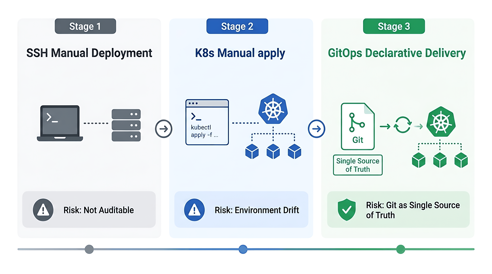
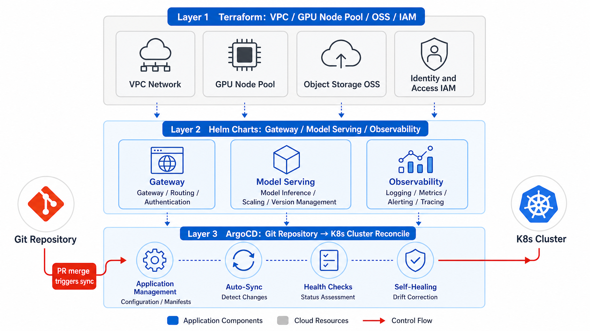

# Chapter 46 GitOps, IaC, and Edge Inference

---

Manual deployment fails less because it is slow than because it is hard to reproduce. Teams often cannot answer who changed what, when the change took effect, or whether the running environment still matches the desired state. GitOps and IaC put infrastructure, model services, gateway policy, and edge inference nodes into a declarative change process so environment drift, promotion, and rollback can be audited. Git records the desired state. ArgoCD, Terraform, Helm, and related tools perform delivery. Store and factory edge nodes should be governed by the same model.

A common incident starts with a temporary `kubectl edit` during production troubleshooting. The operator fixes the immediate symptom, forgets to revert the change, and a few days later staging and production no longer agree on gateway policy, canary percentage, tenant whitelist, or backend model. The release passed in staging but behaved differently in production, and the postmortem found no PR for the actual change. GitOps and IaC are meant to solve this reproducibility problem. Every promotion, rollback, and drift signal should leave evidence instead of relying on a person's memory.

Agent platforms make the problem more visible because the changing objects include model services, gateways, permissions, GPU node pools, and edge deployments. Once these states drift, debugging becomes expensive. Terraform manages cloud resources and cluster foundations, Helm manages application and model-service configuration, and ArgoCD synchronizes the desired state in Git into the cluster. Edge inference adds another constraint: stores, factories, and private networks may be intermittently connected, so model weights, cache, configuration, and logs need an explicit synchronization strategy. If edge nodes are maintained manually, version differences persist for months and the platform cannot explain why users in different locations see different behavior.

---

## 46.1 From Manual Deployment to Declarative Delivery: Evolution Path of Agent Platform Infrastructure

Chapters 43-45 delivered compute, model services, and the gateway respectively. Chapter 46 explains how to deliver these components collectively in a versioned, promotable way to dev, staging, and prod environments, and how to incorporate store and factory edge locations into the same governance model. Without GitOps, Canary traffic percentages from Chapter 44, tenant whitelists from Chapter 45, and node pool labels from Chapter 43 will drift independently across the three environments. Passing staging tests while production behaves differently is the most common environment lie.

An enterprise agent platform usually evolves through three stages: first, engineers SSH into GPU machines to start vLLM; second, Kubernetes plus Helm with manual `kubectl apply`; third, the Git repository declares desired state, and Argo CD synchronizes it to clusters. In one production incident, an operator manually edited LiteLLM's ConfigMap through `kubectl edit` in prod to troubleshoot latency and forgot to revert the change, causing model overload and widespread 502 errors. Worse, there was no PR, no ArgoCD sync record, and no Terraform state change. The postmortem could not answer who changed what and when. The risk of manual deployment is lack of auditability, rollback, and reproducibility.



*Figure 46-1: GitOps transforms deployment from "SSH on machines" with no record on the left into declarative config changes reviewed via PR and auto-synced by CI on the right. Source: this book. Alt text: Left "manual deployment" involves direct SSH config edits without trace; right "GitOps" uses PR-based declarative config changes validated by CI and auto-synced, showing deployment shifting from manual work to code review.*

In Figure 46-1's third stage, the only valid path to changing production is to merge to protected branches and perform manual prod sync. The production control question now covers both `kubectl` permission and whether operational memory is externalized into Git history.

### 46.1.1 Core GitOps Mechanisms: Declarative Configuration, Git as Single Source of Truth, Auto Sync, and Drift Detection

GitOps four principles:

1. **Declarative:** Cluster state described by YAML/HCL, not imperative scripts.
2. **Git as SSOT (Single Source of Truth):** Changing production means merging a PR.
3. **Automatic Synchronization:** ArgoCD/Flux reconcile desired vs actual states.
4. **Drift Detection:** Manual `kubectl edit` marks resources OutOfSync and can auto-fix optionally.

The reconcile loop is the heartbeat of GitOps: ArgoCD compares Git commits to cluster objects every 3 minutes by default, and if diffs exist, it performs a Sync or sends alerts. The prod `llm-gateway-prod` Application disables automated sync but continues diff monitoring. OutOfSync itself signals that someone bypassed Git.

Several terms need to be separated before the delivery flow becomes readable. GitOps uses Git to drive deployment and change, and it focuses on continuous alignment between desired cluster state and actual state. It is different from CI, which mainly builds and verifies artifacts. IaC describes infrastructure in code and covers multiple layers, including Terraform, Helm, and Kustomize. Promotion means advancing configuration from dev to staging and then to prod, not simply copying an image tag. Drift means that the actual cluster state no longer matches the state declared in Git; this is different from a Canary traffic ratio, which is still part of an intentional release strategy. Git repo structure (indicative, matching component names in Chapters 44/45):

```text
agent-platform-gitops/
├── terraform/           # Cloud resources: VPC, GPU node pools, OSS
├── helm/
│   ├── llm-gateway/     # Chapter 45 LiteLLM
│   ├── model-serving/   # Chapter 44 KServe InferenceService
│   └── observability/   # Chapter 38
├── kustomize/
│   ├── overlays/dev
│   ├── overlays/staging
│   └── overlays/prod
└── argocd/apps/         # Application definitions
```

The `helm/model-serving/values-prod.yaml` sets `canaryTrafficPercent` and OSS URI for `llm-general-32b`; `helm/llm-gateway/values-prod.yaml` sets tenant quotas and backend lists. The same PR can atomically change model and routing, avoiding the window where Chapter 44 has Canary at 20% but Chapter 45 still points to the old Service.

### 46.1.2 Engineering Boundaries for GitOps Delivery

#### Reducing GitOps to Putting YAML in Git

Without automatic reconciliation, PR gates, or secret separation, YAML in Git is only a backup copy. A real GitOps process needs ArgoCD, branch strategy, promotion workflow, and External Secrets. In one rollout, YAML was committed but deployment still happened through manual `kubectl apply`. Long-term drift between Git and the cluster caused ArgoCD to delete a manually created Ingress during its first sync. Baseline alignment has to happen before self-heal is enabled.

#### Treating Terraform and Helm as an Either-Or Choice

Terraform excels at cloud resources such as GPU node pools, networks, and IAM. Helm excels at packaging Kubernetes applications. Use both: Terraform manages `gpu-inference` node pools and model OSS buckets; Helm deploys KServe and LiteLLM. Hardcoding Deployment templates in Terraform is less maintainable than Helm, while creating VPCs in Helm weakens state management and module reuse. The boundary should follow the managed object, not a team's tool preference.

#### Operating Edge Inference Outside GitOps

When hundreds of stores manually upgrade llama.cpp, version fragmentation is unavoidable. Different regions may run different quantized models, sales scripts may produce inconsistent answers, and headquarters cannot reproduce complaints. Edge should be modeled as a GitOps `overlay` with a different synchronization policy: central Git publishes the manifest, the store OTA Agent reconciles it, and the governance principle stays aligned with cloud-side ArgoCD.

#### Reducing Promotion to Image Tag Movement

Agent platform promotion is mainly promotion of Helm values and Terraform variables: OSS URIs, Canary percentages, and LiteLLM tenant quotas change together. Promoting only the gateway image digest while leaving model-serving values behind creates implicit drift: a new gateway points to an old model URI. PR templates should list every affected Application.

---

## 46.2 IaC Toolchain: Terraform Resource Orchestration, Helm Chart Packaging, and ArgoCD Continuous Delivery

The delivery stack in Part VIII has four collaboration layers: **Terraform manages cloud, Helm manages apps, Kustomize manages environment differences, ArgoCD manages sync.** Each layer has clear SSOT boundaries, avoiding a "mega-repo script" approach. The layers connect through explicit interfaces, not memory. Terraform outputs node-pool names, labels, OSS buckets, and IAM roles for Helm values. Helm renders Service and InferenceService names that the gateway Chart references. Kustomize overlays express only environment differences, not new business meaning. ArgoCD synchronizes a selected revision into the target cluster; it does not replace CI semantic checks.

IaC also has to encode who may change which object. GPU node pools, model buckets, and IAM policies normally require platform owner and security review. Model URIs, Canary percentages, and gateway tenant policy require platform and business owner review. Observability and alerting changes require SRE review. GitOps does not create governance by itself; PR reviewers, CODEOWNERS, branch protection, and ArgoCD RBAC turn governance into daily practice.

For an Agent platform, declarative configuration also serves as documentation. A reader should be able to inspect `values-prod.yaml` and understand which model services, tenants, fallbacks, and edge overlays exist in production. If the configuration is only a pile of variable names with no naming convention or comments, the GitOps repository becomes another black box. This chapter cares about reviewable, comparable, and rollback-capable operating assumptions, instead of the slogan that everything must be YAML.

*Table 46-1: Responsibilities and managed objects of IaC tools like Terraform and Helm Chart. Source: this book.*

| Tool | Responsibility | Managed Objects | Typical Use |
|---|---|---|---|
| Terraform | CRUD cloud resources | VPC, node pools, OSS, IAM | GPU node pools, model buckets |
| Helm | Kubernetes app templating | Deployment, Service, CRD values | LiteLLM, KServe |
| Kustomize | Patch environment differences | overlay patches | dev/staging/prod replica counts |
| ArgoCD | Git -> Cluster sync | Application, AppProject | Per-environment Applications |

Terraform state records OSS bucket ARNs and node pool IDs; Helm values reference IAM Roles via External Secrets. The division between cloud and application is explicit. When on-call sees an InferenceService OSS 403, the first check is the Terraform IAM module, not a Pod restart.



*Figure 46-2: Terraform manages cloud infra resources, Helm Charts manage Kubernetes app configs, ArgoCD continuously compares Git and actual cluster state and auto fixes. Three collaborate to cover the full cloud-to-app declarative delivery. Source: this book. Alt text: Three-layer separation: Terraform manages cloud infrastructure resources; Helm Chart manages Kubernetes app configuration; ArgoCD continuously compares Git and actual cluster state and auto remediates, covering all declarative delivery from cloud to app.*

Figure 46-2 shows four-layer collaboration: Terraform declares cloud resources, Helm packages Kubernetes apps, Kustomize expresses environment overlays, and ArgoCD reconciles Git commits to clusters. A PR merge is the legitimate trigger for production change.

#### ArgoCD and Flux

Multiple business units and platform SREs need to view production diffs and sync history, and ArgoCD's UI lowers the communication cost around configuration changes. Flux fits teams that already work deeply in GitOps and do not need a visual interface. The decision should consider the organization as well as feature lists: when business owners, platform owners, and SREs all need to review a release diff, ArgoCD is often easier to operate; when all approvals and inspections already happen through CLI and automation, Flux can be a lighter option.

#### Single-Repository and Multi-Repository GitOps

The ability to merge Chapter 44 Canary changes and Chapter 45 routing changes atomically in one PR is the main benefit of a monorepo in the early phase. Splitting `terraform/` and `helm/` into separate repositories can make sense later, but promotion tags must align across repositories. For example, `prod-v1.2.0` should pin both the model-serving and gateway chart versions. Repository splitting is not maturity by itself. Without a shared release manifest, model service, gateway, and observability configuration will promote independently and drift again in production.

### 46.2.1 Platform Delivery Layers: Network, Storage, GPU Node Pools, Model Services, Gateway, and App Stack

Delivery order should be bottom-up, consistent with Chapters 43-45. Upper Applications depend on lower resource IDs and Secrets; skipping layers through direct cluster edits causes ArgoCD PreSync hook failures or harder-to-detect silent misconfiguration.

*Table 46-2: Components and delivery methods of platform layers: network, storage, GPU node pools, etc. Source: this book.*

| Layer | Components | Delivery Method | Dependencies |
|---|---|---|---|
| L0 Network | VPC, subnet, security group | Terraform | None |
| L1 Compute | GPU node pool, Device Plugin | Terraform + DaemonSet | L0 |
| L2 Storage | OSS buckets, PVC | Terraform | L0 |
| L3 Model Service | KServe InferenceService | Helm | L1, L2 |
| L4 Gateway | LiteLLM | Helm | L3 |
| L5 Platform Apps | Agent Runtime, DataAgent | Helm/Kustomize | L4 |
| L6 Observability | OTel, Langfuse | Helm | L5 |

Direct cluster changes that skip PRs break upper-layer assumptions. Typical errors include manually scaling GPU node pool `max_size` without updating Terraform, which causes Cluster Autoscaler and FinOps tag drift, or manually changing a LiteLLM backend without updating Helm, which lets ArgoCD overwrite the change on the next sync and creates intermittent failures that look mysterious during incident review. Helm release order of L3 and L4 is controlled by ArgoCD Application dependencies or sync waves: first `model-serving-prod`, then `llm-gateway-prod` after the model service is Ready. This prevents gateways from pointing to nonexistent InferenceServices.

### 46.2.2 Environment Management: Config Differences, Secret Management, and Promotion Process for Dev, Staging, Prod

Three-environment differences are more than halved replica counts. Model weights, external API policies, and sync gates differ, and these differences must be stated explicitly in `values-*.yaml` and Kustomize overlays instead of being handled by verbal agreement.

*Table 46-3: Comparison of config differences and secret management for dev, staging, prod environments. Source: this book.*

| Dimension | dev | staging | prod |
|---|---|---|---|
| GPU nodes | 1-2 shared GPUs | Small cluster same as prod | Full node pool |
| Models | 7B quantized | Same weights as prod | 32B+ production weights |
| Replicas | 1 | 2 | ≥4 |
| External APIs | Allowed | Allowed (quota-limited) | Finance disabled |
| Sync strategy | Automatic | Automatic | **Manual approval** |

Secrets management has a hard baseline: never store plaintext keys in Git. Use External Secrets Operator (ESO) to inject from Vault/KMS. LiteLLM `master_key`, cloud API keys, and OSS credentials all use Secret references. A PR shows only `secretRef: vault/path/openai-key`, never plaintext. Finance tenant cloud keys do not exist at the Vault path level, adding a second control alongside the Chapter 45 tenant whitelist.

Promotion process: dev auto sync -> staging auto sync plus integration tests (including the Chapter 39 offline gate) -> prod Platform Owner approval plus ArgoCD manual sync. Config diffs must be auditable: ArgoCD `app diff` should match the PR diff. After staging passes, create tag `prod-v1.2.0`; the prod Application's `targetRevision` points to that tag instead of a floating `main`. Production cannot track a moving head.


*Figure 46-3: Production promotion must have manual gate, different from dev's automatic sync. Source: this book. Alt text: dev and staging allow automatic sync, but prod has a manual approval gate indicated at the entry, with arrows showing sync only triggers after approval, reflecting differentiated release cadence.*

Figure 46-3 emphasizes the difference in production sync strategy: dev and staging may auto sync, while prod requires manual approval and manual sync. Promotion windows before a business peak should be scheduled early. For example, `llm-general-32b.minReplicas` is promoted with a tag after staging load tests, and prod manual sync happens during a low-traffic window instead of a few hours before the peak.

### 46.2.3 Edge Inference Scenarios: Store Terminals, Factory Edge Nodes, Offline/Low Network, and Hybrid Cloud Topologies

A retail enterprise platform team may need to serve hundreds of stores with offline shopping assistants; manufacturing factories may run isolated networks that require millisecond-level responses for QC Agents; logistics handheld devices still need waybill queries over mobile networks. Sending everything to the Chapter 45 cloud gateway and Chapter 44 32B models is impractical because weak network RTT and disconnections break the experience. **Edge inference is a deployment location extension, not a separate architecture:** the control plane remains central GitOps, while edge uses special `overlay` and OTA reconcile policies. Edge scenario characteristics:

*Table 46-4: Constraints, model sizes, and sync strategies of edge inference scenarios like stores and factories. Source: this book.*

| Scenario | Constraints | Model Size | Sync Strategy |
|---|---|---|---|
| Store Sales Assistant | Weak network, privacy | 3B-7B quantized | Nightly batch OTA |
| Factory QC | Isolated network, low latency | 7B vision-language | Triggered by work orders |
| Logistics Handheld | Mobile network | 3B text model | Region CDN delivery |

Stores can run llama.cpp 7B Q4 for high-frequency Q&A about size, inventory, and return policies. Complex complaints or cross-SKU reasoning fall back to the central Chapter 45 gateway with `llm-general-32b`. That fallback path needs a circuit breaker; under weak networks, a local degraded response such as "please contact support" is better than waiting indefinitely on the central link.


*Figure 46-4: Edge nodes are GitOps special overlays, not governance-isolated islands. Source: this book. Alt text: Cloud Git repo applies overlays to cover edge node special configs such as lightweight models and offline cache; edge nodes remain within the GitOps sync framework instead of becoming manually maintained islands.*

Figure 46-4 illustrates a hybrid topology with central GitOps and three edge node types: store, factory, and logistics. Edge nodes run llama.cpp, ONNX, or MLC small models; the control plane still synchronizes OTA from a central manifest. They are not separate governance islands. Factory QC ONNX models exported from the central training pipeline share the same version schema as cloud KServe models, which makes it possible to reconcile complaints about "edge 7B vision versus cloud 32B review" against the same release train.

#### Edge vs Cloud Request Routing Decisions (Illustrative)

*Table 46-5: Reasoning basis for handling requests at edge or fallback to center. Source: this book.*

| Request Type | Edge Handling | Fallback Conditions to Center |
|---|---|---|
| Store FAQ, size/inventory | llama.cpp 7B | Low confidence / user demands human |
| Factory visual defect pre-judgment | ONNX small model | Borderline samples / require 32B review |
| Logistics handheld waybill query | MLC 3B | Complex claims / multi-turn dialogs |
| Enterprise-wide DataAgent NL2SQL | Never edge fallback | Always via Chapter 45 -> `llm-code-7b` |

Fallback requests carry `edge_store_id` and `edge_model_version` headers. Central gateway observability distinguishes "edge origin" from "pure cloud" so FinOps can allocate retail store compute separately from central GPU.

### 46.2.4 Edge Inference Engines Comparison: ONNX Runtime, llama.cpp, MLC, and Cloud Model Coordination

*Table 46-6: Comparison of edge inference engines like ONNX Runtime and llama.cpp: advantages, costs, suitability, cloud synergy. Source: this book.*

| Engine | Advantages | Costs | Suitable For | Cloud Coordination |
|---|---|---|---|---|
| llama.cpp | Lightweight CPU/GPU, mature quantization | Limited large model performance | Stores <= 7B | Complex queries fallback gateway |
| ONNX Runtime | Cross-framework, inference optimizations | Conversion pipeline | Vision QC small models | Central training -> ONNX distribution |
| MLC LLM | Mobile-side, NPU acceleration | Ecosystem young | Handheld devices | Works with cloud models |
| Cloud KServe | Most powerful models | Network reliance | Non-edge scenarios | Edge fallback to upstream |

In a hybrid approach, edge services handle roughly 80% of high-frequency simple requests. Timeout or low-confidence cases fall back to the Chapter 45 gateway with a 32B cloud model. Network-layer circuit breakers are required so weak links do not drag down the central service. Logistics handheld devices can run a 3B model with MLC on NPU, and fallback sends only structured JSON to save bandwidth.

### 46.2.5 Failure Modes: Config Drift, Sync Conflicts, Rollback Failures, Edge OTA Interruptions, and Version Fragmentation

GitOps failures usually do not happen because the tools are unavailable. They happen because the organization bypasses the tools. Terraform state without locking, ArgoCD OutOfSync treated as noise, External Secrets rotation failures, and half-applied edge OTA updates all turn "Git as the source of truth" into a slogan. The platform should write these failure modes into delivery policy, not leave them as one SRE's private experience.

Drift is hard because it often appears under the name of temporary repair. During a production incident, directly running `kubectl edit` on a ConfigMap may indeed be the fastest move. The problem is that if the temporary change is not written back to Git, it may be overwritten by the next sync, or nobody will know during the next incident that the cluster has already diverged. GitOps does not ban emergency operations, but it requires an incident ID, an expiry time, and a path back to Git. Otherwise manual deployment simply survives under another name.

Sync conflicts are also common when multiple Charts share resources. One Chart manages a CRD while another tries to upgrade the same CRD. One team changes `model-serving` values while another changes `llm-gateway` backends. Two PRs pass staging separately but conflict when combined into the prod tag. The answer is not to make everyone wait for a release manager. Dependencies should be written into directory structure, sync waves, and CI checks. Names, dependencies, and versions that machines can check should not depend on meeting memory.

Edge OTA risks differ from cloud rollback risks. In the cloud, a failed deployment can roll back to an older Revision. At the edge, failure may happen under weak networks, power loss, or small disks. If a partially downloaded model file is loaded directly, the symptom may not be startup failure. It may be low-quality answers or random crashes. Edge updates therefore need a staging directory, checksum verification, atomic switching, and retained old versions. Central inventory must also see the current version of every store; otherwise version fragmentation will surface during complaint review.

*Table 46-7: Responsibilities, inputs/outputs, and failure modes of GitOps components. Source: this book.*

| Component | Responsibility | Input | Output | Failure Mode |
|---|---|---|---|---|
| Terraform | Cloud resource desired state | HCL | Resource IDs | State lock conflicts |
| ArgoCD | Kubernetes sync | Git commit | Sync status | Unresolved OutOfSync |
| External Secrets | Secret injection | Vault | K8s Secret | Rotation window failures |
| Edge OTA Agent | Edge model updates | Artifact manifest | Local model version | Network interruption partial update |

*Table 46-8: Detection and recovery of failure modes like config drift, sync conflicts, edge OTA interruptions. Source: this book.*

| Failure Mode | Trigger Condition | Impact | Detection Method | Recovery Strategy |
|---|---|---|---|---|
| Config drift | Manual `kubectl edit` | Git vs cluster mismatch | ArgoCD OutOfSync alerts | Auto self-heal or PR fix |
| Helm value conflicts | Two charts conflict on same CRD | Deployment failure | Helm template CI | Version lock on chart dependencies |
| Git rollback failure | Incomplete revert merge | Mixed prod versions | ArgoCD history | Fixed tag re-sync |
| Edge OTA interruption | Network download interruption | Corrupt edge model | Checksum validation | Atomic replace after full download |
| Version fragmentation | Stores upgrade individually | Inconsistent experience | Edge version reporting | Enforce minimum version + batch OTA |

Drift is GitOps' immune response. OutOfSync is not noise; it signals that someone bypassed PRs. Enabling self-heal in prod is controversial. Large enterprises often default to **no auto heal in prod, only alert then manual confirm plus sync** to avoid masking legitimate emergency changes, which still require retrospective PRs.

#### Naming Conventions for Components in Chapters 43-45 in Git

*Table 46-9: Naming conventions and key values fields for Chapters 43-45 components in Git. Source: this book.*

| Git Path | Chapter | Key Values Fields |
|---|---|---|
| `terraform/node-pools/gpu-inference.tf` | Chapter 43 | min/max_size, labels |
| `helm/model-serving/values-prod.yaml` | Chapter 44 | storageUri, canaryTrafficPercent |
| `helm/llm-gateway/values-prod.yaml` | Chapter 45 | model_list, tenantPolicy |
| `argocd/apps/prod/*.yaml` | Chapter 46 | targetRevision tag |

Naming mismatches (e.g., gateway writes `general-32b` while KServe names the service `llm-general-32b`) cause implicit "syncable but not callable" faults during promotion. PR templates should cross-check service names against the Chapter 45 contract.

---

## 46.3 Terraform, Helm, and ArgoCD Delivery Pipeline

Complete pipeline: **Terraform plan/apply node pools and OSS** -> **Helm CI template validation** -> **ArgoCD Application points to tag** -> **staging integration tests** -> **prod Manual Sync.** Engineers are forbidden from running local `kubectl apply -f` directly against prod. A dev cluster can be an exception, but the same-named overlay must be written back to Git.

#### Terraform GPU Node Pool (Snippet)

Consistent with Chapter 43 `gpu-inference` labels and taints for Chapter 44 InferenceService node affinity.

```hcl
# Example: GPU inference node pool (production engineering example)
resource "cloud_kubernetes_node_pool" "gpu_inference" {
  cluster_id   = cloud_k8s_cluster.agent_platform.id
  name         = "gpu-inference"
  min_size     = 4
  max_size     = 20
  instance_type = "gpu.a100.80g.8xlarge"   # illustrative, adjust per cloud vendor

  labels = {
    nodepool  = "gpu-inference"
    workload  = "online-infer"
  }

  taint {
    key    = "workload"
    value  = "online-infer"
    effect = "NoSchedule"
  }
}
```

Terraform Cloud or OSS backend stores state; `terraform plan` shows diffs in PR bot comments; after merge CI applies staging; prod apply requires two-person approval.

#### ArgoCD Application (Snippet)

```yaml
# Example: Production LiteLLM gateway Application
apiVersion: argoproj.io/v1alpha1
kind: Application
metadata:
  name: llm-gateway-prod
  namespace: argocd
spec:
  project: agent-platform-prod
  source:
    repoURL: https://git.example.com/agent-platform-gitops.git
    targetRevision: prod-v1.2.0          # fixed tag, avoid floating branch
    path: helm/llm-gateway
    helm:
      valueFiles:
        - values-prod.yaml
  destination:
    server: https://kubernetes.default.svc
    namespace: llm-gateway
  syncPolicy:
    automated: null                       # prod forbids auto sync
    syncOptions:
      - CreateNamespace=true
```

`model-serving-prod` Application has similar structure; `values-prod.yaml` includes `llm-general-32b`'s `canaryTrafficPercent` and OSS URI. Both Applications promote with the same tag.

#### Kustomize Prod Overlay (Snippet)

```yaml
# Example: Increase gateway replicas in prod environment
apiVersion: apps/v1
kind: Deployment
metadata:
  name: litellm
spec:
  replicas: 4
```

Business peak window overlay patches `replicas: 8` and HPA max, promoted through separate PR merge with tag, not via `kubectl scale`.

#### Edge llama.cpp systemd Unit (Illustrative)

```ini
# Example: Store edge inference service
[Service]
ExecStart=/opt/llama-cpp/server -m /var/models/qwen2.5-7b-q4_k_m.gguf --port 8080
Restart=on-failure
Environment=UPSTREAM_GATEWAY=https://llm-gateway.prod.example.com
```

Edge OTA follows the same philosophy as ArgoCD reconcile: align desired state before switching traffic. Central Git publishes `manifest.json` with `model_version`, `sha256`, and `url`; the store OTA Agent downloads it at night to `.staging`, verifies the checksum, and atomically renames it to `/var/models/active`.

#### Verification Commands

```bash
terraform plan -out=tfplan          # Preview cloud resource changes
helm template llm-gateway ./helm/llm-gateway -f values-prod.yaml | kubectl apply --dry-run=client -f -
argocd app diff llm-gateway-prod    # Diff before sync
```

CI gates: if `helm template` fails, PR cannot merge; if `argocd app diff` non-empty, prod sync needs second confirmation. Staging auto sync triggers post-merge smoke tests: gateway pings four tenants, `llm-code-7b` NL2SQL samples, finance tenant forbids cloud probes.

#### model-serving Helm and KServe values file (snippet)

Chapter 44's InferenceService is managed by GitOps, not raw `kubectl`:

```yaml
# Example snippet from helm/model-serving/values-prod.yaml
inferenceServices:
  llm-general-32b:
    storageUri: oss://agent-platform-models/llm/qwen2.5-32b-awq/v20260301/
    minReplicas: 4
    maxReplicas: 8
    canaryTrafficPercent: 0
    nodepool: gpu-inference
  llm-code-7b:
    storageUri: oss://agent-platform-models/llm/qwen2.5-coder-7b/v20260301/
    minReplicas: 2
    maxReplicas: 4
  embed-bge-m3:
    runtime: triton
    storageUri: oss://agent-platform-models/embed/bge-m3/v20260301/
```

When promoting, if only `llm-general-32b.storageUri` changes, the same PR should update offline evaluation links from Chapter 39; ArgoCD sync then triggers Canary per Chapter 44 runbook.

#### Edge overlay directory structure (illustrative)

```text
kustomize/overlays/edge-retail-store/
├── kustomization.yaml
├── llama-cpp-config.yaml
└── ota-manifest-ref.yaml   # Points to central manifest tag
```

Edge does not run ArgoCD Server, but the OTA Agent pulls manifest tags matching the cloud `prod-v*` source. Version fragmentation can be located through central inventory.

### 46.3.1 Configuration Drift and Partial Edge Updates: First Checks

#### ArgoCD Prod Automated Sync Releases Unapproved Changes

- Symptom: Engineer merges to main, prod gateway config changes within 5 minutes, fallback disables during peak.
- Root cause: Application copied dev's `automated: {}` to prod; main branch used alongside prod tags.
- Fix: Prod must have `automated: null` + manual sync; branch protection + mandatory reviewers; prod tracks only tags.

#### Missing Terraform State Locking Corrupts Node Pool Changes

- Symptom: GPU node pool max_size overwritten, Cluster Autoscaler misbehaves; Chapter 44 HPA scales pods but no nodes available.
- Root cause: Local state file without remote backend; two engineers apply different HCL simultaneously.
- Fix: Use Terraform Cloud or OSS backend + locking; forbid local prod apply; audit state changes.

#### Edge OTA Without sha256 Validation Corrupts Store Model Files

- Symptom: Some store sales Agents output errors, file sizes 200MB short.
- Root cause: Incomplete downloads on flaky networks; OTA Agent did not rename atomically.
- Fix: Download to `.staging`, require sha256 pass before renaming active; startup probe tests tokenizer smoke; central inventory reports versions, and versions below `min_version` trigger forced OTA.

Production delivery should bind permissions, audit, and rollback together. ArgoCD AppProject should limit which Namespace and resource types each Application may write, and prod sync should be executable only by the Platform Owner or release automation. Git PR, ArgoCD Sync, and Terraform apply records must line up with each other. If a model release is visible in Git but no corresponding ArgoCD Sync exists, it has not actually reached production. If a Terraform apply has no run_id, the team cannot later explain why a node pool became larger at a specific time.

Cost and performance should also enter the GitOps record. Terraform GPU node pools need environment, business unit, and cost-center tags, and autoscaling bounds should be reviewed through PR instead of changed in a cloud console. Helm CI `template` validation proves only that YAML renders; it does not prove that the model loads. Before prod promotion, staging still needs smoke tests for cold start, gateway, tenant policies, and rollback using the same model weights as production. Edge nodes also need to report `edge_model_version`, manifest tag, and verification results; an edge version that central inventory cannot see is not governable.

Disaster recovery starts with fixed versions. Prod Applications should not track a floating branch. They should track `prod-v*` tags. Rollback syncs to the previous tag and retains the corresponding Terraform, Helm values, and model manifest. `argocd app sync --revision <tag>` is not a magic button; it works only if the old model URI, Secret references, and edge manifests remain accessible.

Drift handling should distinguish emergency changes from unauthorized changes. During a production incident, SRE may need to temporarily patch a replica count or remove a broken backend. Such operations can exist, but they need an incident ID, an expiry time, and a follow-up PR. OutOfSync without an incident ID should be treated as an unauthorized change; an incident-linked OutOfSync that is not written back to Git on time should be escalated to the platform owner. This preserves emergency response without letting the emergency path become normal operations.

Release records should support cross-layer tracing. A finance compliance issue may need to trace from gateway audit logs to Git PR, ArgoCD Sync, and Terraform apply. A model latency issue may need to trace from a runtime Trace to KServe Revision and then to node-pool scaling records. Triple audit is not process overhead for its own sake. It lets teams complete these traces in minutes. Without shared fields, postmortems return to asking who remembers what changed.

Triple audit also supports normal operations. A platform monthly review can use PR paths to see which components change most often, ArgoCD Sync records to see which environments fail most often, and Terraform apply records to see which resources are repeatedly expanded temporarily. If the team has to assemble this manually every month, structural problems stay hidden. For example, frequent hotfixes to `llm-gateway` quota policy suggest the quota model does not fit business rhythm; repeated temporary expansion of `gpu-inference` suggests capacity planning or peak prewarming needs redesign.

For the English edition and later versions, this GitOps chapter also provides the book's closure around engineering reproducibility. Earlier chapters cover Runtime, model service, gateway, observability, and security. If deployment still depends on manual operations, readers cannot reproduce those capabilities reliably. Chapter 46 puts them back into a declarative delivery flow and shows that an enterprise Agent platform must be versioned, audited, rolled back, and reproduced across environments.

This is also what makes the chapter different from a general DevOps tutorial. The book is not mainly concerned with deploying any application to Kubernetes. It is concerned with Agent-platform-specific change objects: model weights, prompts, ToolSpecs, tenant policies, GPU node pools, edge manifests, and evaluation evidence. Together they determine which path an Agent call takes, what capabilities it sees, and what risks it carries. GitOps puts these objects in one reviewable change system so the platform can move from pilot engineering to maintainable production. GitOps is therefore not decorative closure for Part VIII. It is the mechanism that keeps the previous layers running according to their design. Without it, model serving, gateways, and scheduling will drift after a few manual repairs.

The key judgment for readers is this: any object that can change Agent behavior, cost, permissions, or observability evidence belongs in a declarative change process. Only then can an enterprise platform stay consistent across people, environments, models, and edge nodes. The same principle applies to future case studies and hands-on projects.

#### Triple Audit Field Alignment

*Table 46-10: Key fields alignment for Trace, audit logs, GitOps change records. Source: this book.*

| System | Mandatory Fields | Use |
|---|---|---|
| Git PR | author, paths, tag | Who changed what config |
| ArgoCD Sync | revision, initiator, diff | When changes reached cluster |
| Terraform apply | workspace, run_id, resource | Cloud resource changes |

All three systems use consistent `tenant` and `environment` tags matching Chapter 45. This lets finance compliance audits trace any PR that relaxes cloud backend permissions. Under the intended process there should be no such PR; if one exists, the process has already failed.

## 46.4 GitOps as the Release Evidence Chain

GitOps is useful because it turns production changes into an evidence chain. A model-service scale-out, gateway policy adjustment, secret rotation, or edge model rollout should be traceable from Git PR to ArgoCD Sync, then to cluster objects and runtime metrics. When an incident occurs, the team can determine who changed what, when it entered production, and which tenants were affected.

IaC and application configuration should remain layered. Node pools, networks, object storage, and IAM fit Terraform. KServe, LiteLLM, Runtime, and observability components fit Helm or Kustomize. Tenant policies and model routing can live in controlled values files. Putting everything into one script may be fast in the short term, but it weakens rollback and audit. Layering is not for directory aesthetics; it clarifies ownership and rollback granularity.

Edge inference especially needs GitOps discipline. Stores, factories, and handheld devices often run under unstable networks, and model versions may be distributed across multiple batches. OTA needs an artifact manifest, checksum, rollout batch, and rollback path. Otherwise the central platform may report a release as complete while edge sites still run old or partially updated models.

Drift handling needs rules. Production cannot avoid every emergency change, but any manual repair must be written back to Git or restored through a PR. Long-lived OutOfSync state weakens Git as the source of truth. The compute, serving, and gateway capabilities from Chapters 43-45 enter production through the release evidence chain in this chapter. The acceptance standard is concrete: drift is visible, rollback is executable, and the release can be reproduced.

GitOps should also connect to evaluation gates. Before PRs for model services, gateway routing, and Guardrails policy can be merged, the corresponding evaluations should run. If evaluation fails, the configuration should not enter production sync. In that sense, Git records change and also becomes a quality-control entry point.

## 46.5 GitOps drift review and emergency-change closure

The value of GitOps is not limited to automatic synchronization. It also detects drift. Production environments still see manual hotfixes, console edits, temporary scaling, secret rotation, vendor callback changes, and network-policy exceptions. If those changes do not return to Git, platform state gradually diverges from declarative configuration. Drift review should record change source, affected resources, duration, write-back plan, and risk judgment, so emergency handling does not become a permanent hidden state.

Emergency changes also need closure. During an incident, SRE may temporarily adjust replicas, disable a route, freeze a tool, or expand a queue. After the incident, the real state must be reconciled back into Git, Terraform, Helm values, or ArgoCD Application. Closure compares desired state with actual state and decides which changes remain, which roll back, and which become formal configuration. Without this closure, GitOps becomes declarative in normal times and manual under pressure, leaving audit and incident review without a stable source of truth.

A first version can keep a simple drift review record. Whenever production configuration differs from Git, the record states resource, difference, operator, reason, business impact, retention decision, and write-back pull request. The record does not need to be heavy, but it should let the platform answer whether the current environment matches repository declarations, which differences are intentional, and which remain unresolved. For an enterprise Agent platform, GitOps should govern release, rollback, drift, and emergency-change closure together.

## 46.6 GitOps change windows and rollback drills

After GitOps records changes in the repository, teams still need to manage change windows. An Agent platform deploys many objects: model services, gateways, Runtime, tool adapters, Trace Collector, evaluation jobs, and edge inference services. Their risks differ, so they should not all follow the same merge and sync rhythm. High-risk model routing, gateway policy, and permission configuration should ship during low business traffic or canary windows. Lower-risk documentation, metric dashboards, and non-production configuration can move faster.

Change windows should align with business calendars, capacity planning, and support staffing. During promotions, quarter close, regulatory reporting, business review meetings, or major model upgrades, the platform should restrict high-risk infrastructure and policy changes. If an emergency fix cannot wait, the change record should state why, which tenants are affected, how rollback works, and who watches the result. GitOps records what changed. The change window explains why that time was acceptable.

Rollback drills should verify more than whether ArgoCD can return to an old commit. Teams should confirm that old images are still pullable, old Helm values still fit the current cluster, old Terraform state will not damage new resources, old gateway policies can recognize current tenants, and old model services can read current weights and caches. For edge inference, they should also confirm that offline nodes will not overwrite newer configuration after network recovery. Without these drills, GitOps can create the appearance of rollback safety while recovery still fails.

A first version can define release windows and rollback-drill frequency by change type. Model-service and gateway-policy changes rehearse before each high-risk release. GPU node pools and edge nodes rehearse quarterly. Low-risk configuration receives monthly sampled checks. Drill results should enter the review material for Chapter 38 Trace and Chapter 42 SLO. GitOps then becomes part of change evidence, risk communication, and recovery capability for the Agent platform.

## 46.7 Security audit for declarative configuration

GitOps and IaC turn infrastructure changes into declarative configuration, and they also place security risk in the repository. A Helm value, Terraform variable, or ArgoCD Application change may open external access, broaden permission, change model routing, disable audit logs, or relax network policy. The platform should check more than whether configuration can deploy. It should check whether configuration satisfies security and compliance constraints. Declarative delivery is reviewable, and the review should include risk semantics.

Security audit should happen before merge and after deployment. Before merge, checks can detect leaked secrets, overly broad IAM, public LoadBalancers, unrestricted egress, missing resource limits, disabled audit, and approval bypass. After deployment, the platform should confirm that real cluster state matches declaration, because manual hotfixes or controller defaults can change the security boundary. If an emergency change bypasses the normal flow, it still needs to return to Git afterward with reason, approval, diff, and rollback record.

A first version can maintain a configuration-audit checklist for the Agent platform: model serving, gateway, vector database, tool service, Trace, logs, object storage, queue, and frontend entry points each have security fields. Every GitOps release produces configuration diff, policy-check result, and post-deployment state summary. Infrastructure changes then become security and compliance evidence along with repeatable deployment.

## 46.8 Business-readable summaries for GitOps changes

GitOps changes usually appear as YAML diffs, which business owners cannot easily interpret. A change to `replicaCount`, `canaryTrafficPercent`, `model_uri`, or `tenant_quota` can affect cost, latency, model capability, and user-visible output. The platform should convert key GitOps changes into business-readable summaries as part of release material.

The summary does not need to explain every field, but it should state affected scope. A model service change states affected models and tasks. A gateway quota change states affected tenants. An edge version change states affected stores or factories. Network and permission changes state whether external access or audit is affected. The summary should also include rollback method and observation metrics. Business owners then approve runtime impact instead of an opaque configuration diff.

A first version can generate change summaries in CI: component, environment, key fields, affected tasks, risk level, rollback path, and owner. The summary enters PR comments, release records, and audit material. GitOps then provides communication for infrastructure change along with automatic synchronization.

## 46.9 Incident drills for declarative changes

After GitOps and IaC reaches production, a successful demo is not enough evidence. The platform needs stable fields for change set, approval, drift detection, rollback command, impact scope, and recovery time, and those fields should connect to release records, Trace, evaluation samples, and incident notes. When a production issue appears, teams can follow one set of facts to understand scope, ownership, and repair order instead of stitching together model logs, business logs, and verbal explanations.

This evidence also connects the surrounding chapters. It links to Chapter 43 on GPU scheduling, Chapter 44 on model serving, and Chapter 53 on organizational governance: upstream capabilities provide assumptions, downstream capabilities consume the result, and governance capabilities preserve evidence and review decisions. If these materials do not share identifiers and versions, the production system splits apart. Business owners see user complaints, platform owners see system errors, and security or compliance teams see explanations written after the fact. That separation makes it hard to decide whether the issue came from data, model behavior, tool contracts, workflow state, or organizational ownership.

Common production risks include declarative configuration passing review while runtime drifts, emergency changes bypassing Git, and rollback scripts existing only in documentation. These risks are less visible during demos because demos usually exercise the successful path. Production users bring boundary cases, repeated requests, permission changes, and long-running state. The platform team should turn such failures into release samples. Some samples should block launch, some can be handled by degradation, and some require the business owner to accept the remaining risk with a review date.

GitOps maturity should be confirmed through drills that keep configuration, approval, and recovery actions on one evidence path. The record can stay compact, but it should include time, version, owner, sample, action, and the next review condition. Without those fields, review remains informal experience. With them, one production issue can become material for later releases, evaluation suites, and training.

A first platform version can start with a small set of high-risk paths. Choose flows with high traffic, high business impact, or sensitive data, require an evidence package for each change, and then expand the practice to ordinary scenarios. This keeps the capability at the engineering level: runnable, explainable, and recoverable.
## Chapter Recap

1. GitOps shifts agent platform delivery from manual operations to PR-driven declarative reconciliation; Git is SSOT, ArgoCD is executor.
2. Terraform manages cloud, Helm manages apps, Kustomize manages environment differences, and ArgoCD manages synchronization. These four layers have distinct responsibilities and are not interchangeable.
3. Prod promotion requires manual gates; secrets never enter Git but go through External Secrets.
4. Edge inference is special GitOps overlay, requiring OTA, checksums, version inventory, not a governance blind spot.
5. Failure modes cluster around drift, sync policy misconfiguration, missing state locks, and partial OTA updates. CI, audit, and runbooks must cover them together.

## References

HashiCorp. (n.d.). [Terraform documentation](https://developer.hashicorp.com/terraform/docs).

Helm. (n.d.). [Documentation](https://helm.sh/docs/).

Argo CD. (n.d.). [Documentation](https://argo-cd.readthedocs.io/).

ONNX Runtime. (n.d.). [Documentation](https://onnxruntime.ai/docs/).
