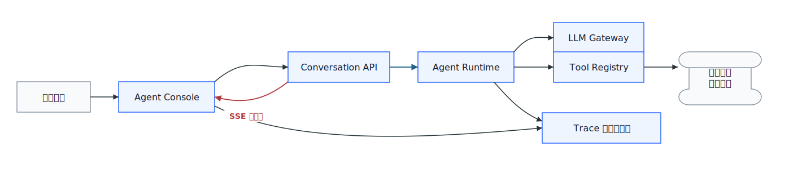
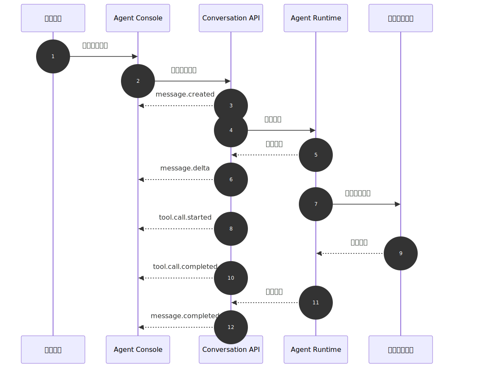

# 第47章 对话 UI 与流式输出

---

Agent UI 不是聊天窗口的换皮。内部演示里，用户输入问题、模型输出 Markdown、前端逐字渲染，通常就能讲完一个故事。生产环境里的用户会追问另一组问题：Agent 查了哪张表，用了哪个指标口径，是否触发审批，为什么失败，能不能继续生成，这次回答之后还能不能追溯。零售 DataAgent 的毛利异常分析可以说明这个差别。负责人问“华东区本月毛利异常来自哪些 SKU”，如果界面只返回“主要来自生鲜和家电”，业务判断仍然没有落点。用户需要看到 SQL 生成过程、权限过滤结果、查询状态、图表卡片、指标口径、导出入口和反馈入口。继续追问“是否和上周补货延迟有关”时，前端还要把上一轮工具结果、当前用户权限和新的查询任务接在一起。

生产 UI 的失败也很具体。用户看到“正在生成”转了 40 秒，不知道系统是在等模型、等 SQL、等审批，还是连接已经断开；工具返回了 3000 行 JSON，前端直接塞进消息气泡，浏览器卡住，敏感字段还被展开；用户点击停止，界面不再显示新字，后台查询却继续跑，稍后旧结果又写回会话；用户点踩说“结果不可信”，后台 Trace 只能看到模型和工具日志，看不到他有没有展开证据、有没有改筛选器、有没有重试。这样的界面看起来像智能助手，实际无法承载企业任务。

企业 Agent 的前端要展示工具调用状态、等待审批、可编辑证据和任务进度，聊天框只是入口之一。它需要一套把 SSE 事件流翻译成可增量渲染 UI 状态的协议，也需要把用户交互回写到同一条 trace。对话 UI 与流式输出要同时处理消息模型、事件协议、前端状态和可观测性，并把这些设计落到组件、框架选型和前端监控里。否则前端只是把后端结果展示出来，无法帮助用户理解任务，也无法帮助平台团队复盘事故。

本章讨论对话 UI、流式输出、SSE、增量渲染、消息模型和前端框架选型。读者需要把普通聊天 UI 和企业 Agent UI 区分开：普通聊天 UI 关注文本是否顺畅，企业 Agent UI 还要关注工具、权限、审批、证据、恢复和审计。后面所有协议和组件设计，都是为了让一次 Agent Run 在用户界面上可理解、在后端链路上可追踪。几条主流技术路线已经把问题拆开：模型调用和流式输出、生产级会话组件、应用内状态共享、前后端事件协议，分别对应不同的工程边界。它们共同指向一个事实：前端要表达任务过程，而非只渲染文本。表 47-1 按容易混淆的边界整理这些路线。

*表47-1：业界 Agent UI 技术路线对比。来源：本书整理。*

| 路线 | 代表 | 解决什么问题 | 企业落地时的边界 |
|---|---|---|---|
| 流式应用 SDK | Vercel AI SDK | 统一模型调用、消息状态、流式输出、工具调用和前端 hooks | 适合快速搭建应用层，但企业权限、审计、trace 和工具治理仍要自建 |
| 对话组件框架 | assistant-ui | 提供线程、消息、输入框、附件、运行状态等生产级 UI 组件 | 解决的是 UI 基础设施，不负责企业 Agent Runtime 和工具权限 |
| 应用内 Copilot | CopilotKit | 把 Agent 嵌入业务应用，支持共享应用状态、前端工具和人在回路 | 适合已有业务系统增强，需要把业务状态和审批策略接入平台治理 |
| Agent-UI 协议 | AG-UI | 用事件协议连接前端应用与不同 Agent 后端，覆盖文本、工具、状态和交互 | 适合跨框架互通，但生产环境仍要补租户、权限、审计和观测规范 |

浏览器基础协议也在形成清晰分工。SSE 适合单向服务端事件推送，常用于文本流、工具进度和任务状态；WebSocket 适合双向实时控制，适合多人协作、语音控制和复杂应用状态同步；WebRTC 更偏实时音视频和低延迟媒体通道，放到第49章 讨论更合适。企业平台应明确哪类任务走哪条链路，而非把三者混成一个笼统的“实时能力”。产品形态也会影响对话 UI 的责任边界。企业 Copilot 构建平台通常把对话界面和动作、知识来源、转人工、性能分析放在一起，强调业务团队可以用自然语言配置 Agent。业务系统内的 Agent 更依赖对象上下文，界面必须绑定 CRM、工单、订单、渠道会话和动作权限。工作流型 Agent 平台把对话界面当作入口之一，真正的执行状态落在流程、监控和生命周期治理中。Dify Chatflow / Workflow 这类低代码应用则提醒平台团队区分多轮会话和一次性后台任务，两者不应使用同一套交互状态。

这些产品形态差异很大，对话 UI 承担的责任却逐渐接近：它可能是 Copilot 的入口、业务动作的确认界面、工作流的观测窗口，也可能是低代码编排结果的交互层。企业自建平台时，照搬某个产品的视觉样式意义不大，更应该沉淀会话上下文、工具动作、状态流、权限确认和观测数据。前端框架不能替企业定义平台边界。框架能缩短 chat UI 的开发周期，协议能让不同 Agent 后端接入前端；消息契约、工具渲染规范、权限策略和会话观测模型仍要由平台统一维护。

---

## 47.1 企业 Agent UI 组成

企业 Agent UI 首先是业务任务入口，其次才是对话界面。只显示问答气泡的页面，很难承载数据分析、审批、导出、纠错和审计。很多内部试点会发现，业务用户关心的是“它查了什么、依据是什么、我能不能改、出错后谁负责”，而非“模型会不会聊天”。企业 Agent UI 通常包含七类界面单元。这些单元目的在于让任务状态有地方落，把页面做复杂只是手段之一。会话入口负责把用户带进正确工作区和数据域；消息流负责表达问题、回答和错误；工具进度负责说明系统正在做什么；上下文面板负责告诉用户当前口径和过滤条件；业务控件负责承接停止、重试、确认、导出和转人工；反馈入口把用户判断带回评估系统；观测标识把前端行为接到后端 Trace。缺少其中任何一类，生产问题都会被挤进聊天气泡里，最后变成一段无法操作的文字。

*表47-2：企业 Agent UI 七类界面单元。来源：本书整理。*

| 界面单元 | 作用 | 企业要求 |
|---|---|---|
| 会话入口 | 输入问题、选择工作区、切换任务模式 | 绑定租户、用户、权限、默认数据域 |
| 消息流 | 展示用户问题、Agent 回答、引用和错误 | 支持流式、折叠、恢复、引用跳转 |
| 工具进度 | 展示 SQL、检索、图表、审批等工具状态 | 只展示允许用户看到的参数和结果 |
| 上下文面板 | 展示当前指标口径、数据源、过滤条件 | 避免用户误解回答适用范围 |
| 业务控件 | 重试、停止、确认、导出、转人工 | 高风险动作必须服务端二次校验 |
| 反馈入口 | 点赞、差评、纠错、人工备注 | 进入评估集和会话回放 |
| 观测标识 | trace、耗时、模型、工具版本 | 支持排障、复盘和审计 |

表 47-3 把界面单元拆开后，前端和平台底座的关系会更清楚：Runtime、Tool Registry、权限系统和观测系统，最终都要通过这些单元暴露给用户。前端设计不清楚，后端能力再强也会变成黑盒。

前端还要为不同用户角色提供不同视图。业务用户需要看任务状态、证据和可操作按钮；平台工程师需要看 trace、工具耗时、事件顺序和错误码；安全或合规人员需要看权限拒绝、导出动作和敏感字段拦截。三类视图可以共用同一条事件链，但展示层要分开，避免把排障日志直接暴露给业务用户，也避免工程师只能从用户截图里猜测问题。

## 47.2 流式交互协议

流式输出的作用超过“更快看到字”。在企业 Agent 里，流式协议还承担任务进度、工具状态、错误恢复、审批插入和前端观测。模型输出文字、Runtime 调用工具、用户点击停止、权限系统拒绝动作，这些都应该进入同一条可排序、可恢复的事件流。企业流式协议最怕“看起来实时，实际不可恢复”。如果服务端只把 token 按顺序推给浏览器，前端断线后不知道从哪里恢复，用户取消后不知道哪些事件该丢弃，工具失败后也无法把错误稳定映射到 UI。事件协议要比 token 流多几层信息：它要有 `run_id`、`message_id`、`event_id`、`seq`、事件类型、可恢复标记和 trace 关联。这样前端才能把流式输出从视觉效果变成任务状态。

*表47-3：流式交互协议核心概念。来源：本书整理。*

| 概念 | 定义 | 与相邻概念的边界 |
|---|---|---|
| 对话 UI | 承载会话、工具进度、业务动作和反馈的交互层 | 不等同于聊天气泡组件 |
| 流式输出 | 服务端把生成过程拆成事件或增量片段发送给前端 | 不等同于单纯 token 打字机效果 |
| SSE | Server-Sent Events，浏览器通过 HTTP 接收服务端单向事件 | 适合文本生成、工具进度、低复杂度推送 |
| WebSocket | 浏览器与服务端之间的双向长连接协议 | 适合强实时控制、多人协同、语音等场景 |
| 增量渲染 | 前端按事件更新局部消息、工具卡和状态 | 不等同于字符串拼接，需要幂等和回滚 |
| 前端可观测 | 把用户交互、渲染耗时、连接恢复、反馈行为接入 trace | 不等同于页面访问统计 |

企业 DataAgent 默认可以选择 SSE 作为文本任务的主传输协议。原因很直接：大多数分析任务是服务端持续推送，用户偶尔打断；SSE 的部署、代理和浏览器支持成本更低。WebSocket 可以留给第49章中的语音、多端协同和强实时控制场景。协议选择要服务这个边界。企业平台选择 SSE、WebSocket 或 WebRTC，是为了让一次任务的事件可以排序、恢复、审计和解释，不是为了证明技术先进。

传输协议确定后，还要定义业务事件。`message.delta` 只说明文字增加了，不能说明工具是否开始、权限是否通过、审批是否插入。DataAgent 至少需要把模型文本、SQL 生成、SQL 校验、查询执行、图表生成、证据引用和人工确认拆成不同事件。前端看到这些事件后，才能把“正在分析”拆成具体阶段；用户也能判断自己是在等计算、等审批，还是等模型解释。

### 47.2.1 流式事件的状态表达问题

流式 UI 的问题通常不在“字有没有流出来”，而在状态有没有被准确表达。文本增量、工具开始、工具进度、工具完成、审批请求、错误和最终完成态如果都挤在一段字符串里，前端就无法稳定恢复，也无法解释任务卡在哪里。可靠性也要在前端落地。前端 reducer 如果不处理重复事件、旧请求污染、连接恢复和取消语义，用户仍然可能看到错误结果。UI SDK 可以提高开发效率，但企业权限、审计、观测、降级和业务状态同步仍要由平台自己设计。

很多前端事故来自“状态被文本覆盖”。模型先输出“我将查询销售数据”，工具随后权限拒绝，前端如果只拼接文本，用户会看到一个半截回答和一个含糊错误；正确做法是把工具权限拒绝变成独立状态，关闭生成态，展示申请权限或调整问题的恢复路径。模型先说“查询完成”，但工具事件还没返回，前端也不能把消息标成完成。最终状态必须以 Runtime 事件为准，而非以模型文字为准。工具日志更不应该原样展示给用户。日志面向工程排障，用户需要的是经过脱敏、摘要和解释的任务状态。否则界面看似透明，实际暴露了内部字段和实现细节。

## 47.3 消息模型与增量渲染

企业对话 UI 位于 Agent 平台最上层，但它不应该直接依赖某个模型厂商的流式格式。更可靠的做法是由 Conversation API 把 Runtime、LLM Gateway、Tool Registry 和 Observability 的内部事件转换成统一前端事件。这样模型可以替换，工具可以扩展，前端消息状态仍然稳定。



*图47-1：对话 UI 在企业 Agent 平台中的位置。来源：本书自绘。Alt text：分层图中对话 UI 位于顶层，向下通过 HTTP/WebSocket 接 Agent Runtime，UI 层标注消息展示、状态感知、审批交互、证据展示四个职责区。*

图 47-1 展示了三条边界。Agent Console 不直接调用模型，所有模型交互经过 Conversation API 和 Runtime，才能统一鉴权、trace、限流和错误处理。工具执行结果也不直接写入前端；Tool Registry 返回的结构化结果需要经过 Runtime 整理、权限过滤和渲染契约转换，前端只消费可以展示的事件。前端事件还要回流到观测系统，用户停止生成、点击重试、展开工具卡、提交差评，都应该和后端 trace 关联，否则线上事故只能看到后端日志，看不到用户实际看到什么。DataAgent 的一次流式问答可以抽象成下面的时序。



*图47-2：DataAgent 流式对话时序。来源：本书自绘。Alt text：时序图展示用户提问、服务端推送 state/token/tool_call/done 事件、前端逐步渲染增量内容，工具调用期间显示 loading 状态，体现对话 UI 与 Agent 执行的实时协作。*

图 47-2 表明，前端处理的是一条任务视图，不是一串字符串。用户看到的是一条回答，系统内部却包含消息创建、文本增量、工具开始、工具完成和最终完成多个阶段。任何阶段失败，都要有可解释的前端状态。

### 47.3.1 从事件流到稳定消息模型

企业 Agent UI 的消息模型建议拆成三层。 *表47-4：企业 Agent UI 消息模型三层。来源：本书整理。*

| 层级 | 记录内容 | 为什么需要 |
|---|---|---|
| 会话层 | `conversation_id`、租户、用户、工作区、权限上下文 | 支持多轮追问、租户隔离和会话回放 |
| 消息层 | 用户消息、助手消息、工具消息、审批消息、错误消息 | 支持展示、引用、反馈和审计 |
| 事件层 | 某条消息生成过程中的增量事件 | 支持流式、恢复、幂等和状态机 |

前端不要把事件直接当成最终消息存储。事件是过程，消息是视图。Event Reducer 的职责是把有序事件折叠成稳定的消息树、工具卡和错误状态。



*图47-3：流式事件模型与前端 reducer。来源：本书自绘。Alt text：左侧是 SSE 事件流（state/token/tool_call/done 等类型），右侧是前端 reducer 把每个事件映射到状态更新，箭头展示事件驱动 UI 更新的数据流。*

组件划分如下。这些组件的边界要避免重叠。Message Renderer 不应该自己解析工具 JSON，Tool Call Panel 不应该直接调用后端工具，Interaction Controller 不应该绕过 Runtime 取消任务。前端组件可以各自负责展示和交互，但所有业务动作都要回到统一事件契约。这样后续替换 UI 框架、增加移动端或接入新的工具卡时，平台仍能保持同一套审计和恢复语义。

*表47-5：Agent UI 组件职责与失败模式。来源：本书整理。*

| 组件 | 职责 | 输入 | 输出 | 失败模式 |
|---|---|---|---|---|
| Conversation API | 接收用户消息，返回统一事件流 | 会话 ID、用户输入、上下文 | SSE 事件流 | 鉴权失败、连接中断、事件乱序 |
| Event Reducer | 将事件折叠为前端状态 | 事件序列 | 消息树、工具卡片状态 | 重复事件、缺失完成事件 |
| Message Renderer | 渲染文本、引用、代码、错误 | 消息状态 | 可读消息 | Markdown 注入、渲染阻塞 |
| Tool Call Panel | 展示工具调用进度与结果 | 工具事件、Schema | 工具卡片 | 工具结果过大、敏感字段暴露 |
| Interaction Controller | 处理中断、重试、确认、导出 | 用户操作 | 控制事件 | 取消后旧流继续写入 |
| Observability Adapter | 记录前端事件与用户反馈 | trace、event、UI 状态 | 指标、日志、回放索引 | trace 断链、隐私字段泄漏 |

一个最小可用的流式请求如下。
```http
POST /api/conversations/{conversation_id}/messages
Content-Type: application/json

Request:
{
  "message": {
    "role": "user",
    "content": "华东区本月毛利异常来自哪些 SKU？"
  },
  "context": {
    "tenant_id": "retail-demo",
    "workspace_id": "retail-bi",
    "permission_scope": ["sales_summary:read"]
  },
  "stream": true
}

Response:
Content-Type: text/event-stream

event: message.created
data: {"event_id":"evt_1","message_id":"msg_1","run_id":"run_1","seq":1}

event: message.delta
data: {"event_id":"evt_2","message_id":"msg_1","run_id":"run_1","seq":2,"payload":{"content_delta":"正在查询"}}
```

事件至少要覆盖以下类型。

*表47-6：DataAgent 流式事件契约。来源：本书整理。*

| 事件 | 触发时机 | 前端动作 |
|---|---|---|
| `message.created` | Runtime 接受用户输入并创建助手消息 | 新建占位消息 |
| `message.delta` | 模型或 Runtime 产生文本增量 | 追加内容，保持滚动稳定 |
| `tool.call.started` | Agent 准备调用工具 | 展示工具卡片和输入摘要 |
| `tool.call.delta` | 工具执行产生进度 | 更新阶段、行数、耗时 |
| `tool.call.completed` | 工具返回结构化结果 | 固化工具结果或数据引用 |
| `approval.required` | 高风险动作需要确认 | 插入审批卡片 |
| `message.completed` | 助手消息完成 | 关闭生成态，打开反馈入口 |
| `error` | 任一阶段失败 | 展示重试、降级或转人工 |

错误响应必须能被前端稳定分类。企业系统不要只返回一段错误文本。
```json
{
  "code": "TOOL_PERMISSION_DENIED",
  "reason": "用户缺少 sales_detail:read 权限",
  "recoverable": false,
  "suggested_action": "request_approval",
  "trace_id": "trace_abc",
  "run_id": "run_1"
}
```

这份契约约束的是事件语义。每个事件都要能排序、能去重、能关联 trace，也能判断自己是否属于当前任务。

## 47.4 Agent 前端框架选型

### 47.4.1 SSE、WebSocket 与 HTTP 分块响应

文本对话、工具进度和报告生成默认走 SSE。它是浏览器原生能力，部署简单，适合服务端持续推送状态；代价是双向控制较弱，长连接受代理、超时和重试策略影响。WebSocket 适合语音、多人协作、实时编辑和强控制场景，但网关、鉴权、心跳和扩容都更复杂，应在第49章多模态和实时交互场景中使用。HTTP 分块响应实现直接，适合内部极简示例或模型流适配，但事件语义弱、恢复困难，不宜作为企业 Agent UI 的默认协议。

### 47.4.2 自研协议与 UI SDK

企业平台可以参考 Vercel AI SDK、assistant-ui、CopilotKit 和 AG-UI，但不应把框架接口当成平台协议。Vercel AI SDK 的流式与工具调用体验成熟，适合原型和应用层快速验证；assistant-ui 能减少生产级对话组件的开发量，但业务工具卡、权限和审计仍要定制；CopilotKit 与 AG-UI 强调应用状态同步和事件协议，适合嵌入式 Copilot 与人在回路场景。mini-platform 的默认方向仍应是自研轻量事件协议加受控组件：框架可以替换，消息语义、工具状态、审批和 trace 字段不能丢。

### 47.4.3 客户端拼接 token 与事件 reducer

增量渲染不要停留在客户端拼接 token。拼接 token 实现最快，但无法表达工具状态、审批插入、错误恢复和取消后的旧流丢弃；全量消息刷新逻辑简单，却会带来大消息性能差和交互闪烁。企业 Agent UI 应采用事件 reducer：前端按 `run_id`、`message_id`、`seq` 和事件类型折叠状态，既能恢复连接，也能把用户操作和后端 trace 对齐。它要求后端事件契约更严格，但这是从聊天页面走向任务工作台必须付出的工程成本。企业 Agent UI 的默认方案应是“可演进的事件协议 + 受控组件 + 可观测链路”。框架可以换，协议和治理边界不能丢。

### 47.4.4 国内企业 Agent / DataAgent UI 对比

国内企业 Agent 产品的 UI 路线也在快速收敛：入口仍是对话，但控制面正在向“应用模式选择、能力编排、知识库/插件配置、工作流画布、测试调试、发布治理”扩展。腾讯元器、阿里云百炼 Model Studio、字节/火山体系下的 Coze 都能看到这个趋势。它们不一定都叫 DataAgent，但都在解决同一类企业问题：业务人员怎样把模型、知识、工具、流程和发布管控组织成可运行的智能体应用。

腾讯元器把标准模式、单工作流模式和 Multi-Agent 模式放在创建入口，说明任务结构不应全部留给 Runtime 猜测；对 DataAgent 来说，普通问答、数据分析工作流和多角色协作应在界面上有清楚入口。阿里云百炼 Model Studio 把模型、系统提示词、知识库、插件和文件输入放进应用配置面板，提醒平台把影响回答质量的配置显性化，避免上线后只能从后端参数里追查问题。Coze Studio 更强调低代码工作流、Chatflow、节点、插件和知识库，适合作为“对话任务”和“后台编排任务”分流的参照。

这些产品更适合当作产品边界清单来读，不适合当作厂商能力排名。Agent UI 至少要覆盖配置面、运行面、调试面和治理面；聊天窗口只是运行面的一部分，替代不了配置、编排、权限和观测。对企业 DataAgent 来说，更合理的产品形态是：业务用户在对话里提出问题，平台在侧边栏展示数据域、指标口径和工具状态，管理员在配置面管理知识、插件、审批和发布策略。


*图47-4：腾讯元器的智能体应用模式选择界面。来源：产品界面截图。Alt text：界面展示对话、工作流、发布等模式切换入口，标注 Agent 配置区与对话预览区的布局，体现 Copilot 式 Agent 构建工具的典型 UI 结构。*

模式选择应该发生在用户提问之前，不能等到 Runtime 里再猜。图 47-4 里的标准模式、单工作流模式和 Multi-Agent 模式，把这个产品边界放到了入口处。DataAgent 如果只保留一个统一输入框，就很难表达普通问答、数据分析工作流和多角色协作之间的差异。


*图47-5：阿里云百炼 Model Studio 的 Agent 配置界面。来源：产品界面截图。Alt text：界面分工具栏、模型选择、系统提示词、测试对话四个区域，展示企业级 Agent 构建平台的典型配置 UI 组成。*

配置面不应只是给开发者看的后台表单。图 47-5 把模型选择、提示词、知识库和模型参数放在同一个界面里，提示企业前端不要把影响回答质量的设置藏成后端参数。对 DataAgent 来说，模型、知识来源、插件能力和上下文轮数都需要可解释、可复现，否则线上问题很难定位到是模型、检索还是配置造成的。


*图47-6：Coze Studio 工作流画布中的节点与配置面板。来源：产品界面截图。Alt text：画布中多个工作流节点通过连线组成 DAG，右侧面板配置选中节点的参数，体现低代码 Agent 编排工具的可视化工作流 UI。*

多步骤任务需要流程视图承接。图 47-6 中的节点、连线和右侧配置面板，正好对应 DataAgent 里的查询、计算、绘图、审批和导出链路。对话消息可以是用户入口，但前端还要展示节点执行状态、失败点、输入输出映射和可重试边界，否则用户只能看到一段最终回答，看不到任务怎样完成。

## 47.5 可靠交互与前端可观测

流式 UI 的状态机不应只有“加载中”和“完成”。企业 Agent 需要表达等待工具、等待审批、被用户取消、网络重连、降级完成等状态。



*图47-7：流式 UI 状态机。来源：本书自绘。Alt text：状态机含 idle、streaming、tool_calling、waiting_human、done、error 等节点，箭头标出 SSE 事件触发的合法迁移，体现前端状态随服务端事件驱动转换。*

几个状态尤其容易被低估。ToolRunning 不能作为 Streaming 的附属状态。工具调用可能耗时几十秒，也可能触发权限拒绝、SQL 安全拦截或审批。前端要单独展示工具状态，而非只让用户看到“正在生成”。Cancelled 必须取消整条任务。 用户点击停止，不代表只关闭浏览器连接。前端要停止渲染旧事件，后端要取消 Runtime 任务，工具层要尽量中止正在执行的查询。Recovering 要有明确恢复边界。 SSE 断开后，可以用事件游标恢复；超过恢复窗口后，应该展示“继续生成”或“重新运行”，不要静默丢失后续事件。流式 UI 的问题通常出现在连接恢复、事件顺序、取消语义和敏感结果渲染上。表 47-7 把这些边界落到前端和后端都能执行的恢复动作上。

*表47-7：流式 UI 可靠性问题与处理方式。来源：本书整理。*

| 问题 | 触发条件 | 处理方式 |
|---|---|---|
| 连接中断 | SSE 连接断开或代理超时 | 使用事件游标恢复；无法恢复时展示继续生成 |
| 事件乱序 | 多路工具事件并发返回 | 以 `seq` 和 `event_id` 做幂等折叠 |
| 旧流污染 | 用户取消后旧请求继续返回 | 前端按 `run_id` 丢弃失效事件 |
| 工具结果过大 | 查询返回过多行或大对象 | 消息只展示摘要，表格走数据引用 |
| 敏感字段泄漏 | 工具结果包含未脱敏字段 | 后端字段脱敏，前端只渲染白名单字段 |
| Markdown 注入 | 模型输出包含脚本或危险链接 | 禁用原始 HTML，外链做跳转确认 |
| trace 断链 | 前端事件没有关联后端 trace | 所有事件携带 trace，前端交互复用同一 trace |

前端可观测要覆盖体验、可靠性、质量和治理四类信号。 *表47-8：前端可观测维度与典型指标。来源：本书整理。*

| 观测维度 | 典型指标 | 用途 |
|---|---|---|
| 体验 | 首字到达时间、完整回答时间、工具卡首帧时间 | 判断用户是否觉得系统“卡住” |
| 可靠性 | 断线率、恢复成功率、取消成功率、重复事件率 | 排查流式链路和前端 reducer |
| 质量 | 差评率、追问率、复制率、人工纠错次数 | 进入离线评估和产品改进 |
| 治理 | 权限拒绝、审批触发、导出动作、敏感字段拦截 | 支持安全审计和合规复盘 |

可靠交互的关键，是让一次 Agent Run 在前端和后端共享同一条事件链，而不是只多做几个 loading 状态。用户提交问题时，前端生成本地消息占位，同时拿到后端返回的 `run_id`；Runtime 创建 Run 后发出 `message.created`；Planner 决定调用工具时发出 `tool.call.started`；工具执行时持续回写进度和摘要；结果进入消息时，前端 reducer 按 `event_id`、`seq` 和 `run_id` 折叠事件；用户展开证据、复制答案、点踩或重试时，这些 UI 事件也要回写到同一条 trace。

这条链路让前端不再只是消费结果，而成为运行诊断的一部分。一次用户投诉“系统卡住了”，平台可以判断卡在模型首字、工具首帧、审批等待、网络恢复还是前端渲染；一次用户说“结果不可信”，平台可以看到他是否展开证据、是否修改筛选器、是否重试同一问题。没有这条链路，前端指标只能说明体验变差，不能解释 Agent 为什么变差。异常路径也应作为产品能力设计。连接中断后，前端要先按游标恢复；恢复窗口过期后，再提示重新运行或查看已完成部分。用户取消后，前端要立即停止旧流渲染，但也要等待后端确认取消结果，避免旧工具结果稍后写回。工具返回大结果时，前端不能把完整 JSON 塞进消息，而应展示摘要和 `data_ref`。这些细节决定对话 UI 是演示界面，还是生产任务工作台。

## 47.6 对话 UI 的验收标准

对话 UI 的验收不能只看界面是否流畅。企业 Agent 前端至少要证明四件事：用户能理解任务状态，工具过程不会泄露敏感信息，失败后有明确恢复路径，前端行为能和后台 Trace 对齐。若只展示流式文本，系统看起来很像智能助手，实际却无法支撑业务任务。工具卡片是前端治理的关键位置。它需要同时给用户足够证据，又不能暴露内部字段、SQL 明细或未脱敏结果。更稳的做法是展示阶段、输入摘要、授权状态、结果摘要和可展开证据引用；原始明细通过受控 `data_ref` 读取。这样前端既能解释 Agent 做了什么，也能让权限系统继续控制数据访问。取消和重试也要有后端语义。用户点击停止，不应只是关闭浏览器连接；Runtime 应收到取消事件，工具层尽量中止执行，Trace 记录取消来源。重试也不应简单重发上一条消息，而要带上失败阶段和可复用证据。否则用户会看到重复回答，后台却产生多次不可解释的工具调用。

前端观测要服务产品改进。首字时间、工具卡首帧时间、断线恢复率、差评原因、展开证据次数，都能帮助平台判断问题发生在模型、工具、网络还是界面设计。把这些信号接入第38章的 Trace 后，对话 UI 才成为 AgentOps 的一部分，而非单独的页面工程。验收时还要安排失败路径演练。断开网络再恢复，看消息是否按游标继续；点击停止，看后端查询是否取消；缺少权限，看界面是否给出申请或降级路径；工具返回大表，看前端是否只展示摘要和受控数据引用；模型输出危险 HTML，看渲染层是否拦截。只有这些路径都跑通，流式 UI 才能算生产可用。产品验收还要看用户是否能带着结果继续工作。DataAgent 回答之后，用户通常要改筛选条件、展开证据、导出图表、发起审批或把结果写入报告。如果界面只给一段文本，用户会把这些动作搬到线下完成，平台也失去后续 trace。前端应把这些动作设计成受控按钮和事件，而非让用户复制粘贴。这些受控事件也能反向改进评测。用户反复展开某类证据，说明系统需要把证据默认展示得更清楚；用户经常在导出前修改筛选条件，说明首轮问题理解可能偏窄。前端行为不是纯产品数据，它是 Agent 质量反馈的一部分。

## 47.7 上线前的异常路径与验收样例

对话 UI 的上线验收不能只看正常路径。企业 Agent 的前端最容易出问题的地方，往往发生在网络抖动、工具失败、审批等待、用户刷新页面、浏览器重连和长任务恢复这些边界场景。用户看到的是界面状态，后端看到的是 Run 状态；如果两者没有稳定映射，同一次任务就会在不同系统里呈现不同事实。比如 Runtime 已经取消任务，前端仍显示“正在生成”；审批已经超时，按钮仍然可点；工具失败后模型又继续生成结论，用户会误以为系统已经完成分析。这些问题不会在普通演示中暴露，却会在生产环境中损害信任。

上线前应准备一组前端回放样例。样例不需要很复杂，但要覆盖真实故障：流式文本中途断开后重连，工具调用超时后重试，审批卡片等待到期，用户刷新页面后恢复任务，上传文件解析失败，DataAgent 查询返回权限拒绝，最终报告生成后又收到迟到的 token delta。每个样例都应保存事件序列、期望 UI 状态和可见恢复动作。验收时不只看页面截图，还要检查 reducer 是否能从事件历史重建同一棵消息树。只要同一事件序列在不同浏览器、不同刷新时机下得到不同 UI，说明前端状态机还不适合生产。

异常路径还要和用户文案统一。工具失败不能只显示“出错了”，应说明是哪一步失败、能否重试、是否影响已生成证据、是否需要人工接管。权限拒绝不能包装成模型不会回答，应明确是策略阻止了这次访问。审批超时不能悄悄消失，应进入任务状态并记录到 Trace。对话 UI 的文案不是装饰，它会影响用户是否正确理解系统责任。过度模糊的错误提示会让用户继续追问模型，实际问题却在工具、权限或网络层。

前端还要支持任务恢复。企业用户不会一直停留在一个浏览器页签里等待长任务结束。他们可能刷新页面、切换设备、关闭浏览器、稍后回来，或者从通知进入同一任务。恢复时，UI 应先从 backend 拉取当前 Run 状态和历史事件，再继续订阅后续事件。不能依赖浏览器内存保存任务事实。若恢复时只显示最终答案，用户会丢失工具、证据、审批和错误历史；若恢复时重复播放所有流式 token，又会制造重复内容。更稳妥的方式，是让后端提供快照和增量事件，前端用同一个 reducer 合并。

最后，验收要覆盖反馈回路。用户点击“结果有误”、修改报告、驳回图表、重新选择指标口径，这些都应形成结构化反馈，而非停留在前端埋点。反馈至少要带上 run id、artifact id、证据引用、用户修改位置和处理结果。这样第39章的评测系统才能知道错误发生在检索、工具、生成、可视化还是用户理解层。对话 UI 如果只负责展示，不负责把用户修正带回平台，后续章节的评测和治理就会缺少最真实的样本来源。

## 47.8 前端事件协议的版本复审

对话 UI 上线后，前端事件协议要像后端 API 一样复审。`message.created`、`token.delta`、`tool.call.started`、`tool.call.finished`、`approval.waiting`、`artifact.updated`、`run.cancelled` 这些事件一旦进入生产，就会被前端 reducer、移动端、审计系统、Trace、评测回流和客服排障共同依赖。新增字段、重命名状态、改变事件顺序，都会影响历史任务恢复和事故复盘。平台应为事件协议维护版本号、兼容窗口和回放样例，不能把它当成页面内部实现。

版本复审要检查三类材料。第一类是事件 schema：字段是否有稳定含义，是否区分机器动作和人工动作，是否包含 `run_id`、`trace_id`、`seq`、`event_id` 和租户上下文。第二类是回放样例：正常流式回答、工具失败、审批超时、用户取消、报告生成、迟到事件、断线恢复，都要能从同一段事件历史重建 UI。第三类是错误文案：协议变化后，用户看到的状态是否仍然和 Runtime 事实一致。若后端已经取消任务，前端不能继续显示“正在分析”；若工具返回权限拒绝，前端不能把它渲染成模型能力不足。

事件协议复审还要服务评测。用户点踩、展开证据、修改报告、重试问题、驳回审批，都应进入可回放事件，而非只写到产品埋点。评测系统需要知道用户在哪个证据、哪个 Artifact、哪个工具阶段发现问题，才能判断错误来源。前端事件如果只面向体验指标，就会丢掉最有价值的运行样本。把事件协议纳入版本复审后，UI 团队、Runtime 团队和评测团队才能围绕同一条 Run 讨论质量问题。

## 47.9 对话界面的可访问性与业务连续性

企业 Agent UI 还要考虑可访问性和业务连续性。流式输出、工具卡片、审批按钮、错误提示和证据展开，不能只在理想桌面环境中可用。客服坐席、移动审批人、现场运营人员、低带宽网络、辅助阅读工具都会影响界面设计。若界面只追求炫目的流式效果，生产场景中反而会让用户看不清任务状态，或在网络波动时误以为任务已经完成。

可访问性应进入组件契约。工具卡片需要有清楚的状态文本和键盘操作路径；审批按钮要能被屏幕阅读器识别；错误提示要说明失败阶段和可恢复动作；证据引用要能跳转到可读来源；流式输出结束后要提供稳定的最终版本。业务连续性则要求界面在刷新、断线、切换设备后仍能恢复任务。前端不应把浏览器内存当成事实来源，必须从 Runtime 拉取当前状态和历史事件。

这类要求看起来属于前端细节，实际会影响平台信任。用户如果无法确认任务是否仍在运行，就会重复提交；审批人如果看不到证据，就会线下确认；报告生成后如果无法恢复编辑状态，就会转到本地文档。每一次转出平台，Trace、Eval 和安全审计都会丢失样本。对话界面的工程质量，最终会影响整个 Agent 平台能否持续学习。

## 47.10 对话入口的运行支持材料

对话 UI 上线后，前端团队需要准备运行支持材料。材料应说明事件协议、消息状态、失败提示、取消行为、重连策略、附件限制、权限展示和 Trace 关联方式。这样客服、业务运营和平台值班人员在用户反馈问题时，能判断是模型没有回答、工具仍在执行、前端丢了流式事件，还是后端已经进入等待审批状态。缺少这些材料，对话入口很容易被当成普通聊天框运维，真实故障会被描述成“AI 没反应”。

运行支持还要覆盖用户可见文案。错误提示、等待提示、审批提示、权限提示和降级提示应来自统一状态，而不是各组件自行拼接。一个 Run 进入排队、执行、等待确认、部分失败或已取消时，用户看到的文案、按钮和后续动作要一致。前端如果只关心成功渲染，运行团队就无法解释异常路径；后端如果只返回内部错误码，用户又无法继续完成任务。对话 UI 的工程质量，体现在这些中间状态能否被理解和处理。

早期可以建立一份轻量的对话入口验收清单：断网重连后消息是否完整，工具失败后是否保留上下文，用户取消后后端是否停止执行，审批过期后按钮是否失效，前端事件是否写入 Trace。清单不需要覆盖所有体验细节，但要覆盖会影响业务责任的状态。这样对话入口才会成为可运营的任务界面，而不是一个只能展示成功路径的窗口。

## 47.11 对话界面的事故定位材料

对话界面出问题时，用户通常只会描述“卡住了”“没返回”“按钮不能点”。工程团队要能把这些现象还原成可定位的材料。一次前端事故至少需要保存会话 id、Run id、消息序号、流式事件序号、最后一个成功渲染块、前端错误、后端状态、工具调用状态和用户可见文案。若这些材料缺失，排查会在前端、网关、Runtime 和模型服务之间来回转移。

事故定位还要覆盖用户动作。用户是否刷新页面、是否取消任务、是否重复提交、是否在审批前关闭窗口，都会影响后端状态。前端应把这些动作写入事件流，但不要把原始敏感内容全量写进日志。对话界面的可观测性要服务任务复盘，而不是把聊天窗口变成新的数据泄漏点。

早期可以先建立几类固定事故样本：流式中断、工具超时、审批过期、权限拒绝、附件解析失败和用户取消。每个样本都要能从前端时间线跳到后台 Trace。这样对话 UI 的质量不会只停留在视觉体验，也能进入平台运行治理。

## 47.12 对话交互契约的复审节奏

对话交互契约上线后仍要定期复审。UI 的变化通常快于 Runtime：产品团队会增加导出按钮、附件类型、图表编辑器、报告抽屉或审批卡片，而后端事件模型变化较慢。如果这些变化只按页面需求处理，界面状态和平台状态之间的契约会逐渐变得含糊。季度复审可以检查每个可见动作是否仍然对应后端事件，每类事件是否有 owner，支持团队是否能解释用户看到的状态。

复审不能只看组件截图，还要使用真实事故材料。团队可以抽取近期用户反馈，重建事件路径：用户点了什么，前端收到什么事件，当时 Runtime 处于什么状态，哪个工具结果迟到，页面展示了什么文案。这个过程常常能发现设计评审看不到的问题。比如按钮被置灰看起来正确，但后端仍可能接受重试事件；流式输出在页面上消失了，长时间运行的工具却还在执行。

交互契约还需要兼容规则。移动端、嵌入式组件、客服工作台和分析管道可能消费同一条事件流。删除字段或改变状态名称，会影响主 Web 应用之外的恢复能力。平台应标记废弃字段，保留旧 Run 的回放样例，并定义老客户端的支持窗口。这样对话界面不会在多端演进中变成一组局部假设。

复审最后要回到治理模型。证据展开、报告编辑、审批、导出、反馈和取消都应产生结构化记录。一个新交互如果无法追踪、无法评测、无法审计，即使在浏览器里很顺手，也还没有达到企业场景的上线标准。

## 47.13 状态恢复与用户沟通

对话 UI 的可靠性很大一部分来自恢复能力。用户关闭浏览器、网络短暂断开、手机切到后台、公司代理重连，都会让前端连接中断，但后端 Run 未必失败。界面不能把连接断开直接解释成任务失败，也不能在用户刷新后重新创建一个任务。更稳妥的做法是把前端会话、后端 Run、流式游标和 artifact 状态分开管理。页面恢复时，前端先拿到最近的 Run 状态，再根据事件游标补齐缺失片段；若 Run 已进入长任务队列，就展示队列状态和预计下一步，而不是重新播放一段不完整的 token。

恢复逻辑还要防止重复动作。用户在等待工具结果时多次点击“生成报告”，前端应返回同一个 `run_id` 或明确提示已有任务在运行；用户在审批卡片上刷新页面后再次点击通过，服务端应通过幂等 key 判断动作是否已经生效；用户取消任务后重新打开页面，界面应显示取消结果和可恢复选项，而不是继续展示旧的加载动画。Agent UI 的每个高风险按钮都要绑定后端状态和幂等语义，不能只靠前端 disabled 状态保护。

用户沟通要围绕任务状态组织。系统可以告诉用户“正在查询数据”“等待审批”“已转入异步生成”“需要重新授权”“已取消但可重新提交”，而不必暴露模型、队列或工具内部细节。提示文案要区分临时等待、可恢复失败、永久拒绝和需要人工处理。若所有异常都写成“生成失败”，用户会反复重试；若所有等待都写成“处理中”，用户无法判断是否该补充信息。好的状态沟通能减少重复提交，也能降低支持团队解释成本。

早期平台可以建立一组恢复验收样本：刷新页面、断网重连、重复提交、审批后回退、长任务恢复、浏览器多标签同时操作。每个样本都要检查前端显示、后端 Run、Trace、artifact 和用户可见动作是否一致。这样对话 UI 的质量会从视觉验收进入运行验收，前端也真正成为 Agent 平台的一部分。

## 47.14 多端入口的一致性治理

企业 Agent UI 往往不会只有一个 Web 页面。客服工作台、数据分析插件、移动端、企业即时通讯工具、BI 嵌入页和内部运营后台，都可能接入同一套 Agent Runtime。若每个入口各自定义消息状态、按钮动作和错误文案，用户会在不同端看到不同的任务含义，支持团队也很难复盘一次 Run。多端入口的一致性治理，需要把会话、Run、Step、Artifact、审批和导出的状态定义为平台契约，而不是让每个前端团队自行解释。

一致性治理首先要统一事件语义。同一个 `run_cancelled` 事件，在 Web 端、移动端和客服端都应表示后端任务已经进入取消状态，而不是只隐藏当前页面的加载动画。同一个审批卡片也要在不同端遵守相同权限、到期时间和幂等规则。入口可以有不同布局，但不能改变业务动作的含义。否则用户在移动端取消任务，桌面端仍然继续生成报告，最终会形成难以解释的状态冲突。

多端还要共享回放和支持材料。用户在企业即时通讯工具里提交问题，在 Web 工作区继续编辑报告，再从邮件链接打开 artifact，支持人员应能根据同一个 `run_id` 串起事件路径。平台可以要求每个入口记录入口类型、客户端版本、事件协议版本、可见动作和本地错误。这样排查时能判断问题来自 Runtime、网络、前端版本，还是某个入口没有实现新的状态。

早期可以先把多端治理限制在少量强约束上：核心事件名一致，幂等 key 一致，高风险动作走服务端确认，错误状态引用同一份文案字典，所有入口都能跳转到 Trace 或支持视图。这样即使 UI 形态不同，任务语义仍然稳定。对企业读者来说，这一层比界面好不好看更重要，因为它决定 Agent 是否能在多个业务入口中被可靠运营。

## 47.15 前端异常路径的回归样本

对话 UI 的质量不能只靠主路径体验判断。企业 Agent 前端需要维护异常路径回归样本：SSE 断线后重连、重复事件到达、工具调用迟到、用户取消后仍有 token 返回、审批状态变化、移动端切后台、浏览器刷新、会话过期和多端同时打开。每个样本都应记录初始状态、事件序列、前端期望状态和后端 Run 状态。这样前端修复不再依赖人工点页面，而是能和 Runtime 事件模型一起回放。

回归样本还要覆盖用户沟通。任务失败时，界面应告诉用户当前能做什么：重试、补充信息、等待审批、查看已生成内容、联系支持或重新发起任务。若前端只显示“出错了”，用户会重复提交，后台会产生更多重复 Run。若前端把所有异常都显示成模型仍在思考，用户会误判系统状态。异常文案、按钮状态和事件订阅都应进入同一组样本。

早期可以从十个高频异常开始，把样本接入前端单元测试和浏览器回放。每次 Runtime 事件协议、Artifact 工作区或 HITL 流程变化时，都重跑这些样本。对话 UI 不是聊天壳，它是用户观察平台运行状态的入口。异常路径越稳定，用户越容易信任长任务和高风险任务。

## 47.16 运行支持视图与问题定位

对话 UI 上线后，支持团队需要看到比截图更可靠的材料。用户说“答案消失了”“按钮点不了”“一直在生成”，这些描述可能对应前端渲染失败、后端超时、权限拒绝、工具错误、用户取消、事件丢失或旧客户端版本。若支持人员只能让用户重新操作一次，问题很难被复现，用户也会把所有异常都归因于模型不稳定。

平台应提供运行支持视图，把前端状态和后端状态放在同一页。视图可以展示客户端版本、入口类型、事件游标、最后渲染块、后端 Run 状态、当前 Step、工具状态、可见用户动作、错误文案和 Trace 链接。敏感内容可以脱敏，但状态路径要保留。这样支持人员能判断是前端没有收到事件，还是后端已经完成但 artifact 没有展示；是用户权限过期，还是审批动作已经失效。

支持视图还要帮助工程团队定位版本问题。若某类异常集中在移动端旧版本，修复方向是客户端升级和兼容；若异常集中在某个事件协议版本，修复方向是 reducer 和事件契约；若异常集中在长任务恢复，修复方向是 Run 游标和 artifact 状态同步。没有这些分层证据，前端问题会不断流向 Runtime 团队，Runtime 团队又无法复现。

早期可以把支持视图限制在内部使用：只展示运行状态、事件版本、错误类别和脱敏后的任务摘要。每次用户反馈进入工单时，支持人员先绑定 `run_id` 和入口类型，再判断是否需要转给前端、平台、数据或安全团队。这样对话 UI 的运营能力会从“页面能用”进入“问题能定位”。

## 47.17 对话 UI 的异常路径表达

对话 UI进入生产后，平台需要把任务状态、流式片段、取消入口、重试说明、工具错误、人工接管和最终产物放进统一证据口径。证据口径会减少事后解释成本，让业务、平台、数据、安全和运营团队能够围绕同一组事实讨论问题。没有这些材料，故障发生后只能凭经验判断；有了这些材料，团队可以知道哪些输入有效、哪些动作已经执行、哪些产物可以继续使用、哪些结果需要撤回。

这类证据应和第22章 Runtime、第38章 Trace 和第50章安全连起来。上游章节提供能力基础，下游章节使用运行结果，本章则负责说明中间环节如何被验证。若某个能力只在本章看起来完整，却无法进入 Trace、Eval、发布记录或合规证据包，生产系统仍然会出现断点。读者在实现时应把章节之间的接口看成工程契约，而不是阅读顺序上的相邻关系。

常见风险包括用户无法区分思考和执行、取消后后台仍运行、工具失败被包装成普通回复。这些问题通常不会在一次成功演示中暴露，因为演示样本往往干净、短小、路径明确。真实业务会带来旧数据、异常输入、权限变化、用户撤回、预算限制和长时间运行状态。平台如果没有把这些情况纳入样本和台账，后续扩展场景时就会重复遇到同类问题。

UI 应把系统状态和用户可执行动作表达清楚，减少对话体验带来的误解。执行记录至少要说明 owner、版本、样本、影响范围、处置动作和复查时间。记录不需要写成流程报告，但要足够让后来者理解当时的判断。对于高风险能力，还应说明哪些条件满足后才能扩大使用，哪些条件失败时必须降级或撤回。

落地时可以先选择少量代表场景建立这种习惯。实践上，应先把高频、高风险、外部可见的路径做扎实，再把样本、台账和复盘方式复制到其他能力中。这样做能让能力说明落到接入、验证、运营和退出，而不是停留在概念描述。

## 本章小结

企业 Agent UI 要把任务状态、工具过程、业务动作和审计链路放在同一个交互模型里，聊天框只是入口。流式输出应按事件生命周期建模，前端 reducer 要处理事件幂等、恢复游标、trace 关联和错误状态，不能退化成 token 拼接。文本 DataAgent 默认适合使用 SSE。WebSocket 和 WebRTC 应留给需要双向控制、低延迟音视频或更复杂实时协作的场景。UI SDK 可以提高开发效率，但权限、观测、消息契约和业务动作确认仍要由企业平台自己定义。

## 参考文献

WHATWG. (n.d.). [Server-sent events](https://html.spec.whatwg.org/multipage/server-sent-events.html).Vercel. (n.d.). [AI SDK documentation](https://sdk.vercel.ai/docs).assistant-ui. (n.d.). [Documentation](https://www.assistant-ui.com/docs).OpenTelemetry. (n.d.). [Documentation](https://opentelemetry.io/docs/).
