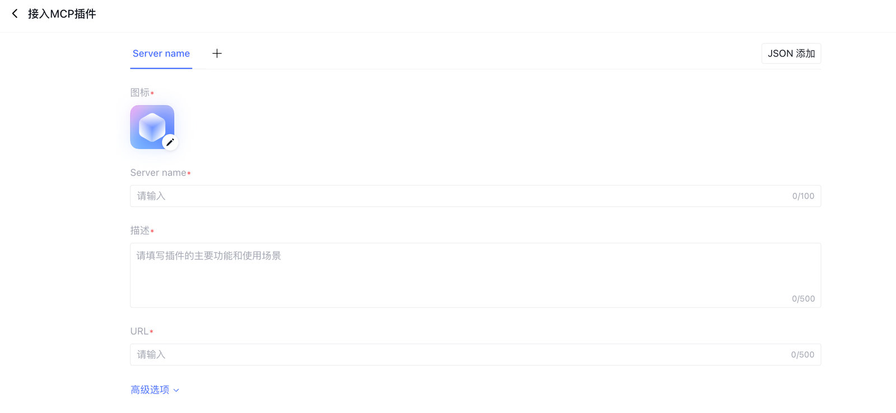
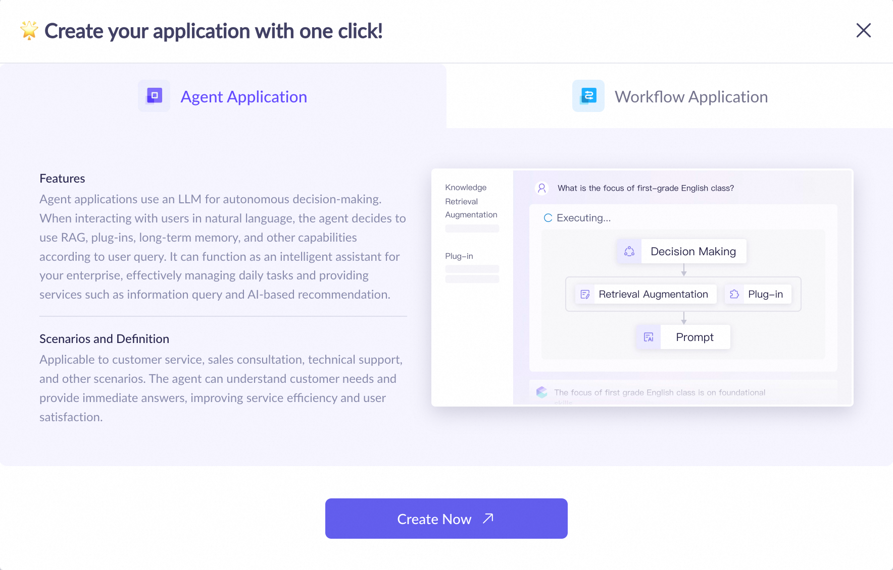
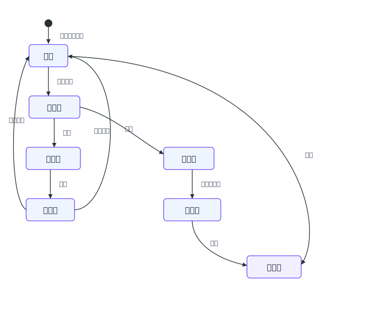
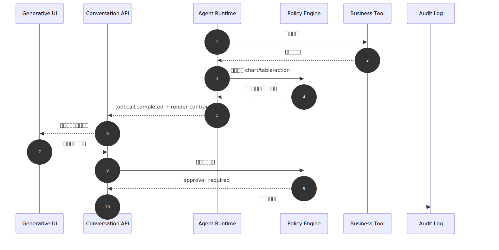
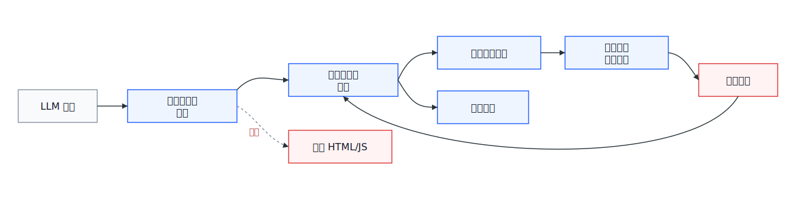

# 第48章 Generative UI 与富交互

---

DataAgent 工作台里的“富交互”不能理解成多输出几张图、让模型生成几段 HTML。图表如果没有指标口径，表格如果没有字段权限，按钮如果绕过审批，Artifact 如果覆盖证据链，界面越丰富，事故越难复盘。

毛利异常分析这类 ChatBI 原型很快会暴露这个问题。用户问“华东区本月毛利异常来自哪些 SKU”，原型返回一段文字和一张柱状图。试点一周后，业务团队会要求筛选门店和品类，财务要把异常分析保存成月度经营说明，数据治理团队要回放 SQL、指标口径、审批记录和导出动作，安全团队会检查敏感字段是否因为模型“画表格”而泄漏。对话框在这个过程中变成工作台，模型输出也变成可操作界面的一部分。

富交互层处理的是另一组约束：图表、表格、表单、Artifact 和审批卡片怎样承接消息流、工具进度和前端协议。工具结果不能只是被推送到前端，还要进入可操作、可审计的界面对象。

很多团队在原型阶段会让模型返回一段 Markdown 表格，或者直接让模型生成 ECharts 配置。演示时这很快，生产时问题也很快：表格字段没有经过权限裁剪，图表轴含义和指标口径没有绑定，用户修改筛选器后没有回写上下文，导出按钮绕过了审批，后续复盘时也不知道用户看到的是哪一版图表。界面越“智能”，平台越要能说明它展示了什么、允许用户做了什么、哪些动作被拒绝、哪些证据进入了报告。

Generative UI 的关键不是让模型随手生成界面，而是让 Agent 在受控协议内选择、填充和编排平台登记过的组件。模型可以建议“这里适合柱状图”“这里需要审批卡片”“这份报告可以形成 Artifact”，但最终渲染必须经过组件白名单、字段权限、数据引用和服务端策略。否则富交互会从用户体验优势变成新的攻击面和审计盲区。

对 DataAgent 来说，富交互还承担“把分析变成工作”的责任。文字回答可以结束一次对话，图表和 Artifact 往往会进入下游流程：业务负责人要保存经营说明，财务要修改措辞并提交审批，区域经理要继续筛选门店，数据团队要回放 SQL 和指标口径。每个动作都要成为事件，进入 trace、审计和评估样本，而不是停留在浏览器里的临时状态。

本章讨论 Generative UI、可编辑产物、结构化渲染、审批控件、前端契约和 XSS 防护。读者需要把富交互理解成 Agent 平台的一层治理界面：工具调用结果要映射到受控组件，可编辑产物要保留证据链，审批控件要能流转状态，渲染层还要防止脚本注入、越权动作和敏感字段泄漏。

从对话 UI 进入 Generative UI 后，界面对象会分化为五类。

*表48-1：从对话 UI 到 Generative UI 的能力递进。来源：本书整理。*

| 第47章 已具备的能力 | 业界代表 | 第48章 需要补上的富交互能力 | 企业落地边界 |
|---|---|---|---|
| 流式消息和工具进度 | Vercel AI SDK | 将工具结果映射为图表、表格、表单等白名单组件 | JSON 渲染之外，还要绑定字段权限、数据引用和审计 |
| 生产级对话组件 | assistant-ui | 在消息流旁承载可折叠工具卡片、引用面板和操作入口 | 对话组件解决基础交互，不负责业务组件注册、审批和证据链 |
| 应用内 Copilot 与共享状态 | CopilotKit | 让 Agent 读写业务页面状态，并触发表单、筛选器和人在回路卡片 | 组件动作必须和业务系统权限、租户边界、审批策略绑定 |
| Agent 与前端事件协议 | AG-UI | 用事件表达 UI patch、工具渲染、共享状态和 interrupts | 协议只能统一交互语义，企业仍要定义组件白名单、策略和观测字段 |
| 对话旁独立工作区 | Claude Artifacts / OpenAI Apps SDK | 把报告、图表组合、MCP 工具组件做成可编辑、可保存的产物空间 | 需要版本、协作、数据来源、组件安全和访问控制治理 |

表 48-1 指向一个基本判断：Generative UI 的价值不在视觉效果，而在工作界面。它把对话流里的工具过程、业务对象、审批判断和可编辑产物，变成用户能够验证、调整、确认和复用的对象。

表 48-1 保留为能力递进表，是为了把第47章的事件流、消息和工具状态，接到本章的可操作对象上。缺少这个递进关系，团队容易把富交互误解为“把消息渲染得更漂亮”；关系明确后，平台就能逐项检查：组件是否登记，数据是否引用，动作是否鉴权，用户修改是否回写，审计是否能回放。

设计评审时，可以直接把一条工具结果拿来走查：它进入了哪个组件，组件能展示哪些字段，用户能做哪些动作，动作是否需要二次确认，失败后状态如何恢复。只要其中一步回答含糊，富交互就还停留在原型阶段。

---

## 48.1 国内企业 Generative UI / DataAgent UI 对比

国内企业 Agent 产品也在从“对话生成答案”转向“对话驱动任务界面”。第47章已经讨论了对话入口、应用模式和流式状态，这里更关注工具和组件如何进入可控界面：腾讯元器把 MCP 插件作为可配置能力接入，阿里云百炼 Model Studio 在创建应用时区分 Agent Application 与 Workflow Application，Coze Studio 则把节点输入、变量和试运行表单做成受控配置面。这些界面的共同点不在视觉风格，而在治理方式：模型能力先收敛到工具契约、流程节点、参数表单和运行状态，再进入用户可操作的界面。

腾讯元器的插件广场和 MCP 插件表单，体现的是“外部能力先登记，再进入界面”的路径。DataAgent 的查询、导出、通知和工单动作也应先进入工具注册表，再映射成 UI 卡片，不能让模型在对话中临时拼接任意外部调用。MCP 插件接入只解决协议和发现问题，租户鉴权、动作审批、审计留痕仍属于企业平台边界。

阿里云百炼 Model Studio 把 Agent Application 与 Workflow Application 放在创建入口，强调任务容器的差异。自主决策型任务适合在对话中生成组件，流程明确的任务更适合进入工作流工作台和节点状态回放。Coze Studio 的节点试运行表单则说明，表格、图表、表单和审批卡片都应能回到工具输入、输出和日志，而不是只在最终消息里展示一个静态结果。



*图48-1：腾讯元器接入 MCP 插件的配置表单。来源：产品界面截图。Alt text：表单展示 MCP 服务地址、鉴权方式、工具列表等配置项，体现国产 Agent 平台集成外部工具的典型 UI 交互方式。*

把工具能力放进界面之前，平台要先知道这个工具是谁、能做什么、暴露哪些参数。图 48-1 把名称、描述、URL 和高级选项都做成受控字段，正好对应企业 DataAgent 的工具注册要求：模型不能临时拼接任意外部调用，工具注册、Schema 校验、权限和渲染组件要在同一条链路里绑定。



*图48-2：阿里云百炼 Model Studio 的应用类型创建界面。来源：产品界面截图。Alt text：界面展示对话助手、工作流助手等应用类型卡片，每类标注适用场景，体现企业 Agent 平台按任务形态提供差异化模板的 UI 设计。*

任务形态不同，界面容器也不同。图 48-2 把 Agent Application 和 Workflow Application 的分流放在创建阶段，这个细节对平台设计很有价值：自主决策型任务适合对话内组件，流程明确的任务更适合工作流工作台和节点状态回放。Generative UI 要先判断任务该落在哪种容器里，不能把所有组件都塞进聊天窗口。


*图48-3：Coze Studio 单节点试运行表单。来源：产品界面截图。Alt text：表单展示节点名称、输入参数填写区、运行结果展示区，体现低代码平台对工作流节点的调试 UI，输入参数、看输出结果、验证单步逻辑。*

调试体验也应围绕契约展开。图 48-3 把输入、变量类型和运行按钮放在同一个单节点试运行表单里，给企业工作台一个很具体的参照：Schema、表单、运行结果和日志要能被同一个工具节点串起来。把工具日志原样塞回对话气泡，只会让调试和审计都变得更难。

---

## 48.2 任务化交互界面

企业 Agent UI 的演进通常从任务化交互开始，而不是从聊天框直接跳到“自动生成完整应用”。用户要完成的是业务任务：分析异常、生成报告、提交审批、导出数据、修正字段映射、确认下一步动作。

企业 DataAgent 工作台可以拆成六类任务入口。

任务入口要和组件生命周期绑定。异常分析里的图表可能只服务当前会话，也可能被保存进经营报告；参数修正里的表单会影响下一次工具调用；审批确认会改变 Run 状态；协作交接会把上下文带到工单或消息系统。前端如果只把这些对象当作消息附件处理，用户看起来能操作，后台却无法知道哪个动作改变了业务状态。更稳的方式是让每个组件都有 `component_id`、`data_ref`、`allowed_actions`、`state` 和 `trace_id`，用户动作都通过 Runtime 或 Policy 回写。

富交互也会改变错误处理方式。普通文本回答出错，前端可以展示重试；图表出错，系统要区分是查询失败、图表配置错误、字段权限不足，还是数据量太大；Artifact 保存失败，用户需要知道草稿是否还在本地、是否已经进入审阅、是否会覆盖旧版本；审批卡片失败，则要明确审批请求有没有送达、是否超时、是否可以转派。Generative UI 越接近业务动作，错误状态越要细。

*表48-2：DataAgent 工作台任务入口。来源：本书整理。*

| 任务入口 | 用户真实意图 | Generative UI 承载什么 | 下游系统 |
|---|---|---|---|
| 异常分析 | 找出毛利、库存、履约异常的原因 | 图表、表格、口径说明、钻取入口 | 数据仓库、指标平台、告警系统 |
| 经营报告 | 把分析结果整理成月报或周报 | 可编辑 Artifact、图表引用、版本记录 | 报告系统、文档系统 |
| 参数修正 | 修改时间范围、门店、品类、指标口径 | 筛选器、表单、推荐参数 | Semantic Layer、Tool Registry |
| 审批确认 | 执行导出、下发任务、触发补货建议 | 审批卡片、影响范围、证据列表 | Policy、Workflow、审计系统 |
| 数据核验 | 确认字段映射、异常数据、缺失口径 | 表格、字段解释、质量提示 | 数据治理平台 |
| 协作交接 | 转交给财务、运营或区域负责人 | 评论、任务状态、引用上下文 | 工单、消息系统、任务系统 |

表 48-2 的分层把讨论拉回业务任务。企业工作台的每一个控件都可能连接工具、权限、数据和审计。图表背后有 `data_ref`、指标口径和查询快照；按钮背后有动作权限、审批策略和 trace；Artifact 是可编辑、可复用、可归档的业务产物，不是更大的消息气泡。

在企业语境里，Generative UI 可以定义为：Agent 在受控协议内选择、填充和编排平台已登记的 UI 组件。模型不负责写前端代码；它负责把工具结果以业务对象的形态送进界面。

这个定义还隐含一个产品约束：组件必须少而稳。第一版平台不需要支持几十种图表、复杂画布和任意自定义控件。它更需要把少数高频组件做扎实：图表能说明口径和数据来源，表格能处理权限和大结果，表单能回写参数，Artifact 能保留版本和证据，审批卡能记录责任。组件数量过多会让模型选择更难，也会让安全审计和回放成本上升。

组件白名单还要配合设计系统。企业工作台里的图表、表格、审批卡和 Artifact 不应由每个业务团队各画一套，否则用户在不同 Agent 之间切换时会重新学习状态含义，安全团队也很难统一审计。平台应给每类组件定义统一的空状态、加载态、错误态、权限拒绝态和审批态。这样富交互不会变成一组漂亮但互不兼容的页面，而是能被复用、测试和监控的平台能力。

## 48.3 工具调用渲染模式

Generative UI 的边界必须在 L1 就讲清楚。企业平台不应让模型直接决定 DOM、脚本、下载链接或业务动作，而应让模型输出结构化意图，再由前端和服务端共同校验后渲染白名单组件。

*表48-3：Generative UI 渲染契约与治理边界。来源：本书整理。*

| 概念 | 定义 | 与相邻概念的区别 |
|---|---|---|
| Generative UI | LLM 或 Agent 根据任务上下文选择并填充受控 UI 组件 | 不等同于模型生成任意前端代码 |
| 工具调用渲染 | 将 Tool Call 的输入、状态和输出映射为卡片、图表、表格或表单 | 不等同于把工具日志原样展示给用户 |
| Artifact | 对话之外的可编辑、可保存、可复用产物，如报告、分析说明、代码或图表组合 | 不等同于消息附件，它有生命周期和版本 |
| 业务控件 | 与业务动作绑定的筛选器、按钮、表单和审批组件 | 不等同于装饰性 UI，它会触发权限和审计 |
| 组件白名单 | 平台允许 Agent 引用的组件类型、字段、版本和动作集合 | 不等同于前端组件库全集，默认应最小化暴露 |
| 审批卡片 | 在高风险动作前展示影响范围、证据和确认入口 | 不等同于普通确认弹窗，它需要留痕和策略绑定 |

工具结果到 UI 的最小链路应是：工具执行产生结构化结果，Runtime 为结果附加权限和证据，Render Contract 决定可渲染组件，前端根据组件白名单和用户权限渲染，用户动作再回到 Policy 和 Observability。任何一步跳过，都会让界面变成安全薄弱点。

Render Contract 还要处理“看得见”和“能操作”的差异。用户可以看到一张聚合图，不代表可以下载明细；可以编辑报告草稿，不代表可以发布到外部；可以看到审批卡，不代表可以批准。组件契约里应把 `visible_fields`、`available_actions`、`approval_required` 和 `audit_level` 分开。这样前端不会把权限简化成一个布尔值，后端也能在用户点击动作时再次校验。

企业渲染对象通常分成五类。

*表48-4：工具结果可映射的受控渲染对象。来源：本书整理。*

| 渲染对象 | 典型输入 | 用户动作 | 必要控制 |
|---|---|---|---|
| 图表 | 聚合数据、图表规格、指标口径 | 切换维度、钻取、导出图片 | 显示口径、限制维度、保留数据快照 |
| 表格 | 查询结果、字段解释、脱敏状态 | 排序、筛选、复制、下载 | 字段级权限、行数上限、导出审批 |
| 表单 | 工具参数、业务动作参数 | 修改参数、提交任务 | Schema 校验、服务端二次鉴权 |
| Artifact | 报告、方案、代码、长分析 | 编辑、保存、提交审阅、导出 | 版本管理、证据链、协作权限 |
| 审批卡片 | 高风险动作、影响范围、证据列表 | 批准、拒绝、转派、补充意见 | 强制留痕、策略绑定、状态回放 |

表 48-4 划出的边界很直接：模型可以建议组件和数据绑定，但不能绕过组件注册表；模型可以建议动作，但不能直接执行高风险动作；模型可以生成报告草稿，但不能覆盖底层证据。

这条边界对安全很关键。模型生成的 Markdown 里可以写“点击这里导出全部客户明细”，但真正的导出按钮必须来自组件注册表和策略引擎；模型可以在报告里建议“下发补货任务”，但补货动作必须进入审批卡和工作流；模型可以解释某张图的异常，但图表数据仍要通过 `data_ref` 受控读取。把文字建议和业务动作拆开，富交互才不会变成 prompt 注入的放大器。

### 48.3.1 受控渲染容易被绕开的地方

受控渲染最容易在五个位置被绕开。第一，让模型直接生成 HTML/JS，原型很快，但生产环境会引入 XSS、越权动作和审计缺口；模型应只输出组件意图，平台按白名单渲染。第二，用图表数量制造专业感，但没有口径、来源和样本范围的图表会放大错误结论；每张图都要绑定指标口径、数据快照和证据引用。第三，把 Artifact 当成消息附件，报告一旦进入业务流程，就会缺少版本、权限和审批记录；Artifact 必须独立管理生命周期。

另外两个问题更偏工程治理。高风险按钮如果只在前端隐藏，用户或脚本仍可能绕过界面直接调用动作，所以所有业务动作都要在服务端二次校验。历史消息回放也不能忽略，组件升级后如果旧消息不可读，审计就无法复现当时用户看到的内容。平台要保留组件版本，必要时把旧组件降级为静态摘要。

---

## 48.4 Artifacts 与可编辑产物

Generative UI 位于 Tool Registry、Policy、Runtime、Observability 与 Console 的交汇处。后端负责工具执行、权限判断、结果结构化和审计留痕；前端负责按白名单渲染、展示证据链、收集用户确认和反馈。稳定架构不应让模型输出直接进入页面，而应由 Render Gateway 或 Conversation API 把内部事件转换成受控渲染契约。



*图48-4：Generative UI 在企业 Agent 平台中的位置。来源：本书自绘。Alt text：分层图中 Generative UI 位于 Agent 与用户之间，向下订阅工具调用结果和状态事件，向上展示富内容并把用户编辑回写给 Agent，标出它比普通对话 UI 多出的渲染与交互职责。*

图 48-4 展示了三个边界。Tool Registry 返回的是工具能力和结构化结果，不是前端组件；组件选择要经过 Render Contract，避免工具开发者把内部日志、敏感字段或调试参数直接暴露给用户。Policy 不只管后端工具执行，也要管前端动作；导出、提交审批、转派任务、保存 Artifact、复制明细都属于业务动作，必须和用户、租户、数据范围、风险级别绑定。Observability 还需要记录用户看到的界面状态，平台要知道用户看到了哪张图、展开了哪张表、修改了哪个参数、批准了哪个动作。

## 48.5 业务控件与数据可视化

企业 Generative UI 的组件划分建议保持克制。组件越多，表达力越强，但越难治理。第一版可以从 `chart`、`table`、`form`、`artifact`、`approval_card` 五类开始。

*表48-5：Generative UI 组件职责与失败模式。来源：本书整理。*

| 组件 | 职责 | 输入 | 输出 | 失败模式 |
|---|---|---|---|---|
| Render Gateway | 定义工具结果到 UI 组件的映射 | tool name、Schema、result、policy | 渲染契约 | Schema 不匹配、组件缺失 |
| Component Registry | 维护允许 Agent 引用的组件白名单 | component type、版本、权限 | 组件定义 | 版本冲突、越权组件 |
| Chart Renderer | 渲染图表和数据摘要 | 数据集引用、图表规格、口径 | 图表卡片 | 数据过大、图表误导 |
| Table Renderer | 渲染表格、字段说明和脱敏状态 | 行列数据或 `data_ref` | 表格卡片 | 敏感字段暴露、浏览器卡顿 |
| Artifact Workspace | 编辑和保存长产物 | Artifact 文档、证据引用、版本 | 草稿、审阅件、导出件 | 覆盖证据、冲突编辑 |
| Approval Flow | 高风险动作确认和审批 | 动作、影响范围、证据 | 审批状态 | 审批绕过、状态不一致 |
| UI Telemetry Adapter | 记录前端交互和渲染状态 | trace、组件状态、用户动作 | 指标、日志、回放索引 | trace 断链、隐私字段泄漏 |

示例渲染契约如下。它描述的是后续实现可以采用的接口形态，不代表当前仓库已经实现完整 API。

```json
{
  "render_id": "render_margin_chart_001",
  "conversation_id": "conv_20260609_001",
  "message_id": "msg_042",
  "tool_call_id": "call_margin_analysis_01",
  "tool_name": "analyze_margin_by_sku",
  "component": "chart",
  "component_version": "1.0",
  "title": "华东区毛利异常 SKU 分布",
  "data_ref": "dataset://retail-demo/margin-analysis/20260609/run_001",
  "spec": {
    "chart_type": "bar",
    "x": "sku_name",
    "y": "gross_margin_delta",
    "color": "category",
    "limit": 20
  },
  "evidence": {
    "metric": "gross_margin_delta",
    "time_range": "2026-06-01/2026-06-09",
    "sql_ref": "sql://trace_abc/query_003"
  },
  "actions": ["drill_down", "export_png"],
  "policy": {
    "mask_fields": ["customer_phone"],
    "requires_approval": false,
    "allowed_roles": ["retail_manager", "finance_analyst"]
  },
  "trace_id": "trace_abc"
}
```

工具结果到受控组件的映射如下。



*图48-5：工具结果到受控组件的渲染契约。来源：本书自绘。Alt text：工具调用返回 JSON 结构，前端按 type 字段分发到对应渲染组件（表格、图表、代码块、表单），契约约束双方不得越权改写彼此的数据，体现前端与 Agent 的解耦。*

这里最容易被低估的是 `data_ref`。小表格可以直接随消息返回，大结果必须走引用。`data_ref` 让服务端在用户展开、筛选、导出时重新做权限和脱敏判断，也避免把大量明细塞进消息流和浏览器内存。

### 48.5.1 Artifact 生命周期与工作区

Artifact 的生命周期建议独立于消息生命周期。消息是交流记录，Artifact 是业务产物。一次对话可以生成多个 Artifact，一个 Artifact 可以被后续对话继续引用，也可以进入审批、导出、归档或废弃流程。



*图48-6：Artifact 生命周期状态机。来源：本书自绘。Alt text：状态机含 generating、generated、editing、committed、archived 等节点，箭头标出用户编辑、提交、归档触发的迁移，体现可编辑产物的完整生命周期管理。*

经营分析 Artifact 至少要记录四类信息。

*表48-6：经营分析 Artifact 必需记录。来源：本书整理。*

| Artifact 信息 | 示例 | 为什么需要 |
|---|---|---|
| 正文块 | 经营说明、异常原因、行动建议 | 支持用户编辑和协作 |
| 证据块 | SQL、图表参数、指标口径、数据快照 | 支持审计和复现 |
| 编辑记录 | 模型生成、用户修改、审批意见 | 区分机器建议与人工判断 |
| 状态记录 | draft、reviewing、approved、exported、archived | 支持工作流和追责 |

可编辑产物不应覆盖原始证据。DataAgent 生成的经营分析报告可以允许用户修改措辞，但 SQL、指标口径、数据快照和图表生成参数必须作为证据链保留。业务可以润色表达，审计时仍能回到当时的事实基础。

## 48.6 UI 安全与审批流程

工具调用渲染比纯文本回答风险更高，因为它会诱导用户点击按钮、提交表单、导出数据或保存结论。高风险 UI 必须由策略引擎约束，而不是由模型自由决定。



*图48-7：UI 安全与审批时序。来源：本书自绘。Alt text：时序图展示 Agent 产生高风险动作时前端弹出审批控件、用户确认或拒绝、确认后 Runtime 继续执行，拒绝后任务暂停，体现审批在 UI 层的完整交互。*

Generative UI 的故障常见于组件授权、契约版本、图表口径、审批绕过和导出权限。表 48-7 将风险放到渲染、审批和导出链路中，便于前端按统一策略处理。

*表48-7：Generative UI 风险点与平台处理方式。来源：本书整理。*

| 风险点 | 触发条件 | 平台处理方式 |
|---|---|---|
| 组件越权 | 模型请求渲染未授权组件或动作 | 拒绝渲染，降级为安全摘要 |
| Schema 漂移 | 工具输出字段与组件版本不匹配 | 使用版本化契约，前端展示兼容错误 |
| 图表误导 | 模型选择不合适图表或隐藏分母 | 显示图表规格、指标口径和样本范围 |
| 审批绕过 | 前端直接调用业务动作 | 所有动作服务端二次校验，前端只提交意图 |
| Artifact 污染 | 文档内容中的提示注入被写入报告 | 标记生成来源，高风险段落要求人工确认 |
| 数据泄漏 | 表格导出绕过字段脱敏 | 下载走服务端导出任务，按权限重算数据 |
| 旧版本不可回放 | 组件升级后历史消息渲染失败 | 组件版本保留兼容层，必要时降级为静态摘要 |



*图48-8：模型输出与前端渲染之间的安全边界。来源：本书自绘。Alt text：模型输出经过 HTML 转义、CSP 限制、沙箱隔离等安全层才渲染到 DOM，箭头标出每道过滤关卡，防止模型生成的恶意脚本执行。*

这条安全边界的核心原则是：模型可以表达意图，平台决定是否允许；前端可以呈现入口，服务端决定是否执行；用户可以编辑产物，但证据链不能被覆盖。

### 48.6.1 渲染安全的产品与工程约束

#### 模型生成代码与组件白名单

生产系统不应让模型直接生成任意 HTML/JS。它表达力强、原型快，但安全边界差，权限审计和漏洞复盘都很困难，只适合隔离沙箱内的实验。企业默认路径应是组件白名单与模型生成配置结合：模型输出受控 JSON，前端只渲染平台允许的图表、表格、表单、报告块和审批卡片；表达力受限的问题，通过持续扩展组件库解决，而不是把执行权交给模型生成代码。

#### 对话内卡片与独立 Artifact 工作区

对话内卡片适合小图表、短表格和审批提示，因为上下文连续、用户理解成本低；独立 Artifact 工作区适合报告、方案、代码和长分析，因为这些产物需要编辑、审阅、导出、版本和权限；外部系统跳转适合成熟 BI/ERP 操作，但会带来上下文割裂和 trace 拼接成本。DataAgent 工作台应同时支持前两种形态：小结果留在消息流，长报告进入 Artifact，外部系统只在复用已有业务能力时使用。

#### 前端直接渲染数据与数据引用渲染

前端可以直接携带小型摘要表，以换取首屏速度；但大结果、敏感字段和可导出数据应使用 `data_ref`。`data_ref` 多一次数据获取，却能在渲染时重新计算权限、分页、脱敏和下载审计，适合企业数据分析。静态截图可以用于报告归档和外部分享，但不可交互、难审计，不应替代数据引用。这个边界要写进渲染契约，否则前端很容易为了体验把完整工具结果直接塞进消息 JSON。

#### 前端工具调用与后端工具渲染

前端工具调用可以读取页面状态、切换筛选器和完成低风险 UI 动作，但它很容易绕过后端治理。涉及数据查询、导出、写入、审批和外部系统调用时，应由后端工具执行并返回受控渲染对象，前端只负责展示和确认。业务系统内 Copilot 可以采用混合模式：前端提供当前页面状态，后端决定可执行动作并记录审计。这个模式契约更复杂，但能同时保留体验和治理边界。

## 48.7 富交互产物的版本治理

Generative UI 把 Agent 输出从文本扩展为图表、表格、表单、Artifact 和审批卡片，随之而来的问题是版本治理。组件版本、渲染契约、数据引用、用户编辑和审批状态都会影响最终产物。若这些信息没有记录，历史消息在组件升级后可能无法重现，报告也无法说明当时依据的图表配置。

富交互链路应从工具结果开始，而不是从模型“想渲染什么”开始。工具返回结构化结果和证据引用，Render Gateway 根据 ToolSpec、Policy、组件白名单和用户权限生成渲染契约，前端按契约渲染图表、表格、Artifact 或审批卡片。模型可以建议“这里适合折线图”或“需要审批卡片”，但最终能否渲染、渲染哪些字段、哪些按钮可点击，都由平台决定。这样，UI 组件才和工具契约、权限系统、Trace 保持一致。

异常路径要和正常路径同等重要。组件版本缺失时，前端应降级为只读摘要和证据链接；数据引用过期时，应提示重新计算或请求授权，而不是静默显示旧数据；用户权限变化后，历史 Artifact 可以保留文本摘要，但敏感表格和下载按钮必须重新鉴权；审批状态冲突时，前端只能展示当前后端状态，不能根据本地旧状态继续提交动作。Generative UI 一旦能触发业务动作，就必须把这些恢复路径写入渲染契约。

组件白名单要和工具契约一起维护。工具返回什么结构，前端允许渲染什么组件，用户可以触发哪些动作，三者必须匹配。模型不能直接指定任意组件或按钮，Render Gateway 应根据 ToolSpec、Policy 和用户权限生成渲染契约。这样即使模型输出异常，也只能落到安全摘要或兼容错误，而不会直接进入 DOM 或业务动作。

Artifact 的编辑记录要区分机器和人工。模型生成草稿、用户修改措辞、审批人调整结论、系统重新生成图表，这些动作都应保留版本。业务报告进入外部会议或归档后，平台要能说明哪些结论来自数据计算，哪些文字经过人工修改，哪些证据在发布后发生过变化。

富交互还需要降级策略。组件加载失败、权限变化、历史版本不兼容时，前端应能降级为静态摘要、证据链接或只读报告，而不是让整条消息不可读。这个策略会影响审计体验，也会影响长期知识沉淀。Generative UI 的成熟度，不在组件数量，而在产物能否长期可读、可审计、可复用。

从运行角度看，Artifact 还要参与 Trace。一个经营分析报告被生成、编辑、审批、导出后，Trace 中应能串起原始问题、工具调用、图表规格、数据引用、用户编辑、审批意见和导出记录。否则 Artifact 会变成对话之外的孤岛：用户看到的是正式报告，平台看到的却只是一段已经结束的聊天消息。富交互的真正价值，是把 Agent 输出变成可持续维护的业务产物，而不是把消息渲染得更漂亮。

这能减少误解。

## 本章小结

Generative UI 的生产路径是受控组件渲染，不是任意代码生成。工具调用结果应先结构化，再映射为图表、表格、表单、Artifact 和审批卡片。Artifact 是业务产物，不是消息附件，因此需要版本、权限、导出和审计生命周期。

高风险 UI 动作必须经过服务端二次校验，前端不能成为唯一安全边界。企业平台应沉淀自己的渲染契约、组件白名单、数据引用和 UI 观测模型，并与第23章的工具契约、第30章的人工审批、第36章的表达层、第47章的事件模型、第49章的多模态入口和第50章的安全边界配合使用。


## 参考文献

Vercel. (n.d.). [AI SDK documentation](https://sdk.vercel.ai/docs).

Model Context Protocol. (n.d.). [Specification and documentation](https://modelcontextprotocol.io/).

JSON Schema. (n.d.). [Specification](https://json-schema.org/).

W3C. (n.d.). [Web Content Accessibility Guidelines (WCAG) 2.2](https://www.w3.org/TR/WCAG22/).
