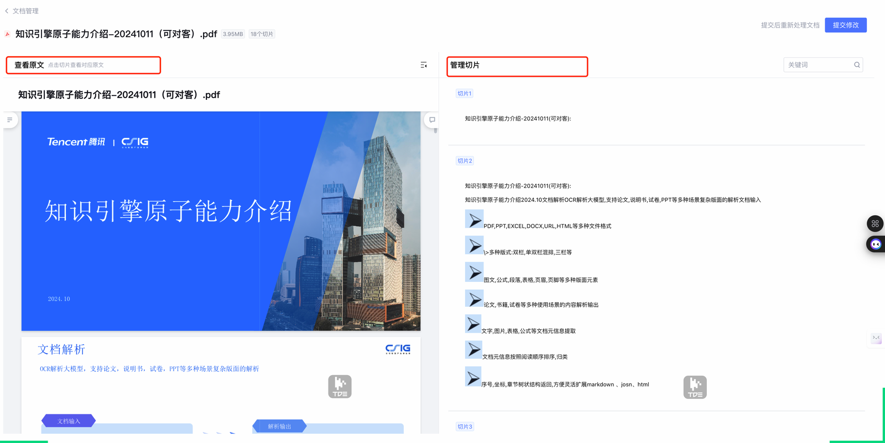
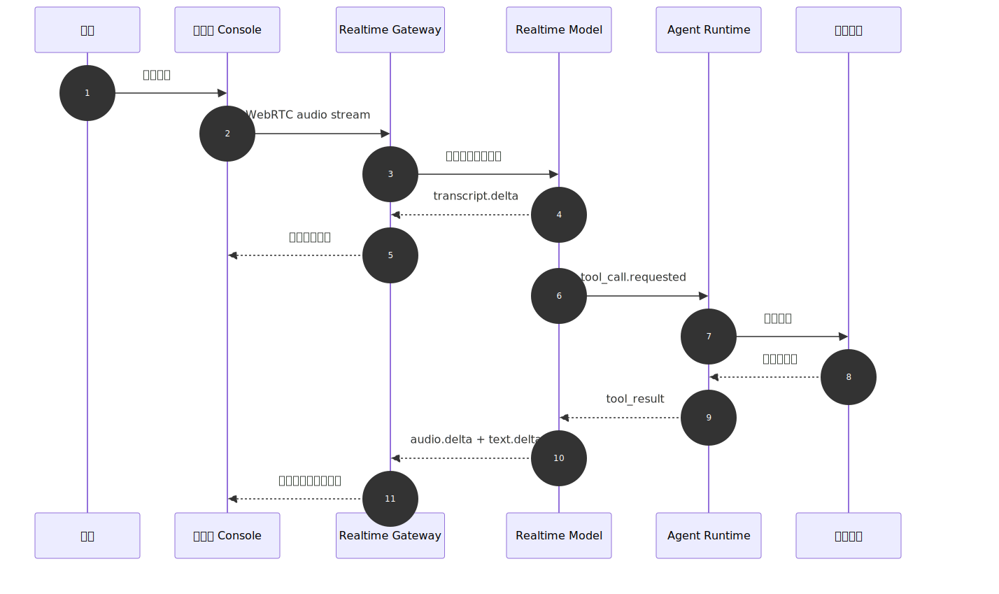

# 第49章 多模态输入与语音 Agent

---

多模态 Agent 的入口看起来简单：上传文件、识别语音、播放回答。真正进入企业任务后，风险先出现在输入侧。文件可能包含跨租户数据，图片可能拍到工牌和客户信息，Excel 可能因为合并单元格导致字段错位，语音转写可能漏掉否定词，实时链路也可能在用户打断后继续播放旧回答。

业务人员不会只用文字提问。门店经理上传货架照片，询问“这组陈列是否符合促销标准”；财务人员上传 Excel，要求解释异常波动；售后主管把客户电话录音交给 Agent 总结投诉原因；高管直接用语音追问经营指标。多模态输入把 Agent 推到业务现场入口，也把权限、质量、延迟和审计风险前移到输入阶段。

非文本材料进入上下文之前，要先经过上传与解析链路，产出结构化文本、版面、表格、元数据和引用，再交给 Agent 使用。浏览器或客户端通过 WebRTC、WebSocket 等链路与模型交换音频、转写、工具调用和控制事件，服务语音助手、客服坐席和现场作业。OpenAI Realtime 文档区分浏览器端 WebRTC、服务端 WebSocket 和 SIP 等连接方式；MDN 的 WebRTC 与 WebSocket 文档也说明了媒体传输和双向事件通道的不同定位。企业平台不必把所有输入都实时化，也不应把原始文件直接塞进模型上下文。

输入侧治理比输出侧更容易被低估。用户上传一个 Excel，系统如果没有先识别工作表、字段类型、合并单元格和敏感列，后面的 DataAgent 就会把脏结构当作可信数据；用户上传一张现场照片，系统如果没有检测人脸、工牌、客户信息和拍摄位置，视觉模型的解释可能已经泄露隐私；用户用语音说“不要下发补货任务”，ASR 漏掉“不要”两个字，工具调用就可能朝相反方向执行。多模态入口每多一种输入，就多一条需要审计的链路。

实时能力也需要克制。会议录音、客服通话和长文档上传，通常更适合异步处理：先转写、分段、标注说话人和置信度，再进入摘要或质检。低延迟语音适合现场问答、操作辅助和客服坐席，但它必须支持打断、取消、确认和降级。为了追求“实时”，把复杂文件、长录音和高风险动作都塞进同一个会话，只会让质量和责任边界更难说明。

本章讨论多模态输入、文件上传、异步解析、语音 Agent、实时交互和多模态权限。读者需要先判断产品边界，再设计文件上传、解析流水线、语音链路和实时控制。多模态能力的目标不是让 Agent 什么都能接收，而是让文件、图片、语音和视频在进入任务链路前具备权限、质量、来源、引用和审计信息。

多模态输入能力可以拆成四层。

*表49-1：多模态输入与实时媒体链路能力分层。来源：本书整理。*

| 能力层 | 代表能力 | 解决什么问题 | 企业落地边界 |
|---|---|---|---|
| 异步文件解析层 | 文档解析、OCR、表格抽取、对象存储任务 | 将文件变成可引用、可审计的上下文 | 要补病毒扫描、权限、保留周期和质量报告 |
| 实时媒体会话层 | OpenAI Realtime、浏览器 WebRTC | 支持低延迟语音、转写、打断、工具调用 | 要补临时凭证、会话控制、敏感动作确认 |
| 语音能力编排层 | ASR、TTS、录音上传 | 支持录音分析、转写摘要、语音播报 | 不等同于语音 Agent，仍需轮次、工具和确认治理 |
| 浏览器采集与传输层 | getUserMedia、WebRTC、WebSocket | 让前端采集音频并建立实时链路 | 要处理授权、降级、网络抖动和隐私提示 |

表 49-1 把多模态拆成输入治理、媒体链路、上下文引用和审计机制，而不是一个“模型能力开关”。

这个分层能避免两个常见误区。第一，把多模态等同于多模态模型，忽略解析器、对象存储、ASR、TTS、权限和质量门禁也能组成完整链路。第二，把实时语音等同于语音 Agent，忽略语音 Agent 还需要轮次管理、工具确认、上下文恢复和事故回放。企业平台要建设的是输入能力体系，而不是单个模型接口。

输入能力体系还要能解释失败。文件解析失败时，用户需要知道是格式不支持、权限不足、病毒扫描拦截，还是解析质量过低；语音链路失败时，平台要区分麦克风授权、网络抖动、ASR 置信度和模型响应超时。若所有失败都显示成“Agent 无法处理”，业务团队会把输入侧问题误判为模型能力问题，后续也无法沉淀修复样本。

---

## 49.1 国内多模态 / 语音 Agent UI 对比

国内通用 Agent 和 DataAgent 平台在多模态入口上也呈现出分层趋势：文件和图片通常先作为受控附件进入对话，复杂文档要经过解析和切片治理，音视频能力更适合交给独立节点或实时会话控制。腾讯元器的知识库界面已经把 PDF 原文、解析切片和人工管理放到同一页；阿里云百炼 Model Studio 在 Agent 对话中呈现附件上传，同时在模型选择中区分图像理解、视频理解等能力；Coze Studio 则通过工作流节点把音视频处理、HTTP 请求、文本处理等能力放到画布中。企业平台不应追求入口数量，每一种输入都要有授权、解析、确认和审计路径。

*表49-2：国内多模态 / 语音 Agent UI 产品对比。来源：本书整理。*

| 产品 / 平台 | UI 侧重点 | 多模态入口 | 对 DataAgent 的启发 | 企业落地边界 |
|---|---|---|---|---|
| 腾讯元器 | 知识库文档管理、原文预览和解析切片 | PDF、网页等资料进入知识库后被解析为可管理切片 | 多模态输入要看上传入口，也要展示解析质量、切片边界和人工修正点 | 企业仍要补文件权限、知识来源审计和数据域隔离 |
| 阿里云百炼 Model Studio | Agent 对话输入、模型选择和多模态能力配置 | 对话输入区支持附件，模型选择区区分图像理解、视频理解等能力 | DataAgent 应把附件入口、模型能力和解析状态绑定，避免用户以为上传后立刻成为可信上下文 | 文件解析、字段脱敏、保留周期和导出审批仍需平台治理 |
| 字节 / 火山 Coze Studio | 工作流画布、节点面板、音视频处理和试运行 | 音频、视频、文本、HTTP、会话等能力通过节点进入流程 | 语音和文件输入可映射为工作流节点，并把节点状态回写到消息流 | 画布编排不能替代租户权限、敏感字段检测和审计留痕 |



*图49-1：腾讯元器知识库文档解析切片管理界面。来源：产品界面截图。Alt text：界面展示已上传文档列表、解析状态（解析中/完成/失败）、分块预览，体现国产 Agent 平台对知识库文档解析进度的可见化管理。*

文件上传只是入口，解析和切片才决定后续回答质量。图 49-1 值得放在这里，是因为它把 PDF 原文、切片列表和管理入口放在同一页：文件进入 Agent 上下文前，需要经过解析、切分、质量判断和人工干预，最终以 `context_ref` 或知识切片引用进入后续推理。


*图49-2：阿里云百炼 Model Studio 对话输入区的附件入口。来源：产品界面截图。Alt text：输入框旁显示附件上传图标，点击后支持文件、图片等多种格式，体现 Agent 对话 UI 将多模态输入嵌入主对话流的交互设计。*

附件按钮越简单，背后的治理越不能省。图 49-2 的输入区很直观，但企业 DataAgent 不能让用户形成“上传后马上可信”的误解；附件入口后面必须接上传任务、解析质量、权限判断和 `context_ref`，原始文件不能直接交给模型。


*图49-3：Coze Studio 工作流画布中的音视频与工具节点面板。来源：产品界面截图。Alt text：工具栏展示音频转文字、视频理解等多模态节点可拖入画布，体现低代码平台将多模态能力封装为可组合节点的工作流设计。*

复杂多模态任务更适合拆成节点，而不是藏在一个上传入口后面。图 49-3 的节点面板覆盖视频生成、视频提取音频、视频抽帧、HTTP 请求、文本处理和会话管理等能力，放到企业平台里，对应的就是输入、处理、工具调用和运行状态都要有可组合、可回放的节点边界。

---

## 49.2 多模态输入产品边界

企业多模态 Agent 的第一原则是边界清晰。文件上传不等同于知识库入库，图片识别不等同于事实确认，语音转写不等同于用户最终意图。每一种输入都需要经过解析、权限、质量评估、用户确认和审计留痕。否则，系统会把低质量 OCR、错误转写或越权文件当成可信上下文，后续工具调用也会被污染。

企业可以先把输入场景按风险和处理方式分层。

*表49-3：各类多模态输入场景的真实输入、Agent 需求与平台要求。来源：本书整理。*

| 输入场景 | 真实输入 | Agent 需要什么 | 默认处理方式 | 平台要求 |
|---|---|---|---|---|
| 经营分析附件 | Excel、CSV、PDF 报告 | 表格结构、指标口径、字段类型 | 异步解析 | 格式校验、字段脱敏、质量报告 |
| 现场图片 | 货架、设备、票据、截图 | 图像说明、OCR 文本、区域引用 | 异步解析 + 可选视觉理解 | PII 检测、图片权限、人工确认 |
| 客服录音 | 电话录音、会议录音 | 转写、说话人、时间戳、摘要 | 异步 ASR | 保留周期、客户隐私、转写置信度 |
| 实时语音问答 | 麦克风音频 | 转写增量、用户打断、工具确认 | WebRTC 实时会话 | 临时凭证、VAD、降级和审计 |
| 移动现场作业 | 语音 + 图片 + 表单 | 现场证据、任务状态、确认动作 | 混合模式 | 离线重试、权限缓存、风险确认 |

表 49-3 的重点不在“支持多少模态”，而在不同输入的默认处理方式。低风险附件可以异步解析后进入上下文引用；高风险文件必须先过扫描和权限；实时语音适合短轮次、多打断的场景；录音分析适合异步处理，不需要强行做实时。

### 49.2.1 文件、语音与上下文引用边界

文件上传建议采用“对象存储 + 解析任务 + 上下文引用”模式。前端只负责上传和展示任务状态，Agent 不直接读取原始文件，而是读取解析后的安全引用。这样可以控制文件大小、格式、病毒扫描、权限、脱敏、重试和审计。

这个模式还可以避免用户误解。上传成功只说明文件进入平台，解析成功才说明系统得到可用结构，质量门禁通过才说明它能进入 Agent 上下文。前端应该把这几个状态分开展示：`uploaded`、`parsing`、`review_required`、`ready_for_context`、`rejected`。如果用户在解析未完成时提问，Agent 应提示文件仍在处理，或者只使用已有上下文；不能把“上传中”的文件当成已经可信的业务证据。

*表49-4：多模态输入类型与治理边界。来源：本书整理。*

| 概念 | 定义 | 与相邻概念的区别 |
|---|---|---|
| 多模态输入 | 文本之外的文件、图像、音频、视频等输入 | 不等同于多模态模型，平台也可用解析器和单模态模型组合实现 |
| 异步解析 | 上传后由后台任务解析文件，并逐步返回状态和结果 | 不等同于同步上传即问，适合大文件和复杂版面 |
| Context Ref | 指向解析后安全上下文的引用 | 不等同于原始文件 URL，它带权限、版本和质量信息 |
| ASR | 自动语音识别，将音频转为文本 | 不等同于语义理解，转写后仍需意图识别和确认 |
| TTS | 文本转语音，将文字回答合成为音频 | 不等同于语音 Agent，后者还需要打断、轮次和工具控制 |
| VAD | 语音活动检测，用于判断用户何时开始或停止说话 | 不等同于唤醒词，VAD 解决实时轮次切分 |
| WebRTC | 浏览器实时音视频通信技术，适合低延迟语音交互 | 比 WebSocket 更贴近媒体传输和网络自适应 |
| Realtime Session | 低延迟多模态会话，持续交换音频、文本、工具调用等事件 | 不等同于普通 HTTP 请求，它有会话状态、临时凭证和实时控制 |

文件解析完成后，Agent 消费的是 `context_ref`，而不是文件路径。`context_ref` 至少要包含租户、权限、来源、解析版本、质量评分和保留策略。这样业务方追问“这份分析用了哪张表”“这段转写来自哪段录音”“这张图片是否已脱敏”时，平台可以回放。

`context_ref` 也要有失效机制。文件被删除、权限被撤回、保留期到期、解析器版本被废弃时，旧引用不能继续无提示地进入新会话。比较稳妥的做法是让 Runtime 在每次消费引用前重新检查状态，并把失效原因返回给前端。这样用户看到的是“文件权限已变化”或“解析版本需要更新”，而不是一段看似正常但来源已经失效的回答。

### 49.2.2 多模态输入进入 Agent 的准入条件

文件上传以后并不意味着 Agent 已经可以直接回答。企业系统需要先做格式检查、病毒扫描、解析质量评估、权限确认和引用登记。语音 Agent 也不是 ASR 加 TTS 的简单组合；生产链路还要处理打断、半双工或全双工、噪声、延迟、轮次、工具调用和审计。

实时能力也不天然优于异步处理。录音分析、复杂表格解析、票据识别更适合异步任务，强行实时化会牺牲质量和可审计性。多模态模型可以理解图片和文件，但权限、来源、字段脱敏和证据链仍由平台负责。

转写文本不能直接当作最终意图。ASR 可能漏词、错词、混淆说话人。高风险工具调用必须展示文本化意图，并让用户确认后再执行。

语音场景里尤其要处理否定、数量和对象。用户说“不要通知客户”“只查华东区”“取消上一条”，这些短语一旦转写错误，工具动作会直接偏离意图。实时语音 Agent 可以在低风险问答里连续响应，但遇到导出、下发、提交、删除、发送通知等动作时，应把识别出的意图转成确认卡片，让用户用语音或点击确认。这个确认动作本身也要进入 trace。

语音确认也不能只保存最终按钮状态。平台应记录转写文本、置信度、用户确认方式、确认时间和执行前的工具参数。这样发生争议时，可以复查系统听到了什么、展示了什么、用户确认了什么，而不是只看到某个工具已经被调用。

多模态输入最终要回到一个简单原则：原始材料先变成受控引用，再进入 Agent 任务。文件、图片和语音越贴近业务现场，越要把来源、质量、权限和用户确认记录清楚。这样多模态能力才能成为可靠入口，而不是把更多不可解释内容塞进上下文。

这条原则也能帮助产品取舍：宁可少支持几种格式，也要把每种格式的状态、失败原因和引用链路做清楚。

---

## 49.3 文件上传与异步解析

多模态输入层位于前端 Console 与 Agent Runtime 之间，既连接文件解析工具，也连接实时媒体服务。它的输出不应是“原始文件”或“原始音频”，而应是带权限、来源和质量标记的上下文引用。



*图49-4：多模态输入层在企业 Agent 平台中的位置。来源：本书自绘。Alt text：分层图中多模态输入层位于前端 UI 之下、Agent Runtime 之上，向上把文件、图片、语音转化为 Agent 可消费的上下文，标出权限检查和解析流水线两个关键组件。*

图 49-4 展示三个边界。上传入口和 Agent Runtime 解耦，文件先进入对象存储和解析任务，解析结果通过 Context Store 暴露给 Runtime，避免模型直接读取未经治理的原始文件。实时媒体和业务动作也要解耦：语音链路负责采集、传输、转写、播放和打断，业务动作仍然经过 Tool Registry 和 Policy。多模态输入还需要接入 Observability，上传失败、解析警告、转写置信度、用户修正、打断、确认和工具调用都应进入同一条 trace。

### 49.3.1 文件上传与异步解析流水线

文件上传的工程链路应围绕“可重试、可降级、可审计”设计，而不是围绕“上传后马上问”设计。

大文件和复杂格式还需要排队和预算控制。一个 200 页 PDF、一个包含多张透视表的 Excel、一个两小时客服电话录音，解析成本和等待时间都不同。平台应在上传后给出预估状态，必要时允许用户先提问已解析部分，或者把任务转为后台处理。这样多模态输入不会把对话链路拖死，也能让用户理解等待来自解析而不是模型卡住。

质量验收也要按输入类型拆开。Excel 要看 sheet、表头、合并单元格和字段类型是否识别正确；图片要看 OCR 文本、敏感区域和视觉解释是否能回到原图；录音要看说话人、时间戳、转写置信度和关键否定词；实时语音要看打断、取消、重连和确认是否可靠。把这些都写成“多模态准确率”，会让工程团队不知道该修解析器、ASR、前端状态，还是权限策略。


*图49-5：文件上传与异步解析流水线。来源：本书自绘。Alt text：横向流水线依次为前端上传到对象存储、触发异步解析任务、OCR/文档解析、分块入向量库、返回解析状态，箭头表示解析与对话独立进行不阻塞 UI。*

组件划分如下。

*表49-5：文件上传与异步解析组件职责。来源：本书整理。*

| 组件 | 职责 | 输入 | 输出 | 失败模式 |
|---|---|---|---|---|
| Upload API | 接收文件并创建解析任务 | 文件、元数据、权限上下文 | `upload_id`、`task_id` | 文件过大、格式不支持 |
| Object Store | 保存原始文件或受控副本 | 文件流、保留策略 | 对象引用 | 留存过长、跨租户访问 |
| Parser Worker | 执行 OCR、表格抽取、ASR、版面解析 | 对象存储引用 | `context_ref`、质量报告 | 解析失败、质量过低 |
| Context Store | 保存解析结果、引用和证据链 | 解析片段、元数据 | 可检索上下文引用 | 引用过期、权限变更 |
| Quality Gate | 判断解析结果能否进入 Agent 上下文 | 置信度、警告、字段映射 | allow / confirm / reject | 低质量内容误入上下文 |
| Audit Adapter | 记录上传、解析、删除和消费 | trace、用户、资源 | 审计记录 | trace 断链、敏感字段泄漏 |

文件上传契约示例：

```http
POST /api/multimodal/uploads
Content-Type: multipart/form-data

Request:
file=@margin_report.xlsx
metadata={"tenant_id":"retail-demo","purpose":"data_agent_context","conversation_id":"conv_001"}

Response:
{
  "upload_id": "upl_001",
  "parse_task_id": "parse_001",
  "status": "queued",
  "max_wait_seconds": 300,
  "trace_id": "trace_mm_001"
}
```

解析状态事件示例：

```json
{
  "type": "parse.completed",
  "parse_task_id": "parse_001",
  "context_ref": "context://retail-demo/parse_001",
  "quality": {
    "ocr_confidence": 0.94,
    "table_count": 3,
    "warnings": ["merged_cells_detected"]
  },
  "audit": {
    "source_file_hash": "sha256:...",
    "retention_policy": "tenant_default",
    "trace_id": "trace_mm_001"
  }
}
```

这份契约约束的是文件生命周期：原始文件、解析结果、上下文引用和 Agent 会话必须能串起来；低质量解析不能静默进入上下文；保留周期和删除策略要在上传时写入。

## 49.4 语音 Agent 架构

语音 Agent 的链路可拆成六段：采集、传输、转写、理解、行动、合成。浏览器端默认使用 WebRTC 建立低延迟音频链路；服务端后台任务或非浏览器客户端可使用 WebSocket。实时语音并不意味着所有逻辑都实时执行，敏感工具调用仍应暂停并进入确认流程。



*图49-6：语音 Agent 实时交互时序。来源：本书自绘。Alt text：时序图展示用户说话、VAD 检测语音端点、STT 转文字、Agent 处理、TTS 合成并流式播放的顺序，标出用户打断时的状态切换，体现实时语音的低延迟设计。*

## 49.5 实时语音交互控制

实时语音事件至少要覆盖以下类型。

*表49-6：实时语音会话事件契约。来源：本书整理。*

| 事件 | 触发时机 | 前端动作 | 后端动作 |
|---|---|---|---|
| `session.created` | 临时凭证创建后 | 准备连接媒体通道 | 绑定用户、租户和 trace |
| `audio.input.started` | VAD 检测到用户说话 | 显示聆听状态 | 开始接收音频帧 |
| `transcript.delta` | ASR 产生增量转写 | 展示实时字幕 | 累积轮次文本 |
| `response.audio.delta` | 模型或 TTS 产生音频 | 加入播放队列 | 记录 response_id |
| `tool.approval_required` | 触发高风险动作 | 暂停播放并展示审批卡 | 等待用户确认 |
| `response.cancelled` | 用户打断或取消 | 清空旧音频队列 | 取消当前 response |
| `session.closed` | 会话结束或超时 | 释放麦克风和播放器 | 关闭会话并落审计 |

实时会话事件示例：

```json
{
  "session_id": "rt_001",
  "type": "transcript.delta",
  "seq": 23,
  "payload": {
    "text_delta": "华东区本月",
    "speaker": "user",
    "is_final": false
  },
  "trace_id": "trace_voice_001"
}
```

语音 Agent 的工程难点在轮次控制。用户打断时，前端要停止本地播放，服务端要取消当前 response，后续到达的旧音频和旧工具事件要按 `response_id` 丢弃。否则用户已经进入下一轮问题，系统还在播上一轮回答。

## 49.6 多模态权限与审计留痕

多模态输入把风险前移到“输入阶段”。文件可能包含敏感字段，图片可能包含人脸或工牌，录音可能包含客户隐私。平台必须在 Agent 使用这些内容之前完成权限判断和最小化暴露。



*图49-7：多模态输入治理状态机。来源：本书自绘。Alt text：状态机含 uploading、scanning、quarantined、parsing、ready、expired 等节点，箭头标出权限检查、病毒扫描、解析完成、过期等触发迁移，体现文件全生命周期可管控。*

多模态输入的故障往往在 Agent 推理前已经发生：文件越权、OCR 置信度低、图片包含隐私或语音转写失真。表 49-7 将这些问题放在输入治理阶段处理，避免把脏输入继续传给后续工具。

*表49-7：多模态输入风险点与处理方式。来源：本书整理。*

| 风险点 | 触发条件 | 处理方式 |
|---|---|---|
| 解析质量低 | OCR 置信度低、表格结构不完整 | 要求用户确认关键字段，或改走人工校验 |
| 文件越权 | 用户上传不属于当前租户或项目的文件 | 拒绝进入上下文，记录安全事件 |
| 图片泄漏隐私 | 图片包含人脸、工牌、客户姓名 | 脱敏、裁剪或禁止进入上下文 |
| 语音误识别 | 噪声、口音、多人说话导致转写错误 | 展示实时转写，敏感动作前要求用户确认文本意图 |
| 实时延迟过高 | 网络抖动、模型响应慢 | 降级为按键发言、文本输入或录音上传 |
| 打断失效 | 模型仍在播放旧回答 | 前端停止播放，服务端取消当前 response，丢弃旧音频事件 |
| 审计缺失 | 音频、文件、工具调用没有统一 trace | 会话创建时生成 trace，所有输入引用和工具调用继承 trace |


*图49-8：实时语音控制链路。来源：本书自绘。Alt text：链路从麦克风采集音频、经 VAD 端点检测、STT 识别、Agent 推理、TTS 合成到扬声器播放，标出打断点和延迟控制位置，体现实时语音交互的完整流程。*

审计记录至少要回答五个问题：谁上传或说了什么，系统如何解析，哪些内容进入了 Agent 上下文，触发了哪些工具，用户确认了哪些高风险动作。缺少这些记录，多模态 Agent 会比文本 Agent 更难追责，因为原始输入通常更复杂、更敏感、也更难人工快速复核。

### 49.6.1 多模态交互的设计约束

#### 异步解析与同步问答

企业文件、表格和录音默认应走异步解析。异步链路可以处理大文件，也方便做病毒扫描、OCR/ASR 重试、版本记录和审计引用；代价是用户需要看到任务状态，而不是立刻拿到答案。同步问答只适合小图片、小文本附件和低风险原型，文件稍大或解析失败率稍高，就会把前端体验和后端治理同时拖垮。稳定知识库则不应每次上传即问，而应进入第19章和第20章的入库、切分、索引和引用链路。

#### WebRTC、WebSocket 与录音上传

浏览器实时语音默认选择 WebRTC。它在低延迟、网络自适应和音频采集上更成熟，适合需要打断、边说边听和实时反馈的 Agent UI；代价是调试、服务端接入和部署复杂度更高。WebSocket 更适合服务端到服务端事件或非浏览器客户端，协议简单，但媒体处理能力弱于 WebRTC。录音上传实现最简单，也最适合会议纪要、客服录音分析和离线质检；它不能支持实时打断，因此不适合实时助理体验。

#### 直接多模态模型与解析器流水线

直接多模态模型适合处理复杂视觉语义，例如现场检查、截图理解、图片问答和无法提前结构化的图像内容。它的代价是成本高，证据结构弱，后续很难把回答逐项绑定到文本片段、单元格或时间戳。解析器流水线更适合文档、表格、票据和录音，因为它能产出文本块、表格单元、时间戳、置信度和文件版本，便于审计和检索。高价值流程可以采用混合模式：先用解析器拿结构化证据，再让多模态模型处理确实无法结构化的视觉语义。

#### 保存原始音频与只保存转写

原始音频是否留存要由租户策略和场景风险决定。客服质检、合规留存和争议复盘通常需要保存原始音频，但必须配套加密、访问审批、保留期限和删除机制。普通语音助手更适合只保存转写文本、确认记录和 trace 引用，降低隐私和存储风险。低风险内部助手甚至可以只保存摘要和用户确认记录，但这样会削弱完整争议复盘能力，产品上要提前说明边界。

## 49.7 多模态入口的证据治理

多模态输入扩大了 Agent 能看到的世界，也扩大了证据治理范围。图片、截图、语音、文件和视频片段都可能包含敏感信息、过期信息或被注入的指令。平台不能把多模态内容简单转成文本后丢进模型，而要保留来源、解析版本、置信度、权限和人工复核状态。

多模态链路的第一条原则，是原始输入和可用上下文分离。用户上传文件、图片或录音后，系统先生成受控对象引用，再经过病毒扫描、权限检查、解析、质量评估和脱敏，最终产出 `context_ref` 或 `evidence_ref`。Agent 消费的是引用和摘要，不是未经处理的原始文件。这样一来，文件过期、权限收回、解析重跑或用户要求删除时，平台都能通过引用层控制后续访问。

第二条原则，是解析失败必须有明确降级。OCR 质量低时，不能让模型“凭感觉”读图，而应要求用户确认关键字段或改走人工校验；ASR 置信度低时，敏感动作前必须展示转写文本并要求确认；实时语音延迟过高时，要降级为按键发言、文本输入或录音上传；文件解析队列拥塞时，前端要展示任务状态和预计等待，而不是让用户反复提交同一文件。多模态体验的稳定性，来自这些降级路径，而不只是模型能不能看懂图片。

语音 Agent 的实时性会压缩安全判断时间。系统要在低延迟交互和高风险动作之间划清边界：语音可以用于查询、导航和低风险确认，高风险写操作仍应转成可阅读的审批卡片，让用户看到结构化参数和影响范围。否则一句含糊的语音确认可能触发不可逆动作。

文件和截图解析要进入证据链。OCR 结果、版面结构、表格抽取、图像描述和用户原始文件之间应有引用关系。报告里引用截图结论时，平台要能回到具体页面、区域和解析版本。若只保存模型生成的文字说明，后续无法判断错误来自 OCR、视觉模型、表格解析还是业务解释。

多模态能力还会影响成本和体验。大文件解析、语音流、视频抽帧和多模态 embedding 都比纯文本更贵，也更容易触发队列等待。平台应把解析任务异步化，前端展示阶段状态，Trace 记录每个解析产物。这样用户知道任务还在处理，运维也能定位瓶颈。

第三条原则，是证据链要能跨模态回放。经营分析报告引用一张截图时，平台要能回到截图文件、解析版本、识别区域和用户确认记录；客服语音触发工单更新时，平台要能回到转写片段、时间戳、确认卡片和工具调用；票据识别生成凭证草稿时，平台要能回到原始票据、OCR 字段、金额校验和人工复核意见。文本 Agent 的证据通常是一段文档，多模态 Agent 的证据是一组对象、区域、时间戳和确认动作，治理模型也要随之升级。

## 本章小结

多模态输入扩展了业务入口，也放大了权限、质量和审计风险。文件上传默认应走异步解析和上下文引用，Agent 不应直接消费原始文件。语音 Agent 也不是单独接入 ASR 和 TTS 就完成了，还要处理轮次控制、打断、确认、降级和转写证据。

浏览器实时语音默认选择 WebRTC，后台或非浏览器链路可以使用 WebSocket。敏感动作必须在转写后再次确认，不能把实时识别结果直接当作最终意图。只要多模态输入会影响业务动作，就要把原始文件、解析版本、转写文本、确认记录和 Trace 放进同一条证据链。


## 参考文献

Radford, A. et al. (2023). [*Robust Speech Recognition via Large-Scale Weak Supervision*](https://arxiv.org/abs/2212.04356). ICML.

W3C. (n.d.). [WebRTC 1.0: Real-Time Communication Between Browsers](https://www.w3.org/TR/webrtc/).

Web Speech API. (n.d.). [Specification](https://webaudio.github.io/web-speech-api/).

OpenAI. (n.d.). [Realtime API documentation](https://platform.openai.com/docs/guides/realtime).
