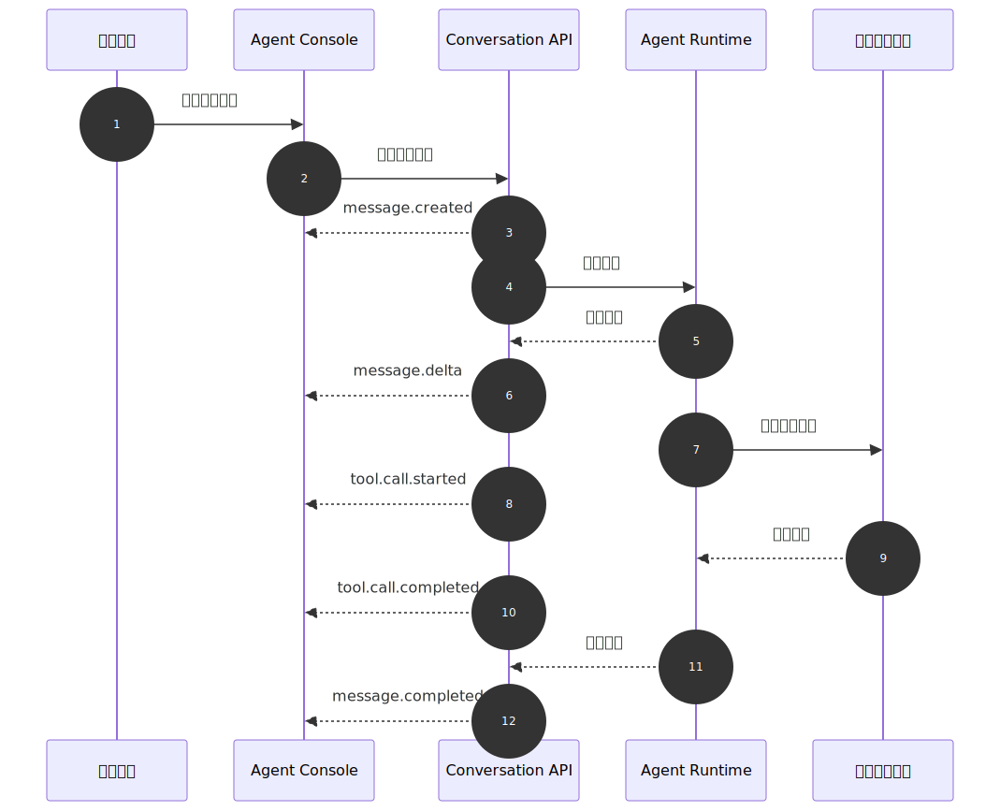
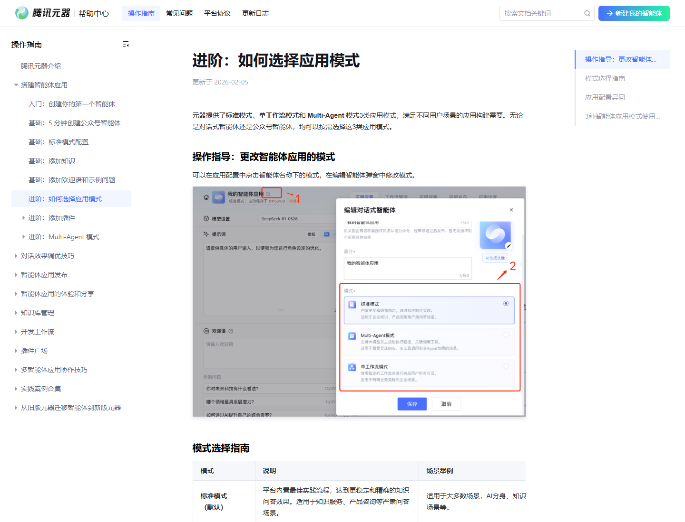
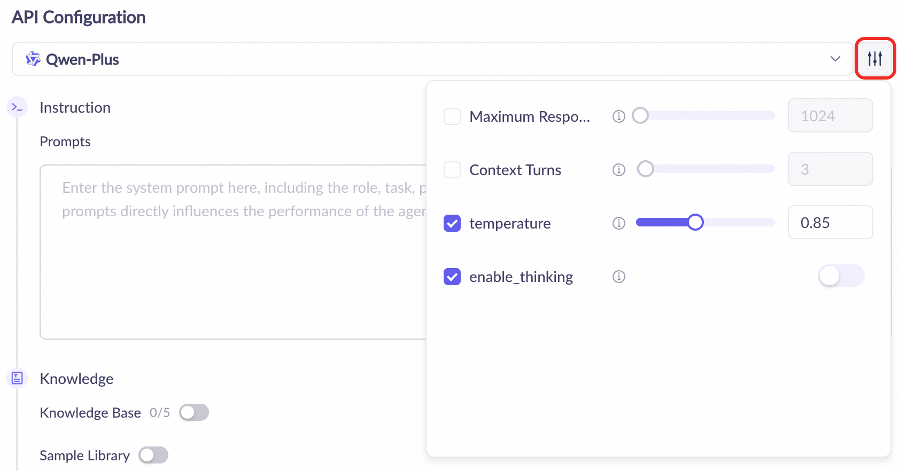
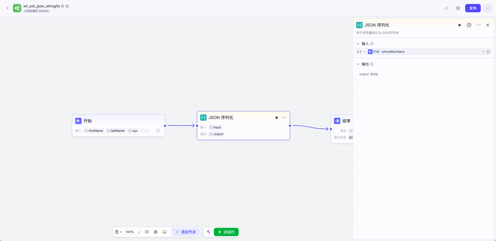

# Ch.47 对话 UI 与流式输出

> **状态**：v0.3 初稿
> **本章目标**：读者读完后，能够判断企业 Agent UI 为什么不能停留在聊天框，并设计一套支持流式输出、工具进度、错误恢复和前端可观测的对话协议。
> **关键议题**：企业 Agent UI 组成；流式交互协议；消息模型与增量渲染；Agent 前端框架选型；可靠交互与前端可观测。
> **前置阅读**：Ch.22 Agent Runtime；Ch.23 Tool Registry & Function Calling；Ch.38 可观测性与 Trace。
> **估计阅读**：L1 15 min / L1+L2 45 min / 全章 90 min
> **mini-platform 关联**：`mini-platform/console/`；`mini-platform/core/runtime/`；`mini-platform/core/observability/`。当前仓库还没有完整 Console，本章先给出协议、组件和前端观测契约。
> **实战项目**：`mini-platform/projects/16-generative-ui-dataagent/`（计划项目）。
> **按角色推荐阅读层**：CTO ⇒ L1+L2 ｜ 架构师 ⇒ L1+L2 ｜ 工程师 ⇒ L1+L2+L3

企业第一次做 Agent UI，最容易把问题简化成“做一个聊天窗口”。这在内部演示里通常能跑通：用户输入问题，模型输出一段文字，前端把 Markdown 渲染出来。真正进入企业场景后，聊天窗口很快会不够用。用户要看到 Agent 正在查哪张表、用了哪个指标口径、是否触发审批、为什么失败、能不能继续生成、这次回答能不能被审计追溯。

一个零售企业的 DataAgent 就是典型例子。零售负责人问“华东区本月毛利异常来自哪些 SKU”，系统不能只返回“主要来自生鲜和家电”。它还要展示 SQL 生成过程、权限过滤结果、数据查询状态、图表卡片、引用的指标口径、导出按钮、用户反馈入口。制造负责人继续追问“是否和上周补货延迟有关”时，前端还要把上一轮工具结果、当前用户权限和新的查询任务串起来。

从业界产品看，Agent UI 正在从“对话组件”走向“任务工作台”。Vercel AI SDK 把模型调用、流式输出、工具调用和前端状态封装为开发框架；assistant-ui 聚焦生产级 React 对话组件；CopilotKit 把 Agent 嵌入现有应用状态；AG-UI 则尝试把 Agent 与前端之间的事件流、共享状态和人在回路抽象成协议。这些路线不同，但共同指向同一个结论：企业 Agent UI 的核心不是文本渲染，而是任务过程的可见、可控、可恢复和可审计。

可以把当前业界路线分成四类。

**表 47-1：业界 Agent UI 技术路线对比**

| 路线 | 代表 | 解决什么问题 | 企业落地时的边界 |
|---|---|---|---|
| 流式应用 SDK | Vercel AI SDK | 统一模型调用、消息状态、流式输出、工具调用和前端 hooks | 适合快速搭建应用层，但企业权限、审计、trace 和工具治理仍要自建 |
| 对话组件框架 | assistant-ui | 提供线程、消息、输入框、附件、运行状态等生产级 UI 组件 | 解决的是 UI 基础设施，不负责企业 Agent Runtime 和工具权限 |
| 应用内 Copilot | CopilotKit | 把 Agent 嵌入业务应用，支持共享应用状态、前端工具和人在回路 | 适合已有业务系统增强，需要把业务状态和审批策略接入平台治理 |
| Agent-UI 协议 | AG-UI | 用事件协议连接前端应用与不同 Agent 后端，覆盖文本、工具、状态和交互 | 适合跨框架互通，但生产环境仍要补租户、权限、审计和观测规范 |

浏览器基础协议也在形成清晰分工。SSE 适合单向服务端事件推送，常用于文本流、工具进度和任务状态；WebSocket 适合双向实时控制，适合多人协作、语音控制和复杂应用状态同步；WebRTC 更偏实时音视频和低延迟媒体通道，放到 Ch.49 讨论更合适。企业平台不需要把三者混成一个“实时能力”，而是要明确哪类任务走哪条链路。

如果从企业产品形态看，对话 UI 也在分化。

**表 47-2：企业 Agent UI 产品形态对比**

| 产品形态 | 代表 | 对话 UI 承担的角色 | 对企业平台的启发 |
|---|---|---|---|
| 企业 Copilot 构建平台 | Microsoft Copilot Studio | 让业务团队通过自然语言、主题、动作和连接器构建 Agent | 对话 UI 要能承载动作选择、知识来源、转人工和性能分析 |
| 业务系统内 Agent | Salesforce Agentforce | 在销售、服务等业务系统中通过对话触发动作，并可增强 Agent UI | 对话 UI 需要和业务对象、认证、动作权限、渠道会话绑定 |
| 工作流型 Agent 平台 | ServiceNow AI Agents | 让 Agent 围绕企业工作流执行任务，并纳入生命周期治理 | 对话 UI 只是入口，背后必须连接工作流、监控和治理 |
| 开源/低代码 Agent 应用 | Dify Chatflow / Workflow | 把 Chatflow 用作多轮对话应用，把 Workflow 用作后台任务编排 | 对话 UI 要区分“持续会话”和“一次性任务执行” |

这张表说明，对话 UI 在业界已经不再只是模型应用的外壳。它可能是 Copilot 的入口、业务动作的确认界面、工作流的观测窗口，也可能是低代码编排结果的交互层。企业自建平台时，不能只学习某个产品的视觉样式，而要抽取它们背后的共性：会话上下文、工具动作、状态流、权限确认和可观测闭环。

这类业界趋势给企业的启发是：不要把前端框架当成平台边界。框架可以帮助更快做出 chat UI，协议可以帮助不同 Agent 后端接入前端，但企业真正要沉淀的是自己的消息契约、工具渲染规范、权限策略和会话观测模型。

本章沿着五个问题展开：企业 Agent UI 到底由哪些界面单元组成，为什么流式输出要按事件协议建模，消息模型怎样支持增量渲染，前端框架如何选型，以及如何把前端交互纳入可观测体系。

## 企业 Agent UI 组成

企业 Agent UI 首先是业务任务入口，其次才是对话界面。一个只显示问答气泡的页面，很难承载数据分析、审批、导出、纠错和审计。很多内部试点会发现，业务用户真正关心的不是“模型是不是会聊天”，而是“它查了什么、依据是什么、我能不能改、出错后谁负责”。

可以把企业 Agent UI 拆成七类界面单元。

**表 47-3：企业 Agent UI 七类界面单元**

| 界面单元 | 作用 | 企业要求 |
|---|---|---|
| 会话入口 | 输入问题、选择工作区、切换任务模式 | 绑定租户、用户、权限、默认数据域 |
| 消息流 | 展示用户问题、Agent 回答、引用和错误 | 支持流式、折叠、恢复、引用跳转 |
| 工具进度 | 展示 SQL、检索、图表、审批等工具状态 | 只展示允许用户看到的参数和结果 |
| 上下文面板 | 展示当前指标口径、数据源、过滤条件 | 避免用户误解回答适用范围 |
| 业务控件 | 重试、停止、确认、导出、转人工 | 高风险动作必须服务端二次校验 |
| 反馈入口 | 点赞、差评、纠错、人工备注 | 进入评估集和会话回放 |
| 观测标识 | trace、耗时、模型、工具版本 | 支持排障、复盘和审计 |

这七类单元说明一个事实：对话 UI 不是 Agent 平台的边角料，而是 Runtime、Tool Registry、权限系统、观测系统暴露给用户的交互层。前端设计不清楚，后端再强也会变成黑盒。

## 流式交互协议

流式输出的价值不只是“更快看到字”。在企业 Agent 里，流式协议还承担任务进度、工具状态、错误恢复、审批插入和前端观测。模型输出文字、Runtime 调用工具、用户点击停止、权限系统拒绝动作，这些都应该进入同一条可排序、可恢复的事件流。

**表 47-4：流式交互协议核心概念**

| 概念 | 定义 | 与相邻概念的边界 |
|---|---|---|
| 对话 UI | 承载会话、工具进度、业务动作和反馈的交互层 | 不等同于聊天气泡组件 |
| 流式输出 | 服务端把生成过程拆成事件或增量片段发送给前端 | 不等同于单纯 token 打字机效果 |
| SSE | Server-Sent Events，浏览器通过 HTTP 接收服务端单向事件 | 适合文本生成、工具进度、低复杂度推送 |
| WebSocket | 浏览器与服务端之间的双向长连接协议 | 适合强实时控制、多人协同、语音等场景 |
| 增量渲染 | 前端按事件更新局部消息、工具卡和状态 | 不等同于字符串拼接，需要幂等和回滚 |
| 前端可观测 | 把用户交互、渲染耗时、连接恢复、反馈行为接入 trace | 不等同于页面访问统计 |

企业 DataAgent 默认可以选择 SSE 作为文本任务的主传输协议。原因很直接：大多数分析任务是服务端持续推送，用户偶尔打断；SSE 的部署、代理和浏览器支持成本更低。WebSocket 不是不用，而是留给 Ch.49 中的语音、多端协同和强实时控制场景。

这个边界比“哪个协议更先进”更重要。企业平台选协议，不是为了炫技，而是为了让一次任务的事件可以排序、恢复、审计和解释。

### 常见误区

1. **把流式输出理解成 token 打字机。** 真实任务里，前端需要的不只是文字增量，还包括工具开始、工具进度、工具完成、审批请求、错误和最终完成态。
2. **认为可靠性都在后端。** 前端如果不处理重复事件、旧请求污染、连接恢复和取消语义，同样会造成错误结果展示。
3. **以为用了 UI SDK 就完成企业 Agent UI。** SDK 能提高开发效率，但权限、审计、观测、降级和业务状态同步仍要由平台设计。
4. **把工具日志直接展示给用户。** 工具日志面向工程排障，用户需要的是经过脱敏、摘要和解释的任务状态。


## 消息模型与增量渲染

企业对话 UI 位于 Agent 平台最上层，但它不应该直接依赖某个模型厂商的流式格式。更稳的做法是由 Conversation API 把 Runtime、LLM Gateway、Tool Registry 和 Observability 的内部事件转换成统一前端事件。这样模型可以替换，工具可以扩展，前端消息状态仍然稳定。

**图 47-1：对话 UI 在企业 Agent 平台中的位置**



这张图里有三个关键边界。

第一，Agent Console 不直接调用模型。所有模型交互经过 Conversation API 和 Runtime，这样才能统一鉴权、trace、限流和错误处理。

第二，工具执行结果不直接写入前端。Tool Registry 返回的结构化结果需要经过 Runtime 整理、权限过滤和渲染契约转换，前端只消费可以展示的事件。

第三，前端事件也要回流到观测系统。用户停止生成、点击重试、展开工具卡、提交差评，都应该和后端 trace 关联，否则线上事故只能看到后端日志，看不到用户实际看到什么。

DataAgent 的一次流式问答可以抽象成下面的时序。

**图 47-2：DataAgent 流式对话时序**



这条链路里，前端最重要的工作不是“接收字符串”，而是维护任务视图。用户看到的是一条回答，系统内部却包含消息创建、文本增量、工具开始、工具完成和最终完成多个阶段。任何阶段失败，都要有可解释的前端状态。

### 组件划分与接口契约

企业 Agent UI 的消息模型建议拆成三层。

**表 47-5：企业 Agent UI 消息模型三层**

| 层级 | 记录内容 | 为什么需要 |
|---|---|---|
| 会话层 | `conversation_id`、租户、用户、工作区、权限上下文 | 支持多轮追问、租户隔离和会话回放 |
| 消息层 | 用户消息、助手消息、工具消息、审批消息、错误消息 | 支持展示、引用、反馈和审计 |
| 事件层 | 某条消息生成过程中的增量事件 | 支持流式、恢复、幂等和状态机 |

前端不要把事件直接当成最终消息存储。事件是过程，消息是视图。Event Reducer 的职责是把有序事件折叠成稳定的消息树、工具卡和错误状态。

**图 47-3：流式事件模型与前端 reducer**


组件划分如下。

**表 47-6：Agent UI 组件职责与失败模式**

| 组件 | 职责 | 输入 | 输出 | 失败模式 |
|---|---|---|---|---|
| Conversation API | 接收用户消息，返回统一事件流 | 会话 ID、用户输入、上下文 | SSE 事件流 | 鉴权失败、连接中断、事件乱序 |
| Event Reducer | 将事件折叠为前端状态 | 事件序列 | 消息树、工具卡片状态 | 重复事件、缺失完成事件 |
| Message Renderer | 渲染文本、引用、代码、错误 | 消息状态 | 可读消息 | Markdown 注入、渲染阻塞 |
| Tool Call Panel | 展示工具调用进度与结果 | 工具事件、Schema | 工具卡片 | 工具结果过大、敏感字段暴露 |
| Interaction Controller | 处理中断、重试、确认、导出 | 用户操作 | 控制事件 | 取消后旧流继续写入 |
| Observability Adapter | 记录前端事件与用户反馈 | trace、event、UI 状态 | 指标、日志、回放索引 | trace 断链、隐私字段泄漏 |

一个最小可用的流式请求如下。

```http
POST /api/conversations/{conversation_id}/messages
Content-Type: application/json

Request:
{
  "message": {
    "role": "user",
    "content": "华东区本月毛利异常来自哪些 SKU？"
  },
  "context": {
    "tenant_id": "retail-demo",
    "workspace_id": "retail-bi",
    "permission_scope": ["sales_summary:read"]
  },
  "stream": true
}

Response:
Content-Type: text/event-stream

event: message.created
data: {"event_id":"evt_1","message_id":"msg_1","run_id":"run_1","seq":1}

event: message.delta
data: {"event_id":"evt_2","message_id":"msg_1","run_id":"run_1","seq":2,"payload":{"content_delta":"正在查询"}}
```

事件至少要覆盖以下类型。

**表 47-7：DataAgent 流式事件契约**

| 事件 | 触发时机 | 前端动作 |
|---|---|---|
| `message.created` | Runtime 接受用户输入并创建助手消息 | 新建占位消息 |
| `message.delta` | 模型或 Runtime 产生文本增量 | 追加内容，保持滚动稳定 |
| `tool.call.started` | Agent 准备调用工具 | 展示工具卡片和输入摘要 |
| `tool.call.delta` | 工具执行产生进度 | 更新阶段、行数、耗时 |
| `tool.call.completed` | 工具返回结构化结果 | 固化工具结果或数据引用 |
| `approval.required` | 高风险动作需要确认 | 插入审批卡片 |
| `message.completed` | 助手消息完成 | 关闭生成态，打开反馈入口 |
| `error` | 任一阶段失败 | 展示重试、降级或转人工 |

错误响应必须能被前端稳定分类。企业系统不要只返回一段错误文本。

```json
{
  "code": "TOOL_PERMISSION_DENIED",
  "reason": "用户缺少 sales_detail:read 权限",
  "recoverable": false,
  "suggested_action": "request_approval",
  "trace_id": "trace_abc",
  "run_id": "run_1"
}
```

这份契约的重点不是字段名，而是工程原则：每个事件都要能排序、能去重、能关联 trace、能判断是否属于当前任务。

## Agent 前端框架选型

**取舍 1：SSE vs WebSocket vs HTTP 分块响应**

**表 47-8：传输协议选型取舍**

| 方案 | 优势 | 代价 | 适用场景 | mini-platform 选择 |
|---|---|---|---|---|
| SSE | 浏览器原生、部署简单、适合单向模型输出 | 双向控制能力弱，长连接受代理影响 | 文本对话、工具进度、报告生成 | 默认 |
| WebSocket | 双向实时、适合复杂控制和协同 | 网关、鉴权、心跳和扩容复杂度更高 | 语音、多人协作、实时编辑 | 可选 |
| HTTP 分块响应 | 实现直接，易接入模型流 | 浏览器端事件语义弱，恢复困难 | 内部 Demo 或极简工具 | 不作为企业默认 |

**取舍 2：自研协议 vs 采用 UI SDK**

**表 47-9：前端框架与协议选型取舍**

| 方案 | 优势 | 代价 | 适用场景 | mini-platform 选择 |
|---|---|---|---|---|
| 自研消息协议 + 轻量组件 | 可控性高，便于治理和审计 | 初期开发量较大 | 企业平台、长期演进 | 默认 |
| Vercel AI SDK | 生态成熟，流式和工具调用体验好 | 需要适配企业权限、审计和数据边界 | 前端快速验证、产品原型 | 参考实现 |
| assistant-ui | 对话组件成熟，适合生产级界面 | 业务工具卡仍需定制 | React 应用中的 Agent Chat | 可选 |
| CopilotKit / AG-UI | 强调 Agent 与应用状态同步 | 后端协议需要适配 | 嵌入式 Copilot、人在回路 | 对标与实验 |

**取舍 3：客户端拼接 token vs 事件 reducer**

**表 47-10：增量渲染策略选型取舍**

| 方案 | 优势 | 代价 | 适用场景 | mini-platform 选择 |
|---|---|---|---|---|
| 客户端拼接 token | 实现最快 | 无法表达工具状态和错误恢复 | 教学 Demo | 不采用 |
| 全量消息刷新 | 逻辑简单 | 大消息性能差，交互闪烁 | 低频后台任务 | 不采用 |
| 事件 reducer | 可恢复、可观测、适合复杂工具流 | 需要严格事件契约 | 企业 Agent UI | 默认 |

这一节的核心结论是：企业 Agent UI 的默认选择不是“最快写出来的聊天组件”，而是“可演进的事件协议 + 受控组件 + 可观测链路”。框架可以换，协议和治理边界不能丢。

### 国内企业 Agent / DataAgent UI 对比

国内企业 Agent 产品的 UI 路线也在快速收敛：入口仍是对话，但控制面正在向“应用模式选择、能力编排、知识库/插件配置、工作流画布、测试调试、发布治理”扩展。腾讯元器、阿里云百炼 Model Studio、字节/火山体系下的 Coze 都能看到这个趋势。它们不一定都叫 DataAgent，但都在解决同一类企业问题：业务人员怎样把模型、知识、工具、流程和发布管控组织成可运行的智能体应用。

**表 47-11：国内企业 Agent UI 产品对比**

| 产品 / 平台 | UI 侧重点 | 对话与流式输出位置 | 对 DataAgent 的启发 | 企业落地边界 |
|---|---|---|---|---|
| 腾讯元器 | 标准模式、单工作流模式、Multi-Agent 模式选择，并围绕知识、插件和应用配置组织智能体 | 对话测试是结果验证入口，模式选择决定背后的任务结构 | DataAgent 前端应允许不同任务模式，而不是所有问题都走同一个聊天链路 | 企业自建时仍要补统一权限、审计、指标口径和跨系统数据治理 |
| 阿里云百炼 Model Studio | Agent 应用把模型、系统提示词、知识库、插件和文件输入放在应用配置面板中 | 对话窗口用于测试 Agent，配置面板决定模型参数、知识和插件能力 | DataAgent 需要把模型参数、知识来源、插件能力和测试对话放在同一个工程闭环里 | 官方文档也提示部分应用开发能力存在版本与可用范围限制，生产环境不能只依赖控制台能力 |
| 字节 / 火山 Coze | 以低代码工作流、Chatflow、节点、插件和知识库组织 Agent 能力 | 对话是 Chatflow 的入口，Workflow 更偏自动化任务和节点编排 | DataAgent UI 要区分“多轮对话分析”和“后台任务编排”，并把节点执行状态映射回消息流 | 工作流画布便于业务编排，但企业数据权限、审批和内部系统连接仍需平台侧治理 |

这张表不用于判断哪家产品更强，而是抽取企业前端设计的共性：Agent UI 需要同时支持“配置面、运行面、调试面和治理面”。聊天窗口属于运行面，不能替代配置、编排、权限和观测。对企业 DataAgent 来说，更合理的产品形态是：业务用户在对话里提出问题，平台在侧边栏展示数据域、指标口径和工具状态，管理员在配置面管理知识、插件、审批和发布策略。

**图 47-4：腾讯元器的智能体应用模式选择界面**



图 47-4 展示的是腾讯元器帮助中心公开页面中的模式选择界面。它把智能体应用区分为标准模式、单工作流模式和 Multi-Agent 模式，说明企业 Agent UI 已经开始把“会话入口”前置到“任务模式选择”之上。DataAgent 如果只做一个统一输入框，就很难表达普通问答、数据分析工作流和多角色协作之间的差异。

**图 47-5：阿里云百炼 Model Studio 的 Agent 配置界面**



图 47-5 来自阿里云百炼 Model Studio 官方帮助文档中的 Agent 配置截图。它把模型选择、提示词、知识库和模型参数放在同一个配置界面里，提示企业前端不应把“模型设置”藏成后端配置。对 DataAgent 来说，用户看到的回答质量，往往取决于模型、知识来源、插件能力和上下文轮数这些配置是否可解释、可复现。

**图 47-6：Coze Studio 工作流画布中的节点与配置面板**



图 47-6 来自 Coze Studio 官方 GitHub wiki 中的工作流前端扩展示例，截图展示了真实工作流画布、开始节点、处理节点、结束节点、节点连线以及右侧节点配置面板。它给 DataAgent 的启发是：当任务从“问一句答一句”走向“查询、计算、绘图、审批、导出”的多步骤链路时，前端需要把节点执行状态、失败点、输入输出映射和可重试边界展示出来。对话消息可以是用户入口，但任务视图必须能够表达流程。

## 可靠交互与前端可观测

流式 UI 的状态机不应只有“加载中”和“完成”。企业 Agent 需要表达等待工具、等待审批、被用户取消、网络重连、降级完成等状态。

**图 47-7：流式 UI 状态机**



几个状态尤其容易被低估。

**ToolRunning 不是 Streaming 的附属状态。** 工具调用可能耗时几十秒，也可能触发权限拒绝、SQL 安全拦截或审批。前端要单独展示工具状态，而不是让用户只看到“正在生成”。

**Cancelled 必须是端到端取消。** 用户点击停止，不代表只关闭浏览器连接。前端要停止渲染旧事件，后端要取消 Runtime 任务，工具层要尽量中止正在执行的查询。

**Recovering 要有明确恢复边界。** SSE 断开后，可以用事件游标恢复；超过恢复窗口后，应该展示“继续生成”或“重新运行”，不要静默丢失后续事件。

失败模式与恢复策略如下。

**表 47-12：流式 UI 失败模式与恢复策略**

| 失败模式 | 触发条件 | 恢复策略 |
|---|---|---|
| 连接中断 | SSE 连接断开或代理超时 | 使用事件游标恢复；无法恢复时展示继续生成 |
| 事件乱序 | 多路工具事件并发返回 | 以 `seq` 和 `event_id` 做幂等折叠 |
| 旧流污染 | 用户取消后旧请求继续返回 | 前端按 `run_id` 丢弃失效事件 |
| 工具结果过大 | 查询返回过多行或大对象 | 消息只展示摘要，表格走数据引用 |
| 敏感字段泄漏 | 工具结果包含未脱敏字段 | 后端字段脱敏，前端只渲染白名单字段 |
| Markdown 注入 | 模型输出包含脚本或危险链接 | 禁用原始 HTML，外链做跳转确认 |
| trace 断链 | 前端事件没有关联后端 trace | 所有事件携带 trace，前端交互复用同一 trace |

前端可观测要覆盖体验、可靠性、质量和治理四类信号。

**表 47-13：前端可观测维度与典型指标**

| 观测维度 | 典型指标 | 用途 |
|---|---|---|
| 体验 | 首字到达时间、完整回答时间、工具卡首帧时间 | 判断用户是否觉得系统“卡住” |
| 可靠性 | 断线率、恢复成功率、取消成功率、重复事件率 | 排查流式链路和前端 reducer |
| 质量 | 差评率、追问率、复制率、人工纠错次数 | 进入离线评估和产品改进 |
| 治理 | 权限拒绝、审批触发、导出动作、敏感字段拦截 | 支持安全审计和合规复盘 |

<!--
TODO(Project 16): 工程实验：DataAgent 流式对话 UI

本节等 `mini-platform/projects/16-generative-ui-dataagent/` 实战项目启动后再恢复和完善。

当前 mini-platform 还没有完整前端 Console。本章先给出 Project 16 的工程契约，后续实现时保持与 `core/runtime` 和 `core/observability` 的双向引用。

```text
mini-platform/
├── console/
│   └── src/
│       ├── app/data-agent/page.tsx
│       ├── api/conversations.ts
│       ├── components/agent-chat/
│       └── lib/
│           ├── stream-reducer.ts
│           ├── trace-client.ts
│           └── tool-card-registry.ts
├── core/
│   ├── runtime/
│   └── observability/
└── projects/
    └── 16-generative-ui-dataagent/
        ├── README.md
        ├── run.sh
        ├── data/
        └── evals/
```

模块职责建议如下。

**表 47-14：DataAgent 流式对话 UI 模块职责**

| 模块 | 职责 | 关联章节 |
|---|---|---|
| `api/conversations.ts` | 提交用户消息，建立 SSE 连接，处理恢复游标 | Ch.47 |
| `stream-reducer.ts` | 将事件折叠为消息树和工具卡状态 | Ch.47 |
| `tool-card-registry.ts` | 根据工具类型选择安全卡片渲染器 | Ch.48 |
| `trace-client.ts` | 把前端交互事件写入观测链路 | Ch.38、Ch.47 |
| `core/runtime/` | 产生统一任务事件，维护任务状态机 | Ch.22 |
| `core/observability/` | 关联前后端 trace 和会话回放 | Ch.38 |

### 可运行代码与配置

事件 reducer 是这个实验的最小核心。它不直接依赖模型或前端框架，只处理事件到状态的折叠。

```ts
type StreamEvent =
  | { type: "message.created"; message_id: string; run_id: string; seq: number }
  | { type: "message.delta"; message_id: string; run_id: string; seq: number; content_delta: string }
  | { type: "tool.call.started"; tool_call_id: string; run_id: string; name: string; seq: number }
  | { type: "tool.call.delta"; tool_call_id: string; run_id: string; progress: string; seq: number }
  | { type: "tool.call.completed"; tool_call_id: string; run_id: string; result_ref: string; seq: number }
  | { type: "approval.required"; approval_id: string; run_id: string; reason: string; seq: number }
  | { type: "message.completed"; message_id: string; run_id: string; seq: number }
  | { type: "error"; code: string; reason: string; run_id: string; seq: number };

function reduceEvent(state: ConversationState, event: StreamEvent): ConversationState {
  if (event.run_id !== state.activeRunId) return state;
  if (state.seenSeq.has(event.seq)) return state;

  switch (event.type) {
    case "message.delta":
      return appendMessageDelta(state, event.message_id, event.content_delta);
    case "tool.call.started":
      return openToolCard(state, event.tool_call_id, event.name);
    case "tool.call.completed":
      return completeToolCard(state, event.tool_call_id, event.result_ref);
    case "approval.required":
      return showApprovalCard(state, event.approval_id, event.reason);
    case "error":
      return showRecoverableError(state, event.code, event.reason);
    default:
      return applyLifecycleEvent(state, event);
  }
}
```

配置文件不只写传输协议，还要写恢复、渲染、安全和观测策略。

```yaml
console:
  streaming:
    transport: sse
    reconnect: true
    max_resume_gap_seconds: 30
    event_idempotency: true
  rendering:
    markdown_raw_html: false
    max_tool_rows_preview: 50
    tool_result_strategy: data_ref
    show_trace_link: true
  controls:
    allow_cancel: true
    allow_retry: true
    require_approval_for_export: true
  observability:
    capture_frontend_events: true
    redact_message_content: configurable
```

运行入口保持简单。

```bash
cd mini-platform/projects/16-generative-ui-dataagent
./run.sh --scenario streaming-chat
```

验收报告至少输出四类结果。

**表 47-15：DataAgent 流式对话 UI 验收报告项**

| 报告项 | 示例 |
|---|---|
| 流式体验 | 首字到达时间、完整回答时间、工具卡首帧时间 |
| 可靠性 | 断线恢复成功率、取消后旧事件丢弃情况 |
| 安全性 | 未授权工具是否隐藏，导出是否触发审批 |
| 可观测性 | 前端事件是否能关联后端 trace |

### 生产化 checklist

- [ ] 权限：前端只展示当前用户可见的工具、字段、数据引用和导出动作。
- [ ] 审计：每次提问、工具调用、停止、重试、审批、导出均关联同一 trace。
- [ ] 成本：长回答、多工具调用和重试有租户级配额和提示。
- [ ] 性能：首字到达时间、工具卡首帧时间、消息渲染耗时有指标。
- [ ] 稳定性：SSE 断线可恢复，旧请求不会污染新会话。
- [ ] 可观测性：前端事件、Runtime trace、工具 trace 能串成一条链。
- [ ] 灾难恢复：流式失败时能切换为非流式结果，或提供“继续生成”入口。

### 踩坑记录

**踩坑 1：流式文本完成了，工具卡片还在加载**
- 现象：用户看到最终回答，但图表卡仍显示“查询中”。
- 根因：文本增量和工具事件使用不同通道，前端按消息完成态关闭了整个任务。
- 修复：统一事件协议，用 `run_id` 管理任务完成态，只有所有必须工具完成后才进入 `Completed`。

**踩坑 2：用户取消后又出现旧回答**
- 现象：用户点击停止生成并重新提问，上一轮回答片段继续写入新消息。
- 根因：前端只关闭连接，没有在 reducer 中校验当前 `run_id`。
- 修复：每次提交生成新的 `run_id`，前端丢弃非当前 `run_id` 事件，后端接收取消信号后停止工具执行。

**踩坑 3：Markdown 表格让页面卡顿**
- 现象：DataAgent 返回数千行表格，浏览器主线程长时间阻塞。
- 根因：模型把数据结果当成 Markdown 表格输出，前端一次性渲染过大文本。
- 修复：工具结果改为结构化引用，消息中只展示摘要；表格走虚拟滚动和行数上限。

**踩坑 4：trace 中混入敏感输入**
- 现象：会话回放中出现客户手机号和内部订单号。
- 根因：前端把完整消息内容直接写入观测事件。
- 修复：前端默认只记录事件类型、耗时、长度和哈希；内容记录受租户配置和脱敏策略控制。
-->

## 本章小结

### 关键结论

1. 企业 Agent UI 的核心不是聊天框，而是任务状态、工具过程、业务动作和审计链路的统一呈现。
2. 流式输出必须按事件生命周期建模，不能只做 token 拼接。
3. 文本 DataAgent 默认适合使用 SSE；WebSocket 和 WebRTC 应留给更强实时控制场景。
4. 前端 reducer、事件幂等、恢复游标和 trace 关联是可靠交互的基础设施。
5. UI SDK 可以提升开发效率，但不能替代企业自己的权限、观测和消息契约。

### 上线检查清单

- [ ] 能上线吗？事件契约、权限脱敏、错误恢复和前端观测均已接入。
- [ ] 能扩展吗？工具卡片、消息类型和传输协议可新增，不破坏旧消息。
- [ ] 能治理吗？会话、工具、审批、导出和反馈都有 trace 与审计记录。

### 延伸阅读

- 官方文档：[Vercel AI SDK](https://ai-sdk.dev/docs/introduction)
- 官方文档：[assistant-ui](https://www.assistant-ui.com/docs)
- 官方文档：[CopilotKit](https://docs.copilotkit.ai/)
- 官方文档：[AG-UI](https://docs.ag-ui.com/introduction)
- 官方文档：[MDN Server-Sent Events](https://developer.mozilla.org/en-US/docs/Web/API/Server-sent_events)
- 对标产品：[Microsoft Copilot Studio documentation](https://learn.microsoft.com/en-us/microsoft-copilot-studio/)
- 对标产品：[Salesforce Agentforce Developer Guide](https://developer.salesforce.com/docs/ai/agentforce/guide/)
- 对标产品：[ServiceNow AI Agents](https://www.servicenow.com/products/ai-agents.html)
- 对标产品：[Dify Workflow & Chatflow](https://docs.dify.ai/en/use-dify/build/workflow-chatflow)
- 对标产品：[腾讯元器帮助中心](https://yuanqi.tencent.com/guide/yuanqi-introduction)
- 对标产品：[腾讯元器：如何选择应用模式](https://yuanqi.tencent.com/guide/agent-build-choose-mode)
- 对标产品：[阿里云百炼 Model Studio：Agent application](https://www.alibabacloud.com/help/en/model-studio/single-agent-application)
- 对标产品：[Coze：低代码工作流介绍](https://www.coze.cn/open/docs/guides/workflow)
- 对标产品：[Coze Studio：Add new workflow node types](https://github.com/coze-dev/coze-studio/wiki/10.-Add-new-workflow-node-types-(frontend))
- 相关章节：Ch.22、Ch.23、Ch.38、Ch.48、Ch.49
