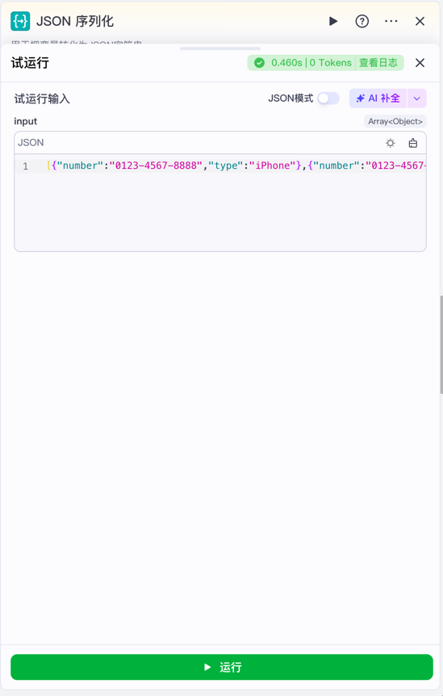
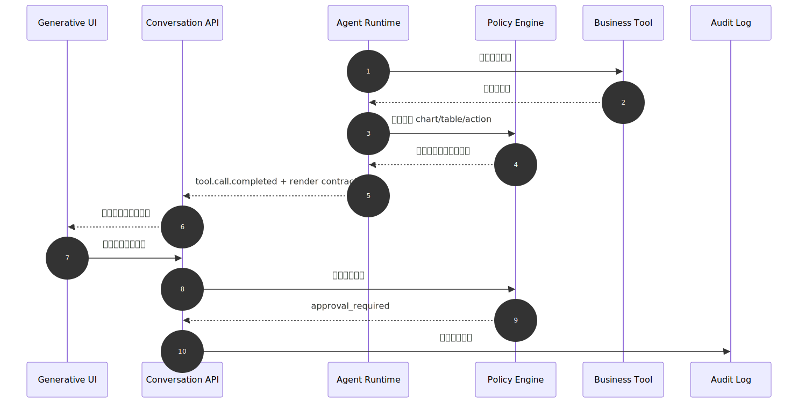

# Ch.48 Generative UI 与富交互

> **状态**：v0.3 初稿
> **本章目标**：读者学完后，能够判断企业 DataAgent 什么时候需要 Generative UI，并设计一套受控渲染契约，让工具调用结果以图表、表格、表单、Artifact 和审批卡片安全呈现。
> **关键议题**：任务化交互界面；工具调用渲染模式；Artifacts 与可编辑产物；业务控件与数据可视化；UI 安全与审批流程
> **前置阅读**：Ch.23 Tool Registry & Function Calling / Ch.30 Human-in-the-loop 与长任务 / Ch.36 数据分析、可视化与报告 / Ch.47 对话 UI 与流式输出
> **估计阅读**：L1 15 min / L1+L2 45 min / 全章 90 min
> **mini-platform 关联**：`mini-platform/console/`、`mini-platform/core/registry/`、`mini-platform/core/policy/`、`mini-platform/core/observability/`
> **实战项目**：`mini-platform/projects/16-generative-ui-dataagent/`（计划项目）。Project 16 将在后续实战阶段补齐，本章先聚焦组件白名单、渲染契约和安全边界。
> **按角色推荐阅读层**：CTO -> L1+L2；架构师 -> L1+L2；工程师 -> L1+L2+L3

企业第一次做 DataAgent 工作台时，常常把“富交互”理解成让模型多输出几张图、多生成几段 HTML。这个方向很危险。图表如果没有指标口径，表格如果没有字段权限，按钮如果绕过审批，Artifact 如果覆盖证据链，界面越丰富，事故越难复盘。

一个零售企业的 ChatBI 原型很容易暴露这类问题。零售负责人问“华东区本月毛利异常来自哪些 SKU”，原型返回一段文字和一张柱状图。试点一周后，业务团队提出更多要求：区域经理要筛选门店和品类；财务要把异常分析保存成月度经营说明；数据治理团队要回放 SQL、指标口径、审批记录和导出动作；安全团队要求敏感字段不能因为模型“画表格”而泄漏。对话框开始变成工作台，模型输出不再只是回答，而是在生成可操作的界面。

从业界产品看，Generative UI 正在从“模型生成页面”转向“Agent 选择受控组件”。这里不是重新画一张和 Ch.47 无关的行业地图，而是把同一批 Agent UI 技术换到富交互视角下观察：Ch.47 关注消息流、会话组件、工具进度和前端协议，Ch.48 关注这些能力怎样继续落到图表、表格、表单、Artifact 和审批卡片。Vercel AI SDK、CopilotKit、AG-UI 仍然重要，但本章不再讨论“怎样把流输出到前端”，而是讨论“流里的工具结果怎样被约束成可操作界面”。

可以把 Ch.47 的对话 UI 能力递进到五类 Generative UI 能力。

**表 48-1：从对话 UI 到 Generative UI 的能力递进**

| Ch.47 已具备的能力 | 业界代表 | Ch.48 需要补上的富交互能力 | 企业落地边界 |
|---|---|---|---|
| 流式消息和工具进度 | Vercel AI SDK | 将工具结果映射为图表、表格、表单等白名单组件 | 不能只把 JSON 交给 React 渲染，还要绑定字段权限、数据引用和审计 |
| 生产级对话组件 | assistant-ui | 在消息流旁承载可折叠工具卡片、引用面板和操作入口 | 对话组件解决基础交互，不负责业务组件注册、审批和证据链 |
| 应用内 Copilot 与共享状态 | CopilotKit | 让 Agent 读写业务页面状态，并触发表单、筛选器和人在回路卡片 | 组件动作必须和业务系统权限、租户边界、审批策略绑定 |
| Agent 与前端事件协议 | AG-UI | 用事件表达 UI patch、工具渲染、共享状态和 interrupts | 协议只能统一交互语义，企业仍要定义组件白名单、策略和观测字段 |
| 对话旁独立工作区 | Claude Artifacts / OpenAI Apps SDK | 把报告、图表组合、MCP 工具组件做成可编辑、可保存的产物空间 | 需要版本、协作、数据来源、组件安全和访问控制治理 |

这张表说明，Generative UI 的价值不是“让界面看起来更智能”，也不是替代 Ch.47 的对话 UI，而是把对话流里的工具过程、业务对象、审批判断和可编辑产物变成用户可以验证、调整、确认和复用的工作界面。本章沿着五个问题展开：任务化界面到底生成什么，工具调用如何映射为受控组件，Artifact 如何管理生命周期，业务控件和可视化怎样避免误导，最后如何把 UI 安全和审批流程纳入平台契约。

### 国内企业 Generative UI / DataAgent UI 对比

国内企业 Agent 产品也在从“对话生成答案”转向“对话驱动任务界面”。Ch.47 已经讨论了对话入口、应用模式和流式状态，本章更关注工具和组件如何进入可控界面：腾讯元器把 MCP 插件作为可配置能力接入，阿里云百炼 Model Studio 在创建应用时区分 Agent Application 与 Workflow Application，Coze Studio 则把节点输入、变量和试运行表单做成受控配置面。它们的共同点不是视觉风格，而是把模型能力收敛到工具契约、流程节点、参数表单和运行状态里。

**表 48-2：国内 Generative UI / DataAgent UI 产品对比**

| 产品 / 平台 | UI 侧重点 | Generative UI 表达方式 | 对 DataAgent 工作台的启发 | 企业落地边界 |
|---|---|---|---|---|
| 腾讯元器 | 插件广场、MCP 插件接入、工具配置表单 | 通过 Server name、描述、URL 等字段把外部能力登记为受控工具 | DataAgent 的查询、导出、通知、工单等动作应先进入工具注册表，再映射成 UI 卡片 | MCP 插件接入不等于企业可直接执行，仍要补租户鉴权、动作审批和审计 |
| 阿里云百炼 Model Studio | Agent Application 与 Workflow Application 创建入口 | 通过应用类型区分自主决策型 Agent 与流程编排型应用 | Generative UI 需要先判断任务是“对话中组件”还是“流程工作台”，再决定渲染形态 | 控制台应用类型不能替代内部组件白名单、字段权限和版本治理 |
| 字节 / 火山 Coze Studio | 节点输入、变量表单、试运行和日志 | 通过节点试运行表单表达输入 Schema、运行结果和调试入口 | DataAgent 的表格、图表、表单和审批卡片都应能回到可调试的节点/工具输入输出 | 工作流试运行便于验证，但企业数据接入、权限和证据链仍需平台侧兜底 |

**图 48-1：腾讯元器接入 MCP 插件的配置表单**


图 48-1 来自腾讯元器公开帮助文档中的 MCP 插件接入界面。它对 Generative UI 的启发是：工具能力进入界面前必须先有名称、描述、URL 和高级选项等受控字段。企业 DataAgent 不能让模型临时拼接任意外部调用，而应把工具注册、Schema 校验、权限和渲染组件绑定起来。

**图 48-2：阿里云百炼 Model Studio 的应用类型创建界面**


图 48-2 来自阿里云百炼 Model Studio 官方帮助文档。它在创建阶段区分 Agent Application 和 Workflow Application，说明 Generative UI 不是单一界面形态：自主决策型任务适合对话内组件，流程明确的任务更适合工作流工作台和节点状态回放。

**图 48-3：Coze Studio 单节点试运行表单**



图 48-3 来自 Coze Studio 官方 GitHub wiki 的工作流前端扩展示例。截图展示了 JSON 序列化节点的试运行输入、变量类型和运行按钮，说明企业 Generative UI 应围绕 Schema、表单、运行结果和日志组织调试体验，而不是把工具日志原样塞回对话气泡。

---

## 任务化交互界面

企业 Agent UI 的演进路径通常不是从聊天框跳到“自动生成完整应用”，而是先从任务化交互开始。用户不是为了欣赏模型输出，而是要完成一个业务任务：分析异常、生成报告、提交审批、导出数据、修正字段映射、确认下一步动作。

企业 DataAgent 工作台可以拆成六类任务入口。

**表 48-3：DataAgent 工作台任务入口**

| 任务入口 | 用户真实意图 | Generative UI 承载什么 | 下游系统 |
|---|---|---|---|
| 异常分析 | 找出毛利、库存、履约异常的原因 | 图表、表格、口径说明、钻取入口 | 数据仓库、指标平台、告警系统 |
| 经营报告 | 把分析结果整理成月报或周报 | 可编辑 Artifact、图表引用、版本记录 | 报告系统、文档系统 |
| 参数修正 | 修改时间范围、门店、品类、指标口径 | 筛选器、表单、推荐参数 | Semantic Layer、Tool Registry |
| 审批确认 | 执行导出、下发任务、触发补货建议 | 审批卡片、影响范围、证据列表 | Policy、Workflow、审计系统 |
| 数据核验 | 确认字段映射、异常数据、缺失口径 | 表格、字段解释、质量提示 | 数据治理平台 |
| 协作交接 | 转交给财务、运营或区域负责人 | 评论、任务状态、引用上下文 | 工单、消息系统、任务系统 |

这个分层比“能不能生成酷炫界面”更重要。企业工作台的每一个控件都可能连接工具、权限、数据和审计。图表不是装饰，图表背后有 `data_ref`、指标口径和查询快照；按钮不是普通交互，按钮背后有动作权限、审批策略和 trace；Artifact 不是更大的消息气泡，它是可编辑、可复用、可归档的业务产物。

Generative UI 在企业里应定义为：Agent 在受控协议内选择、填充和编排平台已登记的 UI 组件。它的核心不是让模型写前端代码，而是让工具结果以业务对象的形态进入界面。

## 工具调用渲染模式

Generative UI 的边界必须在 L1 就讲清楚。企业平台不应让模型直接决定 DOM、脚本、下载链接或业务动作，而应让模型输出结构化意图，再由前端和服务端共同校验后渲染白名单组件。

**表 48-4：Generative UI 核心概念与边界**

| 概念 | 定义 | 与相邻概念的区别 |
|---|---|---|
| Generative UI | LLM 或 Agent 根据任务上下文选择并填充受控 UI 组件 | 不等同于模型生成任意前端代码 |
| 工具调用渲染 | 将 Tool Call 的输入、状态和输出映射为卡片、图表、表格或表单 | 不等同于把工具日志原样展示给用户 |
| Artifact | 对话之外的可编辑、可保存、可复用产物，如报告、分析说明、代码或图表组合 | 不等同于消息附件，它有生命周期和版本 |
| 业务控件 | 与业务动作绑定的筛选器、按钮、表单和审批组件 | 不等同于装饰性 UI，它会触发权限和审计 |
| 组件白名单 | 平台允许 Agent 引用的组件类型、字段、版本和动作集合 | 不等同于前端组件库全集，默认应最小化暴露 |
| 审批卡片 | 在高风险动作前展示影响范围、证据和确认入口 | 不等同于普通确认弹窗，它需要留痕和策略绑定 |

工具结果到 UI 的最小链路应是：工具执行产生结构化结果，Runtime 为结果附加权限和证据，Render Contract 决定可渲染组件，前端根据组件白名单和用户权限渲染，用户动作再回到 Policy 和 Observability。任何一步跳过，都会让界面变成安全薄弱点。

企业可以把渲染对象分成五类。

**表 48-5：工具结果可映射的受控渲染对象**

| 渲染对象 | 典型输入 | 用户动作 | 必要控制 |
|---|---|---|---|
| 图表 | 聚合数据、图表规格、指标口径 | 切换维度、钻取、导出图片 | 显示口径、限制维度、保留数据快照 |
| 表格 | 查询结果、字段解释、脱敏状态 | 排序、筛选、复制、下载 | 字段级权限、行数上限、导出审批 |
| 表单 | 工具参数、业务动作参数 | 修改参数、提交任务 | Schema 校验、服务端二次鉴权 |
| Artifact | 报告、方案、代码、长分析 | 编辑、保存、提交审阅、导出 | 版本管理、证据链、协作权限 |
| 审批卡片 | 高风险动作、影响范围、证据列表 | 批准、拒绝、转派、补充意见 | 强制留痕、策略绑定、状态回放 |

这个分类给企业平台划出边界：模型可以建议组件和数据绑定，但不能绕过组件注册表；模型可以建议动作，但不能直接执行高风险动作；模型可以生成报告草稿，但不能覆盖底层证据。

#### 常见误区

1. **把 Generative UI 理解成模型生成 HTML。** 这在原型里很快，在生产里很危险。正确做法是“模型选择组件，平台渲染组件，服务端校验动作”。
2. **认为图表越多越专业。** DataAgent 的 UI 首先要解释口径、来源、时间范围和限制。没有证据链的图表会放大错误结论。
3. **把 Artifact 当成消息附件。** 真正的 Artifact 有版本、权限、导出、协作、审批和审计生命周期。
4. **只在前端隐藏高风险按钮。** 前端隐藏按钮只是体验优化，不能替代服务端策略校验。
5. **忽略旧消息回放。** 组件版本升级后，历史消息和历史 Artifact 仍要可读、可审计、可复现。

---

## Artifacts 与可编辑产物

Generative UI 位于 Tool Registry、Policy、Runtime、Observability 与 Console 的交汇处。后端负责工具执行、权限判断、结果结构化和审计留痕；前端负责按白名单渲染、展示证据链、收集用户确认和反馈。稳定架构不应让模型输出直接进入页面，而应由 Render Gateway 或 Conversation API 把内部事件转换成受控渲染契约。

**图 48-4：Generative UI 在企业 Agent 平台中的位置**



这张图里有三个关键边界。

第一，Tool Registry 返回的是工具能力和结构化结果，不是前端组件。组件选择要经过 Render Contract，避免工具开发者把内部日志、敏感字段或调试参数直接暴露给用户。

第二，Policy 不只管后端工具执行，也要管前端动作。导出、提交审批、转派任务、保存 Artifact、复制明细都属于业务动作，必须和用户、租户、数据范围、风险级别绑定。

第三，Observability 需要记录用户看到的界面状态。只有后端工具 trace 不够，平台还要知道用户看到了哪张图、展开了哪张表、修改了哪个参数、批准了哪个动作。

## 业务控件与数据可视化

企业 Generative UI 的组件划分建议保持克制。组件越多，表达力越强，但越难治理。第一版可以从 `chart`、`table`、`form`、`artifact`、`approval_card` 五类开始。

**表 48-6：Generative UI 组件职责与失败模式**

| 组件 | 职责 | 输入 | 输出 | 失败模式 |
|---|---|---|---|---|
| Render Gateway | 定义工具结果到 UI 组件的映射 | tool name、Schema、result、policy | 渲染契约 | Schema 不匹配、组件缺失 |
| Component Registry | 维护允许 Agent 引用的组件白名单 | component type、版本、权限 | 组件定义 | 版本冲突、越权组件 |
| Chart Renderer | 渲染图表和数据摘要 | 数据集引用、图表规格、口径 | 图表卡片 | 数据过大、图表误导 |
| Table Renderer | 渲染表格、字段说明和脱敏状态 | 行列数据或 `data_ref` | 表格卡片 | 敏感字段暴露、浏览器卡顿 |
| Artifact Workspace | 编辑和保存长产物 | Artifact 文档、证据引用、版本 | 草稿、审阅件、导出件 | 覆盖证据、冲突编辑 |
| Approval Flow | 高风险动作确认和审批 | 动作、影响范围、证据 | 审批状态 | 审批绕过、状态不一致 |
| UI Telemetry Adapter | 记录前端交互和渲染状态 | trace、组件状态、用户动作 | 指标、日志、回放索引 | trace 断链、隐私字段泄漏 |

示例渲染契约如下。它不是已实现 API，而是 Project 16 可采用的接口形态。

```json
{
  "render_id": "render_margin_chart_001",
  "conversation_id": "conv_20260609_001",
  "message_id": "msg_042",
  "tool_call_id": "call_margin_analysis_01",
  "tool_name": "analyze_margin_by_sku",
  "component": "chart",
  "component_version": "1.0",
  "title": "华东区毛利异常 SKU 分布",
  "data_ref": "dataset://retail-demo/margin-analysis/20260609/run_001",
  "spec": {
    "chart_type": "bar",
    "x": "sku_name",
    "y": "gross_margin_delta",
    "color": "category",
    "limit": 20
  },
  "evidence": {
    "metric": "gross_margin_delta",
    "time_range": "2026-06-01/2026-06-09",
    "sql_ref": "sql://trace_abc/query_003"
  },
  "actions": ["drill_down", "export_png"],
  "policy": {
    "mask_fields": ["customer_phone"],
    "requires_approval": false,
    "allowed_roles": ["retail_manager", "finance_analyst"]
  },
  "trace_id": "trace_abc"
}
```

工具结果到受控组件的映射如下。

**图 48-5：工具结果到受控组件的渲染契约**



这里最容易被低估的是 `data_ref`。小表格可以直接随消息返回，大结果必须走引用。`data_ref` 让服务端在用户展开、筛选、导出时重新做权限和脱敏判断，也避免把大量明细塞进消息流和浏览器内存。

#### Artifact 生命周期与工作区

Artifact 的生命周期建议独立于消息生命周期。消息是交流记录，Artifact 是业务产物。一次对话可以生成多个 Artifact，一个 Artifact 可以被后续对话继续引用，也可以进入审批、导出、归档或废弃流程。

**图 48-6：Artifact 生命周期状态机**



经营分析 Artifact 至少要记录四类信息。

**表 48-7：经营分析 Artifact 必需记录**

| Artifact 信息 | 示例 | 为什么需要 |
|---|---|---|
| 正文块 | 经营说明、异常原因、行动建议 | 支持用户编辑和协作 |
| 证据块 | SQL、图表参数、指标口径、数据快照 | 支持审计和复现 |
| 编辑记录 | 模型生成、用户修改、审批意见 | 区分机器建议与人工判断 |
| 状态记录 | draft、reviewing、approved、exported、archived | 支持工作流和追责 |

可编辑产物不应覆盖原始证据。DataAgent 生成的经营分析报告可以允许用户修改措辞，但 SQL、指标口径、数据快照和图表生成参数必须作为证据链保留。这样既支持业务润色，也保证审计时能回到当时的事实基础。

## UI 安全与审批流程

工具调用渲染比纯文本回答风险更高，因为它会诱导用户点击按钮、提交表单、导出数据或保存结论。高风险 UI 必须由策略引擎约束，而不是由模型自由决定。

**图 48-7：UI 安全与审批时序**



失败模式与恢复策略如下。

**表 48-8：Generative UI 失败模式与恢复策略**

| 失败模式 | 触发条件 | 恢复策略 |
|---|---|---|
| 组件越权 | 模型请求渲染未授权组件或动作 | 拒绝渲染，降级为安全摘要 |
| Schema 漂移 | 工具输出字段与组件版本不匹配 | 使用版本化契约，前端展示兼容错误 |
| 图表误导 | 模型选择不合适图表或隐藏分母 | 显示图表规格、指标口径和样本范围 |
| 审批绕过 | 前端直接调用业务动作 | 所有动作服务端二次校验，前端只提交意图 |
| Artifact 污染 | 文档内容中的提示注入被写入报告 | 标记生成来源，高风险段落要求人工确认 |
| 数据泄漏 | 表格导出绕过字段脱敏 | 下载走服务端导出任务，按权限重算数据 |
| 旧版本不可回放 | 组件升级后历史消息渲染失败 | 组件版本保留兼容层，必要时降级为静态摘要 |

**图 48-8：模型输出与前端渲染之间的安全边界**



这条安全边界的核心原则是：模型可以表达意图，平台决定是否允许；前端可以呈现入口，服务端决定是否执行；用户可以编辑产物，但证据链不能被覆盖。

#### 设计取舍

**取舍 1：模型生成代码 vs 组件白名单**

**表 48-9：模型生成代码与组件白名单取舍**

| 方案 | 优势 | 代价 | 适用场景 | mini-platform 选择 |
|---|---|---|---|---|
| 模型生成 HTML/JS | 表达力强，原型快 | 安全边界差，审计困难 | 隔离沙箱内的实验 | 不采用 |
| 组件白名单 | 安全可控，便于权限和审计 | 表达力受限，需要维护组件 | 企业生产系统 | 默认 |
| 模型生成配置 | 灵活度适中，可复用组件 | 需要严格 Schema 校验 | 图表、表单、报告模板 | 默认 |

**取舍 2：对话内卡片 vs 独立 Artifact 工作区**

**表 48-10：对话内卡片与独立 Artifact 工作区取舍**

| 方案 | 优势 | 代价 | 适用场景 | mini-platform 选择 |
|---|---|---|---|---|
| 对话内卡片 | 上下文连续，用户理解成本低 | 长产物编辑体验差 | 小图表、短表格、审批提示 | 默认 |
| 独立 Artifact 工作区 | 适合编辑、审阅、导出 | 需要版本和权限系统 | 报告、方案、代码、长分析 | 默认 |
| 外部系统跳转 | 复用已有 BI/ERP 能力 | 上下文割裂，追踪复杂 | 成熟业务系统操作 | 可选 |

**取舍 3：前端直接渲染数据 vs 数据引用渲染**

**表 48-11：前端直接渲染数据与数据引用渲染取舍**

| 方案 | 优势 | 代价 | 适用场景 | mini-platform 选择 |
|---|---|---|---|---|
| 直接携带数据 | 简单，首屏快 | 大数据卡顿，泄漏风险高 | 小型摘要表 | 限量使用 |
| `data_ref` 引用 | 权限可重算，适合大结果 | 多一次数据获取 | 企业数据分析 | 默认 |
| 静态截图 | 兼容性好 | 不可交互，难审计 | 报告归档 | 可选 |

**取舍 4：前端工具调用 vs 后端工具渲染**

**表 48-12：前端工具调用与后端工具渲染取舍**

| 方案 | 优势 | 代价 | 适用场景 | mini-platform 选择 |
|---|---|---|---|---|
| 前端工具调用 | 能直接读应用状态，交互灵活 | 容易越过后端治理 | 低风险 UI 状态切换 | 谨慎使用 |
| 后端工具渲染 | 权限、审计和数据边界清晰 | 交互链路更长 | 数据查询、导出、审批 | 默认 |
| 混合模式 | 体验和治理兼顾 | 契约复杂 | 业务系统内 Copilot | 待评估 |

若后续需要产品界面风格的补充图，可在不替代 Mermaid 架构图的前提下使用如下生成提示：

```text
生成一张企业级 Generative UI DataAgent 工作台界面。左侧为对话任务流，中间为可编辑经营分析 Artifact，右侧为图表、表格、审批卡片和证据链面板。界面应体现组件白名单、安全审批、字段脱敏、版本历史和 trace 留痕。中文标签，严肃企业后台风格，白底，蓝灰主色，不出现真实品牌、真实客户数据、夸张营销文案或装饰性插画。
```

---

<!--
TODO(Project 16): 工程实验：Generative UI DataAgent 工作台

## 工程实验：Generative UI DataAgent 工作台

Project 16 应在 Ch.47 的流式消息协议上增加渲染契约和 Artifact 工作区。本章不新增代码，但建议把工程实验拆成四个阶段。

**表 48-13：Generative UI DataAgent 工作台实验阶段**

| 阶段 | 目标 | 验收结果 |
|---|---|---|
| 阶段一：组件白名单 | 支持 `chart`、`table`、`form`、`artifact`、`approval_card` | 未登记组件自动降级 |
| 阶段二：工具渲染契约 | 将 DataAgent 工具结果映射到受控组件 | 同一 `data_ref` 可驱动文本、图表和表格 |
| 阶段三：Artifact 工作区 | 支持报告草稿、版本、证据引用和提交审阅 | 人工编辑不会覆盖证据链 |
| 阶段四：审批与审计 | 支持导出审批、高风险动作确认、trace 关联 | 每个 UI 动作可回放 |

建议目录结构如下。

```text
mini-platform/projects/16-generative-ui-dataagent/
├── README.md
├── run.sh
├── scenarios/
│   ├── margin_analysis.json
│   ├── export_approval.json
│   └── artifact_report.json
├── configs/
│   └── generative_ui.yaml
├── reports/
│   └── generative_ui_acceptance.md
└── src/
    ├── render_contract.ts
    ├── component_registry.ts
    ├── artifact_store.ts
    ├── approval_policy.ts
    └── replay_trace.ts
```

和平台目录的对应关系如下。

**表 48-14：Generative UI DataAgent 工作台平台路径**

| 能力 | 建议路径 | 说明 |
|---|---|---|
| 工作台页面 | `mini-platform/console/src/app/data-agent/workbench.tsx` | 对话、组件卡片、Artifact 工作区 |
| 组件注册 | `mini-platform/console/src/lib/component-registry.ts` | 管理组件类型、版本和权限 |
| 渲染契约 | `mini-platform/console/src/lib/render-contract.ts` | 校验工具结果到 UI 的映射 |
| Artifact 状态 | `mini-platform/console/src/lib/artifact-store.ts` | 管理草稿、版本和证据引用 |
| 审批组件 | `mini-platform/console/src/components/approval-card/` | 高风险动作确认 |
| 策略服务 | `mini-platform/core/policy/` | 服务端动作鉴权 |
| 工具注册 | `mini-platform/core/registry/` | 工具 Schema 和版本 |

#### 契约、配置与伪代码

前端渲染不应直接信任模型输出。一个可执行的 TypeScript 契约可以从下面开始。

```ts
type RenderComponent = "chart" | "table" | "form" | "artifact" | "approval_card";

interface RenderContract {
  render_id: string;
  conversation_id: string;
  message_id: string;
  tool_call_id: string;
  component: RenderComponent;
  component_version: string;
  data_ref?: string;
  spec: Record<string, unknown>;
  evidence: {
    metric?: string;
    time_range?: string;
    sql_ref?: string;
    source_refs?: string[];
  };
  actions: string[];
  policy: {
    requires_approval: boolean;
    mask_fields: string[];
    allowed_roles: string[];
  };
  trace_id: string;
}

function renderToolResult(contract: RenderContract, currentUser: User) {
  assertComponentAllowed(contract.component, contract.component_version);
  assertActionsAllowed(contract.actions, currentUser.roles);
  assertEvidenceVisible(contract.evidence, currentUser);

  if (contract.policy.requires_approval) {
    return <ApprovalCard contract={contract} />;
  }

  return componentRegistry.render(contract.component, contract);
}
```

配置文件不只写组件名，还要写清楚动作、字段、版本和默认数据策略。

```yaml
console:
  generative_ui:
    allowed_components:
      chart: ["1.0"]
      table: ["1.0"]
      form: ["1.0"]
      artifact: ["1.0"]
      approval_card: ["1.0"]
    blocked_actions:
      - raw_html
      - inline_script
      - direct_download
    default_data_strategy: data_ref
    max_inline_rows: 100
  artifact:
    require_evidence_blocks: true
    keep_version_history: true
    allow_export_formats: ["markdown", "pdf"]
  approval:
    export_threshold_rows: 1000
    sensitive_fields_require_approval: true
    require_server_side_policy_check: true
```

运行方式设计如下。

```bash
cd mini-platform/projects/16-generative-ui-dataagent
./run.sh --scenario margin_analysis
./run.sh --scenario artifact_report
./run.sh --scenario export_approval
```

验收报告应同时输出功能结果和治理结果。

```markdown
# Generative UI Acceptance Report

## Scenario
- scenario_id: margin_analysis
- conversation_id: conv_20260609_001
- trace_id: trace_abc

## Rendering
- rendered_components: chart/table/artifact
- rejected_components: raw_html
- data_strategy: data_ref

## Policy
- masked_fields: customer_phone
- approval_required: false
- server_policy_check: passed

## Evidence
- sql_ref: sql://trace_abc/query_003
- metric: gross_margin_delta
- data_snapshot: dataset://retail-demo/margin-analysis/20260609/run_001

## Failures
- unknown_component_fallback: passed
- old_message_replay: passed
```

#### 生产化 checklist

- [ ] 权限：组件、动作、字段、数据引用都经过服务端策略校验。
- [ ] 审计：Artifact 创建、编辑、提交、审批、导出都有版本和操作者记录。
- [ ] 成本：长 Artifact 生成和图表重算有配额、缓存和取消能力。
- [ ] 性能：大表格走 `data_ref`、分页和虚拟滚动，避免消息流携带全量数据。
- [ ] 稳定性：组件版本向后兼容，旧消息可按旧契约回放。
- [ ] 可观测性：每个 UI 动作能追溯到工具调用、策略判断和用户确认。
- [ ] 安全：禁用原始 HTML 和内联脚本，下载、复制和外链跳转走服务端策略。
- [ ] 灾难恢复：Artifact 自动保存草稿，审批中断后能恢复到上一版本。

#### 踩坑记录

**踩坑 1：模型请求渲染不存在的组件**

- 现象：前端收到 `component: "heatmap_plus"` 后白屏。
- 根因：工具结果没有经过组件注册表校验。
- 修复：服务端生成前注入可用组件清单，前端仍执行白名单校验，未知组件降级为安全摘要。

**踩坑 2：图表结论和表格数据不一致**

- 现象：消息中说“华东区异常最高”，但图表排序显示华南最高。
- 根因：文本回答和图表分别基于两次查询结果。
- 修复：同一次工具调用生成 `data_ref`，文本、图表、表格均引用同一快照。

**踩坑 3：审批按钮被前端隐藏后仍可调用接口**

- 现象：无权限用户通过浏览器请求直接触发导出任务。
- 根因：只在前端隐藏按钮，后端没有二次鉴权。
- 修复：所有高风险动作在服务端执行策略校验，前端显示仅作为体验优化。

**踩坑 4：Artifact 编辑覆盖了证据链**

- 现象：用户修改报告后，审计人员无法判断哪些结论来自模型、哪些来自人工。
- 根因：Artifact 文档没有区分生成内容、人工编辑和证据引用。
- 修复：使用版本化块结构，记录每个块的来源、编辑者、时间和引用的数据快照。

**踩坑 5：组件升级导致历史消息不可读**

- 现象：`chart@2.0` 上线后，旧消息中的 `chart@1.0` 渲染失败。
- 根因：前端只保留最新组件实现，没有旧契约兼容层。
- 修复：组件注册表保留版本适配器；无法渲染时降级为静态摘要和原始证据链接。

-->

---

## 本章小结

### 关键结论

1. Generative UI 的生产化路径是受控组件渲染，不是任意代码生成。
2. 工具调用结果应先结构化，再映射为图表、表格、表单、Artifact 和审批卡片。
3. Artifact 是业务产物，不是消息附件；它需要版本、权限、导出和审计生命周期。
4. 高风险 UI 动作必须服务端二次校验，前端不能成为唯一安全边界。
5. 企业平台要沉淀自己的渲染契约、组件白名单、数据引用和 UI 观测模型。

### 上线检查清单

- [ ] 能上线吗？组件白名单、Schema 校验、服务端审批和字段脱敏已启用。
- [ ] 能扩展吗？新增组件有版本管理，旧消息和旧 Artifact 可回放。
- [ ] 能治理吗？工具结果、渲染契约、用户编辑和审批动作均可追溯。

### 延伸阅读

- 官方文档：[Vercel AI SDK](https://ai-sdk.dev/docs/introduction)
- 官方文档：[Vercel AI SDK Generative User Interfaces](https://ai-sdk.dev/docs/ai-sdk-ui/generative-user-interfaces)
- 官方文档：[CopilotKit Generative UI](https://docs.copilotkit.ai/built-in-agent/concepts/generative-ui-overview)
- 官方文档：[CopilotKit Human-in-the-Loop](https://docs.copilotkit.ai/human-in-the-loop)
- 官方文档：[AG-UI Overview](https://docs.ag-ui.com/introduction)
- 官方文档：[AG-UI Interrupts](https://docs.ag-ui.com/concepts/interrupts)
- 官方文档：[OpenAI Apps SDK](https://developers.openai.com/apps-sdk)
- 官方介绍：[Claude Artifacts](https://www.claude.com/blog/artifacts)
- 对标产品：[腾讯元器：接入 MCP 插件](https://yuanqi.tencent.com/guide/plugin-market-integrate-mcp-plugin)
- 对标产品：[阿里云百炼 Model Studio：Agent application](https://www.alibabacloud.com/help/en/model-studio/single-agent-application)
- 对标产品：[Coze Studio：Add new workflow node types](https://github.com/coze-dev/coze-studio/wiki/10.-Add-new-workflow-node-types-(frontend))
- 相关章节：Ch.23、Ch.30、Ch.36、Ch.47、Ch.49、Ch.50
