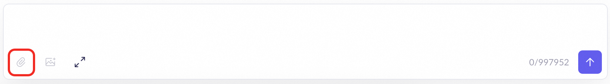
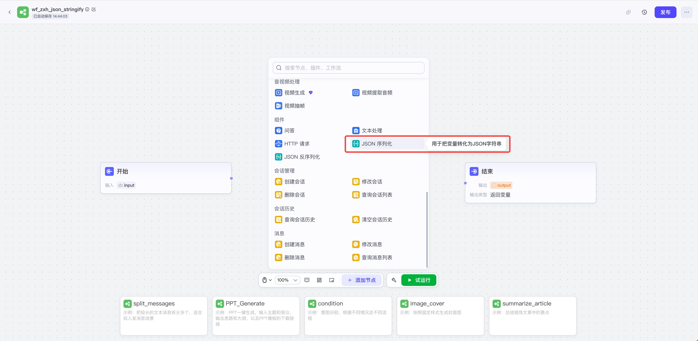
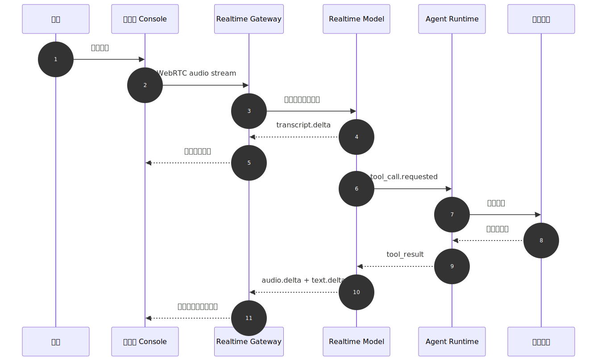

# Ch.49 多模态输入与语音 Agent

> **状态**：v0.3 初稿
> **本章目标**：读者学完后，能够为企业 Agent 设计文件、图像、语音输入的产品边界、实时链路、权限审计和降级策略，并判断哪些场景适合异步解析，哪些场景适合实时语音会话。
> **关键议题**：多模态输入产品边界；文件上传与异步解析；语音 Agent 架构；实时语音交互控制；多模态权限与审计留痕
> **前置阅读**：Ch.19 文档解析与多模态 OCR / Ch.22 Agent Runtime / Ch.47 对话 UI 与流式输出 / Ch.48 Generative UI 与富交互
> **估计阅读**：L1 15 min / L1+L2 45 min / 全章 90 min
> **mini-platform 关联**：`mini-platform/console/`、`mini-platform/tools/doc_parser/`、`mini-platform/core/policy/`、`mini-platform/core/observability/`
> **实战项目**：`mini-platform/projects/16-generative-ui-dataagent/`（计划项目）。Project 16 将在后续实战阶段补齐，本章先聚焦多模态输入边界、实时会话事件和权限审计。
> **按角色推荐阅读层**：CTO -> L1+L2；架构师 -> L1+L2；工程师 -> L1+L2+L3

企业做多模态 Agent 时，最容易把问题想简单：支持上传文件、接入语音识别、播放语音回答，就算完成多模态。真正进入业务现场后，风险会很快出现。文件可能包含跨租户数据，图片可能拍到工牌和客户信息，Excel 可能有合并单元格导致字段错位，语音转写可能漏掉否定词，实时链路可能在用户打断后继续播放旧回答。

企业业务人员不会只用文字提问。门店经理可能上传货架照片，询问“这组陈列是否符合促销标准”；财务人员可能上传 Excel，要求解释异常波动；售后主管可能把客户电话录音交给 Agent 总结投诉原因；高管则希望直接用语音追问经营指标。多模态输入把 Agent 从“文本问答”推进到“业务现场入口”，同时也把权限、质量、延迟和审计风险前移到输入阶段。

如果说 Ch.47 解决“输出怎样连续到达前端”，Ch.48 解决“输出怎样变成可操作界面”，那么 Ch.49 解决的是“非文本输入怎样安全进入上下文”。因此，本章开头不再按 UI 框架或组件路线划分，而是按输入治理和媒体链路划分：文件、图片、录音先上传，进入解析队列，产出结构化文本、版面、表格、元数据和引用，再交给 Agent 使用；浏览器或客户端通过 WebRTC、WebSocket 等链路与模型实时交换音频、转写、工具调用和控制事件，适合语音助手、客服坐席和现场作业。OpenAI Realtime 文档明确区分浏览器端 WebRTC、服务端 WebSocket 和 SIP 等连接方式；MDN 的 WebRTC 与 WebSocket 文档也说明了媒体传输和双向事件通道的不同定位。企业平台不需要把所有输入都实时化，也不应该把所有文件都直接塞进模型上下文。

可以把多模态输入能力拆成四层。

**表 49-1：多模态输入与实时媒体链路能力分层**

| 能力层 | 代表能力 | 解决什么问题 | 企业落地边界 |
|---|---|---|---|
| 异步文件解析层 | 文档解析、OCR、表格抽取、对象存储任务 | 将文件变成可引用、可审计的上下文 | 要补病毒扫描、权限、保留周期和质量报告 |
| 实时媒体会话层 | OpenAI Realtime、浏览器 WebRTC | 支持低延迟语音、转写、打断、工具调用 | 要补临时凭证、会话控制、敏感动作确认 |
| 语音能力编排层 | ASR、TTS、录音上传 | 支持录音分析、转写摘要、语音播报 | 不等同于语音 Agent，仍需轮次、工具和确认治理 |
| 浏览器采集与传输层 | getUserMedia、WebRTC、WebSocket | 让前端采集音频并建立实时链路 | 要处理授权、降级、网络抖动和隐私提示 |

这张表给企业的启发是：多模态不是“模型能力开关”，也不是 Ch.47/Ch.48 的又一组前端框架选择，而是一组输入治理、媒体链路、上下文引用和审计机制。本章沿着五个问题展开：多模态输入边界如何划定，文件上传为什么默认异步解析，语音 Agent 架构如何拆分，实时语音怎样处理打断和确认，多模态权限与审计怎样落到工程契约。

### 国内多模态 / 语音 Agent UI 对比

国内通用 Agent 和 DataAgent 平台在多模态入口上也呈现出分层趋势：文件和图片通常先作为受控附件进入对话，复杂文档要经过解析和切片治理，音视频能力更适合交给独立节点或实时会话控制。腾讯元器的知识库界面已经把 PDF 原文、解析切片和人工管理放到同一页；阿里云百炼 Model Studio 在 Agent 对话中呈现附件上传，同时在模型选择中区分图像理解、视频理解等能力；Coze Studio 则通过工作流节点把音视频处理、HTTP 请求、文本处理等能力放到画布中。对企业平台来说，关键不是“入口越多越好”，而是每一种输入都必须可授权、可解析、可确认、可审计。

**表 49-2：国内多模态 / 语音 Agent UI 产品对比**

| 产品 / 平台 | UI 侧重点 | 多模态入口 | 对 DataAgent 的启发 | 企业落地边界 |
|---|---|---|---|---|
| 腾讯元器 | 知识库文档管理、原文预览和解析切片 | PDF、网页等资料进入知识库后被解析为可管理切片 | 多模态输入不能只看上传入口，还要展示解析质量、切片边界和人工修正点 | 企业仍要补文件权限、知识来源审计和数据域隔离 |
| 阿里云百炼 Model Studio | Agent 对话输入、模型选择和多模态能力配置 | 对话输入区支持附件，模型选择区区分图像理解、视频理解等能力 | DataAgent 应把附件入口、模型能力和解析状态绑定，避免用户以为上传后立刻成为可信上下文 | 文件解析、字段脱敏、保留周期和导出审批仍需平台治理 |
| 字节 / 火山 Coze Studio | 工作流画布、节点面板、音视频处理和试运行 | 音频、视频、文本、HTTP、会话等能力通过节点进入流程 | 语音和文件输入可映射为工作流节点，并把节点状态回写到消息流 | 画布编排不能替代租户权限、敏感字段检测和审计留痕 |

**图 49-1：腾讯元器知识库文档解析切片管理界面**


图 49-1 来自腾讯元器公开帮助文档中的知识库解析切片界面。它展示了 PDF 原文、切片列表和管理入口，说明企业多模态能力不能停留在“上传文件”按钮上。文件进入 Agent 上下文前，还要经过解析、切分、质量判断和人工干预，最终以 `context_ref` 或知识切片引用进入后续推理。

**图 49-2：阿里云百炼 Model Studio 对话输入区的附件入口**



图 49-2 来自阿里云百炼 Model Studio 官方帮助文档。它展示了 Agent 对话输入区中的附件入口，说明多模态能力首先表现为用户输入方式的扩展。但对企业 DataAgent 来说，附件按钮背后必须接上传任务、解析质量、权限判断和 `context_ref`，不能把原始文件直接交给模型。

**图 49-3：Coze Studio 工作流画布中的音视频与工具节点面板**



图 49-3 来自 Coze Studio 官方 GitHub wiki 的工作流前端扩展示例。节点面板中包含视频生成、视频提取音频、视频抽帧、HTTP 请求、文本处理和会话管理等能力，说明多模态 Agent UI 需要把输入、处理、工具调用和运行状态拆成可组合节点，而不是把所有逻辑藏在一段语音或文件上传之后。

---

## 多模态输入产品边界

企业多模态 Agent 的第一原则是边界清晰。文件上传不等同于知识库入库，图片识别不等同于事实确认，语音转写不等同于用户最终意图。每一种输入都需要经过解析、权限、质量评估、用户确认和审计留痕。否则，系统会把低质量 OCR、错误转写或越权文件当成可信上下文，后续工具调用也会被污染。

企业可以先把输入场景按风险和处理方式分层。

**表 49-3：企业多模态输入场景分层**

| 输入场景 | 真实输入 | Agent 需要什么 | 默认处理方式 | 平台要求 |
|---|---|---|---|---|
| 经营分析附件 | Excel、CSV、PDF 报告 | 表格结构、指标口径、字段类型 | 异步解析 | 格式校验、字段脱敏、质量报告 |
| 现场图片 | 货架、设备、票据、截图 | 图像说明、OCR 文本、区域引用 | 异步解析 + 可选视觉理解 | PII 检测、图片权限、人工确认 |
| 客服录音 | 电话录音、会议录音 | 转写、说话人、时间戳、摘要 | 异步 ASR | 保留周期、客户隐私、转写置信度 |
| 实时语音问答 | 麦克风音频 | 转写增量、用户打断、工具确认 | WebRTC 实时会话 | 临时凭证、VAD、降级和审计 |
| 移动现场作业 | 语音 + 图片 + 表单 | 现场证据、任务状态、确认动作 | 混合模式 | 离线重试、权限缓存、风险确认 |

这个分层比“支持多少模态”更重要。低风险附件可以异步解析后进入上下文引用；高风险文件必须先过扫描和权限；实时语音适合短轮次、多打断的场景；录音分析适合异步处理，不需要强行做实时。

#### 核心概念与边界

文件上传建议采用“对象存储 + 解析任务 + 上下文引用”模式。前端只负责上传和展示任务状态，Agent 不直接读取原始文件，而是读取解析后的安全引用。这样可以控制文件大小、格式、病毒扫描、权限、脱敏、重试和审计。

**表 49-4：多模态输入核心概念与边界**

| 概念 | 定义 | 与相邻概念的区别 |
|---|---|---|
| 多模态输入 | 文本之外的文件、图像、音频、视频等输入 | 不等同于多模态模型，平台也可用解析器和单模态模型组合实现 |
| 异步解析 | 上传后由后台任务解析文件，并逐步返回状态和结果 | 不等同于同步上传即问，适合大文件和复杂版面 |
| Context Ref | 指向解析后安全上下文的引用 | 不等同于原始文件 URL，它带权限、版本和质量信息 |
| ASR | 自动语音识别，将音频转为文本 | 不等同于语义理解，转写后仍需意图识别和确认 |
| TTS | 文本转语音，将文字回答合成为音频 | 不等同于语音 Agent，后者还需要打断、轮次和工具控制 |
| VAD | 语音活动检测，用于判断用户何时开始或停止说话 | 不等同于唤醒词，VAD 解决实时轮次切分 |
| WebRTC | 浏览器实时音视频通信技术，适合低延迟语音交互 | 比 WebSocket 更贴近媒体传输和网络自适应 |
| Realtime Session | 低延迟多模态会话，持续交换音频、文本、工具调用等事件 | 不等同于普通 HTTP 请求，它有会话状态、临时凭证和实时控制 |

文件解析完成后，Agent 消费的是 `context_ref`，而不是文件路径。`context_ref` 至少要包含租户、权限、来源、解析版本、质量评分和保留策略。这样业务方追问“这份分析用了哪张表”“这段转写来自哪段录音”“这张图片是否已脱敏”时，平台可以回放。

#### 常见误区

1. **上传文件后就能直接问。** 企业系统需要先做格式检查、病毒扫描、解析质量评估、权限确认和引用登记。
2. **语音 Agent 只是 ASR 加 TTS。** 真正的语音 Agent 要处理打断、半双工/全双工、噪声、延迟、轮次、工具调用和审计。
3. **实时一定比异步高级。** 录音分析、复杂表格解析、票据识别更适合异步任务；强行实时化会牺牲质量和可审计性。
4. **多模态模型可以替代数据治理。** 模型可以理解图片和文件，但权限、来源、字段脱敏和证据链仍由平台负责。
5. **转写文本就是最终意图。** ASR 可能漏词、错词、混淆说话人，高风险工具调用必须展示文本化意图并由用户确认。

---

## 文件上传与异步解析

多模态输入层位于前端 Console 与 Agent Runtime 之间，既连接文件解析工具，也连接实时媒体服务。它的输出不应是“原始文件”或“原始音频”，而应是带权限、来源和质量标记的上下文引用。

**图 49-4：多模态输入层在企业 Agent 平台中的位置**



这张图里有三个边界。

第一，上传入口和 Agent Runtime 解耦。文件先进入对象存储和解析任务，解析结果通过 Context Store 暴露给 Runtime，避免模型直接读取未经治理的原始文件。

第二，实时媒体和业务动作解耦。语音链路负责采集、传输、转写、播放和打断，业务动作仍要经过 Tool Registry 和 Policy。

第三，多模态输入也要接入 Observability。上传失败、解析警告、转写置信度、用户修正、打断、确认和工具调用都要进入同一条 trace。

#### 文件上传与异步解析流水线

文件上传的工程链路应围绕“可重试、可降级、可审计”设计，而不是围绕“上传后马上问”设计。

**图 49-5：文件上传与异步解析流水线**



组件划分如下。

**表 49-5：文件上传与异步解析组件职责**

| 组件 | 职责 | 输入 | 输出 | 失败模式 |
|---|---|---|---|---|
| Upload API | 接收文件并创建解析任务 | 文件、元数据、权限上下文 | `upload_id`、`task_id` | 文件过大、格式不支持 |
| Object Store | 保存原始文件或受控副本 | 文件流、保留策略 | 对象引用 | 留存过长、跨租户访问 |
| Parser Worker | 执行 OCR、表格抽取、ASR、版面解析 | 对象存储引用 | `context_ref`、质量报告 | 解析失败、质量过低 |
| Context Store | 保存解析结果、引用和证据链 | 解析片段、元数据 | 可检索上下文引用 | 引用过期、权限变更 |
| Quality Gate | 判断解析结果能否进入 Agent 上下文 | 置信度、警告、字段映射 | allow / confirm / reject | 低质量内容误入上下文 |
| Audit Adapter | 记录上传、解析、删除和消费 | trace、用户、资源 | 审计记录 | trace 断链、敏感字段泄漏 |

文件上传契约示例：

```http
POST /api/multimodal/uploads
Content-Type: multipart/form-data

Request:
file=@margin_report.xlsx
metadata={"tenant_id":"retail-demo","purpose":"data_agent_context","conversation_id":"conv_001"}

Response:
{
  "upload_id": "upl_001",
  "parse_task_id": "parse_001",
  "status": "queued",
  "max_wait_seconds": 300,
  "trace_id": "trace_mm_001"
}
```

解析状态事件示例：

```json
{
  "type": "parse.completed",
  "parse_task_id": "parse_001",
  "context_ref": "context://retail-demo/parse_001",
  "quality": {
    "ocr_confidence": 0.94,
    "table_count": 3,
    "warnings": ["merged_cells_detected"]
  },
  "audit": {
    "source_file_hash": "sha256:...",
    "retention_policy": "tenant_default",
    "trace_id": "trace_mm_001"
  }
}
```

这份契约的重点不是字段名，而是工程原则：原始文件、解析结果、上下文引用和 Agent 会话必须能串起来；低质量解析不能静默进入上下文；保留周期和删除策略要在上传时写入。

## 语音 Agent 架构

语音 Agent 的链路可拆成六段：采集、传输、转写、理解、行动、合成。浏览器端默认使用 WebRTC 建立低延迟音频链路；服务端后台任务或非浏览器客户端可使用 WebSocket。实时语音并不意味着所有逻辑都实时执行，敏感工具调用仍应暂停并进入确认流程。

**图 49-6：语音 Agent 实时交互时序**



## 实时语音交互控制

实时语音事件至少要覆盖以下类型。

**表 49-6：实时语音会话事件契约**

| 事件 | 触发时机 | 前端动作 | 后端动作 |
|---|---|---|---|
| `session.created` | 临时凭证创建后 | 准备连接媒体通道 | 绑定用户、租户和 trace |
| `audio.input.started` | VAD 检测到用户说话 | 显示聆听状态 | 开始接收音频帧 |
| `transcript.delta` | ASR 产生增量转写 | 展示实时字幕 | 累积轮次文本 |
| `response.audio.delta` | 模型或 TTS 产生音频 | 加入播放队列 | 记录 response_id |
| `tool.approval_required` | 触发高风险动作 | 暂停播放并展示审批卡 | 等待用户确认 |
| `response.cancelled` | 用户打断或取消 | 清空旧音频队列 | 取消当前 response |
| `session.closed` | 会话结束或超时 | 释放麦克风和播放器 | 关闭会话并落审计 |

实时会话事件示例：

```json
{
  "session_id": "rt_001",
  "type": "transcript.delta",
  "seq": 23,
  "payload": {
    "text_delta": "华东区本月",
    "speaker": "user",
    "is_final": false
  },
  "trace_id": "trace_voice_001"
}
```

语音 Agent 的工程难点不是“能不能听到声音”，而是轮次控制。用户打断时，前端要停止本地播放，服务端要取消当前 response，后续到达的旧音频和旧工具事件要按 `response_id` 丢弃。否则用户已经进入下一轮问题，系统还在播上一轮回答。

## 多模态权限与审计留痕

多模态输入把风险前移到“输入阶段”。文件可能包含敏感字段，图片可能包含人脸或工牌，录音可能包含客户隐私。平台必须在 Agent 使用这些内容之前完成权限判断和最小化暴露。

**图 49-7：多模态输入治理状态机**



失败模式与恢复策略如下。

**表 49-7：多模态输入失败模式与恢复策略**

| 失败模式 | 触发条件 | 恢复策略 |
|---|---|---|
| 解析质量低 | OCR 置信度低、表格结构不完整 | 要求用户确认关键字段，或改走人工校验 |
| 文件越权 | 用户上传不属于当前租户或项目的文件 | 拒绝进入上下文，记录安全事件 |
| 图片泄漏隐私 | 图片包含人脸、工牌、客户姓名 | 脱敏、裁剪或禁止进入上下文 |
| 语音误识别 | 噪声、口音、多人说话导致转写错误 | 展示实时转写，敏感动作前要求用户确认文本意图 |
| 实时延迟过高 | 网络抖动、模型响应慢 | 降级为按键发言、文本输入或录音上传 |
| 打断失效 | 模型仍在播放旧回答 | 前端停止播放，服务端取消当前 response，丢弃旧音频事件 |
| 审计缺失 | 音频、文件、工具调用没有统一 trace | 会话创建时生成 trace，所有输入引用和工具调用继承 trace |

**图 49-8：实时语音控制链路**



审计记录至少要回答五个问题：谁上传或说了什么，系统如何解析，哪些内容进入了 Agent 上下文，触发了哪些工具，用户确认了哪些高风险动作。缺少这些记录，多模态 Agent 会比文本 Agent 更难追责，因为原始输入通常更复杂、更敏感、也更难人工快速复核。

#### 设计取舍

**取舍 1：异步解析 vs 同步问答**

**表 49-8：异步解析与同步问答取舍**

| 方案 | 优势 | 代价 | 适用场景 | mini-platform 选择 |
|---|---|---|---|---|
| 异步解析 | 可处理大文件，便于扫描、重试和审计 | 用户需要等待任务状态 | 企业文件、表格、录音 | 默认 |
| 同步问答 | 体验直接，原型简单 | 超时和失败率高，治理弱 | 小图片、小文本附件 | 限量使用 |
| 预入库 | 检索效率高，可复用 | 入库治理成本高 | 稳定知识库 | 由 Ch.20/Ch.19 负责 |

**取舍 2：WebRTC vs WebSocket vs 录音上传**

**表 49-9：WebRTC、WebSocket 与录音上传取舍**

| 方案 | 优势 | 代价 | 适用场景 | mini-platform 选择 |
|---|---|---|---|---|
| WebRTC | 低延迟、适合浏览器音频、网络自适应好 | 调试和服务端接入复杂 | 浏览器实时语音 Agent | 默认 |
| WebSocket | 协议简单，适合服务端到服务端事件 | 媒体处理能力弱于 WebRTC | 后台录音处理、非浏览器客户端 | 可选 |
| 录音上传 | 实现最简单，可离线处理 | 不支持实时打断 | 会议纪要、客服录音分析 | 可选 |

**取舍 3：直接多模态模型 vs 解析器流水线**

**表 49-10：直接多模态模型与解析器流水线取舍**

| 方案 | 优势 | 代价 | 适用场景 | mini-platform 选择 |
|---|---|---|---|---|
| 直接多模态模型 | 能处理复杂视觉语义 | 成本高，证据结构弱 | 图片理解、现场检查 | 可选 |
| 解析器流水线 | 结构化强，便于审计和检索 | 对复杂图像语义较弱 | 文档、表格、票据、录音 | 默认 |
| 混合模式 | 兼顾语义和结构 | 编排复杂 | 高价值流程 | 待评估 |

**取舍 4：保存原始音频 vs 只保存转写**

**表 49-11：原始音频与转写留存取舍**

| 方案 | 优势 | 代价 | 适用场景 | mini-platform 选择 |
|---|---|---|---|---|
| 保存原始音频 | 便于复核和质检 | 隐私和存储风险高 | 客服质检、合规留存 | 按租户策略 |
| 只保存转写 | 风险和成本较低 | 误识别难复核 | 普通语音助手 | 默认 |
| 保存摘要和确认记录 | 最小化留存 | 难做完整争议复盘 | 低风险内部助手 | 可选 |

若后续需要产品界面风格的补充图，可在不替代 Mermaid 架构图的前提下使用如下生成提示：

```text
生成一张企业多模态 Agent 控制台界面。界面包含文件上传解析任务、实时语音转写、语音播放控制、权限审计面板和 DataAgent 回答区。视觉风格为严肃企业后台，强调低延迟语音链路、文件解析质量、敏感字段脱敏、用户确认和 trace 留痕。中文标签，白底，蓝灰主色，不包含真实品牌、真实个人信息或夸张营销风格。
```

---

<!--
TODO(Project 16): 工程实验：语音与文件输入扩展

## 工程实验：语音与文件输入扩展

Project 16 在 Ch.47/Ch.48 的基础上扩展多模态输入。实验目标不是一次性实现完整语音平台，而是验证三件事：文件能否以安全引用进入 DataAgent，会话能否用 WebRTC 或 WebSocket 承载实时语音事件，高风险工具能否在转写后进入审批确认。

建议实验阶段如下。

**表 49-12：语音与文件输入扩展实验阶段**

| 阶段 | 目标 | 验收结果 |
|---|---|---|
| 阶段一：文件上传 | 上传 Excel/PDF/图片并创建解析任务 | 得到 `upload_id` 和 `parse_task_id` |
| 阶段二：异步解析 | 生成 `context_ref`、质量报告和审计记录 | 低质量解析触发确认 |
| 阶段三：实时语音 | 建立会话、展示转写增量、播放回答 | 可打断、可取消、可降级 |
| 阶段四：敏感动作确认 | 语音触发导出或审批时暂停 | 用户确认后才调用工具 |
| 阶段五：统一回放 | 文件、转写、工具和 UI 动作继承 trace | 验收报告可复盘 |

建议目录结构如下。

```text
mini-platform/projects/16-generative-ui-dataagent/
├── README.md
├── run.sh
├── scenarios/
│   ├── upload_margin_report.json
│   ├── realtime_voice_query.json
│   └── sensitive_export_confirmation.json
├── configs/
│   └── multimodal.yaml
├── reports/
│   └── multimodal_acceptance.md
└── src/
    ├── upload_client.ts
    ├── parse_task_events.ts
    ├── realtime_client.ts
    ├── turn_controller.ts
    └── audit_trace.ts
```

平台路径建议如下。

**表 49-13：语音与文件输入扩展平台路径**

| 能力 | 建议路径 | 说明 |
|---|---|---|
| 文件上传入口 | `mini-platform/console/src/app/data-agent/uploads.tsx` | 上传、任务状态、质量确认 |
| 实时语音入口 | `mini-platform/console/src/app/data-agent/voice.tsx` | 麦克风授权、转写、播放、打断 |
| 上传客户端 | `mini-platform/console/src/lib/upload-client.ts` | 创建上传和订阅解析事件 |
| 实时客户端 | `mini-platform/console/src/lib/realtime-client.ts` | WebRTC/WebSocket 会话封装 |
| 轮次控制 | `mini-platform/console/src/lib/turn-controller.ts` | VAD、打断、取消、确认 |
| 解析任务 | `mini-platform/tools/doc_parser/` | OCR、表格抽取、ASR 批处理 |
| 策略服务 | `mini-platform/core/policy/` | 文件、字段、工具动作权限 |
| 审计服务 | `mini-platform/core/observability/` | trace、事件、质量报告 |

#### 契约、配置与伪代码

文件接入对话的伪代码如下。

```ts
async function attachFileToConversation(file: File, conversationId: string) {
  const upload = await uploadClient.create({
    file,
    metadata: {
      purpose: "data_agent_context",
      conversation_id: conversationId,
    },
  });

  subscribeParseEvents(upload.parse_task_id, (event) => {
    if (event.type === "parse.completed") {
      conversation.attachContextRef(event.context_ref);
    }

    if (event.type === "parse.quality_warning") {
      ui.requestUserConfirmation(event.quality);
    }

    audit.link(event.trace_id, conversationId);
  });
}
```

实时语音会话伪代码如下。

```ts
async function startVoiceSession(conversationId: string) {
  const session = await realtimeClient.createEphemeralSession({
    conversation_id: conversationId,
    default_transport: "webrtc",
  });

  const media = await navigator.mediaDevices.getUserMedia({ audio: true });
  await realtimeClient.connectWebRTC(session, media);

  realtimeClient.on("transcript.delta", ui.renderTranscript);
  realtimeClient.on("response.audio.delta", audioPlayer.enqueue);
  realtimeClient.on("tool.approval_required", (event) => {
    audioPlayer.pause();
    ui.showApprovalCard(event);
  });
  realtimeClient.on("response.cancelled", (event) => {
    audioPlayer.drop(event.response_id);
  });
}
```

多模态配置示例：

```yaml
console:
  multimodal:
    upload:
      max_file_mb: 50
      allowed_types: ["pdf", "xlsx", "csv", "png", "jpg", "wav", "mp3"]
      virus_scan_required: true
      async_parse_required: true
      context_ref_required: true
    voice:
      default_transport: webrtc
      fallback_transport: websocket
      vad_enabled: true
      require_text_confirmation_for_sensitive_actions: true
      max_realtime_session_minutes: 20
    audit:
      store_raw_audio: false
      store_transcript: configurable
      link_context_ref_to_trace: true
      retention_policy: tenant_default
```

运行方式设计如下。

```bash
cd mini-platform/projects/16-generative-ui-dataagent
./run.sh --scenario upload_margin_report
./run.sh --scenario realtime_voice_query
./run.sh --scenario sensitive_export_confirmation
```

验收报告应覆盖质量、延迟和治理。

```markdown
# Multimodal Acceptance Report

## Upload
- upload_id: upl_001
- parse_task_id: parse_001
- context_ref: context://retail-demo/parse_001
- quality_warnings: merged_cells_detected

## Realtime
- session_id: rt_001
- transport: webrtc
- fallback_used: false
- first_transcript_ms: 420
- interruption_success: true

## Policy
- sensitive_action: export_detail_table
- confirmation_required: true
- confirmation_result: approved

## Audit
- trace_id: trace_mm_001
- raw_audio_stored: false
- transcript_retention: tenant_default
```

#### 生产化 checklist

- [ ] 权限：文件、解析结果、语音转写和工具调用都绑定租户与用户权限。
- [ ] 审计：上传、解析、转写、确认、工具调用、导出都继承同一 trace。
- [ ] 成本：大文件解析、长音频转写和实时会话有配额和超时限制。
- [ ] 性能：语音首包延迟、转写延迟、解析队列等待时间有监控。
- [ ] 稳定性：实时链路失败可降级为文本或录音上传。
- [ ] 可观测性：保留质量评分、转写确认、解析警告和用户修正记录。
- [ ] 隐私：原始音频、图片和文件按租户保留策略处理，默认最小化留存。
- [ ] 灾难恢复：解析任务可重试，上传引用可过期清理，实时会话可重新建立。

#### 踩坑记录

**踩坑 1：Excel 合并单元格导致指标口径错位**

- 现象：Agent 把“区域”列识别成“月份”，生成错误分析。
- 根因：解析器把合并单元格展开失败，表头层级丢失。
- 修复：解析质量报告中标记合并单元格，进入人工确认；确认后的表头映射保存为上下文元数据。

**踩坑 2：语音转写误触发高风险工具**

- 现象：用户说“不要导出明细”，转写结果丢失否定词，触发导出意图。
- 根因：ASR 误识别后直接进入工具调用。
- 修复：所有高风险动作必须展示文本化意图和影响范围，由用户确认后再执行。

**踩坑 3：实时语音播放无法被打断**

- 现象：用户打断后，旧回答音频仍继续播放数秒。
- 根因：前端只停止麦克风输入，没有清空播放队列，也没有取消服务端 response。
- 修复：打断动作同时停止本地播放器、发送取消事件、丢弃旧 `response_id` 的音频片段。

**踩坑 4：上传文件长期留存造成合规风险**

- 现象：试点环境中的客户录音和合同扫描件未按租户策略清理。
- 根因：对象存储缺少保留周期和清理任务。
- 修复：上传时写入 retention policy，解析完成后按策略删除原文或转入受控归档。

**踩坑 5：WebRTC 失败后没有降级路径**

- 现象：部分企业网络禁用相关媒体通道，语音入口直接不可用。
- 根因：前端只实现 WebRTC，没有 WebSocket 或录音上传兜底。
- 修复：连接失败后自动降级到 WebSocket 事件通道；仍失败时改为录音上传和异步 ASR。

-->

---

## 本章小结

### 关键结论

1. 多模态输入扩展的是业务入口，也放大了权限、质量和审计风险。
2. 文件上传默认应走异步解析和上下文引用，不应让 Agent 直接消费原始文件。
3. 语音 Agent 不只是 ASR 加 TTS，还需要轮次控制、打断、确认和降级。
4. 浏览器实时语音默认选择 WebRTC，后台或非浏览器链路可使用 WebSocket。
5. 敏感动作必须在转写后再次确认，不能把实时识别结果直接当作最终意图。

### 上线检查清单

- [ ] 能上线吗？文件扫描、解析质量、语音确认和敏感动作审批均已启用。
- [ ] 能扩展吗？新增模态通过上下文引用接入 Runtime，不破坏文本对话协议。
- [ ] 能治理吗？每个文件、转写片段、工具调用和用户确认都能追溯到同一 trace。

### 延伸阅读

- 官方文档：[OpenAI Realtime API](https://developers.openai.com/api/docs/guides/realtime)
- 官方文档：[OpenAI Audio and speech](https://developers.openai.com/api/docs/guides/audio)
- 官方文档：[MDN WebRTC API](https://developer.mozilla.org/en-US/docs/Web/API/WebRTC_API)
- 官方文档：[MDN WebSocket API](https://developer.mozilla.org/en-US/docs/Web/API/WebSocket)
- 官方文档：[MDN MediaDevices getUserMedia](https://developer.mozilla.org/en-US/docs/Web/API/MediaDevices/getUserMedia)
- 对标产品：[腾讯元器：文档解析与分段干预](https://yuanqi.tencent.com/guide/parsing-splitting-intervention)
- 对标产品：[阿里云百炼 Model Studio：Agent application](https://www.alibabacloud.com/help/en/model-studio/single-agent-application)
- 对标产品：[Coze：低代码工作流介绍](https://www.coze.cn/open/docs/guides/workflow)
- 对标产品：[Coze Studio：Add new workflow node types](https://github.com/coze-dev/coze-studio/wiki/10.-Add-new-workflow-node-types-(frontend))
- 相关章节：Ch.19、Ch.22、Ch.47、Ch.48、Ch.50
