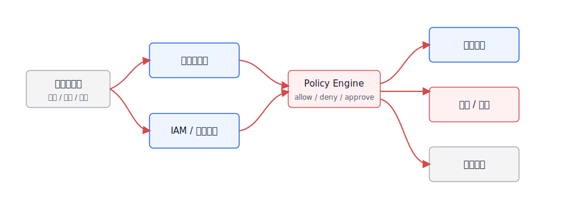
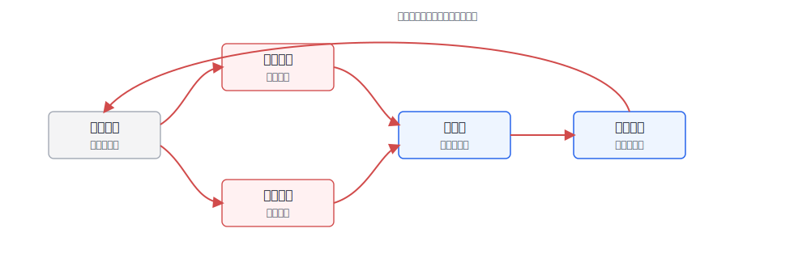

# 第51章 Guardrails 与内容安全

---

Guardrails 这个词容易被误解成“在模型前后加一层内容审核”。这只是其中一部分。企业 Agent 的 Guardrails 至少要覆盖四类约束：内容安全，防止违法、有害、敏感或不适合输出的内容；权限安全，防止越权访问和工具滥用；业务安全，防止违反流程、口径、审批和风控规则；工程安全，防止不可解析输出、危险代码、无引用回答和失控重试。

NVIDIA NeMo Guardrails 提供了围绕对话流程、检索和工具行为的 rails 思路；Meta Llama Guard、OpenAI Moderation、Azure AI Content Safety 等服务把内容分类器产品化；很多企业还会在网关层接入自有敏感词、DLP、PII 检测和审批策略。这些能力并非互斥路线，需要放在同一个平台架构里分工。下面按企业落地顺序展开：先明确 Guardrails 分层架构，再讨论内容安全分类器和策略引擎，随后讲脱敏过滤与输出校验，并处理误杀漏杀治理和可配置网关实验。

Guardrails 失败时，事故常常不发生在最终回答里。用户上传的 Excel 中有客户手机号，解析后进入了临时上下文；RAG 检索到一段带有 prompt injection 的网页，模型随后调用了导出工具；SQL 工具返回了完整明细，前端虽然只展示聚合结果，但 trace 里保存了原文；报告正文没有敏感词，却把未授权字段画进了图表。若安全策略只在模型输入前和最终文本后各跑一次，这些中间状态都会漏掉。

企业平台需要把 Guardrails 看成一张分布在执行链路上的策略网络。输入、上下文、工具、输出、Artifact、导出、日志和人工审批，都可能成为控制点。每个控制点要知道自己检查什么、能做什么、证据写到哪里。输入层可以拒绝明显恶意请求，上下文层可以隔离低信任材料，工具层可以要求审批，输出层可以脱敏或重写，观测层可以把误杀漏杀送回策略评审。任何一层缺失，风险都可能从旁路流出。

Guardrails 还要和权限系统分工。内容分类器能判断文本风险，权限系统判断用户是否可以看某个资源，业务策略判断某个动作是否符合流程，DLP 判断字段和文件是否可导出。把所有问题都交给一个“安全模型”，会让策略不可解释；把所有规则都写死在业务代码里，又会让策略无法运营。本章采用分层架构，就是为了让不同控制点承担不同责任，并把命中结果记录成可审计事件。

上线后的 Guardrails 也需要运营。误杀会让业务团队绕过平台，漏杀会造成安全事故，阈值变化会影响用户体验，新增工具和数据源会带来新风险。平台应把策略版本、命中样例、人工复核、申诉结果和灰度发布放在一起管理。这样 Guardrails 不再是一组静态规则，而是随业务和威胁变化持续校准的安全能力。Guardrails 的输出也要面向用户。被拦截时，系统不能只显示“请求不合规”；它应尽量说明可修改方向，例如缩小数据范围、改用聚合结果、移除客户标识、提交审批或联系数据 owner。说明要足够具体，帮助用户完成任务；同时也要避免泄露内部规则细节，让攻击者反向试探策略边界。这个平衡需要产品、平台和安全团队共同设计。

策略引擎应支持灰度。新规则上线前，可以先在影子模式下记录命中，不直接阻断；命中样例经过人工复核后，再决定是否放量。高风险规则可以先服务特定租户或特定工具，观察误杀和漏杀，再进入默认 profile。这样安全策略就像代码一样可测试、可回滚，而非靠一次评审直接全量发布。Guardrails 还要覆盖非文本产物。DataAgent 生成的图表、表格、CSV、PPT、SQL、Python artifact 和审批卡片，都可能携带敏感信息。一个报告正文脱敏了客户姓名，但图表 tooltip 或导出 CSV 仍保留客户 ID，仍然算泄露。输出校验要按产物类型做，而非只检查最终自然语言回答。

最后，Guardrails 要服务业务流程，而非替业务流程做决定。它可以阻断明确违规内容，可以要求审批，可以提示风险，也可以把样本送人工复核；但合同签署、客户通知、财务披露等决策仍要回到业务系统和组织审批。安全策略的价值，是让这些决策在可控证据下发生，而非让模型或分类器单独承担组织责任。Guardrails 的评估要同时看安全和可用性。误杀率高，业务团队会绕过系统；漏杀率高，安全事故会进入生产。评估样本要覆盖正常业务、边界请求、恶意请求、权限不足请求、工具参数异常、导出文件和多模态输入。只用公开安全测试集，无法覆盖企业内部字段、流程和权限组合。策略命中后的处置要有分级。明确违法或恶意请求可以直接拒绝；权限不足可以引导申请权限或返回聚合结果；内容风险不确定时可以转人工；低置信度命中可以要求澄清；高风险工具调用可以进入审批。分级越清楚，用户体验越稳定，安全团队也越容易分析策略效果。

Guardrails 还要进入开发流程。新工具上架时要声明风险等级和可拦截动作，新数据源接入时要声明敏感字段和脱敏策略，新前端组件上线时要说明可能导出的产物类型。等到上线后再补安全规则，通常会漏掉中间状态和旁路导出。把 Guardrails 前移到设计评审，后续运营压力会小很多。

---

## 51.1 Guardrails 分层架构

Guardrails 的第一原则是分层。输入 guardrail 处理用户消息、附件和 URL；上下文 guardrail 处理检索文档和工具返回值；工具 guardrail 处理动作授权；输出 guardrail 处理回答、图表、代码和导出；观测 guardrail 记录策略命中和误判样例。把这些都叫“内容审核”会掩盖工程边界。沿着执行链路看，Guardrails 是一组分布在不同位置的控制点，而非一个单独组件。表 51-1 按执行位置拆分职责，既承接 Ch50 的攻击面，也把“在哪里拦截、在哪里脱敏、在哪里审批”变成工程问题。

*表51-1：Guardrails 分层职责。来源：本书整理。*

| 层级 | 检查对象 | 典型策略 | 失败时动作 |
|---|---|---|---|
| 输入层 | 用户消息、附件、URL、语音转写 | 内容安全、意图风险、越权请求、速率限制 | 拒绝、澄清、降级、转人工 |
| 上下文层 | RAG chunk、网页、工具返回值、记忆 | 来源信任、注入检测、敏感字段、过期内容 | 隔离、脱敏、降低权重、禁止进入上下文 |
| 工具层 | 工具名、参数、资源、动作类型 | RBAC/ABAC、风险等级、审批、幂等性 | 拒绝、要求确认、签发短令牌 |
| 输出层 | 文本、SQL、代码、图表、导出文件 | 内容安全、引用校验、格式校验、DLP | 重写、拒答、脱敏、标注风险 |
| 观测层 | 策略命中、用户反馈、人工复核 | 命中率、误杀、漏杀、漂移、事故关联 | 告警、回归、策略版本调整 |

这五层如果只写在文档里，仍然容易被实现成一堆散落规则。图 51-1 中的布局把它们放回 Agent Runtime 周围：蓝色是平台内控点，灰色是外部系统，红色控制流表示策略判断。这里的工程边界很明确：Guardrails 应贯穿任务执行链路，不能退化成模型外面的一层代理。


*图51-1：Guardrails 分层架构。来源：本书自绘。Alt text：自上而下分为输入 Guardrail（检测用户输入）、检索 Guardrail（过滤检索内容）、工具 Guardrail（校验工具调用参数）、输出 Guardrail（审查最终回答）四层，每层标注控制点和典型策略。*

这张图把“拦截”拆成多个时点。输入层可以判断用户是否在请求敏感明细，但它并不知道后续检索会带出哪些字段；上下文层可以隔离低信任文档，但它无法判断工具参数是否越权；输出层可以做脱敏，但如果原始工具结果已经进入前端状态，泄露已经发生。DataAgent 里的 Guardrails 也应按这个结构实现：字段说明和历史 SQL 是否可用于当前角色，SQL 是否带租户过滤和字段权限，图表、表格和解释是否泄露敏感信息，都要在对应阶段处理；观测层再把被拒绝的查询和人工改写沉淀成评测样例。

分层设计还可以避免一种常见误判：把“最终答案安全”当成“整条链路安全”。例如用户没有看到客户手机号，但工具层已经把完整明细返回给 Runtime；输出层做了脱敏，但 trace、缓存或前端状态仍然保存了原文。另一个例子是用户输入本身正常，检索到的网页却包含 prompt injection，诱导模型调用导出工具。只在输入和输出两端做审核，无法发现这类中间链路风险。因此 Guardrails 要贴着数据流和动作流布设，每一层都要明确自己拦截的对象、可以采取的动作，以及失败后证据留在哪里。

## 51.2 内容安全分类器

内容安全分类器解决的是“这段内容属于什么风险类别”。Azure AI Content Safety、OpenAI Moderation、Llama Guard 等工具通常会覆盖暴力、自伤、色情、仇恨、违法、危险建议等通用类别；企业内部还要补充行业相关类别，例如金融投资建议、医疗诊断建议、涉密信息、客户隐私、员工隐私和品牌风险。分类本身不是目的。平台要在风险类别出现后决定拒绝、脱敏、审批、降级还是放行。表 51-2 把内容类别直接映射到平台动作，避免分类器结果停留在“高/中/低风险”的标签上。

*表51-2：内容安全分类到平台动作的映射。来源：本书整理。*

| 分类 | 典型内容 | 平台动作 |
|---|---|---|
| 明确禁止 | 非法活动、严重伤害、恶意代码、凭证窃取 | 拒绝回答，记录安全事件 |
| 高风险敏感 | 医疗、金融、法务、人事、未成年人、客户隐私 | 限制为一般信息，要求人工或专业系统确认 |
| 企业敏感 | 密钥、合同价格、薪资、客户名单、未发布财报 | 脱敏、拒绝、按角色返回摘要 |
| 可回答但需边界 | 合规解释、流程说明、产品限制、内部制度 | 回答时附适用范围和引用 |
| 正常业务 | 普通知识问答、低风险数据分析、文档总结 | 放行，保留 trace |

分类器的难点在上下文，而不在调用 API。相同文本在不同场景里的处理方式不同。用户问“导出客户手机号”在客服主管角色下可能进入审批，在普通销售角色下应拒绝；“生成裁员沟通话术”在 HR 合规培训里可能是合法案例，在普通聊天里可能需要限制。企业平台必须把内容分类结果和用户、角色、数据域、任务类型一起送入策略引擎。分类器也不能替代业务判断。通用分类器通常能识别暴力、自伤、色情、仇恨等风险，但企业里更棘手的是边界更窄的内容：未公开财报、客户名单、员工绩效、合同底价、供应商评分、事故根因报告。这些材料在语言上可能完全正常，却不应该被某些角色访问或导出。平台需要把通用内容安全、企业 DLP、字段权限和任务意图合并成同一次决策，不能让某个分类器的低风险分数直接放行。

## 51.3 可编程策略引擎

内容安全分类器给出风险判断，可编程策略引擎决定“允许、拒绝、脱敏、审批、降级、记录”。策略引擎是 Guardrails 的核心，因为企业安全要求会随组织、业务、地区和监管变化而变化，不能把所有规则写死在 prompt 或应用代码里。一个策略请求可以设计成下面的结构。
```json
{
  "trace_id": "trace_guard_001",
  "stage": "tool_call",
  "user": {
    "user_id": "u_1024",
    "tenant_id": "tenant_a",
    "roles": ["sales_manager"]
  },
  "request": {
    "tool_name": "query_customer_metrics",
    "action_type": "export",
    "resource": "dataset://crm/customer_profile",
    "fields": ["customer_id", "customer_phone", "region", "revenue"]
  },
  "risk": {
    "content_categories": ["enterprise_sensitive"],
    "sensitive_fields": ["customer_phone"],
    "risk_level": "high"
  }
}
```

策略响应也要结构化，不能只返回一段自然语言。只有把命中的规则、处置动作和证据字段拆出来，Runtime 才能据此继续执行、拒绝或转人工。
```json
{
  "decision": "require_approval",
  "policy_id": "customer_pii_export_v3",
  "reason": "customer_phone export requires manager approval and masking",
  "actions": [
    {"type": "mask_field", "field": "customer_phone"},
    {"type": "require_human_approval", "approval_flow": "pii_export"}
  ],
  "audit": {
    "trace_id": "trace_guard_001",
    "severity": "high"
  }
}
```

策略实现可以从简单开始，但不能继续散落在 prompt 和应用代码里。表 51-3 的结论很直接：早期不必追求复杂策略语言，先把规则配置化、版本化、可审计化，后续再引入更强的策略引擎或 DSL。

*表51-3：Guardrails 策略实现取舍表。来源：本书整理。*

| 方案 | 优势 | 代价 | 适用场景 | mini-platform 选择 |
|---|---|---|---|---|
| Prompt 规则 | 实现最快，适合原型 | 不稳定、不可审计、难回归 | 低风险演示、快速验证 | 只作为辅助说明，不作为生产策略 |
| 应用内 if-else | 简单直接，依赖少 | 多应用重复、版本混乱、难统一治理 | 单应用、临时规则 | 不作为平台默认 |
| 配置化策略 | 易审计、易版本化、便于灰度 | 表达复杂逻辑时能力有限 | 大多数内容安全、字段脱敏、审批规则 | 默认采用 |
| 策略引擎 / DSL | 表达力强，可接 IAM 和数据策略 | 学习和运维成本更高 | 多租户、跨系统、高风险工具 | 作为高级能力逐步引入 |

在这条链路里，策略引擎不替代模型，也不替代业务系统。图 51-2 中它位于模型意图、工具动作和输出展示之间，职责是给每次拦截、审批、脱敏和放行留下可解释原因。



*图51-2：可编程策略引擎流程。来源：本书自绘。Alt text：策略引擎从输入事件出发，依次经过规则匹配、分类器打分、风险评估、动作执行（拦截/降级/审批/放行），每步结果写入审计日志，体现策略可配置且全程可审计。*

图 51-2 表明，策略引擎处理的是一份带身份、场景、工具、资源和风险标签的决策请求，而非单一文本。这个结构化输入决定了策略能否被审计和复现：如果只把“模型认为要查客户数据”传给策略层，策略层无法判断这是合法分析、越权导出，还是被 prompt injection 诱导出来的动作。

策略版本也要进入 trace。一次拒绝、审批或脱敏是否合理，往往要等用户申诉或事故复盘时才会被讨论；如果系统只记录最终 decision，而没有记录 `policy_id`、策略版本、命中的条件和当时的用户角色，复盘就只能依赖猜测。更可靠的做法是把策略发布看成一次配置发布：有变更说明、灰度范围、回滚方式和回归样例。这样安全团队可以收紧高风险规则，业务团队也能看到误杀为什么增加、该由哪条策略负责。

## 51.4 脱敏过滤与输出校验

脱敏不能只发生在回答展示前。敏感信息可能出现在用户输入、检索上下文、工具结果、模型中间输出、前端组件状态、日志和导出文件。一个典型事故是：答案没有显示手机号，但完整工具结果已经写入 trace 或浏览器状态。如果脱敏只放在回答阶段，已经太晚了。同一字段在输入、检索上下文、工具结果、前端状态和导出文件中的风险不同。表 51-4 对应这些关键位置，让平台在数据流早期就决定哪些内容不能进入模型或日志。

*表51-4：脱敏与输出校验位置。来源：本书整理。*

| 位置 | 检查内容 | 处理方式 |
|---|---|---|
| 输入进入模型前 | 用户粘贴的密钥、身份证、客户信息 | 标记、脱敏、阻止进入上下文 |
| RAG 上下文组装 | 文档片段中的敏感字段和低信任来源 | 字段级脱敏、来源提示、降低权重 |
| 工具结果返回后 | 明细行、PII、商业秘密、跨租户数据 | 服务端过滤，避免原文进入前端和日志 |
| 输出展示前 | 模型回答、SQL、代码、图表说明 | 内容安全、引用一致性、格式校验 |
| 导出和分享前 | 表格、图片、报告、Artifact | 重新计算权限和脱敏，不复用前端状态 |

输出校验还要处理“结构正确”和“内容可信”两个问题。结构正确指 JSON、SQL、图表 spec、表格 schema 是否符合契约；内容可信指答案是否由证据支持、是否包含敏感字段、是否超出角色权限。DataAgent 尤其要在 SQL 执行前和图表导出前做校验，而非等模型生成完解释再补救。脱敏策略还要区分“展示”“计算”和“审计”。有些字段可以参与聚合计算，但不能展示明细；有些字段可以在受控服务端日志中保留哈希，却不能进入模型上下文；有些导出文件需要按接收人权限重新脱敏，不能复用屏幕上的结果。DataAgent 的图表尤其容易被忽略：图里没有手机号，不代表分组维度、筛选条件或 tooltip 不会暴露敏感属性。输出校验应覆盖文本、SQL、图表配置、表格列和导出文件，而非只检查模型回答字符串。

## 51.5 策略误杀漏杀治理

Guardrails 最大的产品挑战是误杀和漏杀。误杀太多，业务用户会绕过平台；漏杀太多，安全团队无法接受上线。企业要把策略当成可运营资产，而非一次性配置。治理指标不能停在拦截率。拦截率上升可能说明攻击增多，也可能说明策略过严；业务需要同时看到误杀、漏杀、人工复核和体验影响。表 51-5 的指标拆分，用于帮助平台团队判断策略是该收紧还是该放松。

*表51-5：Guardrails 治理指标。来源：本书整理。*

| 指标 | 含义 | 处理方式 |
|---|---|---|
| Block rate | 请求被拒绝或降级的比例 | 监控策略是否过严或攻击增多 |
| False positive rate | 合法请求被误杀比例 | 从用户反馈和人工复核样例中回归 |
| False negative count | 风险请求漏过数量 | 由红队、安全事件和抽检发现 |
| Approval conversion | 进入审批后最终通过比例 | 判断审批是否设置过重 |
| Policy drift | 新业务、新文档、新工具导致策略失效 | 按策略版本和场景做定期回归 |

有了指标，还需要让样例流动起来。图 51-3 中的治理流程把用户反馈、人工复核、红队失败样例和线上事故都拉回策略样例库；策略调整后再通过灰度和回归进入生产，而非直接改线上规则。



*图51-3：Guardrails 策略治理闭环。来源：本书自绘。Alt text：环形流程，策略定义、测试验证、灰度发布、线上监控、误杀/漏杀分析、策略修订，箭头表示每轮线上数据驱动下一轮策略优化，体现策略持续演进。*

这套治理流程的重心是回归集。用户反馈、人工复核、红队失败样例和线上事故来源不同，可信度和优先级也不同；进入样例库后，需要先标注期望决策，再通过灰度和回归验证策略版本。这样做的代价是流程更长，但可以避免某个紧急规则直接上线，随后在另一个业务场景造成大面积误杀。误杀和漏杀还要按场景分层看。客服问答里的轻微误杀，可能只是用户多问一次；财务导出、合同审阅、客户数据查询里的漏杀，则可能直接变成合规或商业风险。平台不应追求一条全局阈值覆盖所有业务，而要按任务风险、数据类型、用户角色和输出形态设置策略 profile。低风险问答可以优先保证体验，高风险动作则应优先保证可审计和可审批。

运营上也要给业务团队留申诉入口。Guardrails 如果只拦截不解释，用户会把平台视为阻碍；如果每次拦截都能说明命中规则、风险类型和可申请路径，业务团队更容易接受。申诉样例进入回归集后，安全团队可以判断是规则过严、上下文缺失，还是业务确实需要新增例外。这样 Guardrails 才能从“安全部门的黑箱”变成平台共同维护的风险控制能力。

## 51.6 可配置 Guardrails 网关评估

本节给出一个 Guardrails 网关评估实验：同一条用户请求先经过输入分类、上下文检查、工具策略和输出校验，每一层都返回结构化 decision，最终由 Runtime 执行动作。若后续将它纳入 mini-platform，可以采用如下目录结构；当前仓库尚未包含该实验目录，本节不提供可运行命令。
```text
mini-platform/projects/configurable-guardrails-gateway/
├── README.md
├── configs/
│   ├── policies.yaml
│   ├── classifiers.yaml
│   └── routes.yaml
├── samples/
│   ├── requests.jsonl
│   └── expected_decisions.jsonl
├── scripts/
│   ├── run_gateway_eval.py
│   └── generate_guardrails_report.py
└── reports/
    └── guardrails_gateway_report.md
```

策略配置可以先从字段脱敏和动作审批做起。先把高风险动作和高敏字段守住，再逐步扩到更细的内容过滤和租户级例外规则，实施成本会更可控。
```yaml
policies:
  - id: pii_export_requires_approval
    stage: tool_call
    when:
      action_type: export
      fields_any: [customer_phone, id_card, salary]
    decision: require_approval
    actions:
      - type: mask_fields
        fields: [customer_phone, id_card, salary]

  - id: no_secrets_in_prompt
    stage: input
    when:
      detector_any: [api_key, private_key, password]
    decision: deny
    actions:
      - type: redact
```

报告需要同时呈现安全和体验，不能只给一个“拦截准确率”。最小报告应先看 decision accuracy，即网关决策与人工标注的 expected decision 是否一致；再分别列出 false positives 和 false negatives，让业务团队知道哪些合法请求被误杀、哪些风险请求被漏放。Added latency p95 要单独列出，因为 Guardrails 如果把每次交互都拖慢到不可接受，业务会绕过平台。Policy coverage 则说明当前策略覆盖了哪些工具、字段、动作和内容类别，避免评估只覆盖少数演示样例。最后还要记录 regression set growth：每次误杀、漏杀、红队失败和人工复核都应转成回归样例，否则策略治理不会随线上问题变强。

评估报告还要把样例和策略版本关联起来。一个合法请求被误杀，原因可能是某条业务策略过严，不一定是分类器本身出错；一个风险请求漏过，也可能是新工具、新字段或新文档源没有进入策略覆盖范围。报告里如果只写总分，团队会倾向于继续调阈值；报告里若能看到样例、策略 ID、阶段、动作和用户角色，就能判断该修分类器、修策略、修权限，还是修业务流程。

## 51.7 Guardrails 的工程化运营

Guardrails 是一套持续运营机制，不能被当作一次性规则集。上线初期可以从敏感信息、越权动作、危险输出和提示注入几类规则开始，但很快会遇到误杀和漏杀。业务用户会抱怨正常请求被拒绝，安全团队会发现新型绕过样例，平台团队则要在体验、风险和成本之间调参。每次拦截都应能解释。系统至少要记录命中的策略、输入摘要、风险类别、处置动作、用户可见提示和 trace ID。不能只返回“内容不合规”，否则用户无法修正请求，运营团队也无法判断规则是否过严。对开发者来说，解释字段还可以进入离线评测，用于比较不同策略版本的误杀率。策略更新要走版本管理。Guardrails 规则变化会改变 Agent 行为，影响不亚于模型升级。生产环境应支持灰度、回滚和按租户配置；高风险租户可以启用更严格策略，内部沙箱可以保留调试能力。策略版本还要写入 Trace，否则同一条请求在不同时间得到不同结果时，团队无法复盘差异来源。Guardrails 也不能替代权限系统。内容分类器可以发现风险文本，但真正的工具执行、数据访问和导出仍要由 Policy 和 Registry 做硬校验。把安全全压在模型前后的文本过滤上，会让系统在结构化工具调用面前失效。第50章的攻击面和本章的策略网关必须一起设计。

## 51.8 策略发布与灰度治理

Guardrails 策略不能直接在生产环境全量生效。内容安全分类器、规则策略、脱敏逻辑和输出校验一旦调整，可能同时影响误杀率、漏杀率、响应时间和用户体验。策略发布应当像模型和工具发布一样走灰度：先在影子模式记录命中情况，再对低风险流量生效，最后逐步扩大范围。影子模式尤其重要，它能让团队看到策略如果生效会拦截哪些请求，而不会立即打断用户流程。灰度过程中要同时观察拦截和放行。只看拦截命中数，会让团队倾向于写更宽的规则；只看用户投诉，又会低估漏杀。平台应当抽样检查被拦截的请求是否真的违规，也要抽样检查放行请求是否存在风险。对于高风险工具调用，策略可以更严格；对于普通问答，策略应尽量给出可恢复提示，而非简单拒绝。策略发布还要保留版本和回滚路径。一次误杀事故发生后，团队需要知道是哪条规则、哪个分类器版本、哪次配置变更导致问题。若策略分散在代码、配置、Prompt 和第三方服务里，回滚会非常困难。Guardrails 的工程化运营，核心就是把安全策略变成可测试、可灰度、可回滚的发布对象。

## 51.9 Guardrails 与业务责任

Guardrails 不能替业务系统做最终决策。内容安全层可以识别敏感请求，策略引擎可以决定是否拦截、脱敏或转人工，但业务规则仍然需要由领域系统承担。比如贷款审批、退款、合同发送和数据导出，Guardrails 可以提示风险，却不能替代审批链路和权限系统。否则安全策略会变成隐藏的业务规则，长期维护和审计都很困难。更合理的分工是：Guardrails 负责识别风险和控制输出，Runtime 负责状态迁移，Tool Registry 负责工具风险标注，业务系统负责最终合法性检查。四者之间要通过结构化事件连接。一次请求被拦截时，Trace 里应当记录风险类型、策略版本、触发证据和恢复路径；一次请求被放行但后续业务系统拒绝时，也应回写到策略评估中，帮助安全团队判断是否需要前移拦截。这种分工让 Guardrails 不再是单独的过滤器，而是平台治理的一部分。它不追求拦住所有不确定请求，而是把风险放到正确的责任层处理。企业 Agent 平台需要这种清晰边界，才能在安全、可用性和业务效率之间取得稳定平衡。

## 51.10 误杀与漏杀的样本运营

Guardrails 的质量要靠样本运营，而非靠一次规则设计。误杀样本说明系统把本应允许的请求拦住了，漏杀样本说明系统放过了风险请求。两类样本都要保留原始输入、上下文、策略版本、模型版本、工具风险和人工判断。只记录“用户投诉误杀”或“安全发现漏杀”不够，团队需要知道当时策略为什么做出这个判断。误杀和漏杀的处理节奏不同。误杀影响用户体验和业务效率，通常需要快速评估是否降级规则或增加例外；漏杀影响安全底线，需要优先确认影响范围和补救措施。平台应允许策略按租户、场景、工具和风险等级灰度调整，而非全局开关。这样可以在不放松高风险场景的前提下，减少低风险场景的误杀。样本运营还要进入发布流程。策略修改前先跑历史误杀和漏杀样本，确认修复没有引入新的问题。策略上线后继续观察线上样本分布，必要时回滚。Guardrails 的成熟度不在于规则数量，而在于样本、策略和发布之间是否形成稳定闭环。

## 51.11 输出校验与下游消费

输出安全不只面向终端用户，也面向下游系统。Agent 生成的报告、SQL、工具参数、邮件草稿和 JSON 结果，可能被其他系统继续消费。若 Guardrails 只检查最终自然语言，就会漏掉结构化输出中的风险。例如报告正文没有敏感词，但附件图表包含个人信息；邮件正文合规，但收件人列表越权；JSON 字段格式正确，但包含不应导出的客户标识。因此，输出校验要按产物类型设计。自然语言检查内容安全和敏感信息，结构化输出检查字段级权限和风险标签，文件和图表检查数据来源和可见范围，工具参数检查动作风险和审批状态。不同产物使用不同校验器，但结果要写入同一条 Trace，方便复盘。这也解释了 Guardrails 与结构化输出、报告层的关系。安全策略不能只在聊天回复末端执行，它要进入每一种可被下游系统使用的产物。只有这样，Agent 平台才能避免“聊天安全、系统不安全”的错觉。

## 51.12 策略冲突与优先级

Guardrails 策略多了以后，冲突会成为常态。内容安全策略可能要求拒答，业务连续性策略可能要求给出替代路径，合规策略可能要求留痕后转人工，用户体验策略又希望减少打断。平台需要定义策略优先级和合并规则，而非让最后命中的规则覆盖前面的判断。优先级应围绕风险而非规则来源设计。涉及敏感数据泄露、越权写操作和合规禁止事项的策略，应高于普通体验优化；可恢复的内容风险，可以转成澄清或人工复核；低置信度分类器命中，不应直接阻断高价值业务流程，而应结合工具风险和用户权限判断。策略引擎需要输出决策理由，让前端、Runtime 和审计系统知道为什么拦截、为什么放行或为什么转人工。冲突处理还要进入测试。每次新增策略，都应检查它与既有策略在典型场景下的组合结果。若一个请求同时命中脱敏、审批和拒答策略，平台应有确定行为。没有优先级，Guardrails 会在规模化后变成不可预测的规则堆。

## 51.13 Guardrails 的可解释反馈

用户被拦截时，系统不能只说“请求不符合规定”。反馈需要足够具体，让用户知道可以如何修改请求，但又不能泄露安全规则细节。比如敏感数据请求可以提示用户缩小数据范围或申请权限；高风险写操作可以提示需要人工审批；内容风险可以给出安全替代表达。可解释反馈能减少无效重试，也能降低用户绕过系统的动机。反馈内容应由策略结果驱动，而非前端写死。策略引擎输出风险类型、处置方式和可恢复路径，前端再转换成用户可读语言。这样策略变化后，用户反馈也能保持一致。对于审计场景，系统还要保存用户看到的反馈文本，避免事后无法解释当时为什么用户采取了某个动作。可解释反馈是 Guardrails 可用性的关键。安全系统如果只会拒绝，业务团队会绕开它；如果能说明边界和下一步动作，用户更容易接受。企业 Agent 平台需要这种既守边界又能继续推进任务的安全体验。

反馈质量也要被评测。一次拦截如果给出了错误原因，用户会沿着错误方向修改请求；一次放行如果没有提示剩余风险，审批人可能低估后续影响。Guardrails 的评测应同时看拦截决策和反馈文本，确保安全控制能被用户正确理解。Guardrails 运营还需要和事故复盘相连。每次安全事件都应回看策略是否覆盖、命中后动作是否正确、用户提示是否清楚、Trace 是否保留足够证据。如果策略没有覆盖，就补规则或补分类器；如果命中了却被绕过，就修执行链路；如果误杀严重，就调整阈值和用户反馈。这样安全事件才能转化为平台能力，而非只形成一次报告。团队也要接受一个现实：Guardrails 永远不会一次写完。新业务、新工具、新数据源和新攻击方式都会改变风险面。平台需要的是可版本化、可灰度、可复核、可解释的策略体系，而非追求一条永远正确的规则。

Guardrails 的数据也要保护。策略命中日志、被拦截请求、人工复核样本和红队案例本身可能包含敏感内容。安全团队常常希望保留完整样本方便分析，隐私和合规团队则会关心留存范围和访问权限。平台应对这些样本做脱敏、分级和保留周期管理，避免安全治理材料成为新的泄露源。红队样本和真实用户样本也要区分。红队样本适合测试策略覆盖，真实样本适合观察业务影响；两者混在一起会扭曲误杀率和漏杀率。运营报表应分别展示攻击模拟、用户误触、真实风险和策略回归结果。这样安全团队能看见防护能力，业务团队也能看见用户体验成本。这些治理材料应和普通业务日志分开授权。能维护策略的人，不一定能查看所有原始用户输入；能看脱敏样本的人，也不一定能导出完整红队语料。

## 51.14 策略运行账本与复盘材料

Guardrails 上线后，平台需要一份策略运行账本。账本记录每条策略的 owner、适用租户、适用工具、风险类别、发布版本、灰度范围、命中次数、误杀样本、漏杀样本、平均延迟和最近复审时间。它把策略从“规则配置”变成可运营的生产对象，并为安全、平台和业务团队提供共同证据。没有账本时，团队往往只知道某个请求被拒绝，却不知道是哪条策略在什么版本下做出的决策；策略过期、例外规则膨胀和租户差异也很难被发现。

账本还要支持事故复盘。一次越权导出没有被拦住，复盘时要能回答：输入分类器是否识别风险，策略是否覆盖该工具和字段，Policy Engine 是否返回正确决策，Runtime 是否执行了决策，前端是否展示了正确反馈，Trace 是否记录了用户后续动作。若只看最终结果，团队会把问题简单归为“Guardrails 失效”；沿账本逐层检查，才能判断到底是策略缺失、策略冲突、执行链路绕过，还是用户反馈不清导致了误操作。

策略账本也能帮助业务参与治理。很多误杀发生在业务语境里：合规团队需要分析违规样本，安全团队需要测试攻击文本，法务团队需要审阅敏感条款。如果策略只按字面内容拦截，合法工作会被阻塞。账本记录 owner 和复审时间后，业务团队可以参与调整例外、补充样本和定义恢复路径。这样 Guardrails 不会变成平台团队单方面维护的黑箱。

早期平台可以从最小账本开始。每条策略至少有 id、owner、版本、适用范围、决策动作、命中样本和回滚方式。每次发布前跑固定样本，每次误杀或漏杀后补回归样本，每次事故后更新复盘材料。规则不需要很多，但要能被解释、复测和撤回。Guardrails 的工程质量，最终体现在这些运行记录里。

## 51.15 Guardrails 的策略漂移复盘

Guardrails 上线后，策略会随着业务、模型和工具变化发生漂移。新的文档类型进入 RAG，新的写工具接入 Registry，新的模型改变拒答风格，新的业务流程放大某类误杀，都会让原有策略表现变化。策略漂移不一定来自配置错误，它也可能来自使用场景变化。平台需要定期比较策略版本、样本结果、误杀申诉、漏杀事故和业务绕行情况。

复盘时，要把每条策略映射到控制点和责任人。内容安全分类器负责识别风险文本，策略引擎负责决定是否放行，输出校验负责检查结构和敏感字段，Runtime 负责挂起或降级，业务 owner 负责确认风险接受。若某个样本失败，复盘要说明是识别问题、决策问题、执行问题，还是业务边界变化。这样 Guardrails 才不会变成一组难以解释的黑盒规则。

策略漂移还要进入灰度发布。新策略先在影子模式观察，再进入小流量拦截，最后进入正式门禁；高风险样本失败时，可以暂停扩大范围；误杀过多时，要提供临时豁免和复测时间。Guardrails 的治理目标是让策略变化可观测、可解释、可回退，风险控制也能随着样本和业务边界逐步收敛。

## 51.16 Guardrails 与运行状态的联动

Guardrails 的决策要和 Runtime 状态联动。内容风险、权限风险、导出风险和工具风险不能只返回一个拒绝文本，它们应驱动 Run 进入不同状态：继续执行、需要澄清、等待审批、降级回答、转人工复核或终止。这样前端才能给用户展示可执行下一步，Trace 也能记录策略对任务状态的真实影响。若 Guardrails 只在模型前后做文本过滤，运行系统就不知道任务为何停下，也无法把误杀漏杀转成样本。

联动还要覆盖恢复动作。低风险内容命中可以要求用户改写问题；高风险导出命中可以进入审批；缺少权限可以转到权限申请；证据不足可以进入复核。不同恢复动作对应不同 owner 和时限。平台应把策略决策、状态迁移、用户提示和后续动作放在同一条记录里，避免安全系统和任务系统各自解释同一次事件。

早期 Guardrails 可以先支持少量状态映射：allow、warn、mask、review、deny。映射不复杂，但必须由后端执行，前端只渲染状态和可用动作。这样策略调整时，运行行为、用户反馈和审计记录会一起变化，平台也能更准确地评估策略对真实任务的影响。

## 51.17 Guardrails 反馈进入策略修订

Guardrails 的反馈要进入策略修订，而不是只进入客服或工单系统。用户申诉、人工复核、红队样本、误杀样本和漏杀样本，都应回到同一套策略样本库。每条样本记录触发策略、用户任务、风险类别、人工裁定和后续动作。这样策略团队能看到某条规则是否长期误伤同一类业务，或者某类风险是否经常漏过。

反馈回路还要区分修策略、修模型和修产品。用户被误拦截，可能是规则过严，也可能是任务入口没有给出必要上下文；风险请求漏过，可能是分类器没识别，也可能是工具 schema 暴露过宽。若所有反馈都被写成“Guardrails 效果不好”，团队会反复调阈值，却错过真正的工程修复点。

早期可以把每次人工裁定变成回归样本。策略发布前跑这些样本，发布后观察新样本分布。Guardrails 的治理能力来自这种持续修订，而不是一次性写出很多规则。

## 51.18 策略资产与 owner 复审

Guardrails 策略应作为平台资产管理。一个策略资产包含规则或分类器路由、owner、适用范围、支持语言、样本集、灰度状态、例外列表、延迟预算和复审日期。没有这层资产视角，策略会散落在配置里。团队可能知道某个请求被拦截，却不知道谁负责这条拦截、哪组样本支持它、它是否仍适合当前业务流程。

owner 复审要重点检查那些仍在生效但很少被复盘的策略。有些规则源自一次事故后的临时修复，却在生产里停留数月；有些租户级例外逐渐变成事实默认；有些分类器仍在运行，但样本集已经过期。定期复审要回答几个问题：策略是否还有 owner，样本是否仍代表生产流量，误杀是否可接受，规则是否应从租户配置上升为平台基线。

策略资产还能帮助控制成本和延迟。Guardrails 链路可能一层层变长：输入分类、检索过滤、输出脱敏、工具风险策略、导出策略和人工复核。如果所有层都对每个请求同步执行，低风险任务也会感到明显延迟。资产元数据应说明哪些检查同步执行，哪些异步执行，哪些先在影子模式观察。这样产品团队能解释延迟来源，安全团队也有一条可控路径逐步增强检查。

早期可以先维护一份小型策略清单，字段包括 id、owner、范围、样本、动作、灰度状态、例外数量和最近复审日期。这足以支持事故复盘、发布门禁和过期规则清理。Guardrails 也会因此成为有责任人的运行系统，而不是不断增加的过滤器集合。

## 51.19 Guardrails 策略变更的灰度样本回放

Guardrails 策略变更应先进入影子模式或小流量灰度。策略调整常常会影响正常任务：更严格的输入分类可能拦住真实业务请求，更宽松的输出策略可能让敏感字段进入报告，更快的工具授权路径可能减少等待，也可能降低人工确认比例。平台不能只看拦截率变化，还要看误杀、漏杀、人工申诉、任务完成率、延迟和用户改写问题的行为。若用户为了绕过误拦截开始换说法，表面上拦截率下降，实际风险可能已经转移到更难识别的入口。

样本回放要覆盖正例、反例和边界例。正例用于确认风险请求仍会被拦截；反例用于确认普通任务不会被误伤；边界例用于观察策略如何处理不完整上下文、模糊意图和高权限用户请求。每条样本都应带上业务场景、用户角色、数据类别、目标工具、预期动作和人工裁定。这样策略团队能判断某次变化是在修复真实风险，还是只是在调阈值。对高风险工具和合规输出，策略变更后还应回放历史事故样本，确认旧问题不会重新出现。

灰度期间，Guardrails 的反馈要写回产品体验。被拦截的用户需要知道可以补充哪些信息、是否可以申请人工复核、哪些部分可以继续完成。若提示只写“违反安全策略”，用户会重复提交或转向线下渠道。更好的反馈应解释任务状态，而不暴露绕过方式：缺少授权、需要审批、字段需脱敏、材料置信度不足、导出范围超过限制。这样 Guardrails 才能同时承担风险控制和任务引导。早期平台可以把策略变更拆成三步：影子观察、灰度执行、发布复盘。每一步都记录样本表现、误杀案例、漏杀案例、例外请求和 owner 结论。策略发布不再依赖一句“安全通过”，而是依赖可复现的样本证据。

## 51.20 申诉处理与人工裁定机制

Guardrails进入生产后，申诉机制和策略本身同样重要。用户被拦截时，可能确实触碰了风险边界，也可能只是上下文不足、权限状态未同步、分类器误判，或者任务入口没有表达出合法目的。若平台没有申诉路径，用户会绕开系统；若申诉路径只进入普通工单，策略团队又无法从中学习。申诉应成为 Guardrails 的一类结构化事件，记录用户角色、任务目的、触发策略、风险类别、当前上下文、期望动作、人工裁定和后续修复。

人工裁定要区分几种结论。第一类是策略正确，用户需要补充授权或改走审批；第二类是策略误杀，需要调整规则、分类器或提示文案；第三类是产品入口缺信息，需要在 UI 或任务模板里补充字段；第四类是业务例外，需要设置范围、到期时间和复测要求。若所有裁定都只写“已处理”，后续团队无法知道该修策略、修产品、修权限，还是修文案。裁定结果还应回写样本库，让下一次发布能回归验证。

申诉体验也要克制。系统不应暴露具体绕过方式，但可以说明可采取的合规动作：补充审批人、缩小导出范围、使用脱敏结果、上传授权材料、转人工复核。高风险场景下，申诉不会立即放行，只会进入责任人确认；低风险误杀可以快速恢复任务，并把样本进入后续复盘。这样既不削弱安全边界，也不会让业务流程因为一次误判停住。

早期平台可以把申诉处理接到 HITL 机制。被拦截的 Run 进入挂起状态，人工 reviewer 选择放行、拒绝、改写任务、设置例外或要求补充材料。每个动作都写入 Trace，并触发策略样本更新。这样 Guardrails 不再只是拦截器，而是一个能处理误判、例外和责任分配的运行系统。

## 51.21 策略解释的产品边界

Guardrails 的解释要让用户理解可行动路径，但不能暴露规避策略。用户需要知道请求被拦截的大类原因、可以修改哪些输入、是否能申请复核；攻击者不应看到具体规则、阈值、绕过提示或内部分类器结果。产品文案、审计记录和调试视图应使用不同粒度。面向用户的提示讲清限制和下一步，面向审核人的记录保留样本和裁定，面向工程师的视图保留策略版本、模型结果和规则命中。

解释边界还要和业务场景匹配。普通内容安全拦截可以给出简短提示；涉及合规、导出、外部发送或高风险工具时，应说明需要人工确认或权限申请；涉及疑似攻击时，提示应更克制，避免暴露检测线索。这样的分层能减少用户困惑，也能降低策略被反复试探的风险。

早期可以建立一组解释模板：内容限制、权限不足、证据不足、需要审批、系统暂不可用、申诉入口。每个模板都绑定策略类别和可见字段。模板进入版本管理后，策略团队能调整规则，产品团队也能保持一致的用户表达。

## 51.22 策略资产清理与执行阶段选择

Guardrails 策略会不断增加。一次事故后增加一条规则，一个客户审计后增加一条例外，一个业务场景上线后增加一个模板。若这些策略长期无人清理，规则会重叠，文案会冲突，租户例外会过期，误杀会越来越多。策略资产需要和代码、模型、工具一样进入生命周期管理。每条策略都要有 owner、适用范围、样本集、上线时间、最近复审时间和退役条件。

清理不等于放松安全。过期策略可以退役，重复策略可以合并，试验策略可以回到 shadow 模式，产品问题可以改为入口约束或审批流程。比如用户频繁请求无权数据，单纯拦截可能不是最佳修复；更好的做法可能是提供权限发现、数据目录说明或审批入口。Guardrails 样本和申诉记录应帮助团队判断问题属于风险控制，还是属于产品设计、数据治理和用户教育。

策略还要选择合适执行阶段。有些检查适合模型调用前，例如权限、数据域和高风险意图；有些适合检索后，例如证据来源和敏感字段；有些适合生成后，例如输出脱敏和格式校验；还有些适合 artifact 发布前，例如导出范围和审批状态。平台不应把所有策略都同步执行在每个请求上。低风险只读任务可以轻量检查，高风险写动作则需要工具策略、审批和产物复核。

早期可以为每条策略记录执行阶段、超时行为、降级动作和失败时用户提示。分类器不可用时，是拒绝、转人工、降级输出，还是进入异步复核，要在策略资产中写清楚。这样 Guardrails 不会成为越来越重的黑盒，也不会在依赖异常时做出不可解释的放行或阻断。

## 51.23 Guardrails 与任务设计的共同修复

Guardrails 频繁拦截同一类请求时，问题未必只在策略。用户可能不知道自己缺少权限，也可能不知道该上传授权材料，或者任务入口没有提供合规路径。若平台只继续加规则，用户会反复撞到同一堵墙，业务团队也会认为安全策略阻碍工作。Guardrails 应把高频拦截转成任务设计问题。

共同修复要看样本。若用户经常请求导出超范围数据，产品可以提供范围选择和审批入口；若用户经常要求无证据结论，报告层可以要求 EvidenceRef；若用户经常触发敏感字段拦截，数据产品可以提供脱敏视图；若用户经常误用外部发送，前端可以在发送前展示接收者和权限状态。策略层负责发现问题，产品和数据层负责减少无效请求。

早期可以把 Guardrails 样本按“策略正确但入口不足”“策略误杀”“用户缺少信息”“业务例外”四类标注。每类样本进入不同 backlog。这样 Guardrails 不会变成单独的拒绝系统，而会推动任务入口、数据产品和审批流程一起变好。

## 51.24 Guardrails 命中后的任务修复

Guardrails进入生产后，平台需要把命中策略、用户意图、被拦截内容、可替代任务、人工复核、误杀样本和策略版本放进统一证据口径。证据口径会减少事后解释成本，让业务、平台、数据、安全和运营团队能够围绕同一组事实讨论问题。没有这些材料，故障发生后只能凭经验判断；有了这些材料，团队可以知道哪些输入有效、哪些动作已经执行、哪些产物可以继续使用、哪些结果需要撤回。

这类证据应和第30章 HITL、第50章安全和第52章合规连起来。上游章节提供能力基础，下游章节使用运行结果，本章则负责说明中间环节如何被验证。若某个能力只在本章看起来完整，却无法进入 Trace、Eval、发布记录或合规证据包，生产系统仍然会出现断点。读者在实现时应把章节之间的接口看成工程契约，而不是阅读顺序上的相邻关系。

常见风险包括只给拒绝提示、用户不知道如何修改任务、误杀样本没有进入策略复审。这些问题通常不会在一次成功演示中暴露，因为演示样本往往干净、短小、路径明确。真实业务会带来旧数据、异常输入、权限变化、用户撤回、预算限制和长时间运行状态。平台如果没有把这些情况纳入样本和台账，后续扩展场景时就会重复遇到同类问题。

Guardrails 应把拦截转成可修复路径，使安全策略和任务设计一起改进。执行记录至少要说明 owner、版本、样本、影响范围、处置动作和复查时间。记录不需要写成流程报告，但要足够让后来者理解当时的判断。对于高风险能力，还应说明哪些条件满足后才能扩大使用，哪些条件失败时必须降级或撤回。

落地时可以先选择少量代表场景建立这种习惯。实践上，应先把高频、高风险、外部可见的路径做扎实，再把样本、台账和复盘方式复制到其他能力中。这样做能让能力说明落到接入、验证、运营和退出，而不是停留在概念描述。

## 51.25 策略误杀的业务复核

Guardrails 误杀需要业务复核。安全策略如果拦截了合法任务，用户通常只看到拒绝结果；平台团队如果只看策略命中率，也很难判断这次拦截是否合理。误杀样本应记录用户意图、被拦截内容、触发策略、业务 reviewer 判断、可替代路径和策略修订建议。

业务复核能让安全策略更精确。某些任务应调整提示，让用户改写输入；某些任务应进入人工审批；某些任务说明策略过宽，需要补充例外；某些任务虽然合法，但风险过高，仍应维持拦截。早期可以每月抽取高频误杀样本复审，把结果写入策略版本和训练材料。

## 本章小结

Guardrails 是企业 Agent 平台的控制系统，不是单个内容审核 API。内容分类器负责识别风险，策略引擎负责决策，工具层负责最小权限，输出层负责脱敏和结构校验，观测层负责误杀漏杀治理。平台早期不必追求“完美拦截所有风险”。更现实的目标是可配置、可解释、可回归：策略决策能被追踪，误杀漏杀能被样例化，Guardrails 才能随着业务和法规一起演进。

## 参考文献

- [NVIDIA NeMo Guardrails Documentation](https://docs.nvidia.com/nemo/guardrails/latest/)

- [Meta Llama Guard Model Card](https://huggingface.co/meta-llama/Llama-Guard-3-8B)

- [Azure AI Content Safety](https://learn.microsoft.com/en-us/azure/ai-services/content-safety/overview)

- [OpenAI Moderation Guide](https://platform.openai.com/docs/guides/moderation)

- [OWASP Top 10 for Large Language Model Applications](https://owasp.org/www-project-top-10-for-large-language-model-applications/)
