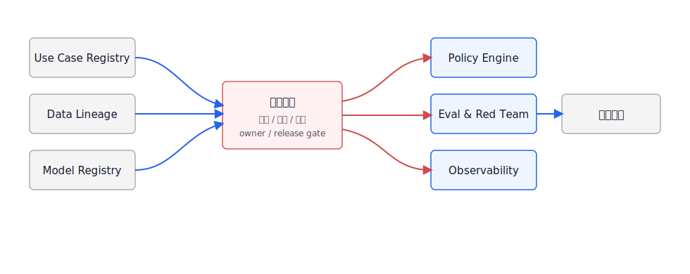
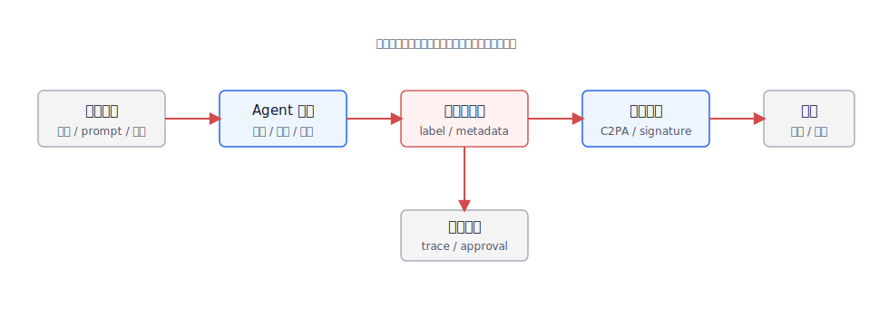

# 第52章 合规与法规

---

合规不是上线前填一张表。企业 Agent 平台会处理数据、生成内容、调用工具、影响业务决策，还可能跨地区、跨租户、跨供应商运行。法规和标准进入工程后，问题会变得很具体：这个 Agent 属于什么风险等级，用了哪些数据和模型，输出影响谁，谁能复核，事故发生后能不能还原证据。NIST AI RMF 用 Govern、Map、Measure、Manage 四个功能组织 AI 风险管理；NIST AI 600-1 针对生成式 AI 进一步补充风险轮廓；EU AI Act 采用风险分级思路，对高风险 AI 系统和通用 AI 模型提出不同义务；中国的生成式 AI 服务管理、深度合成管理和生成合成内容标识要求，则强调内容安全、数据来源、标识和服务责任。C2PA 和 Content Credentials 进一步把内容来源、编辑历史和签名证明变成可验证元数据。

真正的压力通常出现在事故之后。业务方质疑一份 AI 生成的经营报告，平台需要说明它用了哪个数据集、哪条 SQL、哪个指标口径、哪个模型版本、谁改过报告、谁批准导出；客户投诉客服 Agent 给了错误承诺，团队需要还原当时的用户输入、检索证据、工具调用、拒答策略和人工接管记录；合规负责人追问某个外部模型是否处理了个人信息，工程团队不能只说“我们有脱敏”，而要拿出数据流、日志和供应商配置。

合规工程化的核心，是把这些追问提前变成平台控制点。风险分类决定一个 Agent 能接哪些数据、能调用哪些工具、需要什么人工监督；控制矩阵把法规、内部制度和工程模块连起来；内容溯源让导出的报告、图表、图片和文本能回到 Run、数据和审批；审计报告把分散证据整理成合规团队能复核的材料。没有这套链路，合规就会退化成发布前人工签字，上线后却无法解释系统行为。

本章把 NIST AI RMF、EU AI Act、中国生成式 AI 合规要求和内容溯源要求翻译成平台工程：风险分类、控制矩阵、证据链、内容溯源、审计报告和发布验收。这里不提供法律意见，也不替企业判断具体法规适用性，而是帮助工程团队建立和法务、合规、安全团队对话的共同语言。工程侧至少要知道该记录什么、由谁负责、证据存在哪里、变更后如何重新评估。

---

## 52.1 合规工程化框架

企业 Agent 合规的第一步是建立控制矩阵。矩阵的行是风险和义务，列是平台控制点和证据。法务、合规、安全、平台和业务团队只有围绕这张矩阵，才是在讨论同一个对象。这张矩阵要把“要求”拆成可以被系统记录、测试和审计的字段。表 52-1 先给出一个最小框架，后面的 NIST、EU、中国要求和 C2PA 都可以挂到这些对象上。控制矩阵目的在于让每条要求都能找到系统证据，把法规条文工程化成一堆字段只是手段之一。比如“人工监督”不能只写成制度承诺，要落到审批记录、复核界面、撤销路径和 SLA；“数据来源可追溯”不能只写数据目录链接，要落到每次 Run 的输入数据、检索片段、工具返回和保留策略；“内容标识”不能只写页面提示，要落到导出文件、元数据、签名或水印策略。

*表52-1：Agent 合规工程化框架。来源：本书整理。*

| 合规对象 | 工程问题 | 证据形态 |
|---|---|---|
| 用途和风险 | Agent 用于什么业务，是否影响个人权益、财务、雇佣、安全或合规决策 | use case registry、risk tier、owner |
| 数据来源 | 训练、检索、上下文和工具数据是否合法、可追溯、可删除 | data lineage、license、retention、ACL |
| 模型和供应商 | 使用哪些模型、版本、部署区域和供应商 | model card、provider contract、region、version |
| 输出控制 | 内容是否安全、是否有标识、是否可解释、是否可复核 | guardrail log、citation、watermark/provenance |
| 人工监督 | 高风险场景是否有人在回路、能否撤销或纠正 | approval record、appeal path、review SLA |
| 监控和事故 | 是否监控漂移、误用、安全事件和用户反馈 | trace、eval report、incident record |

控制矩阵如果只是 Excel，就很快会和真实系统脱节。图 52-1 中的矩阵位于平台链路中央，连接用例登记、数据血缘、模型注册、策略引擎、评估系统和审计报告，承担的是合规团队与工程系统之间的中间层职责。



*图52-1：合规控制矩阵在平台中的位置。来源：本书自绘。Alt text：控制矩阵位于 Agent 平台中间层，左侧连接法规要求（EU AI Act、NIST、国内法规），右侧连接平台各模块（Guardrails、Trace、审批、发布验收），矩阵格表示哪条法规要求对应哪个平台控制。*

图 52-1 把控制矩阵放在用例登记、数据血缘、模型注册、策略引擎、评估系统和审计报告之间，使它成为工程契约，而非一张离线 Excel。合规负责人关心“是否可审计”，平台侧要回答每个控制项的证据来源、负责人、版本和验收条件。DataAgent 是一个典型例子：它会读取语义层、生成 SQL、查询湖仓、生成图表和报告。合规证据除了最终回答，还要保存指标口径、SQL、执行权限、数据快照、模型版本、图表参数和用户确认记录。否则当业务方质疑“这个数字怎么来的”时，平台只能解释模型，无法解释数据和流程。

控制矩阵还要把“法律条文是否适用”和“系统是否留证”分开。适用性判断应由法务和合规团队给出，工程团队不能擅自下结论；但无论最终适用哪一套规则，平台都应该提前准备可追溯证据。比如同一个 Agent 先在内部试点，后来开放给外部客户，适用义务可能变化；如果早期没有记录数据来源、模型版本、输出标识和人工复核，后面补合规材料会很困难。合规工程化要求证据从第一天就跟随系统运行，不能等审计时回填。

控制矩阵还要能处理“范围变了”的情况。一个内部 DataAgent 只服务经营分析时，可能属于中风险内部工具；后来接入客户画像、允许导出客户名单、面向外部客户开放查询，风险等级和控制项都会变化。矩阵如果只是项目立项时的一份文档，就无法跟上这种变化。平台应把工具新增、数据源新增、用户范围变化、输出形态变化和地区变化作为触发条件，提醒合规团队重新评审。这类触发条件最好由系统自动发现一部分。工具注册表新增了导出客户名单的动作，数据目录把某张表标记为个人信息，网关路由到新的模型供应商，前端新增对外分享入口，这些变化都应进入控制矩阵的变更队列。合规团队仍负责判断适用规则，但工程系统要把“需要重新判断”的事实暴露出来。

## 52.2 NIST AI RMF 风险管理

NIST AI RMF 不把 AI 风险只交给安全团队，而是要求组织建立治理、映射、度量和管理流程。落到企业 Agent 平台后，这四个功能需要变成表 52-2 这样的工程动作，否则框架很难进入发布和运营流程。

*表52-2：NIST AI RMF 到 Agent 平台动作的映射。来源：本书整理。*

| AI RMF 功能 | 平台动作 | 典型证据 |
|---|---|---|
| Govern | 定义 AI 资产责任人、风险分级、审批流程和例外处理 | use case owner、policy version、approval log |
| Map | 描述应用场景、用户、数据、模型、工具和影响对象 | system card、data flow、threat model |
| Measure | 评估质量、安全、公平、鲁棒性、隐私和可解释性 | eval report、red team report、bias check |
| Manage | 处理风险、上线门禁、监控、事故响应和持续改进 | release gate、monitoring alert、incident record |

这套映射必须持续更新。很多企业会在立项时做一次风险评估，但模型、数据、prompt、工具和业务流程都会变化。AI RMF 的思路更接近生命周期治理：每次模型升级、工具新增、数据源变更、策略修改和业务范围扩展，都要重新触发风险评估或至少更新证据。持续性也意味着合规不能只作为发布前阻塞点。图 52-2 对应一条平台循环：风险信息从用例登记进入评估和发布，再从运行监控、事故和反馈回到治理更新。


*图52-2：NIST AI RMF 生命周期闭环。来源：本书自绘。Alt text：环形闭环含 GOVERN、MAP、MEASURE、MANAGE 四个核心功能，箭头表示风险治理贯穿 AI 系统全生命周期，标注每个功能对应的典型活动（如 MAP 阶段的风险识别与分类）。*

这个循环里最容易被忽略的是反馈路径。上线后的事故、用户申诉、质量漂移和新数据源接入，都可能改变原来的风险判断；如果这些信息不能回到 use case registry 和控制矩阵，合规评估就会停留在发布前那一刻。平台实现上，至少要让模型版本、数据源变更、策略版本和评估报告能够触发重新评估。反馈路径还包括低频但高影响事件。比如一次红队发现 Prompt 注入可以诱导导出敏感字段，一次用户申诉指出 AI 报告误导了审批，一次供应商模型区域切换改变了数据处理地点。这些事件不一定每天发生，但一旦发生就会改变控制矩阵。平台要把事件类型、影响用例、涉及数据和修复状态记录下来，避免同类问题在其他 Agent 中重复出现。

AI RMF 对工程团队的作用，是把“谁负责、如何识别、怎样度量、如何处置”落到同一套流程。很多 Agent 风险来自多个小变化叠加：模型供应商换了区域，RAG 接入了新知识库，工具权限扩大了，评估集却没有更新。只要这些变化没有触发重新 Map 和 Measure，Manage 阶段看到的监控就会滞后。平台应把这类变化做成事件，不能依赖项目经理手动通知合规团队。

## 52.3 EU AI Act 风险分级

EU AI Act 采用风险分级。不是所有 AI 系统都承担相同义务。禁止性风险、高风险、有限风险和低风险场景的要求不同；通用 AI 模型还会有透明度、技术文档、版权政策和系统性风险相关义务。企业平台团队不一定直接成为法规意义上的 provider，但只要面向欧盟用户或业务流程，就需要和法务一起判断角色和责任。平台团队不能替代法律判断，但可以在立项阶段先问对问题：这个用例是否影响重要权益，是否面向外部用户，是否由通用模型支撑，是否需要透明度或人工监督。表 52-3 用工程语言概括风险分级，目的就是让这些问题提前出现。

*表52-3：EU AI Act 风险分级的工程含义。来源：本书整理。*

| 风险层级 | 典型判断 | 平台动作 |
|---|---|---|
| 禁止性风险 | 操纵、社会评分等被禁止用途 | 用例登记阶段直接拒绝或升级法务评审 |
| 高风险 | 影响就业、教育、信贷、执法、关键基础设施等重要权益 | 风险管理、数据治理、日志、透明度、人工监督、准确性和安全控制 |
| 有限风险 | 用户需要知道正在和 AI 交互或内容由 AI 生成 | 明确告知、内容标识、可解释说明 |
| 低风险 | 普通辅助、低影响内部工具 | 基础安全、日志、用户反馈和可撤销机制 |
| 通用 AI 模型相关 | 使用外部基础模型或自研模型 | 供应商文档、模型版本、部署区域、输出标识和评估证据 |

企业 Agent 的复杂点在于同一个平台可以承载不同风险用例。内部制度问答可能是低风险，招聘简历筛选可能进入高风险，面向客户的理财建议可能同时涉及金融监管和 AI 法规。平台不能把所有应用都按同一门槛处理，而要按 use case registry 绑定风险等级。风险等级还会随着功能组合变化。一个只总结公开制度的助手，接入员工档案和绩效系统后，风险边界就变了；一个只做经营分析的 DataAgent，如果输出被用于信贷审批或薪酬考核，也可能从普通分析工具变成影响个人权益的系统。平台需要在工具接入、数据域扩展、用户范围变化和输出用途变化时重新判断风险，不能只在应用创建时打一次标签。

## 52.4 中国生成式 AI 合规要求

中国语境下，生成式 AI 服务需要同时关注内容安全、数据合规、深度合成标识、个人信息保护、算法备案或安全评估等要求。对企业内部平台来说，先要识别服务对象、开放范围、数据来源、内容生成和标识责任，不能机械套用所有消费级规则。具体适用性需要由法务和合规团队判断，但工程团队不能等判断完成后才补证据。表 52-4 将常见要求对应到平台控制项，团队可以据此提前准备内容安全、数据来源、个人信息、标识和服务责任相关证据。

*表52-4：中国生成式 AI 合规要求与平台控制项。来源：本书整理。*

| 关注点 | 工程控制 | 证据 |
|---|---|---|
| 内容安全 | 输入输出分类、敏感内容拦截、风险提示和人工复核 | guardrail log、review record |
| 数据来源 | 训练、检索、上传和工具数据来源可追溯 | data lineage、license、consent、retention |
| 个人信息 | 最小化处理、脱敏、访问控制、删除和更正流程 | PII policy、access log、deletion record |
| 深度合成与生成内容标识 | 对生成图片、音频、视频、文本等按场景做显式或隐式标识 | content label、metadata、watermark/provenance |
| 服务责任 | 用户协议、投诉处理、风险处置、日志留存 | terms、appeal log、incident record |
| 安全评估和备案 | 按服务类型和开放范围准备材料 | system description、model/data/eval reports |

DataAgent 生成的数据报告也需要合规视角。报告里如果包含客户、员工、财务或未公开经营数据，不能因为它是“模型生成的摘要”就降低治理要求。相反，摘要可能更容易被转发和误读，因此更需要权限、标识、引用和导出审计。旁路链路也要进入治理。很多合规风险发生在调试截图、失败样例、评测集、人工标注表、导出 CSV、Slack/飞书转发和 BI 报告附件中，主回答只是其中一个出口。Agent 平台如果只审查最终文本，不审查这些旁路材料，敏感信息仍可能泄露。控制矩阵应把“谁能看日志、谁能导出、谁能访问失败样例、样例保存多久”写成工程控制项。旁路材料的责任人也要明确。评测集通常由平台团队维护，但其中的失败样例可能来自业务数据；人工标注表可能由外包团队处理；导出报告可能在业务部门内部继续流转。若只给主系统做权限控制，旁路材料会在协作工具、临时文件和邮件里复制。合规工程化要把这些材料视为系统输出的一部分，规定脱敏、访问、留存和销毁路径。

## 52.5 内容溯源与 C2PA

生成式 AI 让内容真假、来源和编辑历史更难判断。C2PA 的思路是给数字内容附加可验证的 provenance 信息，记录创建者、工具、编辑和签名。Content Credentials 则把这类信息产品化展示。对企业 Agent 来说，内容溯源不只用于公开媒体，也适用于内部报告、营销素材、培训材料和 AI 生成图片。内容溯源也不必一开始就追求最高规格。企业可以先从显式标注和元数据开始，再在对外发布、品牌内容和审计材料中引入签名证明。表 52-5 按能力层次拆开，便于不同风险内容采用不同方案。

*表52-5：内容溯源能力层次。来源：本书整理。*

| 层次 | 能力 | 适用内容 |
|---|---|---|
| 显式标注 | 页面、报告、图片旁说明由 AI 生成或辅助生成 | 对外内容、客户材料、高风险内部报告 |
| 元数据标识 | 文件 metadata 写入生成工具、模型、时间和责任人 | 图片、文档、音视频、导出报告 |
| 签名证明 | 使用 C2PA 等机制绑定内容凭据和签名 | 对外发布、品牌内容、审计材料 |
| 证据链引用 | 保留 prompt、模型、输入数据、引用和审批记录 | DataAgent 报告、合规分析、经营决策 |

放到平台流程里，生成内容不应该从 Agent 直接流向导出。图 52-3 中的链路要求内容先经过策略、标识、签名和审计记录；这样即使内容被二次传播，仍然可以回到原始生成记录。



*图52-3：生成内容溯源链路。来源：本书自绘。Alt text：链路从最终 Agent 输出出发，依次追溯到使用的工具调用、检索的知识片段、原始输入，每步标注 trace ID 和时间戳，体现每条结论可追溯到完整决策链。*

对于 DataAgent，内容溯源还要回答“数字从哪里来”。一份经营分析报告的 provenance 不能停在“由某模型生成”，还要包含数据集、SQL、指标口径、时间范围、图表参数、用户编辑和审批记录。这类证据链比单纯水印更有用。图 52-4 用报告样张展示这些信息如何聚合到同一份合规证据包里。


*图52-4：AI 生成报告的合规证据包样张。来源：本书自绘。Alt text：证据包样张展示封面、控制矩阵摘要、关键控制点测试结果、异常事件日志等部分，体现可提交给监管或审计方的合规报告结构。*

这份样张分成两层：上层是给业务和合规负责人看的报告摘要，说明结论、数据范围、审批状态和风险提示；下层是给审计和工程团队看的证据包，包含 SQL、数据集、模型版本、prompt、图表配置和签名记录。企业如果只做可见水印，而不保存这些底层证据，发生争议时仍然无法说明报告是如何生成的。证据包还要区分“可公开展示”和“仅内部审计”。对外报告可以展示生成标识、数据范围和责任人，内部证据包则保留完整 SQL、trace、prompt、模型版本、工具返回和审批记录。两层材料不能混在一起，否则要么对外泄露实现细节和敏感数据，要么内部审计拿不到足够证据。平台应在导出时生成不同视图，而非让作者手工整理。证据包生成也应有固定时点。报告草稿阶段可以记录可变证据，提交审批时冻结当前数据快照、模型版本和用户编辑记录，对外导出时再写入生成标识和签名。若证据包一直随底层数据变化而变化，就无法说明某个导出文件当时依据的是哪一版事实。

合规团队真正需要的是能直接回答问题的证据视图，而不是更多原始日志。一次审计会问用途是什么、数据从哪里来、模型在哪里运行、输出如何标识、谁做过复核、事故后如何纠正。平台如果只把原始 trace 交出去，合规人员仍要手工拼材料。更好的做法是把控制矩阵、运行记录和导出证据包连接起来，让每个控制项都能点回相应系统记录。证据视图还要保留责任人。每条控制项应能看到业务 Owner、平台负责人、数据负责人和合规复核人，避免审计时只剩系统日志、没人能解释当时的业务判断。责任人字段看起来简单，却能把合规从“查系统”推进到“找得到人”。

## 52.6 合规控制矩阵的生成与校验

本节给出一个合规控制矩阵生成器的设计。输入是 Agent 用例描述、风险等级、数据源、模型、工具和目标地区；输出是一份 Markdown/JSON 控制矩阵，列出需要的控制项、证据字段和上线条件。若后续将它纳入 mini-platform，可以采用如下目录结构；当前仓库尚未包含该实验目录，本节不提供可运行命令。
```text
mini-platform/projects/compliance-control-matrix/
├── README.md
├── configs/
│   ├── frameworks.yaml
│   ├── controls.yaml
│   └── regions.yaml
├── samples/
│   ├── dataagent_use_case.yaml
│   └── customer_support_agent.yaml
├── scripts/
│   ├── generate_matrix.py
│   └── validate_evidence.py
└── reports/
    └── dataagent_compliance_matrix.md
```

用例输入可以这样描述。
```yaml
use_case:
  id: dataagent_revenue_analysis
  owner: analytics_platform
  users: [regional_manager, finance_analyst]
  regions: [CN, EU]
  risk_tier: medium
  data_sources:
    - dataset: sales_order
      pii: false
      financial: true
    - dataset: customer_profile
      pii: true
      fields: [customer_id, region, segment]
  models:
    - provider: local
      model: enterprise-llm
  outputs:
    - chart
    - markdown_report
    - csv_export
```

报告不需要把所有法规条文照搬进去，先要让平台负责人和合规负责人能看到适用框架、必需控制、证据映射、上线门禁和缺口。最小报告结构可以按六段组织：先写 use case summary，说明用例、责任人、用户、地区和风险等级；再写 applicable frameworks，说明 NIST、EU、中国要求和内部制度哪些适用、哪些不适用、判断依据是什么；随后列出 required controls，把数据、模型、输出、人工监督和审计控制项落到平台模块；接着写 evidence mapping，说明每个控制项对应的 trace、评估、审批和元数据在哪里；release gate 用于明确上线前必须满足的条件；gaps 则记录当前缺失证据、责任人和补齐时间。

这份报告的价值不在格式，而在它把“合规是否满足”拆成可验证问题。合规负责人可以基于适用框架和缺口判断风险，平台负责人可以基于证据映射判断系统是否已经留痕，业务 Owner 可以基于 release gate 判断上线是否还缺流程承诺。若报告只停留在法规摘要，工程团队不会知道该补 trace、补审批，还是补数据来源；若报告只停留在工程字段，合规团队又无法判断是否覆盖真实义务。

控制矩阵还要能处理变更。模型供应商变化、数据源新增、输出从内部报告变成客户材料、服务地区从中国扩展到欧盟，都会改变适用框架和证据要求。平台不应把矩阵当成一次性文档，而要把它和 use case registry、模型注册表、数据目录和发布记录连接起来。这样用例发生变化时，系统至少能提示哪些控制项需要重新评审。报告生成后还要校验证据是否存在。矩阵里写了“人工复核”，系统就要能找到审批记录；写了“数据来源可追溯”，就要能找到数据集、SQL、检索片段和保留策略；写了“内容标识”，导出的文件就要真的包含标识或元数据。没有证据校验，控制矩阵会变成漂亮的目录。平台至少应在发布前跑一次 evidence check，把缺口写成阻塞项或例外审批。对早期平台来说，自动化程度可以低，但字段不能缺。每个用例至少要有责任人、用户群、数据类型、输出形态、地区、风险等级、人工监督、申诉路径和证据位置。只要这些字段稳定，后续再把控制项生成、证据采集和报告导出自动化，就不会推翻前面的治理模型。

## 52.7 合规要求的平台化落点

合规章节最容易写成法规摘要，但工程团队真正需要的是控制点。NIST AI RMF、EU AI Act、中国生成式 AI 要求和内容溯源标准，都要落到平台对象上：模型、数据、工具、用户、输出、日志、评测和事故响应。若只在文档里写“遵守合规要求”，开发和运维都不知道该改哪个模块。风险分级应进入 Agent 发布流程。低风险知识问答可以走轻量评审，高风险财务、法务、人事和生产变更场景，需要更严格的评测、审批、日志留存和人工复核。风险等级还应影响默认能力：是否允许外部模型，是否允许导出，是否强制引用证据，是否需要保留完整 trace。数据治理是合规落地的基础。平台要知道哪些数据进入模型上下文，哪些数据写入日志，哪些数据进入评测集，哪些数据出现在前端和报告产物中。很多合规事故并非发生在模型回答里，而是发生在调试日志、失败样例、截图、导出文件和人工标注集里。合规控制矩阵应覆盖这些旁路链路。内容溯源也要与业务产物结合。报告、图表、代码、邮件草稿和审批建议都应记录生成来源、模型版本、工具证据和人工修改记录。C2PA 或水印只能解决一部分传播问题，企业内部更需要能回到 Run 和 Artifact 的证据链。这样外部质疑某份材料时，平台能说明它由谁生成、谁修改、依据哪些数据发布。

## 52.8 合规证据的平台化落点

合规要求进入 Agent 平台后，不能只停留在制度文本。平台要能拿出证据说明某次模型调用、数据访问、工具执行和内容发布符合当时的规则。证据包括用户身份、权限判断、数据来源、模型版本、策略版本、人工审批、输出脱敏、用户可见内容和后续修订。没有这些证据，合规检查只能依赖会议纪要和人工说明，无法支撑规模化运行。合规证据应当尽量来自运行系统，而非事后补填。Runtime 记录 Run 和 Step，Tool Registry 记录工具风险和版本，Guardrails 记录策略命中，Trace 记录上下文和产物，发布系统记录灰度和回滚。这些记录如果能按 case_id 或 run_id 串起来，就形成了合规审计所需的基础材料。若每个系统各自存日志，合规团队就需要人工拼接，效率低且容易遗漏。合规落点还要考虑访问控制。审计人员需要看到足够证据，但不一定应该看到所有原始数据。平台应提供脱敏视图、最小授权和临时解密流程。这样既能支持审计，又不会因为合规检查扩大敏感数据暴露面。

## 52.9 法规变化下的配置治理

AI 合规要求会持续变化，企业内部政策也会随业务调整。平台不能把合规规则写死在代码里，也不能把所有规则都交给 Prompt。更稳妥的做法是把合规要求拆成可配置的策略、可测试的样本和可审计的发布记录。法规变化后，团队先更新控制矩阵和策略配置，再跑回归样本，最后灰度发布。配置治理要避免两个极端。一个极端是规则过度抽象，所有场景都套同一条“高风险需审批”，导致业务无法执行；另一个极端是规则散落在各业务线，平台无法统一审计。比较可行的方式是保留平台级底线规则，同时允许业务域配置更细的审批、脱敏和留痕要求。平台级规则负责不可突破的边界，业务域规则负责具体流程差异。合规章节的写法也应避免变成法规摘要。读者真正需要的是把法规要求落到平台能力：身份、权限、数据治理、策略发布、Trace、人工审批、评测和报告。法规条文会变化，但这些工程落点相对稳定。只要平台把证据链和配置治理做好，面对具体法规更新时就不必从头重建系统。

## 52.10 数据主体权利与删除链路

合规工程里常被低估的是删除和更正链路。用户、客户或员工要求删除数据时，平台需要知道相关信息是否存在于原始数据、文档解析结果、向量索引、Memory、Trace、评测样本、报告产物和备份中。只删除业务库记录，不能保证 Agent 平台不再引用这些信息。数据主体权利在 Agent 系统里会穿透多层派生资产。删除链路需要区分使用场景。在线检索和 Memory 应尽快停止使用相关信息；审计 Trace 可能因合规或安全原因需要保留，但应限制访问并标记不可用于模型上下文；评测样本可以保留脱敏版本，但要断开与原始身份的联系。不同资产的处理方式不同，平台必须有资产目录和数据血缘，否则无法执行删除请求。更正链路同样重要。客户名称、合同状态、指标口径或组织架构发生变化后，旧知识可能仍在向量索引和报告缓存里。平台应支持重新解析、重新索引和版本失效，并在 Trace 中保留当时使用旧数据的说明。这样既能尊重数据更新，也能解释历史回答为什么不同。

## 52.11 合规评审的工程输入

合规评审不应只拿产品说明和流程图。平台团队应向合规团队提供工程输入：数据流图、模型调用链、工具风险分级、权限矩阵、Trace 字段、脱敏策略、保留周期、人工审批点和评测样本。合规团队基于这些材料判断风险，反馈也能落到具体控制点，而非停留在原则性要求。工程输入要保持更新。新增工具、引入新模型、扩大数据域、上线多 Agent 或开放外部协议，都可能改变合规风险。平台发布流程应要求对应材料同步更新，并让合规评审看到变化差异。若每次评审都从零解释系统，效率会很低，也容易漏掉关键变化。合规和工程之间的协作，最终要形成共同语言。合规团队不需要理解每一行代码，但需要知道风险在哪里被控制；工程团队不需要背诵所有法规条款，但需要知道哪些能力必须留证。第52章要把这种协作方式讲清楚，而非把法规名称罗列一遍。

## 52.12 跨境与外部模型调用边界

企业 Agent 平台经常会调用外部模型、托管向量库、第三方 OCR 或外部 Agent 服务。只要数据离开企业受控环境，就需要明确跨境、数据处理者、日志保留和再训练使用边界。平台不能只看模型效果和价格，还要知道请求内容、系统提示、检索片段、工具结果和用户身份是否会被外部服务记录。外部调用边界应写入模型目录和服务配置。不同模型可以对应不同数据等级：公开资料可以使用外部通用模型，内部敏感数据应使用受控部署或脱敏后调用，高敏业务数据可能只能在私有环境处理。调用前的路由系统要读取数据等级和合规策略，而非由业务代码临时决定使用哪个模型。合规审计还需要供应商证据，例如数据处理协议、日志保留说明、安全认证、区域配置和删除机制。这些材料不应只保存在采购系统里，平台配置也要能关联到具体模型和服务。否则当某个模型调用被质疑时，团队很难证明当时使用的外部服务符合要求。

## 52.13 合规样本与持续回归

合规控制需要样本化。不同地区、数据类型、用户角色和业务动作对应不同合规要求，不能只靠人工审核文档。平台可以把典型合规场景写成样本：未授权访问、敏感字段导出、跨境调用、未成年人内容、受监管行业建议、数据删除请求、审计追溯请求。每次模型、工具、策略或数据域变更，都跑相关样本。合规样本目的在于验证工程控制是否仍然生效，替代法务判断只是手段之一。样本通过，只说明平台在这些场景下按预期执行；样本失败，则说明某个控制点需要修复或重新评估。这样合规团队可以把抽象要求落到可回归的系统行为上。持续回归也能降低沟通成本。工程团队提交变更时，不必每次重新解释所有风险，只需要说明哪些合规样本受影响、结果如何、是否需要人工豁免。合规团队的审核也从主观判断转向证据判断。对于快速迭代的 Agent 平台，这种机制比静态制度更可靠。合规控制还要保存执行证据，而非只保存制度文本。

## 52.14 合规证据包与发布节奏

合规工程化的交付物，不应只是一次评审会议纪要。平台更需要可复用的合规证据包。证据包应包含场景说明、用户范围、模型和工具清单、数据来源、数据分类、跨境调用说明、内容安全策略、输出留存策略、删除链路、红队与合规样本结果、人工复核节点和事故响应方案。每个 Agent 或能力上线时，都可以从证据包中抽取材料给法务、内控、安全和业务负责人审阅。这样合规评审就不会每次从头开始问同样的问题。

证据包要和发布节奏绑定。模型升级、外部模型调用、数据源新增、工具写操作开放、内容生成范围扩大、用户群从内部扩到外部，都会改变合规风险。发布单应说明本次变化触发了证据包中的哪些条目：是否新增个人信息处理，是否新增跨境传输，是否改变内容生成和分发范围，是否影响用户删除请求，是否需要重新跑合规样本。若变化没有触发风险条目，发布可以走轻量路径；若触发高风险条目，就要进入正式复审。

证据包还要能处理法规变化。法规或监管指引更新后，团队需要知道哪些 Agent、数据源、模型调用和输出场景受影响。若证据只散落在项目文档和聊天记录中，影响分析会变成手工排查。把证据结构化后，平台可以按数据类型、用户范围、模型来源、输出渠道和留存策略检索受影响场景。合规团队看到的是一组可复审的风险事实，避免只拿到缺少上下文的 Agent 名称列表。

早期平台可以从少量必填字段开始：场景、用户、数据、模型、工具、输出、留存、删除、审计和 owner。字段不需要覆盖所有法规条款，但要能回答上线和复审最常见的问题。随着新法规、新业务和新事故出现，再把字段扩展为更细的控制项。合规能力的成熟度，取决于证据是否能被持续更新和复用，而不是一次评审材料写得多厚。

## 52.15 合规证据的留存与删除边界

合规工程不能只保存更多日志。证据留存要说明保存什么、保存多久、谁能访问、何时删除、删除后如何证明已经处理。Agent 运行中会产生用户输入、工具参数、检索片段、模型输出、审批意见、Trace、评测样本和导出产物。不同材料的合规要求不同：有些需要长期留存以支持审计，有些应尽快脱敏或删除，有些只能保留指纹和版本号。

删除边界要覆盖关联资产。用户请求删除数据时，平台不能只删除会话文本，还要检查 Memory、向量索引、评测样本、报告 Artifact、缓存、日志和备份。若某些证据因审计要求需要保留，应说明法律依据、保留期限和访问限制。合规团队需要看到工程系统如何执行这些动作，而不是只看到制度条款。

合规证据包应能支持外部问责。审计人员或监管要求查看某次决策时，平台要能提供模型版本、数据来源、权限判断、人工审批、输出去向、保留策略和删除状态。证据包越清楚，合规沟通越少依赖口头解释。第52章的目标，是把法规要求翻译成可执行、可复查、可删除的工程记录。

## 52.16 合规证据与产品发布的共同节奏

合规证据应进入产品发布节奏。很多团队在功能上线后才补合规材料，结果架构图、数据流、模型路由、权限策略和用户提示都已经固化，后续只能靠文档解释风险。更稳妥的做法，是在需求评审时标记数据类别、用户范围、外部调用、输出去向和留存要求；在开发阶段确认 Trace、审批和删除链路；在发布前生成证据包并跑合规样本。这样合规不再是上线前的补票动作，而是平台能力的一部分。

产品发布节奏也要识别合规触发点。新增外部模型、接入个人信息、开放外部用户、增加导出渠道、引入跨境路由、允许自动写操作，都应触发更严格复审。相反，只改内部提示文案或优化低风险读接口，可以走轻量路径。发布系统若能根据触发点选择审查深度，团队就不用把所有改动都送进同样繁重的流程，也不会把高风险改动当成普通功能发布。

早期可以先用一份结构化发布说明支撑合规节奏。说明包含场景、用户、数据、模型、工具、输出、留存、删除、审计和 owner。字段不必覆盖所有法规条款，但要能回答发布时最常见的问题。随着监管变化和事故复盘，字段再逐步扩展。合规工程化的价值，在于证据能随产品迭代更新，而不是每次审查都重新写一份静态材料。

## 52.17 合规审计查询的产品化

合规审计不能只依赖工程师查日志。审计人员需要按用户、Run、artifact、数据类别、模型供应商、工具、审批人和策略版本查询证据。若每次审计都要临时拼接日志，平台很难证明某项控制长期有效。审计查询应成为产品能力，至少为合规、安全和内控团队提供受控视图。

产品化审计视图要控制信息粒度。审计人员需要看到证据是否存在、控制是否执行、谁批准了动作、输出去了哪里，但不一定需要看到完整用户输入和原始敏感字段。工程视图和审计视图可以共享底层 Trace，展示内容按角色裁剪。这样既能支持审计，又能减少审计材料本身的泄漏风险。

早期可以先支持几类查询：某个 artifact 的来源链路，某个用户的数据访问记录，某个外部模型调用的数据类别，某条策略的命中和例外。随着场景增加，再扩展到数据主体请求、跨境调用和删除证明。

## 52.18 合规证据作为内部产品

合规证据只有在内部团队能够自行消费时，才真正有用。法务、内审、安全、数据治理和业务 owner 会围绕同一次 Run 提出不同问题。法务关心输出是否属于受监管用途，内审关心谁批准了导出，数据治理关心哪些数据类别进入模型，业务 owner 关心用户修订是否改变了已发布产物。平台应提供按角色裁剪的证据视图，而不是只导出一份原始日志。

内部证据产品需要稳定词汇。数据类别、模型供应商、策略版本、artifact 状态、审批状态、删除回执这些词，在看板、发布记录和事故报告里应保持同一含义。如果每个团队都给同一字段换名字，合规评审就会变成翻译工作。统一词汇也能让团队跨 Agent、跨业务域比较案例。

证据产品还应提供引导式查询。审计人员不应为了回答常见问题而理解底层表名和 Trace 结构。他们可以从 artifact、用户、供应商、策略或时间窗口进入，再逐步查看相关证据。敏感细节默认脱敏，只有经过具体审批路径后才展示。这样既能提高审计效率，也能减少审计权限本身带来的泄漏风险。

早期可以先提供一小组证据查询目录，并为更深层复核保留申请路径。重点是让合规证据成为平台运行的一部分。当发布、事故复盘和外部审计都能读取同一份证据时，合规就不会停留在并行文档流程，而会变成共享工程记录。

## 52.19 外部审计前的证据冻结与复核

外部审计、客户安全评估或监管问询到来前，平台需要冻结一份可复核证据包。冻结并不意味着停止业务，而是固定审计窗口、用例范围、模型版本、策略版本、数据类别、审批记录、Trace 样本和删除回执，避免团队在问询过程中不断用最新状态覆盖历史事实。Agent 平台的行为会随模型、策略和知识库更新而变化，若没有冻结机制，团队很容易拿当前配置解释过去事件，导致证据前后不一致。

证据冻结要保留最小必要信息。审计方通常需要确认控制是否执行、谁批准了动作、数据是否进入外部模型、输出是否被发布、用户是否有申诉路径，并不一定需要完整 Prompt、原始附件或敏感字段。平台应把审计证据拆成摘要、可验证引用和受控明细三层。摘要用于快速说明控制结果；可验证引用指向 Trace、artifact、审批和策略版本；受控明细只在授权后展开。这样既能回应审计问题，也能避免审计过程本身扩大数据暴露。

复核流程还要处理历史变更。若审计窗口内发生过模型切换、策略例外、人工审批绕行、数据删除或 artifact 撤回，证据包要说明变更前后状态、原因、批准人和影响范围。对于用户删除请求或数据主体权利请求，平台还要证明删除动作执行到了哪些存储、哪些衍生产物保留了不可删除的审计记录、哪些缓存已经失效。没有这些说明，合规团队只能给出原则性回答，无法支撑客户或监管的细问。

早期平台可以把证据冻结做成发布与审计共用的能力。每个高风险用例定期生成审计快照，记录用例定义、模型与策略版本、外部调用、人工监督、用户申诉、删除请求和样本回放结果。审计到来时，团队从快照出发补充材料，而不是从日志里临时拼接。这样合规会成为可重复的工程流程，审计响应速度和证据一致性都会更稳定。

## 52.20 控制矩阵的变更管理

合规控制矩阵不是一次性文档。用例范围、模型供应商、数据来源、跨境路径、用户群、输出形态和人工监督方式都会变化，矩阵也要随之更新。若控制矩阵只在上线前编写，半年后它很可能已经无法解释真实系统。平台需要把控制矩阵作为版本化资产管理：每次新增高风险用例、切换外部模型、改变数据类别、调整审批路径或修改删除策略，都要判断是否影响控制项。

控制矩阵变更要有工程输入。合规团队需要知道哪些 Run 会受影响，哪些策略版本会改变，哪些证据字段会新增或删除，哪些历史 artifact 仍按旧控制运行。平台团队则需要从矩阵中得到可执行要求：需要新增哪个策略、哪个 Trace 字段、哪个审批状态、哪个保留规则、哪个评测样本。若矩阵只是法规条款和责任人列表，工程团队很难把它变成系统行为。

变更还要有回归样本。一个控制项从“人工审批”改为“抽样复核”，会改变风险承担方式；一个数据类别从普通数据升为敏感数据，会影响权限、脱敏、保留和导出；一个模型供应商切换到境外服务，会影响跨境证据和合同材料。每类变化都应有样本验证控制是否仍在执行。样本通过后，矩阵版本、策略版本和发布记录要绑定，避免审计时找不到当时的依据。

早期可以用轻量流程管理矩阵变更。变更单只要求回答四件事：变更影响哪些用例，新增或修改哪些控制，证据在哪里产生，哪些样本证明控制有效。这个流程不需要把工程团队变成合规团队，但能让合规要求落到系统可执行的字段、状态和样本上。控制矩阵越贴近运行证据，后续审计和客户问询就越少依赖人工回忆。

## 52.21 合规控制的证据抽样

合规控制不能只在上线评审时检查一次。平台应定期抽样真实 Run，验证控制矩阵中的字段是否仍能被证据支撑。抽样可以按风险等级、租户、模型路由、工具类型、数据域和导出行为分层。每个样本要能回答：用户是谁，数据从哪里来，模型在哪里运行，调用了哪些工具，输出是否进入下游，是否有人工复核，删除和留存策略是否适用。

抽样结果要回到控制矩阵。若某类 Run 经常缺少 owner，说明发布模板不完整；若导出样本缺少字段脱敏记录，说明工具或前端没有写入证据；若外部模型调用缺少区域信息，说明网关日志字段不足。合规团队不应只指出问题，还要把缺失字段变成平台 backlog，并在下一次发布或审计冻结前复测。

早期可以每月抽取少量高风险样本，形成证据抽样报告。报告不追求覆盖所有法规条款，重点看证据链是否完整、字段是否可复用、责任人是否能解释。这样合规工程化会从静态清单进入持续校验。

## 52.22 人工监督证据与删除留存校验

许多合规框架都会提到人工监督，但平台不能只保存一个“已人工复核”的勾选框。真正有价值的监督证据应说明谁复核、复核前看到了哪些材料、可选动作是什么、是否有权做出该决定、决定是否改变了输出或工具动作。若复核发生在风险动作之后，或者 reviewer 看不到关键证据，监督就很难证明有效。HITL 记录应和 Run、Trace、策略版本和 artifact 版本绑定。

人工监督还要覆盖申诉和例外。用户申诉一次合规拦截，reviewer 放行某个导出，或者业务 owner 批准短期例外，这些都属于合规证据。平台应记录适用范围、到期时间、复测要求和后续责任人。没有到期时间的例外会变成长期旁路；没有复测要求的放行会让下一次发布无法判断风险是否仍然存在。

删除和留存校验要覆盖派生产物。Agent 输出经常变成报告、仪表盘、评测样本、缓存、Memory、向量 chunk 和共享文档。一次删除请求如果只删除原始会话，派生内容仍可能继续可见。平台不一定要删除所有审计记录，但必须区分实时内容、派生内容、保留证据和法定记录，并为每类内容给出动作和回执。这样合规团队才能解释为什么用户可见内容已经移除，而某些审计引用仍被保留。

早期可以把人工监督和删除留存纳入同一组高风险抽样。抽样检查外部模型调用、敏感数据输出、受监管内容生成、高风险写动作和删除请求。每条样本都要能回到控制矩阵项和发布记录。本阶段的重点是建立可复测的证据习惯，法规覆盖面可以随着样本、控制项和审计要求逐步扩展。

## 52.23 合规证据目录的服务化

合规证据目录需要服务化。法务、内审、安全、数据治理和业务 owner 会围绕同一条 Run 提出不同问题，如果所有查询都依赖工程师临时导出日志，审计响应会很慢，也容易暴露过多敏感信息。平台可以把证据目录做成受控服务：按 artifact、用户、模型供应商、策略版本、审批人、数据类别和时间窗口查询，并根据角色返回不同粒度的材料。

服务化目录还要保留查询记录。谁在什么时间查看了哪些证据、是否展开了敏感字段、是否导出了材料，都应进入审计日志。这样合规证据本身也受到治理。早期不需要做复杂门户，可以先提供固定查询模板和人工审批入口，把高频审计问题变成可重复的产品能力。

## 52.24 客户问询的证据响应

客户安全问询会检验合规证据是否可用。客户通常会问模型供应商、数据出境、日志保留、删除请求、人工审批、事故通知和安全认证。若平台证据分散在采购、工程、法务和业务文档中，响应会慢且口径不一致。

早期可以准备一组客户问询模板，把常见问题映射到证据目录中的字段和负责人。模板不需要替代正式法务审查，但能让平台团队快速找到事实来源。这样合规能力会直接支撑销售、安全评估和客户信任，而不只服务内部审计。

## 本章小结

合规进入企业 Agent 平台后，要求要被翻译成可执行、可记录、可验证的控制项，而不能停留在“知道有哪些法规”。NIST AI RMF 提供风险管理流程，EU AI Act 提供风险分级视角，中国生成式 AI 相关要求强调内容安全、数据来源和标识责任，C2PA 则提供内容 provenance 的技术路径。平台团队要把这些要求沉淀成 use case registry、控制矩阵、证据链、发布验收和审计报告。这样合规就不会变成上线前临时补材料，而会贯穿设计、开发、评估和运营。

合规工程化还有一个容易被低估的作用：把抽象要求转成团队分工。业务 Owner 负责说明用途和用户影响，数据团队负责来源和权限，模型团队负责版本和评估，平台团队负责 trace、审批和证据留存，安全合规团队负责风险分级和例外审批。责任链清楚后，监管、审计或客户质询来临时，平台能拿出过程证据，不必临时回忆当时为什么这样上线。早期平台可以先从高风险或外部可见的 Agent 用例开始建立控制矩阵。每个用例记录地区、用户群、数据来源、模型版本、输出形态、人工监督和申诉路径，再把这些字段与 trace 和发布记录关联。等矩阵稳定后，再逐步接入自动证据采集和审计报告生成。

## 参考文献

- [NIST AI Risk Management Framework](https://www.nist.gov/itl/ai-risk-management-framework)
- [NIST AI 600-1: Generative AI Profile](https://www.nist.gov/itl/ai-risk-management-framework/nist-ai-600-1)
- [Regulation (EU) 2024/1689: Artificial Intelligence Act](https://eur-lex.europa.eu/eli/reg/2024/1689/oj)
- [生成式人工智能服务管理暂行办法](https://www.cac.gov.cn/2023-07/13/c_1690898327029107.htm)
- [互联网信息服务深度合成管理规定](https://www.cac.gov.cn/2022-12/11/c_1672221949354811.htm)
- [C2PA Specifications](https://c2pa.org/specifications/specifications/)
