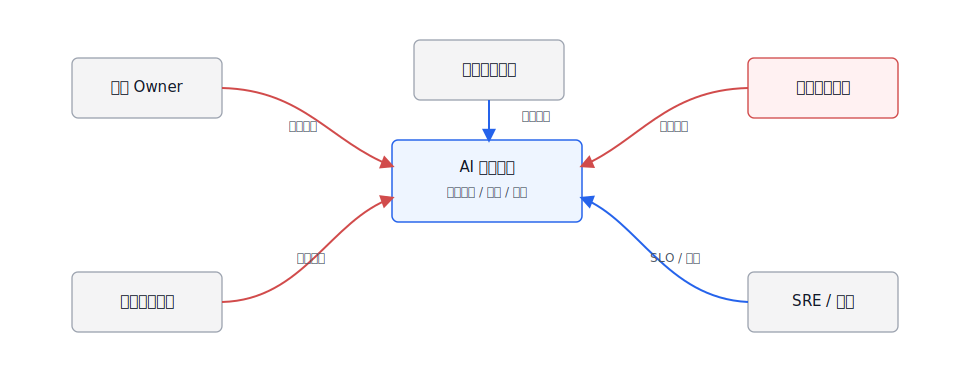
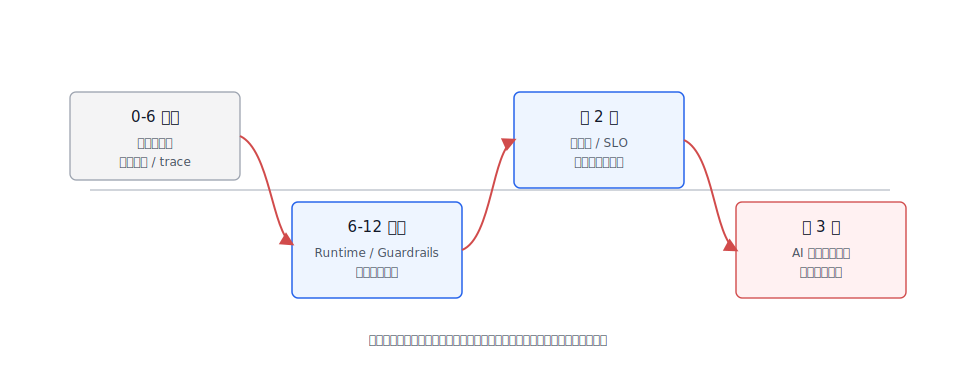

# 第53章 组织、人才与平台演进路线图

---

企业做 Agent 平台最容易卡在两个极端。一个极端是每个业务团队各做一个演示系统，短期热闹，半年后留下几套没人维护的 prompt、脚本和账号；另一个极端是平台团队一开始就追求大而全，做出一套没人愿意接入的“AI 中台”。比较稳的节奏通常从少数高价值场景开始：先证明问题值得做，再把反复出现的 Runtime、工具、评估、安全和观测能力抽成平台，后续用运营指标和治理机制决定继续投入、收敛还是下线。

平台建设的失速往往发生在第二阶段。第一个试点靠几名工程师和业务专家能跑起来，第二个、第三个场景开始复用时，问题就暴露出来：工具注册没人维护，语义层口径没人负责，评估样本散在各业务团队，安全策略只在上线前人工看一遍，SRE 只监控容器和接口，不知道一次 Agent Run 是否真的完成。平台团队被不断拉去做定制，公共底座反而没人打磨。

另一个常见问题是责任错位。业务 Owner 希望平台保证业务结果，平台团队希望业务团队提供样本和验收，数据团队只承诺表可用，不承诺指标解释，安全合规团队只在发布前审批，运维团队只看基础设施。Agent 平台把模型、数据、工具和流程连在一起后，这些责任缺口会直接变成事故：错误答案无人解释，越权调用无人复盘，成本飙升无人承担，低使用率场景还在继续占用平台资源。

组织、人才与路线图要回答三个问题：谁负责平台能力，谁负责业务结果，试点怎样迁移到可运营的公共服务。团队分工、ROI 与 SLO 度量，以及从试点到三年演进的建设节奏，决定平台能否从演示项目变成长期运行的公共能力。本章把技术问题放回组织语境里讨论：谁负责模型、工具、数据、评估、安全和上线；试点成功后如何避免变成一次性项目；ROI 和 SLO 怎么度量；团队需要哪些角色；三年路线图如何从单点应用走到企业 AI 原生业务系统。

这里的重点是让责任落到平台运行中，组织架构图只是表达工具。一个场景要上线，业务 Owner 要给出价值目标和验收样本，数据团队要承诺口径和权限，平台团队要提供 Runtime、Registry、评估和观测，安全合规团队要定义门禁，SRE 要承接 SLO 和事故响应。任何一方缺席，试点都可能看起来成功，生产运营却很快失控。

---

## 53.1 AI 平台团队的职责边界

AI 平台团队不负责替所有业务写 Agent，也不是模型 API 采购部门。它的职责是提供共享能力、接口契约、运行治理和工程基线，让业务团队更快、更安全地构建 Agent 应用。业务团队仍然要负责业务流程、数据解释、验收标准和运营结果。

职责分工越晚讲清，项目越容易变成“平台团队背所有锅”或“业务团队各自造轮子”。表 53-1 有意把平台、业务、数据、安全和运维拆开，因为这些角色在真实项目里经常混在一起。

责任边界最好在场景立项时就写入工作方式。业务团队如果只给一句“提升客服效率”，平台团队无法设计评估集；数据团队如果只给底表，不给指标口径和字段 owner，DataAgent 很难解释结果；安全团队如果只在上线前看一遍，工具权限和敏感字段早已进入设计；SRE 如果只在部署后接手，Agent 的失败状态、降级路径和成本阈值就没有运维语义。越早把这些责任写清，后续平台复用越容易。

*表53-1：企业 Agent 平台团队责任分工。来源：本书整理。*

| 角色 | 主要责任 | 不应承担的责任 |
|---|---|---|
| AI 平台团队 | Runtime、Tool Registry、RAG、评估、观测、Guardrails、网关和平台规范 | 替所有业务定义流程和业务 KPI |
| 业务应用团队 | 业务场景、用户流程、工具接入、验收样例、上线运营 | 自建一套不可复用的模型网关和安全策略 |
| 数据平台团队 | 数据源、语义层、指标口径、血缘、权限、数据质量 | 让模型直接绕过数据契约访问底层表 |
| 安全合规团队 | 风险分级、红队、内容安全、审计、合规证据和发布验收 | 只在上线前人工审批，不参与设计阶段 |
| SRE / 运维团队 | SLO、容量、成本、发布、回滚、事故响应 | 只监控基础设施，不看 Agent 任务质量 |
| 业务 Owner | 价值目标、资源投入、流程改造、最终责任 | 把“模型回答得好不好”全部推给平台团队 |

表 53-1 要解决的是责任归属，不是汇报关系。Agent 平台把模型、数据和工具连接起来后，单个团队很难独立承担全部风险。平台团队提供可复用能力，业务团队给出业务判断，安全合规团队定义风险边界，SRE 负责运行质量。边界不清时，平台团队很容易被当成项目外包；边界画得太硬，平台又会变成无人使用的公共设施。

这种责任共担需要一套协作模型承载。图 53-1 中蓝色是内部平台和业务组件，灰色是外部/横向系统，红色是决策和控制流；它提醒平台负责人，Agent 平台不能由单个团队闭门建设。



*图53-1：AI 平台团队责任分工。来源：本书自绘。Alt text：同心圆图，内圈是 AI 平台团队（共享能力：Runtime、Registry、Guardrails、治理），外圈是业务应用团队（使用平台能力构建垂直场景），边界线标注哪些向业务开放、哪些由平台统一维护。*

图 53-1 按责任流组织。业务 Owner 决定价值和流程边界，数据平台保证数据契约，AI 平台提供可复用运行能力，安全合规定义门禁，SRE 负责运行质量。红色决策流上的空位，通常会在上线后变成具体事故：错误答案无人解释，越权访问无人处理，成本飙升和可用性下降无人负责。

## 53.2 从试点到平台化运营

业务试点的目标是验证价值，平台化的目标是稳定复用。很多 Agent 项目在演示阶段效果不错，进入生产却走不下去，原因通常在工程路径上：没有评测集，没有安全基线，没有上线 SLO，没有成本模型，也没有数据和工具的版本治理。

试点成功后，管理动作不应只是追加更多场景，而要进入阶段评审。表 53-2 中的四段路径，对应不同产出、管理方式和退出条件；每个场景都应明确是继续试点、抽象平台能力、进入运营治理，还是因为价值不足而退出。

*表53-2：从试点到平台化运营的阶段。来源：本书整理。*

| 阶段 | 目标 | 关键产出 | 退出条件 |
|---|---|---|---|
| 场景验证 | 找到真实痛点和可衡量价值 | 业务问题、样例集、人工 baseline、风险初评 | 业务 Owner 愿意投入数据和流程 |
| 工程试点 | 验证端到端链路 | 最小 Agent、工具接入、评估集、trace、权限策略 | 在受控用户群达到质量和安全门槛 |
| 平台复用 | 抽取共享能力 | 通用 Runtime、Tool Registry、RAG、Guardrails、评估和观测 | 第二、第三个场景复用平台能力 |
| 运营治理 | 持续改进和规模化 | SLO、成本看板、红队回归、版本治理、事故响应 | 平台成为业务系统的一部分 |

DataAgent 往往会经历这四个阶段。第一阶段可能只是一个 ChatBI 原型；第二阶段要接入语义层、权限和 SQL 评估；第三阶段把 NL2SQL、指标检索、图表和报告能力平台化；第四阶段则要看真实业务采纳、查询成功率、错误修复周期和成本。

这条路径不是单向晋级。图 53-2 保留了回退机制：试点中发现数据质量不够，就回到场景和数据准备；平台复用时出现安全事故，就回到基线和发布验收。


*图53-2：试点到平台化运营路径。来源：本书自绘。Alt text：横向路径分四阶段，单场景试点、多场景试点、平台化沉淀、规模化运营，每阶段标注关键里程碑和常见失速点，箭头表示推进节奏与决策门禁。*

回退路径给管理层一个现实预期：试点演示通过，不等于自动进入生产。数据质量、权限、评估、成本或安全任一条件不满足，都应该回到前一阶段补齐证据。否则平台化会把试点阶段的临时方案复制到更多业务里，后续治理成本反而更高。

试点进入平台化前，还要做“可复用性复盘”。如果一个能力只服务单个业务流程，且规则变化频繁、价值不稳定，可能继续留在业务应用里；如果多个场景都需要工具注册、审批、Trace、评估、语义层或报告 Artifact，就应抽成平台能力。很多团队的问题在于抽象太早，而不是抽象太少：第一个 demo 刚跑通，就开始设计通用平台，结果平台能力和真实场景脱节。更稳的节奏是等第二、第三个场景暴露重复需求后再沉淀。

可复用性复盘还要看谁愿意承担运营。一个能力被抽到平台后，平台团队要负责版本、文档、SLO、支持和事故响应；业务团队要接受统一接入规范，不能继续绕过平台做私有改动。若双方都只想要“公共能力”的名义，却没人承担长期维护，这个能力很快会变成新的技术债。

## 53.3 ROI、SLO 与价值度量

Agent 平台的 ROI 不能停在 token 成本和人力节省上。很多价值来自响应速度、质量稳定性、知识复用、风险降低和流程重构。平台负责人需要同时看价值、质量、成本和风险。

因此，Agent 平台的度量要同时覆盖业务、质量、运行和成本风险。表 53-3 的四组指标，可以避免团队只讲模型准确率，或者只用降本数字证明平台价值。

*表53-3：Agent 平台价值度量体系。来源：本书整理。*

| 维度 | 指标 | 说明 |
|---|---|---|
| 业务价值 | 使用率、任务完成率、节省时长、收入/转化影响、流程周期缩短 | 判断是否真的进入业务流程 |
| 质量效果 | answer pass rate、tool success rate、citation correctness、SQL execution pass rate | 判断 Agent 是否可靠 |
| 运行质量 | p95 延迟、可用性、错误率、降级率、恢复时间 | 对齐 SRE 和业务体验 |
| 成本风险 | token 成本、GPU/向量库成本、人工复核成本、安全事件、误杀漏杀 | 判断规模化是否可持续 |

SLO 要和场景风险绑定。内部知识问答可以允许更高延迟和更多拒答；客服辅助要关注响应速度和转人工；DataAgent 要关注 SQL 可执行率、引用正确性和数据权限；高风险法务或财务场景要宁可拒答，也不要错误执行。

不同场景的 SLO 也不应该套同一模板。表 53-4 延续前面章节的评估和安全门禁，把 SLO 写成取舍：高风险场景优先质量和人工复核，低风险高频场景才更适合延迟或成本优先。

ROI 也要避免只算“节省了多少人”。有些 Agent 的直接节省不高，但能缩短跨部门等待时间、降低新人培训成本、减少高风险错误、让知识复用更稳定；有些 Agent 演示时看起来节省工时，实际需要大量人工复核和问题修复，规模化后 ROI 会下降。平台团队应把业务收益、复核成本、事故成本和平台复用率放在同一个口径下看。

*表53-4：Agent 平台 SLO 取舍表。来源：本书整理。*

| 方案 | 优势 | 代价 | 适用场景 | mini-platform 选择 |
|---|---|---|---|---|
| 质量优先 | 降低错误和风险，适合高影响决策 | 延迟和成本更高，拒答更多 | 法务、财务、DataAgent 高风险分析 | 高风险场景默认 |
| 延迟优先 | 体验好，适合高频交互 | 可能减少检索、重排和校验 | 客服辅助、前台 Copilot | 低风险高频场景可选 |
| 成本优先 | 有利于规模化和预算控制 | 可能牺牲质量和可解释性 | 内部低风险知识问答 | 作为降级策略 |
| 人工复核优先 | 责任清晰，风险最低 | 自动化率低，流程变重 | 写入、导出、外部通知、合规结论 | 高风险动作强制 |

## 53.4 人才结构与能力模型

企业 Agent 平台需要复合型团队。单靠算法工程师不够，单靠应用开发也不够。团队要同时理解模型、数据、后端、前端、SRE、安全、合规和业务流程。

团队建设要按能力缺口来判断，不能按人数粗略估算。表 53-5 不要求每个人都会所有事情，它帮助负责人看清哪些能力已经有人负责，哪些能力还停留在“大家都懂一点”的状态。

*表53-5：Agent 平台人才能力模型。来源：本书整理。*

| 能力域 | 关键能力 | 常见角色 |
|---|---|---|
| 模型与提示 | 模型选型、prompt、结构化输出、评估、微调边界 | AI 工程师、模型平台工程师 |
| Agent 工程 | Runtime、工具调用、状态机、异步任务、错误恢复 | 后端工程师、Agent 平台工程师 |
| 数据智能 | 语义层、NL2SQL、RAG、指标口径、数据权限 | 数据工程师、数据智能工程师 |
| 产品与交互 | 任务工作台、Generative UI、反馈、人工复核 | 产品经理、前端工程师 |
| 安全合规 | Guardrails、红队、DLP、审计、法规控制矩阵 | 安全工程师、合规负责人 |
| 运行与成本 | SLO、容量、成本、灰度、回滚、事故响应 | SRE、平台运维、FinOps |
| 业务运营 | 场景选择、流程改造、培训、采纳和价值复盘 | 业务 Owner、运营负责人 |

组织上可以从小团队开始，但角色不能缺席。早期一个人可以兼任多项能力，后期再逐步专业化。平台负责人要盯住协作是否成立：业务提出问题，数据提供证据，平台提供能力，安全定义边界，SRE 保障运行，运营把使用率、失败样例和成本带回下一轮路线图。

人才能力还要跟平台阶段匹配。试点阶段最缺的是能把业务问题、数据和 Agent 链路串起来的人；平台复用阶段最缺的是 Runtime、工具治理、评估和前端工作台工程能力；规模化运营阶段最缺的是 SRE、FinOps、安全合规和平台产品经理。若组织一直用试点团队去支撑规模化运营，团队会被事故、成本和接入支持拖垮。

这也是很多平台团队扩张时的分水岭。早期英雄式推进可以让第一个场景很快上线，但规模化阶段需要轮值、文档、接入模板、培训、支持队列和问题分级。组织如果仍然把所有问题都找最初几名核心工程师处理，平台看似有人负责，实际没有运营体系。

平台演进路线图要把这些运营动作写进去。只写 Runtime、评估平台和安全网关，会让路线图看起来技术完整；同时写接入模板、值班机制、业务复盘、下线标准和成本归因，路线图才真正可执行。Agent 平台最后比拼的是谁能让更多业务场景按同一套工程纪律持续运行，而不是谁的功能目录更长。

路线图中的每个季度都应留下可检查产物，而不是只留下会议结论。

## 53.5 三年平台演进路径

三年路线图不应写成“第一年做模型，第二年做平台，第三年做生态”这种口号。更实际的做法是按平台能力成熟度推进：从场景验证，到共享能力，再到治理运营，逐步进入 AI 原生业务系统。

不同企业节奏会不同，但能力顺序大体类似：先证明价值，再抽象平台能力，再补运行治理，之后才谈业务系统重构。表 53-6 是这条路线的参考版本，不是固定模板。

*表53-6：三年 Agent 平台演进路线图。来源：本书整理。*

| 阶段 | 能力重点 | 组织重点 | 里程碑 |
|---|---|---|---|
| 0-6 个月 | 选 2-3 个高价值场景，建立模型网关、基础 RAG、工具注册、trace 和评估集 | 建立平台小队和业务 Owner 机制 | 第一个生产试点，有质量、安全和成本报告 |
| 6-12 个月 | Runtime、Guardrails、语义层、DataAgent、前端工作台、红队回归 | 建立发布验收和跨团队评审 | 多个场景复用平台组件，形成标准接入流程 |
| 第 2 年 | 多租户、SLO、成本治理、模型路由、评估平台、合规控制矩阵 | 平台运营化，业务团队自助接入 | Agent 成为若干业务流程的稳定入口 |
| 第 3 年 | AI 原生业务系统、跨 Agent 协作、流程重构、生态工具市场 | 建立平台产品线和持续治理机制 | 从单点 Agent 走向企业级 AI 应用底座 |

路线图还要回到能力地图。图 53-3 把能力复用、运行治理、业务价值、安全合规放在同一张图里，是为了防止路线图变成功能堆叠。长期缺少复用，平台会退回项目制；长期缺少治理，平台会放大风险；长期缺少业务价值，平台会失去投入依据。



*图53-3：三年平台演进路线图。来源：本书自绘。Alt text：时间轴分第一年（基础能力建设：Runtime/Registry/Guardrails）、第二年（扩展能力：评测/成本/多 Agent）、第三年（成熟运营：自服务/规模化/生态），每阶段标注重点建设项。*

图 53-3 不是固定工期表。第一年没有 trace、评估和安全基线，第二年做多租户和自助接入会放大风险；第二年没有 SLO 和成本治理，第三年的业务系统重构也缺少运营依据。路线图还要保留退出机制：有些 Agent 不值得继续平台化，有些业务流程也不适合自动化。平台团队应定期下线低价值、高风险、低使用率的 Agent，把资源留给可复用、可运营的场景。

路线图评审还要区分“能力建成”和“能力被采用”。Runtime 写完代码不代表业务线已经按统一状态机接入；评估平台上线不代表每个 Agent 都有回归集；Guardrails 有配置页面不代表高风险工具都进入审批链。平台团队在季度复盘中应同时报告能力覆盖率和采用率，避免只汇报建设进度。真正的里程碑，是第二个、第三个场景能少写重复代码、少做重复评审、少踩相同事故。

组织上，三年路线图也不应只属于平台团队。业务 Owner 要对场景价值和人工确认负责，数据团队要对口径和权限负责，安全合规团队要对策略和审计负责，SRE 要对 SLO 和事故响应负责。平台团队如果把所有责任都揽到自己身上，短期推进会快，长期会形成维护瓶颈；如果只提供框架而不进入复盘，又会失去平台标准。成熟路线图要把能力、责任和运营节奏一起写进去。

## 53.6 平台成熟度评估设计

本节给出一个平台成熟度评估表设计，把前面章节的能力转成可评分项。输入是当前平台能力、已上线场景、SLO、评估、安全和合规证据；输出是一份成熟度报告和下一季度路线建议。

若后续将它纳入 mini-platform，可以采用如下目录结构；当前仓库尚未包含该实验目录，本节不提供可运行命令。

```text
mini-platform/projects/platform-maturity-assessment/
├── README.md
├── configs/
│   ├── maturity_model.yaml
│   └── weights.yaml
├── samples/
│   └── platform_snapshot.yaml
├── scripts/
│   ├── score_maturity.py
│   └── generate_roadmap.py
└── reports/
    └── maturity_assessment.md
```

平台快照可以这样记录。

```yaml
platform:
  scenarios:
    production: 3
    pilot: 5
  capabilities:
    model_gateway: true
    tool_registry: true
    rag_pipeline: true
    eval_platform: partial
    guardrails: partial
    compliance_matrix: false
    slo_dashboard: partial
  metrics:
    monthly_active_users: 820
    task_success_rate: 0.72
    p95_latency_seconds: 9.8
    monthly_model_cost_usd: 4200
```

成熟度报告最好不要只给一个总分。平台负责人需要知道能力短板在哪里、业务采纳是否真实、运行质量是否稳定、治理是否跟上、成本是否可持续。图 53-4 把这些信息组织成平台经营仪表盘，适合放进季度复盘和路线图评审。


*图53-4：Agent 平台成熟度仪表盘。来源：产品界面截图。Alt text：仪表盘展示场景覆盖率、平台共享能力采用率、SLO 达标率、安全事件数等维度的雷达图或仪表，体现平台成熟度的可量化评估。*

图 53-4 更适合放进季度复盘，而不是项目汇报。领导层先看业务采纳是否真实，再看质量、可靠性、治理和成本是否支撑规模化；如果活跃用户增长很快，但红队回归和合规证据仍停留在 partial，下一季度的优先级就不该继续堆新场景，而要补治理和运行能力。

成熟度评审也要敢于下线。某些 Agent 使用率低、复核成本高、错误风险大，继续维护只会占用平台资源；某些场景需要业务流程重构，短期用 Agent 硬补反而会制造更多例外。季度复盘不能只讨论新增场景，也要讨论合并、收敛、降级和下线。平台经营要像管理产品组合，而不是无限接项目。

一份成熟度报告至少要分成六段。第一段是 capability score，分别看模型、数据、Agent、前端、安全、评估和运维能力，不把所有能力揉成一个平均分。第二段是 business adoption，说明上线场景、活跃用户、任务完成率和业务 Owner 覆盖率，防止“平台功能很多但无人使用”。第三段是 reliability score，关注 SLO、事故、恢复时间和降级能力。第四段是 governance score，检查 Guardrails、红队、合规矩阵和审计证据是否跟上。第五段是 cost score，把 token、GPU、向量库、人工复核和单位任务成本放在同一口径下看。最后一段才是 next roadmap，写清下一季度优先补齐的能力、负责人和退出条件。

这种写法比一个总分更接近管理现实。平台成熟度评估要看短板是否与下一阶段目标匹配，不能只看分数高低。如果下一季度要让业务团队自助接入，能力短板可能在模板、权限、文档和支持流程；如果下一季度要开放外部客户，短板可能在合规证据、内容标识和事故响应。成熟度评估的作用，是把路线图从愿望清单拉回当前约束。

## 53.7 平台运营的节奏与取舍

AI 平台团队的工作节奏不能完全照搬传统中台。Agent 能力变化快，业务试点也会不断暴露新需求；但权限、审计、成本和 SLO 又要求平台保持稳定。成熟做法是围绕高复用、高风险、高成本的能力先收口，而不是一开始就做大而全的平台：模型网关、Tool Registry、Runtime、Trace、Policy 和评测集。

组织分工要避免两个极端。平台团队若包办所有业务 Agent，会成为交付瓶颈，也难以理解每个业务流程；业务团队若各自接模型和工具，安全和成本会失控。更合理的边界是：平台提供运行底座、工具治理、观测评测和发布门禁；业务团队负责场景目标、数据解释、验收样本和运营结果；安全、法务和数据治理团队提供策略和复核机制。

ROI 也要分阶段看。试点阶段看节省的人力时间和任务完成率，平台化阶段看复用率、单位 Run 成本、事故率和上线周期，成熟阶段看业务流程是否真的被重构。若只看单个 demo 的节省时间，平台投入会显得过重；若只看长期愿景，第一版又会迟迟不能上线。

人才结构应围绕链路配置。模型工程师、后端工程师、数据工程师、前端工程师、SRE、安全和业务专家都需要参与，但不必每个团队都配齐。平台团队应沉淀模板、接口和评测方法，让业务团队可以在受控边界内自助构建。组织能力的目标，是减少重复建设，而不是把所有决策集中到一个团队。

## 53.8 平台运营的固定节奏

组织治理不能只靠项目启动会和年度规划。Agent 平台进入生产后，需要固定运营节奏，把需求、质量、成本、安全和用户反馈放在同一张桌面上。比较有效的节奏包括每周查看运行指标和失败样本，每月复盘重点场景和发布质量，每季度调整平台路线和组织分工。节奏不必复杂，但必须稳定。

每周运营关注短周期问题：失败率上升、工具超时、用户投诉、安全拦截、成本异常和高频问题变化。每月复盘关注系统性问题：哪些场景适合继续自动化，哪些需要降级为辅助模式，哪些工具或知识库需要重构。季度规划则关注平台能力：Runtime、Trace、Eval、Guardrails、语义层和前端体验是否支撑下一批业务场景。

运营会议应当基于证据，而不是基于感受。Trace 给出运行事实，Eval 给出质量变化，成本系统给出预算消耗，业务反馈给出价值判断。平台团队的职责是把这些信息翻译成工程动作：修复样本、调整策略、下线工具、补齐权限、优化模型或改变产品入口。组织治理如果不能落到这些动作，就会变成流程汇报。

固定节奏还要保护平台团队的时间。没有运营节奏时，所有问题都会变成临时插单：业务要新场景，安全要补审计，SRE 要降成本，领导要看成效。平台团队被不断打断，就很难沉淀公共能力。把需求、事故、质量和路线图放进固定节奏，反而能减少随机沟通，让团队有时间做真正可复用的底座。

## 53.9 责任分工的演进方式

平台早期通常由少数工程师同时负责模型、工具、前端、数据和运维。随着场景增加，这种方式会很快到达上限。组织需要逐步拆分责任：平台团队负责共享能力，业务团队负责场景逻辑，数据团队负责语义层和数据质量，安全合规团队负责策略和审计，运维团队负责 SLO 和成本。拆分要让每类问题有明确 owner，不能只是增加流程。

责任分工应跟随平台成熟度演进。试点阶段可以允许业务团队快速搭建 Agent，但必须接入基础日志和权限边界；生产阶段要求所有场景进入统一 Runtime、Trace 和工具治理；规模化阶段则需要平台提供模板、评测、发布和运营工具，让业务团队在边界内自助迭代。每个阶段的控制力度不同，不能用同一套流程管理所有场景。

组织章节的核心结论是：Agent 平台不是一个纯技术项目。它会改变需求提出、数据治理、系统集成、安全审查和运营复盘的方式。只有把责任分工和固定运营节奏建立起来，前面章节讨论的工程能力才不会停留在文档和 Demo 里。

## 53.10 平台能力的投资顺序

组织路线图需要明确投资顺序。很多团队会先投入前端体验和场景包装，因为它们最容易展示价值；但如果 Runtime、Trace、工具治理和评测没有跟上，试点越多，后续债务越重。比较稳妥的顺序是先打通少量高价值场景，同时建设最小平台底座，再把可复用能力逐步抽出来。

第一阶段重点是闭环完整，而不是功能丰富：一个场景从用户请求、模型调用、工具执行、证据记录、人工复核到评测样本都能走通。第二阶段再扩大场景数量，沉淀工具目录、语义层、Guardrails 和发布流程。第三阶段才适合强调自助开发、平台运营和组织规模化。过早开放自助开发，会让平台在治理能力不足时承接过多风险。

投资顺序还要考虑团队能力。没有数据治理基础时，先做复杂 DataAgent 会暴露大量口径问题；没有安全审计能力时，先开放写操作工具会放大风险；没有评测体系时，先大规模替换业务流程会难以证明效果。组织路线图应承认这些前置条件，而不是把所有能力同时列为年度目标。

## 53.11 价值度量的证据口径

Agent 平台的 ROI 不能只看节省了多少人时。很多收益来自质量稳定、响应速度、知识复用、审计成本下降和业务流程缩短。不同场景的价值口径不同：客服场景可以看一次解决率和升级率，数据分析场景可以看问数周期和报告复用，合规场景可以看审计准备时间和问题闭环时间。统一用一个效率指标，会掩盖真实价值。

价值度量也要防止重复计算。一个 Agent 生成报告后，业务人员仍然花大量时间复核和改写，不能把整份报告的人工时间都算作节省。更合理的做法是记录自动生成、人工修订、最终采纳和后续动作，把价值拆到链路里。这样平台团队能知道哪些环节真正减少了工作，哪些只是把工作从写作转移到审核。

组织层面的度量要和第38章 Trace、第39章 Eval、第41章成本治理连接。质量、成本和价值必须放在一起看。一个场景调用量高但错误多，不能算成功；一个场景质量高但成本不可控，也不适合扩大。平台运营需要这种综合证据，而不是单点指标。

## 53.12 平台治理委员会的实际职责

大型企业往往会成立 AI 治理委员会，但委员会如果只做原则审批，很难影响平台质量。更实际的职责是确定场景准入标准、风险分级、发布门禁、事故分级、数据使用边界和跨团队责任。委员会不需要参与每个 Agent 的实现细节，但要决定哪些规则是全公司一致的，哪些可以由业务域自行配置。

治理委员会还应定期查看运行证据。高风险场景数量、人工审批情况、安全拦截、合规样本失败、重大事故、成本变化和业务价值，都应进入固定议题。这样治理会成为持续运营的一部分，而不只是上线前签字。若委员会只在事故后出现，平台团队平时就缺少明确决策依据。

治理机制要避免拖慢所有创新。低风险场景可以走轻量准入，高风险场景走完整评审；试点阶段可以限制数据和工具范围，生产阶段再要求完整 Trace 和评测。分层治理能让业务继续试错，同时保护核心系统边界。

## 53.13 平台能力的文档与培训

Agent 平台要被组织采用，文档和培训不能只介绍功能。业务团队需要知道哪些场景适合 Agent，哪些不适合；开发者需要知道如何注册工具、编写评测样本、查看 Trace；安全和合规团队需要知道策略和证据在哪里；管理者需要知道如何看价值和风险。不同角色需要不同文档。

培训也应围绕真实工作流。与其讲“Agent 能力概览”，不如带团队走一遍从场景申请、工具注册、语义层配置、灰度发布、线上反馈到事故复盘的完整过程。这样各角色能看到自己的责任位置，也能理解平台边界。培训材料还应随着平台版本更新，否则业务团队会继续沿用旧流程。

组织章节最后落到一个现实判断：平台能力只有被正确使用，才会形成生产力。工程系统、治理流程、文档培训和运营节奏缺一项，Agent 平台都会停留在少数专家手里。要让第一版书稿像正式出版物，就需要把这种组织落地写清楚，而不是只写技术模块。

## 本章小结

Agent 平台不能按一次性项目管理。技术团队要维护 Runtime、工具、数据、评测、Guardrails 和观测；业务 Owner 要对任务结果负责；安全合规和 SRE 要进入发布、事故和复盘流程。缺少这些角色约束，平台很容易变成一组互不兼容的试点。

三年路线图不应停在功能清单。它要写出成熟度怎样变化：试点证明价值后，要抽出可复用底座，进入运营规则，再支撑 AI 原生业务系统。进展通常取决于谁更早把 Agent 纳入工程、风险和组织流程，而不是谁最早做出演示系统。

判断平台是否成熟，不看上线了多少 Agent，而看第二个业务场景能否复用第一个场景的 Runtime、Registry、Trace、Eval 和 Guardrails；一次事故能否被定位、复盘并转成回归样例；成本、质量和风险能否按业务线归因；低价值场景是否有下线机制。第一版路线图可以克制一些，先选择一到两个能贯穿运行链路的场景，用季度评审决定扩展、收敛或下线。

## 参考文献

- [NIST AI Risk Management Framework](https://www.nist.gov/itl/ai-risk-management-framework)
- [Google Secure AI Framework](https://saif.google/)
- [Microsoft Responsible AI Standard](https://www.microsoft.com/en-us/ai/principles-and-approach)
- [ISO/IEC 42001 AI management system](https://www.iso.org/standard/81230.html)
- [OpenTelemetry Semantic Conventions for GenAI](https://opentelemetry.io/docs/specs/semconv/gen-ai/)
