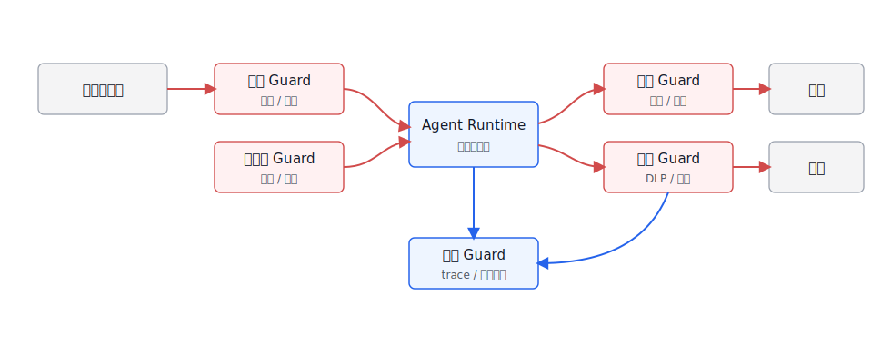
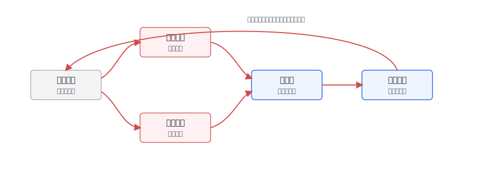

# Ch.51 Guardrails 与内容安全

> **状态**：v0.2 初稿
> **本章目标**：读者读完后，能够设计一套企业 Agent Guardrails 分层架构，区分内容安全、权限策略、业务约束和输出校验，并配置可观测、可回归的 Guardrails 网关。
> **关键议题**：Guardrails 分层架构；内容安全分类器；可编程策略引擎；脱敏过滤与输出校验；策略误杀漏杀治理；工程实验：可配置 Guardrails 网关。
> **前置阅读**：Ch.23 Tool Registry & Function Calling；Ch.30 Human-in-the-loop；Ch.38 可观测性与 Trace；Ch.50 安全与攻防。
> **估计阅读**：L1 15 min / L1+L2 45 min / 全章 90 min
> **mini-platform 关联**：`mini-platform/core/guardrails/`、`mini-platform/core/policy/`、`mini-platform/core/gateway/`、`mini-platform/core/observability/`。

**本章阅读路径**

| 读者 | 建议重点 |
|---|---|
| AI 平台负责人 / CTO | 看 Guardrails 如何成为平台能力，而不是每个应用各写一套 if-else。 |
| 架构师 | 看输入、上下文、工具、输出和审计五层如何串成策略链。 |
| 数据智能工程师 | 看 DataAgent 的 SQL、指标、字段和图表输出如何纳入 guardrail。 |
| AI 应用开发者 | 看网关配置、策略返回结构、误杀漏杀样例和回归报告。 |
| 安全 / 合规负责人 | 看内容安全分类、脱敏、审计、审批和策略治理。 |

Guardrails 这个词容易被误解成“在模型前后加一层内容审核”。这只是其中一部分。企业 Agent 的 Guardrails 至少要覆盖四类约束：内容安全，防止违法、有害、敏感或不适合输出的内容；权限安全，防止越权访问和工具滥用；业务安全，防止违反流程、口径、审批和风控规则；工程安全，防止不可解析输出、危险代码、无引用回答和失控重试。

NVIDIA NeMo Guardrails 提供了围绕对话流程、检索和工具行为的 rails 思路；Meta Llama Guard、OpenAI Moderation、Azure AI Content Safety 等服务把内容分类器产品化；很多企业还会在网关层接入自有敏感词、DLP、PII 检测和审批策略。它们不是互斥路线，而是要放在同一个平台架构里分工。

本章按照企业落地顺序展开：先明确 Guardrails 分层架构，再讨论内容安全分类器和策略引擎，随后讲脱敏过滤与输出校验，最后处理误杀漏杀治理和可配置网关实验。

## Guardrails 分层架构

Guardrails 的第一原则是分层。输入 guardrail 处理用户消息、附件和 URL；上下文 guardrail 处理检索文档和工具返回值；工具 guardrail 处理动作授权；输出 guardrail 处理最终回答、图表、代码和导出；观测 guardrail 记录策略命中和误判样例。把这些都叫“内容审核”会掩盖真正的工程边界。

沿着执行链路看，Guardrails 不是一个单独组件，而是一组分布在不同位置的控制点。表 51-1 按执行位置拆分职责，既承接 Ch50 的攻击面，也把“应该在哪里拦截、在哪里脱敏、在哪里审批”变成工程问题。

**表 51-1：Guardrails 分层职责**

| 层级 | 检查对象 | 典型策略 | 失败时动作 |
|---|---|---|---|
| 输入层 | 用户消息、附件、URL、语音转写 | 内容安全、意图风险、越权请求、速率限制 | 拒绝、澄清、降级、转人工 |
| 上下文层 | RAG chunk、网页、工具返回值、记忆 | 来源信任、注入检测、敏感字段、过期内容 | 隔离、脱敏、降低权重、禁止进入上下文 |
| 工具层 | 工具名、参数、资源、动作类型 | RBAC/ABAC、风险等级、审批、幂等性 | 拒绝、要求确认、签发短令牌 |
| 输出层 | 文本、SQL、代码、图表、导出文件 | 内容安全、引用校验、格式校验、DLP | 重写、拒答、脱敏、标注风险 |
| 观测层 | 策略命中、用户反馈、人工复核 | 命中率、误杀、漏杀、漂移、事故关联 | 告警、回归、策略版本调整 |

这五层如果只写在文档里，仍然容易被实现成一堆散落规则。图 51-1 中的布局把它们放回 Agent Runtime 周围：蓝色是平台内控点，灰色是外部系统，红色控制流表示策略判断。它强调的判断很简单：Guardrails 不是模型外面的单层代理，而是贯穿任务执行链路的策略网络。



**图 51-1：Guardrails 分层架构**

这张图的价值在于把“拦截”拆成多个时点。输入层可以判断用户是否在请求敏感明细，但它并不知道后续检索会带出哪些字段；上下文层可以隔离低信任文档，但它无法判断工具参数是否越权；输出层可以做脱敏，但如果原始工具结果已经进入前端状态，泄露已经发生。DataAgent 里的 Guardrails 也应按这个结构落地：字段说明和历史 SQL 是否可用于当前角色，SQL 是否带租户过滤和字段权限，图表、表格和解释是否泄露敏感信息，都要在对应阶段处理，最后由观测层把被拒绝的查询和人工改写沉淀成评测样例。

## 内容安全分类器

内容安全分类器解决的是“这段内容属于什么风险类别”。Azure AI Content Safety、OpenAI Moderation、Llama Guard 等工具通常会覆盖暴力、自伤、色情、仇恨、违法、危险建议等通用类别；企业内部还要补充行业相关类别，例如金融投资建议、医疗诊断建议、涉密信息、客户隐私、员工隐私和品牌风险。

分类本身不是目的。企业真正关心的是某个风险类别出现后，平台要拒绝、脱敏、审批、降级还是放行。表 51-2 因此把内容类别直接映射到平台动作，避免分类器结果停留在“高/中/低风险”的标签上。

**表 51-2：内容安全分类到平台动作的映射**

| 分类 | 典型内容 | 平台动作 |
|---|---|---|
| 明确禁止 | 非法活动、严重伤害、恶意代码、凭证窃取 | 拒绝回答，记录安全事件 |
| 高风险敏感 | 医疗、金融、法务、人事、未成年人、客户隐私 | 限制为一般信息，要求人工或专业系统确认 |
| 企业敏感 | 密钥、合同价格、薪资、客户名单、未发布财报 | 脱敏、拒绝、按角色返回摘要 |
| 可回答但需边界 | 合规解释、流程说明、产品限制、内部制度 | 回答时附适用范围和引用 |
| 正常业务 | 普通知识问答、低风险数据分析、文档总结 | 放行，保留 trace |

分类器的难点不是调用 API，而是上下文。相同文本在不同场景里的处理方式不同。用户问“导出客户手机号”在客服主管角色下可能进入审批，在普通销售角色下应拒绝；“生成裁员沟通话术”在 HR 合规培训里可能是合法案例，在普通聊天里可能需要限制。企业平台必须把内容分类结果和用户、角色、数据域、任务类型一起送入策略引擎。

## 可编程策略引擎

内容安全分类器给出风险判断，可编程策略引擎决定“允许、拒绝、脱敏、审批、降级、记录”。策略引擎是 Guardrails 的核心，因为企业安全要求会随组织、业务、地区和监管变化而变化，不能把所有规则写死在 prompt 或应用代码里。

一个策略请求可以设计成下面的结构。

```json
{
  "trace_id": "trace_guard_001",
  "stage": "tool_call",
  "user": {
    "user_id": "u_1024",
    "tenant_id": "tenant_a",
    "roles": ["sales_manager"]
  },
  "request": {
    "tool_name": "query_customer_metrics",
    "action_type": "export",
    "resource": "dataset://crm/customer_profile",
    "fields": ["customer_id", "customer_phone", "region", "revenue"]
  },
  "risk": {
    "content_categories": ["enterprise_sensitive"],
    "sensitive_fields": ["customer_phone"],
    "risk_level": "high"
  }
}
```

策略响应也要结构化，不能只返回一段自然语言。

```json
{
  "decision": "require_approval",
  "policy_id": "customer_pii_export_v3",
  "reason": "customer_phone export requires manager approval and masking",
  "actions": [
    {"type": "mask_field", "field": "customer_phone"},
    {"type": "require_human_approval", "approval_flow": "pii_export"}
  ],
  "audit": {
    "trace_id": "trace_guard_001",
    "severity": "high"
  }
}
```

策略实现可以从简单开始，但不能继续散落在 prompt 和应用代码里。表 51-3 的取舍结论很直接：第一版不必追求复杂策略语言，先把规则配置化、版本化、可审计化，后续再引入更强的策略引擎或 DSL。

**表 51-3：Guardrails 策略实现取舍表**

| 方案 | 优势 | 代价 | 适用场景 | mini-platform 选择 |
|---|---|---|---|---|
| Prompt 规则 | 实现最快，适合原型 | 不稳定、不可审计、难回归 | 低风险 Demo、快速验证 | 只作为辅助说明，不作为生产策略 |
| 应用内 if-else | 简单直接，依赖少 | 多应用重复、版本混乱、难统一治理 | 单应用、临时规则 | 不作为平台默认 |
| 配置化策略 | 易审计、易版本化、便于灰度 | 表达复杂逻辑时能力有限 | 大多数内容安全、字段脱敏、审批规则 | 默认采用 |
| 策略引擎 / DSL | 表达力强，可接 IAM 和数据策略 | 学习和运维成本更高 | 多租户、跨系统、高风险工具 | 作为高级能力逐步引入 |

在这条链路里，策略引擎不是替代模型，也不是替代业务系统。图 51-2 中它位于模型意图、工具动作和输出展示之间，职责是给每次拦截、审批、脱敏和放行留下可解释原因。


**图 51-2：可编程策略引擎流程**

沿着图 51-2 走一遍会发现，策略引擎处理的不是单一文本，而是一份带身份、场景、工具、资源和风险标签的决策请求。这个结构化输入决定了策略能否被审计和复现：如果只把“模型认为要查客户数据”传给策略层，策略层无法判断这是合法分析、越权导出，还是被 prompt injection 诱导出来的动作。

## 脱敏过滤与输出校验

脱敏不能只发生在最终回答里。敏感信息可能出现在用户输入、检索上下文、工具结果、模型中间输出、前端组件状态、日志和导出文件。一个常见事故是：最终答案没有显示手机号，但完整工具结果已经写入 trace 或浏览器状态。

脱敏一旦只放在最终回答阶段，就已经太晚了。同一字段在输入、检索上下文、工具结果、前端状态和导出文件中的风险不同。表 51-4 对应这些关键位置，让平台在数据流早期就决定哪些内容不能进入模型或日志。

**表 51-4：脱敏与输出校验位置**

| 位置 | 检查内容 | 处理方式 |
|---|---|---|
| 输入进入模型前 | 用户粘贴的密钥、身份证、客户信息 | 标记、脱敏、阻止进入上下文 |
| RAG 上下文组装 | 文档片段中的敏感字段和低信任来源 | 字段级脱敏、来源提示、降低权重 |
| 工具结果返回后 | 明细行、PII、商业秘密、跨租户数据 | 服务端过滤，避免原文进入前端和日志 |
| 输出展示前 | 模型回答、SQL、代码、图表说明 | 内容安全、引用一致性、格式校验 |
| 导出和分享前 | 表格、图片、报告、Artifact | 重新计算权限和脱敏，不复用前端状态 |

输出校验还要处理“结构正确”和“内容可信”两个问题。结构正确指 JSON、SQL、图表 spec、表格 schema 是否符合契约；内容可信指答案是否由证据支持、是否包含敏感字段、是否超出角色权限。DataAgent 尤其要在 SQL 执行前和图表导出前做校验，而不是等模型生成完解释再补救。

## 策略误杀漏杀治理

Guardrails 最大的产品挑战是误杀和漏杀。误杀太多，业务用户会绕过平台；漏杀太多，安全团队无法接受上线。企业要把策略当成可运营资产，而不是一次性配置。

治理指标也不能只看拦截率。拦截率上升可能说明攻击增多，也可能说明策略过严；业务真正关心的是误杀、漏杀、人工复核和体验影响。表 51-5 的指标拆分，正是为了帮助平台团队判断策略是该收紧还是该放松。

**表 51-5：Guardrails 治理指标**

| 指标 | 含义 | 处理方式 |
|---|---|---|
| Block rate | 请求被拒绝或降级的比例 | 监控策略是否过严或攻击增多 |
| False positive rate | 合法请求被误杀比例 | 从用户反馈和人工复核样例中回归 |
| False negative count | 风险请求漏过数量 | 由红队、安全事件和抽检发现 |
| Approval conversion | 进入审批后最终通过比例 | 判断审批是否设置过重 |
| Policy drift | 新业务、新文档、新工具导致策略失效 | 按策略版本和场景做定期回归 |

有了指标，还需要让样例流动起来。图 51-3 中的治理闭环把用户反馈、人工复核、红队失败样例和线上事故都拉回策略样例库；策略调整后再通过灰度和回归进入生产，而不是直接改线上规则。



**图 51-3：Guardrails 策略治理闭环**

这个闭环的重心是回归集。用户反馈、人工复核、红队失败样例和线上事故来源不同，可信度和优先级也不同；进入样例库后，需要先标注期望决策，再通过灰度和回归验证策略版本。这样做的代价是流程更长，但可以避免某个紧急规则直接上线，随后在另一个业务场景造成大面积误杀。

## 工程实验：可配置 Guardrails 网关

Project 18 可以把 Guardrails 做成一个网关实验：同一条用户请求先经过输入分类、上下文检查、工具策略和输出校验，每一层都返回结构化 decision，最终由 Runtime 执行动作。

建议目录结构如下。

```text
mini-platform/projects/18-configurable-guardrails-gateway/
├── README.md
├── configs/
│   ├── policies.yaml
│   ├── classifiers.yaml
│   └── routes.yaml
├── samples/
│   ├── requests.jsonl
│   └── expected_decisions.jsonl
├── scripts/
│   ├── run_gateway_eval.py
│   └── generate_guardrails_report.py
└── reports/
    └── guardrails_gateway_report.md
```

策略配置可以从字段脱敏和动作审批开始。

```yaml
policies:
  - id: pii_export_requires_approval
    stage: tool_call
    when:
      action_type: export
      fields_any: [customer_phone, id_card, salary]
    decision: require_approval
    actions:
      - type: mask_fields
        fields: [customer_phone, id_card, salary]

  - id: no_secrets_in_prompt
    stage: input
    when:
      detector_any: [api_key, private_key, password]
    decision: deny
    actions:
      - type: redact
```

运行命令保持和 Ch50 的安全实验一致。

```bash
cd mini-platform/projects/18-configurable-guardrails-gateway
python scripts/run_gateway_eval.py --config configs/policies.yaml --samples samples/requests.jsonl
python scripts/generate_guardrails_report.py --run reports/latest.jsonl
```

报告需要同时呈现安全和体验，表 51-6 因此把 decision accuracy、误杀、漏杀、延迟和策略覆盖放在一起。只看拦截准确率会忽略用户体验，只看延迟又会掩盖安全缺口；网关是否适合上线，要同时看这几组指标。

**表 51-6：Guardrails 网关评估报告字段**

| 字段 | 说明 |
|---|---|
| Decision accuracy | 与人工标注 expected decision 的一致率 |
| False positives | 合法请求被拒绝、降级或错误审批的样例 |
| False negatives | 风险请求未被拦截的样例 |
| Added latency p95 | 网关带来的 p95 延迟 |
| Policy coverage | 覆盖的工具、字段、动作和内容类别 |
| Regression set growth | 新增回归样例数量 |

## 本章小结

Guardrails 是企业 Agent 平台的控制系统，不是单个内容审核 API。内容分类器负责识别风险，策略引擎负责决策，工具层负责最小权限，输出层负责脱敏和结构校验，观测层负责误杀漏杀治理。

平台第一版不要追求“完美拦截所有风险”，而要做到可配置、可解释、可回归。只要策略决策能被追踪，误杀漏杀能被样例化，Guardrails 就能随着业务和法规一起演进。

### 上线检查清单

- [ ] 输入、上下文、工具、输出和观测五层都有明确策略点。
- [ ] 内容分类结果会进入策略引擎，而不是直接决定所有动作。
- [ ] 敏感字段不会进入模型上下文、前端状态、日志和导出文件。
- [ ] 每次拦截、审批、脱敏和降级都有 `policy_id`、`reason` 和 `trace_id`。
- [ ] 误杀、漏杀、人工复核和红队失败样例进入回归集。

### 参考资料

- [NVIDIA NeMo Guardrails Documentation](https://docs.nvidia.com/nemo/guardrails/latest/)
- [Meta Llama Guard Model Card](https://huggingface.co/meta-llama/Llama-Guard-3-8B)
- [Azure AI Content Safety](https://learn.microsoft.com/en-us/azure/ai-services/content-safety/overview)
- [OpenAI Moderation Guide](https://platform.openai.com/docs/guides/moderation)
- [OWASP Top 10 for Large Language Model Applications](https://owasp.org/www-project-top-10-for-large-language-model-applications/)
