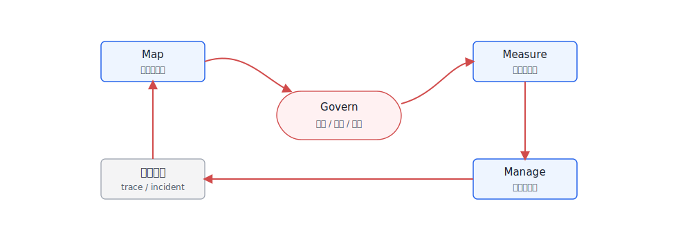
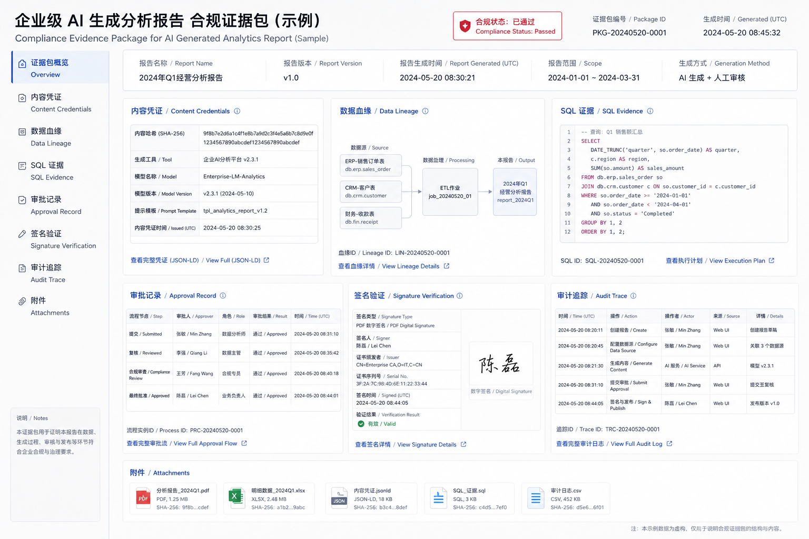

# Ch.52 合规与法规

> **状态**：v0.2 初稿
> **本章目标**：读者读完后，能够把 NIST AI RMF、EU AI Act、中国生成式 AI 相关要求和内容溯源机制翻译成企业 Agent 平台的控制矩阵、证据链和上线门禁。
> **关键议题**：合规工程化框架；NIST AI RMF 风险管理；EU AI Act 风险分级；中国生成式 AI 合规要求；内容溯源与 C2PA；工程实验：合规控制矩阵生成器。
> **前置阅读**：Ch.15 元数据、血缘、契约与指标；Ch.38 可观测性与 Trace；Ch.39 离线评估与基准；Ch.50 安全与攻防；Ch.51 Guardrails 与内容安全。
> **估计阅读**：L1 15 min / L1+L2 45 min / 全章 90 min
> **mini-platform 关联**：`mini-platform/core/policy/`、`mini-platform/core/eval/`、`mini-platform/core/observability/`、`mini-platform/infra/metadata/`。

**本章阅读路径**

| 读者 | 建议重点 |
|---|---|
| AI 平台负责人 / CTO | 看法规如何变成平台控制项、上线门禁和组织责任，而不是停留在法务评审。 |
| 架构师 | 看风险分类、控制矩阵、证据链、模型/数据/应用版本之间的关系。 |
| 数据智能工程师 | 看 DataAgent 的数据来源、SQL 证据、指标口径和输出报告如何进入合规证据。 |
| AI 应用开发者 | 看合规元数据、审计字段、内容标识和报告生成契约。 |
| 安全 / 合规负责人 | 看 NIST AI RMF、EU AI Act、中国生成式 AI 要求和 C2PA 如何映射到工程流程。 |

合规不是上线前填一张表。企业 Agent 平台会处理数据、生成内容、调用工具、影响业务决策，还可能跨地区、跨租户、跨供应商运行。法规和标准真正进入工程后，问题会变成：这个 Agent 属于什么风险等级，用了哪些数据和模型，输出影响谁，谁能复核，事故发生后能不能还原证据。

NIST AI RMF 用 Govern、Map、Measure、Manage 四个功能组织 AI 风险管理；NIST AI 600-1 针对生成式 AI 进一步补充风险轮廓；EU AI Act 采用风险分级思路，对高风险 AI 系统和通用 AI 模型提出不同义务；中国的生成式 AI 服务管理、深度合成管理和生成合成内容标识要求，则强调内容安全、数据来源、标识和服务责任。C2PA 和 Content Credentials 进一步把内容来源、编辑历史和签名证明变成可验证元数据。

本章的写法是把这些要求翻译成平台工程：风险分类、控制矩阵、证据链、内容溯源、审计报告和发布门禁。这里不是法律意见，而是帮助工程团队建立和合规团队对话的共同语言。

## 合规工程化框架

企业 Agent 合规的第一步不是背法规条文，而是建立一张控制矩阵。矩阵的行是风险和义务，列是平台控制点和证据。只有这样，法务、合规、安全、平台和业务团队才能围绕同一个对象讨论。

这张矩阵的关键是把“要求”拆成可以被系统记录、测试和审计的字段。表 52-1 先给出一个最小框架，后面的 NIST、EU、中国要求和 C2PA 都可以挂到这些对象上。

**表 52-1：Agent 合规工程化框架**

| 合规对象 | 工程问题 | 证据形态 |
|---|---|---|
| 用途和风险 | Agent 用于什么业务，是否影响个人权益、财务、雇佣、安全或合规决策 | use case registry、risk tier、owner |
| 数据来源 | 训练、检索、上下文和工具数据是否合法、可追溯、可删除 | data lineage、license、retention、ACL |
| 模型和供应商 | 使用哪些模型、版本、部署区域和供应商 | model card、provider contract、region、version |
| 输出控制 | 内容是否安全、是否有标识、是否可解释、是否可复核 | guardrail log、citation、watermark/provenance |
| 人工监督 | 高风险场景是否有人在回路、能否撤销或纠正 | approval record、appeal path、review SLA |
| 监控和事故 | 是否监控漂移、误用、安全事件和用户反馈 | trace、eval report、incident record |

控制矩阵如果只是 Excel，就很快会和真实系统脱节。图 52-1 中的矩阵位于平台链路中央，连接用例登记、数据血缘、模型注册、策略引擎、评估系统和审计报告，承担的是合规团队与工程系统之间的中间层职责。


**图 52-1：合规控制矩阵在平台中的位置**

这也是为什么图 52-1 要把控制矩阵放在用例登记、数据血缘、模型注册、策略引擎、评估系统和审计报告之间：它不是一张离线 Excel，而是一份工程契约。合规负责人关心的“是否可审计”，在平台里对应的是每个控制项能不能找到证据来源、负责人、版本和门禁。DataAgent 是很适合做合规工程化的例子：一个数据分析 Agent 会读取语义层、生成 SQL、查询湖仓、生成图表和报告。合规证据不能只保存最终回答，还要保存指标口径、SQL、执行权限、数据快照、模型版本、图表参数和用户确认记录。否则当业务方质疑“这个数字怎么来的”时，平台只能解释模型，而无法解释数据和流程。

## NIST AI RMF 风险管理

NIST AI RMF 的价值在于它不把 AI 风险只交给安全团队，而是要求组织建立治理、映射、度量和管理闭环。落到企业 Agent 平台后，这四个功能需要变成表 52-2 这样的工程动作，否则框架很难进入发布和运营流程。

**表 52-2：NIST AI RMF 到 Agent 平台动作的映射**

| AI RMF 功能 | 平台动作 | 典型证据 |
|---|---|---|
| Govern | 定义 AI 资产责任人、风险分级、审批流程和例外处理 | use case owner、policy version、approval log |
| Map | 描述应用场景、用户、数据、模型、工具和影响对象 | system card、data flow、threat model |
| Measure | 评估质量、安全、公平、鲁棒性、隐私和可解释性 | eval report、red team report、bias check |
| Manage | 处理风险、上线门禁、监控、事故响应和持续改进 | release gate、monitoring alert、incident record |

这套映射的关键是持续性。很多企业会在立项时做一次风险评估，但模型、数据、prompt、工具和业务流程都会变化。AI RMF 的思路更接近生命周期治理：每次模型升级、工具新增、数据源变更、策略修改和业务范围扩展，都要重新触发风险评估或至少更新证据。

持续性也意味着合规不是一个发布前阻塞点。图 52-2 对应的是平台化循环：风险信息从用例登记进入评估和发布，再从运行监控、事故和反馈回到治理更新。



**图 52-2：NIST AI RMF 生命周期闭环**

这个循环里最容易被忽略的是反馈路径。上线后的事故、用户申诉、质量漂移和新数据源接入，都可能改变原来的风险判断；如果这些信息不能回到 use case registry 和控制矩阵，合规评估就会停留在发布前那一刻。平台实现上，至少要让模型版本、数据源变更、策略版本和评估报告能够触发重新评估。

## EU AI Act 风险分级

EU AI Act 的核心是风险分级。不是所有 AI 系统都承担相同义务。禁止性风险、高风险、有限风险和低风险场景的要求不同；通用 AI 模型还会有透明度、技术文档、版权政策和系统性风险相关义务。企业平台团队不一定直接成为法规意义上的 provider，但只要面向欧盟用户或业务流程，就需要和法务一起判断角色和责任。

平台团队不能替代法律判断，但可以在立项阶段先问对问题：这个用例是否影响重要权益，是否面向外部用户，是否由通用模型支撑，是否需要透明度或人工监督。表 52-3 用工程语言概括风险分级，目的就是让这些问题提前出现。

**表 52-3：EU AI Act 风险分级的工程含义**

| 风险层级 | 典型判断 | 平台动作 |
|---|---|---|
| 禁止性风险 | 操纵、社会评分等被禁止用途 | 用例登记阶段直接拒绝或升级法务评审 |
| 高风险 | 影响就业、教育、信贷、执法、关键基础设施等重要权益 | 风险管理、数据治理、日志、透明度、人工监督、准确性和安全控制 |
| 有限风险 | 用户需要知道正在和 AI 交互或内容由 AI 生成 | 明确告知、内容标识、可解释说明 |
| 低风险 | 普通辅助、低影响内部工具 | 基础安全、日志、用户反馈和可撤销机制 |
| 通用 AI 模型相关 | 使用外部基础模型或自研模型 | 供应商文档、模型版本、部署区域、输出标识和评估证据 |

企业 Agent 的复杂点在于同一个平台可以承载不同风险用例。内部制度问答可能是低风险，招聘简历筛选可能进入高风险，面向客户的理财建议可能同时涉及金融监管和 AI 法规。平台不能把所有应用都按同一门槛处理，而要按 use case registry 绑定风险等级。

## 中国生成式 AI 合规要求

中国语境下，生成式 AI 服务需要同时关注内容安全、数据合规、深度合成标识、个人信息保护、算法备案或安全评估等要求。对企业内部平台来说，重点不是把所有消费级规则机械套用，而是识别服务对象、开放范围、数据来源、内容生成和标识责任。

具体适用性需要由法务和合规团队判断，但工程团队不能等判断完成后才补证据。表 52-4 将常见要求对应到平台控制项，团队可以据此提前准备内容安全、数据来源、个人信息、标识和服务责任相关证据。

**表 52-4：中国生成式 AI 合规要求与平台控制项**

| 关注点 | 工程控制 | 证据 |
|---|---|---|
| 内容安全 | 输入输出分类、敏感内容拦截、风险提示和人工复核 | guardrail log、review record |
| 数据来源 | 训练、检索、上传和工具数据来源可追溯 | data lineage、license、consent、retention |
| 个人信息 | 最小化处理、脱敏、访问控制、删除和更正流程 | PII policy、access log、deletion record |
| 深度合成与生成内容标识 | 对生成图片、音频、视频、文本等按场景做显式或隐式标识 | content label、metadata、watermark/provenance |
| 服务责任 | 用户协议、投诉处理、风险处置、日志留存 | terms、appeal log、incident record |
| 安全评估和备案 | 按服务类型和开放范围准备材料 | system description、model/data/eval reports |

DataAgent 生成的数据报告也需要合规视角。报告里如果包含客户、员工、财务或未公开经营数据，不能因为它是“模型生成的摘要”就降低治理要求。相反，摘要可能更容易被转发和误读，因此更需要权限、标识、引用和导出审计。

## 内容溯源与 C2PA

生成式 AI 让内容真假、来源和编辑历史更难判断。C2PA 的思路是给数字内容附加可验证的 provenance 信息，记录创建者、工具、编辑和签名。Content Credentials 则把这类信息产品化展示。对企业 Agent 来说，内容溯源不只用于公开媒体，也适用于内部报告、营销素材、培训材料和 AI 生成图片。

内容溯源也不必一开始就追求最高规格。企业可以先从显式标注和元数据开始，再在对外发布、品牌内容和审计材料中引入签名证明。表 52-5 按能力层次拆开，便于不同风险内容采用不同方案。

**表 52-5：内容溯源能力层次**

| 层次 | 能力 | 适用内容 |
|---|---|---|
| 显式标注 | 页面、报告、图片旁说明由 AI 生成或辅助生成 | 对外内容、客户材料、高风险内部报告 |
| 元数据标识 | 文件 metadata 写入生成工具、模型、时间和责任人 | 图片、文档、音视频、导出报告 |
| 签名证明 | 使用 C2PA 等机制绑定内容凭据和签名 | 对外发布、品牌内容、审计材料 |
| 证据链引用 | 保留 prompt、模型、输入数据、引用和审批记录 | DataAgent 报告、合规分析、经营决策 |

放到平台流程里，生成内容不应该从 Agent 直接流向导出。图 52-3 中的链路要求内容先经过策略、标识、签名和审计记录；这样即使内容被二次传播，仍然可以回到原始生成记录。


**图 52-3：生成内容溯源链路**

对于 DataAgent，内容溯源还要回答“数字从哪里来”。一份经营分析报告的 provenance 不只是“由某模型生成”，还要包含数据集、SQL、指标口径、时间范围、图表参数、用户编辑和审批记录。这类证据链比单纯水印更重要。图 52-4 用报告样张的方式展示这些信息如何聚合到同一份合规证据包里。



**图 52-4：AI 生成报告的合规证据包样张**

这份样张可以按两层阅读：上层是给业务和合规负责人看的报告摘要，说明结论、数据范围、审批状态和风险提示；下层是给审计和工程团队看的证据包，包含 SQL、数据集、模型版本、prompt、图表配置和签名记录。企业如果只做可见水印，而不保存这些底层证据，真正发生争议时仍然无法说明报告是如何生成的。

## 工程实验：合规控制矩阵生成器

Project 19 可以做一个合规控制矩阵生成器。输入是 Agent 用例描述、风险等级、数据源、模型、工具和目标地区；输出是一份 Markdown/JSON 控制矩阵，列出需要的控制项、证据字段和上线门禁。

建议目录结构如下。

```text
mini-platform/projects/19-compliance-control-matrix/
├── README.md
├── configs/
│   ├── frameworks.yaml
│   ├── controls.yaml
│   └── regions.yaml
├── samples/
│   ├── dataagent_use_case.yaml
│   └── customer_support_agent.yaml
├── scripts/
│   ├── generate_matrix.py
│   └── validate_evidence.py
└── reports/
    └── dataagent_compliance_matrix.md
```

用例输入可以这样描述。

```yaml
use_case:
  id: dataagent_revenue_analysis
  owner: analytics_platform
  users: [regional_manager, finance_analyst]
  regions: [CN, EU]
  risk_tier: medium
  data_sources:
    - dataset: sales_order
      pii: false
      financial: true
    - dataset: customer_profile
      pii: true
      fields: [customer_id, region, segment]
  models:
    - provider: local
      model: enterprise-llm
  outputs:
    - chart
    - markdown_report
    - csv_export
```

运行命令如下。

```bash
cd mini-platform/projects/19-compliance-control-matrix
python scripts/generate_matrix.py --use-case samples/dataagent_use_case.yaml --out reports/dataagent_compliance_matrix.md
python scripts/validate_evidence.py --matrix reports/dataagent_compliance_matrix.md --trace trace_001.json
```

报告不需要把所有法规条文照搬进去，先要让平台负责人和合规负责人能看到适用框架、必需控制、证据映射、上线门禁和缺口。表 52-6 中的字段，就是围绕这些问题组织的最小报告结构。

**表 52-6：合规控制矩阵报告字段**

| 字段 | 说明 |
|---|---|
| Use case summary | 用例、责任人、用户、地区、风险等级 |
| Applicable frameworks | NIST、EU、中国要求、内部制度的适用性 |
| Required controls | 数据、模型、输出、人工监督、审计等控制项 |
| Evidence mapping | 每个控制项需要的 trace、评估、审批和元数据 |
| Release gate | 上线前必须满足的门禁 |
| Gaps | 当前缺失证据和负责人 |

## 本章小结

合规进入企业 Agent 平台后，核心不是“知道有哪些法规”，而是把要求翻译成可执行、可记录、可验证的控制项。NIST AI RMF 提供风险管理闭环，EU AI Act 提供风险分级视角，中国生成式 AI 相关要求强调内容安全、数据来源和标识责任，C2PA 则提供内容 provenance 的技术路径。

平台团队要做的是把这些要求沉淀成 use case registry、控制矩阵、证据链、发布门禁和审计报告。这样合规就不再是上线前临时补材料，而是从设计、开发、评估到运营的持续能力。

### 上线检查清单

- [ ] 每个 Agent 用例都有责任人、风险等级、目标地区和适用框架判断。
- [ ] 数据来源、模型版本、工具调用、输出内容和人工审批都有证据链。
- [ ] 高风险场景有人工监督、申诉/纠错路径和事故响应流程。
- [ ] 生成内容按场景做显式标注、元数据标识或 C2PA/内容凭据。
- [ ] 合规控制矩阵能从 trace 和元数据中自动或半自动生成证据。

### 参考资料

- [NIST AI Risk Management Framework](https://www.nist.gov/itl/ai-risk-management-framework)
- [NIST AI 600-1: Generative AI Profile](https://www.nist.gov/itl/ai-risk-management-framework/nist-ai-600-1)
- [Regulation (EU) 2024/1689: Artificial Intelligence Act](https://eur-lex.europa.eu/eli/reg/2024/1689/oj)
- [生成式人工智能服务管理暂行办法](https://www.cac.gov.cn/2023-07/13/c_1690898327029107.htm)
- [互联网信息服务深度合成管理规定](https://www.cac.gov.cn/2022-12/11/c_1672221949354811.htm)
- [C2PA Specifications](https://c2pa.org/specifications/specifications/)
