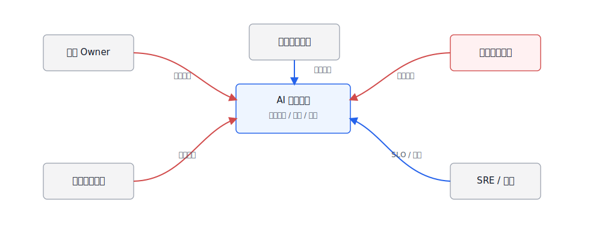
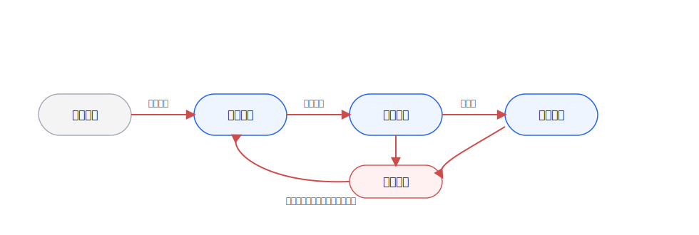
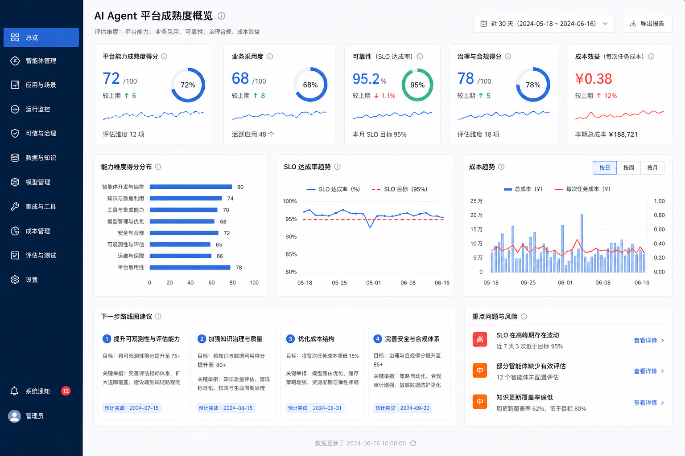

# Ch.53 组织、人才与平台演进路线图

> **状态**：v0.2 初稿
> **本章目标**：读者读完后，能够设计企业 Agent 平台团队职责边界，规划从 PoC 到平台化运营的路径，建立 ROI、SLO 与价值度量，并制定三年演进路线图。
> **关键议题**：AI 平台团队职责边界；PoC 到平台化运营路径；ROI、SLO 与价值度量；人才结构与能力模型；三年平台演进路线图；工程实验：平台成熟度评估表。
> **前置阅读**：Ch.02 企业级 Agent 平台的边界；Ch.04 平台参考架构总览；Ch.22 Agent Runtime；Ch.38 可观测性与 Trace；Ch.50 安全与攻防；Ch.52 合规与法规。
> **估计阅读**：L1 15 min / L1+L2 45 min / 全章 90 min
> **mini-platform 关联**：`mini-platform/core/observability/`、`mini-platform/core/eval/`、`mini-platform/core/policy/`、`mini-platform/projects/`。

**本章阅读路径**

| 读者 | 建议重点 |
|---|---|
| AI 平台负责人 / CTO | 看团队边界、投资节奏、ROI/SLO 和三年路线图。 |
| 架构师 | 看平台能力如何从项目复用走向标准接口、运行治理和组织协同。 |
| 数据智能工程师 | 看 DataAgent 从单点 ChatBI PoC 到语义层、评估和运营闭环的路径。 |
| AI 应用开发者 | 看应用团队与平台团队如何分工，以及哪些能力应该复用 mini-platform。 |
| 安全 / 合规负责人 | 看安全、合规、审计和发布门禁如何嵌入组织流程。 |

企业做 Agent 平台最容易卡在两个极端。一个极端是每个业务团队各做一个 demo，短期热闹，半年后留下几套没人维护的 prompt、脚本和账号；另一个极端是平台团队一开始就追求大而全，做出一套没人愿意接入的“AI 中台”。比较稳的节奏通常从少数高价值场景开始：先证明问题值得做，再把反复出现的 Runtime、工具、评估、安全和观测能力抽成平台，最后用运营指标和治理机制决定继续投入、收敛还是下线。

这一章把技术问题放回组织语境里讨论：谁负责模型、工具、数据、评估、安全和上线；PoC 成功后如何避免变成一次性项目；ROI 和 SLO 怎么度量；团队需要哪些角色；三年路线图如何从单点应用走到企业 AI 原生业务系统。

## AI 平台团队职责边界

AI 平台团队不是“替所有业务写 Agent 的团队”，也不是“采购模型 API 的团队”。它的职责是提供共享能力、接口契约、运行治理和工程基线，让业务团队能更快、更安全地构建 Agent 应用。业务团队仍然要负责业务流程、数据解释、验收标准和运营结果。

职责边界越晚讲清，项目越容易变成“平台团队背所有锅”或“业务团队各自造轮子”。表 53-1 有意把平台、业务、数据、安全和运维拆开，因为这些角色在真实项目里经常混在一起。

**表 53-1：企业 Agent 平台团队职责边界**

| 角色 | 主要责任 | 不应承担的责任 |
|---|---|---|
| AI 平台团队 | Runtime、Tool Registry、RAG、评估、观测、Guardrails、网关和平台规范 | 替所有业务定义流程和业务 KPI |
| 业务应用团队 | 业务场景、用户流程、工具接入、验收样例、上线运营 | 自建一套不可复用的模型网关和安全策略 |
| 数据平台团队 | 数据源、语义层、指标口径、血缘、权限、数据质量 | 让模型直接绕过数据契约访问底层表 |
| 安全合规团队 | 风险分级、红队、内容安全、审计、合规证据和发布门禁 | 只在上线前人工审批，不参与设计阶段 |
| SRE / 运维团队 | SLO、容量、成本、发布、回滚、事故响应 | 只监控基础设施，不看 Agent 任务质量 |
| 业务 Owner | 价值目标、资源投入、流程改造、最终责任 | 把“模型回答得好不好”全部推给平台团队 |

表 53-1 要解决的是责任归属，而不是汇报关系。Agent 平台把模型、数据和工具连接起来后，单个团队很难独立承担全部风险。平台团队提供可复用能力，业务团队给出业务判断，安全合规团队定义风险边界，SRE 负责运行质量。边界不清时，平台团队很容易被当成项目外包；边界画得太硬，平台又会变成无人使用的公共设施。

这种责任共担需要一套协作模型承载。图 53-1 中蓝色是内部平台和业务组件，灰色是外部/横向系统，红色是决策和控制流；它提醒平台负责人，Agent 平台不是单个团队闭门建设的系统。



**图 53-1：AI 平台团队职责边界**

图 53-1 可以按责任流来读。业务 Owner 决定价值和流程边界，数据平台保证数据契约，AI 平台提供可复用运行能力，安全合规定义门禁，SRE 负责运行质量。红色决策流上的空位，通常会在上线后变成具体事故：错误答案无人解释，越权访问无人处理，成本飙升和可用性下降无人负责。

## PoC 到平台化运营路径

PoC 的目标是验证价值，平台化的目标是稳定复用。很多 Agent 项目在演示阶段效果不错，进入生产却走不下去，原因通常在工程路径上：没有评测集，没有安全基线，没有上线 SLO，没有成本模型，也没有数据和工具的版本治理。

PoC 成功后，管理动作不应该只是追加更多 demo，而要进入阶段评审。表 53-2 中的四段路径，对应不同产出、管理方式和退出条件；每个场景都应明确是继续试点、抽象平台能力、进入运营治理，还是因为价值不足而退出。

**表 53-2：从 PoC 到平台化运营的阶段**

| 阶段 | 目标 | 关键产出 | 退出条件 |
|---|---|---|---|
| 场景验证 | 找到真实痛点和可衡量价值 | 业务问题、样例集、人工 baseline、风险初评 | 业务 Owner 愿意投入数据和流程 |
| 工程试点 | 验证端到端链路 | 最小 Agent、工具接入、评估集、trace、权限策略 | 在受控用户群达到质量和安全门槛 |
| 平台复用 | 抽取共享能力 | 通用 Runtime、Tool Registry、RAG、Guardrails、评估和观测 | 第二、第三个场景复用平台能力 |
| 运营治理 | 持续改进和规模化 | SLO、成本看板、红队回归、版本治理、事故响应 | 平台成为业务系统的一部分 |

DataAgent 往往会经历这四个阶段。第一阶段可能只是一个 ChatBI demo；第二阶段要接入语义层、权限和 SQL 评估；第三阶段把 NL2SQL、指标检索、图表和报告能力平台化；第四阶段则要看真实业务采纳、查询成功率、错误修复周期和成本。

这条路径不是单向晋级。图 53-2 保留了回退机制：试点中发现数据质量不够，就回到场景和数据准备；平台复用时出现安全事故，就回到基线和发布门禁。



**图 53-2：PoC 到平台化运营路径**

回退路径给管理层一个现实预期：PoC 演示通过，不等于自动进入生产。数据质量、权限、评估、成本或安全任一条件不满足，都应该回到前一阶段补齐证据。否则平台化会把试点阶段的临时方案复制到更多业务里，后续治理成本反而更高。

## ROI、SLO 与价值度量

Agent 平台的 ROI 不能只看 token 成本，也不能只看节省了多少人力。很多价值来自响应速度、质量稳定性、知识复用、风险降低和流程重构。平台负责人需要同时看价值、质量、成本和风险。

因此，Agent 平台的度量要同时覆盖业务、质量、运行和成本风险。表 53-3 的四组指标，可以避免团队只讲模型准确率，或者只用降本数字证明平台价值。

**表 53-3：Agent 平台价值度量体系**

| 维度 | 指标 | 说明 |
|---|---|---|
| 业务价值 | 使用率、任务完成率、节省时长、收入/转化影响、流程周期缩短 | 判断是否真的进入业务流程 |
| 质量效果 | answer pass rate、tool success rate、citation correctness、SQL execution pass rate | 判断 Agent 是否可靠 |
| 运行质量 | p95 延迟、可用性、错误率、降级率、恢复时间 | 对齐 SRE 和业务体验 |
| 成本风险 | token 成本、GPU/向量库成本、人工复核成本、安全事件、误杀漏杀 | 判断规模化是否可持续 |

SLO 要和场景风险绑定。内部知识问答可以允许更高延迟和更多拒答；客服辅助要关注响应速度和转人工；DataAgent 要关注 SQL 可执行率、引用正确性和数据权限；高风险法务或财务场景要宁可拒答，也不要错误执行。

不同场景的 SLO 也不应该套同一模板。表 53-4 延续前面章节的评估和安全门禁，把 SLO 写成取舍：高风险场景优先质量和人工复核，低风险高频场景才更适合延迟或成本优先。

**表 53-4：Agent 平台 SLO 取舍表**

| 方案 | 优势 | 代价 | 适用场景 | mini-platform 选择 |
|---|---|---|---|---|
| 质量优先 | 降低错误和风险，适合高影响决策 | 延迟和成本更高，拒答更多 | 法务、财务、DataAgent 高风险分析 | 高风险场景默认 |
| 延迟优先 | 体验好，适合高频交互 | 可能减少检索、重排和校验 | 客服辅助、前台 Copilot | 低风险高频场景可选 |
| 成本优先 | 有利于规模化和预算控制 | 可能牺牲质量和可解释性 | 内部低风险知识问答 | 作为降级策略 |
| 人工复核优先 | 责任清晰，风险最低 | 自动化率低，流程变重 | 写入、导出、外部通知、合规结论 | 高风险动作强制 |

## 人才结构与能力模型

企业 Agent 平台需要复合型团队。单靠算法工程师不够，单靠应用开发也不够。团队要同时理解模型、数据、后端、前端、SRE、安全、合规和业务流程。

团队建设要按能力缺口来判断，而不是只看人数。表 53-5 不是要求每个人都会所有事情，而是帮助负责人看清哪些能力已经有人负责，哪些能力还停留在“大家都懂一点”的状态。

**表 53-5：Agent 平台人才能力模型**

| 能力域 | 关键能力 | 常见角色 |
|---|---|---|
| 模型与提示 | 模型选型、prompt、结构化输出、评估、微调边界 | AI 工程师、模型平台工程师 |
| Agent 工程 | Runtime、工具调用、状态机、异步任务、错误恢复 | 后端工程师、Agent 平台工程师 |
| 数据智能 | 语义层、NL2SQL、RAG、指标口径、数据权限 | 数据工程师、数据智能工程师 |
| 产品与交互 | 任务工作台、Generative UI、反馈、人工复核 | 产品经理、前端工程师 |
| 安全合规 | Guardrails、红队、DLP、审计、法规控制矩阵 | 安全工程师、合规负责人 |
| 运行与成本 | SLO、容量、成本、灰度、回滚、事故响应 | SRE、平台运维、FinOps |
| 业务运营 | 场景选择、流程改造、培训、采纳和价值复盘 | 业务 Owner、运营负责人 |

组织上可以从小团队开始，但角色不能缺席。早期一个人可以兼任多项能力，后期再逐步专业化。平台负责人需要盯住的是闭环是否成立：业务提出问题，数据提供证据，平台提供能力，安全定义边界，SRE 保障运行，运营把使用率、失败样例和成本带回下一轮路线图。

## 三年平台演进路线图

三年路线图不应写成“第一年做模型，第二年做平台，第三年做生态”这种口号。更实际的做法是按平台能力成熟度推进：从场景验证，到共享能力，再到治理运营，最后进入 AI 原生业务系统。

不同企业节奏会不同，但能力顺序大体类似：先证明价值，再抽象平台能力，再补运行治理，最后重构业务系统。表 53-6 可以作为这条路线的参考版本，而不是固定模板。

**表 53-6：三年 Agent 平台演进路线图**

| 阶段 | 能力重点 | 组织重点 | 里程碑 |
|---|---|---|---|
| 0-6 个月 | 选 2-3 个高价值场景，建立模型网关、基础 RAG、工具注册、trace 和评估集 | 建立平台小队和业务 Owner 机制 | 第一个生产试点，有质量、安全和成本报告 |
| 6-12 个月 | Runtime、Guardrails、语义层、DataAgent、前端工作台、红队回归 | 建立发布门禁和跨团队评审 | 多个场景复用平台组件，形成标准接入流程 |
| 第 2 年 | 多租户、SLO、成本治理、模型路由、评估平台、合规控制矩阵 | 平台运营化，业务团队自助接入 | Agent 成为若干业务流程的稳定入口 |
| 第 3 年 | AI 原生业务系统、跨 Agent 协作、流程重构、生态工具市场 | 建立平台产品线和持续治理机制 | 从单点 Agent 走向企业级 AI 应用底座 |

路线图最后还要回到能力地图。图 53-3 把能力复用、运行治理、业务价值、安全合规放在同一张图里，是为了防止路线图变成功能堆叠。长期缺少复用，平台会退回项目制；长期缺少治理，平台会放大风险；长期缺少业务价值，平台会失去投入依据。


**图 53-3：三年平台演进路线图**

图 53-3 不应被读成固定工期表，而应被读成能力约束图。第一年如果没有 trace、评估和安全基线，第二年做多租户和自助接入就会放大风险；第二年如果没有 SLO 和成本治理，第三年的业务系统重构就会缺少运营依据。路线图还要保留退出机制：不是所有 Agent 都值得平台化，不是所有业务流程都适合自动化。平台团队应定期淘汰低价值、高风险、低使用率的 Agent，把资源集中到能形成复用能力和业务价值的场景上。

## 工程实验：平台成熟度评估表

Project 20 可以做一个平台成熟度评估表，把本书前面章节的能力转成可评分项。输入是当前平台能力、已上线场景、SLO、评估、安全和合规证据；输出是一份成熟度报告和下一季度路线建议。

建议目录结构如下。

```text
mini-platform/projects/20-platform-maturity-assessment/
├── README.md
├── configs/
│   ├── maturity_model.yaml
│   └── weights.yaml
├── samples/
│   └── platform_snapshot.yaml
├── scripts/
│   ├── score_maturity.py
│   └── generate_roadmap.py
└── reports/
    └── maturity_assessment.md
```

平台快照可以这样记录。

```yaml
platform:
  scenarios:
    production: 3
    pilot: 5
  capabilities:
    model_gateway: true
    tool_registry: true
    rag_pipeline: true
    eval_platform: partial
    guardrails: partial
    compliance_matrix: false
    slo_dashboard: partial
  metrics:
    monthly_active_users: 820
    task_success_rate: 0.72
    p95_latency_seconds: 9.8
    monthly_model_cost_usd: 4200
```

运行命令如下。

```bash
cd mini-platform/projects/20-platform-maturity-assessment
python scripts/score_maturity.py --snapshot samples/platform_snapshot.yaml --out reports/maturity_assessment.md
python scripts/generate_roadmap.py --assessment reports/maturity_assessment.md --quarters 4
```

成熟度报告最好不要只给一个总分。平台负责人需要知道能力短板在哪里、业务采纳是否真实、运行质量是否稳定、治理是否跟上、成本是否可持续。图 53-4 把这些信息组织成平台经营仪表盘，适合放进季度复盘和路线图评审；表 53-7 则把仪表盘背后的报告字段固定下来。



**图 53-4：Agent 平台成熟度仪表盘**

图 53-4 更适合放进季度复盘，而不是项目汇报。领导层先看业务采纳是否真实，再看质量、可靠性、治理和成本是否支撑规模化；如果活跃用户增长很快，但红队回归和合规证据仍停留在 partial，下一季度的优先级就不该继续堆新场景，而要补治理和运行能力。

**表 53-7：平台成熟度评估报告字段**

| 字段 | 说明 |
|---|---|
| Capability score | 模型、数据、Agent、前端、安全、评估、运维能力评分 |
| Business adoption | 上线场景、活跃用户、任务完成率、业务 Owner 覆盖 |
| Reliability score | SLO、事故、恢复时间、降级能力 |
| Governance score | Guardrails、红队、合规矩阵、审计证据 |
| Cost score | token、GPU、向量库、人工复核和单位任务成本 |
| Next roadmap | 下一季度优先补齐的能力和负责人 |

## 本章小结

Agent 平台最终会变成一种组织能力，而不是一次性项目。技术上要建设 Runtime、工具、数据、评估、Guardrails 和观测；组织上要建立平台团队、业务 Owner、安全合规、SRE 和运营之间的协作机制；管理上要用 ROI、SLO 和成熟度评估决定继续投入、收敛或下线。

三年路线图不应只是一张功能清单。更重要的是成熟度跃迁：从 PoC 证明价值，到平台能力复用，到运营治理，再到 AI 原生业务系统。能走到最后的企业，通常不是最早做 demo 的企业，而是更早把 Agent 纳入工程、治理和组织流程的企业。

### 上线检查清单

- [ ] 每个 Agent 场景都有业务 Owner、平台 Owner、安全合规联系人和 SLO。
- [ ] PoC 进入生产前已有评估集、trace、安全基线、成本模型和退出条件。
- [ ] 平台能力能被第二、第三个业务场景复用，而不是一次性项目代码。
- [ ] ROI 同时覆盖业务价值、质量效果、运行质量、成本和风险。
- [ ] 每季度用成熟度评估更新路线图，淘汰低价值和高风险场景。

### 参考资料

- [NIST AI Risk Management Framework](https://www.nist.gov/itl/ai-risk-management-framework)
- [Google Secure AI Framework](https://saif.google/)
- [Microsoft Responsible AI Standard](https://www.microsoft.com/en-us/ai/principles-and-approach)
- [ISO/IEC 42001 AI management system](https://www.iso.org/standard/81230.html)
- [OpenTelemetry Semantic Conventions for GenAI](https://opentelemetry.io/docs/specs/semconv/gen-ai/)
